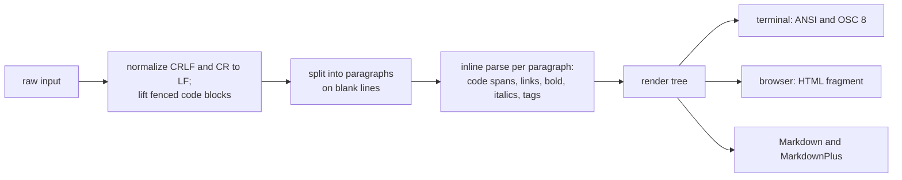

# Prose

Rich text for the **Terminal**, **Browser**, and **Markdown** targets, written
once in a small markup language and rendered through the shared
[`renderable::tree`](../../../renderable/src/tree/mod.rs) render tree.

The markup comes in two components that share one grammar:

- **`Prose`** is **block** content: one or more paragraphs and fenced code
  blocks. Use it for anything printed as its own message: a status message,
  an error body, a document section, a list item.
- **`InlineProse`** is **inline** content: a run of styled text inside a
  line. Use it for table cells, header labels, badges, and values placed
  inside other text.

A string means the same thing in either component; only the shape of the
result differs.

```rust
use biscuit_terminal::prelude::*;

let label = InlineProse::new("Run `md hash` on [the plan](https://example.com/plan)");
let body = Prose::new("First paragraph.\n\nSecond paragraph,\nsame block.");
```

```html
<!-- label.render_html_fragment() -->
Run <code>md hash</code> on <a href="https://example.com/plan">the plan</a>
<!-- body.render_html_fragment() -->
<p>First paragraph.</p><p>Second paragraph, same block.</p>
```

The grammar has two layers that compose freely:

1. **Style tags**: `<bold>text</bold>`, `<red>text</red>`, `<a href="…">…</a>`.
   A style ends at its closing tag, and tags nest.
2. **A Markdown subset**: `[desc](url)`, `**bold**`, `_italics_`, code spans,
   fenced code blocks, and Markdown's newline rules.

A stray `{{…}}` is ordinary literal text on every target.

## Rendering Model

Both components parse their input straight into `renderable::tree::RenderNode`
values and render every target through the shared tree renderers. Neither
carries a component-local rendering format.



The two components differ only in the tree they produce:

| | `Prose` | `InlineProse` |
|---|---|---|
| `render_tree()` | a `Root` of `Paragraph` and `Code` blocks, carrying the `Layout` | one neutral `Span` of phrasing nodes (also when empty) |
| Inline nodes | each paragraph's children | `to_render_nodes()` |
| Paragraph split | yes, on blank lines | no: a blank line is a soft break |
| Fenced code block | a `Code` block | one `InlineCode` value |

## Programmatic Use

**Choosing a component:** if the output is embedded in other text on one line
(a cell, a label, a value), use `InlineProse`; if it is printed as its own
block, use `Prose`.

```rust
use biscuit_terminal::prelude::*;

// Style tags (a style ends at its closing tag)
let prose = Prose::new("<bold>This is bold</bold> and <red>this is red</red>");

// Markdown subset (links, **bold**, _italics_, code spans)
let prose = Prose::new("hit _Esc_ to cancel; run `md hash`, see [docs](https://example.com)");

// Hyperlinks, RGB colors, nesting
let prose = Prose::new(r#"<a href="https://example.com">Click here</a>"#);
let prose = Prose::new("<rgb #ff0000>Red text</rgb>");
let prose = Prose::new("<bold><blue>Bold blue text</blue></bold>");

// Escaping literal characters
let prose = Prose::new(r"\<not a tag\>");

// Text that uses single newlines as line breaks
let prose = Prose::new("Key: value\nOther: value").with_line_breaks(LineBreaks::Hard);

// A different HTML element for each paragraph
let prose = Prose::new("Note text").with_tag(ProseTag::Div);

// Layout (block content only)
let prose = Prose::new("Centered content").with_layout(Layout {
    alignment: Alignment::Center,
    ..Layout::default()
});

// Inline content for a table cell or a label
let cell = InlineProse::new("**ready**: `cargo build`");

let term = Terminal::default();
println!("{}", prose.render(&term));
```

## Paragraphs and Line Breaks

Newlines follow Markdown. One rule per row:

| Input (as written) | Meaning | Terminal | HTML | Markdown |
|---|---|---|---|---|
| `a` newline `b` | soft break | `a b` | `<p>a b</p>` | `a`, newline, `b` |
| `a`, blank line, `b` | new paragraph (`Prose`) | `a`, blank line, `b` | `<p>a</p><p>b</p>` | `a`, blank line, `b` |
| `a\` newline `b` | hard break | `a`, newline, `b` | `<p>a<br>b</p>` | `a\`, newline, `b` |

- **Soft break.** A single newline reflows as a space. Spaces and tabs
  around it are dropped, so `"first  \nsecond"` renders `first second`.
- **Paragraph boundary.** Two or more newlines in a row, with only spaces or
  tabs between them, start a new paragraph. `\n\n` and `\n\n\n\n` are the
  same boundary. Leading and trailing blank lines produce nothing, and empty
  or whitespace-only input renders as empty output.
- **Hard break.** A backslash immediately before a newline is a hard break.
  In a Rust string literal that is `"a\\\nb"` (`\\` is the backslash, `\n`
  the newline). `"a\\nb"` is a backslash followed by the letter `n`, which is
  not a break.
- **Escaped backslash.** `"a\\\\\nb"` (two backslashes, then a newline) is a
  literal backslash followed by the mode's ordinary break.
  Markdown output writes that backslash doubled (`a\\`, then the break), so
  a Markdown reader also sees a literal backslash rather than a hard break.
- **Not a hard break.** A backslash before a blank line or at the end of the
  input stays literal. Trailing spaces never make a hard break; CommonMark's
  two-space form is deliberately unsupported, so other Markdown renderers may
  read such input differently.
- **Windows line endings.** CRLF and a lone CR are read as LF first, so text
  from a Windows file has the same structure.

### Line-break mode

Text that uses single newlines as line breaks (key/value lines, YAML
excerpts) keeps them with `LineBreaks::Hard`, without rewriting the string:

```rust
Prose::new("Key: value\nOther: value").with_line_breaks(LineBreaks::Hard);
InlineProse::new("line one\nline two").with_line_breaks(LineBreaks::Hard);
```

| Mode | A single newline | Two or more newlines in `Prose` | Two or more newlines in `InlineProse` |
|---|---|---|---|
| `Soft` (default) | soft break | paragraph boundary | one soft break |
| `Hard` | hard break | paragraph boundary | one hard break per newline |

The default is the same in both components, so a string means the same thing
in either. Markdown output keeps the meaning but may normalize the spelling;
it is not a byte-for-byte copy of the input.

### Styles across paragraphs

A style tag may span a blank line. Its style continues in each paragraph:
`<red>one\n\ntwo</red>` renders two red paragraphs
(`<p><span style="color:…">one</span></p><p><span style="color:…">two</span></p>`).
Markdown emphasis and Markdown links are recognized within one paragraph
only. A newline inside a quoted tag attribute belongs to the attribute, not
to the paragraph splitter.

## Block Tag

`ProseTag` chooses the HTML element of every paragraph in a `Prose`. The
default is `<p>`.

```rust
let html = Prose::new("one\n\ntwo").with_tag(ProseTag::Div).render_html_fragment().render();
assert_eq!(html, "<div>one</div><div>two</div>");
```

| `ProseTag` | HTML |
|---|---|
| `P` (default) | `<p>` |
| `Div` | `<div>` |
| `Section`, `Article`, `Aside`, `Header`, `Footer` | the matching element |

The tag affects HTML only; terminal and Markdown output are the same whatever
the tag. Code blocks are always `<pre><code>`. Elements that have their own
component (`blockquote`, `li`, `h1`–`h6`) are not tags; use
[`BlockQuote`](block_quote.md), the [lists](list.md), or
[`Section`](section.md).

## Layout

`Prose` carries a `Layout` (margins, padding, width, alignment, word wrap)
and applies it on every target: spaces and blank lines on the terminal, CSS
on the browser. `InlineProse` has no layout builders: inline text is
positioned by the block that contains it.

```rust
let prose = Prose::new("<b>bold</b>").with_left_margin(TargetValue::universal(Length::ch(4)));
```

```text
terminal:  "    bold" (bold)
html:      <div style="…;margin-left:4ch;…"><p><strong>bold</strong></p></div>
```

A vertical margin (`layout.margin.top` / `.bottom`) is blank lines on the
terminal and `lh` units in CSS. Markdown has no layout; `bt prose --md`
carries the horizontal margins as `style:` frontmatter (see [CLI](#cli)).

When a `Prose` is embedded in a block container (a list item, a block
quote), its layout moves onto its own paragraphs, never onto the
container's node. See [Prose in Other Components](#prose-in-other-components).

## Markdown Subset

Four Markdown forms are recognized in addition to style tags, and code spans
are inline code on every target.

| Markdown | Result | Notes |
|---|---|---|
| `[desc](ref)` | a link, `<a href="ref">desc</a>` | The URL is protected from later phases, so `_` in a URL is not emphasis |
| `**text**` | bold | Only the doubled-asterisk form is bold |
| `_text_` | italics | Only the single-underscore form is italic |
| `` `code` `` | inline code | Nothing inside is interpreted |
| `` [`desc`](ref) `` | a link whose text is inline code | |

**Strict subset.** `__bold__` is not bold and `*italics*` is not italic; both
stay literal text. Each emphasis style has exactly one spelling, so authored
intent is unambiguous.

**File link targets.** A link target that is a path rather than a URL
becomes a `file://` URL on every target, which keeps it clickable as an OSC 8
link in the terminal. An absolute path is used as is; `./path` resolves from
the working directory; any other relative path (`plan.md`) resolves from the
nearest package root or the Git repository root, falling back to the working
directory. `http(s)://`, `file://`, and `mailto:` targets are unchanged.

### Code spans

A backtick run opens a code span when a later run of the same length closes
it in the same paragraph; a run with no closer is literal text. The span is
opaque: no emphasis, link, or tag syntax inside it is interpreted, so
`` See `_pr/_report.md`. `` keeps its underscores.

Each target shows the span as code:

| Target | `` run `md hash` now `` |
|---|---|
| Terminal | `run md hash now`, with `md hash` dim (or in the theme's inline-code colors), no backticks |
| HTML | `run <code>md hash</code> now` |
| Markdown | `` run `md hash` now `` |

The span's value follows CommonMark:

| Rule | Input | Value |
|---|---|---|
| Backslashes are literal | `` `a\_b` `` | `a\_b` |
| A newline becomes a space | `` `a ``, newline, `` b` `` | `a b` |
| One space is stripped from each side when both sides have one | `` ` a ` `` | `a` |
| ...which lets a span hold a backtick at its edge | ``` `` `a` `` ``` | `` `a` `` |
| A span never crosses a paragraph boundary | `` `a ``, blank line, `` b` `` | two paragraphs, each with a literal backtick |

The Markdown target picks a fence that is safe for the value: a backtick run
one longer than the longest run inside it, padded with a space when the value
starts or ends with a backtick. ``a`b`` is written ```` ``a`b`` ````.

**Links with code text.** Write `` [`desc`](ref) `` for a link whose label
is code. `` `[desc](ref)` `` is a code span that shows the literal text
`[desc](ref)`. In a darkmatter template, `{{code_link(path)}}` produces the
link-with-code-text form (see darkmatter's expression reference).

### Flanking Rules

An emphasis delimiter opens or closes emphasis only where CommonMark's left- and right-flanking rules allow it. Everywhere else it is **literal text**. This keeps identifiers, env-var names, and file paths from being chewed up by emphasis pre-processing.

- A delimiter can **open** only when it is left-flanking: it is not followed by whitespace, and it is either not followed by punctuation or is preceded by whitespace or punctuation.
- A delimiter can **close** only when it is right-flanking, the mirror image of the rule above.
- An `_` that is both left- and right-flanking opens only after punctuation and closes only before it.
- Neither `_` nor `**` ever opens or closes between two word characters (Unicode alphanumeric). For `**` this is stricter than CommonMark, and deliberate: `foo**bar**baz` stays literal.
- A closer counts only at the tag nesting depth of its opener, so emphasis never straddles a tag boundary and no stray `</i>` or `</b>` can reach the output.

| Input | Output | Why |
|-------|--------|-----|
| `OPENCODE_CONFIG_CONTENT` | `OPENCODE_CONFIG_CONTENT` | Every `_` is intra-word; no opener triggers |
| `foo_bar` | `foo_bar` | Single intra-word `_` |
| `_foo_bar_` | `<i>foo_bar</i>` | Outer `_` flanked by start/end; inner `_` intra-word and skipped |
| `foo**bar**baz` | `foo**bar**baz` | Both `**` runs intra-word |
| `**foo**bar**baz**` | `<b>foo**bar**baz</b>` | Outer `**` flanked; inner pairs intra-word |
| `(_text_)`, `hit _Esc_.` | `<i>text</i>`, `hit <i>Esc</i>.` | Punctuation neighbors form boundaries |
| `**_pr/open.md** and **_pr/triage.md**` | `<b>_pr/open.md</b> and <b>_pr/triage.md</b>` | No later `_` can close the one after `**`, so it stays literal |
| `'_loop_count' in '{{ _loop_count }}'` | unchanged | An `_` after a space cannot close |
| `<b>a _b</b> c_` | unchanged | The closer lies outside the tag that holds the opener |
| `<dim>=OPENCODE_CONFIG_CONTENT</dim>` | unchanged | Tag wrapper preserved; intra-word `_` not triggered inside body |

### Escape Mechanism

Outside code spans, a backslash escapes the immediately following character,
treating it as literal text. Escapable characters are `*`, `_`, `[`, `]`,
`(`, `)`, `<`, `>`, `{`, and `\` itself. Inside a code span backslashes are
literal: `` `a\_b` `` shows `a\_b`.

| Input | Output |
|-------|--------|
| `\_text\_` | `_text_` (literal underscores, no italics) |
| `\*\*not bold\*\*` | `**not bold**` (literal asterisks) |
| `\\` | `\` (literal backslash) |
| `\<not a tag\>` | `<not a tag>` (literal angle brackets) |

**Escape text you did not write as markup.** Author-supplied text (a
frontmatter `description`, a document name), identifiers, paths, and error
messages spliced into a Prose format string must pass through
`Prose::escape_text` (or `InlineProse::escape_text`) first. The flanking rules
make identifier-shaped values safe, but text such as `_draft_` or `**note**`
would still be read as emphasis. Do **not** escape text placed inside a code
span: the span is already opaque, and the escape's backslashes would show.
To put a dynamic value in a code span, fence it with
`renderable::markdown::code_span(value)` instead of writing the backticks by
hand: the fence grows when the value holds a backtick, so the value still
renders as one span.
For a value placed in a tag attribute, use `Prose::quoted_attr` instead.

```rust
let cell = InlineProse::new(format!("<i><dim>{}</dim></i>", Prose::escape_text(description)));
let path = InlineProse::new(format!("written to `{}`", path.display()));
```

### Supported Tags

**Text Styling**: `bold`, `dim`, `italic`, `underline`, `strikethrough`, `blink`, `inverse` (alias `reverse`)

**Colors** (foreground): `red`, `green`, `blue`, `yellow`, `cyan`, `magenta`, `white`, `black`, plus bright variants (`bright-red`, etc.), Tailwind colors (`gray-800`, `blue-400`), and web colors (`coral`, `salmon`)

**Background Colors**: Prefix with `bg-` (e.g., `<bg-blue>`, `<bg-coral>`)

**Special**: `<a href="url">text</a>` for hyperlinks and `<rgb #hex>text</rgb>`
for arbitrary colors. Styles end when their tag closes; there is no
standalone reset token.

**Fenced code blocks** are block content. In `Prose` a fenced block is a code
block (`<pre><code class="language-rust">` in HTML) that sits between
paragraphs; a fenced block inside a style tag stays a sibling block, and the
style resumes after it. In `InlineProse` the same fence becomes one inline
code value: the language hint is dropped and each line ending becomes a
space, so a table cell holding a fence shows `fn main() {} let x = 1;` as
inline code.

> **Removed:** the `<hidden>` tag (SGR 8) is no longer recognized;
> `<hidden>text</hidden>` renders as inert literal text like any unknown tag.
> `<inverse>` / `<reverse>` (SGR 7 reverse video) is supported and lowers to
> `filter: invert(1)` in the browser.

### Cross-Target Rendering

| Target | Trait | Notes |
|--------|-------|-------|
| Terminal | `TerminalRenderable` | ANSI and OSC 8, degraded to what the terminal supports (see [Graceful Degradation](#graceful-degradation)). `Prose` applies its `Layout`. |
| Browser | `BrowserRenderable` | `Prose`: one element per paragraph (the [block tag](#block-tag), default `<p>`), `<pre><code>` for code blocks, and the `Layout` as CSS on a wrapping `<div>` when it is not the default. `InlineProse`: phrasing HTML with no outer element. Both use `<strong>`, `<em>`, `<s>`, `<a>`, `<code>`, and `<span style="…">` for presentational styles. No class is added. User text and attribute values are escaped. |
| Markdown | `MarkdownRenderable` | Portable Markdown keeps semantic styles and degrades color and underline variants to readable text; MarkdownPlus keeps more presentation as inline HTML. A hard break is `\` plus a newline (`<br>` inside a table cell). `InlineProse` output has no trailing paragraph break. |

Both components implement `TreeRenderable`. `Prose::render_tree()` returns
the `Root` of paragraph and code blocks; `InlineProse::render_tree()`
returns a single neutral `Span`. Rendering a component directly and
embedding it in a container use the same parse.

Unknown tags and the removed `{{…}}` token syntax render as escaped literal
text on every target.

### Prose in Other Components

Each container takes the shape that fits it:

| Container | Takes | What happens |
|---|---|---|
| [`Table`](table.md) cells and header labels | `InlineProse` | The cell holds the inline nodes; a fenced block becomes inline code |
| [`InlineContent`](inline_content.md) | `InlineProse` | Inline by definition |
| [`UnorderedList` / `OrderedList`](list.md) items | `Prose` | Each paragraph and code block is a child of the list item |
| [`BlockQuote`](block_quote.md) | `Prose` | Each paragraph is a block inside the quote |
| [`TwoColumn`](two_column.md) columns | `Prose` | Each column is a block region |
| [`StatusBlock`](status.md) `body` / `body_line` | `Prose` | Each item contributes its paragraphs, keeping its `LineBreaks` mode |

An embedded `Prose` never nests a second `Root`. Its layout moves onto its
own blocks: with one block, that block carries the whole layout; with
several, each carries the horizontal box, the first keeps the top edge, and
the last keeps the bottom edge.

`Todo` and `Status` both offer a `from_prose` constructor that renders the
description through Prose at render time, so markup is resolved with full
terminal context:

```rust
use biscuit_terminal::prelude::*;

let todo = Todo::from_prose("review <red>critical</red> PR");
let status = Status::from_prose("this is a <b>test</b>")
    .state(StatusState::Success);
```

### InlineProse in Table Cells

`TableCellContent::StyledInlineProse(Box<InlineProse>)` lets a
[`Table`](../../lib/src/components/table/README.md) cell carry inline markup
without pre-rendering it to terminal bytes during construction. Build a cell
with `InlineProse::new(...).into()`:

```rust
use biscuit_terminal::prelude::*;
use biscuit_terminal::components::table::{Table, TableColumn};

let table = Table::new()
    .with_columns(vec![TableColumn::new("Feature"), TableColumn::new("Status")])
    .with_data(vec: `ready`").into(),
    ]]);
```

- **Render tree** (browser, Markdown, and the terminal tree path): the cell
  holds `InlineProse::to_render_nodes()`, so emphasis, links, inline code,
  and supported styles survive into `<td>` and into the GFM or MarkdownPlus
  table cell. A fenced block in the cell becomes inline code.
- **Terminal table path**: each `StyledInlineProse` cell is rendered to
  styled text exactly once, before column widths are planned, so the table
  measures visible width and styles never bleed into borders, padding, or
  adjacent rows.

**The table owns cell layout.** Column width, alignment, and wrapping come
from the `TableColumn`. A line break inside a cell needs
`.with_line_breaks(LineBreaks::Hard)` (or a `\` before the newline). The cell
hint records `kind == "styled_inline_prose"` with a null `raw_value`.

### Key API

| Method | On | Description |
|--------|----|-------------|
| `::new(text)` | both | Create from markup |
| `.content()` | both | The raw markup string |
| `.with_line_breaks(LineBreaks)` | both | `Soft` (default) or `Hard` single newlines |
| `::escape_text(s)` / `::quoted_attr(s)` | both | Make text safe to splice into markup or a tag attribute |
| `.to_render_nodes()` | `InlineProse` | The parsed inline `RenderNode` sequence |
| `.with_tag(ProseTag)` | `Prose` | HTML element for each paragraph |
| `.with_word_wrap(WordWrap)` | `Prose` | Word-wrap strategy |
| `.with_left_margin(..)` / `.with_right_margin(..)` | `Prose` | Horizontal margins |
| `.with_layout(Layout)` / `.alignment(..)` | `Prose` | Full layout, alignment |
| `.render(&term)` | both | Terminal output |
| `.render_html_fragment()` | both | `Prose`: block HTML (one element per paragraph, code blocks, layout CSS); `InlineProse`: phrasing HTML |
| `.render_markdown()` / `.render_markdown_plus()` | both | Portable Markdown / MarkdownPlus |

## Graceful Degradation

Both components consult the active `Terminal`'s capability profile when they
render and downgrade any markup the terminal cannot display, so
low-capability emulators (Apple Terminal is the usual example) show clean,
readable text instead of escape-code garbage.

Three things degrade: **OSC 8 hyperlinks**, the **double-underline** style,
and **inline code** on a terminal that cannot style.

### OSC 8 Hyperlinks

When `Terminal.osc_link_support == false`, a link emits a Markdown-style
fallback instead of the OSC 8 escape sequence pair. This keeps both the
visible description and the URL on screen.

| Capability | Input | Output |
|------------|-------|--------|
| `osc_link_support == true` | `<a href="https://example.com">click here</a>` | `\x1b]8;;https://example.com\x1b\\click here\x1b]8;;\x1b\\` |
| `osc_link_support == false` | `<a href="https://example.com">click here</a>` | `[click here](https://example.com)` |

The fallback never emits the OSC 8 introducer (`\x1b]8;;`), verified by
Level-1 PTY tests against a spoofed `TERM_PROGRAM=Apple_Terminal` profile.

### Double Underline

When `Terminal.underline_support.double == false`, the `<double-underline>`
tag degrades according to the straight-underline capability:

| `double` | `straight` | Behavior |
|----------|------------|----------|
| `true`   | `true`     | Emit `\x1b[4:2m … \x1b[0m` (double underline) |
| `false`  | `true`     | Emit `\x1b[4m … \x1b[0m` (straight underline) |
| `false`  | `false`    | Emit plain text, no underline SGR codes |

The `\x1b[4:2m` sequence is **never** emitted when the active terminal does not
report double-underline support, verified by Level-1 PTY tests and Level-2
Apple Terminal harness tests.

### Inline Code

Inline code normally drops its backticks and shows the value dim (or in the
theme's inline-code colors). When the terminal emits no styling at all (for
example `ColorDepth::None`), it keeps a backtick fence instead, so the code
is still distinguishable:

| Terminal | `` run `md hash` now `` |
|---|---|
| can style | `run ` + dim `md hash` + ` now` |
| cannot style | `` run `md hash` now `` |

The fence uses the same safe-fence rule as the Markdown target. An OSC 8
link alone does not count as styling. After inline code, the surrounding
style (a red sentence, an enclosing link) continues.

## CLI

Exposed via `bt prose`, which renders its argument as a `Prose`:

```bash
bt prose "<bold>Hello</bold> <red>world</red>"
```

By default `bt prose` renders to the terminal. Pass `--html` to render an
HTML fragment, `--md` to render portable Markdown, or `--md-plus` to render
MarkdownPlus instead:

```bash
bt prose "<bold>Hello</bold> [docs](https://example.com)" --html
bt prose "<bold>Hello</bold> [docs](https://example.com)" --md
bt prose "<purple-800>Dark purple</purple-800>" --md-plus
```

Portable Markdown keeps semantic styling and drops terminal and browser-only
presentation such as colors. MarkdownPlus preserves richer styling with
inline HTML, for example:

```markdown
<span style="color: rgb(107, 33, 168)">Dark purple</span>
```

A code span renders as inline code on each target:

```bash
bt prose 'run `md hash` now' --html
bt prose 'run `md hash` now' --md
```

```html
<p>run <code>md hash</code> now</p>
```

```markdown
run `md hash` now
```

The margin flags (`--margin-left`, `--margin-right`, `--margin-top`,
`--margin-bottom`) set the `Prose`'s own `Layout`, so `--html` output carries
them as CSS on the element `Prose` renders, exactly once:

```bash
bt prose "<b>bold</b>" --margin-left 4 --html
```

```html
<div style="margin-top:0;margin-bottom:0;margin-left:4ch;margin-right:0;padding-top:0;padding-bottom:0;padding-left:0;padding-right:0;overflow-wrap:break-word"><p><strong>bold</strong></p></div>
```

`bt prose` word-wraps by default (`--no-wrap` turns it off), and word wrap is
part of the layout, which is why the CSS above lists every side. With
`--no-wrap` and no layout flags the output is just `<p><strong>bold</strong></p>`.

`--alignment` is the one flag the CLI adds outside the `Prose` element, as a
`<div style="text-align: …">` wrapper (the same as `bt section` and
`bt list`). The shared CSS lowering expresses alignment only as auto margins
on a box with a maximum width, while the terminal centers the lines of a
full-width block.

With `--md` or `--md-plus`, the horizontal margins are written as YAML
frontmatter; vertical margins and alignment have no Markdown form:

```bash
bt prose "<b>bold</b>" --margin-left 4 --md
```

```markdown
---
style:
  page:
    margin-left: 4ch
---

**bold**
```
