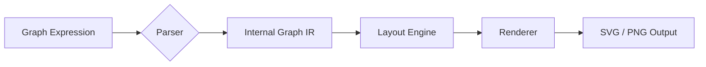
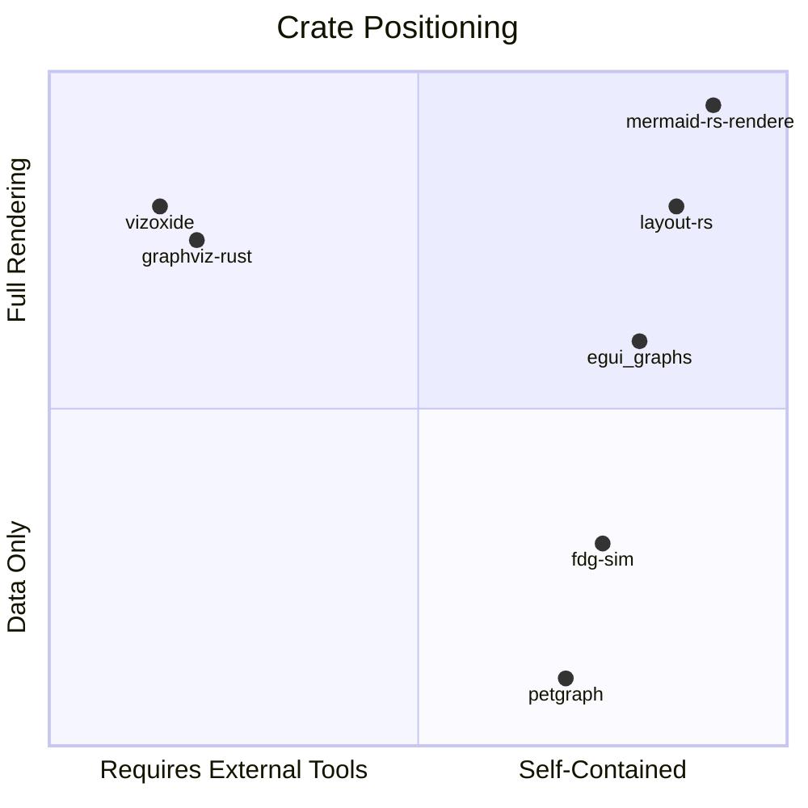
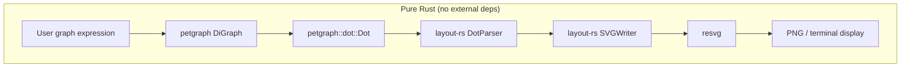

# Visualizing Graph Expressions in Rust

## Problem Statement

MermaidJS excels at converting text into diagrams, but it does not natively support visualizing arbitrary graph expressions (nodes + edges defined programmatically or from a textual graph format like DOT). This document surveys Rust crates that can take a graph — either parsed from text or constructed in code — and render it as a visual image (SVG, PNG, etc.).



## Landscape Overview

The Rust graph visualization ecosystem divides into three tiers:

1. **Full renderers** — parse text, compute layout, and produce images with zero external dependencies
2. **Graphviz wrappers** — parse/generate DOT and shell out to the `dot` binary for rendering
3. **Layout-only / data-structure crates** — compute positions or model graphs but require a separate rendering step



## Comparison Matrix

| Crate | Self-contained | Parses text | SVG | PNG | Layout engine | Downloads | Stars | Last push |
|---|---|---|---|---|---|---|---|---|
| [layout-rs](#layout-rs) | Yes (pure Rust) | DOT | Yes | No | Hierarchical (built-in) | 409K | 726 | 2025-05-22 |
| [mermaid-rs-renderer](#mermaid-rs-renderer) | Yes (pure Rust) | Mermaid | Yes | Yes (feature) | Built-in | 2.7K | 1,085 | 2026-03-09 |
| [graphviz-rust](#graphviz-rust) | No (`dot` binary) | DOT | Yes | Yes | All Graphviz engines | 1M | 87 | 2026-03-09 |
| [vizoxide](#vizoxide) | No (`libgraphviz`) | No | Yes | Yes | All 6 Graphviz engines | 2.7K | 5 | 2026-03-17 |
| [petgraph](#petgraph) | N/A | No | No | No | None (data structure) | 316M | 3,800 | 2025 |
| [fdg-sim](#fdg-sim) | Partial | No | No | No | Force-directed | 29K | 222 | 2025-03-06 |
| [egui_graphs](#egui_graphs) | N/A | No | No | No | 3 built-in | 180K | 661 | 2026-02-27 |

---

## Tier 1: Full Graph Renderers

These crates parse text input, compute layout, and produce image output — no external binaries required.

---

### layout-rs

> Pure-Rust DOT parser + hierarchical layout engine + SVG renderer. Zero required dependencies.

| | |
|---|---|
| **Crate** | [layout-rs](https://crates.io/crates/layout-rs) v0.1.3 |
| **Repository** | [nadavrot/layout](https://github.com/nadavrot/layout) |
| **Docs** | [docs.rs/layout-rs](https://docs.rs/layout-rs) |
| **License** | MIT |
| **Downloads** | 408,576 |
| **Stars** | 726 |
| **Last push** | 2025-05-22 |

#### Functional Footprint

- Parses Graphviz DOT format into an AST
- Computes hierarchical/topological layout (similar to Graphviz's `dot` engine)
- Renders to SVG via a built-in `SVGWriter` backend
- Supports node shapes: Box, Circle, DoubleCircle, Record
- Supports edge labels, ports, LR/TB orientation, unicode/emoji
- Extensible via the public `RenderBackend` trait

#### Features

| Feature | Default | Description |
|---------|---------|-------------|
| `log` | No | Enables debug logging via the `log` crate |

The crate has **zero required dependencies** — it is entirely self-contained.

#### Output Formats

- **SVG** (vector) via `SVGWriter`
- No built-in raster output — use [resvg](https://crates.io/crates/resvg) to convert SVG to PNG

#### Text Deserialization

**Yes.** The `gv` module provides a full DOT parser:

- `DotParser` — parses DOT strings into an AST
- `GraphBuilder` — converts the AST into a renderable `VisualGraph`

Supports: node shapes, edge styles, records, orientation, ports. Does not support nested subgraphs or HTML labels.

#### Public API Modules

| Module | Purpose |
|--------|---------|
| `gv` | DOT parsing (`DotParser`, `GraphBuilder`, `Lexer`) |
| `topo` | Layout engine (`VisualGraph` — the central type) |
| `backends` | Rendering (`SVGWriter`, `RenderBackend` trait) |
| `std_shapes` | Shape definitions (`ShapeKind`, `Arrow`, `RecordDef`) |
| `core` | Geometry, styling, orientation, color |
| `adt` | Data structures (`DAG`, `NodeHandle`) |

#### Examples

**Example 1: Parse a DOT string and render to SVG**

The most common use case — take a DOT graph definition and produce an SVG image file.

```rust
use layout::backends::svg::SVGWriter;
use layout::gv::{DotParser, GraphBuilder};

fn render_dot_to_svg(dot_source: &str) -> String {
    // Stage 1: Parse DOT text into an AST
    let mut parser = DotParser::new(dot_source);
    let tree = parser.process().expect("invalid DOT syntax");

    // Stage 2: Build a visual graph with layout metadata
    let mut vg = GraphBuilder::build_visual_graph(&tree);

    // Stage 3: Compute layout and render to SVG
    let mut svg = SVGWriter::new();
    vg.do_it(false, false, false, &mut svg);

    svg.finalize()
}

fn main() {
    let dot = r#"
        digraph {
            rankdir=LR
            A [shape=box label="Start"]
            B [shape=circle label="Process"]
            C [shape=doublecircle label="End"]
            A -> B [label="step 1"]
            B -> C [label="step 2"]
        }
    "#;

    let svg_content = render_dot_to_svg(dot);
    std::fs::write("output.svg", &svg_content).unwrap();
}
```

**Example 2: Build a graph programmatically (no DOT parsing)**

When the graph structure comes from your own data — a dependency tree, a state machine, etc.

```rust
use layout::backends::svg::SVGWriter;
use layout::core::base::Orientation;
use layout::core::geometry::Point;
use layout::core::style::StyleAttr;
use layout::std_shapes::shapes::{Arrow, Element, ShapeKind};
use layout::topo::layout::VisualGraph;

fn main() {
    let mut vg = VisualGraph::new(Orientation::LeftToRight);

    let style = StyleAttr::simple();
    let size = Point::new(120.0, 50.0);

    // Add nodes with box shapes
    let node_a = vg.add_node(
        Element::create(ShapeKind::new_box("Parser"), style.clone(), Orientation::LeftToRight, size),
    );
    let node_b = vg.add_node(
        Element::create(ShapeKind::new_box("Layout"), style.clone(), Orientation::LeftToRight, size),
    );
    let node_c = vg.add_node(
        Element::create(ShapeKind::new_box("Render"), style.clone(), Orientation::LeftToRight, size),
    );

    // Connect nodes with labeled edges
    let arrow = Arrow::simple("transforms");
    vg.add_edge(arrow.clone(), node_a, node_b);
    vg.add_edge(arrow, node_b, node_c);

    // Render
    let mut svg = SVGWriter::new();
    vg.do_it(false, false, false, &mut svg);
    std::fs::write("pipeline.svg", svg.finalize()).unwrap();
}
```

**Example 3: Convert SVG output to PNG using resvg**

Since `layout-rs` only outputs SVG, pair it with `resvg` (already in this monorepo) for raster output.

```rust
use layout::backends::svg::SVGWriter;
use layout::gv::{DotParser, GraphBuilder};

fn dot_to_png(dot_source: &str, png_path: &str) {
    // Render to SVG first
    let mut parser = DotParser::new(dot_source);
    let tree = parser.process().unwrap();
    let mut vg = GraphBuilder::build_visual_graph(&tree);
    let mut svg = SVGWriter::new();
    vg.do_it(false, false, false, &mut svg);
    let svg_data = svg.finalize();

    // Rasterize with resvg
    let options = usvg::Options::default();
    let tree = usvg::Tree::from_str(&svg_data, &options).unwrap();
    let size = tree.size().to_int_size();
    let mut pixmap = tiny_skia::Pixmap::new(size.width(), size.height()).unwrap();
    resvg::render(&tree, tiny_skia::Transform::default(), &mut pixmap.as_mut());
    pixmap.save_png(png_path).unwrap();
}
```

---

### mermaid-rs-renderer

> Pure-Rust Mermaid diagram renderer. Parses Mermaid syntax natively, supports 23 diagram types, 100–1400x faster than mermaid-cli.

| | |
|---|---|
| **Crate** | [mermaid-rs-renderer](https://crates.io/crates/mermaid-rs-renderer) v0.2.1 |
| **Repository** | [1jehuang/mermaid-rs-renderer](https://github.com/1jehuang/mermaid-rs-renderer) |
| **Docs** | [docs.rs/mermaid-rs-renderer](https://docs.rs/mermaid-rs-renderer) |
| **License** | MIT |
| **Downloads** | 2,688 |
| **Stars** | 1,085 |
| **Last push** | 2026-03-09 |

#### Functional Footprint

- Parses Mermaid syntax natively (no JavaScript, no Chromium)
- Computes layout internally
- Renders to SVG (always available) and PNG (optional feature via resvg)
- Supports 23 diagram types: flowchart, sequenceDiagram, classDiagram, stateDiagram-v2, erDiagram, pie, gantt, journey, timeline, mindmap, gitGraph, xychart-beta, quadrantChart, sankey-beta, kanban, C4Context, block-beta, architecture-beta, requirementDiagram, zenuml, packet-beta, radar-beta, treemap
- Exposes a staged pipeline API for fine-grained control (parse → layout → render)
- CLI binary (`mmdr`) can extract Mermaid blocks from Markdown files

#### Features

| Feature | Default | Description |
|---------|---------|-------------|
| `cli` | Yes | Enables `mmdr` CLI binary via `clap` |
| `png` | Yes | Enables PNG output via `resvg` 0.46 + `usvg` 0.46 |

Use `default-features = false` for SVG-only library embedding (~80 vs ~180 transitive deps).

#### Output Formats

- **SVG** (vector) — always available
- **PNG** (raster) — with the `png` feature, via resvg/usvg

#### Text Deserialization

**Yes.** Native Mermaid syntax parser. This is the closest thing to "MermaidJS but in Rust." The parser produces a `Graph` IR that feeds into the layout and rendering stages.

#### Limitations

- Early development (v0.2.x) — API may change
- Visual fidelity may not match mermaid-cli in all diagram types (no browser rendering engine)
- Performance advantage decreases for 200+ node diagrams

#### Examples

**Example 1: One-liner SVG render**

The simplest possible usage — pass a Mermaid string, get SVG back.

```rust
use mermaid_rs_renderer::render;

fn main() {
    let svg = render("flowchart LR; A[Input] --> B[Process] --> C[Output]").unwrap();
    std::fs::write("flow.svg", &svg).unwrap();
}
```

**Example 2: Custom layout options with PNG output**

Fine-tune spacing and export as PNG for embedding in documents or terminals.

```rust
use mermaid_rs_renderer::{render_with_options, RenderOptions};

fn main() {
    let diagram = r#"
        stateDiagram-v2
            [*] --> Idle
            Idle --> Processing: start
            Processing --> Done: complete
            Processing --> Error: fail
            Error --> Idle: retry
            Done --> [*]
    "#;

    let options = RenderOptions::modern()
        .with_node_spacing(60.0)
        .with_rank_spacing(80.0);

    let svg = render_with_options(diagram, options).unwrap();
    std::fs::write("state-machine.svg", &svg).unwrap();
}
```

**Example 3: Staged pipeline with performance timing**

When you need to control each stage independently — useful for caching layouts or measuring performance.

```rust
use mermaid_rs_renderer::{
    parse_mermaid, compute_layout_with_metrics, render_svg,
    write_output_png, Theme, LayoutConfig,
};

fn main() {
    let diagram = r#"
        erDiagram
            USER ||--o{ ORDER : places
            ORDER ||--|{ LINE_ITEM : contains
            LINE_ITEM }|--|| PRODUCT : references
    "#;

    // Stage 1: Parse
    let parsed = parse_mermaid(diagram).unwrap();

    // Stage 2: Layout (with metrics)
    let theme = Theme::modern();
    let config = LayoutConfig::default();
    let (layout, metrics) = compute_layout_with_metrics(&parsed.graph, &theme, &config);
    println!("Layout computed in {:.2}ms", metrics.total_ms());

    // Stage 3a: SVG output
    let svg = render_svg(&layout, &theme, &config);
    std::fs::write("er-diagram.svg", &svg).unwrap();

    // Stage 3b: PNG output (requires `png` feature)
    let path = std::path::Path::new("er-diagram.png");
    write_output_png(&layout, &theme, &config, path);
}
```

---

## Tier 2: Graphviz Wrappers

These crates parse/generate DOT but require an external Graphviz installation for rendering.

---

### graphviz-rust

> DOT parser, macro-based DSL, and Graphviz execution wrapper. The most downloaded graph visualization crate in the ecosystem.

| | |
|---|---|
| **Crate** | [graphviz-rust](https://crates.io/crates/graphviz-rust) v0.9.7 |
| **Repository** | [besok/graphviz-rust](https://github.com/besok/graphviz-rust) |
| **Docs** | [docs.rs/graphviz-rust](https://docs.rs/graphviz-rust) |
| **License** | MIT |
| **Downloads** | 1,038,882 |
| **Stars** | 87 |
| **Last push** | 2026-03-09 |

#### Functional Footprint

- Full DOT parser (via pest PEG grammar) — bidirectional: parse DOT to structs, print structs to DOT
- Macro-based DSL for programmatic graph construction (`graph!`, `node!`, `edge!`, `subgraph!`)
- Type-safe Graphviz attributes (~150 attribute structs)
- Rendering by shelling out to the system `dot` binary
- Supports all Graphviz layout engines: Dot, Neato, Twopi, Circo, Fdp, Sfdp, Patchwork
- Re-exports companion crates: `dot-structures`, `dot-generator`, `into-attr`

#### Features

| Feature | Default | Description |
|---------|---------|-------------|
| `graphviz-exec` | Yes | Enables `cmd` module for calling the external `dot` binary |

Use `default-features = false` for DOT parsing/generation only (no rendering).

#### Output Formats (via Graphviz binary)

- **Vector**: SVG, PDF, PS, EPS
- **Raster**: PNG, JPEG, GIF, BMP
- **Text**: DOT, XDOT, JSON, Plain
- 55 total formats supported (anything Graphviz supports)

#### Text Deserialization

**Yes.** Full DOT parser via `parse()`. Round-trips cleanly: parse DOT → manipulate structs → print DOT.

#### Examples

**Example 1: Parse DOT, modify, and render**

Parse an existing DOT definition, add a node, and render to SVG — common when augmenting generated graphs.

```rust
use graphviz_rust::{parse, exec, print};
use graphviz_rust::dot_generator::*;
use graphviz_rust::dot_structures::*;
use graphviz_rust::cmd::{CommandArg, Format};
use graphviz_rust::printer::PrinterContext;

fn main() {
    // Parse existing DOT
    let mut graph = parse(r#"
        digraph {
            rankdir=LR
            A -> B
            B -> C
        }
    "#).unwrap();

    // Add a new node and edge
    match &mut graph {
        Graph::DiGraph { stmts, .. } => {
            stmts.push(stmt!(node!("D"; attr!("color", "red"))));
            stmts.push(stmt!(edge!(node_id!("C") => node_id!("D"))));
        }
        _ => {}
    }

    // Render to SVG (requires `dot` binary installed)
    let svg_bytes = exec(
        graph,
        &mut PrinterContext::default(),
        vec![CommandArg::Format(Format::Svg)],
    ).unwrap();

    std::fs::write("modified.svg", &svg_bytes).unwrap();
}
```

**Example 2: Build a graph from scratch with macros**

The macro DSL is ergonomic for constructing graphs entirely in code.

```rust
use graphviz_rust::dot_generator::*;
use graphviz_rust::dot_structures::*;
use graphviz_rust::{exec, print};
use graphviz_rust::cmd::{CommandArg, Format, Layout};
use graphviz_rust::printer::PrinterContext;

fn main() {
    let g = graph!(strict di id!("dependency_tree");
        node!("tokio"; attr!("shape", "box"), attr!("style", "filled"), attr!("fillcolor", "lightblue")),
        node!("hyper"; attr!("shape", "box")),
        node!("axum"; attr!("shape", "box")),
        node!("tower"; attr!("shape", "box")),
        edge!(node_id!("axum") => node_id!("hyper") ; attr!("label", "uses")),
        edge!(node_id!("axum") => node_id!("tower")),
        edge!(node_id!("hyper") => node_id!("tokio")),
        edge!(node_id!("tower") => node_id!("tokio"))
    );

    // Print as DOT text (no external tools needed)
    let dot_text = print(g.clone(), &mut PrinterContext::default());
    println!("{dot_text}");

    // Render to PNG with hierarchical layout
    let png_bytes = exec(
        g,
        &mut PrinterContext::default(),
        vec![
            CommandArg::Format(Format::Png),
            CommandArg::Layout(Layout::Dot),
        ],
    ).unwrap();

    std::fs::write("deps.png", &png_bytes).unwrap();
}
```

**Example 3: DOT-only usage (no external binary)**

When you only need to generate or parse DOT text — disable the default feature.

```toml
# Cargo.toml
[dependencies]
graphviz-rust = { version = "0.9", default-features = false }
```

```rust
use graphviz_rust::{parse, print};
use graphviz_rust::printer::PrinterContext;

fn roundtrip_dot(input: &str) -> String {
    let graph = parse(input).expect("invalid DOT");
    print(graph, &mut PrinterContext::default())
}

fn main() {
    let original = "digraph { a -> b; b -> c; }";
    let normalized = roundtrip_dot(original);
    println!("{normalized}");
    // Can pipe this to `dot -Tsvg` externally, or feed to layout-rs
}
```

---

### vizoxide

> Idiomatic Rust wrapper around Graphviz's C API. Builder-pattern graph construction with access to all six layout engines and the widest output format support.

| | |
|---|---|
| **Crate** | [vizoxide](https://crates.io/crates/vizoxide) v1.0.5 |
| **Repository** | [19h/vizoxide](https://github.com/19h/vizoxide) |
| **Docs** | [docs.rs/vizoxide](https://docs.rs/vizoxide) |
| **License** | MIT |
| **Downloads** | 2,696 |
| **Stars** | 5 |
| **Last push** | 2026-03-17 |

#### Functional Footprint

- High-level builder-pattern API wrapping Graphviz's C library (via FFI)
- Access to all six Graphviz layout engines: Dot, Neato, Fdp, Circo, Twopi, Sfdp
- Widest output format support of any crate
- Links against `libgraphviz` at build time (not a runtime binary dependency)

#### Features

No documented Cargo features beyond the defaults.

#### Output Formats

- **Vector**: SVG, PDF, PS, EPS
- **Raster**: PNG, JPEG, GIF, BMP
- **Text**: DOT, XDOT, JSON, Plain

#### Text Deserialization

**No.** Programmatic builder pattern only. Does not parse DOT files. You would need to pair it with a DOT parser (like `graphviz-rust` with `default-features = false`) or build your own deserialization.

#### Limitations

- Requires `libgraphviz` C library installed (`brew install graphviz` on macOS, `apt install libgraphviz-dev` on Linux)
- Very low adoption (5 stars, 2.7K downloads)
- Limited documentation

#### Examples

**Example 1: Simple directed graph**

```rust
use vizoxide::{Graphviz, GraphType, Layout, Format};

fn main() -> Result<(), Box<dyn std::error::Error>> {
    let mut g = Graphviz::new("example", GraphType::Directed)?;

    let a = g.add_node("A")?;
    let b = g.add_node("B")?;
    let c = g.add_node("C")?;

    g.add_edge(&a, &b)?;
    g.add_edge(&b, &c)?;
    g.add_edge(&a, &c)?;

    g.set_layout(Layout::Dot)?;
    let svg = g.render(Format::Svg)?;
    std::fs::write("triangle.svg", &svg)?;

    Ok(())
}
```

**Example 2: Multiple layout engines**

Vizoxide's strength is easy access to all Graphviz layout engines — useful for comparing how the same graph looks with different algorithms.

```rust
use vizoxide::{Graphviz, GraphType, Layout, Format};

fn render_with_layout(layout: Layout, filename: &str) -> Result<(), Box<dyn std::error::Error>> {
    let mut g = Graphviz::new("network", GraphType::Undirected)?;

    // Create a small network
    for name in ["server", "db", "cache", "web", "worker"] {
        g.add_node(name)?;
    }
    // ... add edges ...

    g.set_layout(layout)?;
    let png = g.render(Format::Png)?;
    std::fs::write(filename, &png)?;
    Ok(())
}

fn main() -> Result<(), Box<dyn std::error::Error>> {
    render_with_layout(Layout::Dot, "network-hierarchical.png")?;
    render_with_layout(Layout::Neato, "network-spring.png")?;
    render_with_layout(Layout::Circo, "network-circular.png")?;
    Ok(())
}
```

---

## Tier 3: Layout-Only and Data-Structure Crates

These crates do not produce image output directly but are commonly part of a graph visualization pipeline.

---

### petgraph

> The dominant graph data structure crate. Not a renderer, but most visualization crates accept petgraph graphs.

| | |
|---|---|
| **Crate** | [petgraph](https://crates.io/crates/petgraph) v0.8.3 |
| **Repository** | [petgraph/petgraph](https://github.com/petgraph/petgraph) |
| **Docs** | [docs.rs/petgraph](https://docs.rs/petgraph) |
| **License** | MIT OR Apache-2.0 |
| **Downloads** | 316M |
| **Stars** | 3,800 |

**Role in visualization**: petgraph exports DOT format via `petgraph::dot::Dot`, which can then be piped to `layout-rs`, `graphviz-rust`, or the system `dot` binary.

```rust
use petgraph::graph::DiGraph;
use petgraph::dot::{Dot, Config};

let mut graph = DiGraph::new();
let a = graph.add_node("Start");
let b = graph.add_node("End");
graph.add_edge(a, b, "transition");

// Produces DOT text — feed to layout-rs or graphviz-rust for rendering
let dot_output = format!("{:?}", Dot::with_config(&graph, &[Config::EdgeNoLabel]));
```

---

### fdg-sim

> Force-directed graph layout engine. Computes node positions using Fruchterman-Reingold simulation.

| | |
|---|---|
| **Crate** | [fdg-sim](https://crates.io/crates/fdg-sim) v0.9.1 |
| **Repository** | [grantshandy/fdg](https://github.com/grantshandy/fdg) |
| **Docs** | [docs.rs/fdg-sim](https://docs.rs/fdg-sim) |
| **License** | MIT |
| **Downloads** | 29,177 |
| **Stars** | 222 |
| **Last push** | 2025-03-06 |

**Role in visualization**: Takes a petgraph graph, runs force-directed simulation, outputs node coordinates. You supply the rendering (e.g., generate SVG manually, or use resvg). Useful when you want organic-looking layouts (network topologies, social graphs) rather than hierarchical ones.

---

### egui_graphs

> Interactive graph widget for egui. Drag, zoom, and click on nodes in a live GUI.

| | |
|---|---|
| **Crate** | [egui_graphs](https://crates.io/crates/egui_graphs) v0.29.0 |
| **Repository** | [blitzarx1/egui_graphs](https://github.com/blitzarx1/egui_graphs) |
| **Docs** | [docs.rs/egui_graphs](https://docs.rs/egui_graphs) |
| **License** | MIT |
| **Downloads** | 179,507 |
| **Stars** | 661 |
| **Last push** | 2026-02-27 |

**Role in visualization**: For live, interactive graph exploration in a desktop GUI. Supports Random, Hierarchical, and Force-directed layouts. Wraps petgraph. **Not suitable for static image generation** — designed for real-time GUI rendering via egui.

---

## Recommendations

### For visualizing graph expressions in biscuit-terminal

Given that `biscuit-terminal` already depends on `resvg` for SVG-to-raster conversion, here are the most practical paths:

| Goal | Recommended crate(s) | Why |
|------|----------------------|-----|
| Parse DOT text → render image | **layout-rs** + resvg | Pure Rust, zero external deps, DOT parser built in, SVG output feeds directly into resvg |
| Parse Mermaid text → render image | **mermaid-rs-renderer** | Pure Rust, 23 diagram types, SVG + PNG built in |
| Maximum format/engine flexibility | **graphviz-rust** | Most mature (1M+ downloads), all Graphviz engines, but requires `dot` binary |
| Graph data structure → DOT → image | **petgraph** → layout-rs | Use petgraph for algorithms, export DOT, render with layout-rs |

### Integration sketch



The **layout-rs + resvg** combination integrates naturally with the existing monorepo dependencies and requires no external binaries. If richer diagram types beyond node-and-edge graphs are needed (sequence diagrams, ER diagrams, state machines), **mermaid-rs-renderer** covers those at the cost of being a younger project (v0.2.x).
