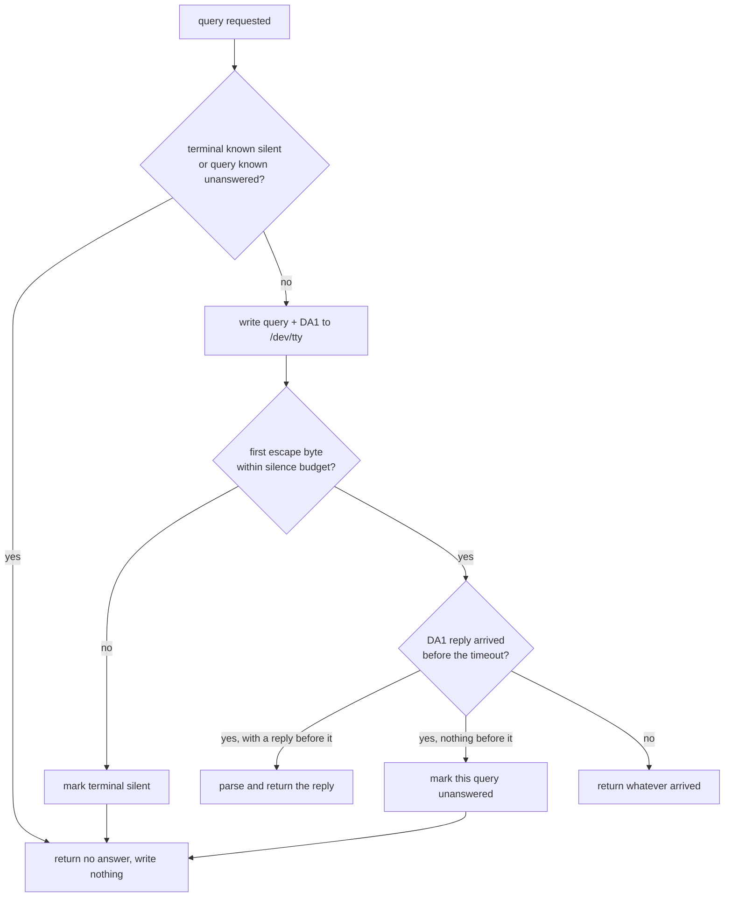

# Live Terminal Queries

Some facts about a terminal can only be learned by asking it: the background
and foreground colors (OSC 11 / OSC 10), the cursor color (OSC 12), the window
size in pixels (CSI 14 t), and the cursor position (DSR, `CSI 6 n`).
`biscuit-terminal` asks by writing an escape sequence to `/dev/tty` and reading
the reply. This page describes what that costs and when it is skipped.

## What you can rely on

- **A terminal that never answers costs one short wait per process.** The
  first query waits at most 500 ms for any reply. If nothing arrives, the
  terminal is recorded as silent, and every later query in the process returns
  "no answer" at once without writing anything to the terminal. The budget is
  not shorter because real terminals can be slow to answer: WezTerm was
  measured replying in 170-200 ms.
- **A terminal that answers, but not this question, costs no wait.** Each
  query is followed by a DA1 request (`CSI c`, "who are you?"), which
  virtually every terminal answers. Terminals reply in order, so once the DA1
  reply arrives, anything the terminal was going to say about the query has
  already arrived. A query left unanswered at that point is not sent again in
  this process.
- **No busy waiting.** Reads block in `select(2)` until a byte arrives or the
  deadline passes.
- **Colors are asked once.** `bg_color()` and `text_color()` share a single
  request (`OSC 10 ; ?` and `OSC 11 ; ?` in one write) whose result is cached
  for the life of the process, so building many `Terminal` values costs one
  exchange.

```text
silent pty, whole process:   ESC]10;?  ESC]11;?  ESC[c      <- written once, 500 ms wait
                             (cell size, cursor position: nothing written)

terminal that answers DA1:   ESC]10;?  ESC]11;?  ESC[c   -> ESC[?62;22c   (no wait)
                             ESC[14t   ESC[c             -> ESC[?62;22c   (no wait, never re-sent)
```

## How one query runs



## When queries are skipped entirely

No query is written when stdout is not a TTY, when running in CI, or (for
colors and cursor position) inside tmux, Zellij, or GNU Screen. `bg_color()`,
`text_color()`, and `cursor_color()` also query only terminals known to answer
color queries (Kitty, WezTerm, iTerm2, Alacritty, Ghostty, Foot, Contour) and
otherwise fall back to `COLORFGBG` and per-terminal defaults. Native Windows
sends no live queries; the functions return `None` immediately.

## Timing knobs

| Situation | Wait for the first reply byte | Whole exchange |
|-----------|-------------------------------|----------------|
| Local session | 500 ms | the query's timeout (1 s for colors and cursor position, 100 ms for window pixels) |
| SSH or Mosh session | the query's timeout | the query's timeout |
| `BISCUIT_TERMINAL_QUERY_SILENCE_MS=<ms>` set | `<ms>`, capped at the query's timeout | the query's timeout |

The environment variable is for slow links the SSH/Mosh check cannot see
(for example a container shell over a remote connection), and for tests that
manufacture replies on a busy host.

A reply that arrives after the library has stopped waiting is read by whatever
reads the terminal next, typically the shell, and shows up as stray characters
at the prompt. A longer silence budget makes that less likely on a slow link.

## Stray input

Bytes that are not part of an escape sequence (typeahead, or the `^D` some pty
hosts inject when their input closes) do not count as a reply, so they neither
extend the wait nor keep a silent terminal from being recorded as silent. They
are consumed by the query, as they were before.
