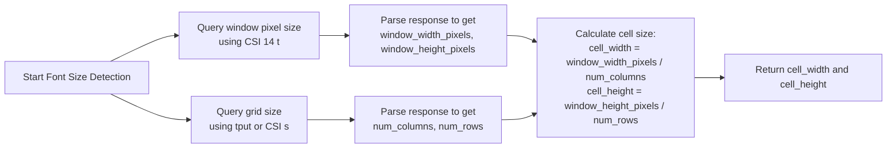

Detecting a terminal's font, font size, and whether it supports ligatures is a nuanced task because **there's no universal standard** for querying this information directly. Terminals vary widely in their capabilities and the control sequences they support. This guide will take you deep into the methods, challenges, and practical approaches.

---

## 🧠 1. Understanding the Core Challenge

Terminal emulators are fundamentally designed to display text using a grid of characters. While they manage fonts internally, they **rarely expose this detailed information** through standardized escape sequences that applications can query. The primary reasons are:

*   **Lack of Standardization**: The ANSI/VT100 standards, which form the basis of most terminal communication, define commands for cursor movement, colors, and screen manipulation, but **not for font introspection**.
*   **Security and Privacy Concerns**: Allowing arbitrary applications to query detailed font settings could potentially be used for fingerprinting or other undesirable tracking.
*   **Historical Design**: Terminals were originally hardware devices with fixed fonts. The concept of a user-configurable, queryable font is a relatively modern feature of software emulators.

Therefore, we often rely on **indirect methods, heuristics, and terminal-specific extensions** to make educated guesses or query this information.

---

## 🔍 2. Detecting the Terminal Font Family

Detecting the *exact* font family (e.g., "JetBrains Mono", "Fira Code", "SF Mono") is the most challenging part. There is no standard escape sequence for this.

### 2.1. Indirect Methods & Heuristics

The most common approach is **not to detect it directly**, but to:

*   **Assume a Monospace Font**: Terminal applications are designed for monospace fonts. You can safely assume the font is monospace.
*   **User Configuration**: Ask the user to specify the font in your application's config file. This is the most reliable method.
*   **Environment Variables**: Check for environment variables that *might* hint at the terminal or font, though this is unreliable. Example: `TERM_PROGRAM` (iTerm2, Terminal.app), `TERMINAL_EMULATOR` (some terminals).

| Method | Description | Reliability |
| :--- | :--- | :--- |
| **Assume Monospace** | All terminal apps use a monospace font. | ⭐⭐⭐⭐⭐ (Fundamental assumption) |
| **User Configuration** | Provide a config option for the user to set the font. | ⭐⭐⭐⭐⭐ (Most reliable and user-friendly) |
| **Env Variables** | Check `TERM_PROGRAM`, `TERMINAL_EMULATOR`, etc. | ⭐☆☆☆☆ (Highly unreliable, often unset) |
| **Terminal Detection** | Identify the terminal emulator (e.g., iTerm2, kitty) and make assumptions about its default font. | ⭐⭐☆☆☆ (Requires a mapping of terminal → default font, which is fragile) |

### 2.2. Terminal-Specific Extensions (If Available)

Some **modern terminal emulators** have added **proprietary escape sequences** to query information about themselves, which might include font details. This is non-standard and won't work everywhere.

*   **kitty**: Uses the `kitty +runpy` command or queries via its socket interface for detailed information, but not via a simple escape sequence.
*   **iTerm2**: Has a **proprietary escape sequence** `OSC 1337 ; FrontEndName = <value> ST` to set/get front-end properties. However, querying the *font* directly is not a standard feature of this sequence. It's more commonly used for other things like setting the profile or window title.
*   **WezTerm**: Provides a powerful Lua configuration and API, but querying the font back to the shell isn't a primary use case.

> 💡 **Conclusion for Font Family**: **Don't try to detect the font family programmatically.** It's an exercise in frustration. Instead, **assume a monospace font** and provide **user configuration options** for customizing it. This is the standard practice for terminal UI libraries like `tcell`, `termbox`, or libraries in Rust/Go.

---

## 📏 3. Detecting the Terminal Font Size

While detecting the font *family* is hard, detecting the **cell size** (which is directly related to font size) is **much more feasible**. The cell size is the width and height of a single character cell in pixels. This is crucial for applications that need to align graphics or text precisely.

### 3.1. The Primary Method: `XTWINOPS` (CSI `14` t)

The most widely supported escape sequence for this is part of the `XTWINOPS` (xterm window operations) extension. You can query the window's size in **pixels** using the `CSI 14 t` sequence. The terminal will respond with its size in characters and pixels.

```bash
# Query the terminal size in pixels
printf '\033[14t'
```

The terminal will respond with a sequence like:
```
\033[4; height; width t
```
or
```
\033[4; rows; cols; height; width t
```

*   `height`, `width`: The window's size in pixels.
*   `rows`, `cols`: The window's size in characters (cells).

**Here's the key insight:** You can calculate the **average cell size** in pixels by dividing the pixel dimensions by the character dimensions:

```
cell_width_pixels = window_width_pixels / number_of_columns
cell_height_pixels = window_height_pixels / number_of_rows
```

This `cell_width_pixels` and `cell_height_pixels` give you a very good approximation of the font size. Note that the actual font might have slightly different metrics for ascenders, descenders, etc., but the cell size is what you care about for alignment.

### 3.2. A More Precise Method: `CSI Ps q` (Device Attributes)

A more precise and direct method uses the `CSI Ps q` escape sequence, where `Ps` is a parameter. This is a **device attributes (DA)** query.

*   **Query Primary Device Attributes (DA1)**: `CSI c` or `CSI 0c`. This returns the terminal's ID and features. **Most terminals return a list of supported features in their response.**
*   **Query Secondary Device Attributes (DA2)**: `CSI > c` or `CSI > 0c`. This returns more detailed information, including the **firmware version** and sometimes the **terminal type**.

**Crucially**, some terminals include information about their **cell geometry** in their DA2 response. For example, xterm-based terminals often return a response like:
```
\033[> 41 ; 320 ; 0 c
```
Here, `320` could be the number of columns or another attribute. **The exact format varies wildly between terminal emulators.** This is not reliable for portable applications.

### 3.3. Using `tput` or Command-Line Tools

Many systems have the `tput` utility, which can query terminal capabilities.

```bash
# Get the number of columns and lines
tput cols
tput lines
```

This gives you the grid size, not the font size directly. To get font size, you still need the pixel dimensions from `XTWINOPS`.

### 3.4. Robust Detection Algorithm

A robust algorithm combines the above methods:



Here's a conceptual Python example using `pyte` or a similar library to handle the escape sequences:

```python
import os
import subprocess
import re
import struct
import fcntl
import termios

def get_terminal_font_size():
    """
    Returns a tuple (cell_width_pixels, cell_height_pixels) or None if detection fails.
    """
    try:
        # 1. Get the number of columns and rows using tput
        cols = int(subprocess.check_output(['tput', 'cols']).decode())
        rows = int(subprocess.check_output(['tput', 'lines']).decode())
    except (subprocess.CalledProcessError, ValueError):
        return None

    try:
        # 2. Query the window size in pixels using CSI 14 t
        # We need to write the escape sequence to the terminal and read the response.
        # This is a simplified example; in reality, you'd need to handle the terminal
        # in raw mode and wait for the response carefully.
        with open('/dev/tty', 'r+b', buffering=0) as tty:
            # Set terminal to raw mode to read the response without processing
            old_settings = termios.tcgetattr(tty)
            try:
                tty.setraw(tty.fileno())
                # Write the query sequence
                tty.write(b'\033[14t')
                tty.flush()
                # Read the response (this is a basic, not fully robust implementation)
                # The response format is: \033[4; height; width t
                # We'll wait a bit for the response to arrive
                import time
                time.sleep(0.1)
                response = tty.read(100).decode()
            finally:
                termios.tcsetattr(tty, termios.TCSADRAIN, old_settings)

        # 3. Parse the response
        match = re.search(r'\033\[4;(\d+);(\d+)t', response)
        if match:
            win_height_pixels = int(match.group(1))
            win_width_pixels = int(match.group(2))
        else:
            return None

        # 4. Calculate the cell size
        cell_width = win_width_pixels // cols
        cell_height = win_height_pixels // rows
        return (cell_width, cell_height)

    except Exception as e:
        print(f"Error detecting font size: {e}")
        return None

# Example usage
size = get_terminal_font_size()
if size:
    print(f"Terminal cell size: {size[0]}x{size[1]} pixels")
else:
    print("Could not detect terminal cell size.")
```

> ⚠️ **Important Implementation Notes**:
> *   The code above is a **simplified illustration**. Reading the response from the terminal correctly and reliably is complex. You must handle:
>     *   Putting the terminal in **raw mode** (`tty.setraw()`) to prevent the shell from processing the response.
>     *   **Reading only the response** and not consuming other input.
>     *   **Timeouts** in case the terminal doesn't respond.
>     *   **Different response formats** from different terminals.
> *   For production use, rely on **well-tested libraries** like `blessed` (Python), `tcell` (Go), or `termbox` (C/C++) which already implement robust terminal querying, including font size detection.

### 3.5. Summary of Font Size Detection

| Method | Description | Reliability | Portability |
| :--- | :--- | :--- | :--- |
| **`CSI 14 t` (XTWINOPS)** | Query window pixel dimensions and calculate cell size. | ⭐⭐⭐⭐ (High, widely supported) | ⭐⭐⭐⭐ (Good, standard in many terminals) |
| **`CSI Ps q` (DA2)** | Query detailed device attributes, some include geometry. | ⭐⭐☆☆☆ (Low, format varies) | ⭐⭐☆☆☆ (Low, terminal-specific) |
| **`tput cols/lines`** | Get grid dimensions. Used with pixel size to calculate cell size. | ⭐⭐⭐⭐⭐ (Very high) | ⭐⭐⭐⭐⭐ (Excellent, POSIX standard) |

**Bottom Line for Font Size**: **Detecting the cell size (pixels per character) is the standard and most portable approach.** It's achieved by combining the grid size (`tput`) with the window pixel size (`CSI 14 t`). Most modern terminal libraries handle this for you.

---

## ✨ 4. Detecting Font Ligature Support

Font ligatures are special glyphs that combine two or more characters into a single glyph (e.g., `fi`, `fl`, `!=`, `=>`). Detecting ligature support is even more difficult than detecting the font.

### 4.1. The Fundamental Problem

The terminal emulator's **font rendering engine** handles ligatures internally. There is **no standard escape sequence** to query whether the current font supports ligatures or if the terminal is configured to use them. The terminal simply either renders a sequence of characters as a single glyph (if a ligature exists and is enabled) or as separate characters.

### 4.2. Heuristic Approach: Test for Known Ligatures

The most practical way to check for ligature support is to **render a known ligature and check if its width is that of a single cell**.

1.  **Send a sequence of characters** that commonly form a ligature, such as `fi`, `fl`, `!=`, `=>`, or `->`.
2.  **Query the cursor position** before and after sending the sequence using `CSI 6 n` (Device Status Report, DSR).
3.  If the cursor advanced by **only one cell** for the two-character sequence, it's highly likely that a ligature was rendered.

```bash
# 1. Save current cursor position
printf '\033[s'
# 2. Print a potential ligature sequence (e.g., 'fi')
printf 'fi'
# 3. Query current cursor position
printf '\033[6n'
# 4. Restore original cursor position
printf '\033[u'
```

The terminal will respond with `\033[row;colR`. You then need to parse this response to see the column index. If the column index increased by 1 (not 2), it suggests a ligature.

> 💡 **Key Point**: This method is a **heuristic**. A terminal might support ligatures for some characters but not others. It also requires that the terminal's font actually *has* the ligature glyph. If the font doesn't support ligatures, the cursor will advance by 2, and the test will fail.

### 4.3. Terminal-Specific Knowledge (The "Hacker" Way)

If you know which terminal emulator is running (e.g., via `TERM_PROGRAM`), you can make an educated guess based on its known capabilities.

| Terminal | Default Font Ligature Support | Notes |
| :--- | :--- | :--- |
| **iTerm2** | ✅ Supported (if font supports it) | Can be enabled/disabled in preferences. |
| **kitty** | ✅ Supported (if font supports it) | Uses its own font renderer. |
| **WezTerm** | ✅ Supported (if font supports it) | Highly configurable. |
| **Alacritty** | ✅ Supported (if font supports it) | Since version 0.8.0. |
| **GNOME Terminal** | ❌ Typically not supported | Uses the system's default font rendering (Pango/FreeType), which often doesn't enable ligatures by default for terminals. |
| **Windows Terminal** | ✅ Supported (if font supports it) | Since version 1.6 (with a supported font like Cascadia Code). |
| **VS Code Integrated Terminal** | ✅ Supported (if font supports it) | Inherits settings from the main editor. |

> ⚠️ **Important**: This table is a generalization. Users can change fonts and settings. A user might use a font like Fira Code in GNOME Terminal, which has ligatures, but GNOME Terminal might not render them. Conversely, a user might disable ligatures in iTerm2.

### 4.4. The Only Reliable Method: User Configuration

Just like with font family, the **most reliable and user-friendly way** to handle ligatures is to **provide a configuration option** for your application.

*   **Default to True**: Assume ligatures are supported, as most modern terminals do.
*   **Provide an Option**: Allow the user to set `use_ligatures = false` in your config file if they experience issues or prefer them off.
*   **Document the Requirement**: Clearly state that ligatures require a terminal and font that supports them.

This avoids fragile detection logic and puts the control in the user's hands.

### 4.5. Summary of Ligature Detection

| Method | Description | Reliability | Practicality |
| :--- | :--- | :--- | :--- |
| **Cursor Position Heuristic** | Render `fi`, check if cursor moves 1 cell. | ⭐⭐⭐☆☆ (Moderate, depends on font & terminal) | ⭐⭐☆☆☆ (Complex to implement robustly) |
| **Terminal Detection** | Identify terminal and assume ligature support based on defaults. | ⭐⭐☆☆☆ (Low, user can change settings) | ⭐⭐⭐☆☆ (Requires mapping of terminals) |
| **User Configuration** | Provide a setting for the user to enable/disable ligatures. | ⭐⭐⭐⭐⭐ (Very high) | ⭐⭐⭐⭐⭐ (Highly recommended) |

**Bottom Line for Ligatures**: **Don't try to detect ligature support programmatically.** It's a rabbit hole. **Assume support, provide a user configuration option to disable it if needed,** and move on. This is the standard practice for TUI libraries.

---

## 🛠️ 5. Practical Recommendations & Code Libraries

Writing your own terminal querying logic is error-prone. Instead, **use established libraries** that have already solved these problems.

### 5.1. Recommended Libraries by Language

| Language | Library | Notes |
| :--- | :--- | :--- |
| **Python** | `blessed` | A modern, powerful wrapper around `ncurses`/`terminfo`. Provides methods like `height`, `width`, and can be extended for pixel size queries. |
| **Go** | `tcell` | A low-level terminal interface that handles most terminal capabilities gracefully. It doesn't directly expose font size but provides a clean abstraction. |
| **Rust** | `crossterm` | A pure Rust library for cross-platform terminal manipulation. It handles many queries and is actively maintained. |
| **JavaScript/Node** | `blessed` / `blessed-contrib` | A popular curses-like library for Node.js. It queries the terminal size and provides a high-level API. |
| **C/C++** | `ncurses` / `ncursesw` | The granddaddy of terminal libraries. It uses the terminfo database extensively. `initscr()` initializes the screen, and `getmaxyx()` gets the size. |

> 💡 **Pro Tip**: When choosing a library, look for one that **actively maintains its terminal database** and **provides high-level abstractions** for querying terminal properties, rather than requiring you to send raw escape sequences.

### 5.2. A High-Level Detection Workflow

Here is a recommended workflow for your application:

```mermaid
flowchart LR
    A[Application Starts] --> B[Initialize Terminal Library<br>e.g., blessed, tcell]
    B --> C[Query Basic Grid Size<br>cols, rows]
    B --> D[Attempt to Query Cell Size<br>pixels (optional)]
    C --> E[Set up UI based on grid size]
    D --> F[Store cell size for precise rendering<br>(if successful)]
    F --> E
    E --> G[Render UI<br>Assume ligatures supported]
    G --> H[Provide User Config for<br>font, ligatures, etc.]
```

**Key Principles**:

1.  **Initialize a Library**: Don't start from scratch. Use `blessed` (Python) or `tcell` (Go).
2.  **Query Grid Size**: Always get the number of columns and lines first (`stdscr.getmaxyx()` in ncurses, or similar).
3.  **Optionally Query Cell Size**: If your application needs pixel-perfect alignment, use the library's mechanism (or implement `CSI 14 t` if the library doesn't) to get cell width/height in pixels.
4.  **Make Assumptions**: Assume a monospace font. Assume ligatures are supported.
5.  **Provide Configuration**: Allow the user to override assumptions (e.g., `disable_ligatures: true`).

---

## ✅ 6. Conclusion: What's Possible vs. What's Practical

| Feature | Can it be detected? | Should you try to detect it? | Recommended Approach |
| :--- | :--- | :--- | :--- |
| **Font Family** | ❌ No standard way. | ❌ No. It's unreliable and fragile. | **Assume monospace.** Provide **user configuration** for custom fonts. |
| **Font Size (Cell Size)** | ✅ **Yes**, using `CSI 14 t` and grid size. | ✅ **Yes**, if pixel-perfect alignment is needed. | **Use a library** (`blessed`, `tcell`) that handles this for you. Calculate `cell_width = window_width_pixels / cols`. |
| **Ligature Support** | ⚠️ **Theoretically**, via heuristics. | ❌ **No**, it's too complex and unreliable. | **Assume support.** Provide a **user configuration option** to disable them. |

**The golden rule of terminal development is:**

> **Assume the terminal provides a grid of monospaced characters.** Query the grid size reliably (`tput cols/lines`). If you need pixel-level precision, query the window pixel size and calculate the cell size. For anything else like the specific font or ligatures, **don't try to be clever—give the user a configuration option.**

This approach ensures your application is **robust, portable, and user-friendly** across a vast array of terminal emulators. Happy hacking!


