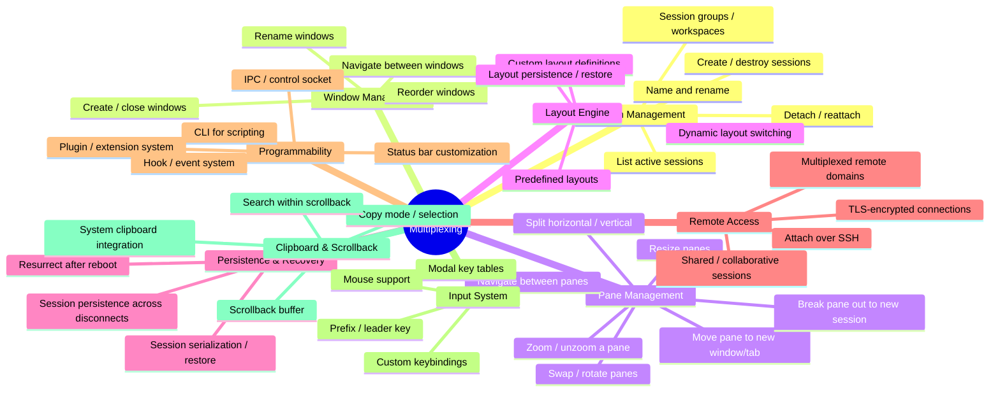
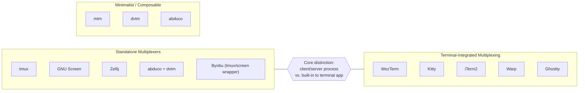
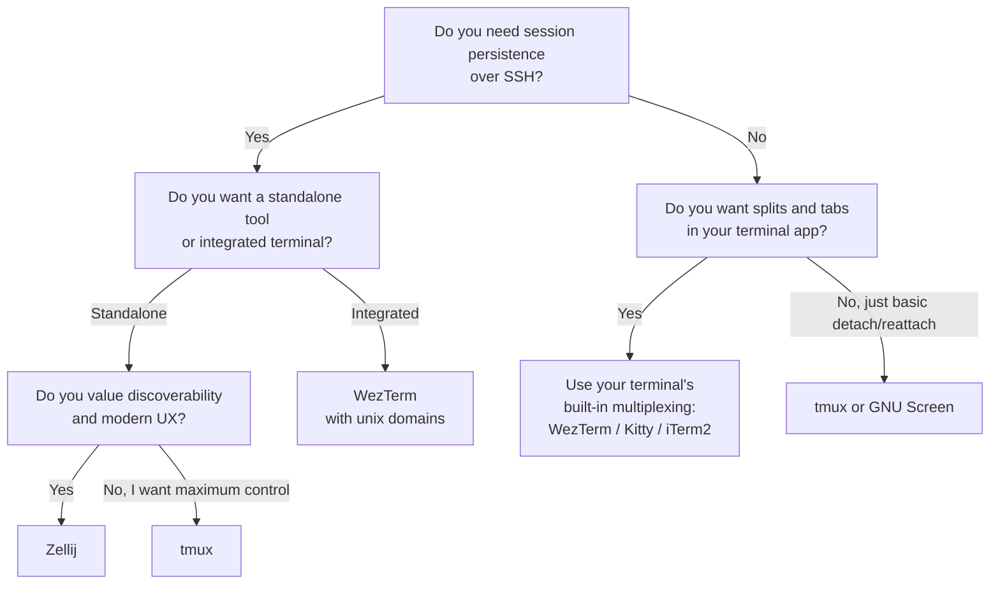

# Terminal Multiplexing

Terminal multiplexing is the ability to manage multiple terminal sessions — splitting, tabbing, persisting, and orchestrating them — within a single terminal connection. A terminal multiplexer sits between the user and the shell, virtualizing one or more pseudo-terminals and providing windowing, persistence, and control capabilities on top of them.

## Functional Decomposition

Every terminal multiplexer draws from the same set of functional capabilities. Not all multiplexers implement every function, and the depth of each implementation varies significantly.

### Detailed Functional Breakdown

#### 1. Session Management

The fundamental capability that distinguishes a multiplexer from a simple terminal. Sessions are the top-level container, grouping windows and panes into a single logical workspace.

| Function | Description |
| --- | --- |
| Create / destroy | Start and terminate named or anonymous sessions |
| Detach / reattach | Disconnect the client while the session keeps running; reconnect later |
| List | Enumerate running sessions with metadata (name, window count, attached clients) |
| Rename | Change the session name after creation |
| Workspaces | Group sessions or windows into named workspaces for project-level organization |
| Lock | Password-protect a session when stepping away |

#### 2. Window (Tab) Management

Windows live inside sessions and act like tabs — each holds one or more panes.

| Function | Description |
| --- | --- |
| Create / close | Spawn a new window with a shell or command; close when done |
| Navigate | Switch by index, name, next/previous, or last-used |
| Rename | Give windows meaningful names (e.g., "editor", "logs") |
| Reorder / move | Rearrange window positions; move between sessions |
| Link | Share a window across multiple sessions simultaneously |

#### 3. Pane Management

Panes subdivide a window into independent terminal regions — the core "multiplexing" visual.

| Function | Description |
| --- | --- |
| Split | Divide horizontally (top/bottom) or vertically (left/right) |
| Resize | Grow or shrink pane edges by cells or percentage |
| Navigate | Move focus directionally (up/down/left/right) or by index |
| Swap / rotate | Exchange pane positions or rotate contents clockwise/counter-clockwise |
| Zoom | Temporarily expand a single pane to fill the entire window |
| Break out | Move a pane into its own window, tab, or session |
| Select | Modal overlay showing labeled panes for quick selection |
| Send text | Inject keystrokes or commands into a pane programmatically |

#### 4. Layout Engine

How panes are arranged and how that arrangement adapts to resizing.

| Function | Description |
| --- | --- |
| Predefined layouts | Built-in arrangements (tiled, even-horizontal, main-vertical, stacked, etc.) |
| Custom layouts | Declarative layout definitions via config files (KDL, Lua, YAML, session files) |
| Layout persistence | Save and restore complex multi-pane arrangements |
| Dynamic switching | Cycle through layouts or apply a specific one to a window |
| Top-level splits | Split at the tab level rather than within the focused pane |

#### 5. Persistence & Recovery

The ability to survive disconnects, crashes, and reboots.

| Function | Description |
| --- | --- |
| Session persistence | Sessions survive client disconnection (standard in all server-based multiplexers) |
| State serialization | Save session tree to disk for later restoration (e.g., tmux-resurrect) |
| Reboot survival | Restore sessions after a system restart (e.g., tmux-continuum) |
| Crash recovery | Server-based architectures naturally survive client crashes |

#### 6. Remote Access & Collaboration

Multiplexers that support multi-client and remote workflows.

| Function | Description |
| --- | --- |
| SSH attach | Connect to a remote multiplexer session over SSH |
| Multiplexed domains | Integrate remote sessions into a local GUI (WezTerm SSH/TLS domains) |
| Shared sessions | Multiple users attach to the same session simultaneously |
| Read-only attach | Observe a session without the ability to send input |
| Web client | Attach to sessions from a browser (Zellij) |

#### 7. Programmability & Extensibility

The scripting and extension surface that makes a multiplexer automatable.

| Function | Description |
| --- | --- |
| CLI | Command-line interface for session/window/pane operations |
| Control mode | Machine-readable protocol for external tooling (tmux `-CC`) |
| IPC socket | Unix socket for programmatic control |
| Plugin system | Load third-party extensions (WASM plugins in Zellij, Lua in WezTerm, TPM in tmux) |
| Status bar | Customizable bar showing session info, system stats, or script output |
| Hooks / events | Trigger actions on session events (window created, pane focused, etc.) |
| Startup scripts | Declarative session definitions run at launch |

#### 8. Input System

How the multiplexer captures and routes keyboard input.

| Function | Description |
| --- | --- |
| Prefix key | A leader key (e.g., `Ctrl+b`) that activates multiplexer commands |
| Modal keys | Named key tables activated on demand (resize mode, navigation mode) |
| Mouse support | Click to focus, drag to resize, scroll for scrollback |
| Custom bindings | Remap any key combination to any action |
| Passthrough | Forward the prefix key itself to the underlying shell |

## Common vs. Differentiating Features

### Universal Features (present in all serious multiplexers)

- Session persistence (detach/reattach)
- Multiple windows/tabs
- Pane splitting (horizontal and vertical)
- Pane navigation and resizing
- Custom keybindings
- Scrollback buffer

### Differentiating Features

| Feature | Who Has It | Why It Matters |
| --- | --- | --- |
| WASM plugin system | Zellij | Language-agnostic, sandboxed, crash-proof plugins |
| Lua scripting engine | WezTerm | Deep configuration and runtime programmability |
| Built-in UI / keybinding hints | Zellij | Dramatically lowers the learning curve |
| Floating / stacked panes | Zellij | Overlay panes without disrupting the layout |
| Remote multiplexing domains | WezTerm | Native GUI integration for SSH/TLS remote sessions |
| Web client | Zellij | Attach from a browser — no terminal needed |
| Control mode (`-CC`) | tmux | Machine-parseable output for IDE/editor integration |
| TPM plugin ecosystem | tmux | Largest community plugin library |
| Session resurrection | tmux (via plugins) | Survive full system reboots |
| Layout cycling | Kitty | Switch between tiling arrangements with one keypress |
| Multiplayer / shared sessions | tmux, Zellij | Real-time collaborative terminal use |

## Categorizing the Solution Space

Terminal multiplexing applications fall into distinct categories based on where they run and how they integrate with the terminal.

### Category 1: Standalone Server-Based Multiplexers

These run as independent server processes that manage pseudo-terminals. Any terminal emulator can act as the client. The multiplexer is decoupled from the terminal application.

**Characteristics:**
- Client/server architecture over Unix sockets
- Terminal-agnostic — works in any terminal emulator, including bare SSH
- Session persistence is a first-class feature
- Typically configured via text files (`.tmux.conf`, KDL, `.screenrc`)

**Examples:** tmux, GNU Screen, Zellij, Byobu

### Category 2: Terminal-Integrated Multiplexing

The terminal emulator itself provides splits, tabs, and pane management using its native GUI toolkit. No separate server process is needed for local use, though some (WezTerm) offer optional server modes.

**Characteristics:**
- Native GPU-rendered panes with full mouse, clipboard, and scrollback integration
- No extra process or dependency — multiplexing is built in
- Configuration is part of the terminal's config (Lua, TOML, JSON)
- Session persistence varies — some offer it (WezTerm unix domains), many do not

**Examples:** WezTerm, Kitty, iTerm2, Warp, Ghostty (via cmux)

### Category 3: Minimalist / Composable Multiplexers

Small, focused tools that handle one aspect of multiplexing. Designed to be composed together following the Unix philosophy.

**Characteristics:**
- Tiny footprint (mtm is ~1000 lines of code)
- Often split the "tiling" concern from the "persistence" concern
- Less configuration, fewer features, maximum simplicity

**Examples:** dvtm (tiling only) + abduco (session persistence only), mtm

### Comparison Matrix

| | tmux | Zellij | GNU Screen | WezTerm | Kitty | iTerm2 |
| --- | --- | --- | --- | --- | --- | --- |
| **Type** | Standalone | Standalone | Standalone | Integrated | Integrated | Integrated |
| **Language** | C | Rust | C | Rust | Python/C | Objective-C |
| **Session persistence** | Yes | Yes | Yes | Yes (unix domains) | No | Via tmux |
| **Plugin system** | TPM (shell) | WASM | No | Lua scripting | Kittens (Python) | Python API |
| **Remote multiplexing** | SSH attach | SSH attach | SSH attach | SSH/TLS domains | SSH kitten | SSH + tmux CC |
| **Collaborative sessions** | Yes | Yes | Yes | No | No | No |
| **Built-in UI hints** | No | Yes | No | No | No | No |
| **Floating panes** | Popups | Yes | No | No | No | No |
| **Mouse support** | Yes | Yes | Limited | Native | Native | Native |
| **Scrollback** | Copy mode | Yes | Yes | Native | Native | Native |
| **Startup scripts** | Yes | Layouts (KDL) | Yes | Lua config | Sessions | Profiles |
| **Web client** | No | Yes | No | No | No | No |
| **Platform** | Unix/macOS | Unix/macOS | Unix | Cross-platform | Unix/macOS | macOS only |
| **Latest version** | 3.6a (Dec 2025) | 0.42+ | 4.9.1 | 20240203 (nightly rec.) | 0.38+ | 3.5 |

## Top Multiplexing Applications

### tmux

The dominant standalone terminal multiplexer since ~2010. Server/client architecture, extensive scripting API, and the largest ecosystem of plugins and community resources.

- **Strengths:** Stability, ubiquity, scriptability, massive plugin ecosystem (TPM), collaborative sessions, control mode for IDE integration
- **Weaknesses:** Steep learning curve, no built-in discoverability, configuration can become complex
- **Best for:** Remote servers, SSH workflows, power users, teams needing shared sessions
- **Latest:** [v3.6a](https://github.com/tmux/tmux/releases) (December 2025)

### Zellij

A modern Rust-based multiplexer focused on usability without sacrificing power. Features a WASM plugin system, floating/stacked panes, built-in file manager (Strider), and a web client.

- **Strengths:** Beginner-friendly UI with keybinding hints, WASM plugins, floating panes, web client, layout system (KDL), multiplayer support
- **Weaknesses:** Higher memory usage (~22MB vs tmux's ~5MB), younger ecosystem, fewer third-party integrations
- **Best for:** Developers who want modern UX, local-first workflows, teams wanting browser-based access
- **Latest:** [v0.42+](https://github.com/zellij-org/zellij)

### GNU Screen

The original terminal multiplexer (first released 1987). Still functional but receives minimal updates. Dropped from RHEL 8+ default packages in favor of tmux.

- **Strengths:** Available everywhere, simple for basic detach/reattach, well-documented
- **Weaknesses:** Aging codebase, limited splits, no plugin system, security concerns prompted distro removals
- **Best for:** Legacy systems, simple remote session persistence
- **Latest:** [v4.9.1](https://www.gnu.org/software/screen/)

### WezTerm (Integrated)

A GPU-accelerated terminal with built-in multiplexing, Lua scripting, and remote domain support (SSH, TLS, Unix sockets). See the [WezTerm deep dive](./wezterm.md) for full details.

- **Strengths:** Full Lua programmability, SSH/TLS remote domains, comprehensive CLI, cross-platform, mux server for session persistence
- **Weaknesses:** Multiplexing is tied to the WezTerm GUI, less portable than standalone tools
- **Best for:** Users who want one tool for terminal + multiplexer, remote development, scripted layouts

### Kitty (Integrated)

A fast, GPU-rendered terminal with built-in window splits, tabs, and multiple layout modes. Extensible via Python "kittens."

- **Strengths:** Fast rendering, flexible layout engine (splits, stack, tall, fat, grid), SSH kitten for remote sessions, highly customizable
- **Weaknesses:** No session persistence, macOS/Linux only, multiplexing less feature-rich than standalone tools
- **Best for:** Local development, users who prefer integrated tooling over tmux

### Byobu

A wrapper around tmux (or GNU Screen) that adds an enhanced status bar, easy keybindings, and sensible defaults. Not a multiplexer itself — it configures an underlying one.

- **Strengths:** Makes tmux/screen immediately approachable, useful status notifications, Ubuntu default
- **Weaknesses:** Adds a layer of abstraction, can conflict with custom tmux configs
- **Best for:** Users who want tmux power with minimal configuration

### abduco + dvtm

A Unix-philosophy pairing: abduco handles session persistence (detach/reattach) while dvtm handles tiling window management. Together they form a minimal multiplexer.

- **Strengths:** Extremely lightweight, composable, each tool does one thing well
- **Weaknesses:** Minimal features, small community, manual composition required
- **Best for:** Minimalists, resource-constrained environments

## Choosing a Multiplexer

The right choice depends on where you work (local vs. remote), how much configuration you want to manage, and whether you prefer integrated tooling or standalone composability.