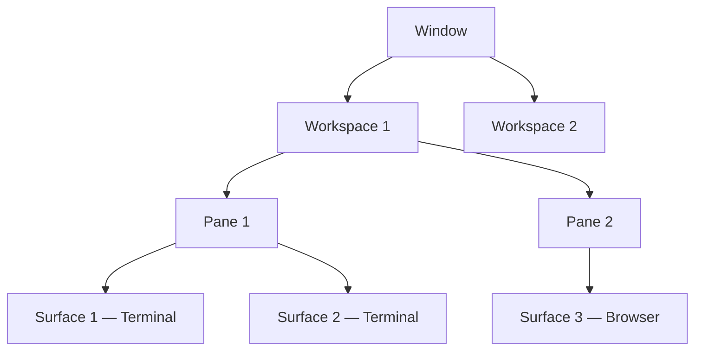

# cmux Terminal

**Latest version:** 0.62.2 (March 14, 2026)

cmux is a native macOS terminal application built on [libghostty](https://ghostty.org/) (Ghostty's GPU-accelerated rendering engine). It combines Ghostty's standards compliance and performance with built-in multiplexing, vertical tabs, an embedded browser, a notification system, and a full socket API — all in a native Swift + AppKit app (no Electron).

- **Repository:** <https://github.com/manaflow-ai/cmux>
- **Website:** <https://www.cmux.dev/>
- **License:** AGPL-3.0-or-later
- **Platform:** macOS 14.0+ (Apple Silicon and Intel)

## Architecture

cmux organizes terminals in a five-level hierarchy:



| Level | Description | Create | Env Variable |
|-------|-------------|--------|--------------|
| **Window** | Native macOS window with its own sidebar | `Cmd+Shift+N` | — |
| **Workspace** | Sidebar entry containing split panes | `Cmd+N` | `CMUX_WORKSPACE_ID` |
| **Pane** | Split region within a workspace | `Cmd+D` / `Cmd+Shift+D` | — |
| **Surface** | Tab within a pane (terminal or browser) | `Cmd+T` | `CMUX_SURFACE_ID` |
| **Panel** | Internal content layer (terminal session or web view) | — | — |

## Installation

### DMG (recommended)

Download the `.dmg` from the [website](https://www.cmux.dev/), drag to Applications. Auto-updates via Sparkle — you only download once.

### Homebrew

```bash
brew tap manaflow-ai/cmux
brew install --cask cmux
```

Update with `brew upgrade --cask cmux`.

### CLI setup

The `cmux` CLI works automatically inside cmux terminals. For external use, create a symlink:

```bash
sudo ln -sf "/Applications/cmux.app/Contents/Resources/bin/cmux" /usr/local/bin/cmux
```

## Configuration

### File locations

cmux reads Ghostty configuration files. The lookup order is:

| Priority | Path |
|----------|------|
| 1 | `~/.config/ghostty/config` |
| 2 | `~/Library/Application Support/com.mitchellh.ghostty/config` |

Create the config if it doesn't exist:

```bash
mkdir -p ~/.config/ghostty
touch ~/.config/ghostty/config
```

cmux-specific settings (theme mode, automation mode, browser host lists) are managed through the in-app **Settings** UI (`Cmd+,`), not the config file.

### Configuration syntax

The Ghostty config uses a simple `key = value` format (one per line, no TOML/YAML nesting):

```
font-family = SF Mono
font-size = 13
theme = One Dark
scrollback-limit = 50000
unfocused-split-opacity = 0.85
split-divider-color = #3e4451
working-directory = ~/code
```

### Available settings

**Appearance:**

| Setting | Description | Example |
|---------|-------------|---------|
| `font-family` | Typeface name | `JetBrains Mono` |
| `font-size` | Size in points | `13` |
| `theme` | Predefined color theme | `Dracula`, `One Dark` |
| `background` | Background hex color | `#1e1e2e` |
| `foreground` | Text color | `#cdd6f4` |
| `cursor-color` | Cursor color | `#f5e0dc` |
| `cursor-text` | Text color on cursor | `#1e1e2e` |
| `selection-background` | Selection highlight | `#45475a` |
| `selection-foreground` | Selection text color | `#cdd6f4` |
| `unfocused-split-opacity` | Inactive pane opacity (0.0–1.0) | `0.85` |
| `unfocused-split-fill` | Fill color for unfocused splits | `#181825` |
| `split-divider-color` | Divider between panes | `#3e4451` |

**Behavior:**

| Setting | Description | Example |
|---------|-------------|---------|
| `scrollback-limit` | Lines retained in scrollback | `50000` |
| `working-directory` | Default startup directory | `~/Projects` |

**In-app settings** (`Cmd+,`):

| Setting | Options |
|---------|---------|
| Theme mode | System / Light / Dark |
| Automation mode | Off / cmux processes only (default) / allowAll |
| Browser link hosts | Wildcard domain list for embedded browser |
| HTTP hosts allowed | Non-HTTPS domains permitted (defaults: localhost, 127.0.0.1, etc.) |
| Notification command | Shell command run on notification receipt |
| Sidebar tint color | Custom sidebar color with light/dark support |
| Menu bar visibility | Show/hide menu bar |

## Keyboard Shortcuts

### Workspaces

| Shortcut | Action |
|----------|--------|
| `Cmd+N` | New workspace |
| `Cmd+1` – `Cmd+8` | Jump to workspace 1–8 |
| `Cmd+9` | Jump to last workspace |
| `Cmd+Shift+W` | Close workspace |
| `Cmd+Shift+R` | Rename workspace |
| `Cmd+B` | Toggle sidebar |

### Surfaces (tabs)

| Shortcut | Action |
|----------|--------|
| `Cmd+T` | New surface |
| `Cmd+Shift+]` | Next surface |
| `Cmd+Shift+[` | Previous surface |
| `Ctrl+Shift+Tab` | Previous surface (alternate) |
| `Ctrl+1` – `Ctrl+8` | Jump to surface 1–8 |
| `Ctrl+9` | Jump to last surface |
| `Cmd+W` | Close surface |

### Split panes

| Shortcut | Action |
|----------|--------|
| `Cmd+D` | Split right |
| `Cmd+Shift+D` | Split down |
| `Option+Cmd+Arrow` | Focus pane directionally |
| `Option+Cmd+D` | Split browser right |
| `Option+Cmd+Shift+D` | Split browser down |

### Browser

| Shortcut | Action |
|----------|--------|
| `Cmd+Shift+L` | Open browser surface |
| `Cmd+L` | Focus address bar |
| `Cmd+]` | Forward |
| `Cmd+R` | Reload page |
| `Option+Cmd+I` | Developer tools |

### Notifications

| Shortcut | Action |
|----------|--------|
| `Cmd+Shift+I` | Show notifications panel |
| `Cmd+Shift+U` | Jump to latest unread |

### Find

| Shortcut | Action |
|----------|--------|
| `Cmd+F` | Find |
| `Cmd+G` | Find next |
| `Cmd+Shift+G` | Find previous |
| `Cmd+Shift+F` | Hide find bar |
| `Cmd+E` | Use selection for find |

### Terminal

| Shortcut | Action |
|----------|--------|
| `Cmd+K` | Clear scrollback |
| `Cmd+C` | Copy (with selection) |
| `Cmd+V` | Paste |
| `Cmd++` | Increase font size |
| `Cmd+-` | Decrease font size |
| `Cmd+0` | Reset font size |

### Window

| Shortcut | Action |
|----------|--------|
| `Cmd+Shift+N` | New window |
| `Cmd+Shift+P` | Command palette |
| `Cmd+P` | Search all surfaces |
| `Cmd+,` | Settings |
| `Cmd+Q` | Quit |

## Programmatic Interaction (Socket API)

cmux exposes a Unix socket API for programmatic control of workspaces, surfaces, panes, input, notifications, sidebar metadata, and the embedded browser.

### Socket paths

| Build | Path |
|-------|------|
| Release | `/tmp/cmux.sock` |
| Debug | `/tmp/cmux-debug.sock` |
| Tagged debug | `/tmp/cmux-debug-<tag>.sock` |

Override with the `CMUX_SOCKET_PATH` environment variable.

### Access modes

| Mode | Description | Activation |
|------|-------------|------------|
| **Off** | Socket disabled | Settings UI or `CMUX_SOCKET_MODE=off` |
| **cmux processes only** | Only processes spawned inside cmux can connect | Default |
| **allowAll** | Any local process can connect | `CMUX_SOCKET_MODE=allowAll` (env only) |

### Protocol

Send newline-terminated JSON over the Unix socket:

```json
{"id":"req-1","method":"workspace.list","params":{}}
```

Response:

```json
{"id":"req-1","ok":true,"result":{"workspaces":[...]}}
```

### CLI options

| Flag | Description |
|------|-------------|
| `--socket PATH` | Custom socket path |
| `--json` | JSON output |
| `--window ID` | Target window |
| `--workspace ID` | Target workspace |
| `--surface ID` | Target surface |
| `--id-format refs\|uuids\|both` | Identifier format |

### Detecting cmux

```bash
SOCK="${CMUX_SOCKET_PATH:-/tmp/cmux.sock}"
[ -S "$SOCK" ] && echo "Socket available"
command -v cmux &>/dev/null && echo "CLI available"
[ -n "${CMUX_WORKSPACE_ID:-}" ] && echo "Inside cmux"
```

### Workspace commands

| CLI | Socket method | Description |
|-----|---------------|-------------|
| `cmux list-workspaces` | `workspace.list` | List all workspaces |
| `cmux new-workspace` | `workspace.create` | Create workspace |
| `cmux select-workspace --workspace <id>` | `workspace.select` | Switch to workspace |
| `cmux current-workspace` | `workspace.current` | Get active workspace |
| `cmux close-workspace --workspace <id>` | `workspace.close` | Close workspace |

### Split and surface commands

| CLI | Socket method | Description |
|-----|---------------|-------------|
| `cmux new-split right` | `surface.split` | Split pane (left/right/up/down) |
| `cmux list-surfaces` | `surface.list` | List all surfaces |
| `cmux focus-surface --surface <id>` | `surface.focus` | Focus a surface |

### Input commands

| CLI | Socket method | Description |
|-----|---------------|-------------|
| `cmux send "echo hello"` | `surface.send_text` | Send text to focused terminal |
| `cmux send-key enter` | `surface.send_key` | Send key press (enter/tab/escape/backspace/delete/arrows) |
| `cmux send-surface --surface <id> "cmd"` | `surface.send_text` | Send text to specific surface |
| `cmux send-key-surface --surface <id> enter` | `surface.send_key` | Send key to specific surface |

### Notification commands

| CLI | Socket method | Description |
|-----|---------------|-------------|
| `cmux notify --title "T" --body "B"` | `notification.create` | Create notification |
| `cmux list-notifications` | `notification.list` | List notifications |
| `cmux clear-notifications` | `notification.clear` | Clear all notifications |

Notifications can also be sent via terminal escape sequences:

```bash
# OSC 777 (simple)
printf '\e]777;notify;Title;Body\a'

# OSC 99 (rich — supports subtitles and IDs)
printf '\e]99;i=1:d=0;Title\e\\'
```

### Sidebar metadata commands

| CLI | Description |
|-----|-------------|
| `cmux set-status build "compiling" --icon hammer --color "#ff9500"` | Set status pill |
| `cmux clear-status build` | Clear status pill |
| `cmux list-status` | List status pills |
| `cmux set-progress 0.5 --label "Building..."` | Set progress bar (0.0–1.0) |
| `cmux clear-progress` | Clear progress bar |
| `cmux log "Build started" --level error --source build` | Add log entry |
| `cmux clear-log` | Clear logs |
| `cmux list-log --limit 5` | List recent logs |
| `cmux sidebar-state` | Dump full sidebar state |

Log levels: `info`, `progress`, `success`, `warning`, `error`.

### System commands

| CLI | Socket method | Description |
|-----|---------------|-------------|
| `cmux ping` | `system.ping` | Health check |
| `cmux capabilities` | `system.capabilities` | List supported features |
| `cmux identify` | `system.identify` | Get focused IDs and metadata |

## Browser Automation

The embedded browser is fully scriptable via the `cmux browser` command group. Key capabilities:

### Navigation

```bash
cmux browser open https://example.com
cmux browser surface:2 navigate https://example.com/login
cmux browser surface:2 wait --load-state complete
cmux browser surface:2 back
cmux browser surface:2 forward
cmux browser surface:2 reload
```

### DOM interaction

```bash
cmux browser surface:2 click "#submit"
cmux browser surface:2 fill "#email" --text "user@example.com"
cmux browser surface:2 type "#search" --text "query"
cmux browser surface:2 select "#country" --value "US"
cmux browser surface:2 check "#agree"
cmux browser surface:2 hover ".menu-item"
cmux browser surface:2 scroll --dy 800
```

### Inspection

```bash
cmux browser surface:2 snapshot --interactive --compact
cmux browser surface:2 screenshot --out /tmp/page.png
cmux browser surface:2 get title
cmux browser surface:2 get text "h1"
cmux browser surface:2 get html "main"
cmux browser surface:2 get value "#email"
cmux browser surface:2 get attr "a.primary" --attr href
cmux browser surface:2 get count ".row"
cmux browser surface:2 find role button --name "Continue"
cmux browser surface:2 find testid "save-btn"
```

### JavaScript evaluation

```bash
cmux browser surface:2 eval "document.title"
cmux browser surface:2 addscript "document.querySelector('#name')?.focus()"
cmux browser surface:2 addstyle "#banner { display: none !important; }"
```

### State management

```bash
cmux browser surface:2 cookies get
cmux browser surface:2 cookies set session_id abc123 --domain example.com
cmux browser surface:2 storage local set theme dark
cmux browser surface:2 state save /tmp/session.json
cmux browser surface:2 state load /tmp/session.json
```

### Tabs, dialogs, and downloads

```bash
cmux browser tab list
cmux browser tab new https://example.com/pricing
cmux browser dialog accept
cmux browser download --path /tmp/report.csv --timeout-ms 30000
```

## Notifications

### Lifecycle

Notifications progress through four states: **Received** → **Unread** → **Read** → **Cleared**.

Desktop alerts are automatically suppressed when the cmux window is focused, the sending workspace is active, or the notification panel is open.

### Custom notification command

In **Settings > App > Notification Command**, configure a shell command run via `/bin/sh -c` with these environment variables:

| Variable | Content |
|----------|---------|
| `CMUX_NOTIFICATION_TITLE` | Workspace or app name |
| `CMUX_NOTIFICATION_SUBTITLE` | Secondary text |
| `CMUX_NOTIFICATION_BODY` | Full message |

Example: `say "$CMUX_NOTIFICATION_TITLE"` for text-to-speech alerts.

### Claude Code integration

Create a hook script at `~/.claude/hooks/cmux-notify.sh` to handle `Stop` and `PostToolUse` events, then register it in `~/.claude/settings.json`.

## Environment Variables

| Variable | Description |
|----------|-------------|
| `CMUX_WORKSPACE_ID` | Auto-set: current workspace ID |
| `CMUX_SURFACE_ID` | Auto-set: current surface ID |
| `CMUX_SOCKET_PATH` | Override socket path |
| `CMUX_SOCKET_ENABLE` | Force enable/disable (`1`/`0`, `true`/`false`) |
| `CMUX_SOCKET_MODE` | Override access mode (`cmuxOnly`, `allowAll`, `off`) |
| `TERM_PROGRAM` | Set to `ghostty` |
| `TERM` | Set to `xterm-ghostty` |

## Session Restoration

On relaunch, cmux restores:

- Window, workspace, and pane layout
- Working directories
- Terminal scrollback (best effort)
- Browser URL and navigation history

**Not restored:** live process state (Claude Code sessions, tmux, vim, etc.).

## Key Differentiators

| Feature | cmux | tmux | Ghostty |
|---------|------|------|---------|
| GPU-accelerated rendering | Yes (libghostty) | No (host terminal) | Yes |
| Built-in multiplexing | Yes (native) | Yes (prefix key) | Limited (splits only) |
| Vertical sidebar tabs | Yes | No | No |
| Embedded browser | Yes (scriptable) | No | No |
| Socket API | Yes (JSON over Unix socket) | Yes (tmux CLI) | No |
| Notification system | Yes (OSC + CLI + rings) | No | No |
| Session restore | Layout + dirs | Full (processes) | No |
| Platform | macOS only | Cross-platform | Cross-platform |
| Configuration | Ghostty config + Settings UI | `.tmux.conf` | `~/.config/ghostty/config` |

## Strong Fit Use Cases

- **AI agent workflows**: Running multiple coding agents (Claude Code, Codex, Aider, etc.) with notification rings when agents need attention
- **Multi-project development**: Workspace-per-project with sidebar showing git branch, PR status, and ports
- **Browser-integrated workflows**: Testing APIs alongside terminals with scriptable browser automation
- **Custom tooling**: Socket API enables building dashboards, orchestrators, and CI integrations around terminal sessions
