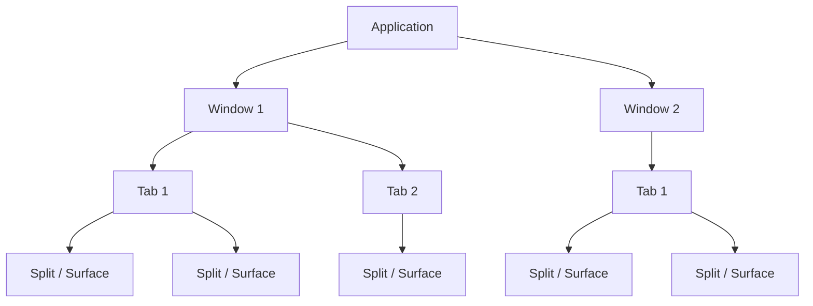

# Ghostty Terminal Multiplexing

**Latest Version:** v1.3.1 (March 13, 2026)
**Repository:** [ghostty-org/ghostty](https://github.com/ghostty-org/ghostty)
**Documentation:** [ghostty.org/docs](https://ghostty.org/docs)
**Platforms:** macOS (Metal), Linux (OpenGL, Wayland/X11)
**Written in:** Zig

Ghostty is a high-performance, GPU-accelerated terminal emulator that provides native multiplexing through windows, tabs, and splits. Unlike [tmux](./cmux.md) or [WezTerm](./wezterm.md), Ghostty uses platform-native UI components rather than custom-drawn elements, giving a polished OS-native experience at the cost of fewer multiplexing features. It does not support named sessions, session persistence, or pane broadcasting natively.

## Multiplexing Architecture

Ghostty's multiplexing model is hierarchical:



Each terminal pane is called a **surface**. Surfaces are organized into splits within tabs, and tabs live inside windows. Key terminology:

| Term | Meaning |
|------|---------|
| **Surface** | A single terminal pane (the fundamental unit) |
| **Split** | A surface subdivision within a tab |
| **Tab** | A container of one or more splits |
| **Window** | A top-level OS window containing tabs |

## Configuration

### File Locations

Ghostty uses a simple `key = value` text format. The config file is named `config.ghostty` (legacy: `config` before v1.2.3). Files are loaded in priority order, with later files overriding earlier ones.

#### macOS

| Priority | Path |
|----------|------|
| 1 | `$HOME/Library/Application Support/com.mitchellh.ghostty/config.ghostty` |
| 2 | `$HOME/Library/Application Support/com.mitchellh.ghostty/config` |
| 3 | `$XDG_CONFIG_HOME/ghostty/config.ghostty` |
| 4 | `$XDG_CONFIG_HOME/ghostty/config` |

#### Linux

| Priority | Path |
|----------|------|
| 1 | `$XDG_CONFIG_HOME/ghostty/config.ghostty` |
| 2 | `$XDG_CONFIG_HOME/ghostty/config` |
| 3 | `$HOME/.config/ghostty/config.ghostty` (if `XDG_CONFIG_HOME` is unset) |
| 4 | `$HOME/.config/ghostty/config` (if `XDG_CONFIG_HOME` is unset) |

### Config Syntax

```
# Comments start with #
font-size = 14
window-padding-x = 4
window-padding-y = 4

# Include other config files
config-file = themes/my-theme.ghostty

# Optional includes (no error if missing)
config-file = ?local-overrides.ghostty
```

### Runtime Reload

Reload configuration without restarting:

- **macOS:** `Cmd+Shift+,`
- **Linux:** `Ctrl+Shift+,`

### Multiplexing-Related Config Options

| Option | Description |
|--------|-------------|
| `window-new-tab-position` | Where new tabs are inserted (`current`, `end`) |
| `split-preserve-zoom` | Whether navigating to another split preserves zoom state |
| `focus-follows-mouse` | Whether moving the mouse into a split focuses it |
| `macos-applescript` | Enable/disable AppleScript automation (macOS, default: `true`) |

## Keybinding Configuration

### Syntax

Keybindings use the format:

```
keybind = trigger=action
```

**Modifiers:** `ctrl` (alias: `control`), `shift`, `alt` (aliases: `opt`, `option`), `super` (aliases: `cmd`, `command`)

**Trigger prefixes:**

| Prefix | Effect |
|--------|--------|
| `all:` | Apply to all terminal surfaces |
| `global:` | System-wide hotkey (macOS only, requires Accessibility) |
| `unconsumed:` | Pass the key to the terminal program as well |
| `performable:` | Only consume if the action can actually be performed |

**Examples:**

```
# Remap split creation
keybind = ctrl+shift+\=new_split:right
keybind = ctrl+shift+-=new_split:down

# Vim-style split navigation
keybind = ctrl+h=goto_split:left
keybind = ctrl+j=goto_split:down
keybind = ctrl+k=goto_split:up
keybind = ctrl+l=goto_split:right

# Global quick terminal toggle (macOS)
keybind = global:ctrl+`=toggle_quick_terminal
```

### Listing Defaults

```bash
# List all default keybindings
ghostty +list-keybinds --default

# List all available actions
ghostty +list-actions
```

### Chained Keybindings

Ghostty supports tmux-style leader key sequences:

```
# ctrl+a as leader, then n for new tab
keybind = ctrl+a>n=new_tab

# ctrl+a, then arrow keys for split navigation
keybind = ctrl+a>left=goto_split:left
keybind = ctrl+a>right=goto_split:right
keybind = ctrl+a>up=goto_split:up
keybind = ctrl+a>down=goto_split:down
```

## Default Multiplexing Keybindings

### macOS Defaults

| Action | Keybinding |
|--------|------------|
| New tab | `Cmd+T` |
| Close surface (pane) | `Cmd+W` |
| Close tab | `Cmd+Alt+W` |
| Close window | `Cmd+Shift+W` |
| Close all windows | `Cmd+Shift+Alt+W` |
| Previous tab | `Cmd+Shift+[` |
| Next tab | `Cmd+Shift+]` |
| Go to tab N | `Cmd+N` (1–9) |
| Last tab | `Cmd+9` |
| Split right | `Cmd+D` |
| Split down | `Cmd+Shift+D` |
| Previous split | `Cmd+[` |
| Next split | `Cmd+]` |
| Focus split up | `Cmd+Alt+Up` |
| Focus split down | `Cmd+Alt+Down` |
| Focus split left | `Cmd+Alt+Left` |
| Focus split right | `Cmd+Alt+Right` |
| Resize split up | `Cmd+Ctrl+Shift+Up` |
| Resize split down | `Cmd+Ctrl+Shift+Down` |
| Resize split left | `Cmd+Ctrl+Shift+Left` |
| Resize split right | `Cmd+Ctrl+Shift+Right` |
| Toggle split zoom | `Cmd+Shift+Enter` |
| Toggle fullscreen | `Cmd+Enter` |

### Linux Defaults

| Action | Keybinding |
|--------|------------|
| New tab | `Ctrl+Shift+T` |
| Close surface (pane) | `Ctrl+Shift+W` |
| Close tab | `Ctrl+Shift+W` |
| Close window | `Alt+F4` |
| Previous tab | `Ctrl+Shift+Left` or `Ctrl+PageUp` |
| Next tab | `Ctrl+Shift+Right` or `Ctrl+PageDown` |
| Go to tab N | `Alt+N` (1–9) |
| Split right | `Ctrl+Shift+O` |
| Split down | `Ctrl+Shift+E` |
| Previous split | `Ctrl+Super+[` |
| Next split | `Ctrl+Super+]` |
| Focus split up | `Ctrl+Alt+Up` |
| Focus split down | `Ctrl+Alt+Down` |
| Focus split left | `Ctrl+Alt+Left` |
| Focus split right | `Ctrl+Alt+Right` |
| Resize split up | `Super+Ctrl+Shift+Up` |
| Resize split down | `Super+Ctrl+Shift+Down` |
| Resize split left | `Super+Ctrl+Shift+Left` |
| Resize split right | `Super+Ctrl+Shift+Right` |
| Toggle split zoom | `Ctrl+Shift+Enter` |
| Toggle fullscreen | `Ctrl+Enter` |

### All Multiplexing Actions

| Action | Parameters | Description |
|--------|-----------|-------------|
| `new_window` | none | Open a new OS window |
| `new_tab` | none | Open a new tab in the current window |
| `previous_tab` | none | Switch to the previous tab |
| `next_tab` | none | Switch to the next tab |
| `last_tab` | none | Switch to the last (rightmost) tab |
| `goto_tab` | `N` (1-indexed) | Jump to tab number N |
| `move_tab` | `N` (signed offset) | Move the current tab by N positions |
| `new_split` | `right`, `down`, `left`, `up`, `auto` | Create a new split in the given direction |
| `goto_split` | `previous`, `next`, `up`, `down`, `left`, `right` | Focus the split in the given direction |
| `resize_split` | `direction,amount` (e.g., `up,10`) | Resize split border in a direction by pixel amount |
| `toggle_split_zoom` | none | Zoom/unzoom the focused split to fill the tab |
| `equalize_splits` | none | Reset all splits to equal size |
| `close_surface` | none | Close the focused surface (pane) |
| `close_tab` | `this` | Close the current tab |
| `close_window` | none | Close the current window |
| `close_all_windows` | none | Close all windows (quit) |
| `toggle_fullscreen` | none | Toggle fullscreen mode |
| `reset_window_size` | none | Reset window to default dimensions |

## Programmatic Interaction

### AppleScript (macOS)

Ghostty exposes a native AppleScript dictionary (introduced in v1.3.0) for full programmatic control of windows, tabs, and splits. Enable/disable with `macos-applescript = true|false` in config.

#### Object Model

```
application → windows → tabs → terminals
```

| Object | Key Properties |
|--------|---------------|
| `application` | `name`, `frontmost`, `front window`, `version` |
| `window` | `id`, `name`, `selected tab` |
| `tab` | `id`, `name`, `index`, `selected`, `focused terminal` |
| `terminal` | `id`, `name`, `working directory` |

#### Creating Layouts

```applescript
tell application "Ghostty"
    activate

    -- Create a configured surface
    set cfg to new surface configuration
    set initial working directory of cfg to "/path/to/project"
    set command of cfg to "/bin/zsh"

    -- Create window and splits
    set win to new window with configuration cfg
    set editor to terminal 1 of selected tab of win
    set build to split editor direction right with configuration cfg
    set logs to split editor direction down with configuration cfg

    -- Send commands to each pane
    input text "nvim ." to editor
    send key "enter" to editor
    input text "cargo watch" to build
    send key "enter" to build
end tell
```

#### Available Commands

| Command | Description |
|---------|-------------|
| `new surface configuration` | Create a reusable config record |
| `new window [with configuration cfg]` | Create a new window |
| `new tab in window [with configuration cfg]` | Create a new tab |
| `split terminal direction dir [with configuration cfg]` | Split a terminal (`right`, `left`, `down`, `up`) |
| `focus terminal` | Focus a terminal and bring its window forward |
| `select tab` | Switch to a specific tab |
| `input text str to terminal` | Send text input to a terminal |
| `send key str [modifiers] to terminal` | Send a keypress event |
| `perform action str` | Execute any Ghostty keybind action string |
| `close terminal / tab / window` | Close the target |

#### Surface Configuration Fields

| Field | Type | Description |
|-------|------|-------------|
| `font size` | number | Font size for the surface |
| `initial working directory` | string | Starting directory |
| `command` | string | Shell/command to run |
| `initial input` | string | Text sent after shell starts |
| `wait after command` | boolean | Keep surface open after command exits |
| `environment variables` | list of strings | `KEY=VALUE` environment entries |

#### Querying State

```applescript
tell application "Ghostty"
    -- Find terminals by working directory
    set matches to every terminal whose working directory contains "project"

    -- Get all terminals across all windows
    set allTerms to terminals

    -- Broadcast to all terminals
    repeat with t in allTerms
        input text "echo hello" to t
        send key "enter" to t
    end repeat
end tell
```

### D-Bus (Linux)

Ghostty claims the D-Bus bus name `com.mitchellh.ghostty` and provides limited programmatic control:

```bash
# Create a new window (starts Ghostty if not running via D-Bus activation)
ghostty +new-window
```

The D-Bus interface is currently limited to window creation. For more advanced programmatic control on Linux, use keybind actions via `xdotool` or similar tools to simulate keypresses.

**Systemd service files** are installed at:

- User install: `$PREFIX/share/systemd/user/app-com.mitchellh.ghostty.service`
- System package: `$PREFIX/lib/systemd/user/app-com.mitchellh.ghostty.service`

### CLI Actions

Ghostty provides CLI subcommands prefixed with `+`:

```bash
# List all available keybindings with defaults
ghostty +list-keybinds --default

# List all available actions
ghostty +list-actions

# Create a new window (via D-Bus on Linux)
ghostty +new-window
```

## Shell Integration

Ghostty automatically injects shell integration scripts for **Bash**, **Zsh**, **Fish**, and **Elvish**. Shell integration enhances multiplexing by:

- **Directory persistence:** New splits/tabs inherit the working directory of the focused terminal
- **Prompt detection:** Suppresses close confirmation when cursor is at a prompt
- **Prompt navigation:** `jump_to_prompt` scrolls between previous command outputs
- **Smart click:** `Alt+click` (Linux) / `Option+click` (macOS) moves cursor at prompts

Configuration:

```
# Force specific shell integration
shell-integration = zsh

# Disable entirely
shell-integration = none
```

## Comparison with Other Multiplexers

| Feature | Ghostty | [WezTerm](./wezterm.md) | [tmux](./cmux.md) |
|---------|---------|---------|------|
| Splits | Yes (native UI) | Yes (custom-drawn) | Yes |
| Tabs | Yes (native UI) | Yes (custom-drawn) | Yes (via windows) |
| Named sessions | No | No | Yes |
| Session persistence | No | No | Yes (survives disconnect) |
| Pane broadcasting | No (AppleScript workaround) | No | Yes (`synchronize-panes`) |
| Scriptable layouts | AppleScript (macOS only) | Lua (cross-platform) | Shell scripts |
| Remote multiplexing | No | Yes (mux server) | Yes (attach/detach) |
| Quick terminal | Yes (macOS) | No | No |
| GPU rendering | Yes (Metal/OpenGL) | Yes (OpenGL/WebGPU) | N/A (runs in any terminal) |

## Strengths and Best Fit

Ghostty excels when:

- **Native look and feel** is important (macOS tabs, system chrome)
- **Performance** is critical (GPU-accelerated rendering, Zig for speed)
- **macOS automation** is needed (AppleScript dictionary for layout scripting)
- **Standards compliance** matters (xterm compatibility, Kitty protocols)
- **Simple multiplexing** is sufficient (splits + tabs without session persistence)

Consider [tmux](./cmux.md) or [WezTerm](./wezterm.md) when you need session persistence, remote multiplexing, cross-platform scripting, or advanced pane management.