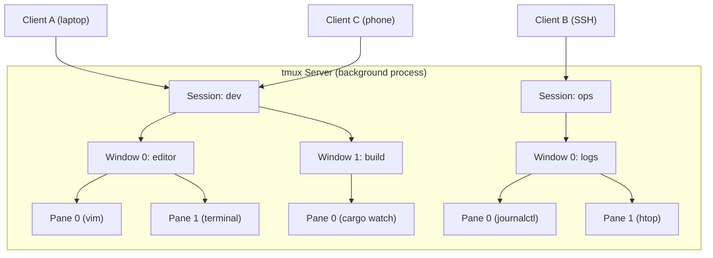

# tmux — Terminal Multiplexer

> **Latest version:** 3.6a
> **License:** ISC
> **Repository:** <https://github.com/tmux/tmux>
> **Wiki:** <https://github.com/tmux/tmux/wiki>

tmux is the original terminal multiplexer. It lets you run multiple programs in a single terminal, detach from them (they keep running in the background), and reattach from a different terminal. It uses a client-server architecture where the server manages all state and the client connects over a Unix socket.

## Architecture

tmux separates concerns into a server process and one or more client processes. The server holds all sessions, windows, and panes in memory and continues running even when no clients are attached.



### Hierarchy

| Level | Description | Identifier |
|-------|-------------|------------|
| **Server** | Background process managing all state | Socket path |
| **Session** | Named group of windows | `$N` (e.g., `$0`) |
| **Window** | Full-screen container of panes with a name and index | `@N` (e.g., `@1`) |
| **Pane** | Rectangular terminal area running a program | `%N` (e.g., `%0`) |
| **Client** | An attached terminal displaying a session | Device path (e.g., `/dev/ttys001`) |

Each pane, window, and session receives a permanent unique ID (prefixed with `%`, `@`, or `$`) that survives renaming or reordering.

## Multiplexing Features

### Sessions

- Create, rename, and destroy named sessions
- Detach from a session (programs keep running)
- Reattach from any terminal, including over SSH
- Switch between sessions interactively (tree mode)
- Lock sessions with a password

### Windows

- Multiple windows per session (like tabs)
- Create, rename, reorder, and kill windows
- Navigate by index (0-9), name, or sequentially (next/previous/last)
- Move windows between sessions
- Link a window into multiple sessions
- Automatic renaming based on the running program

### Panes

- Split windows horizontally or vertically
- Resize panes with keyboard or mouse
- Zoom a pane to fill the entire window (toggle)
- Swap panes within a window
- Convert a pane into its own window (break-pane)
- Join a pane from another window (join-pane)
- Mark a pane for targeted swap/join operations
- Rotate through five built-in layouts: even-horizontal, even-vertical, main-horizontal, main-vertical, tiled

### Copy Mode

- Scroll back through pane history (configurable `history-limit`)
- Search forward and backward through output
- Select and copy text to internal paste buffers
- Multiple named paste buffers
- Vi or Emacs key bindings for navigation and selection

### Additional Features

- **Mouse support:** Click to select panes/windows, drag to resize, drag-select to copy
- **Alerts:** Monitor panes for bell, activity, or silence
- **Clipboard integration:** OSC 52 or external tools (`pbcopy`, `xclip`, `xsel`)
- **Status line:** Fully customizable bar showing session, windows, time, and custom formats
- **Hooks:** Execute commands in response to server events
- **Synchronized panes:** Type into all panes simultaneously
- **Pipe pane:** Stream pane output to an external command for logging

## Installation

| Platform | Command |
|----------|---------|
| macOS (Homebrew) | `brew install tmux` |
| macOS (MacPorts) | `port install tmux` |
| Debian / Ubuntu | `apt install tmux` |
| Fedora | `dnf install tmux` |
| RHEL / CentOS | `yum install tmux` |
| Arch Linux | `pacman -S tmux` |
| openSUSE | `zypper install tmux` |

### Building from Source

Requires `libevent`, `ncurses`, a C compiler, `make`, `yacc`/`bison`, and `pkg-config`:

```bash
tar -zxf tmux-3.6a.tar.gz
cd tmux-3.6a/
./configure
make && sudo make install
```

## Configuration

### File Locations

| File | Purpose |
|------|---------|
| `~/.tmux.conf` | User configuration (primary) |
| `/etc/tmux.conf` | System-wide configuration |
| `$XDG_CONFIG_HOME/tmux/tmux.conf` | XDG-compliant location (tmux 3.1+) |

tmux reads the configuration file when the **server** starts (not per-client). Reload manually with:

```bash
tmux source-file ~/.tmux.conf
```

### Configuration Syntax

- Lines starting with `#` are comments
- Single quotes (`'...'`) are literal; double quotes (`"..."`) allow variable expansion
- `~` expands to home directory (not inside single quotes)
- Environment variables expand in double-quoted strings
- Multiple commands can be separated with `;`
- Curly braces `{ }` allow multi-line command blocks without escaping

### Option Scopes

| Scope | Set Command | Description |
|-------|-------------|-------------|
| Server | `set -s` | Affects entire server (e.g., `escape-time`, `default-terminal`) |
| Global session | `set -g` | Default for all sessions (e.g., `prefix`, `mouse`, `status`) |
| Session | `set` | Override for a specific session |
| Global window | `set -wg` | Default for all windows (e.g., `mode-keys`, `monitor-activity`) |
| Window | `set -w` | Override for a specific window |
| Pane | `set -p` | Override for a specific pane |
| User | `set @name` | Custom options (prefixed with `@`) for scripting |

### Common Configuration Examples

```bash
# Change prefix to Ctrl-a (screen-style)
set -g prefix C-a
unbind C-b
bind C-a send-prefix

# Vi-style key bindings in copy mode
set -g mode-keys vi
set -g status-keys vi

# Enable mouse support
set -g mouse on

# Start window numbering at 1
set -g base-index 1
set -g pane-base-index 1

# Increase scrollback history
set -g history-limit 50000

# Reduce escape-time for faster key response
set -s escape-time 10

# Auto-renumber windows when one is closed
set -g renumber-windows on

# Status line customization
set -g status-position top
set -g status-style 'bg=#1e1e2e,fg=#cdd6f4'
set -g status-left '#[fg=blue,bold] #S '
set -g status-right '#[fg=yellow]%H:%M '

# Pane borders
set -g pane-border-style 'fg=#45475a'
set -g pane-active-border-style 'fg=#89b4fa'

# Split panes using | and -
bind | split-window -h -c '#{pane_current_path}'
bind - split-window -v -c '#{pane_current_path}'

# Navigate panes with vim keys
bind h select-pane -L
bind j select-pane -D
bind k select-pane -U
bind l select-pane -R
```

### Useful Options Reference

| Option | Scope | Default | Description |
|--------|-------|---------|-------------|
| `prefix` | Session | `C-b` | Prefix key for keybindings |
| `mouse` | Session | `off` | Enable mouse interaction |
| `mode-keys` | Window | `emacs` | Copy mode key style (`vi` or `emacs`) |
| `status-keys` | Session | `emacs` | Command prompt key style |
| `base-index` | Session | `0` | Starting index for windows |
| `escape-time` | Server | `500` | Milliseconds to wait for escape sequences |
| `history-limit` | Session | `2000` | Lines of scrollback per pane |
| `default-terminal` | Server | `screen` | `TERM` value inside tmux |
| `renumber-windows` | Session | `off` | Close gaps in window numbering |
| `display-time` | Session | `750` | Milliseconds to show status messages |
| `buffer-limit` | Server | `50` | Maximum automatic paste buffers |
| `remain-on-exit` | Window | `off` | Keep pane open after program exits |
| `synchronize-panes` | Window | `off` | Send input to all panes |
| `window-size` | Session | `latest` | How window dimensions are calculated |
| `set-clipboard` | Server | `external` | OSC 52 clipboard integration |

## Keybindings

All keybindings use a **prefix key** (default `C-b`). Press the prefix, release it, then press the action key.

### Key Notation

| Notation | Meaning |
|----------|---------|
| `C-` | Control modifier |
| `M-` | Meta/Alt modifier |
| `S-` | Shift modifier |
| `C-b c` | Press `C-b`, release, then press `c` |

### Default Keybindings

#### Session Management

| Binding | Action |
|---------|--------|
| `C-b d` | Detach from session |
| `C-b D` | Choose client to detach |
| `C-b s` | Choose session (tree mode) |
| `C-b $` | Rename session |
| `C-b (` | Switch to previous session |
| `C-b )` | Switch to next session |

#### Window Management

| Binding | Action |
|---------|--------|
| `C-b c` | Create new window |
| `C-b ,` | Rename current window |
| `C-b &` | Kill current window (with confirmation) |
| `C-b n` | Next window |
| `C-b p` | Previous window |
| `C-b l` | Last (previously active) window |
| `C-b 0`-`9` | Select window by index |
| `C-b '` | Prompt for window index |
| `C-b w` | Choose window (tree mode) |
| `C-b .` | Move window to a new index |

#### Pane Management

| Binding | Action |
|---------|--------|
| `C-b %` | Split pane horizontally (left/right) |
| `C-b "` | Split pane vertically (top/bottom) |
| `C-b x` | Kill active pane (with confirmation) |
| `C-b z` | Toggle pane zoom (full window) |
| `C-b o` | Cycle to next pane |
| `C-b q` | Display pane numbers (press number to select) |
| `C-b {` | Swap with pane above/left |
| `C-b }` | Swap with pane below/right |
| `C-b m` | Mark current pane |
| `C-b M` | Clear marked pane |
| `C-b Arrow` | Move to adjacent pane |
| `C-b Space` | Cycle through layouts |
| `C-b M-1` to `M-5` | Select specific layout |
| `C-b C-Arrow` | Resize pane (small increment) |
| `C-b M-Arrow` | Resize pane (large increment) |

#### Copy Mode

| Binding | Action |
|---------|--------|
| `C-b [` | Enter copy mode |
| `C-b ]` | Paste most recent buffer |
| `C-b =` | Choose buffer to paste |
| `C-b #` | List paste buffers |

#### Miscellaneous

| Binding | Action |
|---------|--------|
| `C-b ?` | List all keybindings |
| `C-b /` | Describe a specific key |
| `C-b :` | Open command prompt |
| `C-b t` | Show a clock |
| `C-b ~` | Show messages |
| `C-b f` | Find pane by content |
| `C-b i` | Display window information |

### Custom Key Tables

tmux organizes bindings into **key tables**. The default tables are `prefix`, `root` (no prefix required), `copy-mode`, and `copy-mode-vi`. You can create custom tables:

```bash
# Define a "resize" mode
bind -Tresize h resize-pane -L 5
bind -Tresize j resize-pane -D 5
bind -Tresize k resize-pane -U 5
bind -Tresize l resize-pane -R 5
bind -Tresize Escape switch-client -Tprefix

# Enter resize mode with prefix + r
bind r switch-client -Tresize
```

### Binding and Unbinding Keys

```bash
# Bind a key in the prefix table (default)
bind c new-window -c '#{pane_current_path}'

# Bind a key in the root table (no prefix needed)
bind -n M-Left select-pane -L

# Unbind a key
unbind C-b

# List all bindings
tmux list-keys
tmux list-keys -N          # With descriptions
tmux list-keys -T copy-mode-vi
```

### Copy Mode Keys (Vi Style)

| Key | Action |
|-----|--------|
| `h` / `j` / `k` / `l` | Move cursor |
| `w` / `b` / `e` | Word navigation |
| `0` / `$` | Line start / end |
| `gg` / `G` | Top / bottom of history |
| `/` / `?` | Search forward / backward |
| `n` / `N` | Next / previous search match |
| `Space` | Begin selection |
| `v` | Toggle rectangle selection |
| `Enter` | Copy selection and exit |
| `q` | Exit copy mode |

### Copy Mode Keys (Emacs Style)

| Key | Action |
|-----|--------|
| `Arrow` | Move cursor |
| `M-f` / `M-b` | Next / previous word |
| `C-a` / `C-e` | Line start / end |
| `M-<` / `M->` | Top / bottom of history |
| `C-r` / `C-s` | Search backward / forward |
| `C-Space` | Begin selection |
| `C-w` / `M-w` | Copy selection and exit |
| `q` | Exit copy mode |

## Programmatic Interaction

tmux is designed for scriptability. Commands work identically whether invoked from a shell, a keybinding, or the command prompt.

### Shell Commands

```bash
# Session management
tmux new-session -d -s dev              # Create detached session
tmux new-session -A -s dev              # Attach or create
tmux attach-session -t dev              # Attach to session
tmux kill-session -t dev                # Destroy session
tmux list-sessions                      # List all sessions

# Window management
tmux new-window -t dev -n editor        # New named window in session
tmux select-window -t dev:2             # Switch to window 2
tmux rename-window -t dev:0 code        # Rename window
tmux move-window -s dev:3 -t ops:1      # Move between sessions

# Pane management
tmux split-window -h -t dev:0           # Horizontal split
tmux split-window -v -t dev:0           # Vertical split
tmux select-pane -t dev:0.1             # Select pane 1 in window 0
tmux resize-pane -t dev:0.1 -R 20       # Resize pane right by 20
tmux send-keys -t dev:0.1 'vim' Enter   # Type into a pane

# Querying state
tmux display-message -p '#{session_name}'
tmux list-windows -F '#{window_index}: #{window_name}'
tmux list-panes -t dev:0 -F '#{pane_id} #{pane_width}x#{pane_height}'
tmux show-options -gv history-limit
```

### Target Syntax

Targets follow the pattern `session:window.pane`:

```bash
tmux send-keys -t mysession:2.0 'ls' Enter
#                  ─────── ─ ─
#                  session │ └── pane index
#                          └──── window index
```

Special tokens:

| Token | Meaning |
|-------|---------|
| `{last}` or `!` | Last active |
| `{next}` or `+` | Next |
| `{previous}` or `-` | Previous |
| `{top}`, `{bottom}`, `{left}`, `{right}` | Directional pane selection |
| `{marked}` | The marked pane |
| `=name` | Exact name match |

### Scripting a Development Environment

```bash
#!/bin/bash
SESSION="dev"

# Create session with first window
tmux new-session -d -s "$SESSION" -n editor -c ~/project

# Split editor window
tmux split-window -h -t "$SESSION:editor" -c ~/project -p 30
tmux send-keys -t "$SESSION:editor.0" 'vim .' Enter

# Create build window
tmux new-window -t "$SESSION" -n build -c ~/project
tmux send-keys -t "$SESSION:build" 'cargo watch -x check' Enter

# Create server window with two panes
tmux new-window -t "$SESSION" -n server -c ~/project
tmux split-window -v -t "$SESSION:server" -c ~/project
tmux send-keys -t "$SESSION:server.0" 'cargo run' Enter
tmux send-keys -t "$SESSION:server.1" 'tail -f logs/app.log' Enter

# Select the editor window and attach
tmux select-window -t "$SESSION:editor"
tmux attach-session -t "$SESSION"
```

### send-keys

Send keypresses to a target pane. Arguments matching key names (e.g., `Enter`, `F1`, `C-c`) are sent as key codes; others are sent literally:

```bash
tmux send-keys -t %3 'echo hello' Enter    # Type command and press enter
tmux send-keys -t %3 C-c                   # Send Ctrl-C
tmux send-keys -t %3 -l 'Enter'            # Send literal text "Enter"
```

### capture-pane

Extract pane content:

```bash
# Capture visible content
tmux capture-pane -t %3 -p

# Capture entire scrollback + visible
tmux capture-pane -t %3 -p -S - -E -

# Include escape sequences (colors)
tmux capture-pane -t %3 -p -e
```

### pipe-pane

Stream pane output to an external command:

```bash
# Start logging pane output
tmux pipe-pane -t %3 'cat >> ~/pane.log'

# Stop logging
tmux pipe-pane -t %3

# Toggle logging
tmux pipe-pane -o -t %3 'cat >> ~/pane.log'
```

### Conditionals

```bash
# if-shell: run command based on a shell test
tmux if-shell 'test -f ~/.local.tmux.conf' 'source ~/.local.tmux.conf'

# if-shell with format condition (no shell invocation)
tmux if-shell -F '#{==:#{pane_mode},copy-mode}' 'send-keys -X cancel'
```

In configuration files, `%if` directives are evaluated at parse time:

```
%if #{==:#{host_short},laptop}
set -g status-style 'bg=blue'
%elif #{==:#{host_short},server}
set -g status-style 'bg=red'
%endif
```

### run-shell

Execute shell commands from within tmux:

```bash
# Run and display output
tmux run-shell 'echo "Current pane: #{pane_id}"'

# Run in background (non-blocking)
tmux run-shell -b 'sleep 5 && tmux display "Done!"'
```

### Format System

tmux has a powerful format system using `#{}` syntax for dynamic values:

```bash
# Display format variables
tmux display-message -p '#{session_name} - #{window_name} [#{pane_width}x#{pane_height}]'

# List windows with custom format
tmux list-windows -F '#I: #W#{?window_active, (active),}'

# Conditional formatting
tmux set -g status-right '#{?client_prefix,#[bg=red] PREFIX ,} %H:%M'
```

**Key format variables:**

| Variable | Description |
|----------|-------------|
| `#{session_name}` | Current session name |
| `#{session_id}` | Session unique ID (`$N`) |
| `#{window_name}` | Current window name |
| `#{window_id}` | Window unique ID (`@N`) |
| `#{window_index}` | Window index number |
| `#{window_active}` | `1` if current window |
| `#{pane_id}` | Pane unique ID (`%N`) |
| `#{pane_width}` | Pane width in columns |
| `#{pane_height}` | Pane height in rows |
| `#{pane_current_path}` | Pane working directory |
| `#{pane_current_command}` | Program running in pane |
| `#{pane_mode}` | Current mode (e.g., `copy-mode`) |
| `#{client_prefix}` | `1` if prefix key was pressed |
| `#{host_short}` | Short hostname |
| `#{pid}` | Server PID |

**Format operations:**

| Syntax | Description | Example |
|--------|-------------|---------|
| `#{?cond,true,false}` | Ternary | `#{?window_active,*,-}` |
| `#{==:a,b}` | String equality | `#{==:#{host},laptop}` |
| `#{!=:a,b}` | String inequality | |
| `#{m:pat,str}` | Wildcard match | `#{m:*vim*,#{pane_current_command}}` |
| `#{s/pat/rep/:var}` | Substitution | `#{s/foo/bar/:window_name}` |
| `#{t:var}` | Timestamp to human-readable | `#{t:window_activity}` |
| `#{b:var}` | Basename | `#{b:pane_current_path}` |
| `#{d:var}` | Dirname | `#{d:pane_current_path}` |
| `#{=N:var}` | Truncate to N chars | `#{=20:pane_title}` |
| `#{e\|+\|:a,b}` | Arithmetic (3.2+) | `#{e\|+\|:#{window_index},1}` |
| `#{S:fmt}` | Loop over sessions | |
| `#{W:fmt}` | Loop over windows | |
| `#{P:fmt}` | Loop over panes | |

### Control Mode

Control mode (`-C` / `-CC` flag) turns tmux into a programmable protocol for external applications. This is how iTerm2's tmux integration works.

```bash
# Start a control mode client
tmux -CC attach-session -t dev

# Or create a new session in control mode
tmux -CC new-session -s controlled
```

In control mode:

- Commands are sent via stdin
- Responses are wrapped in `%begin` / `%end` / `%error` guards
- Asynchronous notifications (prefixed with `%`) report state changes
- Pane output arrives as `%output %pane_id raw_data`

**Key notifications:**

| Notification | Meaning |
|-------------|---------|
| `%output %N data` | Pane output |
| `%window-add @N` | Window created |
| `%window-close @N` | Window destroyed |
| `%window-renamed @N name` | Window renamed |
| `%session-changed $N name` | Active session changed |
| `%sessions-changed` | Session created or destroyed |
| `%pane-mode-changed %N` | Pane mode changed |

**Control mode flags** (via `refresh-client -f`):

| Flag | Effect |
|------|--------|
| `no-output` | Suppress `%output` notifications |
| `wait-exit` | Wait for confirmation before disconnecting |
| `pause-after=N` | Enable flow control (pause after N seconds of buffered output) |

### Hooks

Hooks are commands that run automatically in response to events:

```bash
# Run a command after a new window is created
set-hook -g after-new-window 'rename-window "#{pane_current_command}"'

# Run a command when a session is created
set-hook -g session-created 'display-message "Welcome to #{session_name}"'

# Run a command after a pane is closed
set-hook -g pane-died 'display-message "Pane %% exited"'
```

### Multiple Servers

Run isolated tmux instances using separate sockets:

```bash
# Named socket (stored in /tmp/tmux-$UID/)
tmux -L dev new-session -s dev
tmux -L dev attach

# Custom socket path
tmux -S /tmp/my-tmux.sock new-session

# Check socket path from inside tmux
tmux display-message -p '#{socket_path}'
```

## Clipboard Integration

### OSC 52 (set-clipboard)

tmux can forward copied text to the terminal's system clipboard using the OSC 52 escape sequence. This works over SSH without X11 forwarding.

```bash
# Enable full clipboard (both directions)
set -s set-clipboard on

# Only tmux to system clipboard (default)
set -s set-clipboard external

# Disable
set -s set-clipboard off
```

For tmux 3.2+, ensure the terminal capability is declared:

```bash
set -as terminal-features ',xterm-256color:clipboard'
```

### External Tools

```bash
# macOS
set -s copy-command 'pbcopy'

# Linux (X11)
set -s copy-command 'xsel -i'

# Linux (Wayland)
set -s copy-command 'wl-copy'

# Pre-3.2: override copy-mode bindings
bind -Tcopy-mode-vi Enter send-keys -X copy-pipe-and-cancel 'pbcopy'
```

## Styles and Colors

tmux styles use space-separated or comma-separated terms:

```bash
set -g status-style 'fg=#cdd6f4,bg=#1e1e2e,bold'
set -g message-style 'fg=yellow,bg=default,italics'
```

**Available colors:**

| Type | Examples |
|------|---------|
| Named | `black`, `red`, `green`, `yellow`, `blue`, `magenta`, `cyan`, `white` |
| Bright | `brightred`, `brightgreen`, `brightyellow`, etc. |
| 256-color | `colour0` through `colour255` |
| True color (RGB) | `#882244`, `#ff0000` |
| Terminal default | `default` |

**Attributes:** `bold` (or `bright`), `underscore`, `reverse`, `italics`, `strikethrough`, `dim`

**Style format in status line:**

```bash
set -g status-left '#[fg=blue,bold]#S #[fg=white,nobold]| '
```

## Environment Variables

Two environment variables are set in every tmux pane:

| Variable | Content |
|----------|---------|
| `TMUX` | Socket path (before first comma) and internal data |
| `TMUX_PANE` | Current pane ID (e.g., `%0`) |

Check if running inside tmux:

```bash
if [ -n "$TMUX" ]; then
    echo "Inside tmux"
fi
```

## Mouse Support

When enabled (`set -g mouse on`):

| Action | Effect |
|--------|--------|
| Left-click on pane | Make pane active |
| Left-click on window name | Switch to window |
| Left-drag on pane border | Resize pane |
| Left-drag in pane | Select text (copied on release) |
| Right-click | Context menu |
| Scroll wheel | Scroll through pane history (enters copy mode) |

Mouse bindings use the pattern `[Event][Button][Area]`:

```bash
# Double-click on status line to zoom window
bind -Troot DoubleClick1Status resize-pane -Z -t=
```

## Alerts and Monitoring

| Alert | Option | Flag | Description |
|-------|--------|------|-------------|
| Bell | `monitor-bell` | `!` | ASCII BEL received |
| Activity | `monitor-activity` | `#` | Any output in pane |
| Silence | `monitor-silence N` | `~` | No output for N seconds |

Navigate alerts with `C-b M-n` (next) and `C-b M-p` (previous).

## Strong-Fit Use Cases

- **Remote development:** Persistent sessions survive SSH disconnects
- **Pair programming:** Multiple clients attach to the same session
- **CI/CD scripting:** Programmatic session/window/pane creation via shell scripts
- **Long-running processes:** Detach and reattach without interrupting work
- **Terminal workspace management:** Reproducible development environments via scripts
- **Logging and auditing:** `pipe-pane` and `capture-pane` for session recording
- **Integration with external tools:** Control mode protocol for terminal emulators (iTerm2)