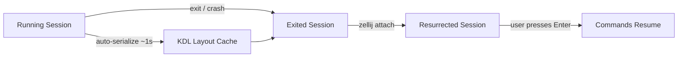
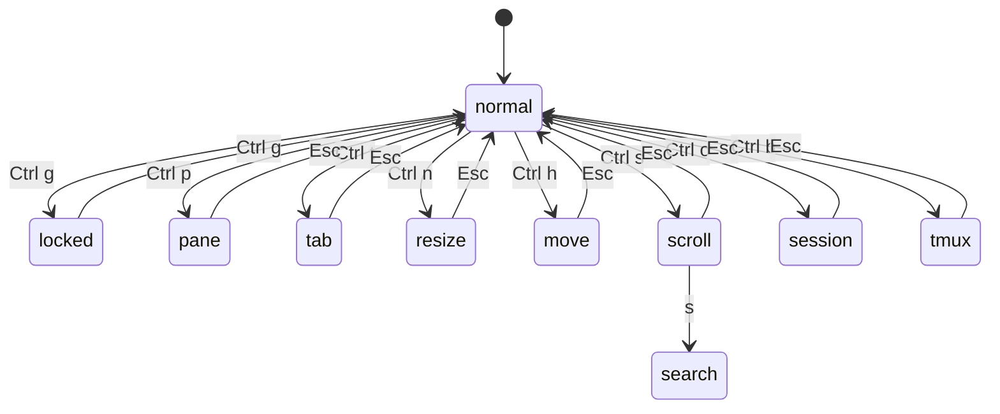

# Zellij Terminal Multiplexer

Zellij is a terminal workspace with batteries included — a modern terminal multiplexer written in Rust that prioritizes discoverability and developer experience over raw configurability. Named after [Islamic geometric mosaic tilework](https://en.wikipedia.org/wiki/Zellij) from North Africa, it provides pane and tab management, a WebAssembly plugin system, session resurrection, and a web client for browser-based access.

| | |
|---|---|
| **Latest version** | v0.43.1 (August 8, 2025) |
| **License** | MIT |
| **Language** | Rust (99.4%) |
| **Platforms** | Linux, macOS |
| **Repository** | [zellij-org/zellij](https://github.com/zellij-org/zellij) |
| **Documentation** | [zellij.dev/documentation](https://zellij.dev/documentation/) |

## Installation

```bash
# Cargo
cargo install --locked zellij

# Cargo binstall (pre-built binary)
cargo binstall zellij

# Try without installing
bash <(curl -L https://zellij.dev/launch)
```

Pre-built binaries for Linux and macOS are available on the [GitHub releases page](https://github.com/zellij-org/zellij/releases). Third-party packages are tracked on [Repology](https://repology.org/project/zellij/versions).

## Multiplexing Features

### Panes

Zellij supports three pane types:

| Pane Type | Description |
|-----------|-------------|
| **Tiled** | Standard split panes arranged in a grid, either horizontally or vertically |
| **Floating** | Overlay panes with configurable position (`x`, `y`) and size (`width`, `height`), supporting fixed character or percentage values |
| **Stacked** | Multiple panes in a vertical stack where only the focused pane is expanded; others collapse to a single title line |

Additional pane capabilities:

- **Fullscreen toggle** — any pane can be toggled to fill the entire screen
- **Pinned floating panes** — "always on top" toggle for floating panes
- **Pane frames** — configurable borders with optional rounded corners
- **Multi-select** — select and operate on multiple panes simultaneously (v0.43.0+)

### Tabs

- Named tabs with inline rename capability
- Tab synchronization — broadcast input to all panes in a tab simultaneously
- Navigate by index, name, or direction (next/previous)

### Sessions

- **Named sessions** — auto-generated or custom names via `zellij -s <name>`
- **Detach/attach** — `Ctrl o` then `d` to detach; `zellij attach <name>` to reattach
- **List sessions** — `zellij list-sessions` or `zellij ls`
- **Multiple concurrent sessions** — each runs independently
- **Multiplayer** — multiple users can attach to the same session with individual cursors
- **Web client** — share sessions in a browser via built-in web server (v0.43.0+)

### Session Resurrection

Sessions are automatically serialized to disk as KDL layout files approximately every second. When a session exits or crashes, it becomes an "exited session" available for resurrection.

**What gets saved by default:**

- Session layout (pane and tab arrangement)
- Commands running in each pane

**Optional serialization (via config):**

- `pane_viewport_serialization` — visible terminal content
- `scrollback_lines_to_serialize` — scrollback history (`0` = all)

**Safety:** Resurrected commands are NOT auto-run. Each pane displays a "Press ENTER to run..." banner to prevent accidental execution. Override with the `--force-run-commands` flag.

**Resurrection methods:**

- **CLI:** `zellij attach <session-name>` (for exited sessions)
- **Session manager:** `Ctrl o` + `w`, then `Tab` to toggle between active and exited sessions
- **Portable:** Session files can be shared across machines and loaded as layouts



## Configuration

### Config File Locations

Configuration is resolved in the following priority order:

| Priority | Location | Notes |
|:--------:|----------|-------|
| 1 | `--config-dir` CLI flag | Explicit override |
| 2 | `ZELLIJ_CONFIG_DIR` env var | Environment override |
| 3 | `$HOME/.config/zellij/config.kdl` | Common default |
| 4 | OS-specific XDG/Application Support | See below |
| 5 | `/etc/zellij` | System-wide fallback |

**OS-specific defaults (priority 4):**

| OS | Path |
|----|------|
| **Linux** | `/home/<user>/.config/zellij/` |
| **macOS** | `/Users/<user>/Library/Application Support/org.Zellij-Contributors.Zellij/` |

> **Note:** In practice, `~/.config/zellij/config.kdl` works on both platforms and is the most common location.

**Quick setup:**

```bash
mkdir -p ~/.config/zellij
zellij setup --dump-config > ~/.config/zellij/config.kdl
```

**Config overrides:**

```bash
# Use a specific config file
zellij --config /path/to/config.kdl

# Via environment variable
export ZELLIJ_CONFIG_FILE=/path/to/config.kdl

# Start with no config (clean defaults)
zellij options --clean
```

### Config Format (KDL)

Zellij uses [KDL](https://kdl.dev/) (KDL Document Language) for all configuration, layouts, and themes. The config file is actively watched — most changes apply immediately without restarting the session.

### Key Configuration Options

```kdl
// Shell and startup
default_shell "zsh"
default_layout "default"
default_mode "normal"

// UI
pane_frames true
simplified_ui false
mouse_mode true
styled_underlines true
show_startup_tips true

// Scrollback
scroll_buffer_size 10000
scrollback_editor "/usr/bin/vim"

// Clipboard
copy_command "pbcopy"       // macOS
// copy_command "xclip -selection clipboard"  // X11
// copy_command "wl-copy"   // Wayland
copy_clipboard "system"
copy_on_select true

// Session behavior
on_force_close "detach"     // "detach" or "quit"
session_serialization true
mirror_session false

// Directories
layout_dir "/path/to/layouts"
theme_dir "/path/to/themes"

// Theme
theme "default"

// Environment variables for new panes
env {
    EDITOR "vim"
}

// UI fine-tuning
ui {
    pane_frames {
        rounded_corners true
        hide_session_name true
    }
}

// Web client (v0.43.0+)
web_client true
web_server_ip "127.0.0.1"
web_server_port 8082
```

See the [full options reference](https://zellij.dev/documentation/options) for all available settings.

## Keybinding Configuration

### Modal System

Zellij uses a modal keybinding system inspired by vi. Instead of a single prefix key (like tmux's `Ctrl-b`), Zellij has 13 distinct modes:

| Mode | Trigger (default) | Purpose |
|------|-------------------|---------|
| `normal` | (default) | System-level commands, mode switching |
| `locked` | `Ctrl g` | Restricted mode; prevents accidental input |
| `pane` | `Ctrl p` | Pane creation, movement, focus, resize |
| `tab` | `Ctrl t` | Tab creation, navigation, rename |
| `resize` | `Ctrl n` | Pane resizing |
| `move` | `Ctrl h` | Pane repositioning |
| `scroll` | `Ctrl s` | Scrollback navigation |
| `search` | (from scroll) | Text search within scrollback |
| `entersearch` | (from search) | Search input entry |
| `renametab` | (from tab mode) | Tab renaming text input |
| `renamepane` | (from pane mode) | Pane renaming text input |
| `session` | `Ctrl o` | Session management, plugin manager |
| `tmux` | `Ctrl b` | tmux-compatible prefix mode |



### Default Keybindings

**Normal mode:**

| Key | Action |
|-----|--------|
| `Alt n` | New pane |
| `Alt h` / `Alt Left` | Move focus left |
| `Alt l` / `Alt Right` | Move focus right |
| `Alt j` / `Alt Down` | Move focus down |
| `Alt k` / `Alt Up` | Move focus up |
| `Alt +` / `Alt =` | Increase pane size |
| `Alt -` | Decrease pane size |
| `Alt [` | Previous swap layout |
| `Alt ]` | Next swap layout |

**Pane mode (`Ctrl p`):**

| Key | Action |
|-----|--------|
| `n` | New pane |
| `d` | Split down |
| `r` | Split right |
| `x` | Close focused pane |
| `f` | Toggle fullscreen |
| `w` | Toggle floating panes |
| `e` | Toggle pane embed/float |
| `c` | Rename pane |
| `h/j/k/l` or arrows | Move focus |

**Tab mode (`Ctrl t`):**

| Key | Action |
|-----|--------|
| `n` | New tab |
| `x` | Close tab |
| `r` | Rename tab |
| `h/l` or arrows | Navigate tabs |
| `s` | Toggle sync (broadcast input) |
| `1-9` | Go to tab by index |

**Session mode (`Ctrl o`):**

| Key | Action |
|-----|--------|
| `d` | Detach from session |
| `w` | Open session manager |
| `p` | Open plugin manager |

### Customizing Keybindings

Keybindings are configured in the `keybinds` block of `config.kdl`:

```kdl
keybinds {
    // Add or override bindings in a specific mode
    normal {
        bind "Alt f" { ToggleFloatingPanes; }
        bind "Alt t" { NewTab; }
        unbind "Ctrl h"  // Remove a default binding
    }

    // Clear ALL defaults for a mode, start fresh
    pane clear-defaults=true {
        bind "h" { MoveFocus "Left"; }
        bind "j" { MoveFocus "Down"; }
        bind "k" { MoveFocus "Up"; }
        bind "l" { MoveFocus "Right"; }
        bind "n" { NewPane; }
        bind "x" { CloseFocus; }
    }

    // Clear defaults globally (all modes)
    clear-defaults=true

    // Shared bindings across all modes
    shared_except "locked" {
        bind "Ctrl g" { SwitchToMode "locked"; }
        bind "Alt q" { Quit; }
    }
}
```

**Key syntax:**

- Modifiers: `Ctrl`, `Alt`
- Special keys: `Left`, `Right`, `Up`, `Down`, `Enter`, `Esc`, `Backspace`, `Tab`, `Home`, `End`, `PageUp`, `PageDown`, `F1`–`F12`
- Multiple keys for one action: `bind "h" "Left" { MoveFocus "Left"; }`
- Multiple actions per key: `bind "n" { NewPane; SwitchToMode "normal"; }`
- Shared groups: `shared_except`, `shared_among` for cross-mode bindings

### Common Keybinding Actions

| Action | Parameters | Description |
|--------|-----------|-------------|
| `NewPane` | direction (optional) | Open a new pane |
| `MoveFocus` | `"Left"`, `"Right"`, `"Up"`, `"Down"` | Move pane focus |
| `Resize` | `"Increase"`, `"Decrease"`, direction | Resize focused pane |
| `CloseFocus` | — | Close focused pane |
| `NewTab` | — | Create a new tab |
| `GoToNextTab` | — | Switch to next tab |
| `GoToPreviousTab` | — | Switch to previous tab |
| `GoToTab` | index (1-based) | Jump to tab by number |
| `ToggleFloatingPanes` | — | Show/hide floating panes |
| `TogglePaneEmbedOrFloating` | — | Convert pane between tiled and floating |
| `ToggleFocusFullscreen` | — | Toggle pane fullscreen |
| `SwitchToMode` | mode name | Change keybinding mode |
| `Detach` | — | Detach from session |
| `Quit` | — | Quit Zellij |
| `Write` | byte values | Send raw bytes to terminal |
| `WriteChars` | string | Send text to terminal |
| `ScrollUp` | — | Scroll up one line |
| `ScrollDown` | — | Scroll down one line |
| `PageScrollUp` | — | Scroll up one page |
| `PageScrollDown` | — | Scroll down one page |
| `ToggleActiveSyncTab` | — | Toggle tab input broadcast |
| `EditScrollback` | — | Open scrollback in `$EDITOR` |
| `DumpScreen` | file path | Save screen content to file |

## Programmatic Interaction

### CLI Actions

All Zellij actions are available via `zellij action <action-name> [args]`, enabling scripting and automation from any shell running inside a Zellij session.

**Pane management:**

```bash
# Create panes
zellij action new-pane                          # New tiled pane
zellij action new-pane --direction down          # Split below
zellij action new-pane --direction right         # Split right
zellij action new-pane --floating                # New floating pane
zellij action new-pane --floating --x 10 --y 5 --width 80 --height 24

# Focus and navigation
zellij action move-focus left
zellij action move-focus-or-tab right            # Move focus or switch tab at edge
zellij action focus-next-pane
zellij action focus-previous-pane

# Modify panes
zellij action close-pane
zellij action rename-pane "my-pane"
zellij action resize increase left
zellij action toggle-fullscreen
zellij action toggle-floating-panes
zellij action toggle-pane-embed-or-floating
```

**Tab management:**

```bash
zellij action new-tab
zellij action new-tab --layout /path/to/layout.kdl
zellij action close-tab
zellij action go-to-tab 3
zellij action go-to-tab-name "editor"
zellij action go-to-next-tab
zellij action go-to-previous-tab
zellij action rename-tab "new-name"
zellij action toggle-active-sync-tab             # Toggle input broadcast
zellij action query-tab-names                    # List tab names
```

**Input and content:**

```bash
zellij action write-chars "ls -la"               # Send text to focused pane
zellij action write 13                           # Send Enter key (byte 13)
zellij action edit /path/to/file                 # Open file in $EDITOR pane
zellij action edit-scrollback                    # Open scrollback in $EDITOR
zellij action dump-screen /path/to/output.txt    # Save pane content
zellij action dump-layout                        # Print current layout as KDL
```

**Session and mode:**

```bash
zellij action switch-mode normal
zellij action switch-mode locked
zellij action list-clients
```

### Convenience Commands

```bash
# Run a command in a new pane
zellij run -- cargo test
zellij run --direction down -- htop
zellij run --floating -- lazygit
zellij run --close-on-exit -- make build

# Open a file in $EDITOR
zellij edit src/main.rs
zellij edit --floating src/main.rs
```

### Environment Variables

| Variable | Value | Description |
|----------|-------|-------------|
| `ZELLIJ` | `"0"` | Set when inside a Zellij session |
| `ZELLIJ_SESSION_NAME` | session name | Name of the current session |
| `ZELLIJ_PANE_ID` | pane ID | ID of the current pane |

These enable conditional logic in shell scripts:

```bash
# Only run inside Zellij
if [ -n "$ZELLIJ" ]; then
    zellij action new-pane --direction down
fi
```

### Shell Autostart

```bash
# Bash (~/.bashrc)
eval "$(zellij setup --generate-auto-start bash)"

# Zsh (~/.zshrc)
eval "$(zellij setup --generate-auto-start zsh)"

# Fish (~/.config/fish/config.fish)
if not set -q ZELLIJ
    zellij
end
```

Control autostart behavior with:

- `ZELLIJ_AUTO_ATTACH=true` — attach to an existing session instead of creating a new one
- `ZELLIJ_AUTO_EXIT=true` — exit the shell when Zellij exits

## Layout System

Layouts define the initial arrangement of panes, tabs, and plugins using KDL syntax.

### Basic Layout

```kdl
layout {
    cwd "/project/root"

    tab name="editor" {
        pane command="vim" {
            args "."
        }
        pane split_direction="vertical" {
            pane command="cargo" {
                args "watch" "-x" "test"
            }
            pane  // default shell
        }
    }

    tab name="logs" {
        pane stacked=true {
            pane command="tail" {
                args "-f" "/var/log/app.log"
            }
            pane expanded=true command="htop"
        }
    }

    floating_panes {
        pane x=5 y="10%" width=100 height="50%" command="lazygit"
    }
}
```

### Pane Properties

| Property | Type | Description |
|----------|------|-------------|
| `split_direction` | `"horizontal"` / `"vertical"` | Split direction for child panes |
| `size` | `"50%"` or `20` (chars) | Pane size as percentage or fixed |
| `borderless` | `true` / `false` | Hide pane frame |
| `focus` | `true` | Auto-focus this pane on load |
| `name` | string | Pane display name |
| `cwd` | path | Working directory |
| `command` | string | Command to run |
| `args` | string(s) | Command arguments |
| `close_on_exit` | `true` / `false` | Close pane when command exits |
| `start_suspended` | `true` / `false` | Show "Press ENTER to run" banner |
| `edit` | file path | Open file in `$EDITOR` |
| `plugin` | URL | Load a WASM plugin |
| `stacked` | `true` / `false` | Enable stacked layout for children |
| `expanded` | `true` / `false` | Expand this pane in a stack |

### Templates

```kdl
layout {
    // Reusable pane template
    pane_template name="sidebar" {
        pane size="15%" borderless=true
        children  // Placeholder for nested content
    }

    // Reusable tab template
    tab_template name="dev-tab" {
        pane size="70%"
        children
        pane size="30%" split_direction="vertical" {
            pane command="cargo" { args "watch" }
            pane
        }
    }

    // Applied to all tabs without explicit templates
    default_tab_template {
        pane size=1 borderless=true {
            plugin location="compact-bar"
        }
        children
    }

    dev-tab name="code" {
        pane command="vim"
    }
}
```

### Swap Layouts

Swap layouts define alternative arrangements that activate based on pane count:

```kdl
layout {
    swap_tiled_layout name="vertical" {
        tab max_panes=2 {
            pane split_direction="vertical" { pane; pane; }
        }
        tab max_panes=4 {
            pane split_direction="vertical" {
                pane; pane;
                pane split_direction="horizontal" { pane; pane; }
            }
        }
    }
}
```

- Switch manually with `Alt [` / `Alt ]`
- Activate automatically when `auto_layout true` is set and pane count changes
- Constraints: `max_panes`, `min_panes`, `exact_panes`
- Can be stored in separate `.swap.kdl` files alongside layout files

### Applying Layouts

```bash
# At startup
zellij --layout /path/to/layout.kdl

# Named layout from default directory
zellij --layout my-project

# Dump defaults for customization
zellij setup --dump-layout default > ~/.config/zellij/layouts/my-layout.kdl
zellij setup --dump-swap-layout default > ~/.config/zellij/layouts/my-layout.swap.kdl
```

## Plugin System

### Architecture

Zellij plugins are WebAssembly/WASI modules — first-class citizens that run alongside terminal panes. Zellij's own UI components (tab bar, status bar, session manager) are themselves plugins.

| Aspect | Detail |
|--------|--------|
| **Runtime** | WebAssembly/WASI |
| **Primary language** | Rust (via [`zellij-tile`](https://crates.io/crates/zellij-tile) crate) |
| **Other languages** | Any language that compiles to WASM (community efforts) |
| **Loading** | At startup, from layouts, from CLI, or via plugin manager |

### Built-in Plugins

| Alias | Description |
|-------|-------------|
| `tab-bar` | Tab navigation bar (top of screen) |
| `status-bar` | Status information and keybinding hints (bottom) |
| `compact-bar` | Combined tab + status bar |
| `strider` | File explorer / navigator |
| `session-manager` | Session management UI (`Ctrl o` + `w`) |
| `filepicker` | File picker dialog |

### Plugin Loading

```kdl
// In a layout
layout {
    pane {
        plugin location="zellij:strider"
    }
    pane {
        plugin location="file:/path/to/custom-plugin.wasm"
    }
    pane {
        plugin location="https://example.com/plugin.wasm"
    }
}

// Preload plugins at startup (config.kdl)
load_plugins {
    "file:/path/to/plugin.wasm"
}
```

```bash
# From CLI
zellij action launch-or-focus-plugin "zellij:strider"
zellij action start-or-reload-plugin "file:/path/to/plugin.wasm"

# Plugin manager
# Ctrl o + p (from session mode)
```

### Plugin Permissions

Plugins request permissions at load time and the user must approve them:

| Permission | Description |
|------------|-------------|
| `ReadApplicationState` | Read mode, tab, pane, session info |
| `ChangeApplicationState` | Modify panes, tabs, modes, layout |
| `OpenFiles` | Open files in editor panes |
| `OpenTerminalsOrPlugins` | Open terminal or plugin panes |
| `RunCommands` | Execute host commands |
| `WriteToStdin` | Write to pane STDIN |
| `WebAccess` | Make HTTP requests |
| `ReadCliPipes` | Read/write CLI pipe data |
| `MessageAndLaunchOtherPlugins` | Inter-plugin communication |
| `Reconfigure` | Modify Zellij configuration |
| `InterceptInput` | Capture all user input |
| `FullHdAccess` | Full host filesystem access |
| `StartWebServer` | Control web server |

### Plugin Events

Plugins subscribe to events to react to state changes:

`ModeUpdate`, `TabUpdate`, `PaneUpdate`, `SessionUpdate`, `Key`, `Mouse`, `Timer`, `Visible`, `CustomMessage`, `CopyToClipboard`, `FileSystemCreate/Read/Update/Delete`, `RunCommandResult`, `WebRequestResult`, `CommandPaneOpened/Exited`, `PaneClosed`, `EditPaneOpened/Exited`, `ListClients`, `PastedText`, `BeforeClose`, `InterceptedKeyPress`

Plugins can also offload heavy tasks to **workers** — async background threads that do not block rendering.

## Themes

### Built-in Themes

`default`, `light`, `rust`, `coal`, `navy`, `ayu`

### Custom Theme Configuration

Themes are defined in config or as `.kdl` files in the themes directory:

```kdl
// In config.kdl
theme "my-theme"

themes {
    my-theme {
        text_unselected {
            base 200 200 200
            background 40 40 40
            emphasis_0 120 180 255
        }
        frame_selected {
            base 100 200 100
        }
        // ... other components
    }
}
```

Theme components: `text_unselected`, `text_selected`, `ribbon_unselected`, `ribbon_selected`, `table_title`, `table_cell_unselected`, `table_cell_selected`, `list_unselected`, `list_selected`, `frame_unselected`, `frame_selected`, `frame_highlight`, `exit_code_success`, `exit_code_error`, `multiplayer_user_colors`

Each component supports `base`, `background`, and `emphasis_0` through `emphasis_3` (RGB values).

## Zellij vs tmux

### Feature Comparison

| Feature | Zellij | tmux |
|---------|--------|------|
| Floating panes | Built-in with positioning | Added in v3.3 (popup) |
| Stacked panes | Built-in | Not available |
| Plugin system | WASM/WASI first-class | No plugin runtime |
| Layout files | Declarative KDL with templates and swap layouts | Custom scripting language |
| Session resurrection | Automatic with safety banners | Via plugins (tmux-resurrect/continuum) |
| Keybinding model | 13 modal modes with discoverable UI | Single prefix key (`Ctrl-b`) |
| Web client | Built-in browser access | Not available |
| Multiplayer | Individual cursors per user | Shared single cursor |
| Config format | KDL (structured data) | Custom scripting language |
| Live config reload | Automatic file watching | `tmux source-file` required |
| Tab sync (broadcast) | Built-in | Built-in (`synchronize-panes`) |
| Pane frames | Native with rounded corners | Basic borders |
| Status line customization | Via plugins | Rich format string language |

### Where Zellij Excels

- **Discoverability** — modal UI with on-screen hints reduces memorization
- **Plugin ecosystem** — WASM plugins enable rich extensions without shell scripting
- **Layout system** — declarative KDL layouts with templates, constraints, and swap layouts
- **Session safety** — resurrection with command confirmation prevents accidents
- **Modern DX** — floating/stacked panes, web client, rounded corners, hover effects

### Where tmux Excels

- **Ecosystem maturity** — available since 2007 with extensive community scripts and plugins
- **Platform breadth** — supports BSDs, older Linux, and more obscure systems
- **Resource footprint** — lighter memory and CPU usage
- **Remote/SSH usage** — lighter protocol, designed for remote-first workflows
- **Status line** — more flexible format string customization
- **Copy mode** — mature vi/emacs bindings for scrollback navigation
- **Window linking** — same window visible in multiple sessions
- **Hook system** — arbitrary shell commands on lifecycle events
- **Scripting depth** — `tmux` commands compose naturally in shell scripts

### Philosophical Differences

| Aspect | Zellij | tmux |
|--------|--------|------|
| **Identity** | Terminal workspace | Terminal multiplexer |
| **Extension model** | WASM plugins | Shell scripting |
| **Key model** | Modal (vi-inspired) | Prefix key |
| **Config philosophy** | Structured data (KDL) | Scripting language |
| **Target user** | Developers seeking modern DX | Power users and sysadmins |

## Terminal Compatibility

| Terminal | Notes |
|----------|-------|
| **Kitty** | Minor pane frame title rendering issues |
| **Ghostty** | Fully supported |
| **WezTerm** | Fully supported |
| **iTerm2** | Fully supported |
| **Alacritty** | Fully supported |
| **GNOME Terminal** | Clipboard issues — use `copy_command` config |
| **Xterm** | May need backspace remapping |

**Tips:**

- Install Nerd Fonts or Powerline fonts for proper status bar rendering (or use `simplified_ui true`)
- On macOS, configure your terminal to send `Alt` as modifier (not `Esc +`)
- Hold `Shift` during mouse selection to bypass Zellij's mouse mode
- Set `styled_underlines false` if colors appear unusual

## Recent Release History

| Version | Date | Highlights |
|---------|------|------------|
| v0.43.1 | 2025-08-08 | Pane rename fix, Safari web login fix, resurrection listing fix |
| v0.43.0 | 2025-08-05 | Web client, multi-select panes, hover effects, async rendering |
| v0.42.2 | 2025-04-15 | Patch release |
| v0.42.1 | 2025-03-21 | Patch release |
| v0.42.0 | 2025-03-17 | Major release |