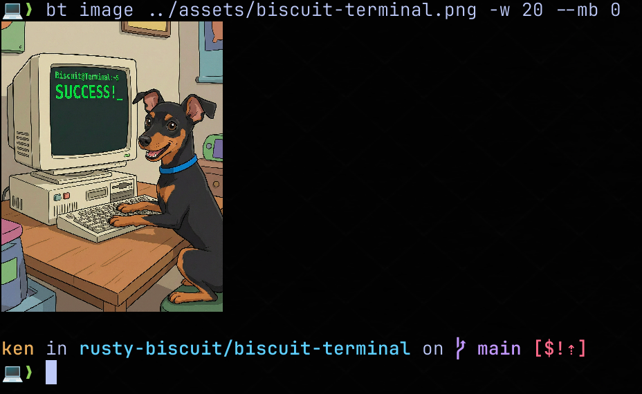
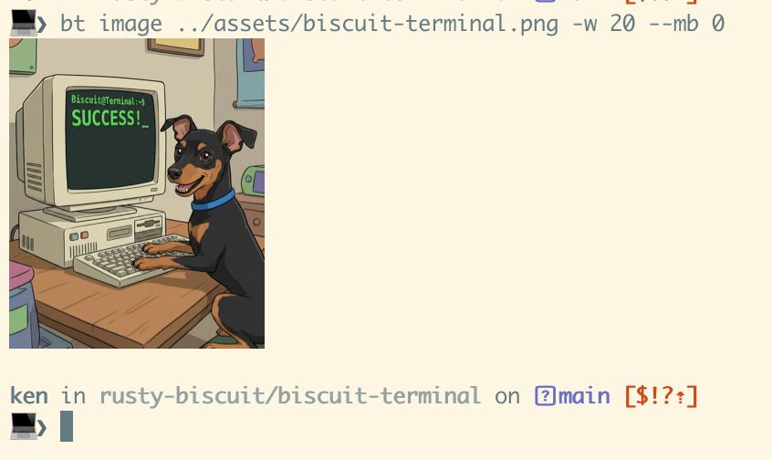
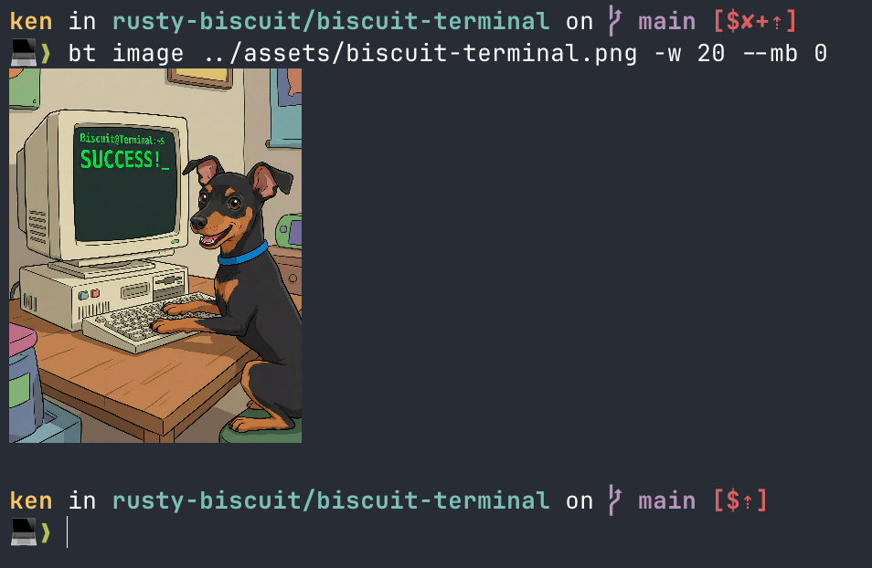
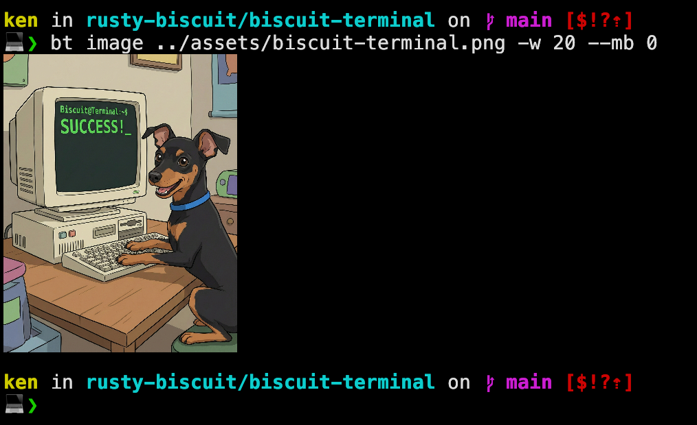

# Terminal Image Rendering Notes

This document captures the current behavior of inline image rendering in `biscuit-terminal`, why behavior differs by terminal, and what issues remain unresolved.

## Problem Space

Inline terminal images are not standardized across emulators in practice, even when they support the same protocol.

Two commands that look equivalent can still differ in:

- how many rows the terminal considers occupied by the image
- whether the cursor is auto-advanced after image draw
- whether cursor save/restore includes image state side effects
- how floating-point image scaling rounds to terminal cells
- when rendering work is flushed relative to shell prompt redraw

The current debugging baseline command is:

```bash
bt image ../assets/biscuit-terminal.png -w 20 --mb 0
```

The intended result is no blank line below the image when `--mb 0`.

## Terminal Variance Matrix

Current observed behavior from testing in this repo:

| Terminal | Protocol Path | Current Status | Cursor Rounding | Notes |
|---|---|---|---|---|
| Kitty | Kitty graphics (width-only) | Correct | `ceil` | Reference baseline |
| Warp | Kitty graphics (width-only) | Correct | `ceil` | Nearly correct; small partial-row gap visible at bottom |
| WezTerm | Kitty graphics (`c=` + `r=`) | Blank line | `floor` | Image renders correctly; blank line persists (both after `clear` and otherwise) |
| Ghostty | Kitty graphics (width-only) | Intermittent | `floor` | Image correct; no blank line after `clear`, blank line present otherwise |
| iTerm2 | Native OSC 1337 | Blank line | `floor - 1` | Image renders correctly; blank line persists (same as WezTerm) |

Important nuance: terminals can render the image pixels correctly but disagree about the logical cursor row after rendering. Most of the remaining bug is cursor row accounting, not image decoding.

## Why `clear` Changes Behavior

`clear` is simple from a user perspective, but terminal state after `clear` is not fully uniform across emulators.

Common reasons image behavior shifts after `clear`:

- `clear` usually emits `CSI H` + `CSI 2J`, which resets cursor position and clears visible content, but not every emulator handles image layers and scrollback surfaces the same way.
- Some terminals treat image planes separately from text cells and recompute clipping/placement after a full-screen clear.
- The shell prompt redraw immediately after `clear` can race with asynchronous image decode/display, changing where the terminal believes the current row is.
- Line-wrap and margin state interactions (`DECAWM`, scroll region behavior) can differ after a hard repaint cycle.
- If a terminal internally rounds image-to-cell height differently at top-of-screen versus scrolled regions, row accounting can change after `clear`.

In short: `clear` can expose state transition bugs in terminal emulators and in applications that rely on exact row math.

## Current Implementation

The image pipeline currently does the following.

1. Detect terminal capabilities and app identity.
2. Select protocol path.
3. Compute expected image height in terminal rows.
4. Emit image sequence wrapped in save/restore cursor controls.
5. Advance cursor by a terminal-specific row correction.
6. Apply explicit top/bottom margins from layout flags.

### Protocol selection

- iTerm2 is forced to native OSC 1337 rendering even if Kitty support is advertised.
- Most Kitty-protocol terminals (Kitty, Warp, Ghostty) use width-only sizing (`c=` without `r=`), letting the terminal determine row count from the aspect ratio.
- WezTerm requires explicit row sizing (`c=` + `r=`) — width-only causes massively incorrect aspect ratio.

Primary implementation points:

- `biscuit-terminal/lib/src/components/terminal_image.rs`
- `render_to_terminal()`
- `render_kitty_for_terminal()`
- `render_iterm2_for_terminal()`

### Cursor strategy

Two distinct strategies based on protocol:

**Kitty protocol** (Kitty, Warp, WezTerm, Ghostty):

```text
ESC[s <optional horizontal offset> <image protocol sequence> ESC[u ESC[{rows}B CR
```

Save/restore cursor wraps the image sequence. The Kitty protocol does not move the cursor, so explicit row advancement is required.

**iTerm2 protocol** (OSC 1337):

```text
ESC[s <optional horizontal offset> <image protocol sequence> ESC[u ESC[{rows}B CR
```

Same save/restore pattern as Kitty. The OSC 1337 protocol auto-advances the cursor after the image, but save/restore neutralizes that auto-advance so explicit cursor management can take over.

This means:

- save/restore wraps the image to reset cursor after iTerm2's protocol auto-advance
- final cursor placement is centralized via explicit row movement
- carriage return normalizes to column 0 for subsequent prompt/text rendering

### Row calculation

Rows are derived from:

- image aspect ratio
- resolved width in terminal cells
- detected cell pixel size from `discovery::fonts::cell_size()`
- fallback cell size `8x16` if detection fails

#### Terminal-specific rounding

Terminals differ in how they handle partial cell rows at the bottom of an image:

- **Kitty/Warp** use ceil-based row counting — a partially filled final row still consumes a full terminal row. Cursor advancement uses `ceil(raw_height)`.
- **WezTerm/Ghostty** use floor-based row counting — a partially filled final row does NOT consume an extra terminal row. Cursor advancement uses `floor(raw_height)`.
- **iTerm2** uses floor-based counting plus an additional -1 for its native OSC 1337 protocol cursor positioning. Cursor advancement uses `floor(raw_height) - 1`.

For images whose height is an exact integer number of cells, ceil and floor produce the same value, so all terminals agree.

### CLI emission behavior

`bt` prints the image sequence directly and flushes stdout immediately, without adding extra newline/up-cursor compensation. Margin lines are emitted explicitly via layout options.

Primary CLI point:

- `biscuit-terminal/cli/src/main.rs`
- `emit_image_output()`

## What This Design Solves

- avoids the inverted `%` prompt artifact caused by some prior newline/cursor rewrites
- keeps Kitty and Warp behavior stable for the baseline test case
- keeps WezTerm aspect ratio stable by using explicit row sizing in Kitty protocol
- keeps iTerm2 on its native protocol path for better compatibility than Kitty fallback
- keeps margin behavior explicit and predictable (`--mb` controls intentional blank lines)

## Remaining Issues

Switching from ceil-based to floor-based cursor row advancement fixed Ghostty (after `clear`) but did not resolve WezTerm or iTerm2. The blank line persists for those terminals regardless of rounding strategy.

> **Note:** references to `--mb 0` are references to a "margin bottom" CLI switch which the biscuit-terminal-cli provides. By setting `--mb 0` we are saying there should be zero lines of empty space after the image.

### Current status per terminal

| Terminal | Image | Blank Line | Post-`clear` |
|----------|-------|------------|--------------|
| Kitty | Correct | None | Same |
| Warp | Correct | Nearly one (small partial-row gap) | Same |
| WezTerm | Correct | Always present | Also present |
| Ghostty | Correct | Present in normal use | **None** after `clear` |
| iTerm2 | Correct | Always present | Also present |

### Key observations

- **Ghostty's intermittent behavior is the strongest diagnostic signal.** It works correctly after `clear` (cursor at top of screen, no scrollback) but shows a blank line in normal use (cursor mid/bottom of screen). This suggests the issue is scroll-related rather than purely a rounding problem.
- **`\x1b[NB` (CUD) does not scroll at the bottom margin.** When the image renders near the bottom of the screen and the terminal scrolls to accommodate it, save/restore + CUD may miscalculate because the saved cursor position shifts relative to the scrolled content.
- **WezTerm and iTerm2 always show the blank line**, suggesting their scroll/cursor interaction is consistently off by one row, not just when near the screen bottom.
- **Neither `ceil` nor `floor` fixes WezTerm/iTerm2.** Both produce a blank line, which means the issue is not purely about rounding.

### Attempted approaches

| Approach | Ghostty | WezTerm | iTerm2 |
|----------|---------|---------|--------|
| `ceil` cursor advance (original) | Blank line | Blank line | Blank line |
| `floor` cursor advance (current) | Fixed after `clear` | Blank line | Blank line (`floor - 1`) |
| Remove `r=` for WezTerm | N/A | Massively wrong aspect ratio | N/A |
| Remove save/restore for iTerm2 | N/A | N/A | Inverted `%` + two blank lines |
| `\n` repeated N times instead of CUD | Not tested | Massive over-scroll; prompt pushed to screen bottom | Not tested |
| Remove save/restore for WezTerm/Ghostty only | Inconsistent: many blank lines or one | Inconsistent: many blank lines or one | N/A |

| Wezterm | iTerm2 | Ghostty | Kitty |
| ------- | ------ | ------- | ----- |
| |   |  |  |


## What NOT to Do

These approaches have been tested and caused regressions. Do not re-attempt them without strong new evidence.

### Do NOT replace CUD with newlines

Replacing `\x1b[NB` (CUD) with `\n` repeated N times for cursor advancement causes catastrophic over-scrolling. In WezTerm, the prompt was pushed to the very bottom of the screen with a massive blank gap between image and prompt. The theory was sound (newlines scroll at the bottom margin while CUD does not), but in practice each `\n` triggers both a line feed AND a carriage return via the terminal driver's ONLCR translation, and the interaction with save/restore cursor wrapping produces far more scroll than intended. The terminal's own image rendering has already handled any necessary scrolling; adding scroll-capable advancement on top double-counts it.

### Do NOT remove save/restore cursor wrapping

Removing `\x1b[s`/`\x1b[u` around the image sequence causes regressions on every terminal tested:

- **iTerm2**: Inverted `%` prompt artifact (zsh no-newline indicator) and two blank lines.
- **WezTerm and Ghostty** (Kitty protocol only, targeted removal): Inconsistent behavior — sometimes many blank lines, sometimes just one. Worse than the stable single blank line from the baseline. The theory that save/restore captures a stale pre-scroll position and that Kitty protocol's no-cursor-move makes it a safe no-op was wrong in practice. Terminals appear to rely on the save/restore sequence as part of their image placement bookkeeping, even for Kitty protocol.

Save/restore is required for **all** terminals and **all** protocols. Do not remove it selectively or universally.

### Do NOT remove `r=` from WezTerm's Kitty protocol

WezTerm requires both `c=` (columns) and `r=` (rows) in the Kitty graphics protocol. Using width-only (`c=` without `r=`) causes massively incorrect aspect ratios. Other Kitty-protocol terminals (Kitty, Warp, Ghostty) work correctly with width-only.

### Do NOT use `ceil` rounding for floor-based terminals

WezTerm, Ghostty, and iTerm2 use floor-based row counting. Applying ceil-based rounding (which is correct for Kitty and Warp) adds exactly one blank line below the image on these terminals. The terminal-specific rounding in `render_to_terminal()` exists for a reason — changes to it must be tested per-terminal.

### General principles

- **Always test in all 5 target terminals** (Kitty, Warp, WezTerm, Ghostty, iTerm2) before declaring a fix.
- **Never assume a mechanism that works for one terminal works for all.** The variance matrix exists because terminals genuinely disagree on cursor semantics.
- **The current CUD approach (`\x1b[NB\r`) is the known-best baseline.** It is correct for Kitty and Warp, and produces only a single blank line (not a catastrophic regression) for the others. Any replacement must be strictly better, not just theoretically appealing.
- **Regressions on working terminals are worse than unsolved blank lines.** A one-line gap on WezTerm is cosmetic; a full-screen gap or broken prompt is a showstopper.

## Why This Is Hard to Fully Normalize

Terminal image protocols provide transport and sizing knobs, but not a single cross-emulator contract for final cursor row semantics. Even with identical escape sequences, emulators can differ in:

- rounding policy from pixels to rows
- whether row occupancy includes partially filled final rows
- when cursor state is updated relative to image display completion
- how save/restore interacts with non-text rendering operations

That makes perfect parity a calibration problem across terminal implementations.

## Recommended Next Work

If we continue refining this, the most practical path is:

1. Add emulator-specific golden tests using recorded escape output plus screenshot-based assertions in CI (where possible).
2. Introduce an internal per-emulator cursor calibration table keyed by app version ranges.
3. Add a debug mode that prints computed row math and chosen correction for quick field diagnosis.
4. Consider a user override flag to force cursor row correction (`--image-row-adjust`) for edge environments.

