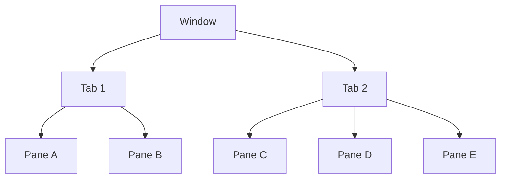

# WezTerm Multiplexing

WezTerm is a GPU-accelerated, cross-platform terminal emulator and multiplexer written in Rust with Lua-based configuration. It runs on **Linux, macOS, Windows 10, FreeBSD, and NetBSD**.

| Property | Value |
| --- | --- |
| Latest stable release | `20240203-110809-5046fc22` (February 3, 2024) |
| Nightly builds | Continuously built from `main`; recommended by the maintainer |
| Configuration language | Lua |
| Repository | [github.com/wezterm/wezterm](https://github.com/wezterm/wezterm) |
| Documentation | [wezterm.org](https://wezterm.org/) |

Unlike tmux or screen which run entirely server-side, WezTerm integrates remote multiplexer domains into its native GUI — providing direct mouse, clipboard, and scrollback interaction without a separate attach/detach workflow.

## Configuration Files

### File Search Order

WezTerm searches for its Lua configuration in this priority order:

1. `--config-file` CLI argument
2. `$WEZTERM_CONFIG_FILE` environment variable
3. `wezterm.lua` adjacent to `wezterm.exe` (Windows portable/thumb-drive mode)
4. `$XDG_CONFIG_HOME/wezterm/wezterm.lua`
5. `$HOME/.config/wezterm/wezterm.lua`
6. `$HOME/.wezterm.lua`

### Platform-Specific Paths

| Platform | Typical path |
| --- | --- |
| macOS | `~/.wezterm.lua` or `~/.config/wezterm/wezterm.lua` |
| Linux | `$XDG_CONFIG_HOME/wezterm/wezterm.lua` (usually `~/.config/wezterm/wezterm.lua`) |
| Windows | `%USERPROFILE%\.wezterm.lua` or portable mode next to `wezterm.exe` |
| FreeBSD/NetBSD | Same XDG convention as Linux |

### Minimal Config Skeleton

```lua
local wezterm = require 'wezterm'
local config = wezterm.config_builder()

-- Configuration goes here

return config
```

### Reloading

- **Automatic**: WezTerm watches the config file and reloads on save
- **Manual**: `Ctrl+Shift+R` (or `Cmd+R` on macOS)
- **CLI override**: `wezterm --config enable_scroll_bar=true`
- **Module paths**: Custom Lua modules resolve from `~/.config/wezterm` and `~/.wezterm`

> **Note:** The config file may be evaluated multiple times per process — avoid side effects in the main config flow.

## Multiplexing Architecture

WezTerm organizes terminal sessions into a three-level hierarchy:



Sessions are grouped into **multiplexing domains** — distinct sets of windows and tabs that persist independently. The system always has a default local domain, and can connect to additional remote domains.

### Domain Types

#### Local Domain

The default — panes, tabs, and windows managed by the local WezTerm process. No configuration required.

#### Unix Domains (Socket-Based)

Connects via AF_UNIX sockets (Linux, macOS, Windows/WSL). Enables tmux-like session persistence — detach the GUI, reattach later.

```lua
config.unix_domains = {
  {
    name = 'unix',
    -- socket_path = "/some/path",        -- auto-computed if omitted
    -- no_serve_automatically = false,     -- start server if needed
    -- local_echo_threshold_ms = 10,       -- predictive echo for latency
  },
}

-- Auto-connect on startup
config.default_gui_startup_args = { 'connect', 'unix' }
```

Connect manually: `wezterm connect unix`

#### SSH Domains

Remote multiplexing over SSH (requires WezTerm on the remote host).

```lua
config.ssh_domains = {
  {
    name = 'my.server',
    remote_address = '192.168.1.1',
    username = 'wez',
  },
}
```

Connect: `wezterm connect my.server`

**Auto-population** (v20230408+): WezTerm automatically creates SSH domains from `~/.ssh/config`:
- Plain SSH: `SSH:hostname`
- Multiplexed SSH: `SSHMUX:hostname`

Example: `wezterm connect SSHMUX:my.server`

#### TLS Domains

Encrypted TCP connections with SSH-bootstrapped certificate exchange.

```lua
-- Client
config.tls_clients = {
  {
    name = 'server.name',
    remote_address = 'server.hostname:8080',
    bootstrap_via_ssh = 'server.hostname',
  },
}

-- Server
config.tls_servers = {
  {
    bind_address = 'server.hostname:8080',
  },
}
```

Connect: `wezterm connect server.name` — bootstraps via SSH, obtains a certificate, then reconnects over TLS.

### Workspaces

Workspaces group related windows (analogous to tmux sessions). Each `MuxWindow` belongs to a workspace label. Only windows in the active workspace are displayed; others remain hidden.

Key actions for workspace management:
- `SwitchToWorkspace` — navigate to a named workspace
- `SwitchWorkspaceRelative` — cycle through workspaces
- `ShowLauncherArgs { flags = 'FUZZY|WORKSPACES' }` — fuzzy workspace picker

## Keybinding Configuration

### Binding Syntax

Bindings are defined in the `config.keys` table. Each entry specifies a key, optional modifiers, and an action:

```lua
local act = wezterm.action

config.keys = {
  { key = '|', mods = 'CTRL|SHIFT', action = act.SplitHorizontal { domain = 'CurrentPaneDomain' } },
  { key = '-', mods = 'CTRL|SHIFT', action = act.SplitVertical { domain = 'CurrentPaneDomain' } },
}
```

**Modifier names:** `SUPER`/`CMD`/`WIN`, `CTRL`, `SHIFT`, `ALT`/`OPT`/`META`, `LEADER`. Combine with `|`.

**Key formats:**
- Named: `"Enter"`, `"Tab"`, `"Escape"`, `"F1"`–`"F24"`, `"LeftArrow"`, etc.
- Character: `"a"`, `"|"`, `"%"`
- Physical: `"phys:A"` (position-based, ignores keyboard layout)
- Raw OS code: `"raw:123"`

### Leader Key

A leader key enables modal keybinding (like tmux `Ctrl+b`). After pressing the leader, a timeout window opens for follow-up keys:

```lua
config.leader = {
  key = 'a',
  mods = 'CTRL',
  timeout_milliseconds = 1000,
}

config.keys = {
  -- Leader + | → horizontal split
  { key = '|', mods = 'LEADER|SHIFT', action = act.SplitHorizontal { domain = 'CurrentPaneDomain' } },
  -- Leader + - → vertical split
  { key = '-', mods = 'LEADER', action = act.SplitVertical { domain = 'CurrentPaneDomain' } },
  -- Leader + Ctrl+a → send Ctrl+a through
  { key = 'a', mods = 'LEADER|CTRL', action = act.SendKey { key = 'a', mods = 'CTRL' } },
}
```

### Key Tables (Modal Modes)

Key tables define named sets of bindings activated on demand — useful for resize modes, pane navigation modes, etc.

```lua
config.keys = {
  -- Enter resize mode with Leader + r
  {
    key = 'r',
    mods = 'LEADER',
    action = act.ActivateKeyTable {
      name = 'resize_pane',
      one_shot = false,          -- stay in mode until Escape
      timeout_milliseconds = 3000,
    },
  },
  -- Enter pane navigation mode with Leader + p
  {
    key = 'p',
    mods = 'LEADER',
    action = act.ActivateKeyTable {
      name = 'activate_pane',
      one_shot = true,           -- exit after one keypress
    },
  },
}

config.key_tables = {
  resize_pane = {
    { key = 'LeftArrow',  action = act.AdjustPaneSize { 'Left', 1 } },
    { key = 'RightArrow', action = act.AdjustPaneSize { 'Right', 1 } },
    { key = 'UpArrow',    action = act.AdjustPaneSize { 'Up', 1 } },
    { key = 'DownArrow',  action = act.AdjustPaneSize { 'Down', 1 } },
    { key = 'Escape',     action = 'PopKeyTable' },
  },
  activate_pane = {
    { key = 'LeftArrow',  action = act.ActivatePaneDirection 'Left' },
    { key = 'RightArrow', action = act.ActivatePaneDirection 'Right' },
    { key = 'UpArrow',    action = act.ActivatePaneDirection 'Up' },
    { key = 'DownArrow',  action = act.ActivatePaneDirection 'Down' },
  },
}
```

`ActivateKeyTable` parameters:
- `name` — key table to activate
- `one_shot` — deactivate after one keypress
- `timeout_milliseconds` — auto-deactivate after timeout
- `replace_current` — replace current stack entry instead of pushing
- `until_unknown` — deactivate on any unmapped key

Use `window:active_key_table()` in status bar events to display the current mode.

### Default Multiplexing Keybindings

#### Pane Splitting

| Keybinding | Action |
| --- | --- |
| `Ctrl+Shift+Alt+"` | `SplitVertical` (new pane below) |
| `Ctrl+Shift+Alt+%` | `SplitHorizontal` (new pane right) |

#### Pane Navigation

| Keybinding | Action |
| --- | --- |
| `Ctrl+Shift+LeftArrow` | `ActivatePaneDirection "Left"` |
| `Ctrl+Shift+RightArrow` | `ActivatePaneDirection "Right"` |
| `Ctrl+Shift+UpArrow` | `ActivatePaneDirection "Up"` |
| `Ctrl+Shift+DownArrow` | `ActivatePaneDirection "Down"` |

#### Pane Resizing

| Keybinding | Action |
| --- | --- |
| `Ctrl+Shift+Alt+LeftArrow` | `AdjustPaneSize {"Left", 1}` |
| `Ctrl+Shift+Alt+RightArrow` | `AdjustPaneSize {"Right", 1}` |
| `Ctrl+Shift+Alt+UpArrow` | `AdjustPaneSize {"Up", 1}` |
| `Ctrl+Shift+Alt+DownArrow` | `AdjustPaneSize {"Down", 1}` |

#### Pane Zoom

| Keybinding | Action |
| --- | --- |
| `Ctrl+Shift+Z` | `TogglePaneZoomState` |

#### Tab Management

| Keybinding | Action |
| --- | --- |
| `Cmd+T` / `Ctrl+Shift+T` | `SpawnTab "CurrentPaneDomain"` |
| `Cmd+W` / `Ctrl+Shift+W` | `CloseCurrentTab {confirm=true}` |
| `Cmd+1`–`9` / `Ctrl+Shift+1`–`9` | `ActivateTab 0`–`8` (9 = last) |
| `Cmd+Shift+[` / `Ctrl+Shift+Tab` | `ActivateTabRelative -1` |
| `Cmd+Shift+]` / `Ctrl+Tab` | `ActivateTabRelative 1` |
| `Ctrl+Shift+PageUp` | `MoveTabRelative -1` |
| `Ctrl+Shift+PageDown` | `MoveTabRelative 1` |

#### Window Management

| Keybinding | Action |
| --- | --- |
| `Cmd+N` / `Ctrl+Shift+N` | `SpawnWindow` |
| `Alt+Enter` | `ToggleFullScreen` |

### Multiplexing Key Actions Reference

#### Split Actions

| Action | Description |
| --- | --- |
| `SplitHorizontal` | Split active pane; new pane appears to the right |
| `SplitVertical` | Split active pane; new pane appears below |
| `SplitPane` | Advanced split with direction, size, and top-level options |

`SplitPane` offers the most control:

```lua
act.SplitPane {
  direction = 'Right',           -- "Up", "Down", "Left", "Right"
  size = { Percent = 30 },       -- or { Cells = 10 }
  top_level = true,              -- split at tab root, not within active pane
  command = { args = { 'top' } },
}
```

#### Navigation Actions

| Action | Description |
| --- | --- |
| `ActivatePaneDirection "Left\|Right\|Up\|Down\|Next\|Prev"` | Move focus to adjacent pane |
| `ActivatePaneByIndex(n)` | Activate pane by index |
| `PaneSelect` | Modal overlay for pane selection |
| `PaneSelect { mode = 'SwapWithActive' }` | Swap pane positions |
| `PaneSelect { mode = 'MoveToNewTab' }` | Move selected pane to a new tab |
| `PaneSelect { mode = 'MoveToNewWindow' }` | Move selected pane to a new window |

`PaneSelect` modes:
- `Activate` (default) — focus the selected pane
- `SwapWithActive` — exchange positions, focus moves
- `SwapWithActiveKeepFocus` — exchange positions, focus stays
- `MoveToNewTab` — relocate pane to a new tab
- `MoveToNewWindow` — relocate pane to a new window

```lua
config.keys = {
  { key = '8', mods = 'CTRL', action = act.PaneSelect },
  { key = '9', mods = 'CTRL', action = act.PaneSelect { alphabet = '1234567890' } },
  { key = '0', mods = 'CTRL', action = act.PaneSelect { mode = 'SwapWithActive' } },
}
```

#### Resize and Layout Actions

| Action | Description |
| --- | --- |
| `AdjustPaneSize { direction, amount }` | Resize pane edge by `amount` cells |
| `TogglePaneZoomState` | Toggle pane zoom (fills tab) |
| `SetPaneZoomState(bool)` | Explicitly set zoom state |
| `RotatePanes "Clockwise"` | Rotate pane contents clockwise |
| `RotatePanes "CounterClockwise"` | Rotate pane contents counter-clockwise |

```lua
{ key = 'b', mods = 'CTRL', action = act.RotatePanes 'CounterClockwise' },
{ key = 'n', mods = 'CTRL', action = act.RotatePanes 'Clockwise' },
```

## Programmatic Interaction (CLI)

WezTerm provides a comprehensive CLI for scripting multiplexer operations. The `wezterm cli` subcommand connects to a running WezTerm instance (GUI or mux server).

### Instance Targeting

The CLI determines which instance to control using:

1. `--prefer-mux` flag (consults config for unix domain)
2. `$WEZTERM_UNIX_SOCKET` environment variable
3. Auto-discovery of a running GUI instance

Pane targeting (when `--pane-id` is omitted) uses `$WEZTERM_PANE`, then the most recently focused pane.

### CLI Commands

| Command | Description |
| --- | --- |
| `spawn` | Create a new tab (or window with `--new-window`) |
| `split-pane` | Split the current pane |
| `list` | List all windows, tabs, and panes |
| `list-clients` | List connected clients |
| `send-text` | Send text to a pane (as paste) |
| `activate-pane` | Activate a specific pane |
| `activate-pane-direction` | Activate adjacent pane by direction |
| `activate-tab` | Activate a tab by index |
| `adjust-pane-size` | Resize a pane |
| `get-pane-direction` | Query which pane is in a given direction |
| `get-text` | Retrieve text content from a pane |
| `kill-pane` | Close a pane |
| `move-pane-to-new-tab` | Move a pane into its own tab |
| `rename-workspace` | Rename the current workspace |
| `set-tab-title` | Set the title of a tab |
| `set-window-title` | Set the title of a window |
| `zoom-pane` | Toggle zoom on a pane |

### Scripting Examples

#### Create a development layout

```bash
#!/bin/bash
# Spawn an editor in a new tab, capture its pane ID
EDITOR_PANE=$(wezterm cli spawn -- nvim)

# Split right for a terminal (30% width)
TERM_PANE=$(wezterm cli split-pane --right --percent 30 --pane-id "$EDITOR_PANE")

# Split the terminal pane downward for logs
LOG_PANE=$(wezterm cli split-pane --bottom --percent 50 --pane-id "$TERM_PANE")

# Send a command to the log pane
wezterm cli send-text --pane-id "$LOG_PANE" "tail -f /var/log/syslog"
```

#### List panes as JSON

```bash
wezterm cli list --format json
```

Output fields: `window_id`, `tab_id`, `pane_id`, `workspace`, `size`, `title`, `cwd`.

#### Split pane options

```bash
# Bottom split (default), 50% height
wezterm cli split-pane

# Left split, 30% width
wezterm cli split-pane --left --percent 30

# Right split, fixed 40 cells wide
wezterm cli split-pane --right --cells 40

# Top-level split (spans full tab, not just active pane)
wezterm cli split-pane --right --top-level

# Move an existing pane into a split
wezterm cli split-pane --right --move-pane-id 3

# Split with a specific program and working directory
wezterm cli split-pane --bottom --cwd /tmp -- htop
```

#### Spawn into a specific domain

```bash
wezterm cli spawn --domain-name SSHMUX:my.server
```

#### Send text to a pane

```bash
# Direct text
wezterm cli send-text --pane-id 2 "cargo test"

# Via stdin
echo "ls -la" | wezterm cli send-text --pane-id 2

# Raw send (bypass bracketed paste)
wezterm cli send-text --no-paste --pane-id 2 $'\x03'  # sends Ctrl+C
```

### Mux Server

For headless/persistent sessions, run the multiplexer server directly:

```bash
wezterm-mux-server --daemonize
```

Then attach from any WezTerm GUI:

```bash
wezterm connect unix
```

The server manages sessions independently of the GUI — connections can be dropped and re-established without losing state.

## Complete Configuration Example

A tmux-like configuration using a leader key and modal key tables:

```lua
local wezterm = require 'wezterm'
local act = wezterm.action
local config = wezterm.config_builder()

-- Leader key: Ctrl+a (like tmux Ctrl+b)
config.leader = { key = 'a', mods = 'CTRL', timeout_milliseconds = 1000 }

config.keys = {
  -- Pane splitting
  { key = '|', mods = 'LEADER|SHIFT', action = act.SplitHorizontal { domain = 'CurrentPaneDomain' } },
  { key = '-', mods = 'LEADER',       action = act.SplitVertical { domain = 'CurrentPaneDomain' } },

  -- Pane navigation
  { key = 'h', mods = 'LEADER', action = act.ActivatePaneDirection 'Left' },
  { key = 'j', mods = 'LEADER', action = act.ActivatePaneDirection 'Down' },
  { key = 'k', mods = 'LEADER', action = act.ActivatePaneDirection 'Up' },
  { key = 'l', mods = 'LEADER', action = act.ActivatePaneDirection 'Right' },

  -- Pane zoom
  { key = 'z', mods = 'LEADER', action = act.TogglePaneZoomState },

  -- Pane selection overlay
  { key = 'q', mods = 'LEADER', action = act.PaneSelect },
  { key = 'Q', mods = 'LEADER|SHIFT', action = act.PaneSelect { mode = 'SwapWithActive' } },

  -- Rotate panes
  { key = 'o', mods = 'LEADER', action = act.RotatePanes 'Clockwise' },

  -- Enter resize mode
  { key = 'r', mods = 'LEADER', action = act.ActivateKeyTable { name = 'resize_pane', one_shot = false } },

  -- Tab management
  { key = 'c', mods = 'LEADER', action = act.SpawnTab 'CurrentPaneDomain' },
  { key = 'n', mods = 'LEADER', action = act.ActivateTabRelative(1) },
  { key = 'p', mods = 'LEADER', action = act.ActivateTabRelative(-1) },

  -- Pass through Ctrl+a
  { key = 'a', mods = 'LEADER|CTRL', action = act.SendKey { key = 'a', mods = 'CTRL' } },

  -- Workspace picker
  { key = 's', mods = 'LEADER', action = act.ShowLauncherArgs { flags = 'FUZZY|WORKSPACES' } },
}

config.key_tables = {
  resize_pane = {
    { key = 'h',         action = act.AdjustPaneSize { 'Left', 2 } },
    { key = 'l',         action = act.AdjustPaneSize { 'Right', 2 } },
    { key = 'k',         action = act.AdjustPaneSize { 'Up', 2 } },
    { key = 'j',         action = act.AdjustPaneSize { 'Down', 2 } },
    { key = 'Escape',    action = 'PopKeyTable' },
  },
}

-- Unix domain for persistent sessions
config.unix_domains = {
  { name = 'unix' },
}

return config
```

## Use Cases Where WezTerm Excels

- **Session persistence without tmux**: Unix domains provide detach/reattach without a separate multiplexer
- **Remote development**: SSH and TLS domains integrate remote panes into the native GUI with mouse, clipboard, and scrollback
- **Scriptable layouts**: The CLI enables shell scripts to build repeatable multi-pane workspaces
- **Modal workflows**: Key tables and leader keys support vim-like modal interaction
- **Cross-platform consistency**: Same Lua config works across macOS, Linux, and Windows