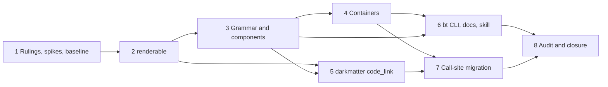

# Plan: `Prose` Is a Block, `InlineProse` Is Inline, and Code Spans Are Code

Implements `spec.md` in this directory. One branch, one merge: phases below are
ordered by dependency on the branch, not shipped separately.

## Summary of the Work

Three coupled changes that touch the same code, docs, and snapshots:

1. **Split the component.** `Prose` becomes a block component (paragraphs + fenced
   code under a `Root`, with `Layout` and a `ProseTag` per paragraph). A new
   `InlineProse` is phrasing-only. Both share one grammar: fenced blocks →
   paragraph split → inline parse. Newlines follow Markdown (soft by default,
   `\` hard break, `LineBreaks::Hard` opt-in, CRLF normalized).
2. **Code spans become `NodeKind::InlineCode`.** Lift spans with a sentinel
   (like fenced blocks), make contents literal (CommonMark), remove the
   inside-out `whole_span_link` rewrite, add a shared safe-fence helper, and a
   terminal fallback that keeps backticks when no styling is emitted.
3. **Ripple.** `renderable` gains a typed block-element attribute and two
   Markdown renderer changes (backslash hard break, safe inline-code fence);
   containers re-type their cells/items; darkmatter gains `code_link()`; about
   980 call sites migrate (inline → `InlineProse`, ~35 single-`\n` sites gain
   `LineBreaks::Hard`, `escape_text`-in-backticks sites drop the call).

Packages: `renderable`, `biscuit-terminal` (lib + `bt` CLI), `darkmatter`
(lib, cli, dmls), `claudine` (lib, cli, gen), and every other consumer the
audit finds (`sniff-cli`, `messenger-cli`, `worktree-cli`, `model-citizen-cli`,
`playa-cli`, `homelab-cli`, plus repo scripts such as `ci-plan`/`ci-build`/
`drift` binaries that construct `Prose`).

### Definition of a Successful Completion

- All 31 acceptance criteria in the spec pass (traceability table at the end).
- `just test` and `just lint` pass in every affected package area, including
  consumers found by the audit; changed examples and benches compile.
- `docs/components/prose.md` and the other Documentation-table rows describe
  only new behavior; `biscuit-terminal` skill names `InlineProse` and
  describes code spans as inline code.
- No remaining `Prose::to_render_nodes`, `whole_span_link`,
  `fold_prose_nodes_into_blocks` / `degrade_code_nodes` on Prose content,
  `class="prose"`, or `render_html_with_layout` (workspace grep, zero hits).
- Every moved snapshot reviewed individually (not accepted in bulk).
- Implementation log written in this directory; the feature stays active
  (agent terminal state: "implementation complete, ready for review"; never
  moves it to `_completed`).

### Phase Map

### Conventions for every phase

- Non-interactive: the whole session tree is non-interactive; subagent briefs
  must repeat this. No `cargo fmt`, no commits (commits are a separate
  operation).
- Use nextest via `just test` / `just test-l2` / `just lint` in the package
  area. New files under `biscuit-terminal/lib/tests/l1/` must be declared in
  that root's `main.rs` (`test_layout.rs` fails otherwise). Select modules with
  `--test l1 <module>::`.
- Use the repo's Test Toolkit; L2/L3 tests must not take window focus.
- A behavior change updates its `///`/`//!` comments in the same task
  (CLAUDE.md "Authoring discipline"). Code wins over a drifted comment; note
  any drift found in the implementation log.
- US English everywhere.
- Review each changed snapshot diff; record the expected category (backticks
  dropped under ANSI strip, `` gone, hard break form, etc.)
  in the implementation log. Unexpected diffs stop the task.
- Input Robustness Matrix: **not applicable.** This work adds a markup grammar,
  not a file-format or configuration reader. The parser's analogous edge cases
  (escapes, sentinels, CRLF, trailing backslash, unclosed fences) are
  enumerated as tests in Phase 3. The one serialized shape that changes
  (`BrowserAttrs` gains an optional field) has absent/legacy/invalid-placement
  tests in Phase 2.

---

## Phase 1 — Rulings, Spikes, and Baseline

Goal: settle the points the spec leaves open, run the two spikes that lower
risk, build the call-site inventory, and record a green baseline.

### Necessary Rules

These rulings are decided here (yolo) so implementers do not re-litigate them.
Each is marked as a default the author may overturn at review.

- [ ] **R1 — Sentinel safety.** Lifted content (fenced blocks and code spans)
  is referenced by a private-use sentinel carrying a table index. Before
  lifting, the parser rewrites any literal sentinel character already present
  in user input into a lifted *literal-text* entry, so input can never
  impersonate a reference. Resolution only trusts indices the parser itself
  issued. (Spec requires this; the mechanism is the ruling.)
- [ ] **R2 — `InlineProse` and `\` before a blank line.** A backslash before a
  blank-line run is literal (matches the `Prose` rule: paragraph boundary beats
  the hard-break marker). In `InlineProse`/`Soft` the run is one soft break; in
  `Hard` mode each `\n` of the run is a hard break (spec: "each `\n` is a hard
  break"), so `a\n\nb` yields two hard breaks. The spec does not state the
  `Hard` + blank-line case for `InlineProse` explicitly; this is the literal
  reading.
- [ ] **R3 — Layout transfer when `Prose` is embedded.** `Prose::to_render_nodes`
  disappears, so containers consume `Prose`'s root children. The root's
  `Layout` transfers to a valid enclosing block: the container's own block node
  (`ListItem`, `BlockQuote`, a `TwoColumn` column block) when that node accepts
  layout, otherwise onto the single `Paragraph` when there is exactly one
  block, and never a nested `Root`. Phase 1 spike S2b confirms which kinds
  `validate.rs` allows layout on; if none fits a case, add the narrowest
  neutral block (not `Section`, which is document structure) and record it.
- [ ] **R4 — Table cell variant naming.** Rename the styled-cell variant
  `StyledProse` → `StyledInlineProse` (no users to protect; avoids a lying
  name). Header labels and string cells convert to `InlineProse`.
- [ ] **R5 — Inline vs block classification rule for migration.** A call site
  is **inline** iff its output is embedded within other text on one line
  (table header/cell, list label, badge, `format!`/`push_str` fragment, value
  inside a line) and **block** iff it is emitted as its own message
  (`println!`/`eprintln!` of the whole result, `StatusBlock`, compose section,
  error body). Pre-rendered `.render(term)` strings migrate by type only
  (spec: out of scope to pass the component itself). **Ambiguous → `Prose`**,
  because it preserves layout, and the ledger lists the site for review.
  An inline-looking site that uses `with_left_margin`, `with_right_margin`,
  `with_word_wrap`, or width helpers is a block site by definition; it stays
  `Prose`, or the positioning moves to its container (spec requirement; never
  silently dropped).
- [ ] **R6 — Fence helper home.** The shared backtick-fence helper lives in
  `renderable` (public, documented), because the Markdown renderer, the
  terminal fallback, and `code_link()` all depend on it and `darkmatter`
  already depends on `renderable`. Signature chosen in Phase 2; normalizes
  newlines to spaces, returns empty text (no fence) for an empty value.
- [ ] **R7 — No new `bt prose` flags.** The spec says document flags *if*
  added; Rule 2 (simplicity) says add none. `--margin-left` and friends stay.
  Output now comes from `Prose` itself with `Layout` as CSS.
- [ ] **R8 — Perf.** The spec names no cost figure, so there is no perf spike.
  The existing `lib/tests/l1/perf_gate.rs` must still pass after the parser
  rewrite; if it fails, that is a defect to fix, not a budget to renegotiate.
- [ ] **R9 — Known-red ledger.** Between phases on the shared branch,
  downstream packages may be red (e.g. darkmatter snapshots after the Markdown
  hard-break change). Each phase's validation covers only the packages it
  touches; the implementation log keeps a ledger of known-red packages and the
  phase that clears each. Nothing merges with a red entry.
- [ ] **R10 — Spec frontmatter `packages:`.** After the audit, any consumer
  missing from the spec's list is recorded in the implementation log's scope
  record, not edited into the spec (a spec is a snapshot).

### Spikes

Each runs once, before the work it informs. None is repeated later.

- [ ] **S1 — Call-site and consumer inventory** (informs Phases 4, 7, 8).
  Produce `implementation-log.md` scope record with a ledger of every
  non-test construction of `Prose` and every consumer, per R5:
  - search the whole workspace (`*.rs`, examples, benches, macros,
    generated-source templates, `build.rs`, repo scripts, packages outside the
    spec's frontmatter list); count by area (spot check: ~787 `Prose::new` in
    `cli` dirs, ~454 in `lib` dirs, `gen`, `dmls`, plus repo-script binaries);
  - classify each site: inline / block / single-`\n` (needs `Hard`) /
    leading-trailing-`\n` spacing / `escape_text`-in-backticks (workspace
    search for `escape_text` near a backtick; ~15 hits at planning time) /
    layout-builder user / pre-rendered string;
  - list every user of `to_render_nodes`, `fold_prose_nodes_into_blocks`,
    `degrade_code_nodes`, `render_html_fragment`, `StyledProse`,
    `IntoProseVec`, `class="prose"`;
  - list generated code and its source template + regeneration command
    (`claudine-gen`).
  - Exit: ledger committed to the log (no code changes). Mechanical
    classification may be scripted; ambiguous rows are flagged, not guessed.
- [ ] **S2 — Terminal renderer feasibility** (informs Phase 3 wave 1c).
  Read-only, one host (macOS):
  - **S2a:** how `render_tree/render.rs` tracks the enclosing appearance. Can
    it restore (not clear) after an `InlineCode`/nested `Span`? Does it expose
    an "effective appearance emitted no styling escape" signal needed for the
    backtick fallback (OSC 8 alone must not count as code styling)?
  - **S2b:** which `NodeKind`s accept `Layout` per `renderable/src/tree/validate.rs`
    (feeds R3).
  - Exit: a short note in the log: "restore is supported / needs a style
    stack of shape X", plus the layout-bearing kind table.

### Tasks

- [ ] **Baseline** — run `just test` and `just lint` in `renderable`,
  `biscuit-terminal`, `darkmatter`, `claudine`, `sniff`, `messenger`,
  `worktree`, `model-citizen`, `playa`, `homelab`; record pass/fail and any
  pre-existing red in the log so later reds are attributable. Also run
  `just test-l2` in `biscuit-terminal` once if available.
- [ ] **Ledger of moved snapshots** — list the snapshot directories likely to
  move (biscuit-terminal `lib/tests/l1/snapshots`, darkmatter
  `l1__error_snapshots__*`, claudine `cli/tests`), so Phase 7 reviews them by
  name.
- [ ] **Create `implementation-log.md`** in the feature directory with sections
  Scope Record, Known-Red Ledger, Snapshot Review, Drift Notes, Departures.

**Validation checkpoint 1:** rulings R1–R10 recorded in the log; S1 ledger and
S2 note written; baseline results recorded. No source changes yet.

---

## Phase 2 — `renderable` Foundations

Goal: the shared renderer pieces everything else builds on. Package area
`renderable`; downstream may go red per R9.

### Wave 1 — independent edits (parallel; disjoint files)

- [x] **Block-element attribute** (`attrs.rs`, `validate.rs`, `render/browser.rs`)
  - add a typed `BlockElement` enum (`P` default-by-absence, `Div`, `Section`,
    `Article`, `Aside`, `Header`, `Footer`) in `BrowserAttrs`, optional,
    omitted when default; update the sparsity predicate (`is_empty`),
    serialization, and deserialization together;
  - validator rejects it on any node but `Paragraph`;
  - normal browser renderer **and** the streaming browser writer honor it;
    terminal and both Markdown dialects ignore it; existing progress-widget
    paragraph rendering unchanged;
  - keep distinct from `NodeKind::Section`;
  - tests: each tag in both browser paths agree; legacy serialized tree
    without the field keeps `
`; invalid placement rejected on every
    non-`Paragraph` kind; round-trip serialization (AC 8, 31).
- [x] **Safe inline-code fence helper** (new public helper per R6)
  - fence = backtick run longer than the longest run in the value (1 if none);
    pad one space each side when the value begins/ends with a backtick, or
    begins and ends with a space and is not all spaces;
  - newlines → spaces before fencing; empty value → empty text, no fence;
  - document the limits explicitly (spec requires it);
  - unit tests for the spec table (`plain`, ``a`b``, `` `a` ``), edge spaces,
    all-space values, multiline, empty, long backtick runs.

### Wave 2 — Markdown renderer (depends on the helper)

- [x] **Markdown inline code** (`render/markdown.rs`): `InlineCode` uses the
  helper; table-cell pipe escaping applied to the value *before* fencing; table
  soft breaks stay spaces.
- [x] **Markdown hard break**: `HardBreak` emits `\` + newline outside tables
  (was two trailing spaces) for both Markdown dialects; ` ` inside tables
  unchanged.
- [x] **Tests** (AC 19, 30): fence table inside and outside a table cell,
  directly constructed nodes (not only via Prose), both dialects, hard-break
  forms.
- [x] **Docs and comments**: `renderable` docs and module docs describing
  inline-code or hard-break Markdown output; `renderable` skill if it
  documents either behavior.

**Validation checkpoint 2:** `just test` and `just lint` green in
`renderable`. Record in the Known-Red Ledger which downstream packages now
fail from the hard-break/fence changes (darkmatter snapshots expected).

---

## Phase 3 — Shared Grammar and the Two Components

Goal: `biscuit-terminal` parses once and projects to both components. All work
in `biscuit-terminal/lib/src/components/prose/` and
`lib/src/render_tree/`. Package areas otherwise untouched until Phase 4.

### Wave 1 — three independent tracks (parallel)

Agree the interface before starting (first task, done by the orchestrator):
`parse_inline(paragraph: &str, mode: LineBreaks) -> Vec<RenderNode>` and the
block splitter's output type (`Vec<Block>` where `Block` is `Paragraph(String)`
or `Code { lang, body }` plus scope-reopen info for bracketed tags).

- [x] **1a — Block splitter and newline rules** (new module; `markdown.rs`
  fenced-block recognition retained)
  - normalize CRLF and lone CR to LF first;
  - recognize opaque fenced blocks first (existing rules kept: language hints,
    unclosed fence consumes the rest); blank lines inside fences are code;
  - then split paragraphs on two or more `\n` with only spaces/tabs between;
  - quoted tag-attribute newlines belong to the attribute, not the splitter;
    **no regex split of raw input**;
  - bracketed style tags and explicit `<a>` crossing a boundary: reopen the
    same inline wrappers inside each paragraph, never put a paragraph inside a
    `Span`/`Link`; fenced blocks inside a style stay sibling blocks and the
    style resumes after them;
  - leading/trailing blank lines produce no blocks; empty and whitespace-only
    `Prose` produce no blocks;
  - `LineBreaks` enum (`Soft` default, `Hard`) defined here.
- [x] **1b — Code-span lifting and sentinel** (`markdown.rs`, `tokens.rs`)
  - lift each span into the lifted-content table with a sentinel placeholder
    (R1: literal sentinel chars in input are pre-escaped);
  - matching rules unchanged (a run opens a span only if a later run of the
    same length closes it; unmatched runs literal) but **never across a
    paragraph boundary**; a span may hold a single newline (→ space);
  - value rules in order: backslashes literal; line endings → spaces; strip
    one space each side when both edges are spaces and not all spaces;
  - placeholder survives link/bold/italics phases, including inside a link
    description, and is resolved straight to `InlineCode` by
    `tokens::parse_render_nodes`; never re-expanded into string markup;
  - remove `whole_span_link` and its `escape_code_spans` branch and its two
    tests; remove the corresponding doc rows/paragraph in `markdown.rs`
    module docs (the `prose.md` rows land in Phase 6);
  - in `InlineProse` mode a fenced block becomes one `InlineCode` (language
    hint dropped, each line ending → space, other whitespace untouched, no
    code-span stripping; empty body → no node).
- [x] **1c — Terminal inline-code rendering** (`render_tree/render.rs`; depends
  on S2 and the Phase 2 helper)
  - inline code drops backticks when it emits styling (theme background/color
    when present, else dim); when the effective appearance emits **no styling
    escape** (decide from the renderer's effective appearance, not `NO_COLOR`
    or depth alone; OSC 8 alone does not count), emit the value in a safe
    backtick fence via the shared helper (raw value, no pipe escaping);
  - after code, restore the enclosing appearance instead of always clearing
    (a red sentence stays red after a code span); preserve a surrounding
    hyperlink;
  - tests independent of OSC 8 support; fallback works in a darkmatter-produced
    tree (build the tree directly, AC 29, 21).

### Wave 2 — inline parse and `InlineProse` (depends on Wave 1)

- [x] **Inline parser** (`parse_inline`): tags, `**`/`_`, links, code spans,
  escapes, soft/hard breaks per mode
  - single `\n` → soft (or hard in `Hard`); discard spaces/tabs around a soft
    break; trailing spaces are never a hard break;
  - `\` hard break only when unescaped and immediately before an in-paragraph
    newline; `\\` + newline = literal backslash + the mode's break; `\` before
    a blank-line boundary or end of input is literal (R2);
  - two or more `\n` in `InlineProse`/`Soft` = one soft break; `Hard` = each
    `\n` hard (R2);
  - escaped tags/delimiters and sentinel-lookalike input stay user content.
- [x] **`InlineProse` type** (new file): `new`, `content`,
  `with_line_breaks`, escape helpers; **no** margin/width/align/wrap builders
  - `to_render_nodes()` returns the inline sequence; `render_tree()` returns a
    single neutral `Span` (also when empty); one shared projection helper feeds
    both `TreeRenderable::render_tree` and
    `TerminalRenderable::render_tree_node` (no legacy terminal parser);
  - `BrowserRenderable` fragment folds and structurally concatenates children
    with no outer element and no string-based HTML rewriting; do not change
    unrelated `Span` rendering;
  - `MarkdownRenderable`: inline text, no trailing paragraph break; empty
    input → empty output.

### Wave 3 — `Prose` block component (depends on Wave 2)

- [x] **`Prose` reshape** (`prose.rs`, `tree.rs`, `mod.rs`): sequence of blocks;
  paragraphs are `InlineProse`-parsed `Paragraph`s, fenced code → `Code`
  blocks under `Root`; `with_line_breaks` forwards the mode to each
  paragraph's parser
- [x] **`ProseTag`** enum and `with_tag`; per-paragraph element via the Phase 2
  attribute; code blocks always `<pre><code>`; tag is HTML-only
- [x] **Layout on every target**: terminal margins/alignment/wrap as today; CSS
  on the browser; browser fragment rendered from `render_tree()` like other
  targets; `` removed; delete the interim-contract doc
  comment on `render_html_fragment`
- [x] **Remove `Prose::to_render_nodes`**; update `escape_text` rustdoc (no
  longer promises clean output inside a code span; do not escape text placed in
  a span)
- [x] **Exports**: `InlineProse`, `LineBreaks`, `ProseTag` from the component
  module, crate public exports, and `prelude`; update `prelude_exports.rs`
- [x] **`parity.rs`** expectations updated for code spans and the new shapes
- [x] **Tests** (new files declared in `lib/tests/l1/main.rs`), one cell per
  case, through public results:
  - paragraph/newline table: `a\nb`, `a\n\nb`, `a\n\n\nb`, `a\n  \nb`,
    `a\\\nb`, `a  \nb`, CRLF and lone-CR twins, `\\` + newline, trailing
    backslash, backslash before blank line, `Hard` mode (AC 2–7, 25, 26);
  - code span: the three projection examples as render trees; Markdown
    unchanged for the link example; terminal OSC 8 sequence order
    (OSC 8 open, dim SGR, text, reset, OSC 8 close, no backtick); HTML
    `<a href><code>` inside `
`; `` `[desc](ref)` `` literal on all targets;
    `` `a\_b` `` literal; space handling (`` `` `a` `` ``, `` ` a ` ``,
    `` `  ` ``); spans never cross paragraphs; unmatched runs literal
    (AC 14–18, 21, 27);
  - bracketed style across paragraphs, fenced block inside a style, blank line
    inside fence, quoted-attribute newline (AC 27);
  - `InlineProse` fenced → inline code, directly (table-cell variant lands in
    Phase 4) (AC 28);
  - empty/whitespace input yields a valid single node (AC 25);
  - sentinel-lookalike input remains user content (R1);
  - fenced `Prose` renders `
` and `<pre><code>` as siblings (AC 9);
  - `Prose` with left margin: margin in terminal and HTML (AC 10 lib half);
  - no `class="prose"` in output; user content containing the string is
    unaffected (AC 11);
  - `perf_gate.rs` passes (R8).

**Validation checkpoint 3:** `just test` and `just lint` green in the
`biscuit-terminal` **lib** unit/L1 tests that do not depend on containers; list
container- and CLI-dependent failures in the Known-Red Ledger. Review every
changed snapshot per the conventions. Grep: no `whole_span_link`, no
`Prose::to_render_nodes`, no `class="prose"` in `lib/src`.

---

## Phase 4 — Containers

Goal: each container accepts the shape in the spec's table. Package:
`biscuit-terminal` lib. Depends on Phase 3.

### Wave 1 — one task per container (parallel; shared file `render_tree/projection.rs` is edited by one task only)

- [ ] **Table** (`components/table/table.rs`): header labels and cells take
  `InlineProse`; string conversions use `InlineProse`; `StyledProse` →
  `StyledInlineProse` (R4); remove `degrade_code_nodes` on Prose content;
  fenced code in a cell becomes inline code (AC 28 table half)
- [ ] **`InlineContent`**: takes `InlineProse`; update `From` impls, helper
  traits, downcasts
- [ ] **Lists** (`components/list.rs`): `UnorderedList`/`OrderedList` items
  take `Prose`; drop `fold_prose_nodes_into_blocks`; nested word wrap and
  `Prose` content ergonomics preserved; layout transfer per R3
- [ ] **`BlockQuote`** (`components/block_quote.rs`): takes `Prose`; drop
  folding; layout transfer per R3
- [ ] **`TwoColumn`**: columns take `Prose` (each a block region); drop its
  text-to-paragraph grouping; layout transfer per R3
- [ ] **`StatusBlock::body` / `body_line`**: take `Prose`; keep `IntoProseVec`
  only if still needed
- [ ] **Projection** (`render_tree/projection.rs`): remove the
  `to_render_nodes`/fold paths; embed `Prose` as root children with layout on a
  valid enclosing block (no nested `Root`, layout exactly once) (AC 31)

Each container keeps its non-Prose entry points (strings, numbers, other
components); strings convert to `InlineProse` in table/`InlineContent` and to
`Prose` in block containers. Update `From` conversions alongside constructor
signatures.

### Wave 2 — tests (parallel with Wave 1 per container after its edit lands)

- [ ] Update `prose_cells_parity.rs`, `unordered_list_parity.rs`,
  `ordered_list_parity.rs`, `render_tree_component_parity.rs`,
  `table_parity.rs`, `two_column_parity.rs`, `status_block_parity.rs`,
  `inline_content_matrix.rs` for the new shapes
- [ ] Assert: `fold_prose_nodes_into_blocks` / `degrade_code_nodes` no longer
  exist or run on Prose content (AC 12); embedded layout exactly once and no
  nested `Root` (AC 31); multiline fence in a table cell → one inline code
  value (AC 28)

**Validation checkpoint 4:** `just test` and `just lint` in `biscuit-terminal`
lib green (L2 not yet; CLI in Phase 6). Component docs for list, table,
block_quote, two_column, inline_content, status updated for the accepted types.

---

## Phase 5 — Darkmatter `code_link()`

Goal: the expression function, catalog entry, and migrated templates. Package
`darkmatter` (lib, dmls) plus `claudine` (`context --expressions`) verification.
Can start after Phase 2 (helper); rendering assertions need Phase 3.

### Wave 1 (parallel)

- [ ] **Factor label/destination resolution** out of `link_fn`
  (`darkmatter/lib/src/markdown/compose/expression/functions/mod.rs`) into a
  shared internal; `link` behavior and error text unchanged; `code_link`
  reports errors under its own function name with the same underlying cause
- [ ] **Bind `code_link`** beside `link` in `functions/paths.rs`:
  `code_link(file)` (portable relative path as text) and
  `code_link(target, desc)`; label goes in a backtick fence via the Phase 2
  helper; `[`/`]` not escaped; backslashes as is; line endings → spaces; empty
  label → ``; same destination spelling/quoting as `link()`
- [ ] **Catalog entry** in `darkmatter/docs/schemas/expression-functions.yaml`
  beside `link`, both overloads, description, one `display-only` example each;
  add `code_link(file)` and `code_link(target, desc)` to the expected-signature
  list in `expression/catalog/mod.rs`; parity test
  `catalog_and_runtime_bindings_have_bidirectional_canonical_parity` passes
- [ ] **Docs**: `darkmatter/docs/topics/darkmatter-expressions.md` function
  table and "Link Helpers" with one example each and the bracket note

### Wave 2 (after Wave 1)

- [ ] **Template migration**: `prompts/plan.md:30`,
  `prompts/_reviews/review-spec-inline.md:18`,
  `claudine/cli/tests/fixtures/nested_span_regression/review-spec-inline.md`,
  `darkmatter/dmls/tests/fixtures/mapping_only_corpus/_reviews__review-spec-inline.md`:
  `` `{{link(x)}}` `` → `{{code_link(x)}}`; `~/.claudine/prompts/` copies are
  out of repo, listed in the final report as a manual step for Ken
- [ ] **Snapshot**: restore `l1__error_snapshots__link__unrecognized_format.snap`
  to literal `[text](href)` (renders without backticks as inline code; review
  the diff, AC 20)
- [ ] **Tests** (AC 22, 23): `code_link("plans/foo.md")` label and destination
  match `link()`; `code_link(url, "a]b")`; `code_link(url, r"a\_b")` shows
  `a\_b` in Prose and in darkmatter's Markdown parser; `code_link(url, "")`;
  backtick in text gets a longer fence; the four templates render a link with
  an inline-code label on every target
- [ ] **Surfaces**: `claudine context --expressions` lists both in the
  Filesystem group beside `link` (add or extend a claudine CLI test); DMLS
  completion offers `code_link`

**Validation checkpoint 5:** the darkmatter expression, catalog, and DMLS
tests green; the `code_link` portion of AC 22 and 23 asserted. Remaining
darkmatter snapshot reds (hard break, inline code, `Prose` shapes) stay in the
ledger for Phase 7.

---

## Phase 6 — `bt` CLI, Documentation, and Skill

Goal: CLI and docs match the code. Packages: `biscuit-terminal-cli`, docs.
Depends on Phases 3–4; can overlap Phase 5.

### Wave 1 — CLI

- [ ] **`bt prose`** (`cli/src/commands/prose.rs`): stop wrapping the fragment
  in its own `
`; remove `render_html_with_layout` and its
  interim-contract doc comment; output comes from `Prose` with `Layout` as CSS
  (R7: no new flags); help text updated
- [ ] **Other `bt` commands** that used `class="prose"` or the old shapes
  (`section.rs`, `list.rs`): update to the new components
- [ ] **CLI tests** (`cli/tests/l1/integration_test.rs`): `--margin-left`
  output carries the margin exactly once; no `class="prose"`; code span
  example with `--html` and `--md` output (AC 10, 11)

### Wave 2 — documentation (parallel with Wave 1; one writer per file)

- [ ] **`docs/components/prose.md`** — every Documentation-table row, section
  by section (intro; Rendering Model with the Mermaid diagram grammar → block
  split → inline parse → render tree → three targets; Programmatic Use;
  new Paragraphs and Line Breaks, Block Tag, Layout sections; Markdown Subset
  rows; code-span paragraph; Escape Mechanism; Graceful Degradation "Inline
  Code"; Supported Tags → Special; Cross-Target Rendering; Prose in Other
  Components/Table Cells; Key API; CLI). Audience: a developer new to the
  repo; lead with what the reader can do, one example per rule. Do not link to
  or name a spec/feature
- [ ] Decide whether `InlineProse` warrants `docs/components/inline-prose.md`;
  if so link it from `prose.md` and keep the grammar documented once in
  `prose.md`
- [ ] Other component pages (`table.md`, `list.md`, `block_quote.md`,
  `two_column.md`, `inline_content.md`, `status.md`, `index.md`,
  `browser-renderable-trait.md`) updated for accepted types and removed
  ``
- [ ] **Skills**: `.claude/skills/biscuit-terminal/SKILL.md`, `styling.md`,
  `components.md`, `cli.md`: name `InlineProse` and when to use it; code spans
  as inline code; `renderable` skill and `darkmatter` skill for the hard-break
  and `code_link` changes
- [ ] README and `docs/dependencies.md` only if crates changed (expected: no)
- [ ] Module docs in `markdown.rs` and `tree.rs` match the new behavior; the
  `prose.md` doc must contain no sentence describing the old behavior (inline-
  only Prose, ``, uninterpreted newlines, fenced code
  degrading to plain text in cells, visible backticks, `` `[desc](ref)` `` as
  a link)

**Validation checkpoint 6:** `just test` and `just lint` green in
`biscuit-terminal` (lib + cli); `just test-l2` run once, window focus not
taken; docs grep for the forbidden old-behavior phrases returns nothing.

---

## Phase 7 — Call-Site Migration and Snapshots

Goal: every consumer compiles and passes with the new shapes. One agent per
package area owns that area's source, tests, and snapshots; areas are
disjoint crates, so they run concurrently (watch shared `target` contention:
stagger heavy builds, use each area's `just test`). Work from the Phase 1 S1
ledger. Rules R5 govern classification. Each agent's brief repeats that the
session tree is non-interactive.

Per-area task template (applies to every wave item):

- [ ] convert inline sites to `InlineProse`; keep block sites as `Prose`
- [ ] single-`\n` sites: add `.with_line_breaks(LineBreaks::Hard)`, strings
  unchanged (~35 across clusters below); verify line structure by existing or
  new snapshot (AC 13)
- [ ] leading/trailing `\n` spacing sites: remove, or move to explicit spacing
  outside the component
- [ ] `escape_text` inside backticks: drop the call (AC 17); confirm no stray
  backslash in the output
- [ ] inline sites using margin/width/wrap builders: move positioning to the
  container, or keep as block `Prose`
- [ ] update moved snapshots one at a time, record the expected-change
  category in the log
- [ ] area `just test`, `just lint`; compile examples and benches separately

### Wave 1 — darkmatter and independent consumers (parallel)

- [ ] **darkmatter** (lib, cli, dmls): `shell_expansion/types.rs` (13
  `<dim>Key:</dim> value\n…` sites) and `shell_blocks/types.rs`;
  `markdown/errors/blocks.rs:192` (YAML excerpt lines);
  `StatusBlock::body` sites; `cli/src/commands/schema/triggers.rs:116`
  (`escape_text` in backticks); every Markdown-output snapshot that relied on
  two-trailing-space hard breaks; confirm darkmatter's own Markdown parser
  round-trips `\` + newline; compose-section and error-body snapshots
- [ ] **sniff-cli**: `commands/repo.rs:439` leading/trailing `\n`; other sites
- [ ] **worktree-cli**: `commands/create.rs:168`; other sites
- [ ] **messenger-cli**, **model-citizen-cli**, **playa-cli**, **homelab-cli**:
  inline vs block per R5
- [ ] **Repo script binaries and any other consumers** from S1 (the
  `ci-plan`, `ci-build`, `ci-build-archive`, `feature-attribution`, `drift`
  group and anything else found): migrate by type; compile with their own
  recipe
- [ ] **biscuit-terminal internal sites** (lib components and CLI commands that
  construct `Prose` for their own output, including examples/benches)

### Wave 2 — claudine (after darkmatter snapshots settle; depends on Wave 1 darkmatter)

- [ ] **claudine lib**: `render/prompt/` leading/trailing `\n`;
  `composition/error/render/lifecycle.rs:150` and other `escape_text`-in-
  backticks sites; error renderers; compose sections
- [ ] **claudine cli**: `output/error_report.rs`, `commands/help.rs`,
  `commands/logs/errors.rs` (single-`\n` → `Hard`), `commands/hooks/list.rs:430`
  (table-cell line break → `InlineProse` in `Hard` mode)
- [ ] **claudine-gen**: change generated code at its source template and
  regenerate with the existing workflow; never hand-edit output
- [ ] claudine CLI fixtures and snapshots reviewed one by one, including the
  `nested_span_regression` fixture from Phase 5

**Validation checkpoint 7:** every area's `just test` and `just lint` green;
Known-Red Ledger empty; each moved snapshot has a logged review note.

---

## Phase 8 — Audit, Full Validation, and Closure

Goal: prove the spec is met and nothing was missed. Depends on Phases 6 and 7.

- [ ] **Workspace audit** — repeat the S1 searches (not a new spike; a
  completion check) over the whole repo; confirm zero hits for
  `Prose::to_render_nodes`, `whole_span_link`, `fold_prose_nodes_into_blocks`
  or `degrade_code_nodes` on Prose content, `class="prose"` / ``,
  `render_html_with_layout`, `StyledProse`, and `escape_text` inside a code
  span; any newly found consumer is compiled, migrated, and added to the scope
  record (R10)
- [ ] **Comment drift pass** — over every symbol whose behavior changed
  (`Prose`, `InlineProse`, `markdown.rs`, `tokens.rs`, containers,
  `renderable` Markdown/browser renderers, `link_fn`); fix or delete drifted
  `///`/`//!`; record drift found and how it was resolved
- [ ] **Full validation** — `just test` and `just lint` in every affected
  package area plus `just test-l2` for `biscuit-terminal`; compile examples and
  benchmarks; run `just ci-local --plan` to review CI scope (do not push)
- [ ] **OS check** — nothing in this work is OS-conditional, but the `os`
  skill's path/temp-dir traps apply to any new fixtures; confirm CRLF/lone-CR
  tests use in-memory strings (no host-specific files) so Windows and WSL2
  results match
- [ ] **Acceptance traceability** — fill the table below with the test name per
  criterion; every row green
- [ ] **Implementation log** — scope record final, snapshot review list,
  departures from the spec (docs corrected, spec untouched), and a note that
  `~/.claudine/prompts/plan.md` and `_reviews/review-spec-inline.md` need a
  manual `code_link` edit by Ken
- [ ] **Terminal state** — implementation complete, ready for review; do not
  move to `_completed`, do not run `just complete`, do not commit (a separate
  operation)

**Validation checkpoint 8 (final):** all 31 acceptance criteria green; Definition
of Done list satisfied.

---

## Acceptance Traceability

| AC | Subject | Phase |
|----|---------|-------|
| 1 | `InlineProse` Markdown/browser/terminal | 3 |
| 2–7 | newline, paragraph, hard-break, mode, trailing-space, inline-blank | 3 |
| 8 | `ProseTag`, validator rejection | 2, 3 |
| 9 | `
` + `<pre><code>` siblings | 3 |
| 10 | margin once, `bt prose --margin-left` | 3, 6 |
| 11 | no `class="prose"` | 3, 6, 8 |
| 12 | containers, fold/degrade gone | 4 |
| 13 | single-`\n` sites keep structure | 7 |
| 14–16 | code-span projection, per-target output, literal `[desc](ref)` | 3 |
| 17 | `a\_b` literal, `escape_text` sites | 3, 7 |
| 18 | space handling | 3 |
| 19 | Markdown fence tests | 2 |
| 20 | `unrecognized_format` snapshot | 5 |
| 21 | `ColorDepth::None` backtick fallback | 3 (1c) |
| 22–23 | `code_link`, catalog, `claudine context --expressions`, DMLS | 5 |
| 24 | `just test` / `just lint` everywhere | 7, 8 |
| 25–28 | empty input, CRLF, style across paragraphs, fenced in `InlineProse` | 3, 4 |
| 29 | nested code restores styles/hyperlink | 3 (1c) |
| 30 | hard-break and fence output, both dialects | 2 |
| 31 | tag parity, legacy tags, embedded layout once | 2, 4 |

## Risks to Watch

- **Parser rewrite regressions** (≈4.5k lines in `components/prose/`): mitigated
  by writing the Phase 3 test tables first and keeping `perf_gate.rs` green.
- **Snapshot volume** from the Markdown hard-break change and dropped
  backticks: review one by one; categorize in the log.
- **Shared branch reds between phases:** tracked in the Known-Red Ledger (R9).
- **Classification errors in Phase 7:** ambiguous sites default to `Prose`
  (R5) and are listed for review rather than guessed.
- **Build contention** when many agents compile in one worktree: stagger heavy
  builds; prefer each area's `just` recipe.
