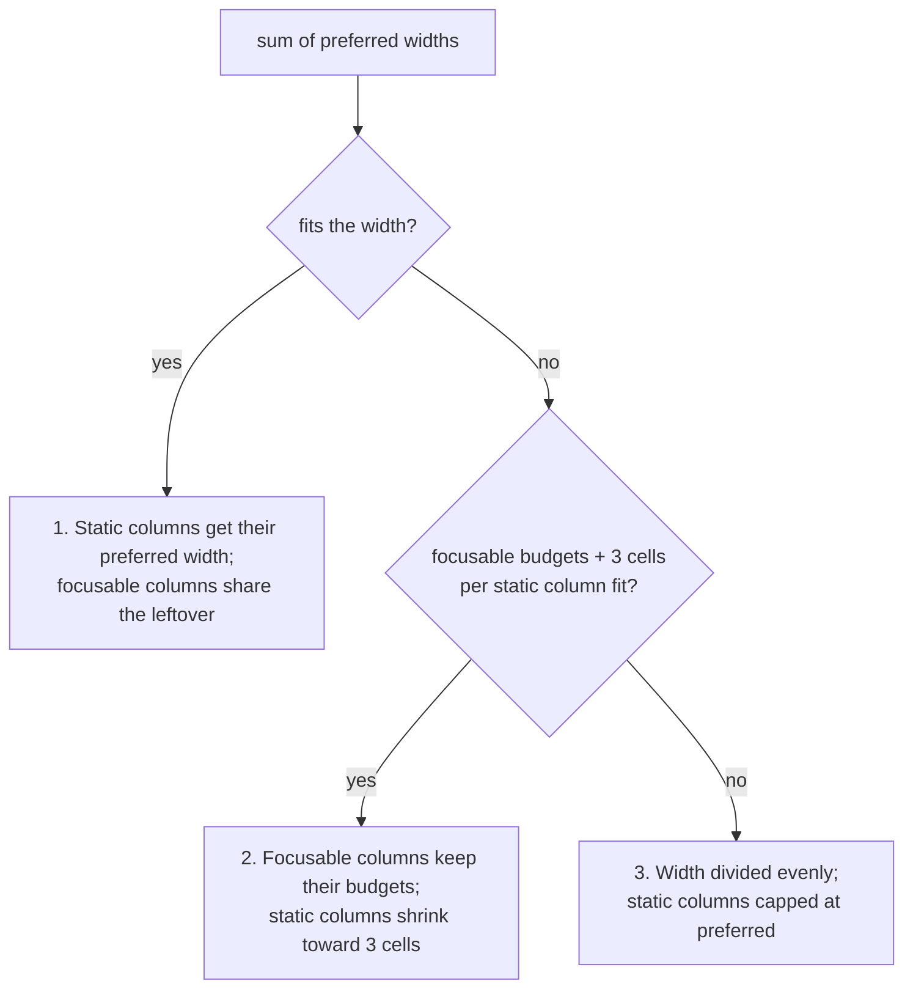

# InputTable

The `InputTable` is a grid-based form component for terminal user interfaces. It allows you to arrange multiple rows and columns of heterogeneous editable cells, making it ideal for complex data entry tasks where a single flat list of prompts is insufficient.

## Description

`InputTable` manages a 2D matrix of input widgets. Each column in the table is configured with a specific type, and every row contains a corresponding cell. The component supports a variety of cell types, including single-line text, multi-line text areas, boolean switches (checkboxes), and single or multi-choice selections.

It follows the standard `ratatui` stateful widget pattern, separating the rendering logic (`InputTable` widget) from the schema and data management (`InputTableState`).

`InputTableState` implements the [`StandaloneState`](../../theming.md#standalonestate) trait with `Value = Vec<Row>`, so it can be driven by [`run_standalone`](../../theming.md#run_standalone) or embedded in a larger application event loop.

## Parameters & Defaults

Configuration is handled via `InputTableState`.

| Parameter | Method | Default | Description |
|-----------|--------|---------|-------------|
| **Columns** | `new(columns, ...)` | Required | A vector of `InputTableColumn` definitions defining the table schema. |
| **Initial Rows**| `new(..., rows)` | Required | A vector of `Row` objects seeding the table with initial values. |
| **Blank Rows** | `with_blank_rows(cols, n)` | N/A | Convenience constructor for `n` empty rows based on column defaults. |
| **Theme** | `with_theme(ComponentTheme)`| `Default` | Customizes colors and the help hint (default: "Ctrl+S=Submit Esc=Cancel"). |
| **Key Bindings**| `with_key_bindings(KeyBindings)`| `Default` | Configures keys for submission (`Ctrl+S`) and cancellation (`Esc`). |
| **Submit Key** | `with_submit_key(Code, Mod)`| `Ctrl+S` | Convenience method to override only the submission key. |

### Column Types
- **StaticText**: Non-editable, single-line display text. The column's `text` seeds every cell; a row value replaces it, so each row can show different text. See [Column Sizing](#column-sizing).
- **TextInput**: Single-line text entry.
- **BooleanSwitch**: Toggleable ON/OFF switch.
- **TextAreaInput**: Multi-line text entry.
- **ChooseOne**: Single-selection from a list of options.
- **ChooseMany**: Multi-selection from a list of options.

## Column Sizing

You don't set column widths. On every render the table works them out from
the column types and the current rows, so a terminal resize or a row you
change through the state takes effect on the next frame.

### Preferred widths

Each column starts from a preferred width, measured in terminal cells (the
`unicode-width` rules, so `日本` is 4 cells wide, not 2):

| Column | Preferred width |
| :--- | :--- |
| `StaticText` | The widest of the column's `text` and every row's value, at least 3 cells |
| `BooleanSwitch` | 8 cells |
| `TextInput`, `ChooseOne`, `ChooseMany` | 20 cells |
| `TextAreaInput` | Its configured `preferred_width` |

A static column counts **every** row, including rows scrolled off screen, so
scrolling never changes its width. A static column with the text `Step` and
the rows `1 implement` and `12 review-5` prefers 11 cells.

The focusable widths are budgets the table protects before it shrinks
anything else, not hard minimums: a terminal narrower than their sum still
renders.

### Allocation

The table uses the first rule that fits the available width. The examples
use one static column (rows `1 implement` and `12 review-5`, preferred 11)
followed by two `TextInput` columns (20 each).



1. **Everything fits.** Static columns get their preferred width. Focusable
   columns get their budgets and share what is left, with odd cells going to
   the leftmost. At 80 cells: `11 + 20 + 20 = 51`, and the 29 spare cells
   make the text columns 35 and 34. A table with only static columns keeps
   their preferred widths and leaves the rest of the row empty.
2. **Static columns shrink.** Focusable columns keep their budgets. The
   static columns give up equal shares of the shortfall until they fit, and
   none goes below 3 cells. When the share doesn't divide evenly, the
   leftmost column keeps the odd cell. A column that reaches 3 cells stops,
   and the others give up the rest. Two static columns preferring 10 cells
   each, beside one text column, get 7 and 7 at 34 cells and 7 and 6 at 33.
3. **Emergency.** When even 3 cells per static column plus the focusable
   budgets don't fit, every column gets an equal share, odd cells going to
   the leftmost. A static column never gets more than its preferred width,
   and the cells it can't use stay empty. At 30 cells the example gets 10,
   10, and 10. A static column preferring 4 cells would get 4, 10, and 10,
   leaving 6 cells unused.

The widths never add up to more than the available width. At very small
widths a column can get zero cells and is not drawn.

### Clipping static text

A static value wider than its column is cut to fit and ends with `…`, which
takes one of the column's cells:

| Value | Column width | Shown |
| :--- | :--- | :--- |
| `12 review-5` | 11 or more | `12 review-5` |
| `12 review-5` | 10 | `12 review…` |
| `12 日本語テキスト` | 7 | `12 日…` followed by one blank cell |
| any | 1 | `…` |
| any | 0 | nothing |

Text is cut between whole characters as a reader sees them (grapheme
clusters), so an `é` written as `e` plus a combining accent, or a joined
emoji family, is kept whole or left out whole. A wide character that doesn't
fit is left out rather than half-drawn, and nothing is drawn past the column
edge.

Clipping only changes what is drawn. The state and the rows returned on
submit keep the full text.

## Usage Examples

### Basic Table with Blank Rows
```rust
use biscuit_tui::prelude::*;
use biscuit_tui::components::input_table::{
    BooleanSwitchConfig, InputTable, InputTableColumn, InputTableState,
    TextInputConfig,
};

let columns = vec![
    InputTableColumn::StaticText { id: "idx".into(), text: "1".into() },
    InputTableColumn::TextInput { id: "name".into(), config: TextInputConfig::default() },
    InputTableColumn::BooleanSwitch { id: "enabled".into(), config: BooleanSwitchConfig::default() },
];

let mut state = InputTableState::with_blank_rows(columns, 5);
```

### Initializing with Data
```rust
use biscuit_tui::components::input_table::{CellValue, InputTableState, Row, RowCell};

let columns = vec![/* ... column definitions ... */];
let initial_rows = vec![
    Row::new(vec![
        RowCell::new("name", CellValue::Text("Alice".into())),
        RowCell::new("enabled", CellValue::Boolean(true)),
    ]),
];
// For static/known-good data; panics on invalid shape.
let state = InputTableState::new(columns, initial_rows);

// Access values after interaction
let values: &[Row] = state.value();
```

### Fallible Construction with `try_new`

When rows originate from user, config, or other untrusted input, use
`InputTableState::try_new` instead of `new`. It validates the row shape,
column ids (duplicate, unknown, missing), and per-cell `CellValue` type
compatibility, returning a typed [`InputTableError`] instead of
panicking. `new` is now a thin `expect`-ing wrapper over `try_new`, so
its signature and panic-on-misuse contract are unchanged for existing
callers.

```rust
use biscuit_tui::prelude::*;
use biscuit_tui::components::input_table::{CellValue, InputTableState, Row, RowCell};

let columns = vec![/* ... */];
let initial_rows = vec![/* ... */];

match InputTableState::try_new(columns, initial_rows) {
    Ok(state) => { /* run prompt */ }
    Err(e) => eprintln!("invalid table: {e}"),
}
```

The `InputTableError` variants are: `RowShapeMismatch`, `DuplicateColumnId`,
`UnknownColumnId`, `MissingColumnId`, and `CellTypeMismatch` — each
carrying the row index (and column id / cell-kind context where relevant)
so diagnostics can point at the offending input.

### `RowCell` and `CellValue`

Each cell in a row is a `RowCell { column_id, value }`. The `column_id` must match the `id` field of the corresponding `InputTableColumn`. `CellValue` preserves the semantic type of each cell:

| Variant | Source Column | Description |
| :--- | :--- | :--- |
| `CellValue::StaticText(String)` | `StaticText` | Display-only text. |
| `CellValue::Boolean(bool)` | `BooleanSwitch` | Toggle state. |
| `CellValue::Text(String)` | `TextInput` | Single-line text. |
| `CellValue::TextArea(Vec<String>)` | `TextAreaInput` | Multi-line text (one string per line). |
| `CellValue::ChosenOne(Option<String>)` | `ChooseOne` | Selected option value, or `None`. |
| `CellValue::ChosenMany(Vec<String>)` | `ChooseMany` | Selected option values in option order. |

### Standalone Runner
```rust
use biscuit_tui::{run_standalone, InputTable, InputTableState};

let columns = vec![/* ... */];
let state = InputTableState::with_blank_rows(columns, 3);
let result = run_standalone(InputTable::new(), state, None);
```

## Behavioral Notes

- **Navigation:**
    - `Up` / `Down`: Move focus between rows (except inside choice cells; use `Alt+Up/Down` or `Tab`).
    - `Left` / `Right`: Move focus between columns (except inside text cells where they control the cursor).
    - `Tab` / `Shift+Tab`: Cycle through all focusable cells in a wrapping row-major order.
    - `Alt+Up` / `Alt+Down`: Force row navigation regardless of cell type.
- **Validation Aggregation:** When submission is attempted (`Ctrl+S`), the table validates every cell. If any cell has an error (e.g., a required choice is unset), the focus is automatically moved to the first offending cell, and a global error message is displayed.
- **Focus styling:** The focused cell is drawn with the theme's `label_style` (bold by default) and is not underlined, so its blank space never shows as a line across the column. A choice cell's own highlighting of its active option still shows on top, and underlines that come from your theme are kept.
- **Cell drawing:** Each cell's rectangle is cleared before it is drawn, so styling from an earlier render into the same buffer (such as the previous focus) does not linger. Anything drawn under the table inside a cell's rectangle is overwritten.
- **Scrolling:** The table automatically handles vertical scrolling and renders overflow indicators (▲/▼) when the number of rows exceeds the available height.
- **Type Safety:** The `value()` method returns typed `CellValue` variants (e.g., `Boolean`, `Text`, `ChosenMany`), preserving semantic data types rather than flattening everything to strings.

## CLI Usage

The `input-table` component is available as a subcommand in the `question` CLI tool. It accepts JSON-encoded schema and row definitions.

```bash
# Complex form with mixed inputs
question input-table \
  --columns '[
    {"type": "static-text", "text": "ID"},
    {"type": "text-input", "id": "name", "initial": "New User"},
    {"type": "choose-one", "id": "role", "options": ["Admin", "User", "Guest"]}
  ]' \
  --rows '[["1", "Alice", "Admin"], ["2", "Bob", "User"]]'
```

### CLI Arguments
- `--columns <JSON>`: A JSON array of column objects. Each object requires a `type` and can optionally include an `id`, `initial` value, or type-specific configuration (like `options` for choice cells).
- `--rows <JSON>`: (Optional) A JSON array of arrays, where each inner array provides initial values for a row, matching the column order.

The CLI outputs a JSON array of row objects upon successful submission.

### Permissive Row-Value Contracts

The `--rows` JSON boundary accepts a small, documented set of
compatibility coercions so hand-written or shell-generated JSON does not
have to be perfectly typed. Anything outside these contracts is an
`InvalidInput` error with row/column context rather than a silent
truncation or default:

| Column type | Accepted JSON shapes | Rejected |
| :--- | :--- | :--- |
| **boolean-switch** | `bool`; a JSON number (non-zero is `true`); or one of the strings `true`, `on`, `yes`, `1`, `false`, `off`, `no`, `0` (case-insensitive) | any other string or type |
| **text-area-input** | a JSON array of strings; or a single JSON string split on `\n` | any other type |
| **choose-many** | a JSON array of strings; or a single JSON string split on `,` (whitespace trimmed, empties dropped) | any other type |
| **static-text** / **text-input** / **choose-one** | a JSON string (JSON `null` is treated as the empty string) | any other type |

These coercions are intentional compatibility behavior, not silent
acceptance of malformed data — an out-of-contract value produces a
non-zero exit with a field/column-tagged diagnostic. Column-configuration
fields (`initial`, `required`, `scrollbar`, `min_selections`,
`max_selections`, `max_length`, `preferred_width`, `preferred_height`)
follow the stricter rule: absence defaults the field, but a
present-but-wrong-type value (e.g. `"required": "yes"`) is an
`InvalidInput` error, and numeric fields that would overflow their target
integer (`u16`/`usize`) are rejected rather than truncated.

### Global Flags
- `--output <raw|json|null>`: Serialisation format for the submitted values (`json` is the default for `input-table`).
- `--height <CELLS_OR_PERCENT>`: Render inline at an explicit height instead of fullscreen.

### Exit Codes

| Code | Meaning |
| :--- | :--- |
| `0` | Value submitted successfully. |
| `130` | User pressed `Ctrl-C` (SIGINT). |
| `1` | User pressed `Esc` to abort. |

## Functional Enhancement Suggestions

1.  **Dynamic Row Management:** Add support for interactive row insertion and deletion (e.g., `Ctrl+N` for new row, `Ctrl+D` to delete current row) to allow users to build lists of arbitrary length.
2.  **Column Sorting & Filtering:** Implement the ability to sort the table by a specific column or filter rows based on a search string, improving usability for large datasets.
3.  **Cell-Level Tooltips:** Add support for "hint" or "description" text that appears in the help bar or a popup when a specific cell is focused, guiding the user on valid input for that field.
4.  **Conditional Styling:** Allow for styling rules that change the appearance of a cell or row based on its value (e.g., highlighting a row in red if a boolean "Urgent" field is checked).
