- TooLong is a TUI tool for viewing, tailing, merging, and searching log files.
  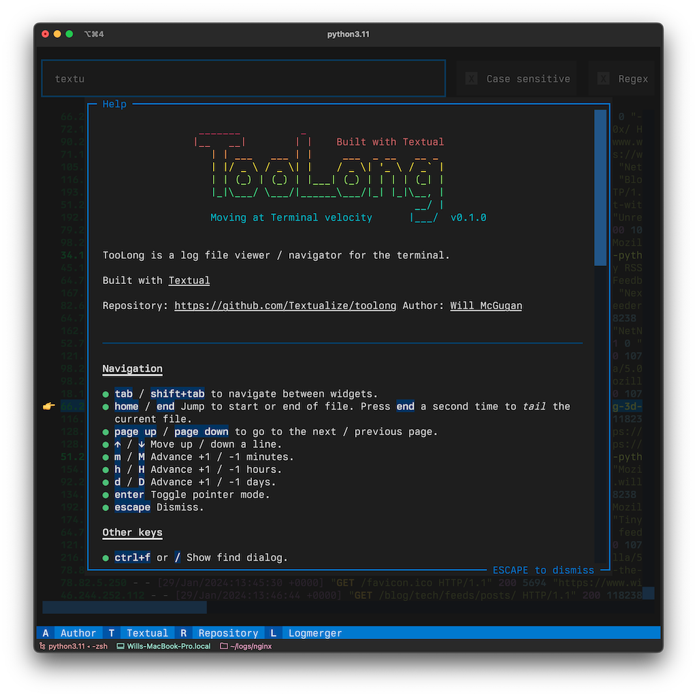

    It also merges multiple log files by detecting timestamps and opens compressed files automatically. It is useful for developers who often work with logs via SSH, and want a simpler way of viewing logs in the terminal for tasks typically done with a combination of  tail, less, and grep commands.

    What we see in this screenshot:

    - a dialog box with main content dimmed
    - some ASCII art
    - below the dialog you see a horizontal bar with hot key bindings

- `apisnip` is a TUI tool that trims large OpenAPI specification files by interactively selecting which endpoints to keep.

    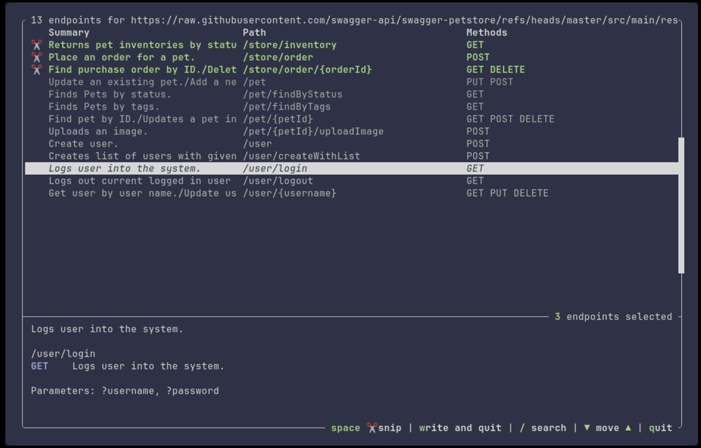

- `mqttui` is a TUI tool for quickly subscribing to or publishing MQTT messages

    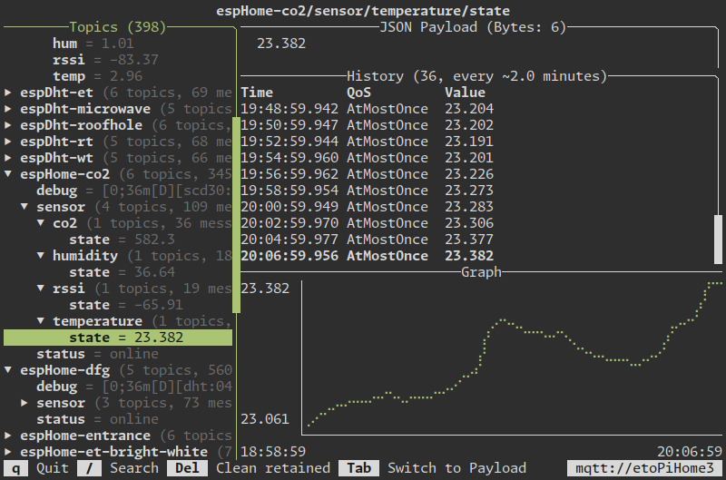

- `outside` is a multi-purpose weather client

    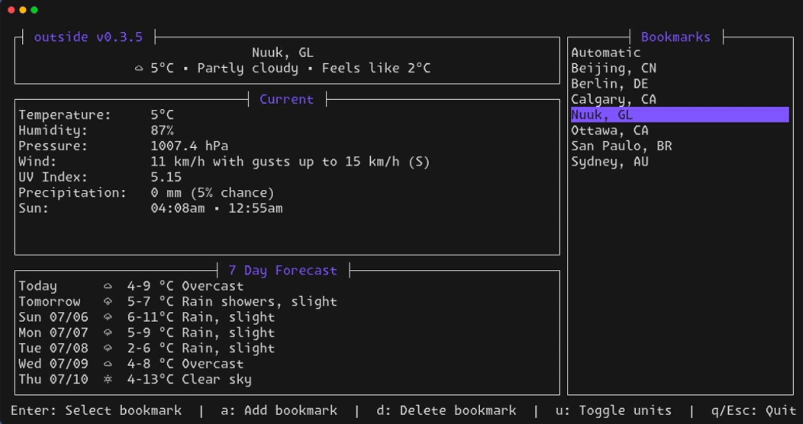

- `pqviewer` allows viewing of Apache Parquet files.

    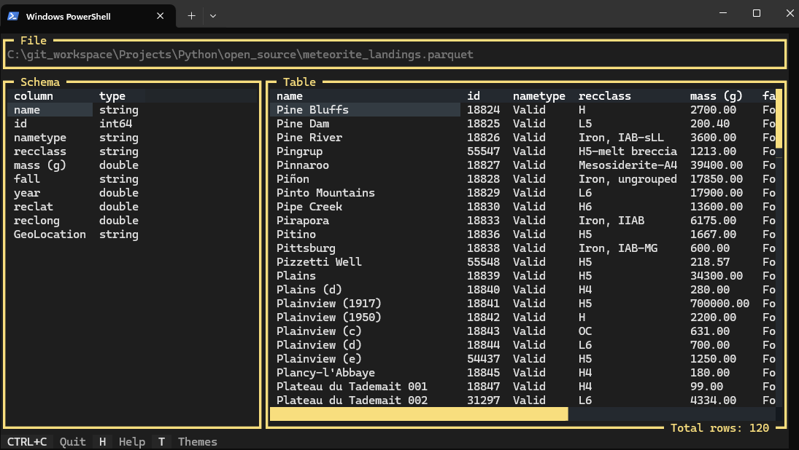

- `fx` is a command-line cross-platform JSON processing tool and terminal viewer. 

    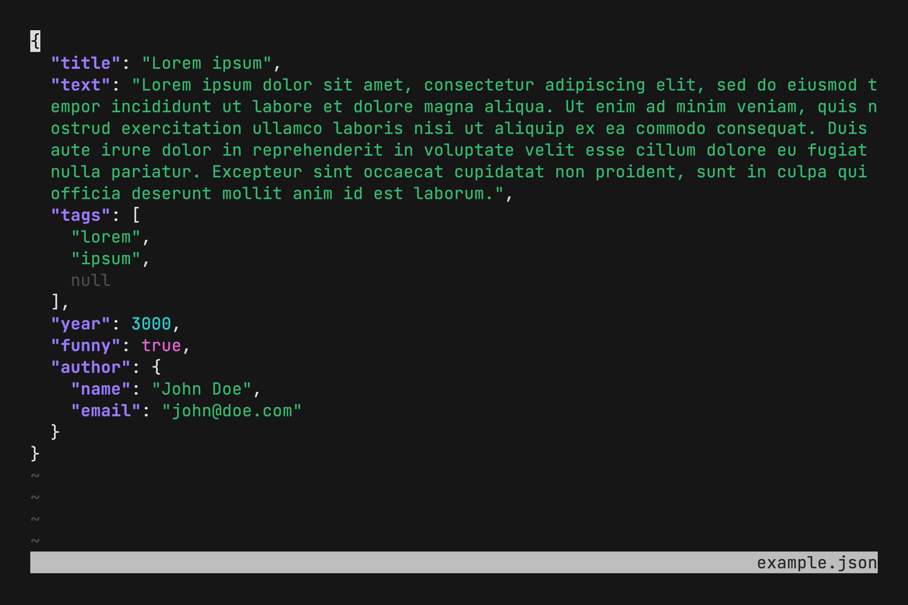

- `flamelens` is a TUI flamegraph viewer that displays profiling data directly in the terminal.

  

- `s-tui` is a performance monitoring utility

  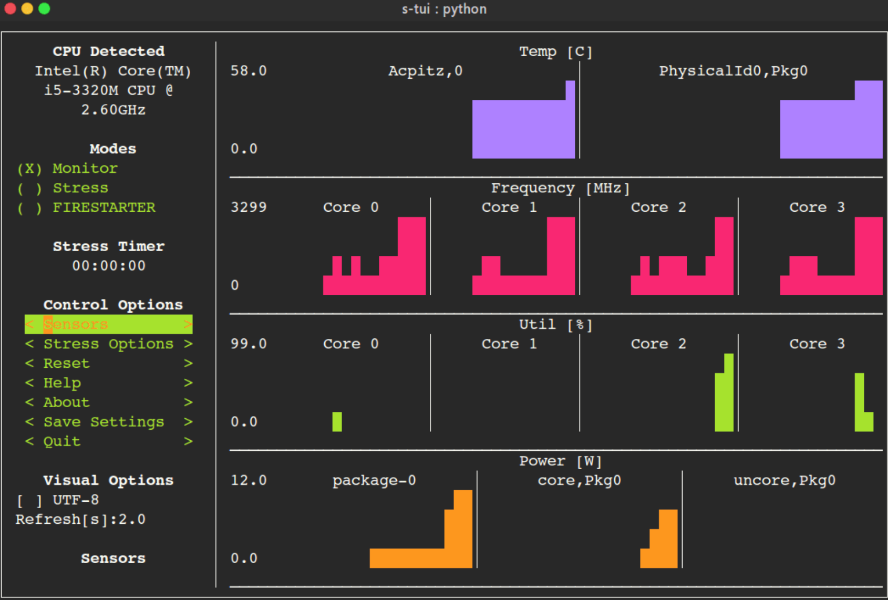
  
- `lazysql`

    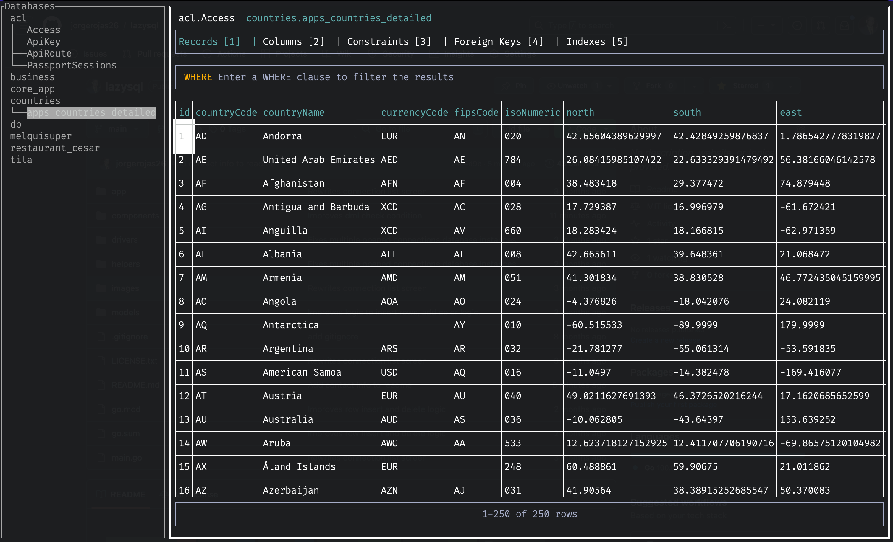

- `forgit` is a tool for using Git interactively in the terminal

    

- `wiper` is a TUI disk analyzer and cleanup tool.

    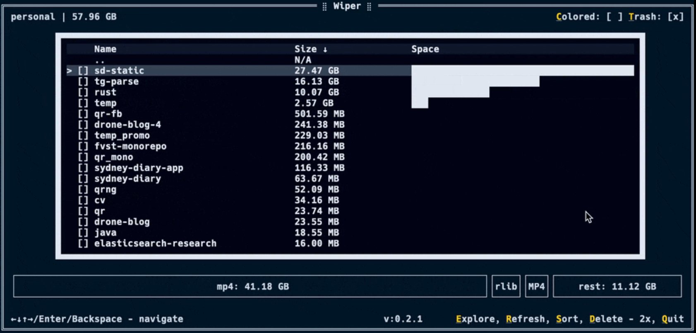

- `openapi-tui`

    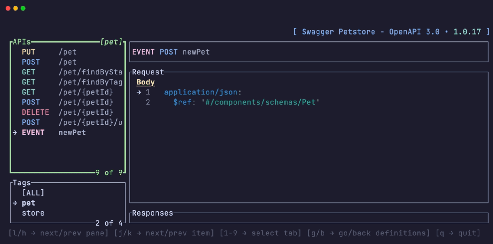

- `harlequin`

    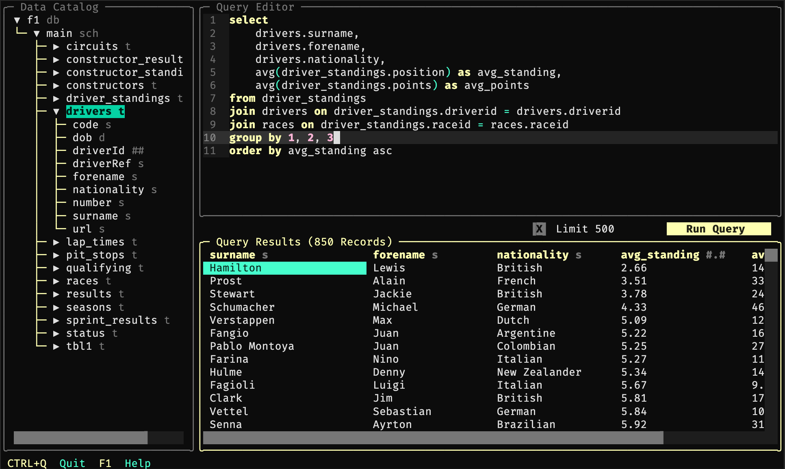

- `trippy` is a network monitoring tool

    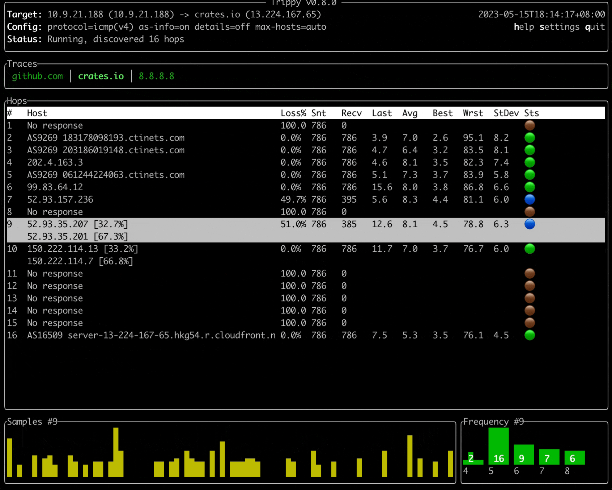

- `lazygit` is a TUI for working with git

    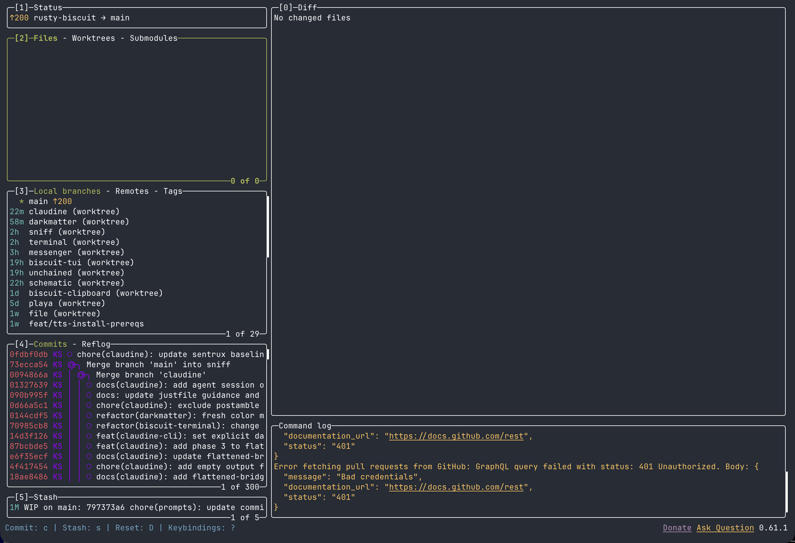

> All TUI's were indexed on the site: https://terminaltrove.com/categories/tui/
