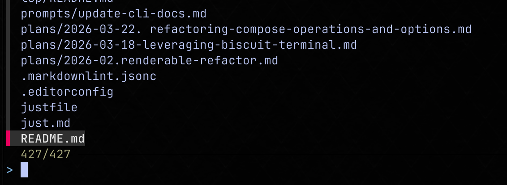
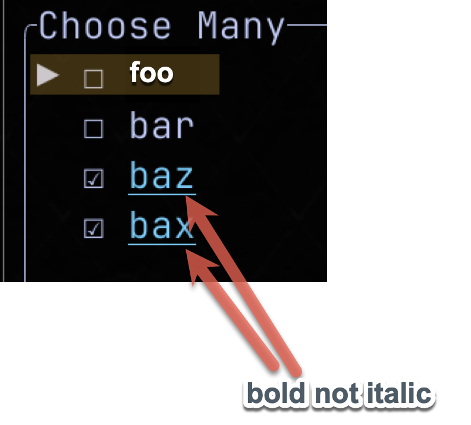

We have a working version of the `ChooseOne` component implemented but in this feature we're going to provide a number of useful features to it the component in addition to how the CLI can use this component.

- Start by reading:
    - biscuit-tui/docs/components/index.md (overview document),
    - biscuit-tui/docs/components/choose_one.md (details on `ChooseOne` component),
    - biscuit-tui/docs/components/frame_chrome.md
- With that understanding, please review the new requirements we expect below


## FrameChrome

### Padding

The current implementation of `FrameChrome` provides the ability to add **margin** (e.g., spacing outside of the frame). In this feature we'll add **padding** which adds spacing _inside_ the frame:

- the padding setting should default to **1** when not explicitly set by caller
    - this default applies at the library level (`FrameChrome` struct), not just the CLI


## ChooseOne

The current implementation is awkward and is more catered to the `ChooseMany` input style. Things which we need to change in `ChooseOne`:

- the options should have radio buttons next to them not checkboxes (this is the typical convention for single selection inputs)
    - the radio buttons should leverage nerdfonts if the terminal is using a nerdfont:
        - `f043e` selected
        - `f4aa` not selected
- the default key bindings are a bit off for `ChooseOne`:
    - ENTER should change the state to the selected item and complete
    - ESC should maintain the state as the "default/starting value" and complete, returning exit code `0`
        - **Note:** navigating to a different option with arrow keys (without pressing ENTER or Space) does not change the default/starting value; ESC always returns the original default
        - If the user pressed Space to change the selection and then presses ESC, the component reverts to the default/starting value before exiting
        - **Breaking change:** previous behavior returned exit code `1` on ESC; this is no longer the case
    - CTRL+C should immediately exit via SIGINT (exit code `130`); this is the only way to abort `ChooseOne` without returning a value
    - Pressing the space bar will change the state and visually show this updated state but will not complete the input

## ChooseMany


The ChooseMany component has similar changes to ChooseOne:

- we should use nerdfont's if they're available:
    - checked: `f14a`
    - not-checked: `f0131`
- if there's anyway in a terminal without nerdfonts to make the checkboxes large we should (they are quite small currently)
- The default key-bindings for ChooseMany should stay as they are
    - unlike ChooseOne, pressing ENTER finalizes the current state and exits with code `0`
        - ENTER does **not** add the active row to the selected state
        - the active row may or may not be selected; ENTER does not change this
        - the **space bar** is the exclusive way to toggle the active row's selection state


## Styling ChooseMany and ChooseOne

- the **active** item (the item currently under focus) should have the triangular arrow pointer in vertical orientation (consistent with current implementation); the pointer is removed in horizontal orientation
    - the **active** item is also indicated by the faint background color (see below)
    - the active item's text is bold and not underlined
- the **selected** item is indicated by the radio button (ChooseOne) or checkbox (ChooseMany) state
    - selected and active can be different items in both components
- terminology:
    - `active item` - the item in the list which is highlighted and which _action_ can be taken on (indicated by background color + arrow pointer in vertical mode)
    - `selected item` - the item(s) which have been _selected_ to be a part of the **state** when the input exits (indicated by radio button or checkbox)

### `fzf` as an Example



- `fzf` is a very mature and well liked CLI program and we should leverage it where we can
- the picture above shows what `fzf` looks like
- i'm not suggesting we copy it wholesale but the way it puts a subtle background color behind the selected item is great
    - both ChooseMany and ChooseOne should adopt this subtle/faint background color
    - to make the color "faint" we must use biscuit-terminal's ability to detect the background color
    - color variants should be:
        - grey (default)
        - green
        - yellow
        - red
    - we should by default only have the background color extend to the last character plus one blank character of the active option
    - the text color of the active item should white (when terminal in dark mode) or black (when in light mode)
    - the text color of the active item must always have good contrast to the background color



> this mockup is a crude representation of where the background text would go

## Horizontal Layout

- the current implementation presents all selectable choices vertically, in this feature we'll add an "orientation" property to `ChoiceInput` which is of the type `Orientation`
  
    ```rust
    pub enum Orientation {
        Vertical,
        Horizontal
    }
    ```

    > Note: the `Orientation` should be seen as shared type for any component which can be laid out in both orientations
- when the `Orientation::Vertical` orientation is chosen (which is the default) then the current implementation is used, however, when `Orientation::Horizontal` orientation is chosen then we we will layout the choices horizontally (new functionality):

- Both ChooseOne and ChooseMany will get a _horizontal_ layout added to their capabilities
- Layout fills left-to-right, wrapping to new rows when options exceed available width
- Navigation semantics in horizontal orientation:
    - `Left` / `Right` arrow keys always move to the previous / next option in **sequential order**
    - `Up` / `Down` arrow keys move to the option in the **same column position** of the adjacent row
    - If no option exists in that column position (e.g., the row above/below is shorter), focus wraps intelligently to the last item of that row
- In horizontal orientation, the triangular arrow pointer is removed; the active item is indicated by background color only


## Hotkeys

- we currently support _having_ hot keys but the user has no way of know what they are
- in the feature we will:
    - when the user presses the CTRL or ALT/OPTION key the hot keys will show the hotkey's associated to various choices with an orange (CTRL) and yellow (ALT) backgrounds and **black** text to the right of the choice (white-on-yellow is illegible on most terminal palettes; black gives consistent contrast on both family colours — see "Badge Rendering — Visual Treatments" below for held vs. not-held shading and bold weighting)
        - in vertical mode this text will be positioned directly to the right of the line's text
        - in horizontal mode this text will be placed below 
    - all hotkeys will be associated to either CTRL+key or ALT+key
        - by default the association is to CTRL
        - capitalization of alpha characters has no variance `CTRL+c` is the same as `CTRL+C`
        - with that in mind this example config would setup the binding CTRL+R and CTRL+G, and ALT+B

          ```rust
          let input = ChoiceInput::new("color", "Pick a color")
              .with_options(vec![
                  ChoiceOption::new("red", "Red", "red"),
                  ChoiceOption::new("green", "Green", "green")
                      .with_hotkey(HotkeySpec::Ctrl('g')),
                  ChoiceOption::new("blue", "Blue", "blue")
                      .with_hotkey(HotkeySpec::Alt('b')),
              ])
          ```

          The `id` field remains a clean stable identifier. Hotkeys are specified via a separate `hotkey: Option<HotkeySpec>` field on `ChoiceOption`. The CLI shorthand `[CTRL+R] Red` is supported only at the CLI parsing layer, where it is stripped into a `HotkeySpec::Ctrl('r')` and a clean `id` is auto-generated.

          > Note: if there's a better way to distinguish between CTRL and ALT than my `ALT+key` or just `key` for CTRL bindings then i'm open to it.

    - now when a user presses the CTRL key
        - all hotkeys show up
        - those attached to CTRL will have an orange background the hotkey will be bold faced
        - those attached to ALT will have a yellow background and the hotkey will be dim/light font
        - this indicates to the user ALL of the hotkeys while giving greater emphasis to the hotkeys associated to the key the user has pressed down
    - when the user has the ALT key pressed
        - all hotkeys show up
        - those attached to ALT will have a yellow background and the hotkey will be bold faced
        - those attached to CTRL will have an orange background the hotkey will be a dim/light font
        - this indicates to the user ALL of the hotkeys while giving greater emphasis to the hotkeys associated to the key the user has pressed down


## Sorting

It appears that a choice input can either be rendered in the _natural_ order which the options were presented in or in a random order when the `shuffle_options` options is set to true. This is **not** a good design.

- The default presentation of options should be the _natural_ order, but other sorts include
- **Inverse**: the inverse of the natural order
- **Asc**: ascending alphabetical order by option **label**
- **Desc**: descending alphabetical order by option **label**

This should be enumerated with a Rust enum:

```rust
pub enum OptionSort {
    Natural,
    Inverse,
    Asc,
    Desc
}
```

> if there already exists an enum like than fine, but make sure the enum's is sensible

## CLI 

- **Padding:** we should add `--padding <#>` (alias `-p`) which creates equal padding in each direction
    - we should add `--pt <#>`, `--pb <#>`, `--pl <#>`, and `--pr <#>` for discrete padding in only a single dimension 
    - FrameChrome defaults to padding of 1
- **Options:**
    - today there are two ways to input options:
        - `question choose-one Apple Banana Cherry` (preferred)
        - `question choose-one --options "Apple,Banana,Cherry"`
    - we're going to adjust that so that the options are:
        - `question choose-one Apple Banana Cherry`
        - `question choose-one --csv "Apple,Banana,Cherry"`
        - `question choose-one --list "- Apple\n- Banana\n- Cherry"`
        - `question choose-one --rows "Apple\nBanana\nCherry"`
        - `question choose-one --file {file-reference}"`

            The file reference can be JSON, JSONL, NDJSON, YAML, CSV, or TOML file but must be structure as an array to be valid. If it's not an error is raised.

        - `question choose-one --md {file-reference} {prop}`

            The `--md` references a Markdown file and a Frontmatter property. The property referenced is expected to be an array/list. If it's not then an error is raised.

- **Hot Keys:**
    - There will be two separate approaches to creating a hotkey in the CLI:
        1. Prefix
              - in all signatures of a question's _options_ (from above) claudine will look at the first set of characters in the string
              - if it starts with `[CTRL+{char}]` or `[ALT+{char}]` or `[OPT+{char}]` then we'll take that as a hotkey assignment
              - there is no difference between OPT+char _and_ ALT+char they're just both allowed for convenience (different OS's prefer one versus the other but they all refer to the same key)
              - The instruction text will be removed from the value that is presented as an option to the user
        2. Index

            - we will add the `--numeric-hot-keys`
            - when that is used on a call then 
                - the first 10 will be assigned to CTRL+1-9, then 0
                - the next 10 will be assigned to OPT+1-9, then 0
            - if there are more than 20 options then they will not get a hotkey

- **Labels vs Values**
    - we will add a "shorthand" for specifying a different label (presented to user as an option) from the value (the value which is set in state)
    - there are two distinct flavors of how the CLI will offer this:

        1. Naming Conventions

            - the CLI should offer `--label <convention>` and `--value <convention>`
            - a caller can use neither, one, or both
            - the "conventions" supported are:
                - `camel-case` (words capitalized after the first word, no spaces, no dashes, no underscores)
                - `pascal-case` (all words capitalized, no spaces, no dashes, no underscores)
                - `kebab-case` (adding dash `-` character between words)
                - `snake-case` (adding underscore `_` character between words)
                - `title-case` (words separated by space and all words capitalized)
                - `caps` (all letters made into a capital letter)
                - `lowercase` (all letters made into lower case)

        1. Delimited

            - Sometimes conventions isn't enough, for those cases we should use the `::` character sequence be a dividing token
            - The value "Red Delicious::Apple" will display the label `Red Delicious` but the value saved to state will be `Apple`


- **Sorting:**
    - the `--sort <sort>` switch should allow a valid value: `natural`, `inverse`, `asc`, `desc`


### Completions

Shell completions are an important way of making the CLI easy to use:

- we should have a `completions <shell>` subcommand which provides dynamic shell commands
- sorting enum should be represented
- convention based enums should be represented
- the various options formats `--csv`, `--list`, etc. should all be represented
- if a user starts a string in a position where it is seen as a option, when they type `[` the `[CTRL+`, `[ALT+`, `[OPT+` should be available
- all subcommands should be represented when in the first position after `question` command

## Keyboard Protocol Requirements

### Modifier-only Badge Visibility

Bare `Ctrl` / `Alt` press MUST surface hotkey badges on terminals that support the kitty keyboard protocol. On terminals that do not support the protocol, the chord-fallback path covers chord presses (e.g., `Ctrl+f`); bare modifiers may legitimately do nothing on those terminals. The runner MUST attempt to enable the protocol and silently fall back if rejected.

### Portable Badge Toggle

`Ctrl+Space` and `Alt+Space` chords are accepted as a fallback for terminals that emit no bare-modifier press/release events:

- `Ctrl+Space` → pin the display to `CtrlHeld`.
- `Alt+Space` → pin the display to `AltHeld`.

Note that **macOS by default binds `Ctrl+Space` to "Select previous input source"** at the OS level, so on macOS users may need to disable that shortcut in System Settings → Keyboard → Keyboard Shortcuts → Input Sources for the chord to reach the terminal.

Toggle semantics:

- Pressing the same chord again clears the pin and restores dynamic visibility.
- Pressing the *other* chord switches emphasis directly.
- **Bare-modifier release clears the sticky toggle.** When `Ctrl` is released after `Ctrl+Space`, the badges hide — the user does not have to press the toggle a second time to dismiss. This applies equally to `Alt`. (On terminals without bare-modifier release events, the toggle persists until pressed again — the only available signal.)
- `--hotkey-badges always` / `never` / `ctrl` / `alt` (the lifetime override) suppresses the toggle: when the override is active the public CLI flag is the single source of truth.
- `Plain Space` (no modifier) is unaffected — it continues to behave as the component's existing toggle binding (e.g. row selection in `ChooseMany`).

> **Acceptance**: on a terminal where bare-modifier press events never arrive, pressing `Ctrl+Space` MUST render the same `^x` / `⌥x` badges that holding `Ctrl` would render in a kitty-protocol terminal.

### Hotkey Assignment Semantics

Hotkeys are assigned **only** in the following ways:

- **Explicit prefix** in CLI string options: `[CTRL+x]`, `[ALT+x]`, `[OPT+x]`.
- **Object-source `hotkey` field** in JSON / YAML / TOML / markdown frontmatter.
- **`--numeric-hot-keys`** CLI flag: assigns `Ctrl+1..0` then `Alt+1..0` to the first 20 hotkey-less options.
- **Library-level** `ChoiceOption::with_hotkey()` calls.

A plain CLI option `bar` (with no bracketed prefix) has no hotkey, no badge, and pressing `Ctrl+B` does nothing. Three plain options (`bar baz bax`) is normal input and produces no collision because none of them carries a hotkey.

### Badge Rendering — Visual Treatments

Two visually distinct treatments per state, chosen so a user can tell at a glance which modifier is active. The background colour is always present (orange for Ctrl, yellow for Alt); only the shade and font weight differ:

- **Held**: bright family BG (orange or yellow) + bold black foreground. High contrast, draws the eye.
- **Not held** (the *other* modifier is active): a darker shade of the same family colour for the BG, with non-bold black foreground. The shade-darker BG plus removal of bold is the visual cue. We deliberately do NOT use `Modifier::DIM` because it renders inconsistently across terminals (often invisible in WezTerm's default theme).

Black is the badge foreground for both Ctrl (orange) and Alt (yellow) backgrounds because white-on-yellow is illegible on most terminal palettes and the consistency reads cleanly.

The result: held badges are filled colour blocks, not-held badges are coloured text. They remain readable in both states across all common terminal themes.

### Required Keyboard Protocol Flags

The runner MUST push the following keyboard enhancement flags when preparing the terminal:

- `REPORT_EVENT_TYPES` — required for press/release distinction on every reported key event.
- `DISAMBIGUATE_ESCAPE_CODES` — desirable so that `Esc` can be distinguished from CSI sequence prefixes.
- `REPORT_ALL_KEYS_AS_ESCAPE_CODES` — required for *bare* modifier press/release. Without this flag most kitty-aware terminals (notably WezTerm) only report modifier events as part of a chord, so holding bare `Ctrl` produces no event and the modifier-held UX silently does nothing. `REPORT_EVENT_TYPES` alone is insufficient.

All flags MUST be popped on terminal restore. The push/pop pair MUST be symmetric: if the push succeeds, the pop is executed; if the push fails, no pop is attempted.

## Completion Contract

### Hotkey-prefix Completion

Typing `[` followed by `<TAB>` (quoted or unquoted) in any positional argument position MUST offer `[CTRL+`, `[ALT+`, `[OPT+` as the **only** completion candidates. No command or file fallback pollution is permitted.

### Post-separator Flag Completion

Tab completion MUST continue to suggest remaining option flags after a literal `--` separator, for the lifetime of the command line. The completion script MUST NOT treat `--` as a terminator that disables further option suggestions.

## Verification Gates

All completion claims MUST be verified by PTY-driven shell tests (zsh + bash).

All keyboard-modifier claims MUST be verified by an integration test that exercises the real `prepare_terminal` sequence under a PTY.

No completion or keyboard-modifier feature may be marked "production ready" without the corresponding PTY test passing.
