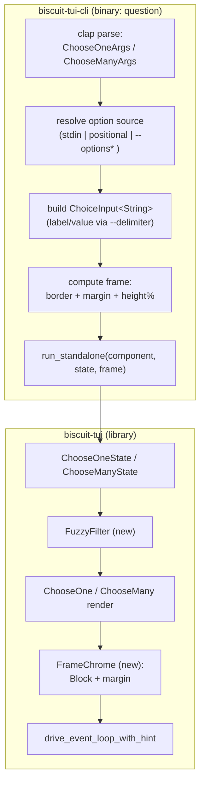
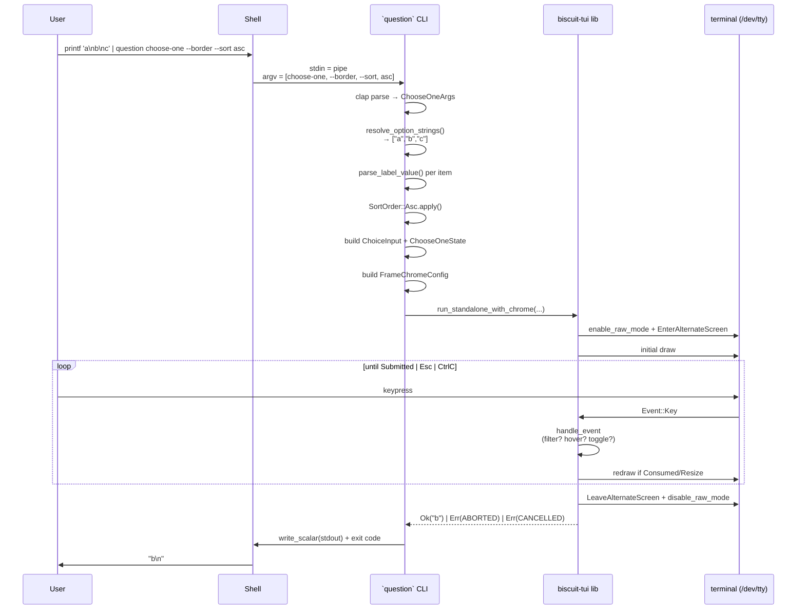
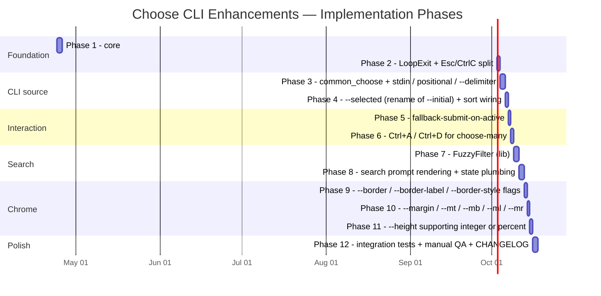

# Choose CLI Enhancements — Technical Design

This document is the engineering companion to the [spec](./spec.md). The spec describes *what* the enhanced `choose-one` and `choose-many` subcommands of the `question` CLI should do; this document describes *how* the existing `biscuit-tui` library + `biscuit-tui-cli` binary will be extended to deliver it.

The implementation deliberately preserves the existing public API surface (`ChooseOne`, `ChooseOneState`, `ChooseMany`, `ChooseManyState`, `ChoiceInput`, `ChoiceOption`, `run_standalone`, …) and layers the new features additively. Existing tests keep passing; new tests pin the new behaviour.

---

## 1. Scope & Non-Goals

### In scope

- New input sources for option lists (STDIN, positional args).
- A `--delimiter` flag that splits each input string into `label⟂value`.
- A `--selected` flag (replacing the older `--initial`) that pre-selects an option by value.
- Interaction enhancements: fallback-submit-on-active, `Ctrl+A` / `Ctrl+D` for `choose-many`, ESC distinct exit code.
- Inline fuzzy search activated by alphanumeric input.
- Visual chrome flags: `--border`, `--border-label`, `--border-style`, margin family, percentage `--height`, `--sort`.

### Out of scope

- Changes to `text-input`, `text-area-input`, `boolean-switch`, or `input-table`.
- Changes to `OutputMode` (`raw` / `json` / `null` continue to work as today).
- Re-organising the `biscuit-tui` crate (see [§13](#13-deferred-and-out-of-scope)).
- Rewriting the existing `--options-from-file` / `--options-from-dictionary` paths (kept verbatim — the spec's "STDIN + positional" path is an *additional* source, not a replacement).

---

## 2. High-Level Architecture



The CLI layer owns argument parsing, source detection, and frame geometry. The library layer owns interactive state (including the new fuzzy filter), rendering, and the event loop. **No new public type leaves the library namespace except `FuzzyFilter`, `BorderStyle`, `Margin`, `HeightSpec`, and `SortOrder`.**

---

## 3. New Public Surface

### 3.1 Library additions (`tui_chrome::*`)

| Type / fn | Module | Purpose |
|---|---|---|
| `FuzzyFilter` | `core::fuzzy` | Bigram-based fuzzy scorer + index map |
| `SortOrder` | `core::sort` | `Natural` / `Reverse` / `Asc` / `Desc` |
| `BorderStyle` | `core::frame` | Variants matching the spec |
| `Margin` | `core::frame` | `top, bottom, left, right` |
| `FrameChrome` | `core::frame` | Composes border + margin into a `StatefulWidget` wrapper |
| `HeightSpec` | `core::frame` | `Cells(u16)` \| `Percent(u8)` |
| `ChoiceInput::with_filter_enabled(bool)` | `components::choose` | Enables the search-on-type behaviour |
| `ChoiceInput::with_sort(SortOrder)` | `components::choose` | Applies sort during state construction |
| `ChooseOneState::with_initial_value(&str)` | `components::choose_one` | Pre-select by **value** rather than id |
| `ChooseManyState::with_initial_values(&[&str])` | `components::choose_many` | Pre-select by **values** |
| `ChooseManyState::select_all()` / `deselect_all()` | `components::choose_many` | Bulk toggles for `Ctrl+A` / `Ctrl+D` |

### 3.2 Re-exports

Add to `lib.rs` and `prelude.rs`:

```rust
pub use core::{
    BorderStyle, FrameChrome, FuzzyFilter, HeightSpec, Margin, SortOrder,
    /* existing exports */
};
```

### 3.3 CLI additions (`biscuit-tui-cli`)

`ChooseOneArgs` and `ChooseManyArgs` gain the following flags. `choose-many` adds two extras (`--max-selections` already exists; `--min-selections` already exists).

| Flag | Type | Default | Notes |
|---|---|---|---|
| `[OPTIONS]...` (positional) | `Vec<String>` | `[]` | Trailing positionals are option strings |
| `--delimiter <CHAR>` | `Option<char>` | `None` | Split label/value on **first** occurrence |
| `--selected <VALUE>` | `Option<String>` (one-of) / `Option<Vec<String>>` (many) | `None` | Pre-select by value |
| `--border` | `bool` flag | `false` | Implies `--border-style rounded` if style unset |
| `--border-label <TEXT>` | `Option<String>` | `None` | Implies `--border` |
| `--border-style <STYLE>` | `BorderStyleArg` enum | `none` | Implies `--border` for non-`none` |
| `--margin <N>` | `Option<u16>` | `None` | All four sides |
| `--mt <N>` `--mb <N>` `--ml <N>` `--mr <N>` | `Option<u16>` | `None` | Override per-side |
| `--height <SPEC>` | `Option<HeightSpecArg>` | `None` | Integer or `NN%` (overrides global `--height`) |
| `--sort <ORDER>` | `Option<SortOrderArg>` | `Natural` | `natural` / `reverse` / `asc` / `desc` |

`--initial` is **deprecated** in favour of `--selected`. Both flags remain accepted for one release; passing both is an error. For the multi-select case the new `--selected` flag is **repeatable** (`--selected foo --selected bar`) and also accepts a comma-separated form for symmetry with the legacy CSV `--initial`.

---

## 4. Option Source Resolution

The CLI accepts options from four sources, in precedence order:

```mermaid
flowchart TD
    START([invoke choose-one / choose-many]) --> Q1{--options /<br/>--options-from-file /<br/>--options-from-dictionary set?}
    Q1 -- yes --> LEGACY[Use existing builders<br/>(unchanged)]
    Q1 -- no --> Q2{Positional args present?}
    Q2 -- yes --> POS[Build from positional Vec&lt;String&gt;]
    Q2 -- no --> Q3{stdin is a pipe<br/>(non-TTY)?}
    Q3 -- yes --> STDIN[Read stdin to EOF,<br/>split on '\n']
    Q3 -- no --> ERR[Err: InvalidInput<br/>"no options provided"]
    LEGACY --> NORM
    POS --> NORM
    STDIN --> NORM
    NORM[Normalise via build_choice_input_from_strings]
    NORM --> SORT["apply --sort"]
    SORT --> READY([ChoiceInput&lt;String&gt; ready])
```

### 4.1 Source resolution (CLI layer)

```rust
fn resolve_option_strings(
    legacy_csv: Option<&str>,
    legacy_file: Option<&Path>,
    legacy_dict: Option<&Path>,
    positional: Vec<String>,
) -> io::Result<Option<Vec<String>>> {
    // Returns Ok(None) when the legacy paths handle the build themselves.
    if legacy_csv.is_some() || legacy_file.is_some() || legacy_dict.is_some() {
        return Ok(None);
    }
    if !positional.is_empty() {
        return Ok(Some(positional));
    }
    if io::stdin().is_terminal() {
        return Err(io::Error::new(
            io::ErrorKind::InvalidInput,
            "no options provided: pass options as positional args or via stdin",
        ));
    }
    let mut buf = String::new();
    io::stdin().read_to_string(&mut buf)?;
    Ok(Some(
        buf.lines()
            .map(str::trim_end_matches_carriage_return) // local extension trait
            .filter(|line| !line.is_empty())
            .map(str::to_string)
            .collect(),
    ))
}
```

### 4.2 Stdin and the TTY problem

Reading the option list from stdin means **stdin is no longer connected to the user's keyboard** by the time the TUI tries to read events. The runner currently calls `crossterm::event::read()`, which under the hood uses `/dev/tty` on Unix and the console handle on Windows. Crossterm 0.28 already opens `/dev/tty` directly — this is the path we depend on. The new code adds a one-time guard that returns a friendly error when `/dev/tty` is unavailable (e.g. CI without a controlling terminal):

```rust
#[cfg(unix)]
fn ensure_controlling_tty() -> io::Result<()> {
    use std::fs::OpenOptions;
    OpenOptions::new()
        .read(true).write(true)
        .open("/dev/tty")
        .map(drop)
        .map_err(|_| io::Error::new(io::ErrorKind::Other,
            "stdin is piped and no /dev/tty is available; cannot prompt"))
}
```

Windows is handled implicitly by crossterm's `CONIN$` console handle.

### 4.3 Label / value parsing

Each resolved string is then run through:

```rust
pub fn parse_label_value(s: &str, delimiter: Option<char>) -> (String, String) {
    match delimiter {
        Some(ch) => match s.split_once(ch) {
            Some((label, value)) => (label.trim().to_string(), value.trim().to_string()),
            None => (s.to_string(), s.to_string()),
        },
        None => (s.clone(), s.clone()),
    }
}
```

The `id` field of the resulting `ChoiceOption` is set to the **value** (not the label), so `--selected` matches by value. This is the behaviour change spec callers expect.

### 4.4 Sort

`SortOrder` projects after parsing and before state construction:

```rust
pub enum SortOrder { Natural, Reverse, Asc, Desc }

impl SortOrder {
    pub fn apply<V>(self, options: &mut Vec<ChoiceOption<V>>) {
        match self {
            SortOrder::Natural => {}
            SortOrder::Reverse => options.reverse(),
            SortOrder::Asc  => options.sort_by(|a, b| a.label.cmp(&b.label)),
            SortOrder::Desc => options.sort_by(|a, b| b.label.cmp(&a.label)),
        }
    }
}
```

Sort runs *after* `--delimiter` parsing so users sort on labels, not on raw input strings.

---

## 5. Interaction Model Changes

### 5.1 Exit codes

| Action | Current | Spec | Implementation |
|---|---|---|---|
| Submit | `0` | `0` | Unchanged |
| `Esc` | `130` | `1` | New: `run_standalone` returns a distinct sentinel |
| `Ctrl+C` (SIGINT) | `130` | `130` | Unchanged |

Today the runner conflates Esc and Ctrl-C onto a single `io::ErrorKind::Interrupted` error. The spec requires distinguishing them.

We introduce a second sentinel `io::ErrorKind` constant:

```rust
pub const CANCELLED_KIND: io::ErrorKind = io::ErrorKind::Interrupted; // Ctrl-C
pub const ABORTED_KIND:   io::ErrorKind = io::ErrorKind::ConnectionAborted; // Esc
```

`drive_event_loop_with_hint` is extended to differentiate the two outcomes by carrying an `enum Cancellation { CtrlC, Esc }` through the loop's return value:

```rust
pub enum LoopExit<V> { Submitted(V), CtrlC, Esc }
```

`run_standalone` then maps:

| `LoopExit` | Returned `io::Error` |
|---|---|
| `Submitted(v)` | `Ok(v)` |
| `CtrlC`        | `Err(CANCELLED_KIND, "interrupted")` |
| `Esc`          | `Err(ABORTED_KIND, "cancelled")` |

CLI dispatch in `main.rs`:

```rust
Err(e) if e.kind() == CANCELLED_KIND => Ok(130),
Err(e) if e.kind() == ABORTED_KIND   => Ok(1),
Err(e)                               => Err(e),
```

This is a **behaviour change** for any caller scripting against the old behaviour. Callers hitting `Esc` previously saw exit 130; now they will see exit 1. We document this in the `CHANGELOG.md` entry under "Breaking" and ship it as a minor-but-noted breaking change for the `question` CLI (the library itself does not yank `CANCELLED_KIND`).

### 5.2 Fallback submit on active

Today, `submit()` for `ChooseOne` requires a *selected* option when `required` is true. The spec says: if Enter is pressed and **no item is explicitly selected**, fall back to the currently *active* (hovered) item.

`ChooseOneState::submit` becomes:

```rust
fn submit<V: Clone + PartialEq>(state: &mut ChooseOneState<V>) -> EventOutcome {
    if state.selected.is_none() {
        // Fallback: promote hover -> selected if a non-disabled hover exists.
        if let Some(idx) = state.hover()
            && !state.options()[idx].disabled {
            state.selected = Some(idx);
        }
    }
    if state.selected.is_none() && state.input.required {
        state.validation_error = Some("Please make a selection".into());
        return EventOutcome::Consumed;
    }
    EventOutcome::Submitted
}
```

For `ChooseMany`, fallback applies when `selected_count() == 0` and the active item is not disabled:

```rust
fn submit<V: Clone + PartialEq>(state: &mut ChooseManyState<V>) -> EventOutcome {
    if state.selected_count() == 0
        && let Some(idx) = state.hover()
        && !state.options()[idx].disabled {
        state.selected[idx] = true;
    }
    // …existing required / min_selections checks unchanged…
}
```

### 5.3 `Ctrl+A` / `Ctrl+D` (`choose-many` only)

Two new actions are added to `KeyBindings`:

```rust
pub struct KeyBindings {
    /* existing fields */
    pub select_all:   Vec<KeyEvent>,  // default: vec![ctrl('a')]
    pub deselect_all: Vec<KeyEvent>,  // default: vec![ctrl('d')]
}
```

`ChooseMany::handle_event` consults them after the existing toggle/submit/cancel/up/down checks. Disabled options are skipped on `select_all` (they cannot become selected). `deselect_all` clears every flag regardless of `min_selections` (validation runs at submit, not at toggle).

`ChooseOne::handle_event` does **not** consult these bindings — they would have no meaning.

### 5.4 Search-on-type vs hotkey collision

Today, typing a single alphanumeric character jumps to (and, in `ChooseOne`, also selects) the first option whose label starts with that character. The new spec says typing alphanumerics should **enter the search prompt and start filtering**.

These behaviours collide. The resolution:

- **When the search prompt is hidden** *and* the typed character is a defined hotkey, we still trigger the hotkey path. Practically this only matters for the very first keystroke: as soon as the search box appears, all alphanumeric characters route to the input buffer.
- **Default change:** the hotkey shortcut becomes opt-in. We set `ChoiceInput::filter_enabled` to `true` by default for the CLI; library users keep the legacy hotkey behaviour by passing `with_filter_enabled(false)`.
- The CLI exposes `--no-filter` to opt out (rare; mainly for shell completion scripts that piped one option).

This trade-off is documented inline on the `with_filter_enabled` rustdoc.

### 5.5 Updated event flow

```mermaid
flowchart TD
    KEY([KeyEvent]) --> CTRLC{Ctrl+C?}
    CTRLC -- yes --> EXIT130[LoopExit::CtrlC]
    CTRLC -- no --> ESC{Esc?}
    ESC -- yes --> EXIT1[LoopExit::Esc]
    ESC -- no --> SUBMIT{Enter?}
    SUBMIT -- yes --> FALLBACK[fallback-promote hover<br/>then validate]
    FALLBACK --> SUBMITTED[LoopExit::Submitted]
    SUBMIT -- no --> SEARCH{search<br/>visible?}
    SEARCH -- yes --> ROUTE_SEARCH["dispatch to search box<br/>(letters, backspace,<br/>arrow Left/Right inside box)"]
    ROUTE_SEARCH --> NAV{nav key<br/>(Up/Down/Space/Ctrl+A/Ctrl+D)?}
    NAV -- yes --> APPLY[apply nav over filtered indices]
    NAV -- no --> CONSUME[Consumed]
    SEARCH -- no --> ALNUM{alphanumeric?}
    ALNUM -- yes & filter_enabled --> OPEN[show search,<br/>seed buffer with char]
    OPEN --> APPLY
    ALNUM -- yes & not filter_enabled --> HOTKEY[legacy hotkey jump]
    ALNUM -- no --> NAV
```

---

## 6. Fuzzy Search

### 6.1 Algorithm

We use **`nucleo-matcher` 0.3** (the matcher crate that powers Helix and `nucleo`). It is a small, dependency-light Rust port of `fzf`'s scoring algorithm, satisfying the spec's "similar to `fzf`" requirement.

Adding it costs one dependency:

```toml
nucleo-matcher = "0.3"
```

### 6.2 `FuzzyFilter`

Lives in `lib/src/core/fuzzy.rs` so both choose components can share it (and so `text_input` could later adopt it).

```rust
pub struct FuzzyFilter {
    matcher: nucleo_matcher::Matcher,
    pattern: String,
    /// Indices into the source `options` slice that pass the filter,
    /// already sorted by descending match score then by source order.
    visible: Vec<usize>,
}

impl FuzzyFilter {
    pub fn new() -> Self;
    pub fn pattern(&self) -> &str;
    pub fn set_pattern(&mut self, pattern: impl Into<String>, labels: &[String]);
    pub fn push_char(&mut self, c: char, labels: &[String]);
    pub fn pop_char(&mut self, labels: &[String]);
    pub fn clear(&mut self, labels: &[String]);
    pub fn visible(&self) -> &[usize];          // empty pattern => 0..labels.len()
    pub fn is_active(&self) -> bool;             // !pattern.is_empty()
}
```

`labels` is passed in on every mutation rather than cached because the option list is short-lived (built once per CLI invocation) and we want `FuzzyFilter` to stay decoupled from `ChoiceOption<V>`'s generic parameter.

### 6.3 Integrating into the choose state

```rust
pub struct ChooseOneState<V = String> {
    /* existing fields */
    filter: FuzzyFilter,        // empty by default
    filter_visible: bool,        // false by default (hidden)
}
```

Public accessors:

```rust
impl<V> ChooseOneState<V> {
    pub fn filter_visible(&self) -> bool;
    pub fn filter_pattern(&self) -> &str;
    pub fn visible_indices(&self) -> &[usize]; // == &(0..options.len()) when no pattern
}
```

`hover` is **always stored as an index into `options`** (not into the filtered subset). When the user hits Down, navigation walks `visible_indices()` to find the next legal hover; when the filter changes and the previous hover is no longer visible, hover snaps to the first visible non-disabled index. This keeps fallback-submit semantics simple — `state.value()` reads from the underlying option slice the way it always did.

The `with_initial_value` / `with_initial_values` methods seed `selected` and `hover` *before* any filter is applied; the filter starts empty.

### 6.4 Search prompt rendering

The search prompt occupies one row above the list when visible. It is composed via `render_with_label` so it stacks correctly with an existing `Label::Above`:

```
+------------------------------+   ← optional border
| Pick a colour                |   ← Label
| / re                         |   ← search prompt (when active)
|   ● Red                      |
|   ○ Green                    |
|   ○ Blue                     |
+------------------------------+
```

The prompt glyph (`/ `) and its style come from new `ComponentTheme` fields:

```rust
pub struct ComponentTheme {
    /* existing fields */
    pub search_indicator: String,   // default: "/ "
    pub search_style: Style,        // default: Style::default()
    pub search_match_style: Style,  // default: bold + cyan, used for matched chars
}
```

Per-character match highlighting is rendered using `nucleo_matcher::pattern::Pattern::indices()` to colour the matched bytes. When the terminal is too narrow for highlight to be useful (`area.width < 12`), the highlight is silently dropped.

### 6.5 Empty filter result

When no option matches, the list area shows a single dim row: `(no matches)`. Submit is suppressed (`Consumed`) until at least one option is visible. `Esc` clears the filter rather than aborting **only when the filter is non-empty**; a second `Esc` aborts. This matches `fzf` and other interactive filters.

---

## 7. Frame Chrome (border, margin, height)

### 7.1 `BorderStyle`

Maps onto ratatui's existing `Borders` + `BorderType`:

| Spec value | Ratatui mapping |
|---|---|
| `rounded` | `BorderType::Rounded`, all sides |
| `sharp` | `BorderType::Plain`, all sides |
| `bold` | `BorderType::Thick`, all sides |
| `double` | `BorderType::Double`, all sides |
| `block` | `BorderType::QuadrantOutside`, all sides |
| `thinblock` | `BorderType::QuadrantInside`, all sides |
| `horizontal` | `BorderType::Plain`, `Borders::TOP \| Borders::BOTTOM` |
| `vertical` | `BorderType::Plain`, `Borders::LEFT \| Borders::RIGHT` |
| `line` | `BorderType::Plain`, `Borders::TOP` (single rule line) |
| `top` | `BorderType::Plain`, `Borders::TOP` |
| `bottom` | `BorderType::Plain`, `Borders::BOTTOM` |
| `left` | `BorderType::Plain`, `Borders::LEFT` |
| `right` | `BorderType::Plain`, `Borders::RIGHT` |
| `none` | no border |

### 7.2 `Margin`

```rust
#[derive(Debug, Clone, Copy, Default)]
pub struct Margin { pub top: u16, pub bottom: u16, pub left: u16, pub right: u16 }

impl Margin {
    pub fn uniform(n: u16) -> Self { Self { top: n, bottom: n, left: n, right: n } }
    pub fn shrink(self, area: Rect) -> Rect { /* saturating sub */ }
}
```

CLI: `--margin 2 --mt 0` produces `Margin { top: 0, bottom: 2, left: 2, right: 2 }`. Per-side flags override the umbrella `--margin` value.

### 7.3 `FrameChrome`

A wrapper widget that owns the (optional) `Block` and `Margin`, draws them, and renders the inner widget into the resulting inner `Rect`:

```rust
pub struct FrameChrome<'a, W> {
    pub inner: W,
    pub border: Option<(Borders, BorderType, Option<&'a str>)>, // (sides, type, label)
    pub margin: Margin,
    pub border_style: Style,
}

impl<'a, W: StatefulWidget> StatefulWidget for FrameChrome<'a, W> {
    type State = W::State;
    fn render(self, area: Rect, buf: &mut Buffer, state: &mut Self::State) {
        let area = self.margin.shrink(area);
        let inner_area = if let Some((sides, ty, label)) = self.border {
            let mut block = Block::default().borders(sides).border_type(ty).style(self.border_style);
            if let Some(l) = label { block = block.title(l.to_string()); }
            let inner = block.inner(area);
            block.render(area, buf);
            inner
        } else { area };
        self.inner.render(inner_area, buf, state);
    }
}
```

`run_standalone` is extended to take an `Option<FrameChrome<…>>`:

```rust
pub fn run_standalone_with_chrome<C, S, V>(
    component: C,
    state: S,
    height: Option<HeightSpec>,
    chrome: FrameChromeConfig,
) -> io::Result<V>
```

The original `run_standalone(component, state, height)` becomes a thin wrapper that passes `FrameChromeConfig::default()`.

### 7.4 `HeightSpec`

```rust
pub enum HeightSpec { Cells(u16), Percent(u8) }

impl HeightSpec {
    pub fn resolve(&self, term_rows: u16) -> u16 {
        match self {
            HeightSpec::Cells(n) => (*n).min(term_rows),
            HeightSpec::Percent(p) => {
                let raw = (term_rows as u32 * (*p as u32)) / 100;
                raw.clamp(3, term_rows as u32) as u16
            }
        }
    }
}
```

The runner queries `crossterm::terminal::size()` once during `prepare_terminal` to translate `Percent` into `Cells`. A floor of 3 rows guarantees there is always room for the list plus an error/help row.

`HeightSpec` parsing for clap:

```rust
fn parse_height(s: &str) -> Result<HeightSpec, String> {
    if let Some(num) = s.strip_suffix('%') {
        let p: u8 = num.parse().map_err(|_| "invalid percent".to_string())?;
        if p == 0 || p > 100 { return Err("percent must be 1..=100".into()); }
        Ok(HeightSpec::Percent(p))
    } else {
        Ok(HeightSpec::Cells(s.parse().map_err(|_| "invalid height".to_string())?))
    }
}
```

The subcommand-level `--height` shadows the existing global `--height u16`; when both are provided the subcommand value wins.

---

## 8. CLI Module Layout

```
biscuit-tui/cli/src/
├── main.rs                       # global args + subcommand routing (touched)
├── output.rs                     # unchanged
└── commands/
    ├── mod.rs                    # add `pub mod common_choose;`
    ├── common_choose.rs          # NEW: shared parsing for choose-* args
    ├── choose_one.rs             # uses common_choose
    ├── choose_many.rs            # uses common_choose
    ├── boolean_switch.rs         # unchanged
    ├── input_table.rs            # unchanged
    ├── text_area_input.rs        # unchanged
    └── text_input.rs             # unchanged
```

`common_choose.rs` houses everything shared between the two subcommands:

```rust
#[derive(Debug, Args, Clone)]
pub struct ChooseChromeArgs {
    #[arg(long)] pub border: bool,
    #[arg(long, value_name = "TEXT")] pub border_label: Option<String>,
    #[arg(long, value_enum)] pub border_style: Option<BorderStyleArg>,
    #[arg(long)] pub margin: Option<u16>,
    #[arg(long)] pub mt: Option<u16>,
    #[arg(long)] pub mb: Option<u16>,
    #[arg(long)] pub ml: Option<u16>,
    #[arg(long)] pub mr: Option<u16>,
    #[arg(long, value_parser = parse_height)] pub height: Option<HeightSpec>,
    #[arg(long, value_enum, default_value_t = SortOrderArg::Natural)] pub sort: SortOrderArg,
    #[arg(long)] pub delimiter: Option<char>,
    #[arg(long)] pub no_filter: bool,
}

pub fn build_options(
    raw_strings: Vec<String>,
    delimiter: Option<char>,
) -> Vec<ChoiceOption<String>>;

pub fn build_chrome(args: &ChooseChromeArgs) -> FrameChromeConfig;
```

Both `ChooseOneArgs` and `ChooseManyArgs` flatten this struct via `#[command(flatten)]`.

---

## 9. Data Flow End-to-End



---

## 10. Test Plan

### 10.1 Unit tests (lib)

| Module | New tests |
|---|---|
| `core::fuzzy` | `pattern_filters_labels`, `empty_pattern_returns_all`, `pop_char_restores`, `nucleo_scoring_orders_substrings_first`, `clear_resets_pattern_and_visible` |
| `core::sort` | `natural_preserves_order`, `reverse_inverts`, `asc_lexical`, `desc_lexical`, `unicode_labels` |
| `core::frame` | `margin_uniform`, `margin_per_side_overrides`, `frame_chrome_renders_block_then_inner`, `border_label_truncates_when_narrow`, `height_spec_percent_clamps_to_floor_3`, `height_spec_cells_caps_to_term_rows` |
| `core::standalone` | `loop_exit_distinguishes_esc_from_ctrl_c`, `run_standalone_returns_aborted_kind_on_esc`, `run_standalone_returns_cancelled_kind_on_ctrl_c` |
| `components::choose_one` | `fallback_submit_promotes_hover`, `fallback_submit_skips_disabled_hover`, `initial_value_pre_selects`, `filter_visible_starts_false`, `typing_letter_opens_filter`, `down_walks_filtered_indices`, `esc_clears_filter_first_then_aborts` |
| `components::choose_many` | `ctrl_a_selects_all_enabled_options`, `ctrl_a_skips_disabled`, `ctrl_d_clears_all`, `fallback_submit_selects_active_when_none_chosen`, `initial_values_pre_select_by_value`, `submit_blocked_when_filter_hides_everything` |

### 10.2 Integration tests (CLI)

Live in `cli/tests/choose_cli.rs` (new file) using `assert_cmd` + `predicates`:

```rust
#[test]
fn choose_one_reads_from_stdin() {
    Command::cargo_bin("question").unwrap()
        .args(["choose-one", "--height", "5"])
        .write_stdin("alpha\nbeta\ngamma\n")
        .env("QUESTION_TEST_AUTOSUBMIT", "1")  // see §10.3
        .assert()
        .success()
        .stdout("alpha\n");
}

#[test]
fn choose_one_positional_args() { /* … */ }

#[test]
fn choose_many_ctrl_a_then_submit_writes_all_values() { /* … */ }

#[test]
fn esc_exits_with_code_1() { /* … */ }

#[test]
fn ctrl_c_exits_with_code_130() { /* … */ }

#[test]
fn delimiter_separates_label_and_value() {
    Command::cargo_bin("question").unwrap()
        .args(["choose-one", "--delimiter", ":", "Apple:1", "Berry:2"])
        .env("QUESTION_TEST_AUTOSUBMIT", "1")
        .assert()
        .stdout("1\n");
}
```

### 10.3 Driving the TUI in tests

Spawning the binary into a real TTY is brittle. Two complementary strategies:

1. **`QUESTION_TEST_AUTOSUBMIT=<keystrokes>` env var** (gated behind `cfg(debug_assertions)` so it ships only in dev/test builds). When set, `run_standalone_with_chrome` substitutes a synthetic event reader that replays the keystrokes string and then submits.
   - Encoding: literal characters, plus `\u{1b}` for Esc, `\u{3}` for Ctrl+C, `\u{1}`/`\u{4}` for Ctrl+A/Ctrl+D, `\n` for Enter, `\u{20}` for Space, `\u{7f}` for Backspace.
2. **`drive_event_loop` direct calls** for `lib`-level tests, as today. The new tests above do not need a real terminal.

This mirrors how the existing `cli/tests/text_input.rs` (if/when added) would work, and keeps CI from depending on a TTY.

### 10.4 Manual QA checklist

To be run by the implementer before opening a PR:

- [ ] `printf 'a\nb\nc' | question choose-one` shows three rows
- [ ] `question choose-one a b c --selected b` highlights "b" on launch
- [ ] `question choose-one --delimiter : "Apple:1" "Pear:2"` shows "Apple"/"Pear", emits `1` or `2`
- [ ] `question choose-many` typing "re" filters to options containing "re"
- [ ] `question choose-many` Ctrl+A selects all then Ctrl+D clears
- [ ] Esc returns exit 1; Ctrl+C returns exit 130
- [ ] `--border --border-label "Pick"` draws a labelled rounded border
- [ ] `--height 50%` renders inline at half the terminal height
- [ ] `--sort asc` orders alphabetically
- [ ] `--margin 2 --mt 0` leaves 2 cells of space on bottom/left/right and 0 on top

---

## 11. Backwards Compatibility

| Item | Impact | Mitigation |
|---|---|---|
| `ChooseOneState::with_initial_selection(id)` still works | None (kept) | New `with_initial_value(value)` is added next to it |
| `ChooseManyState::with_initial_selection(&[ids])` still works | None (kept) | New `with_initial_values(&[values])` added next to it |
| CLI `--initial` deprecated, `--selected` preferred | One release of overlap | Deprecation `#[arg(hide = true)]` plus message on use |
| Esc exit code: `130 → 1` | Breaking for scripted callers | Documented in CHANGELOG as breaking; major version bump for `biscuit-tui-cli` |
| Single-letter hotkey jump no longer fires when filter is active by default | Soft-breaking | Opt-out via `--no-filter` and `ChoiceInput::with_filter_enabled(false)` |
| New library types (`FuzzyFilter`, `FrameChrome`, `BorderStyle`, `Margin`, `HeightSpec`, `SortOrder`) | Additive | n/a |
| `KeyBindings` gains `select_all` / `deselect_all` | Source-breaking for callers constructing `KeyBindings { ... }` literally | `Default` keeps working; recommend `..KeyBindings::default()` in user code |

---

## 12. Phased Implementation



Each phase ends in green tests for the area it touched; later phases never modify earlier-phase public types without an explicit note in the phase description.

---

## 13. Deferred and Out of Scope

The following items are tempting but explicitly *not* in this design:

- **Server-side / async option sources.** Reading options from an HTTP endpoint or process. Scripts can pipe via stdin already.
- **Multi-column option lists.** `fzf`'s `--with-nth` / `--delimiter` with column ranges. Out of spec.
- **Mouse support.** Not requested. Today's components ignore mouse; we keep that.
- **Custom themes via CLI flags.** Theme overrides are still library-only. Spec only asks for border styling.
- **Colour customisation of the border.** No `--border-color` flag yet — `BorderStyle` only controls glyphs. Adding colour would mean a new `--border-color <color>` flag and a parsed colour vocabulary; punted to a follow-up.
- **Persisting recent selections.** A `--history-file` like `fzf` is appealing but would require a state directory and is explicitly outside the spec.

---

## 14. Open Questions

1. **Hotkey vs filter default.** Should `--no-filter` be the inverse, i.e. should the CLI default to *hotkeys* and require `--filter` to enable search? The spec says search is the default behaviour, so we go with `filter on, --no-filter off`. Calling this out so it is reviewable.
2. **`--selected` repeat semantics on `choose-one`.** If the user passes `--selected a --selected b`, clap will accept the last one. Should we error instead? Proposed: warn-once on stderr and use the last.
3. **`--height 100%` and `Viewport::Fullscreen`.** These are equivalent in practice but use different ratatui code paths. Proposal: when `--height 100%` is passed, opt into `Viewport::Fullscreen` and the alternate screen for parity with the unspecified default.
4. **Empty stdin.** `printf '' | question choose-one` currently errors with "no options provided". Should it instead exit `0` with empty output? Proposed: stay an error — silently doing nothing is hostile to scripts.

These should be resolved before implementation begins on the corresponding phase.
