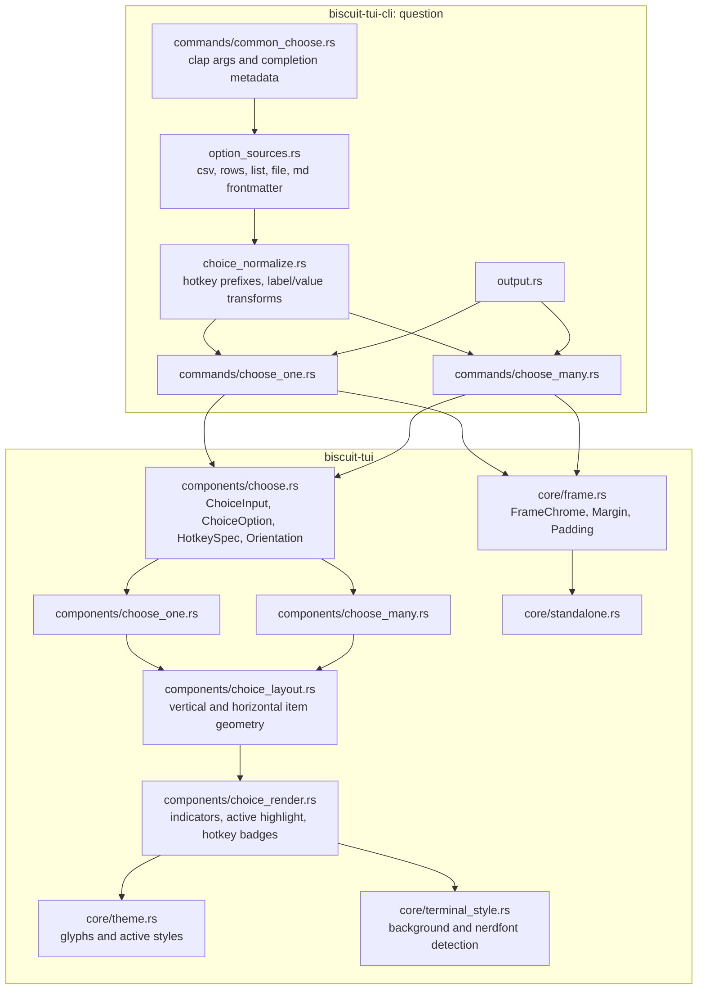

# Choose Components Improvements - Technical Design

This document complements the functional specification in
[spec.md](./spec.md) for `2026-04-28-choose-one-improvements`. The spec is
authoritative for user-facing behavior; this design describes the internal
shape needed to implement it in the `biscuit-tui` library and the `question`
CLI without duplicating every requirement.

## Scope

The implementation spans the `biscuit-tui` package area:

- `biscuit-tui/lib`: shared component types, rendering, state transitions, and
  standalone event loop integration.
- `biscuit-tui/cli`: source parsing, value normalization, shell completions, and
  command output behavior.
- `biscuit-tui/docs`: component and CLI docs updated after public behavior
  changes.

The feature should avoid deprecation baggage unless a compatibility alias is
cheap and isolated. In particular, prefer replacing the current shuffle-oriented
choice ordering with an explicit sort enum over carrying both long-term.

## Module Graph



## Public API Shape

### Shared Choice Types

Add the shared layout and hotkey vocabulary to `components/choose.rs`:

```rust
#[derive(Debug, Clone, Copy, PartialEq, Eq, Hash, Default)]
pub enum Orientation {
    #[default]
    Vertical,
    Horizontal,
}

#[derive(Debug, Clone, Copy, PartialEq, Eq, Hash)]
pub enum HotkeySpec {
    Ctrl(char),
    Alt(char),
}

#[derive(Debug, Clone, Copy, PartialEq, Eq, Hash, Default)]
pub enum HotkeyDisplayMode {
    #[default]
    Hidden,
    CtrlHeld,
    AltHeld,
}
```

`ChoiceOption<V>` gains:

```rust
pub hotkey: Option<HotkeySpec>
```

with a builder:

```rust
pub fn with_hotkey(mut self, hotkey: HotkeySpec) -> Self
```

`ChoiceInput<V>` gains:

```rust
pub orientation: Orientation,
pub sort: OptionSort,
```

with builders `with_orientation` and `with_sort`. If the existing `SortOrder`
name remains, map the spec's `Inverse` spelling to the current `Reverse`
variant at the CLI boundary or rename the enum once and update callers. The CLI
must expose `inverse`, not `reverse`, because that is the vocabulary in the
spec.

### FrameChrome Padding

`core/frame.rs` should add a `Padding` struct mirroring `Margin`:

```rust
#[derive(Debug, Clone, Copy, PartialEq, Eq, Hash)]
pub struct Padding {
    pub top: u16,
    pub bottom: u16,
    pub left: u16,
    pub right: u16,
}
```

`Padding::default()` returns `Padding::uniform(1)`. This is intentionally
different from `Margin::default()` and must live in the library default so
embedded users get the same interior spacing as the CLI.

`FrameChromeConfig` gains `padding: Padding`. Rendering order becomes:

1. Shrink by outer margin.
2. Draw border if configured.
3. Shrink the border interior by padding.
4. Render the inner widget.

For `BorderStyle::None`, padding still applies. This makes `FrameChrome` a true
content wrapper instead of only a border wrapper.

## State Model

The existing state structs already separate `hover` from `selected`. This
feature should make that distinction explicit and add the original selection
needed for `ChooseOne` ESC behavior.

```rust
pub struct ChooseOneState<V = String> {
    input: ChoiceInput<V>,
    active: usize,
    selected: Option<usize>,
    initial_selected: Option<usize>,
    scroll_offset: usize,
    hotkeys: HashMap<HotkeySpec, usize>,
    hotkey_display: HotkeyDisplayMode,
    layout_cache: ChoiceLayoutCache,
    // existing label/theme/bindings/filter/validation fields
}
```

`hover` can stay as the field name to minimize churn, but docs and helper names
should use "active item" terminology. `initial_selected` is set by
`with_initial_selection`, `with_initial_value`, or remains `None`.

`ChooseManyState` does not need an `initial_selected` copy because ESC keeps the
current cancellation semantics unless the event loop itself maps Ctrl-C to
interrupt. It does need the same `hotkey_display` and `layout_cache` fields.

## Event Semantics

### ChooseOne

`ChooseOne::handle_event` should implement the following order:

1. `Ctrl-C`: return `EventOutcome::Cancelled` and let the standalone runner map
   it to exit code `130`.
2. Filter editing keys, when filter mode is active.
3. Hotkey chord (`Ctrl+key` or `Alt+key`): move active item, select it, and
   submit.
4. `Enter`: select the active enabled item and submit.
5. `Space`: select the active enabled item and stay open.
6. Navigation keys: move active item only.
7. `Esc`: restore `selected = initial_selected` and submit.

This requires the standalone layer to distinguish cancellation caused by Ctrl-C
from `ChooseOne`'s ESC-as-submit path. The component should not return
`Cancelled` for ESC anymore; it should return `Submitted` after restoration.

### ChooseMany

`ChooseMany` keeps existing submit/cancel behavior except for two details from
the spec:

- `Enter` submits the current selected set exactly as-is. It must not promote the
  active item.
- `Space` remains the exclusive row toggle.

If existing fallback-on-enter logic is shared with `ChooseOne`, split it before
implementing the new behavior.

## Horizontal Layout

Create `components/choice_layout.rs` so both choice components use one geometry
implementation. The layout function returns item placements in option index
order:

```rust
pub struct ChoiceItemRect {
    pub option_index: usize,
    pub row: u16,
    pub col: u16,
    pub width: u16,
}

pub struct ChoiceLayout {
    pub items: Vec<ChoiceItemRect>,
    pub rows: Vec<std::ops::Range<usize>>,
}
```

Vertical orientation is a degenerate layout: one item per row, full available
width, arrow prefix enabled.

Horizontal orientation measures the rendered item width using
`unicode_width::UnicodeWidthStr`, then packs items left-to-right until the next
item would exceed `area.width`. It should reserve room for:

- radio or checkbox indicator,
- one space after the indicator,
- label width,
- one trailing blank cell for the active background,
- hotkey badge width when badges are visible.

Navigation in horizontal mode operates over this cache:

- Left/Right moves to previous/next option in sequential option order.
- Up/Down finds the row above/below and picks the item whose `col` is closest to
  the current item's `col`.
- If the adjacent row is shorter, choose its last item.

The layout cache is rebuilt during render and can be reused by the next key
event. When the cache is stale or empty, fall back to sequential movement so
input remains responsive before the first render.

## Rendering Design

Move common row/item rendering into `components/choice_render.rs` to prevent
`ChooseOne` and `ChooseMany` from drifting.

```rust
pub struct ChoiceRenderContext<'a> {
    pub theme: &'a ComponentTheme,
    pub orientation: Orientation,
    pub active: bool,
    pub selected: bool,
    pub disabled: bool,
    pub hotkey: Option<HotkeySpec>,
    pub hotkey_display: HotkeyDisplayMode,
    pub terminal_style: TerminalStyle,
}
```

The renderer decides:

- selection indicator glyph,
- active background color,
- active foreground color,
- arrow prefix visibility,
- hotkey badge style and placement.

The active item background should only cover the rendered item width plus one
blank cell. Do not use `buf.set_style(area, style)` for the whole row. Build the
line spans and apply style only to the prefix/indicator/label/trailing-space
span group.

### Glyph Policy

Keep ASCII-safe defaults and select richer glyphs only when terminal capability
detection says they are usable.

| Component | Capability | Selected | Unselected |
| --- | --- | --- | --- |
| `ChooseOne` | Nerd Font | `\u{f043e}` | `\u{f4aa}` |
| `ChooseOne` | fallback | `●` | `○` |
| `ChooseMany` | Nerd Font | `\u{f14a}` | `\u{f0131}` |
| `ChooseMany` | fallback | `☑` | `☐` |

Terminal detection should be conservative. A small helper can inspect
environment variables such as `NERD_FONT`, `TERM_PROGRAM`, and
`WT_PROFILE_ID`, but unknown terminals should fall back to standard Unicode.
Avoid probing by writing control sequences in normal prompt startup.

### Active Colors

Add an `ActiveChoiceColor` enum with `Grey`, `Green`, `Yellow`, and `Red`.
Resolve it through a helper that accounts for terminal background:

```rust
pub struct TerminalStyle {
    pub background: TerminalBackground,
    pub nerd_font: bool,
}

pub enum TerminalBackground {
    Dark,
    Light,
    Unknown,
}
```

Use `biscuit-terminal` background detection when that crate is already available
to this package area. If adding the dependency would broaden the workspace more
than the feature warrants, isolate it behind a small `core::terminal_style`
module so it can be swapped in later. Unknown background should use the dark
mode palette because it is the safer common terminal default.

Active text should be `Color::White` on dark backgrounds and `Color::Black` on
light backgrounds. The style must not underline active text; use bold plus the
faint background.

## Hotkey Handling

Represent hotkeys by full chord, not by bare character. This avoids collisions
between `Ctrl+r` and `Alt+r`.

```rust
type HotkeyMap = HashMap<HotkeySpec, usize>;
```

Normalize alpha characters with `to_ascii_lowercase()` during construction.

**Duplicate hotkey rule.** The only collision shape that errors is
**explicit-vs-explicit**: two options each carrying a user-supplied or
numeric-assigned hotkey on the same chord. Plain options (no `[CTRL+x]`
prefix, no object-source `hotkey` field, no numeric assignment) have no
hotkey at all and participate in no collisions. Disabled options
contribute no effective hotkey.

Library construction should use first-wins semantics to avoid panicking in
embedded apps.

> **Acceptance test (must pass before sign-off):**
> `question choose-one "[CTRL+f]foo" bar baz bax` runs cleanly. The user
> explicitly set only `Ctrl+f`; the plain options `bar`, `baz`, `bax`
> simply have no hotkey.

Pure modifier key press/release visibility is terminal-dependent. The runner MUST
attempt to enable the kitty keyboard protocol by pushing
`KeyboardEnhancementFlags::REPORT_EVENT_TYPES |
KeyboardEnhancementFlags::DISAMBIGUATE_ESCAPE_CODES` in `prepare_terminal`.
If the push succeeds, crossterm will emit standalone modifier press/release
events; if it fails, the runner silently degrades. The flags MUST be popped in
`restore_terminal` only when the push succeeded.

Implement hotkey badges with two layers:

- When a real `KeyEventKind::Press`/`Release` modifier-only event is available,
  set `hotkey_display` to `CtrlHeld` or `AltHeld` while held.
- As a portable fallback, show badges briefly after a Ctrl/Alt chord or while
  the user is in an explicit help mode if one already exists later.

This preserves the spec intent where terminal support exists without blocking
the feature on non-portable modifier events.

## CLI Design

### Source Parsing

Replace the current "legacy source" vocabulary in `commands/common_choose.rs`
with a source enum:

```rust
enum ChoiceSource {
    Positional(Vec<String>),
    Csv(String),
    List(String),
    Rows(String),
    File(PathBuf),
    MarkdownFrontmatter { path: PathBuf, property: String },
    Stdin(String),
}
```

The source flags are mutually exclusive with one another, except positional
arguments are accepted only when no explicit source flag is present. Stdin is the
last fallback when no explicit source and no positionals exist.

`--file` should parse JSON, JSONL, NDJSON, YAML, CSV, and TOML into an array of
strings or array of objects with explicit `label`, `value`, and optional
`hotkey` fields. If the top-level shape is not an array, return
`ChoiceCliError::InvalidSourceShape`.

`--md <file> <prop>` should read Markdown frontmatter and require the property
to be an array. This can reuse existing repo Markdown/frontmatter utilities if
available; do not hand-roll frontmatter parsing with string slicing.

### Label and Value Normalization

Build options in this order:

1. Parse source into raw option records.
2. Strip hotkey prefixes like `[CTRL+R]`, `[ALT+B]`, and `[OPT+B]`.
3. Split `Label::Value` on `::` when present.
4. Apply `--label <convention>` and `--value <convention>` transforms.
5. Assign numeric hotkeys if `--numeric-hot-keys` is set and no explicit hotkey
   exists for that option.
6. Apply sort.
7. Build `ChoiceInput<String>`.

Delimited `::` wins over convention-generated labels/values for the side it
explicitly supplies. For example, with `--value snake-case`,
`"Red Delicious::Apple"` renders `Red Delicious` and returns `Apple`, not
`apple`.

### Error Types

Keep CLI errors local to `biscuit-tui-cli`; the library should not depend on
`clap`, filesystem parsing crates, or Markdown parsing.

```rust
#[derive(Debug, thiserror::Error)]
pub enum ChoiceCliError {
    #[error("no options provided")]
    NoOptions,
    #[error("choice option sources are mutually exclusive")]
    ConflictingSources,
    #[error("unsupported option file format: {0}")]
    UnsupportedFormat(String),
    #[error("option file must contain an array")]
    InvalidSourceShape,
    #[error("markdown frontmatter property `{property}` must be an array")]
    InvalidFrontmatterProperty { property: String },
    #[error("duplicate hotkey `{0}`")]
    DuplicateHotkey(String),
    #[error(transparent)]
    Io(#[from] std::io::Error),
}
```

Map these through the existing CLI error path so failures print a concise message
and exit non-zero before entering raw terminal mode.

## Shell Completions

Add `question completions <shell>` using `clap_complete`. Keep completion
generation in the CLI crate only.

Completion metadata should include:

- subcommand names,
- `--sort` values: `natural`, `inverse`, `asc`, `desc`,
- convention values,
- source flags: `--csv`, `--list`, `--rows`, `--file`, `--md`,
- hotkey prefix suggestions when the current token starts with `[`.

The hotkey prefix completion MUST be implemented so that typing `[` followed by
`<TAB>` (quoted or unquoted) in any positional argument position offers
`[CTRL+`, `[ALT+`, `[OPT+` as the **only** candidates, with no command or file
fallback pollution. Post-processing of the generated script replaces the
positional catch-all `:_default` with a dedicated `_question_choice_positional`
function for `choose-one` and `choose-many`.

The completion script MUST also preserve option flag suggestions after a literal
`--` separator. This is achieved by removing `-S` from `_arguments_options` in
the generated zsh script.

The hotkey prefix completion may require a custom generator. If that becomes too
large, ship static shell completions for the standard clap surface first and add
prefix-aware completions in a follow-up.

## Testing Plan

### Library Unit Tests

- `ChooseOne` ESC restores `initial_selected` and returns `Submitted`.
- `ChooseOne` Space changes selection without submission.
- `ChooseOne` Enter selects active item and submits.
- `ChooseMany` Enter submits without toggling active item.
- Horizontal layout wraps by measured width and preserves option order.
- Horizontal Up/Down choose closest column and short-row fallback.
- Active item style covers only rendered width plus one blank.
- Radio and checkbox glyph selection respects terminal capability input.
- Duplicate library hotkeys are first-wins and do not panic.

### CLI Unit Tests

- Source mutual exclusion.
- `--csv`, `--list`, `--rows`, `--file`, and `--md` parse to the same normalized
  option representation.
- JSON/YAML/TOML non-array source returns `InvalidSourceShape`.
- JSONL/NDJSON records parse one option per line.
- Hotkey prefixes are stripped and normalized.
- `--numeric-hot-keys` assigns Ctrl 1-9, Ctrl 0, Alt 1-9, Alt 0.
- Convention transforms handle whitespace, punctuation, and already-cased input.
- `::` label/value split takes precedence over conventions where applicable.
- `--padding`, `--pt`, `--pb`, `--pl`, and `--pr` merge like margin flags.

### Integration Tests

Use `drive_event_loop` or direct `HandleEvent` calls for deterministic key
sequences. Avoid snapshotting a full terminal where a narrow buffer assertion is
enough. Add a small number of render buffer tests for:

- vertical `ChooseOne` radio indicator,
- horizontal wrapping,
- active background span width,
- hotkey badge rendering.

CLI integration can use `assert_cmd` for non-interactive parsing paths and a
synthetic event source for interactive paths. Do not rely on an actual terminal
for CI.

### Verification Gates

All completion claims MUST be verified by PTY-driven shell tests (zsh + bash).
These tests spawn a real shell, install the completion script into a temp
`fpath` directory, and assert candidate lists for:

- `question choose-one "[<TAB>` → exactly `[CTRL+`, `[ALT+`, `[OPT+`.
- `question choose-one [<TAB>` → same.
- `question choose-one a b c d --border --border-label X --<TAB>` → candidate
  set includes `--csv`, `--list`, `--numeric-hot-keys`, `--no-filter`,
  `--required`, etc. Not empty.
- `question <TAB>` → subcommand list.

All keyboard-modifier claims MUST be verified by an integration test that
exercises the real `prepare_terminal` sequence under a PTY. A bare `Ctrl` press
via the kitty protocol bytes MUST advance `ChooseOneState`'s
`current_hotkey_display` to `CtrlHeld`.

No completion or keyboard-modifier feature may be marked "production ready"
without the corresponding PTY test passing.

## Performance Notes

The core data remains small and caller-owned:

- `ChoiceOption<V>` adds one `Option<HotkeySpec>`, which is a compact copyable
  enum for common `V = String` use.
- `Orientation`, `OptionSort`, and `HotkeyDisplayMode` are copy enums and do not
  allocate.
- The horizontal layout cache is `Vec<ChoiceItemRect>` plus row ranges and is
  rebuilt only on render. Its memory cost is linear in visible options.
- Active background styling should be span-based rather than full-row buffer
  mutation, reducing unnecessary cell writes in wide terminals.
- `FrameChrome` padding is four `u16` values and does not change the wrapped
  widget's state type or add dynamic dispatch.

The widget pattern remains zero-sized widget plus external state. No trait
objects or v-table dispatch are needed for the new choice rendering helpers.

## Migration and Compatibility

Because this repo is not carrying a large external ecosystem yet, prefer direct
behavior changes over multi-release deprecations. Compatibility aliases are
acceptable when they cost little:

- Accept `--sort reverse` as a hidden alias for `--sort inverse` if existing
  tests or scripts already use `reverse`.
- Keep older `--options` only if removing it would break current docs/tests
  unrelated to this feature; otherwise move callers to `--csv`.
- Do not add Rust `#[deprecated]` attributes unless a public library method is
  being replaced and still needs to compile for downstream users.

Docs that must change with the implementation:

- `biscuit-tui/docs/components/choose_one.md`
- `biscuit-tui/docs/components/choose_many.md`
- `biscuit-tui/docs/components/frame_chrome.md`
- `biscuit-tui/docs/cli-reference.md`
- `biscuit-tui/lib/README.md`
- `biscuit-tui/cli/README.md`

## Implementation Order

1. Add shared types: `Orientation`, `HotkeySpec`, `Padding`, terminal style
   helper, and choice sort vocabulary.
2. Refactor shared choice rendering/layout without changing behavior.
3. Implement padding in `FrameChrome` and CLI padding flags.
4. Implement `ChooseOne` event semantic changes, including ESC restore-submit.
5. Implement `ChooseMany` Enter semantics and indicator glyph policy.
6. Add horizontal layout and navigation for both choice components.
7. Add explicit hotkey specs, CLI prefix parsing, and numeric hotkeys.
8. Replace/extend option source parsing and label/value normalization.
9. Add completions.
10. Update docs and run focused tests, then `cargo test -p biscuit-tui -p
    biscuit-tui-cli`.
