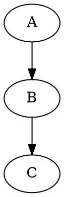
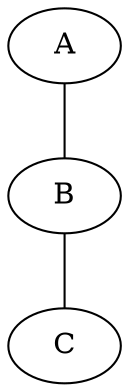
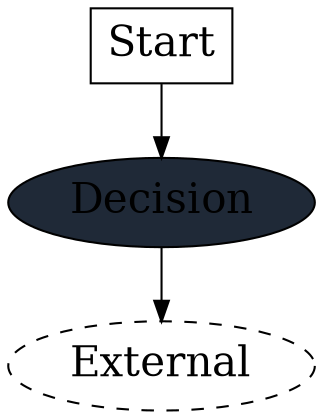
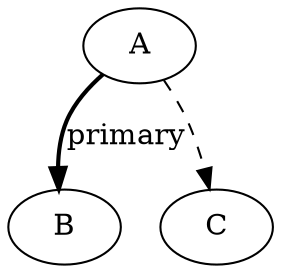
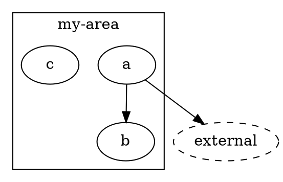
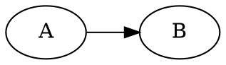
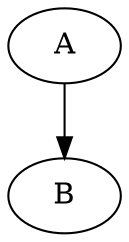
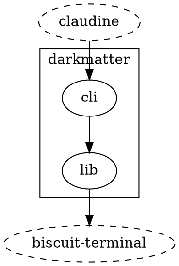

# DOT Graph Visualization

`biscuit-visualized` accepts a deliberately small subset of [Graphviz DOT](https://graphviz.org/doc/info/lang.html) as input for graph rendering. The DOT source is parsed by `layout-rs` (pure-Rust layout engine), laid out, and emitted as SVG. The SVG is then optionally rasterized to PNG via `resvg`.

This document is the reference for what the library supports, the validator's hard rejections, and the resolution-tuning techniques you need when generated PNGs flow into a terminal.

## When to use DOT vs expression syntax

The library offers two input grammars for graphs:

| Syntax | Strengths | Pick when… |
|--------|-----------|-----------|
| **Expression** (`a -> b -> c`) | Compact, easy to author by hand | A few nodes/edges, no clustering or styling needed |
| **DOT** | Clusters, per-node attributes, layout direction | Generated output, focus subgraphs, styled nodes, label customisation |

`GraphBuilder` is a programmatic builder; it currently emits DOT internally.

The rest of this doc is about DOT — the expressive grammar.

## API entry points

```rust
use biscuit_visualized::artifact::{OutputFormat, RenderRequest};
use biscuit_visualized::graph::{GraphDiagram, GraphInputSyntax};

// Direct DOT
let graph = GraphDiagram::from_dot(dot_source)?;

// Force DOT through the polymorphic entry point
let graph = GraphDiagram::parse(dot_source, GraphInputSyntax::Dot)?;

// Auto-detect — anything starting with `digraph`/`graph` or containing `{ ... }`
// is treated as DOT.
let graph = GraphDiagram::parse(input, GraphInputSyntax::Auto)?;

let artifact = graph.render(&RenderRequest::default())?;
```

For terminal display, wrap with [`biscuit-terminal::components::graph_expression::GraphExpression`]:

```rust
use biscuit_terminal::components::graph_expression::{GraphExpression, GraphInputSyntax};

let graph = GraphExpression::for_terminal(dot_source, GraphInputSyntax::Dot)?
    .with_width(ImageWidth::Percent(0.75));
println!("{}", graph.render(&Terminal::default()));
```

## Supported DOT grammar

Everything below is exercised by `biscuit-visualized` tests and used in production by `sniff repo deps --ui`.

### Graph declarations





Both `digraph` (directed) and `graph` (undirected) are supported. The graph name (`G` above) is optional but conventional.

### Statements

| Statement | Example | Notes |
|-----------|---------|-------|
| Node | `A;` or `A [label="..."];` | Implicit when used in an edge |
| Edge (directed) | `A -> B;` | Only inside `digraph` |
| Edge (undirected) | `A -- B;` | Only inside `graph` |
| Edge chain | `A -> B -> C;` | Sugar for two edges |
| Attribute default | `node [fontsize=20];` | Applies to all subsequent nodes |
| Cluster | `subgraph cluster_X { ... }` | Single nesting level only |
| Graph attribute | `rankdir=LR;` | Top-level only |

### Node attributes

`layout-rs` recognises the following per-node attributes:

| Attribute | Values | Effect |
|-----------|--------|--------|
| `label` | Any quoted string | Display label (default = node id) |
| `shape` | `box`, `doublecircle`, `record`, `Mrecord`, anything else → ellipse | Node outline |
| `color` | Color name or `#rrggbb` | Border colour |
| `fillcolor` | Color name or `#rrggbb` | Fill colour (requires `style=filled` or is set directly) |
| `style` | `filled`, `dashed` | Visual style; `filled` defaults `fillcolor` to lightgray if unset |
| `fontsize` | Integer | Label font size in points (default 14) |



### Edge attributes

| Attribute | Values | Effect |
|-----------|--------|--------|
| `label` | Quoted string | Edge label |
| `style` | `dashed` | Dashed line |
| `color` | Color name or `#rrggbb` | Line colour |
| `penwidth` | Integer | Line thickness |
| `fontsize` | Integer | Label font size |



### Clusters (single-level subgraphs)

Wrap a set of nodes in `subgraph cluster_<name>` to draw a labeled bounding box around them. The `cluster_` prefix is what triggers the visual cluster (a plain `subgraph` name without that prefix just groups nodes for layout purposes).



**Nesting is rejected.** `validate_dot()` walks the AST and returns `GraphError::UnsupportedDotFeature("Nested subgraphs/clusters are not supported")` for any cluster inside another cluster.

### Graph orientation



The library also exposes orientation via `GraphDiagram::with_orientation(GraphOrientation::LeftToRight)` which rewrites/injects the `rankdir` attribute. If your DOT already contains `rankdir=...`, the explicit call wins.

### Comments



## Validator rejections

`validate_dot()` runs before parsing and rejects three classes of input outright. All produce `GraphError::UnsupportedDotFeature(...)`:

| Construct | Why rejected |
|-----------|-------------|
| `<TABLE>...</TABLE>` HTML labels | `layout-rs` doesn't render HTML; would silently mis-layout |
| `label=<...>` HTML angle-bracket labels | Same |
| Nested `subgraph` blocks | `layout-rs` doesn't render nested clusters |

DOT features that **are not detected by the validator but also don't work** (silently ignored by `layout-rs`):

- `nodesep`, `ranksep` — layout spacing knobs
- `splines=ortho` — orthogonal edge routing
- `concentrate=true` — multi-edge merging
- `fontname` — font family at DOT level (use `GraphDiagram::with_font_family()` on the wrapping `GraphColorTheme` instead; it's applied via SVG post-processing)
- `fontcolor` — same; applied via SVG post-processing when a `GraphColorTheme` is set

If you need any of these, the only path today is forking `layout-rs` or post-processing the SVG output.

## SVG post-processing

After `layout-rs` produces raw SVG, `GraphDiagram::render()` runs three passes before optional rasterization:

1. **Padding trim** (`trim_svg_padding`) — Recomputes a tight `viewBox` from element coordinates (ellipses, paths) so the canvas doesn't have ~60 px of empty `layout-rs` padding on each side.
2. **Background fill** (`apply_graph_background`) — Inserts a `<rect width="100%" height="100%" fill="...">` matching the theme's `surface_color`, unless `RenderRequest::transparent_background` is set.
3. **Text style patch** (`apply_text_style`) — Replaces `font-family: Times, serif;` (hard-coded by `layout-rs`) with the theme's font family, and adds `fill="..."` to every `<text>` to override `layout-rs`'s baked-in text colour.

These passes only run when a `GraphColorTheme` is configured; the bare default renders with `layout-rs`'s built-in styling.

## Resolution tuning for terminal display

The DOT pipeline ultimately produces a PNG that's shown inline in a terminal. The key insight is that **PNG dimensions should match the terminal display target**, not be derived from some abstract DPI multiplier. The library exposes two complementary entry points:

| Use case | API | What you pass |
|---|---|---|
| "Render at this many pixels wide" | `RenderRequest::with_target_width(px)` | The display target in pixels |
| "Render at N× the SVG's native size" | `RenderRequest { scale: N, .. }` | A HiDPI multiplier (1, 2, 3…) |

For terminal display, the first form is what you want.

### How `biscuit-terminal::GraphExpression` uses it

`GraphExpression::render_to_image` computes the target before calling the rasterizer:

```rust
let dims = TerminalImage::resolve_dimensions_for(&self.width, &self.layout, term.width());
let cell_pixel_width = term.cell_size().map(|cs| cs.width.max(1)).unwrap_or(8);
let target_width_px = dims.image_width * cell_pixel_width;
let (png_path, _) = self.render_to_cached_png_at_width(target_width_px)?;
```

`resvg` then renders the SVG once at exactly `target_width_px` pixels. Text glyphs are rasterised fresh at the display resolution — no oversampling, no downstream downscaling.

### Why this matters in practice

Before terminal-aware rasterization, `biscuit-terminal` would call the scale-based path (`scale=2`, fixed). The native PNG was always 2× the SVG's natural dimensions. For wide hub-and-spoke graphs the natural SVG is itself wide-and-thin, so on narrow terminals you got a PNG ~3–5× larger than needed in the long axis and barely usable in the short axis. The terminal then downscaled the bitmap, which loses text fidelity even with good filters.

With target-aware rasterization the rasterizer renders directly at terminal pixel dimensions:

- **On a 152-cell Retina terminal** with detected cell width of 18 physical pixels: target ≈ 152 × 0.75 × 18 ≈ 2,050 px. The PNG comes out that wide. The terminal displays it 1:1. Text is sharp.
- **On a 400-cell terminal**: target ≈ 5,400 px wide. The same SVG rasterises at that resolution and the terminal displays it 1:1. Text is sharp.

Same SVG, different PNGs sized for each display. The browser does effectively the same thing when you open the SVG directly; we're now doing it for the terminal too.

### When you should still use `scale`

The legacy `scale: u32` field on `RenderRequest` is preserved for callers that genuinely want an HiDPI multiplier independent of any specific display target — for instance:

- Producing a 2× version of a diagram for printable PDF embedding.
- Generating thumbnails at a fixed multiplier of source SVG dimensions.
- Caching artifacts that may be displayed at unknown future sizes.

When `target_width` is `None`, the rasterizer falls back to `scale × svg_native`. When `target_width` is `Some(n)`, the `scale` field is ignored.

### Historical note: the `fontsize=48` hack

Earlier versions of `sniff/cli/src/output/filesystem/deps.rs` injected `node [fontsize=48];` at the top of every generated DOT source. That was a workaround for the symptom described above — by growing the SVG canvas at the source, the `scale=2` rasterisation happened to produce a PNG large enough that terminal downscaling didn't shred the text.

The workaround is no longer needed; the DOT emitted by `build_deps_dot` uses `layout-rs`'s default `fontsize=14`. Target-aware rasterization makes terminal display sharpness independent of SVG canvas size, so we don't carry that overhead through layout, caching, or storage.

## Common patterns

### Focus subgraph + external bare nodes

When you want to highlight a subset of nodes inside a cluster but show their 1-hop neighbours floating outside (e.g. dependency graph focused on a package area):



The bare nodes lay out around the focus cluster automatically and the `style=dashed` makes them read as "context" rather than primary. Sharpness is handled by the rasterizer at render time (see [Resolution tuning](#resolution-tuning-for-terminal-display)), so the DOT source itself doesn't need any `fontsize` tricks.

### Synthetic node IDs

DOT identifiers can't contain hyphens unquoted. The library generates synthetic `n0`, `n1`, … IDs and puts the human-readable name in `label`:

```dot
n0 [label="biscuit-terminal"];
n1 [label="sniff-cli"];
n0 -> n1;
```

This is what `build_deps_dot()` in `sniff/cli/src/output/filesystem/deps.rs` does. The `sanitize_id()` helper strips non-alphanumerics when an arbitrary string (e.g. an area name) needs to appear in an identifier position.

## Source files

| File | Contents |
|------|----------|
| `biscuit-visualized/src/graph/dot.rs` | `validate_dot()`, `render_dot_to_svg()`, expression-to-DOT conversion |
| `biscuit-visualized/src/graph/render.rs` | `GraphDiagram` post-processing (orientation, title, theme injection) |
| `biscuit-visualized/src/raster/png.rs` | `rasterize_svg_to_png_bytes()` — the `scale` parameter feeds in here |
| `biscuit-terminal/lib/src/components/graph_expression.rs` | Terminal-side wrapper, image width handling, fallback |
| `biscuit-terminal/lib/src/components/terminal_image/` | Inline image protocols (iTerm2, Kitty, …) and the `min(img_width)` downscaling rule |
| `sniff/cli/src/output/filesystem/deps.rs` | Reference consumer — DOT generation, fontsize=48, focus subgraph + dashed externals |

## Related

- [Graph Rendering](../../.claude/skills/biscuit-visualized/graph-rendering.md) — broader graph API (expression syntax, `GraphBuilder`, orientation)
- [Rasterization](../../.claude/skills/biscuit-visualized/rasterization.md) — `scale` parameter, terminal protocol ceiling
- [Artifacts & Caching](../../.claude/skills/biscuit-visualized/artifacts-caching.md) — `RenderRequest`, `RenderedArtifact`, `FileCache`
