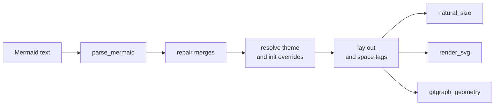
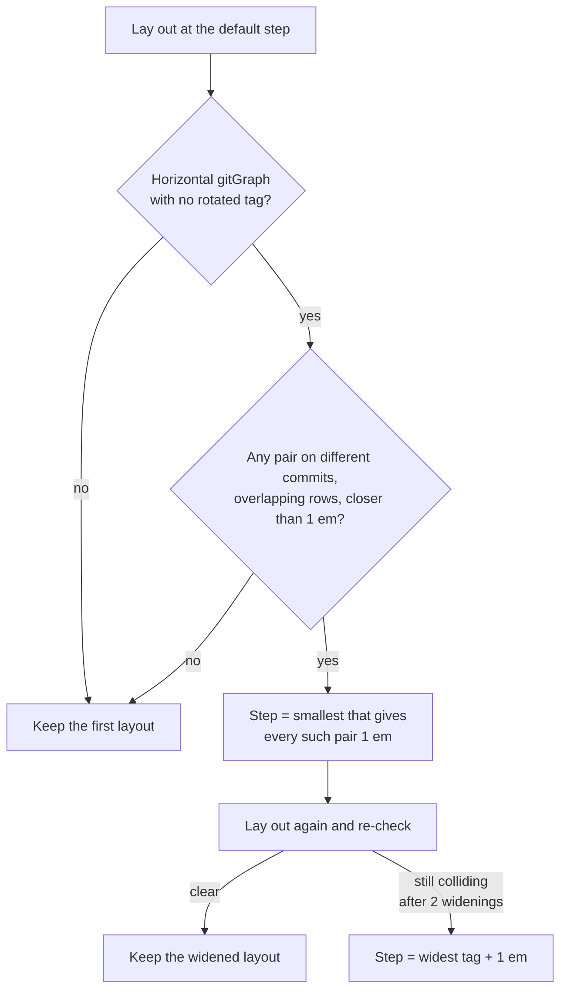

# Mermaid gitGraph Corrections

`biscuit-visualized` renders Mermaid through `mermaid-rs-renderer` 0.3.1. For a `gitGraph` it corrects two renderer behaviors before drawing:

- **Merge repair:** a labeled `merge` gets back the second parent the parser loses.
- **Tag spacing:** commits are spaced so no two tags overlap.

Both happen for every gitGraph and every caller: `MermaidDiagram` directly, biscuit-terminal's `GitGraph` and `bt git-graph`, and Darkmatter's Mermaid blocks. There is nothing to opt into and no new option.

## Where the corrections run



All three outputs go through the one private `MermaidDiagram::compute_layout`. So the size `biscuit-terminal` measures to fit a terminal is always the size of the image it then draws.

## Merge repair

`mermaid-rs-renderer` 0.3.1 reads everything after `merge` as the source branch's name, attributes included. For `merge feat id: "M" tag: "v1"` it looks for a branch called `feat id: "M" tag: "v1"`, finds none, and gives the merge commit only its first parent. The merge edge disappears from the picture.

After parsing, each merge commit with exactly one parent gets its source lane back:

1. The source is recovered from the parser's commit message, `merged branch {suffix} into {lane}`.
2. A declared lane matches when the suffix **is** its name, or is its name followed by whitespace and `id:`, `tag:`, or `type:`. Exactly one lane must match.
3. The second parent is that lane's last commit before the merge.

For example:

```text
gitGraph
    commit id: "A"
    branch feat
    checkout feat
    commit id: "B"
    checkout main
    merge feat id: "M" tag: "v1"
```

Parsed as-is, `M`'s parents are `[A]`. After the repair they are `[A, B]`, and `M` keeps its ID, its tag, and its lane.

| Situation | Result |
|---|---|
| The merge already has two or more parents (an unlabeled `merge feat`, or a future parser that handles attributes) | Left alone: the repair is a no-op |
| Its single parent already is the source lane's tip (a merge into a lane with no commit of its own yet) | Left alone |
| `merge feat x id: "M"` with lanes `feat` and `feat x` | Resolves to `feat x`: `feat` is followed by `x`, not an attribute key |
| No declared lane matches | `MermaidError::RenderFailed` |
| Two lanes match (lanes `x` and `x tag: "t"` with `merge x tag: "t" id: "M"`) | `MermaidError::RenderFailed` |
| The source lane has no commit before the merge | `MermaidError::RenderFailed`, as mermaid.js refuses to merge an empty branch |

A merge is never drawn with a guessed source. Measurement, geometry, and rendering all report the error.

One parser behavior the repair cannot fix: a **labeled** merge into a lane that has no commit yet is dropped by the parser entirely, so it never reaches the repair. Emit a merge only where its destination lane already has a commit.

A unit test pins the parser's message format. If a dependency update changes it, that test fails instead of the repair silently stopping.

## Tag spacing

The renderer places each tag above its commit with no collision avoidance and spaces commits a fixed `commit_step` apart (34 units in the default theme). A tag wider than that covers its neighbor's, as `main` and `origin/main` one commit apart do.

A left-to-right gitGraph with no rotated tag is first laid out at the default step. Its tags are then checked in pairs, and the step grows only when a pair collides:

- **Which pairs count.** Two tags on **different** commits whose label boxes overlap vertically (touching edges do not count). Tags stacked on one commit never widen the step, and neither do tags on lanes far enough apart that their rows do not overlap.
- **The gap.** Each counting pair needs one em (`TAG_GAP_EM` × the resolved theme's font size, including `%%{init}%%` overrides) between the earlier label's right edge and the later label's left edge. The em is a readability policy, not a measured margin.
- **The smallest step.** A pair that is `shortfall` units short of the gap, with its commits `n` places apart, needs `default + shortfall / n`. The diagram uses the largest of these, so the tightest pair ends up exactly one em apart and no pair is closer.
- **Verification.** The widened layout is checked again with the same rules. Label edges move linearly with the step, so the first widening clears every pair. A second widening is allowed; if a collision still survived that, a third layout would use the widest tag plus the gap, a step that cannot collide.



Tags stay on their original commits and keep their full text. Two examples in the default theme (font 16):

| Graph | Colliding pair | Step |
|---|---|---|
| `main` and `origin/main` stacked on one commit, beside a long history | none (same commit) | 34, the default |
| `main` on one commit, `origin/main` on the next | overlapping by 7.71 units, one place apart | 34 + 7.71 + 16 = 57.71 |

So a graph with one long, isolated label keeps the renderer's density. Only a real collision widens it, and only as far as that collision needs.

Everything else is laid out once, unchanged:

- diagrams that are not gitGraphs;
- gitGraphs with no tags;
- vertical gitGraphs (`TB`, `BT`). 0.3.1 honors only a separate `TB` or `direction TB` line, not `gitGraph TB:`;
- gitGraphs with any rotated tag. **Rotated tags are not spaced and can still overlap.**

0.3.1's parser does not recognize `RL`: `direction RL` lays out exactly like `LR`. The pair rule orders labels by their commits' x, so it would hold for a mirrored layout too.

The step is still one value for the whole diagram, so one colliding pair widens every column. Callers that fit a width should expect that a colliding graph may need shrinking. biscuit-terminal's `GitGraph` trims commits first and then shrinks, and never shortens a label.

## Cache identity

Neither correction adds a rendering input: each is derived from the Mermaid text and the resolved theme, which the artifact cache key already covers. Because a change to either changes the output for the same input, the backend identifier in the key moves with it: it is now `mermaid-rs-renderer@0.3.x+bv3` (`cache::file_cache::MERMAID_BACKEND`), bumped from `+bv2` when tag spacing became collision-driven. Artifacts cached before the change are never served again. Bump the `+bv<n>` suffix whenever this layer changes the output.

## Checking a layout

`MermaidDiagram::gitgraph_geometry()` returns the laid-out commits (ID, lane, repaired parents, placement index and x, tag text and bounds), the commit step, and the size, from the same layout that renders. `tag_boxes()` and `tag_overlaps()` answer "do any tags overlap?" without rasterizing. `biscuit_visualized::mermaid::default_gitgraph_commit_step()` gives the renderer's default step to compare against. Both are `#[doc(hidden)]` test support, not a stable API. biscuit-terminal and worktree tests use them to prove placement on real layouts, because Mermaid text alone cannot show an overlap.

## Tests

`src/src/tests/gitgraph_tests.rs` (L1, all features):

- **Merge repair:** the message-format pin, every row of the repair table, a nested-lane merge, and merges into non-root lanes.
- **The pair rule** (`required_step` on synthetic labels): no labels, same-commit tags, labels without vertical overlap, an adjacent pair, a pair three places apart, unequal and offset labels, right-to-left order, a pair within the tolerance, and the largest of several requirements.
- **The spacing loop** (an injected placement): the single pass, one widening that verifies, and the widest-tag fallback.
- **Real layouts:** long labels on neighboring commits, `main`/`origin/main` one commit apart, a stack of three tags, and cross-lane tags, each with a control that overlaps without spacing and a check that the tightest pair is exactly one em apart; the default step for stacked tags, for lanes apart without vertical overlap, and for a real `wt list` graph with `main` and `origin/main` on one commit; `direction RL` laying out like `LR`; a larger `%%{init}%%` font widening only the gap; the unchanged single pass for untagged and vertical graphs; and that the measured size is the spaced layout.

`cache_tests::cache_key_different_mermaid_backend` pins the backend identifier.
