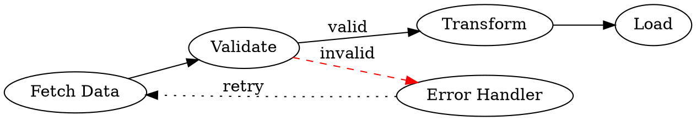

## Data Structures used in Charting

### Label-Value Pair

**Utility:** The simplest and most universal charting data structure. Maps discrete categorical labels to scalar values. Nearly every charting library accepts some variant of this as its base format.

**Chart Types:** Bar, column, pie, donut, radar, polar area, gauge, funnel, treemap (leaf level)

**Property Name Variants:**

| Concept | Chart.js | D3.js | Plotly | ECharts |
|---|---|---|---|---|
| Label/category | `labels[]` (outer) | `key`, `name`, custom accessor | `x[]` or `labels[]` | `name` in series data |
| Value | `data[]` | `value` | `y[]` or `values[]` | `value` |
| Series name | `datasets[].label` | bound to legend key | `name` | `series[].name` |

**Simple Example:**

```ts
// Chart.js style
const chart = {
  labels: ["Apples", "Bananas", "Cherries"],
  datasets: [
    {
      label: "Fruit Sales",
      data: [120, 85, 200],
    },
  ],
};
```

**Complex Example:**

```ts
// Chart.js with styling, multiple visual properties per bar
const chart = {
  labels: ["Q1", "Q2", "Q3", "Q4"],
  datasets: [
    {
      label: "Revenue",
      data: [42000, 58000, 63000, 79000],
      backgroundColor: ["#4e79a7", "#f28e2b", "#59a14f", "#e15759"],
      borderColor: "#333",
      borderWidth: 1,
      borderRadius: 4,
    },
    {
      label: "Target",
      data: [50000, 55000, 60000, 75000],
      type: "line", // mixed chart — line overlay on bar
      borderColor: "#e15759",
      borderDash: [6, 3],
      fill: false,
      pointRadius: 4,
    },
  ],
};
```

---

### Time Series

**Utility:** Pairs timestamps with values to show change over time. Libraries typically sort by timestamp and may perform gap interpolation, downsampling, or timezone-aware rendering. The timestamp can be a Unix epoch integer, ISO 8601 string, or a native `Date` object.

**Chart Types:** Line, area, candlestick, step chart, timeline, sparkline

**Property Name Variants:**

| Concept | Chart.js | D3.js | Plotly | ECharts |
|---|---|---|---|---|
| Timestamp | `x` (when `type: 'time'`) | `date`, `timestamp`, custom accessor | `x[]` (string or number) | `[0]` of `[ts, val]` tuple |
| Value | `y` | `value`, `close`, custom | `y[]` | `[1]` of `[ts, val]` tuple |
| Interval hint | `unit` on x-axis | D3 `scaleTime` ticks | `xaxis.dtick` | `boundaryGap: false` |

**Simple Example:**

```ts
// Plotly style — parallel arrays
const trace = {
  type: "scatter",
  mode: "lines",
  name: "CPU Usage",
  x: ["2024-01-01T00:00:00Z", "2024-01-01T01:00:00Z", "2024-01-01T02:00:00Z"],
  y: [42, 67, 55],
};
```

**Complex Example:**

```ts
// ECharts style — tuple pairs, multiple series, downsampling hint
const option = {
  xAxis: { type: "time" },
  yAxis: [
    { type: "value", name: "°C", position: "left" },
    { type: "value", name: "mm", position: "right" },
  ],
  dataZoom: [{ type: "inside" }, { type: "slider" }],
  series: [
    {
      name: "Temperature",
      type: "line",
      yAxisIndex: 0,
      sampling: "lttb", // Largest-Triangle-Three-Buckets downsampling
      data: [
        [1704067200000, 12.4],
        [1704153600000, 14.1],
        [1704240000000, 11.8],
        [1704326400000, 13.5],
      ],
    },
    {
      name: "Rainfall",
      type: "bar",
      yAxisIndex: 1,
      data: [
        [1704067200000, 2.1],
        [1704153600000, 0],
        [1704240000000, 5.8],
        [1704326400000, 1.2],
      ],
    },
  ],
};
```

---

### Category Series (Grouped / Stacked)

**Utility:** Extends label-value pairs with multiple named series sharing the same category axis. The series can be rendered side-by-side (grouped) or layered additively (stacked). Stacking requires that all series share the same categories in the same order.

**Chart Types:** Grouped bar, stacked bar, stacked area, 100% normalized bar

**Property Name Variants:**

| Concept | Chart.js | D3.js | Plotly | ECharts |
|---|---|---|---|---|
| Grouping mode | `datasets[].stack` (shared key = stacked) | `d3.stack()` utility | `barmode: "group"` or `"stack"` | `stack: "total"` on series |
| Series identity | `datasets[].label` | `series` key name | `name` | `series[].name` |
| Normalization | `stacked: true` + `fill: true` | manual domain calc | `barnorm: "percent"` | `stack` + `percentage` |

**Simple Example:**

```ts
// Chart.js grouped bar
const chart = {
  labels: ["Jan", "Feb", "Mar"],
  datasets: [
    { label: "Product A", data: [30, 40, 35] },
    { label: "Product B", data: [20, 25, 30] },
    { label: "Product C", data: [15, 10, 20] },
  ],
};
```

**Complex Example:**

```ts
// Chart.js stacked 100% normalized
const chart = {
  labels: ["North", "South", "East", "West"],
  datasets: [
    {
      label: "Online",
      data: [55, 40, 70, 30],
      backgroundColor: "#4e79a7",
      stack: "channel",
    },
    {
      label: "In-Store",
      data: [30, 45, 20, 50],
      backgroundColor: "#f28e2b",
      stack: "channel",
    },
    {
      label: "Phone",
      data: [15, 15, 10, 20],
      backgroundColor: "#59a14f",
      stack: "channel",
    },
  ],
};

const options = {
  scales: {
    x: { stacked: true },
    y: {
      stacked: true,
      max: 100,
      ticks: { callback: (v: number) => `${v}%` },
    },
  },
};
```

---

### XY Scatter / Point Cloud

**Utility:** Encodes two quantitative dimensions per observation as Cartesian coordinates. A third dimension is often encoded via point size (bubble chart) or color. Unlike category series, both axes are continuous and the order of data points carries no meaning.

**N-Dimensional Extension (Parallel Coordinates):** When observations carry more than three quantitative dimensions, the same flat-record structure underlies parallel coordinates charts. Each record is an object with one numeric value per named axis — e.g., `{ sepalLength: 5.1, sepalWidth: 3.5, petalLength: 1.4, petalWidth: 0.2 }`. Libraries render each record as a polyline crossing N parallel axes rather than as a point, but the data authoring contract is the same: a flat `Array<Record<string, number>>`. This N-dimensional form is sometimes called a **Multi-Dimensional Record** (Nivo), **Multivariate Polyline** (ECharts), or **Multivariate Tabular Data** (Plotly), but all three refer to the same underlying structure.

**Chart Types:** Scatter plot, bubble chart, dot plot, connected scatter, parallel coordinates

**Property Name Variants:**

| Concept | Chart.js | D3.js | Plotly | ECharts |
|---|---|---|---|---|
| X coordinate | `data[i].x` | `x` accessor | `x[]` | `data[i][0]` or `data[i].value[0]` |
| Y coordinate | `data[i].y` | `y` accessor | `y[]` | `data[i][1]` or `data[i].value[1]` |
| Point radius | `data[i].r` (bubble) | `r` accessor | `marker.size[]` | `data[i][2]` (symbolSize callback) |
| Color per point | `backgroundColor[]` | fill accessor | `marker.color[]` | `itemStyle.color` or colorBy |

**Simple Example:**

```ts
// Plotly scatter
const trace = {
  type: "scatter",
  mode: "markers",
  x: [2.1, 3.4, 1.8, 4.7, 5.2],
  y: [18.4, 22.1, 15.6, 31.2, 28.9],
  text: ["Alice", "Bob", "Carol", "Dave", "Eve"], // tooltip labels
};
```

**Complex Example:**

```ts
// ECharts bubble chart — [gdp_per_capita, life_expectancy, population, country]
const option = {
  xAxis: { type: "log", name: "GDP per Capita (USD)", nameLocation: "middle" },
  yAxis: { type: "value", name: "Life Expectancy (years)" },
  visualMap: {
    dimension: 3, // color by continent index
    categories: ["Africa", "Americas", "Asia", "Europe", "Oceania"],
    inRange: { color: ["#d94e5d", "#eac736", "#50a3ba", "#70c27b", "#b07dd8"] },
  },
  series: [
    {
      type: "scatter",
      symbolSize: (data: number[]) => Math.sqrt(data[2]) / 500,
      data: [
        // [gdp, lifeExp, pop, continentIdx, name]
        [54225, 78.9, 329000000, 1, "United States"],
        [9771, 76.1, 1440000000, 2, "China"],
        [2100, 64.5, 1380000000, 2, "India"],
        [48640, 81.2, 83200000, 3, "Germany"],
        [1850, 58.3, 220000000, 0, "Nigeria"],
      ],
      encode: { x: 0, y: 1, tooltip: [4, 0, 1, 2] },
    },
  ],
};
```

---

### OHLC / Candlestick

**Utility:** A specialized time series recording four prices per period: Open, High, Low, Close. The relationship between Open and Close determines bar color (bullish = close > open). Used exclusively in financial charting.

**Chart Types:** Candlestick, OHLC bar chart, Heikin-Ashi, volume-profile overlay

**Property Name Variants:**

| Concept | Chart.js (plugin) | D3.js (manual) | Plotly | ECharts |
|---|---|---|---|---|
| Timestamp | `x` | `date` | `x[]` | `data[i][0]` |
| Open | `o` | `open` | `open[]` | `data[i][1]` |
| High | `h` | `high` | `high[]` | `data[i][3]` |
| Low | `l` | `low` | `low[]` | `data[i][4]` |
| Close | `c` | `close` | `close[]` | `data[i][2]` |
| Direction colors | plugin config | manual fill logic | `increasing.line.color` | `itemStyle.color` / `color0` |

Note: ECharts uses `[date, open, close, low, high]` ordering (OCLH), which differs from the more common OHLC convention.

**Simple Example:**

```ts
// Plotly candlestick — parallel arrays
const trace = {
  type: "candlestick",
  x: ["2024-01-02", "2024-01-03", "2024-01-04"],
  open:  [150.00, 152.30, 149.80],
  high:  [153.50, 154.10, 152.40],
  low:   [149.20, 151.00, 148.50],
  close: [152.30, 149.80, 151.90],
};
```

**Complex Example:**

```ts
// ECharts candlestick with volume subplot and moving average overlay
const option = {
  grid: [
    { left: 60, right: 20, top: 20, height: "60%" },
    { left: 60, right: 20, top: "75%", height: "15%" },
  ],
  xAxis: [
    { type: "category", data: ["2024-01-02", "2024-01-03", "2024-01-04", "2024-01-05"] },
    { type: "category", gridIndex: 1, data: ["2024-01-02", "2024-01-03", "2024-01-04", "2024-01-05"] },
  ],
  yAxis: [
    { type: "value", scale: true },
    { type: "value", gridIndex: 1, splitNumber: 2 },
  ],
  series: [
    {
      name: "AAPL",
      type: "candlestick",
      // [open, close, low, high]
      data: [
        [150.00, 152.30, 149.20, 153.50],
        [152.30, 149.80, 151.00, 154.10],
        [149.80, 151.90, 148.50, 152.40],
        [151.90, 155.40, 151.00, 156.20],
      ],
      itemStyle: {
        color: "#26a69a",   // bullish candle fill
        color0: "#ef5350",  // bearish candle fill
        borderColor: "#26a69a",
        borderColor0: "#ef5350",
      },
    },
    {
      name: "20-day MA",
      type: "line",
      data: [151.2, 151.5, 151.1, 152.8],
      smooth: true,
      lineStyle: { width: 1, color: "#ffa726" },
      showSymbol: false,
    },
    {
      name: "Volume",
      type: "bar",
      xAxisIndex: 1,
      yAxisIndex: 1,
      data: [8234000, 12100000, 9500000, 15300000],
      itemStyle: { color: "#90a4ae" },
    },
  ],
};
```

---

### Hierarchical / Tree

**Utility:** Represents parent-child relationships through nested nodes. Each node carries its own value (used for sizing in treemaps, or as labels in trees). The recursive nesting can be arbitrarily deep. Breadcrumb navigation, drill-down, and collapse are common interactions.

**Chart Types:** Treemap, sunburst, icicle chart, org chart, dendrogram, collapsible tree

**Property Name Variants:**

| Concept | D3.js | Plotly | ECharts | Vega-Lite |
|---|---|---|---|---|
| Node name | `name` | `labels[]` + `ids[]` | `name` | `id` |
| Node value | `value` | `values[]` | `value` | `size` |
| Parent reference | nesting via `children[]` | `parents[]` (flat) | `children[]` | `parent` field |
| Depth limit | `d3.hierarchy()` depth | automatic | `levels[]` | `maxDepth` |

**Simple Example:**

```ts
// ECharts treemap — nested children
const data = {
  name: "Company",
  children: [
    {
      name: "Engineering",
      value: 420,
      children: [
        { name: "Frontend", value: 140 },
        { name: "Backend", value: 180 },
        { name: "DevOps", value: 100 },
      ],
    },
    {
      name: "Sales",
      value: 210,
      children: [
        { name: "EMEA", value: 90 },
        { name: "AMER", value: 120 },
      ],
    },
  ],
};
```

**Complex Example:**

```ts
// Plotly sunburst — flat parent-reference array (easier to serialize, no deep nesting)
const trace = {
  type: "sunburst",
  ids:     ["Total", "Eng",      "Sales",  "FE",       "BE",      "DevOps",  "EMEA",  "AMER"],
  labels:  ["Total", "Eng",      "Sales",  "Frontend", "Backend", "DevOps",  "EMEA",  "AMER"],
  parents: ["",      "Total",    "Total",  "Eng",      "Eng",     "Eng",     "Sales", "Sales"],
  values:  [630,     420,        210,      140,        180,       100,       90,      120],
  branchvalues: "total", // parent value = sum of children (vs "remainder")
  hovertemplate: "<b>%{label}</b><br>Headcount: %{value}<br>Share: %{percentRoot:.1%}<extra></extra>",
  marker: { colorscale: "Blues", colors: [630, 420, 210, 140, 180, 100, 90, 120] },
};
```

---

### Network Graph (Nodes + Edges)

**Utility:** Encodes entities (nodes) and relationships (edges) between them. Node position can be computed by a force-directed layout, fixed by coordinates, or derived from a hierarchical algorithm. Edge weight, direction, and type are common additional dimensions.

**Chart Types:** Force-directed graph, arc diagram, chord diagram, Sankey diagram (weighted flows), dependency graph

**Property Name Variants:**

| Concept | D3.js | Plotly | ECharts | Cytoscape.js |
|---|---|---|---|---|
| Node id | `id` | `node.ids[]` | `id` or positional | `data.id` |
| Node label | `name`, `label` | `node.label[]` | `name` | `data.label` |
| Node size | `r` or bound to value | `node.marker.size[]` | `symbolSize` | `style.width` |
| Edge source | `source` (id or ref) | `edge.source[]` | `source` | `data.source` |
| Edge target | `target` (id or ref) | `edge.target[]` | `target` | `data.target` |
| Edge weight | `value`, `weight` | custom | `value` | `data.weight` |

**Simple Example:**

```ts
// ECharts force graph
const option = {
  series: [
    {
      type: "graph",
      layout: "force",
      nodes: [
        { id: "alice", name: "Alice", symbolSize: 30 },
        { id: "bob",   name: "Bob",   symbolSize: 20 },
        { id: "carol", name: "Carol", symbolSize: 25 },
      ],
      edges: [
        { source: "alice", target: "bob" },
        { source: "alice", target: "carol" },
      ],
    },
  ],
};
```

**Complex Example:**

```ts
// ECharts graph with categories, edge weights, and repulsion tuning
const option = {
  legend: [{ data: ["Core", "Peripheral", "Isolated"] }],
  series: [
    {
      type: "graph",
      layout: "force",
      force: { repulsion: 300, edgeLength: [80, 200], gravity: 0.1 },
      roam: true,
      categories: [
        { name: "Core",       itemStyle: { color: "#4e79a7" } },
        { name: "Peripheral", itemStyle: { color: "#f28e2b" } },
        { name: "Isolated",   itemStyle: { color: "#aaa" } },
      ],
      nodes: [
        { id: "n1", name: "Router",  symbolSize: 50, category: 0, value: 150 },
        { id: "n2", name: "Server A", symbolSize: 35, category: 0, value: 80 },
        { id: "n3", name: "Client 1", symbolSize: 20, category: 1, value: 20 },
        { id: "n4", name: "Client 2", symbolSize: 20, category: 1, value: 15 },
        { id: "n5", name: "Orphan",   symbolSize: 12, category: 2, value: 5 },
      ],
      edges: [
        { source: "n1", target: "n2", value: 100, lineStyle: { width: 4 } },
        { source: "n1", target: "n3", value: 20,  lineStyle: { width: 1 } },
        { source: "n1", target: "n4", value: 15,  lineStyle: { width: 1 } },
        { source: "n2", target: "n3", value: 10,  lineStyle: { width: 1, type: "dashed" } },
      ],
      label: { show: true, position: "right" },
      emphasis: { focus: "adjacency" },
    },
  ],
};
```

---

### Geographic / GeoJSON

**Utility:** Anchors data to geographic coordinates or region polygons. Two primary modes: choropleth (coloring regions by value) and point/symbol maps (plotting lat/lon observations). GeoJSON is the near-universal interchange format; libraries typically accept it directly or consume it after projection.

**Chart Types:** Choropleth map, bubble map, symbol map, flow map, heatmap overlay

**Property Name Variants:**

| Concept | Leaflet | Plotly | ECharts | Mapbox GL |
|---|---|---|---|---|
| Coordinate pair | `[lat, lng]` | `lat[]` / `lon[]` | `coord: [lon, lat]` | `[lng, lat]` (GeoJSON order) |
| Region key | GeoJSON `properties.name` | `locations[]` matched to `locationmode` | `name` matched to registered map | `properties` in feature |
| Color value | bound via style fn | `z[]` or `marker.color[]` | `value` in series data | `fill-color` expression |
| Projection | CRS option | `projection.type` | `map.roam` | built-in |

**Simple Example:**

```ts
// Plotly choropleth — ISO-3 country codes
const trace = {
  type: "choropleth",
  locationmode: "ISO-3",
  locations: ["USA", "CAN", "MEX", "BRA", "DEU"],
  z:         [94,   89,    72,    68,    91],   // e.g. happiness index
  colorscale: "Viridis",
  colorbar: { title: "Score" },
};
```

**Complex Example:**

```ts
// ECharts: registered GeoJSON + scatter overlay for city populations
import chinaGeoJson from "./china.geo.json";

echarts.registerMap("china", chinaGeoJson);

const option = {
  visualMap: {
    min: 0,
    max: 5000,
    text: ["High GDP", "Low GDP"],
    realtime: false,
    calculable: true,
    inRange: { color: ["#e0f3f8", "#0571b0"] },
  },
  series: [
    {
      name: "Provincial GDP",
      type: "map",
      map: "china",
      data: [
        { name: "Guangdong", value: 4768 },
        { name: "Jiangsu",   value: 4158 },
        { name: "Shandong",  value: 3296 },
        { name: "Zhejiang",  value: 2925 },
      ],
      emphasis: { label: { show: true } },
    },
    {
      name: "Major Cities",
      type: "scatter",
      coordinateSystem: "geo",
      // [lon, lat, population_millions]
      data: [
        { name: "Shanghai",  value: [121.47, 31.23, 24.9] },
        { name: "Beijing",   value: [116.40, 39.90, 21.9] },
        { name: "Shenzhen",  value: [114.06, 22.55, 17.5] },
        { name: "Guangzhou", value: [113.26, 23.13, 16.1] },
      ],
      symbolSize: (data: number[]) => data[2] * 2,
      label: { formatter: "{b}", position: "right" },
      itemStyle: { color: "#e15759", opacity: 0.7 },
    },
  ],
};
```

---

### Matrix / Heatmap

**Utility:** Encodes a scalar value at the intersection of two categorical (or continuous) axes. Row and column define coordinates; the value is mapped to a color scale. Correlation matrices, confusion matrices, and time-of-week activity grids are canonical uses.

**Function Grid Variant:** Some libraries (notably Plotters' `SurfaceSeries`) accept a bivariate function `f(x, z) → y` paired with two axis ranges, rather than a pre-stored 2D array. The library samples the function at each grid intersection to generate the surface. This is structurally related to Matrix / Heatmap (same grid topology) but differs in authoring contract: the data is a closure, not a collection. If the function is pre-materialized into a 2D array before being passed to the library, it becomes a standard Matrix / Heatmap. Libraries that accept the function directly represent this as a **Bivariate Function Grid**.

**Chart Types:** Heatmap, correlation matrix, calendar heatmap, density plot, 3D surface (function grid variant)

**Property Name Variants:**

| Concept | Chart.js | D3.js | Plotly | ECharts |
|---|---|---|---|---|
| Row (y-axis) | `y` in data point | row accessor | `y[]` | `data[i][1]` |
| Column (x-axis) | `x` in data point | column accessor | `x[]` | `data[i][0]` |
| Cell value | `v` (chartjs-chart-matrix) | color accessor | `z[][]` | `data[i][2]` |
| Color range | `backgroundColor` fn | `d3.scaleSequential` | `colorscale` | `visualMap` |

**Simple Example:**

```ts
// Plotly heatmap — 2D z matrix, rows = y, columns = x
const trace = {
  type: "heatmap",
  x: ["Mon", "Tue", "Wed", "Thu", "Fri"],
  y: ["Morning", "Afternoon", "Evening"],
  z: [
    [10, 15, 8,  20, 18],
    [25, 30, 22, 35, 28],
    [12, 18, 14, 22, 16],
  ],
  colorscale: "YlOrRd",
};
```

**Complex Example:**

```ts
// ECharts calendar heatmap — daily GitHub-style contribution grid
const option = {
  calendar: {
    range: "2024",
    cellSize: [14, 14],
    dayLabel: { nameMap: "en" },
    monthLabel: { nameMap: "en" },
    yearLabel: { show: false },
  },
  visualMap: {
    min: 0,
    max: 20,
    type: "piecewise",
    pieces: [
      { min: 0,  max: 0,  color: "#ebedf0", label: "None" },
      { min: 1,  max: 4,  color: "#9be9a8", label: "1–4" },
      { min: 5,  max: 9,  color: "#40c463", label: "5–9" },
      { min: 10, max: 14, color: "#30a14e", label: "10–14" },
      { min: 15,          color: "#216e39", label: "15+" },
    ],
    orient: "horizontal",
    top: 20,
    left: "center",
  },
  series: [
    {
      type: "heatmap",
      coordinateSystem: "calendar",
      // [ISO date, commit count]
      data: [
        ["2024-01-15", 3],
        ["2024-01-16", 12],
        ["2024-03-04", 7],
        ["2024-06-21", 18],
        ["2024-11-11", 0],
      ],
    },
  ],
};
```

---

### Distribution (Histogram Bins)

**Utility:** Summarizes the frequency or density of continuous data within discrete intervals (bins). The bin width is a critical parameter — too wide loses resolution; too narrow introduces noise. Libraries differ on whether they accept raw observations (and bin automatically) or pre-computed `[binStart, binEnd, count]` triples.

**Chart Types:** Histogram, frequency polygon, KDE overlay, violin plot, cumulative distribution

**Property Name Variants:**

| Concept | Chart.js | D3 (`d3-array`) | Plotly | ECharts |
|---|---|---|---|---|
| Raw observations | not native — pre-bin | `d3.bin()(data)` | `x[]` with `type:"histogram"` | not native — pre-bin |
| Bin start | `x` (left edge) | `.x0` on bin object | auto from `nbinsx` | `data[i][0]` |
| Bin end | implied by next bin | `.x1` on bin object | auto | `data[i][1]` |
| Frequency | `y` | `.length` | auto-counted | `data[i][2]` |
| Density mode | manual y calc | scale to density | `histnorm: "probability density"` | manual |

**Simple Example:**

```ts
// Plotly auto-binning from raw values
const trace = {
  type: "histogram",
  x: [2.1, 2.4, 3.1, 3.3, 3.8, 4.2, 4.5, 4.5, 4.7, 5.0, 5.1, 5.6, 6.2],
  nbinsx: 6,
  marker: { color: "#4e79a7", line: { color: "#fff", width: 0.5 } },
};
```

**Complex Example:**

```ts
// Chart.js pre-binned histogram with KDE overlay
// Bin edges: [0,10), [10,20), [20,30), [30,40), [40,50)
const binEdges  = [0, 10, 20, 30, 40, 50];
const binCounts = [5, 18, 42, 31, 12];
const binLabels = binEdges.slice(0, -1).map((e, i) => `${e}–${binEdges[i + 1]}`);

const chart = {
  labels: binLabels,
  datasets: [
    {
      type: "bar",
      label: "Frequency",
      data: binCounts,
      backgroundColor: "rgba(78,121,167,0.6)",
      borderColor: "#4e79a7",
      borderWidth: 1,
      barPercentage: 1.0,     // no gap between bars — histogram convention
      categoryPercentage: 1.0,
      yAxisID: "yCount",
    },
    {
      type: "line",
      label: "KDE (approx)",
      data: [3.2, 20.1, 44.8, 29.5, 10.4], // pre-computed kernel density estimates
      borderColor: "#e15759",
      borderWidth: 2,
      fill: false,
      pointRadius: 0,
      tension: 0.4,
      yAxisID: "yDensity",
    },
  ],
};

const options = {
  scales: {
    yCount:   { type: "linear", position: "left",  title: { display: true, text: "Count" } },
    yDensity: { type: "linear", position: "right", title: { display: true, text: "Density" }, grid: { drawOnChartArea: false } },
  },
};
```

---

### Range / Interval

**Utility:** Represents data points with an extent rather than a single value — each observation has a lower bound and an upper bound. Uses include confidence intervals, error bars, scheduled time spans (Gantt), price ranges, and whisker plots. Some libraries encode range as `[min, max]` per point; others use separate `low`/`high` arrays.

**Chart Types:** Gantt chart, timeline, error bar chart, candlestick (see OHLC), floating bar chart, box plot, waterfall chart, range area

**Property Name Variants:**

| Concept | Chart.js | D3.js | Plotly | ECharts |
|---|---|---|---|---|
| Low bound | `data[i][0]` (floating bar) | `y0` accessor | `error_y.array` (±) or `low[]` | `data[i][0]` |
| High bound | `data[i][1]` (floating bar) | `y1` accessor | `error_y.arrayminus` or `high[]` | `data[i][1]` |
| Symmetric error | `error` (plugin) | manual | `error_y.array` (symmetric) | not native |
| Gantt start | `data[i][0]` (time axis) | `d3.scaleTime` | `x[]` with `base` | `data[i][0]` (time) |
| Gantt end | `data[i][1]` (time axis) | width accessor | `x[]` | `data[i][1]` (time) |

**Simple Example:**

```ts
// Chart.js floating bar — each data point is [low, high]
const chart = {
  labels: ["Task A", "Task B", "Task C", "Task D"],
  datasets: [
    {
      label: "Schedule",
      data: [
        [0, 3],   // days 0–3
        [2, 6],   // days 2–6
        [5, 8],   // days 5–8
        [7, 10],  // days 7–10
      ],
      backgroundColor: "#4e79a7",
    },
  ],
};
```

**Complex Example:**

```ts
// ECharts Gantt with multiple swim lanes, color-coded by team
type Task = {
  name: string;
  start: string; // ISO date
  end: string;
  lane: string;
  team: "Alpha" | "Beta" | "Gamma";
};

const tasks: Task[] = [
  { name: "Design",    start: "2024-01-08", end: "2024-01-19", lane: "UI",      team: "Alpha" },
  { name: "API spec",  start: "2024-01-08", end: "2024-01-15", lane: "Backend", team: "Beta"  },
  { name: "DB schema", start: "2024-01-15", end: "2024-01-26", lane: "Backend", team: "Beta"  },
  { name: "Frontend",  start: "2024-01-22", end: "2024-02-09", lane: "UI",      team: "Alpha" },
  { name: "QA",        start: "2024-02-05", end: "2024-02-16", lane: "QA",      team: "Gamma" },
  { name: "Deploy",    start: "2024-02-14", end: "2024-02-16", lane: "Ops",     team: "Gamma" },
];

const teamColor: Record<Task["team"], string> = {
  Alpha: "#4e79a7",
  Beta:  "#f28e2b",
  Gamma: "#59a14f",
};

const lanes = [...new Set(tasks.map((t) => t.lane))];

const option = {
  xAxis: { type: "time", min: "2024-01-01", max: "2024-03-01" },
  yAxis: { type: "category", data: lanes, inverse: true },
  series: tasks.map((task) => ({
    type: "custom",
    renderItem: (_params: unknown, api: { value: (i: number) => number; coord: (v: number[]) => number[]; size: (v: number[]) => number[] }) => {
      const start = api.coord([api.value(0), api.value(2)]);
      const end   = api.coord([api.value(1), api.value(2)]);
      return {
        type: "rect",
        shape: { x: start[0], y: start[1] - 10, width: end[0] - start[0], height: 20 },
        style: { fill: teamColor[task.team], stroke: "#fff", lineWidth: 1 },
      };
    },
    // [startTs, endTs, laneIndex, taskName]
    data: [[new Date(task.start).getTime(), new Date(task.end).getTime(), lanes.indexOf(task.lane), task.name]],
    encode: { x: [0, 1], y: 2, tooltip: [3, 0, 1] },
  })),
};
```

---

## Evaluating Data Structures in Charting Libraries

### Chart.js

**Supported Chart Types (built-in):** Bar (vertical/horizontal/grouped/stacked/floating), Line (+ area via `fill`), Scatter, Bubble, Radar, Pie, Doughnut, Polar Area, Mixed (combined). Plugin ecosystem adds: candlestick/OHLC, treemap, heatmap, choropleth, histogram, Sankey.

**Data Structure Mapping:**

| Chart Type | Data Structure | Notes |
|---|---|---|
| Bar (vertical/horizontal) | Label-Value Pair | Labels on category axis, scalar data array |
| Bar (grouped/stacked) | Category Series (Grouped/Stacked) | Multiple datasets, shared `labels` array |
| Bar (floating) | Range / Interval | Each data point is `[start, end]` tuple |
| Line (category axis) | Label-Value Pair | Scalar array against category labels |
| Line (time axis) | Time Series | `{x: timestamp, y: value}` objects with `type:'time'` scale |
| Area (line + `fill`) | Time Series or Category Series | Same data as line; `fill: true` adds shading |
| Scatter | XY Scatter / Point Cloud | Requires `{x, y}` objects; no category axis |
| Bubble | XY Scatter / Point Cloud | Requires `{x, y, r}` objects; `r` is pixel radius |
| Radar | Label-Value Pair | Scalar array; each index maps to radial axis label |
| Pie / Doughnut / Polar Area | Label-Value Pair | Scalar array; proportions computed automatically |

**Notable variance:** Most chart types default to Label-Value Pair (scalar arrays + top-level `labels`). Switching to a time scale changes expected data to Time Series format. Floating bars are the only built-in Range / Interval type. Scatter strictly requires `{x, y}` objects and refuses scalar arrays.

**Bar Chart Example:**

```typescript
import {
  Chart, BarController, BarElement,
  CategoryScale, LinearScale, Tooltip, Legend,
  type ChartConfiguration,
} from "chart.js";

Chart.register(BarController, BarElement, CategoryScale, LinearScale, Tooltip, Legend);

const ctx = document.getElementById("myChart") as HTMLCanvasElement;

const config: ChartConfiguration<"bar"> = {
  type: "bar",
  data: {
    labels: ["January", "February", "March", "April", "May", "June"],
    datasets: [{
      label: "Monthly Revenue ($)",
      data: [4200, 5800, 3900, 6700, 7100, 5300],
      backgroundColor: "rgba(54, 162, 235, 0.5)",
      borderColor: "rgba(54, 162, 235, 1)",
      borderWidth: 1,
    }],
  },
  options: {
    responsive: true,
    scales: { y: { beginAtZero: true } },
  },
};

new Chart(ctx, config);
```

---

### Apache ECharts

**Supported Chart Types (22 built-in series):** `line` (line/area/step/stacked), `bar` (vertical/horizontal/grouped/stacked/racing), `pie` (+ donut + rose/nightingale mode), `scatter`, `effectScatter`, `candlestick`, `boxplot`, `heatmap`, `radar`, `parallel`, `map`, `lines`, `graph`, `sankey`, `tree`, `treemap`, `sunburst`, `funnel`, `gauge`, `themeRiver`, `pictorialBar`, `custom`

**Data Structure Mapping:**

| Data Structure | ECharts Series Types |
|---|---|
| Label-Value Pair | `pie`, `funnel`, `gauge`, `radar`, `pictorialBar` |
| Time Series | `line` (time x-axis), `themeRiver` (`[time, value, name]` triples) |
| Category Series (Grouped/Stacked) | `bar` (multi-series), `line` (category x-axis / stacked area) |
| XY Scatter / Point Cloud | `scatter`, `effectScatter` (same data, adds ripple animation) |
| OHLC / Candlestick | `candlestick` |
| Hierarchical / Tree | `tree`, `treemap`, `sunburst` |
| Network Graph (Nodes + Edges) | `graph`, `sankey`, `lines` (flow edges) |
| Geographic / GeoJSON | `map`, `lines` (geo coordinate system) |
| Matrix / Heatmap | `heatmap` (Cartesian grid or calendar via `coordinateSystem:'calendar'`) |
| Distribution (Histogram Bins) | `bar` (manual pre-binning — ECharts has no native histogram series) |
| Range / Interval | `boxplot` (min/Q1/median/Q3/max) |

**Notable variance:** `line` spans Time Series (time x-axis) and Category Series (category x-axis). `bar` spans Label-Value Pair (single series), Category Series (multi-series), and Distribution (manual bins). `parallel` encodes one record as a polyline crossing multiple quantitative axes — an **N-dimensional extension of XY Scatter / Point Cloud** (sometimes called Multivariate Polyline). The data is a flat `Array<Record<string, number>>`, the same authoring contract used by parallel coordinates in other libraries. See the XY Scatter / Point Cloud type for the N-dimensional note. `custom` accepts any input shape via `renderItem` callback.

**Bar Chart Example:**

```typescript
import * as echarts from "echarts/core";
import { BarChart, type BarSeriesOption } from "echarts/charts";
import {
  GridComponent, type GridComponentOption,
  TitleComponent, type TitleComponentOption,
  TooltipComponent, type TooltipComponentOption,
} from "echarts/components";
import { CanvasRenderer } from "echarts/renderers";

type EChartsOption = echarts.ComposeOption<
  BarSeriesOption | GridComponentOption | TitleComponentOption | TooltipComponentOption
>;

echarts.use([BarChart, GridComponent, TitleComponent, TooltipComponent, CanvasRenderer]);

const chart = echarts.init(document.getElementById("chart") as HTMLElement);

const option: EChartsOption = {
  title: { text: "Weekly Sales" },
  tooltip: { trigger: "axis" },
  xAxis: { type: "category", data: ["Mon", "Tue", "Wed", "Thu", "Fri", "Sat", "Sun"] },
  yAxis: { type: "value" },
  series: [{ name: "Sales", type: "bar", data: [120, 200, 150, 80, 70, 110, 130] }],
};

chart.setOption(option);
```

---

### D3.js

D3.js (v7) is a low-level primitive library — it provides scales, shapes, layouts, and projections rather than pre-built charts. All chart types below are commonly constructed from D3 primitives.

**Supported Chart Types:** Bar (vertical/horizontal/grouped/stacked/diverging/radial/race), Line (multi-line/step/slope/candlestick/Bollinger), Area (stacked/normalized/streamgraph/horizon/ridgeline), Scatter (SPLOM/bubble/dot/beeswarm/connected), Statistical (histogram/box/violin/KDE/hexbin/Q-Q), Radial (pie/donut/radar/polar area), Hierarchical (treemap/sunburst/icicle/circle-packing/tidy-tree/dendrogram), Network/Flow (force-directed/Sankey/chord/arc/parallel-sets/parallel-coordinates), Geographic (choropleth/bubble map/spike map/hexbin map/cartogram), Matrix/Heatmap (heatmap/calendar heatmap), Miscellaneous (Voronoi/word cloud/Gantt/contour)

**Data Structure Mapping:**

| Chart Type | Data Structure |
|---|---|
| Bar, lollipop, pie, donut, radar, polar area | Label-Value Pair |
| Marimekko, stacked area, streamgraph, normalized stacked area | Category Series (Grouped/Stacked) |
| Line, area, step, sparkline | Time Series (or XY Scatter with time x-axis) |
| Candlestick, Bollinger bands | OHLC / Candlestick |
| Scatterplot, connected scatter, Q-Q plot, Voronoi | XY Scatter / Point Cloud |
| Bubble chart | XY Scatter / Point Cloud (size = third dimension) |
| Histogram, KDE, violin, ridgeline | Distribution (Histogram Bins) |
| Box plot, Gantt, error bars | Range / Interval |
| Treemap, sunburst, icicle, circle packing, dendrogram | Hierarchical / Tree |
| Force-directed, Sankey, chord, arc, parallel sets | Network Graph (Nodes + Edges) |
| Choropleth, bubble map, spike map, hexbin map | Geographic / GeoJSON |
| Heatmap, correlogram, calendar heatmap, contour/isoline | Matrix / Heatmap |
| Parallel coordinates | Category Series (Grouped/Stacked) or custom multi-dimensional point |

**Notable variance:** Treemap accepts either flat Label-Value Pair or nested Hierarchical/Tree — D3's `d3.hierarchy()` always uses the hierarchical form. Box plot uses Range/Interval but input is raw distributions (D3 leaves statistics to the developer). `d3.hierarchy()` + `d3.treemap()`, `d3.pack()`, etc. act as layout engines that transform hierarchical data into positioned rectangles/circles.

**Bar Chart Example:**

```typescript
import * as d3 from "d3";

interface BarDatum { label: string; value: number; }

function renderBarChart(selector: string, data: BarDatum[]) {
  const width = 640, height = 400;
  const margin = { top: 30, right: 20, bottom: 40, left: 50 };

  const x = d3.scaleBand<string>()
    .domain(data.map(d => d.label))
    .range([margin.left, width - margin.right])
    .padding(0.2);

  const y = d3.scaleLinear()
    .domain([0, d3.max(data, d => d.value) ?? 0]).nice()
    .range([height - margin.bottom, margin.top]);

  const svg = d3.select<SVGSVGElement, unknown>(selector)
    .attr("width", width).attr("height", height)
    .attr("viewBox", `0 0 ${width} ${height}`);

  svg.append("g").attr("fill", "steelblue")
    .selectAll<SVGRectElement, BarDatum>("rect")
    .data(data).join("rect")
    .attr("x", d => x(d.label) ?? 0)
    .attr("y", d => y(d.value))
    .attr("width", x.bandwidth())
    .attr("height", d => y(0) - y(d.value));

  svg.append("g")
    .attr("transform", `translate(0,${height - margin.bottom})`)
    .call(d3.axisBottom(x).tickSizeOuter(0));

  svg.append("g")
    .attr("transform", `translate(${margin.left},0)`)
    .call(d3.axisLeft(y))
    .call(g => g.select(".domain").remove());
}

const data: BarDatum[] = [
  { label: "Apples", value: 420 }, { label: "Oranges", value: 310 },
  { label: "Bananas", value: 570 }, { label: "Grapes", value: 195 },
];
renderBarChart("svg#chart", data);
```

---

### Plotly.js

**Supported Chart Types:** `scatter` (lines/markers/bubble/area), `scattergl`, `bar`, `pie`, `box`, `violin`, `histogram`, `histogram2d`, `histogram2dcontour`, `heatmap`, `heatmapgl`, `contour`, `ohlc`, `candlestick`, `waterfall`, `funnel`, `funnelarea`, `indicator`, `sunburst`, `treemap`, `icicle`, `sankey`, `scatterpolar`, `barpolar`, `scatterternary`, `scattersmith`, `splom`, `parcoords`, `parcats`, `scattergeo`, `choropleth`, `scattermap`, `scattermapbox`, `choroplethmap`, `densitymap`, `scatter3d`, `surface`, `mesh3d`, `cone`, `streamtube`, `volume`, `isosurface`

**Data Structure Mapping:**

| Data Structure | Plotly Trace Types |
|---|---|
| Label-Value Pair | `pie`, `funnelarea`, `indicator`, `barpolar` (single series) |
| Time Series | `scatter` (datetime x-axis + `mode:'lines'`), `ohlc` time axis |
| Category Series (Grouped/Stacked) | `bar` with `barmode:'group'`/`'stack'`, `waterfall`, stacked `scatter` fills |
| XY Scatter / Point Cloud | `scatter` with `mode:'markers'`, `scattergl`, `scatter3d`, `scatterternary`, `scatterpolar`, `splom` |
| OHLC / Candlestick | `ohlc`, `candlestick` |
| Hierarchical / Tree | `sunburst`, `treemap`, `icicle` |
| Network Graph (Nodes + Edges) | `sankey` (directed flow) |
| Geographic / GeoJSON | `scattergeo`, `choropleth`, `scattermap`, `scattermapbox`, `choroplethmap`, `densitymap` |
| Matrix / Heatmap | `heatmap`, `heatmapgl`, `histogram2d`, `contour` |
| Distribution (Histogram Bins) | `histogram`, `box`, `violin` |
| Range / Interval | `box` (whiskers), `scatter` with `error_x`/`error_y` |
| XY Scatter / Point Cloud (N-dimensional) | `parcoords`, `parcats` (flat record arrays across N axes) |

**Notable variance:** `scatter` is highly overloaded — depending on `mode` and axis type it acts as line, scatter, bubble, time series, or filled area. `bar` covers both Label-Value Pair (single series) and Category Series (multi-series with `barmode`). `parcoords`/`parcats` use a flat-record array where each row is a sample across N named axes — an **N-dimensional extension of XY Scatter / Point Cloud** (the same structure ECharts calls Multivariate Polyline and Nivo calls Multi-Dimensional Record). `parcoords` maps each record to a polyline across numeric axes; `parcats` aggregates flows across categorical axes, but the input data shape is identical. This is not a new structural type.

**Bar Chart Example:**

```typescript
import Plotly from "plotly.js-dist-min";

const trace: Partial<Plotly.PlotData> = {
  type: "bar",
  x: ["Apples", "Bananas", "Cherries", "Dates"],
  y: [42, 87, 35, 61],
  marker: {
    color: ["#e63946", "#f4a261", "#2a9d8f", "#457b9d"],
  },
  name: "Fruit Sales",
};

const layout: Partial<Plotly.Layout> = {
  title: { text: "Fruit Sales by Category" },
  xaxis: { title: { text: "Fruit" } },
  yaxis: { title: { text: "Units Sold" } },
};

Plotly.newPlot("chart-container", [trace], layout, { responsive: true });
```

---

### Graphviz

Graphviz is a structural graph visualization tool, not a charting library. It models **relationships** (nodes and edges) rather than quantitative data series. The "chart type" is determined by which **layout engine** renders the DOT-language graph definition.

**Graph Types (by keyword):** `digraph` (directed), `graph` (undirected), `strict digraph`/`strict graph` (no parallel edges), multigraph (non-strict), subgraph (grouping/attribute scoping), cluster subgraph (`cluster_*` prefix = bounding box), compound graph (`compound=true` edges targeting clusters)

**Layout Engines:**

| Engine | Visual Style |
|---|---|
| `dot` | Top-down layered hierarchy; best for DAGs, flowcharts |
| `neato` / `fdp` / `sfdp` | Force-directed; organic positioning for undirected graphs |
| `twopi` | Radial/concentric rings from a root node |
| `circo` | Circular arrangement; cyclic structures |
| `osage` | Cluster-packed rectangles (hierarchical grouping) |
| `patchwork` | Squarified treemap using cluster hierarchy |

**Data Structure Mapping:**

| Layout / Type | Data Structure |
|---|---|
| `dot`, `neato`, `fdp`, `sfdp`, `circo` layouts | Network Graph (Nodes + Edges) |
| `twopi` layout | Network Graph (Nodes + Edges) / Hierarchical / Tree (rooted traversal) |
| `patchwork` layout | Hierarchical / Tree (functionally equivalent to treemap) |
| `osage` layout | Hierarchical / Tree (two-level cluster packing) |

**Notable observation:** Graphviz does not operate on Time Series, Label-Value Pair, XY Scatter, OHLC, Geographic, Matrix/Heatmap, Distribution, or Range/Interval data. It is exclusively a structural/relational visualization tool.

**Simple Graph Example (DOT language):**



---

### ApexCharts

**Supported Chart Types (16 types):** `line`, `area`, `bar` (vertical column or horizontal), `pie`, `donut`, `radialBar`, `scatter`, `bubble`, `heatmap`, `candlestick`, `boxPlot`, `radar`, `polarArea`, `rangeBar`, `rangeArea`, `treemap`

**Data Structure Mapping:**

| Chart Type | Data Structure | Notes |
|---|---|---|
| `line`, `area` | Time Series or Category Series (Grouped/Stacked) | Category array OR timestamp-paired values |
| `bar` / column | Label-Value Pair or Category Series (Grouped/Stacked) | Single or multiple series |
| `pie`, `donut`, `radialBar`, `polarArea` | Label-Value Pair | Bare number array with separate labels (legacy); `{x,y}` objects since v5.3.0 |
| `scatter` | XY Scatter / Point Cloud | `{x, y}` pairs |
| `bubble` | XY Scatter / Point Cloud | `{x, y, z}` where `z` controls bubble radius |
| `heatmap` | Matrix / Heatmap | Series = rows; `{x, y}` = column + cell value |
| `candlestick` | OHLC / Candlestick | |
| `boxPlot` | Range / Interval | `y: [min, q1, median, q3, max]` |
| `rangeBar` | Range / Interval | `y: [start, end]` — Gantt-style |
| `rangeArea` | Range / Interval | `y: [low, high]` — filled band |
| `treemap` | Label-Value Pair | Flat `{x: label, y: value}` — no hierarchy nesting supported |
| `radar` | Category Series (Grouped/Stacked) | Multiple series across shared axis labels |

**Notable variance:** ApexCharts treemap uses a **flat** Label-Value Pair (no parent-child nesting) — unlike D3/ECharts treemaps. Bubble extends XY Scatter with a `z` field. `BoxPlot` uses a 5-number summary array which maps cleanly to Range/Interval.

**Bar Chart Example:**

```typescript
import ApexCharts from "apexcharts";
import type { ApexOptions } from "apexcharts";

const options: ApexOptions = {
  chart: { type: "bar", height: 350 },
  plotOptions: { bar: { horizontal: false, borderRadius: 4 } },
  xaxis: { categories: ["Jan", "Feb", "Mar", "Apr", "May", "Jun"] },
  yaxis: { title: { text: "Revenue ($)" } },
  title: { text: "Monthly Revenue", align: "left" },
  series: [
    { name: "Product A", data: [4200, 5300, 3100, 7600, 6100, 8900] },
    { name: "Product B", data: [2100, 3200, 4800, 3300, 5200, 4600] },
  ],
};

const chart = new ApexCharts(document.querySelector("#chart")!, options);
chart.render();
```

---

### Highcharts

Highcharts is organized into four product bundles: **Core**, **Stock**, **Maps**, and **Gantt**, each contributing chart types.

**Supported Chart Types:**

- *Core:* line, spline, step line, area, areaspline, streamgraph, column, bar, variwide, waterfall, lollipop, dumbbell, pie, donut, scatter, bubble, packed bubble, heatmap, treemap, sunburst, treegraph, organization chart, sankey, dependency wheel, arc diagram, network graph, Venn, Euler, funnel, pyramid, gauge, solid gauge, bullet, box plot, error bar, histogram, bell curve, pareto, area range, column range, x-range, timeline, item chart, pictorial, word cloud, polar/radar, wind rose, vector plot, parallel coordinates
- *Stock:* candlestick, OHLC, HLC, hollow candlestick, Heikin Ashi, renko, point-and-figure
- *Maps:* choropleth, map bubble, map point, map line, flow map, geo heatmap, tile map
- *Gantt:* Gantt

**Data Structure Mapping:**

| Data Structure | Highcharts Chart Types |
|---|---|
| Label-Value Pair | pie, donut, funnel, pyramid, gauge, solid gauge, bullet, pictorial, word cloud, treemap (leaf), lollipop, waterfall |
| Time Series | line, spline, area, areaspline, streamgraph, stock line/area variants |
| Category Series (Grouped/Stacked) | column, bar, stacked column/bar/area, variwide, radial bar, wind rose, pareto |
| XY Scatter / Point Cloud | scatter, bubble, packed bubble, polygon, vector plot |
| OHLC / Candlestick | candlestick, OHLC, HLC, hollow candlestick, Heikin Ashi, renko, point-and-figure |
| Hierarchical / Tree | treemap, sunburst, treegraph, dendrogram, organization chart |
| Network Graph (Nodes + Edges) | network graph, sankey, dependency wheel, arc diagram, Venn, Euler, flow map |
| Geographic / GeoJSON | choropleth map, map bubble, map point, map line, geo heatmap, tile map |
| Matrix / Heatmap | heatmap, calendar heatmap, geo heatmap |
| Distribution (Histogram Bins) | histogram, bell curve |
| Range / Interval | area range, area spline range, column range, x-range, Gantt, error bar, box plot, dumbbell, timeline |

**Notable variance:** Polar/radar/spiderweb are `line`/`area`/`column` series with `chart.polar: true` — data is Label-Value Pair or Category Series depending on series count. `histogram` is one of the few libraries with a native histogram series type. Box plot uses a five-number summary (Range/Interval), not raw distribution input.

**Bar Chart Example:**

```typescript
import Highcharts from "highcharts";

const options: Highcharts.Options = {
  chart: { type: "bar" }, // horizontal; use 'column' for vertical
  title: { text: "Monthly Sales by Region" },
  xAxis: { categories: ["North", "South", "East", "West"] },
  yAxis: { title: { text: "Units Sold" } },
  series: [
    { type: "bar", name: "Q1 2026", data: [430, 370, 530, 290] } as Highcharts.BarSeriesOptions,
    { type: "bar", name: "Q2 2026", data: [510, 420, 480, 350] } as Highcharts.BarSeriesOptions,
  ],
};

Highcharts.chart("container", options);
```

---

### pgfplots (Rust)

The `pgfplots` crate is a **PGFPlots LaTeX code generator** — it emits PGFPlots/TikZ LaTeX markup and compiles it to PDF via `pdflatex` or the `tectonic` engine. Charts are not rendered natively in Rust.

**Supported Chart Types (via `Type2D` enum):** `SharpPlot` (line, straight), `Smooth` (line, curved), `ConstLeft`/`ConstRight`/`ConstMid` (step charts), `JumpLeft`/`JumpRight`/`JumpMid` (discontinuous step charts), `YBar` (vertical bar), `XBar` (horizontal bar), `YComb`/`XComb` (stem/lollipop), `OnlyMarks` (scatter). Error bars available on any type via `PlotKey::XError`/`YError`. Additional types (polar, 3D surface, contour) accessible via `AxisKey::Custom` and `PlotKey::Custom` escape hatches.

**Data Structure Mapping:**

All built-in chart types share one underlying data representation: `Vec<Coordinate2D>` on `Plot2D`, where `Coordinate2D` holds an (x, y) pair with optional error values. There is no structural variance between chart types at the Rust level.

| Chart Type(s) | Data Structure |
|---|---|
| `SharpPlot`, `Smooth` (line charts) | XY Scatter / Point Cloud (connected lines) or Time Series (if x is temporal, via `Custom` axis keys) |
| `YBar`, `XBar` | Label-Value Pair (x is category, y is scalar — categorical labels require `AxisKey::Custom` for `symbolic x coords`) |
| `OnlyMarks` | XY Scatter / Point Cloud |
| Step / jump charts | Time Series or XY Scatter / Point Cloud |
| `YComb`, `XComb` | XY Scatter / Point Cloud |
| Any type + `XError`/`YError` | Range / Interval (error bar extension) |

**Notable observation:** pgfplots has no native support for Hierarchical/Tree, Network Graph, Geographic/GeoJSON, Matrix/Heatmap, or Distribution data types in its typed API. These require raw PGFPlots LaTeX via the `Custom` escape hatch.

**Bar Chart Example:**

```rust
use pgfplots::{
    axis::{
        plot::{Plot2D, PlotKey, Type2D},
        Axis, AxisKey,
    },
    Engine, Picture,
};

fn main() {
    let mut bars = Plot2D::new();
    bars.coordinates = vec![
        (1.0_f64, 42.0_f64).into(),
        (2.0, 67.0).into(),
        (3.0, 53.0).into(),
        (4.0, 89.0).into(),
        (5.0, 31.0).into(),
    ];
    bars.add_key(PlotKey::Type2D(Type2D::YBar));
    bars.add_key(PlotKey::Custom(String::from("bar width=12pt,fill=blue!40")));

    let mut axis = Axis::new();
    axis.set_title("Monthly Sales");
    axis.set_x_label("Month");
    axis.set_y_label("Units Sold");
    // Categorical x labels require raw PGFPlots key — no typed variant yet
    axis.add_key(AxisKey::Custom(String::from(
        "symbolic x coords={Jan,Feb,Mar,Apr,May}, xtick=data",
    )));
    axis.plots.push(bars);

    Picture::from(axis).show_pdf(Engine::PdfLatex).unwrap();
}
```

---

### Plotters (Rust)

**Supported Chart Types (built-in):** Line chart, area chart, scatter / point chart, histogram, bar chart (via Histogram element), pie chart, candlestick / OHLC chart, box plot, error bar chart, 3D surface plot, 3D line chart, heatmap / matrix display, dashed line chart, dotted line chart

**Data Structure Mapping:**

| Chart Type | Data Structure | Notes |
|---|---|---|
| Line chart | Time Series / XY Scatter | `LineSeries::new(iter: impl IntoIterator<Item = (X, Y)>, style)` — any two-dimensional coordinate pair; works for both time-keyed and numeric-keyed X axes |
| Area chart | Time Series / XY Scatter | `AreaSeries::new(iter, baseline: Y, style)` — same tuple-iterator contract as `LineSeries` plus a baseline Y value that defines the filled floor |
| Dashed / dotted line | Time Series / XY Scatter | `DashedLineSeries` / `DottedLineSeries` — identical data contract to `LineSeries`; only rendering differs |
| Scatter / point cloud | XY Scatter / Point Cloud | `PointSeries::of_element(iter, size, style, constructor)` — iterator of `(X, Y)` tuples; the constructor closure maps each point to any drawable element |
| Histogram | Distribution (Histogram Bins) | `Histogram::vertical(chart).data(iter: impl IntoIterator<Item = (K, A)>)` — key–count pairs where K must implement `DiscreteRanged`; accepts raw or pre-aggregated counts |
| Bar chart | Label-Value Pair | Rendered via `Histogram` with a `SegmentedCoord` (discrete string categories) on one axis and numeric value on the other; same API as histogram, different axis type |
| Pie chart | Label-Value Pair | `Pie::new(center, radius, sizes: &[f64], colors: &[RGBColor], labels: &[impl Display])` — parallel slices indexed by position |
| Candlestick / OHLC | OHLC / Candlestick | `CandleStick::new(x, open, high, low, close, gain_style, loss_style, width)` — one element per period; drawn individually via `draw_series(data.iter().map(...))` |
| Box plot | Distribution (Histogram Bins) | `Boxplot::new_vertical(key: K, quartiles: &Quartiles)` — `Quartiles::new(&[f64])` accepts raw observations and computes Q1/Q2/Q3/whiskers internally |
| Error bar | Distribution (Histogram Bins) | `ErrorBar::new_vertical(x, low, mid, high, style, width)` — explicit min/mean/max per category; does not compute from raw data |
| 3D surface plot | **Bivariate Function Grid** (see Matrix / Heatmap — Function Grid Variant) | `SurfaceSeries::xoz(x_iter, z_iter, fn(x,z)->y)` — takes two independent axis iterators and a closure rather than a stored data collection. The grid topology matches Matrix / Heatmap, but the authoring contract is a bivariate function rather than a 2D array. If the function is pre-materialized, the result becomes a standard Matrix / Heatmap. |
| 3D line chart | Time Series / XY Scatter | `LineSeries::new` in a `build_cartesian_3d` context accepts `(X, Y, Z)` triples |
| Heatmap / matrix | Matrix / Heatmap | No dedicated `Heatmap` series; rendered manually by iterating a 2-D array and calling `draw_series(matrix.iter().enumerate().flat_map(...).map(|(x,y,v)| Rectangle::new(...)))` |

**Notable variance:**

- **Bar chart is not a first-class type.** Plotters has no `BarSeries`. Categorical bar charts are produced by constructing a `Histogram` with a `SegmentedCoord<DiscreteRanged<String>>` x-axis. Because `Histogram` exists in the `series` module and `CandleStick`/`Boxplot`/`Pie` live in the `element` module, the mental model for "which API to use" differs depending on chart type — series types are drawn with `chart.draw_series(...)` while element types require `draw_series(data.map(|d| ElementConstructor::new(...)))`.
- **Pie chart bypasses `ChartBuilder` entirely.** `Pie` is drawn directly onto a `DrawingArea` with `root.draw(&pie)` rather than going through the `ChartContext` / axis system. This means it has no coordinate-system integration and its `sizes` slice drives proportions purely as raw `f64` values, not mapped to any axis range.
- **Heatmap has no dedicated type.** The `matshow` example demonstrates the intended pattern: manually iterate a 2-D array, map values through an HSL color function, and draw `Rectangle` primitives at each grid cell. The caller owns all binning and color-mapping logic.
- **3D surface uses a function, not a data collection.** `SurfaceSeries::xoz` takes two independent axis iterators and a closure `fn(x, z) -> y` that is evaluated at every grid point. The grid topology is equivalent to Matrix / Heatmap, but the authoring contract is fundamentally different: instead of passing a stored 2D array, the caller provides a bivariate function that is sampled at each intersection. This **Bivariate Function Grid** variant is described in the Matrix / Heatmap section. If the function is pre-materialized into a 2D array, the result is a standard Matrix / Heatmap and could be passed to any heatmap-capable library.
- **ErrorBar vs BoxPlot represent the same visual idea with different input contracts.** `Boxplot` derives its whiskers from raw observations via `Quartiles::new(&[f64])`; `ErrorBar` requires the caller to pre-compute the three values (low/mid/high). The data-structure category is the same (Distribution), but the preprocessing responsibility is inverted.

**Bar Chart Example:**

```rust
use plotters::prelude::*;

fn main() -> Result<(), Box<dyn std::error::Error>> {
    let root = SVGBackend::new("bar_chart.svg", (640, 480)).into_drawing_area();
    root.fill(&WHITE)?;

    // Label-value pairs: category name → count
    let data = vec![
        ("Apples", 42u32),
        ("Bananas", 67),
        ("Cherries", 31),
        ("Dates", 55),
        ("Elderberries", 18),
    ];
    let categories: Vec<&str> = data.iter().map(|(label, _)| *label).collect();
    let max_val = data.iter().map(|(_, v)| *v).max().unwrap_or(0);

    let mut chart = ChartBuilder::on(&root)
        .caption("Fruit Counts", ("sans-serif", 28))
        .margin(20)
        .x_label_area_size(40)
        .y_label_area_size(50)
        .build_cartesian_2d(
            // SegmentedCoord wraps a DiscreteRanged to give each category its own segment
            categories.as_slice().into_segmented(),
            0u32..(max_val + 5),
        )?;

    chart
        .configure_mesh()
        .disable_x_mesh()
        .bold_line_style(WHITE.mix(0.3))
        .y_desc("Count")
        .x_desc("Fruit")
        .axis_desc_style(("sans-serif", 14))
        .draw()?;

    chart.draw_series(
        Histogram::vertical(&chart)
            .style(BLUE.mix(0.6).filled())
            .data(data.iter().map(|(label, count)| {
                (SegmentValue::CenterOf(label), *count)
            })),
    )?;

    root.present()?;
    println!("Saved to bar_chart.svg");
    Ok(())
}
```

---

### amCharts 5

**Supported Chart Types:**

- *XY:* column/bar (vertical/horizontal/grouped/stacked), waterfall, line, spline, area, stacked area, step line, scatter, bubble, candlestick, OHLC, Gantt, heatmap (column w/ color rules), timeline
- *Percent:* pie, donut, funnel, pyramid, pictorial stacked
- *Radar:* radar (line/area/column on radial axes), polar area, radial histogram, gauge/dial, clock gauge
- *Map:* choropleth, bubble/symbol map, line map, clustered point map, globe (3D)
- *Hierarchy:* treemap, force-directed tree, sunburst, tree (dendrogram), partition, pack (circle packing), Voronoi treemap
- *Flow:* Sankey, chord, arc diagram
- *Stock:* multi-panel stock chart with technical indicators
- *Misc:* word cloud, Venn, violin/box plot, timeline/spiral

**Data Structure Mapping:**

| Chart Type | Data Structure |
|---|---|
| Column/bar (categorical), pie, donut, funnel, pyramid, gauge, radar (single series) | Label-Value Pair |
| Line, area, step line, column on DateAxis | Time Series |
| Grouped/stacked bar, stacked area, radar (multi-series) | Category Series (Grouped/Stacked) |
| Scatter | XY Scatter / Point Cloud |
| Bubble | XY Scatter / Point Cloud (with size field) |
| Candlestick, OHLC, stock chart | OHLC / Candlestick |
| Treemap (multi-level), sunburst, partition, pack, force-directed tree | Hierarchical / Tree |
| Sankey, chord, arc diagram | Network Graph (Nodes + Edges) |
| Choropleth, bubble map, symbol map | Geographic / GeoJSON |
| Heatmap | Matrix / Heatmap |
| Violin / distribution | Distribution (Histogram Bins) |
| Gantt | Range / Interval |

**Notable variance:** amCharts 5 treemap always uses nested Hierarchical/Tree format even for flat data (unlike ApexCharts flat Label-Value Pair). Column chart switches between Label-Value Pair (CategoryAxis) and Time Series (DateAxis) using the same series class — axis type drives the interpretation. A quirk: `xAxis.data.setAll(data)` must be called separately from `series.data.setAll(data)` because the category axis manages its own list.

**Bar Chart Example:**

```typescript
import * as am5 from "@amcharts/amcharts5";
import * as am5xy from "@amcharts/amcharts5/xy";
import am5themes_Animated from "@amcharts/amcharts5/themes/Animated";

const root = am5.Root.new("chartdiv");
root.setThemes([am5themes_Animated.new(root)]);

const chart = root.container.children.push(
  am5xy.XYChart.new(root, { panX: false, panY: false, paddingLeft: 0 })
);

const data = [
  { category: "Research",  value: 450 },
  { category: "Marketing", value: 380 },
  { category: "Sales",     value: 520 },
  { category: "Support",   value: 290 },
];

const xAxis = chart.xAxes.push(
  am5xy.CategoryAxis.new(root, {
    categoryField: "category",
    renderer: am5xy.AxisRendererX.new(root, { minGridDistance: 30 }),
  })
);
xAxis.data.setAll(data); // category axis needs its own copy

const yAxis = chart.yAxes.push(
  am5xy.ValueAxis.new(root, { renderer: am5xy.AxisRendererY.new(root, {}) })
);

const series = chart.series.push(
  am5xy.ColumnSeries.new(root, {
    xAxis, yAxis,
    valueYField: "value",
    categoryXField: "category",
    tooltip: am5.Tooltip.new(root, { labelText: "{categoryX}: {valueY}" }),
  })
);
series.data.setAll(data);
series.appear(1000);
chart.appear(1000, 100);
```

---

### Nivo

Nivo is a React charting library organized as scoped packages (`@nivo/<name>`). Each chart type is a separate installable package.

**Supported Chart Types:** bar (vertical/horizontal/grouped/stacked), boxplot, bullet, bump (ranking over time), calendar, chord, circle-packing, funnel, geo (choropleth/GeoMap), heatmap, icicle, line, marimekko, network, parallel-coordinates, pie/donut, radar, radial-bar, sankey, scatterplot, stream (stacked area), sunburst, swarm plot, time range, treemap, tree/dendrogram, voronoi, waffle

**Data Structure Mapping:**

| Chart | Data Structure |
|---|---|
| Bar (single series), pie/donut, funnel, waffle, radar | Label-Value Pair |
| Bar (grouped/stacked), stream, marimekko | Category Series (Grouped/Stacked) |
| Line, bump | Time Series (or categorical X) — `[{id, data: [{x,y}]}]` |
| Scatter plot, swarm plot, voronoi | XY Scatter / Point Cloud |
| Treemap, sunburst, circle-packing, icicle, tree/dendrogram | Hierarchical / Tree — nested `{name, children: [...]}` |
| Chord, sankey, network graph | Network Graph (Nodes + Edges) |
| Choropleth / GeoMap | Geographic / GeoJSON — GeoJSON FeatureCollection + `[{id, value}]` data |
| Heatmap, calendar, time range | Matrix / Heatmap |
| Box plot | Distribution (Histogram Bins) — raw observations per group; Nivo computes quartiles internally |
| Bullet | Range / Interval — `{id, ranges, measures, markers}` |
| Parallel coordinates | XY Scatter / Point Cloud (N-dimensional) — flat array of objects with one numeric value per axis; same structure as ECharts `parallel` and Plotly `parcoords` |

**Notable variance:** `bar` uses Label-Value Pair for single-series but shifts to Category Series when multiple `keys` are passed with `groupMode`. Swarm plot straddles XY Scatter (quantitative value axis) and Label-Value Pair (categorical group axis) — individual observations plotted against categorical groups. Calendar/Time Range use dated scalar format `{day: "YYYY-MM-DD", value}` — closer to Matrix/Heatmap than Time Series due to calendar grid rendering. Parallel coordinates uses a flat array of objects with one numeric value per axis — an N-dimensional extension of the XY Scatter / Point Cloud type (the same structure ECharts calls Multivariate Polyline and Plotly calls Multivariate Tabular Data). The name "Multi-Dimensional Record" accurately describes the shape; the structure does not require a new reference type.

**Bar Chart Example:**

```tsx
import { ResponsiveBar } from "@nivo/bar";

const data = [
  { month: "Jan", revenue: 4200, costs: 2800 },
  { month: "Feb", revenue: 5100, costs: 3100 },
  { month: "Mar", revenue: 4700, costs: 2600 },
  { month: "Apr", revenue: 6200, costs: 3400 },
];

export function RevenueBarChart() {
  return (
    <div style={{ height: 400 }}>
      <ResponsiveBar
        data={data}
        keys={["revenue", "costs"]}
        indexBy="month"
        groupMode="grouped"
        margin={{ top: 40, right: 120, bottom: 50, left: 60 }}
        padding={0.3}
        colors={{ scheme: "nivo" }}
        axisBottom={{ legend: "Month", legendPosition: "middle", legendOffset: 40 }}
        axisLeft={{ legend: "Amount (USD)", legendPosition: "middle", legendOffset: -50 }}
        legends={[{
          dataFrom: "keys", anchor: "bottom-right",
          direction: "column", translateX: 110,
          itemWidth: 100, itemHeight: 20,
        }]}
      />
    </div>
  );
}
```

---

## Converting Between Charting Data Types

The following conversions assume these canonical type definitions throughout:

```rust
use chrono::{DateTime, Utc};
use std::collections::HashMap;

type LabelValue = Vec<(String, f64)>;
type TimeSeries = Vec<(DateTime<Utc>, f64)>;

struct Series {
    name: String,
    data: Vec<f64>,
}
type CategorySeries = Vec<Series>;

type XyScatter = Vec<(f64, f64)>;
type XyBubble  = Vec<(f64, f64, f64)>;
type MultiDimRecord = Vec<HashMap<String, f64>>;

struct OhlcBar {
    time:  DateTime<Utc>,
    open:  f64,
    high:  f64,
    low:   f64,
    close: f64,
}
type Ohlc = Vec<OhlcBar>;

struct TreeNode {
    name:     String,
    value:    f64,
    children: Vec<TreeNode>,
}

struct GraphNode { pub id: String, pub value: f64 }
struct GraphEdge { pub source: String, pub target: String, pub weight: f64 }
struct NetworkGraph { pub nodes: Vec<GraphNode>, pub edges: Vec<GraphEdge> }

struct HistBin { pub start: f64, pub end: f64, pub count: u64 }
type Distribution = Vec<HistBin>;

struct Interval { pub label: String, pub low: f64, pub high: f64 }
type RangeData = Vec<Interval>;

// Matrix: rows[r][c] = value; row_labels and col_labels index them.
struct Matrix {
    row_labels: Vec<String>,
    col_labels: Vec<String>,
    rows: Vec<Vec<f64>>,
}
```

---

### 1. Label-Value Pair → Time Series

Parse each label as a timestamp. The label format must be consistent; if parsing fails the entry is skipped (or you may choose to hard-error).

```rust
use chrono::NaiveDateTime;

fn label_value_to_time_series(data: &LabelValue, fmt: &str) -> TimeSeries {
    data.iter()
        .filter_map(|(label, &value)| {
            NaiveDateTime::parse_from_str(label, fmt)
                .ok()
                .map(|ndt| (ndt.and_utc(), value))
        })
        .collect()
}

// Usage
let lv: LabelValue = vec![
    ("2024-01-01 00:00:00".into(), 42.0),
    ("2024-01-02 00:00:00".into(), 67.0),
];
let ts = label_value_to_time_series(&lv, "%Y-%m-%d %H:%M:%S");
```

**Considerations:**

- Data loss: labels that fail to parse are silently dropped; log or propagate errors in production code.
- The resulting series is in input order. Sort by timestamp afterward if the source data is not chronologically ordered.
- Timezone ambiguity: `NaiveDateTime` has no timezone; `.and_utc()` asserts UTC. If labels carry offsets use `DateTime::parse_from_rfc3339` instead.

---

### 2. Label-Value Pair → Category Series

Wrap a single `LabelValue` into the multi-series container. The shared category axis must be extracted separately; it is implicitly the label column.

```rust
fn label_value_to_category_series(name: &str, data: LabelValue) -> CategorySeries {
    let series = Series {
        name: name.to_string(),
        data: data.into_iter().map(|(_, v)| v).collect(),
    };
    vec![series]
}
```

**Considerations:**

- The category labels (the `String` portion of each pair) are discarded here. Keep them as a separate `Vec<String>` axis that the chart renderer uses for tick labels; they must remain parallel to every `Series::data` vec.
- Wrapping multiple `LabelValue` slices that share the same labels into one `CategorySeries` requires that all inputs are aligned on the same category order. Misaligned inputs will silently produce wrong charts.

---

### 3. Time Series → Label-Value Pair

Format each timestamp as a string label using a chosen resolution.

```rust
fn time_series_to_label_value(data: &TimeSeries, fmt: &str) -> LabelValue {
    data.iter()
        .map(|(dt, &value)| (dt.format(fmt).to_string(), value))
        .collect()
}

// Daily labels
let lv = time_series_to_label_value(&ts, "%Y-%m-%d");
```

**Considerations:**

- Resolution collapse: multiple timestamps that share the same formatted label will create duplicate label strings. This breaks most chart renderers; aggregate before converting if the source has sub-label-resolution data.
- Chronological ordering is preserved only if the `TimeSeries` is already sorted. Sort with `data.sort_by_key(|(dt, _)| *dt)` first.

---

### 4. Time Series → Distribution

Bin values into equal-width buckets by value magnitude (not by time).

```rust
fn time_series_to_distribution(data: &TimeSeries, bin_count: usize) -> Distribution {
    let values: Vec<f64> = data.iter().map(|(_, v)| *v).collect();
    let min = values.iter().cloned().fold(f64::INFINITY, f64::min);
    let max = values.iter().cloned().fold(f64::NEG_INFINITY, f64::max);
    let width = (max - min) / bin_count as f64;

    let mut bins = vec![0u64; bin_count];
    for v in &values {
        let idx = (((v - min) / width) as usize).min(bin_count - 1);
        bins[idx] += 1;
    }

    (0..bin_count)
        .map(|i| HistBin {
            start: min + i as f64 * width,
            end:   min + (i + 1) as f64 * width,
            count: bins[i],
        })
        .collect()
}
```

**Considerations:**

- The timestamp dimension is entirely discarded; only the value distribution survives.
- The last bin uses `.min(bin_count - 1)` to clamp the maximum value into the final bucket rather than creating an out-of-bounds index.
- Empty datasets (min == max, or zero points) produce degenerate bins of zero width. Guard with an early return.
- For time-based binning (frequency over calendar periods) you would group by truncated timestamp instead.

---

### 5. Category Series → Label-Value Pair

Either extract a single named series, or aggregate all series per category (e.g., sum or mean).

```rust
// Extract a single series by name
fn category_series_extract(cs: &CategorySeries, series_name: &str, labels: &[String]) -> LabelValue {
    cs.iter()
        .find(|s| s.name == series_name)
        .map(|s| labels.iter().zip(s.data.iter()).map(|(l, &v)| (l.clone(), v)).collect())
        .unwrap_or_default()
}

// Aggregate (sum) all series per category position
fn category_series_aggregate(cs: &CategorySeries, labels: &[String]) -> LabelValue {
    let n = labels.len();
    let mut totals = vec![0.0f64; n];
    for series in cs {
        for (i, &v) in series.data.iter().enumerate().take(n) {
            totals[i] += v;
        }
    }
    labels.iter().zip(totals).map(|(l, v)| (l.clone(), v)).collect()
}
```

**Considerations:**

- Extracting a single series loses all other series. If the goal is later reconstruction, store the full `CategorySeries` separately.
- Aggregation strategy (sum vs. mean vs. max) is semantically significant and must match the data's meaning.
- Series with differing lengths are truncated to `labels.len()` in the aggregate path; log a warning if series lengths are unequal.

---

### 6. Category Series → Matrix/Heatmap

Treat each series as a row, each category position as a column.

```rust
fn category_series_to_matrix(cs: CategorySeries, col_labels: Vec<String>) -> Matrix {
    let row_labels: Vec<String> = cs.iter().map(|s| s.name.clone()).collect();
    let rows: Vec<Vec<f64>> = cs.into_iter().map(|s| s.data).collect();
    Matrix { row_labels, col_labels, rows }
}
```

**Considerations:**

- This conversion is only semantically valid when the category axis forms one dimension of a 2D grid (e.g., products × regions). Using it on unrelated series produces a heatmap with no meaningful row-column relationship.
- All `Series::data` vecs must have the same length as `col_labels`. Pad with `f64::NAN` or `0.0` for missing cells, but flag the mismatch to the caller.

---

### 7. XY Scatter → Label-Value Pair

Bucket continuous x-values into named intervals; aggregate y-values within each bucket.

```rust
fn xy_scatter_to_label_value(data: &XyScatter, bucket_count: usize) -> LabelValue {
    if data.is_empty() { return vec![]; }
    let xs: Vec<f64> = data.iter().map(|(x, _)| *x).collect();
    let min = xs.iter().cloned().fold(f64::INFINITY, f64::min);
    let max = xs.iter().cloned().fold(f64::NEG_INFINITY, f64::max);
    let width = (max - min) / bucket_count as f64;

    let mut buckets: Vec<(f64, u64)> = vec![(0.0, 0); bucket_count];
    for (x, y) in data {
        let idx = (((x - min) / width) as usize).min(bucket_count - 1);
        buckets[idx].0 += y;
        buckets[idx].1 += 1;
    }

    (0..bucket_count)
        .map(|i| {
            let label = format!("{:.2}–{:.2}", min + i as f64 * width, min + (i + 1) as f64 * width);
            let mean = if buckets[i].1 > 0 { buckets[i].0 / buckets[i].1 as f64 } else { 0.0 };
            (label, mean)
        })
        .collect()
}
```

**Considerations:**

- The continuous x-axis is quantized; information about the exact x position of each point is lost.
- Multiple y-values within a bucket require an aggregation strategy (mean above, but sum or median may be appropriate).
- Empty buckets produce a label with value `0.0`, which may distort the chart. Consider filtering them out or representing as `f64::NAN`.

---

### 8. XY Scatter → Time Series

Treat the x-axis as a Unix timestamp (seconds since epoch).

```rust
use chrono::TimeZone;

fn xy_scatter_to_time_series(data: &XyScatter) -> TimeSeries {
    let mut ts: TimeSeries = data.iter()
        .filter_map(|(x, y)| {
            Utc.timestamp_opt(*x as i64, 0)
                .single()
                .map(|dt| (dt, *y))
        })
        .collect();
    ts.sort_by_key(|(dt, _)| *dt);
    ts
}
```

**Considerations:**

- `timestamp_opt` returns `LocalResult::None` for out-of-range values and `LocalResult::Ambiguous` for DST ambiguities (unlikely with UTC). The `.single()` call drops both invalid and ambiguous results silently.
- Fractional seconds in `x` are truncated to integer seconds. Use `Utc.timestamp_nanos((*x * 1e9) as i64)` if sub-second precision matters.
- Sorting is necessary because scatter data carries no ordering guarantee.

---

### 9. XY Scatter → Distribution

Bin x-values to understand their frequency distribution (ignores y entirely).

```rust
fn xy_scatter_to_distribution(data: &XyScatter, bin_count: usize) -> Distribution {
    let xs: Vec<f64> = data.iter().map(|(x, _)| *x).collect();
    let min = xs.iter().cloned().fold(f64::INFINITY, f64::min);
    let max = xs.iter().cloned().fold(f64::NEG_INFINITY, f64::max);
    let width = (max - min) / bin_count as f64;
    let mut counts = vec![0u64; bin_count];
    for &x in &xs {
        let idx = (((x - min) / width) as usize).min(bin_count - 1);
        counts[idx] += 1;
    }
    (0..bin_count)
        .map(|i| HistBin {
            start: min + i as f64 * width,
            end:   min + (i + 1) as f64 * width,
            count: counts[i],
        })
        .collect()
}
```

**Considerations:**

- The y dimension is completely discarded. If you need the distribution of y-values, map over `.map(|(_, y)| *y)` instead.
- For 2D density (both x and y binned), you need a 2D histogram: a `Matrix` where each cell holds the count of points falling in that `(x_bin, y_bin)` cell.

---

### 10. XY Scatter (2D) → Multi-Dimensional Record

Promote each `(x, y)` point to a named-field record, then add new axes.

```rust
fn xy_to_multi_dim(
    data: &XyScatter,
    x_key: &str,
    y_key: &str,
) -> MultiDimRecord {
    data.iter()
        .map(|(x, y)| {
            let mut rec = HashMap::new();
            rec.insert(x_key.to_string(), *x);
            rec.insert(y_key.to_string(), *y);
            rec
        })
        .collect()
}

// Extend records with a third dimension (e.g., bubble radius from external source)
fn add_dimension(records: &mut MultiDimRecord, key: &str, values: &[f64]) {
    for (rec, &v) in records.iter_mut().zip(values.iter()) {
        rec.insert(key.to_string(), v);
    }
}
```

**Considerations:**

- `HashMap<String, f64>` has no column ordering. For parallel-coordinates rendering, track the intended axis order in a separate `Vec<String>`.
- Adding a dimension via `add_dimension` requires the extra values to be parallel (same length and order) as the original scatter data. Misalignment corrupts records silently.
- For typed, zero-allocation alternatives in hot paths, prefer a `struct` with named fields and derive `serde::Serialize`.

---

### 11. OHLC → Time Series

Extract a single price component (most commonly the close price) as a line series.

```rust
#[derive(Clone, Copy)]
enum OhlcField { Open, High, Low, Close }

fn ohlc_to_time_series(data: &Ohlc, field: OhlcField) -> TimeSeries {
    data.iter()
        .map(|bar| {
            let value = match field {
                OhlcField::Open  => bar.open,
                OhlcField::High  => bar.high,
                OhlcField::Low   => bar.low,
                OhlcField::Close => bar.close,
            };
            (bar.time, value)
        })
        .collect()
}
```

**Considerations:**

- Three of the four OHLC fields are discarded. The resulting line chart no longer conveys intra-period volatility.
- OHLC data is almost always already time-ordered; if sourced from an unsorted feed, sort by `bar.time` first.
- Deriving a derived series like a moving average should be done on the `TimeSeries` result, not on the raw `Ohlc`.

---

### 12. OHLC → Distribution

Build a distribution of close prices to visualise their historical frequency.

```rust
fn ohlc_to_distribution(data: &Ohlc, bin_count: usize) -> Distribution {
    let closes: Vec<f64> = data.iter().map(|b| b.close).collect();
    let min = closes.iter().cloned().fold(f64::INFINITY, f64::min);
    let max = closes.iter().cloned().fold(f64::NEG_INFINITY, f64::max);
    let width = (max - min) / bin_count as f64;
    let mut counts = vec![0u64; bin_count];
    for &c in &closes {
        let idx = (((c - min) / width) as usize).min(bin_count - 1);
        counts[idx] += 1;
    }
    (0..bin_count)
        .map(|i| HistBin {
            start: min + i as f64 * width,
            end:   min + (i + 1) as f64 * width,
            count: counts[i],
        })
        .collect()
}
```

**Considerations:**

- Only the close price survives. To analyse the full range, compute `bar.high - bar.low` per bar and distribute that instead.
- OHLC datasets for active securities can have extreme outliers (trading halts, splits) that skew bin widths dramatically. Consider trimming the top and bottom percentiles before binning.
- Equal-width bins are standard, but equal-frequency (quantile) bins better reveal structure in skewed price distributions; those require sorting the values and partitioning into equal-count groups.

---

### 13. Hierarchical/Tree → Label-Value Pair

Flatten all leaf nodes (nodes with no children) into a flat list.

```rust
fn tree_to_label_value(root: &TreeNode) -> LabelValue {
    let mut result = Vec::new();
    collect_leaves(root, &mut result);
    result
}

fn collect_leaves(node: &TreeNode, out: &mut LabelValue) {
    if node.children.is_empty() {
        out.push((node.name.clone(), node.value));
    } else {
        for child in &node.children {
            collect_leaves(child, out);
        }
    }
}
```

**Considerations:**

- All structural (depth, parent-child) information is lost; only leaf names and values remain.
- Leaf names are not guaranteed to be unique across branches. Prepend the ancestor path (e.g., `"Engineering/Frontend"`) to disambiguate if needed.
- For large trees, the recursion depth can be unbounded. For production code on untrusted input, replace the recursion with an explicit stack (`Vec<&TreeNode>`).

---

### 14. Hierarchical/Tree → Network Graph

Convert each parent-child relationship into a directed edge.

```rust
fn tree_to_network_graph(root: &TreeNode) -> NetworkGraph {
    let mut nodes = Vec::new();
    let mut edges = Vec::new();
    collect_graph_nodes(root, None, &mut nodes, &mut edges);
    NetworkGraph { nodes, edges }
}

fn collect_graph_nodes(
    node: &TreeNode,
    parent_id: Option<&str>,
    nodes: &mut Vec<GraphNode>,
    edges: &mut Vec<GraphEdge>,
) {
    nodes.push(GraphNode { id: node.name.clone(), value: node.value });
    if let Some(pid) = parent_id {
        edges.push(GraphEdge {
            source: pid.to_string(),
            target: node.name.clone(),
            weight: 1.0,
        });
    }
    for child in &node.children {
        collect_graph_nodes(child, Some(&node.name), nodes, edges);
    }
}
```

**Considerations:**

- Node IDs are set to `node.name`. If sibling names collide at different tree levels, the graph will have incorrect or merged nodes. Use a path-based ID (e.g., `"root/Engineering/Frontend"`) for correctness.
- The resulting graph is a directed tree (DAG). Force-directed layout algorithms treat it as undirected, which works fine, but directed-layout algorithms (Sugiyama/Graphviz-style) will respect edge direction.
- The `root` node has no incoming edge, making it the natural graph root.

---

### 15. Network Graph → Hierarchical/Tree

Only valid when the graph is a rooted DAG with no cycles and exactly one parent per node (i.e., it is structurally a tree).

```rust
use std::collections::HashMap as HMap;

fn network_graph_to_tree(graph: &NetworkGraph) -> Option<TreeNode> {
    let node_map: HMap<&str, &GraphNode> =
        graph.nodes.iter().map(|n| (n.id.as_str(), n)).collect();
    let mut children: HMap<&str, Vec<&str>> = HMap::new();
    let mut has_parent: HMap<&str, bool> = HMap::new();

    for edge in &graph.edges {
        children.entry(edge.source.as_str()).or_default().push(edge.target.as_str());
        has_parent.insert(edge.target.as_str(), true);
    }

    let roots: Vec<&str> = graph.nodes.iter()
        .map(|n| n.id.as_str())
        .filter(|id| !has_parent.contains_key(id))
        .collect();

    if roots.len() != 1 { return None; }

    fn build(id: &str, node_map: &HMap<&str, &GraphNode>,
             children: &HMap<&str, Vec<&str>>) -> TreeNode {
        let node = node_map[id];
        TreeNode {
            name: node.id.clone(),
            value: node.value,
            children: children.get(id)
                .map(|cs| cs.iter().map(|&c| build(c, node_map, children)).collect())
                .unwrap_or_default(),
        }
    }

    Some(build(roots[0], &node_map, &children))
}
```

**Considerations:**

- Returns `None` if the graph has multiple roots, cycles, or a node with multiple parents — none of which can be represented as a tree.
- Cycle detection is not implemented above; add a `visited: HashSet<&str>` guard inside `build` for untrusted graphs to avoid infinite recursion.
- Edge weights are discarded in this conversion; they have no natural place in the `TreeNode` model.

---

### 16. Distribution → Label-Value Pair

Represent each bin as a labelled bar using either the bin range or the midpoint as the label.

```rust
fn distribution_to_label_value(data: &Distribution) -> LabelValue {
    data.iter()
        .map(|bin| {
            let label = format!("{:.2}–{:.2}", bin.start, bin.end);
            (label, bin.count as f64)
        })
        .collect()
}

// Midpoint variant — useful when downstream code expects a numeric-ish label
fn distribution_to_label_value_midpoint(data: &Distribution) -> LabelValue {
    data.iter()
        .map(|bin| {
            let mid = (bin.start + bin.end) / 2.0;
            (format!("{:.2}", mid), bin.count as f64)
        })
        .collect()
}
```

**Considerations:**

- The bin boundaries are encoded in the label string and are no longer machine-readable. If downstream code needs to recover `start`/`end`, keep the original `Distribution` alongside.
- Bar charts rendered from this output will have equal-width visual bars regardless of actual bin width. If bins are unequal-width (variable-width histogram), the area encoding is lost; communicate that to the renderer explicitly.

---

### 17. Range/Interval → Label-Value Pair

Collapse each interval to a single scalar — either the midpoint (for symmetric intervals) or the duration/span.

```rust
fn range_to_label_value_midpoint(data: &RangeData) -> LabelValue {
    data.iter()
        .map(|iv| (iv.label.clone(), (iv.low + iv.high) / 2.0))
        .collect()
}

fn range_to_label_value_span(data: &RangeData) -> LabelValue {
    data.iter()
        .map(|iv| (iv.label.clone(), iv.high - iv.low))
        .collect()
}
```

**Considerations:**

- Both the lower and upper bounds are lost. A midpoint conversion is appropriate for error bars or confidence intervals; a span conversion is appropriate for Gantt-style duration charts.
- For asymmetric intervals (e.g., skewed confidence intervals), the midpoint is statistically misleading. Document which convention is in use.

---

### 18. Matrix/Heatmap → Label-Value Pair

Aggregate along one axis — summarise each row into a single value, or each column.

```rust
fn matrix_to_label_value_by_row(matrix: &Matrix) -> LabelValue {
    matrix.row_labels.iter().zip(matrix.rows.iter())
        .map(|(label, row)| {
            let sum: f64 = row.iter().sum();
            (label.clone(), sum)
        })
        .collect()
}

fn matrix_to_label_value_by_col(matrix: &Matrix) -> LabelValue {
    let n_rows = matrix.rows.len();
    matrix.col_labels.iter().enumerate()
        .map(|(col_idx, label)| {
            let sum: f64 = (0..n_rows).map(|r| matrix.rows[r][col_idx]).sum();
            (label.clone(), sum)
        })
        .collect()
}
```

**Considerations:**

- Summing is the most common aggregation (e.g., total sales per region). Mean, max, or a custom reducer may be more appropriate depending on semantics.
- The orthogonal axis is entirely discarded. If the matrix encodes something like a confusion matrix, row-sums and column-sums have distinct meanings (precision vs. recall direction); choose carefully.
- Guard against jagged matrices (rows of unequal length) before accessing `matrix.rows[r][col_idx]`.

---

### 19. Matrix/Heatmap → Category Series

Convert each row (or column) into a named series, where the other axis provides the shared category labels.

```rust
// Rows become series; columns become the shared category axis
fn matrix_to_category_series_by_row(matrix: Matrix) -> (Vec<String>, CategorySeries) {
    let col_labels = matrix.col_labels.clone();
    let series = matrix.row_labels.into_iter()
        .zip(matrix.rows.into_iter())
        .map(|(name, data)| Series { name, data })
        .collect();
    (col_labels, series)
}

// Columns become series; rows become the shared category axis
fn matrix_to_category_series_by_col(matrix: Matrix) -> (Vec<String>, CategorySeries) {
    let row_labels = matrix.row_labels.clone();
    let n_cols = matrix.col_labels.len();
    let series = matrix.col_labels.into_iter()
        .enumerate()
        .map(|(col_idx, name)| {
            let data = matrix.rows.iter().map(|row| row[col_idx]).collect();
            Series { name, data }
        })
        .collect();
    (row_labels, series)
}
```

**Considerations:**

- The choice of which axis becomes "series" vs. "category" controls how the chart reads. Transposing the interpretation is a common source of bugs; assert that the returned `Vec<String>` (category axis) has the same length as every `Series::data`.
- This conversion is lossless: the full matrix can be reconstructed from the output. However, the flat `CategorySeries` no longer signals that it originated from a grid; downstream code has no way to infer 2D structure without documentation.
- `NaN` cells survive into the series data unchanged; most chart renderers will render a gap for `NaN`, which is the correct visual treatment for missing matrix cells.
