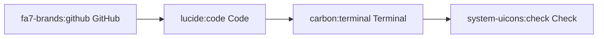

# Using Iconify Icons in Mermaid

The dockhand library supports Iconify icons in Mermaid diagrams for both HTML and terminal rendering.

## Supported Icon Packs

| Icon Pack | Description | Browse |
|-----------|-------------|--------|
| `fa7-brands` | Font Awesome 7 Brand icons | [View Icons](https://icon-sets.iconify.design/fa7-brands/) |
| `lucide` | Lucide Icons | [View Icons](https://icon-sets.iconify.design/lucide/) |
| `carbon` | IBM Carbon Design icons | [View Icons](https://icon-sets.iconify.design/carbon/) |
| `system-uicons` | System UI Icons | [View Icons](https://icon-sets.iconify.design/system-uicons/) |

## Using Icons in Diagrams

Icons can be used in node labels with the following syntax:

```text
iconpack:iconname
```

### Example Diagram



## Installation

### For Terminal Rendering (mmdc CLI)

Terminal rendering requires the mermaid CLI (`mmdc`) and icon pack npm packages installed globally:

```bash
# Install mermaid-cli and icon packs
npm install -g @mermaid-js/mermaid-cli \
  @iconify-json/fa7-brands \
  @iconify-json/lucide \
  @iconify-json/carbon \
  @iconify-json/system-uicons

# Verify installation
mmdc --version  # Should be v10.9+ with icon pack support
```

### For HTML Rendering (Browser)

No installation required. Icon packs are automatically lazy-loaded from the unpkg CDN when the diagram is rendered in the browser.

## How It Works

### HTML Rendering

When rendering Mermaid diagrams to HTML, the library automatically includes icon pack registration:

```javascript
import mermaid from 'https://cdn.jsdelivr.net/npm/mermaid@11/dist/mermaid.esm.min.mjs';
mermaid.registerIconPacks([
  { name: 'fa7-brands', loader: () => fetch('https://unpkg.com/@iconify-json/fa7-brands@1/icons.json').then(r => r.json()) },
  { name: 'lucide', loader: () => fetch('https://unpkg.com/@iconify-json/lucide@1/icons.json').then(r => r.json()) },
  { name: 'carbon', loader: () => fetch('https://unpkg.com/@iconify-json/carbon@1/icons.json').then(r => r.json()) },
  { name: 'system-uicons', loader: () => fetch('https://unpkg.com/@iconify-json/system-uicons@1/icons.json').then(r => r.json()) }
]);
mermaid.initialize({ startOnLoad: true });
```

Icon packs are loaded lazily - only when a diagram actually uses an icon from that pack.

### Terminal Rendering

Terminal rendering uses the local `mmdc` CLI tool with the `--iconPacks` flag:

```bash
mmdc -i diagram.mmd -o output.png --theme dark \
  --iconPacks @iconify-json/fa7-brands @iconify-json/lucide \
  @iconify-json/carbon @iconify-json/system-uicons
```

The library handles all temp file management and cleanup automatically.

## Troubleshooting

### "mmdc CLI not found"

Install the mermaid CLI globally:

```bash
npm install -g @mermaid-js/mermaid-cli
```

### Icons appear as placeholders

1. **Terminal**: Ensure the icon pack npm packages are installed globally
2. **HTML**: Check browser console for network errors loading icon JSON

### "mmdc execution failed"

Common causes:
- Invalid mermaid syntax in the diagram
- Missing icon pack installation
- Incorrect icon name (check the icon pack's icon list)

Run mmdc directly to see the full error message:

```bash
mmdc -i your-diagram.mmd -o output.png --theme dark
```

## References

- [Mermaid Icon Support PR #827](https://github.com/mermaid-js/mermaid-cli/pull/827)
- [Iconify Icon Sets](https://icon-sets.iconify.design/)
- [Mermaid.js Documentation](https://mermaid.js.org/)
