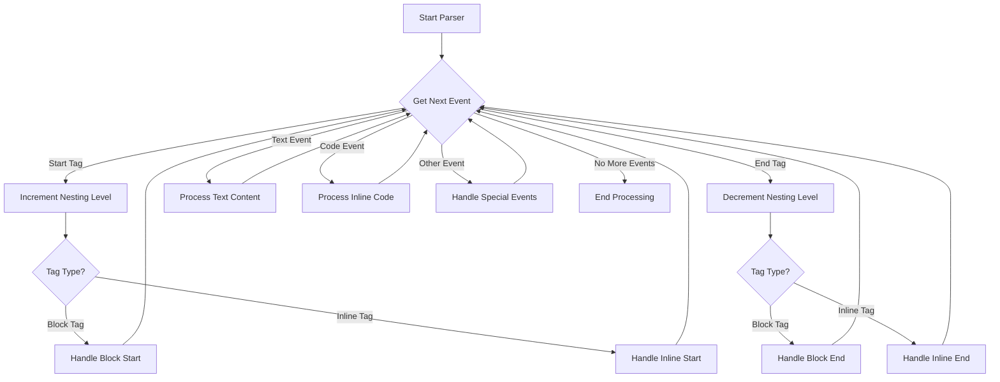

# Comprehensive Guide to `pulldown-cmark` Events

The `pulldown-cmark` crate is a pull parser for CommonMark Markdown that generates a stream of events as it traverses the document tree. Events are yielded in **preorder traversal** order, meaning parent elements emit start events before their children, and end events after all children have been processed.

This approach provides:

- **Low memory overhead**: No need to build a complete document tree in memory
- **Sequential processing**: Perfect for streaming and transformation scenarios
- **Source mapping**: Easy to track positions using offset iterators

## Block Events

Block events represent structural elements that typically contain other content. These are primarily represented by `Start(Tag)` and `End(TagEnd)` event pairs.

| Event | Description | Example Markdown |
|-------|-------------|------------------|
| `Start(Tag::Paragraph)` / `End(TagEnd::Paragraph)` | Paragraph container | `This is a paragraph.` |
| `Start(Tag::Heading { level, id, classes, attrs })` / `End(TagEnd::Heading(level))` | Heading with optional attributes (requires `ENABLE_HEADING_ATTRIBUTES`) | `# Heading` |
| `Start(Tag::BlockQuote(kind))` / `End(TagEnd::BlockQuote)` | Blockquote section; includes GFM callout types with `ENABLE_GFM` | `> Quote` |
| `Start(Tag::CodeBlock(kind))` / `End(TagEnd::CodeBlock)` | Fenced or indented code block | ` ```rust\ncode\n``` ` |
| `Start(Tag::List(number))` / `End(TagEnd::List(is_tight))` | List; `Some(n)` for ordered, `None` for unordered | `- Item` or `1. Item` |
| `Start(Tag::Item)` / `End(TagEnd::Item)` | List item within a list | `- Item 1` |
| `Start(Tag::Table(alignments))` / `End(TagEnd::Table)` | Table (requires `ENABLE_TABLES`) | `\| a \| b \|` |
| `Start(Tag::TableHead)` / `End(TagEnd::TableHead)` | Table header section | First row of table |
| `Start(Tag::TableRow)` / `End(TagEnd::TableRow)` | Table row | Each row in table body |
| `Start(Tag::TableCell)` / `End(TagEnd::TableCell)` | Table cell | Each cell in a row |
| `Start(Tag::FootnoteDefinition(label))` / `End(TagEnd::FootnoteDefinition)` | Footnote definition (requires `ENABLE_FOOTNOTES`) | `[^1]: Definition` |
| `Start(Tag::DefinitionList)` / `End(TagEnd::DefinitionList)` | Definition list | `Term\n: Definition` |
| `Start(Tag::DefinitionListTitle)` / `End(TagEnd::DefinitionListTitle)` | Definition term | `Term` |
| `Start(Tag::DefinitionListDefinition)` / `End(TagEnd::DefinitionListDefinition)` | Definition description | `: Definition` |
| `Start(Tag::HtmlBlock)` / `End(TagEnd::HtmlBlock)` | Raw HTML block | `<div>content</div>` |
| `Start(Tag::MetadataBlock(kind))` / `End(TagEnd::MetadataBlock)` | Metadata blocks like YAML frontmatter | `---\ntitle: Doc\n---` |
| `Event::Rule` | Horizontal rule (`<hr>`) | `---` |

### Block Event Examples

```rust
use pulldown_cmark::{Event, Parser, Tag, TagEnd, HeadingLevel};

let markdown = "# My Title\n\nThis is a paragraph.";
for event in Parser::new(markdown) {
    match event {
        Event::Start(Tag::Heading { level, .. }) => {
            println!("Heading level: {:?}", level); // HeadingLevel::H1
        }
        Event::Start(Tag::Paragraph) => println!("Paragraph starts"),
        Event::End(TagEnd::Paragraph) => println!("Paragraph ends"),
        Event::Text(text) => println!("Text: {}", text),
        _ => {}
    }
}
```

```rust
use pulldown_cmark::{Event, Parser, Tag, TagEnd};

let markdown = "- Item 1\n- Item 2";
for event in Parser::new(markdown) {
    match event {
        Event::Start(Tag::List(None)) => println!("Unordered list starts"),
        Event::Start(Tag::Item) => println!("List item starts"),
        Event::End(TagEnd::Item) => println!("List item ends"),
        Event::End(TagEnd::List(_)) => println!("List ends"),
        _ => {}
    }
}
```

```rust
use pulldown_cmark::{Event, Parser, Tag, Options};

let markdown = "| a | b |\n|---|---|\n| c | d |";
for event in Parser::new_ext(markdown, Options::ENABLE_TABLES) {
    match event {
        Event::Start(Tag::Table(alignments)) => {
            println!("Table with alignments: {:?}", alignments);
        }
        Event::Start(Tag::TableHead) => println!("Table header"),
        Event::Start(Tag::TableRow) => println!("Table row"),
        Event::Start(Tag::TableCell) => println!("Table cell"),
        _ => {}
    }
}
```

## Inline Events

Inline events represent text-level elements that occur within block elements.

| Event | Description | Example Markdown |
|-------|-------------|------------------|
| `Event::Text(text)` | Regular text content | `plain text` |
| `Event::Code(text)` | Inline code (backticks) | `` `code` `` |
| `Event::InlineMath(text)` | Inline math (requires `ENABLE_MATH`) | `$E=mc^2$` |
| `Event::DisplayMath(text)` | Display math (requires `ENABLE_MATH`) | `$$E=mc^2$$` |
| `Event::Html(text)` | HTML block content | `<div>block</div>` |
| `Event::InlineHtml(text)` | Inline HTML tags | `<br>`, `<span>` |
| `Event::SoftBreak` | Soft line break (typically becomes space) | Line ending |
| `Event::HardBreak` | Hard line break (two spaces or backslash at end) | `Line 1  \nLine 2` |
| `Event::FootnoteReference(label)` | Footnote reference (requires `ENABLE_FOOTNOTES`) | `[^1]` |
| `Event::TaskListMarker(checked)` | Task list checkbox (requires `ENABLE_TASKLISTS`) | `- [x]` or `- [ ]` |
| `Start(Tag::Emphasis)` / `End(TagEnd::Emphasis)` | Emphasized/italic text | `*italic*` |
| `Start(Tag::Strong)` / `End(TagEnd::Strong)` | Strong/bold text | `**bold**` |
| `Start(Tag::Strikethrough)` / `End(TagEnd::Strikethrough)` | Strikethrough (requires `ENABLE_STRIKETHROUGH`) | `~~strike~~` |
| `Start(Tag::Link { link_type, dest_url, title, id })` / `End(TagEnd::Link)` | Hyperlink | `[text](url)` |
| `Start(Tag::Image { link_type, dest_url, title, id })` / `End(TagEnd::Image)` | Image | `` |
| `Start(Tag::Subscript)` / `End(TagEnd::Subscript)` | Subscript (requires `ENABLE_SUBSCRIPT`) | `~sub~` |
| `Start(Tag::Superscript)` / `End(TagEnd::Superscript)` | Superscript (requires `ENABLE_SUPERSCRIPT`) | `^sup^` |

### Inline Event Examples

```rust
use pulldown_cmark::{Event, Parser, Tag, TagEnd};

let markdown = "*italic* and **bold**";
for event in Parser::new(markdown) {
    match event {
        Event::Start(Tag::Emphasis) => print!("<em>"),
        Event::End(TagEnd::Emphasis) => print!("</em>"),
        Event::Start(Tag::Strong) => print!("<strong>"),
        Event::End(TagEnd::Strong) => print!("</strong>"),
        Event::Text(text) => print!("{}", text),
        _ => {}
    }
}
```

```rust
use pulldown_cmark::{Event, Parser, Tag};

let markdown = "[link](https://example.com)";
for event in Parser::new(markdown) {
    match event {
        Event::Start(Tag::Link { dest_url, .. }) => {
            println!("Link to: {}", dest_url);
        }
        Event::Text(text) => println!("Link text: {}", text),
        _ => {}
    }
}
```

```rust
use pulldown_cmark::{Event, Parser, Options};

let markdown = "- [x] Completed\n- [ ] Not completed";
for event in Parser::new_ext(markdown, Options::ENABLE_TASKLISTS) {
    if let Event::TaskListMarker(checked) = event {
        println!("Task: {}", if checked { "checked" } else { "unchecked" });
    }
}
```

## Usage Patterns

### Enabling Extensions

```rust
use pulldown_cmark::{Parser, Options};

let mut options = Options::empty();
options.insert(Options::ENABLE_TABLES);
options.insert(Options::ENABLE_FOOTNOTES);
options.insert(Options::ENABLE_STRIKETHROUGH);
options.insert(Options::ENABLE_TASKLISTS);
options.insert(Options::ENABLE_MATH);
options.insert(Options::ENABLE_HEADING_ATTRIBUTES);

let parser = Parser::new_ext(markdown, options);
```

### Text Merging

Consecutive text events can occur due to parsing behavior. Use `TextMergeStream` to merge them:

```rust
use pulldown_cmark::{Parser, TextMergeStream, Event};

let parser = Parser::new(markdown);
let merged = TextMergeStream::new(parser);

for event in merged {
    if let Event::Text(text) = event {
        println!("Merged text: {}", text);
    }
}
```

### Source Mapping

Track the location of each event in the original source:

```rust
use pulldown_cmark::Parser;

let parser = Parser::new(markdown);
let offset_iter = parser.into_offset_iter();

for (event, range) in offset_iter {
    println!("Event {:?} at bytes {:?}", event, range);
}
```

### Event Transformation

Transform events using iterator methods:

```rust
use pulldown_cmark::{Event, Parser};

let parser = Parser::new(markdown);

// Convert soft breaks to hard breaks
let transformed = parser.map(|event| match event {
    Event::SoftBreak => Event::HardBreak,
    _ => event
});
```

## Processing Flow



## Summary

| Category | Event | Description |
|----------|-------|-------------|
| **Block** | `Paragraph`, `Heading`, `BlockQuote`, `CodeBlock` | Primary content containers |
| **Block** | `List`, `Item` | List structures |
| **Block** | `Table`, `TableHead`, `TableRow`, `TableCell` | Table structures |
| **Block** | `FootnoteDefinition`, `DefinitionList` | Reference structures |
| **Block** | `HtmlBlock`, `MetadataBlock`, `Rule` | Special blocks |
| **Inline** | `Text`, `Code`, `InlineMath`, `DisplayMath` | Content events |
| **Inline** | `SoftBreak`, `HardBreak` | Line breaks |
| **Inline** | `Emphasis`, `Strong`, `Strikethrough` | Text formatting |
| **Inline** | `Link`, `Image` | References |
| **Inline** | `Subscript`, `Superscript` | Positioning |
| **Inline** | `FootnoteReference`, `TaskListMarker`, `InlineHtml` | Special inline |
