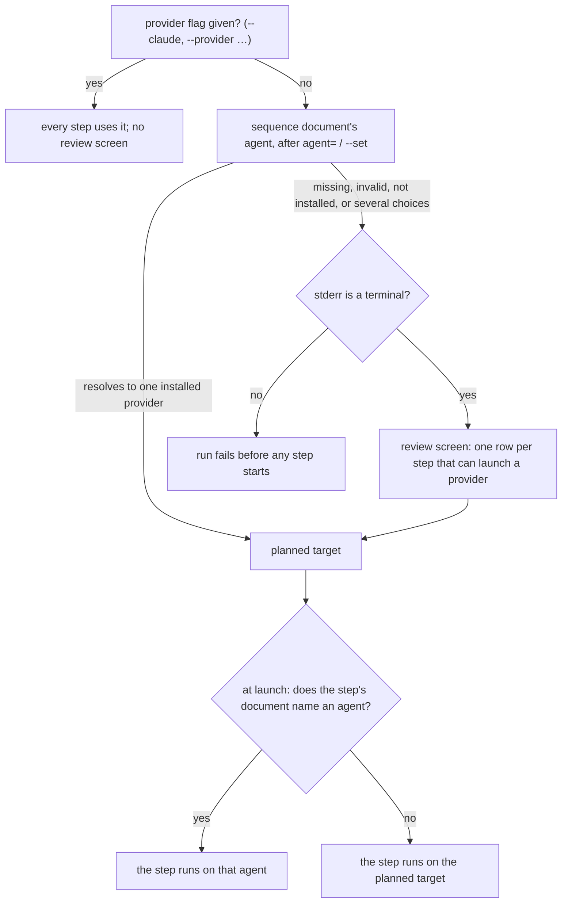

---
blast_radius:
  - claudine/cli/src/commands/sequence.rs
  - claudine/cli/src/commands/compose/mod.rs
  - claudine/cli/src/commands/compose/setters.rs
  - claudine/cli/src/commands/wrap/sequence/
  - claudine/cli/src/commands/wrap/selection_ui.rs
  - claudine/lib/src/composition/sequence/
---
# Claudine's `sequence` command

`claudine sequence` runs a document whose frontmatter has a `sequence:` list,
one step at a time. Each step composes and runs one unit of work, such as a
prompt document, a shell command, or a group of tasks. Later steps can read
what earlier steps produced.

This page covers the command: how to call it, how it chooses providers, and
its flags. How steps, tasks, state, groups, and `outputs` behave is in
[Sequences](../topics/flow-control/sequences.md).

## Usage

```bash
claudine sequence [flags] <file> [key=value ...]
```

Pass exactly **one file reference**. Any number of `key=value` setters can go
before or after it:

```bash
claudine sequence @research.md topic="async traits" retries=3
claudine sequence topic="async traits" @research.md
```

A command with setters but no file fails:

```text
Error: missing file reference: expected exactly one file reference plus optional key=value setters
```

### Setters

- A token is a setter when the part before the first `=` starts with an ASCII
  letter or `_` and contains only letters, digits, `_`, or `-`. Anything else,
  such as `foo.bar=baz` or `./x=1`, is treated as the file reference.
- The value is parsed as JSON5, and falls back to a plain string when it
  doesn't parse: `retries=3` is a number, `tags=[a,b]` is a string, and
  `tags='["a","b"]'` is an array.
- `--set '{"key": "value"}'` sets several values at once. An inline setter
  wins over `--set` for the same key.
- Setters sit above the document's frontmatter and below runtime mutations
  and the reserved per-step keys (`state`, `previous`, `next`, `outputs`,
  `sequence_id`). See
  [Phase 2 — Just-in-time composition](../topics/flow-control/sequences.md#phase-2--just-in-time-composition)
  for the full order.

## The sequence file

The file can be either of these:

- a **Markdown document** whose frontmatter has a `sequence:` key;
- a **`.yaml` / `.yml` file**, whose top-level mapping is read as frontmatter
  with no body. Every step then needs an executable, because there is no body
  for a plain step to compose.

```markdown
---
agent: claude
sequence:
    - name: research
      topic: parsing
    - name: review
      prompt: "@prompts/review.md"
      params:
          topic: "{{ state.topic }}"
    - name: stage
      shell: git add .
---
Research {{ state.topic }} and write up what you find.
```

The `research` step has no executable, so it composes this document's body.
`review` composes `prompts/review.md` with `topic` set, and `stage` runs a
shell command. The step fields, the ways to supply a list (`sources`), and
groups are covered in [Sequences](../topics/flow-control/sequences.md).

## Choosing providers

A provider is chosen twice: once for the whole run before any step starts,
and again for each step when it launches.



**Before the run**, the sequence plans a target from the sequence
document's own `agent` and `model`:

- `--claude`, `--codex`, …, or `--provider <name>` sets the provider for
  every step and skips everything below. `--model` does the same for the
  model.
- Otherwise the sequence document's `agent` is used. An `agent=…` setter or
  `--set '{"agent": …}'` replaces it.
- If that doesn't settle on one installed provider, for example when the
  document has no `agent`, a terminal gets the **review screen** described
  below. Without a terminal, the run fails before any step starts, even
  when no step would get a row.

**At launch**, a step that runs a prompt document uses that document's own
`agent` if it has one. That value can come from the prompt's frontmatter or
from the step's `params`, and a caller setter overrides both. The planned
target is only the fallback for a step whose document names no agent.

```yaml
agent: claude                  # plans the run; also runs body steps
sequence:
    - name: review
      prompt: "@prompts/review.md"
      params: { agent: codex } # this step runs on Codex
    - name: commit
      prompt: "@prompts/commit.md"   # declares agent: opencode, so it runs on OpenCode
```

That split has some surprising effects:

- **A sequence document with no `agent` stops the run** (review screen or
  error), even when every step names its own provider. Give the sequence
  document an `agent` of its own to avoid this.
- **A review-screen choice is ignored** for a step whose document names an
  agent. It takes effect only for steps that name none.
- **An `agent=` setter overrides every step**, because caller setters outrank
  `params` and the prompt's frontmatter.
- **The step's status line reports the planned target**, not the provider
  that launched, so a step that ran on Codex can print
  `succeeded (via Claude)`. The same goes for `{{ env.AGENT }}` and
  `{{ env.MODEL }}` inside the composed prompt. The provider's own process
  gets the correct `AGENT` and `MODEL`.
- **A step naming a provider that isn't installed fails at its turn**, after
  earlier steps have already run.

### The review screen

The review screen is a table with a provider picker and a model picker for
each step that can launch a provider, all starting on the same default.
Whether a step gets a row depends only on the kind of step, read from the
sequence document; nothing is composed or run to decide it:

| Step | Row? | What the row's choice sets |
| :--- | :--- | :--- |
| `prompt` | Yes | The fallback target for the prompt document |
| `task` | Yes | The fallback target for the task |
| `group` | Yes | The fallback target for the whole group; its tasks get no rows of their own |
| no executable (runs the sequence body) | Yes | The target for the body |
| `shell` | No | Nothing; the step launches no provider |
| `side_effect` | No | Nothing; the step launches no provider |

A `task` or `group` gets a row even when the work it points to turns out to
be only shell commands.

Each row is labeled with the step's position in the whole sequence and its
name, so hidden steps leave gaps in the numbering:

```yaml
sequence:
    - name: implement
      prompt: "@prompts/implement.md"   # row "1 implement"
    - name: stage
      shell: git add .                  # no row
    - name: review
      prompt: "@prompts/review.md"      # row "3 review"
```

A choice on row `3 review` applies to the third step and nothing else,
even when two steps share a name. Steps without a row keep the default the
screen started from.

- `Ctrl+S` accepts every row and starts the run.
- `Esc` or Ctrl+C leaves the screen, starts no step, and exits `130`.
- When no step would get a row (every step is `shell` or `side_effect`), the
  screen doesn't open, the note explaining why a choice was needed (such
  as `Invalid Agent:`) isn't printed, and the run starts on the default.
  The rule above that a headless run without a provider fails still applies
  first.
- Shell commands are approved before the screen opens, and `--dry-run` never
  opens it.

## Fail-fast and exit codes

A failing step stops the run when fail-fast is on. The setting comes from, in
order: `--fail-fast <bool>` (`true`/`false`, `1`/`0`, `yes`/`no`), the
document's `fail_fast`, and then the default, `true`.

The exit code is `0` when every executed step succeeded, `1` when at least one
failed, and `130` after Ctrl+C, including `Esc` or Ctrl+C on the review
screen, which starts no step. A preflight failure aborts the run whatever
the fail-fast setting. See
[Fail-fast, exit codes, and dry-run](../topics/flow-control/sequences.md#fail-fast-exit-codes-and-dry-run).

## Interactive sessions

A sequence document may not set `interactive: true`. A run is serial
automation, and a document-level default would be ambiguous across steps, so
`interactive: true` is a hard error. `interactive: false`, `null`, or no key
at all is fine.

To run the steps interactively anyway, pass `--interactive` (`-i`).
`--timeout` and `--step-timeout` cannot be combined with it.

## Environment of each step

Each step's provider session gets these variables:

| Variable | Value |
|---|---|
| `CLAUDINE_FAIL_FAST` | the effective fail-fast setting |
| `AGENT` | the provider that launched, such as `codex` |
| `MODEL` | the model that launched, when one was chosen |
| `YOLO` | `true` when `--yolo` is set |
| `OPERATION` | the step's `operation`, or `--operation` |

## Dry run

`--dry-run` runs the full preflight and then composes every step against the
starting state, without launching a provider. **Shell work still runs**:
`$( … )` expansions and `shell:` steps execute for real, so a dry run of a
sequence with `shell: git commit …` will commit.

## Flags

Flags specific to `sequence`:

| Flag | Effect |
|---|---|
| `--fail-fast <BOOL>` | overrides the document's `fail_fast` |
| `--budget-ledger <PATH>` | enforces one shared invocation and active-time budget across every agent launch, retry, and wait in the run; see [Shared execution budgets](budget.md) |

Flags shared with `compose`:

| Group | Flags |
|---|---|
| Provider | `--claude`, `--codex`, `--gemini`, `--goose`, `--kimi`, `--opencode`, `--qwen`, `--provider <NAME>`, `--exclude <PROVIDER>`, `-m`/`--model <MODEL>` |
| Session | `-y`/`--yolo` (the provider's auto-approval mode, also set by `CLAUDINE_YOLO`), `-i`/`--interactive`, `--no-interactive`, `--sandbox`, `--include <ENV_NAME>` |
| Timeouts | `-t`/`--timeout <DURATION>`, `--step-timeout <DURATION>`, `--stall-timeout <DURATION>` |
| Resources | `--mcp`, `--use <ID,…>`, `--strict`, `--repo` |
| System prompt | `--append-system-prompt`/`--asp <FILE>`, `--replace-system-prompt`/`--rsp <FILE>` |
| Output | `-o`/`--output <FORMAT>`, `-q`/`--quiet`, `--silent`, `--perf` |
| Values | `--set <JSON>`, `--operation`/`--op <OP>` |
| Rehearsal | `--dry-run` |

`-y` is `--yolo`, not "answer yes". It turns on each provider's own
auto-approval mode, and it approves every shell command during preflight
without prompting. Blocked commands are still refused. It does not skip the
provider review screen.

## Performance report

`--perf` prints one combined report after the sequence summary:

- **CLI Overhead**: startup timings captured when the sequence starts.
- **Composition Report**: merged across every step that composed a document.
- **Agent Execution**: total launches and time, with first-response latency
  averaged across steps. The note line gives both the average and the
  minimum latency.

An interrupted run, or one stopped by fail-fast, still prints the report,
with a `partial sequence metrics` note. `--perf` overrides `--quiet` and
`--silent`.
