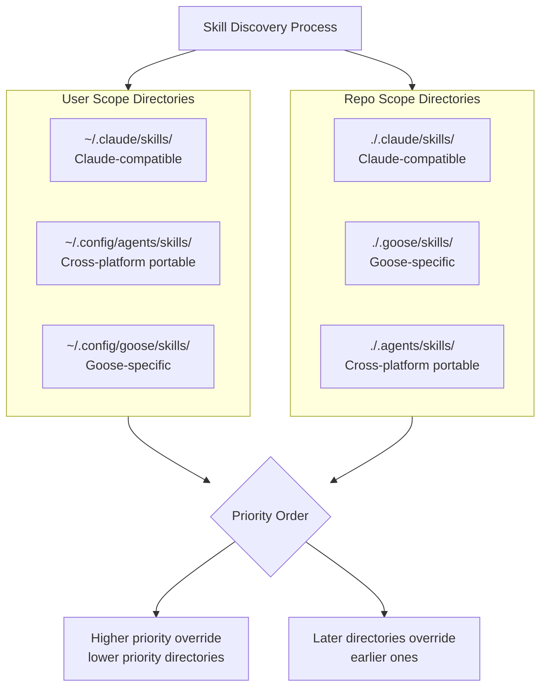
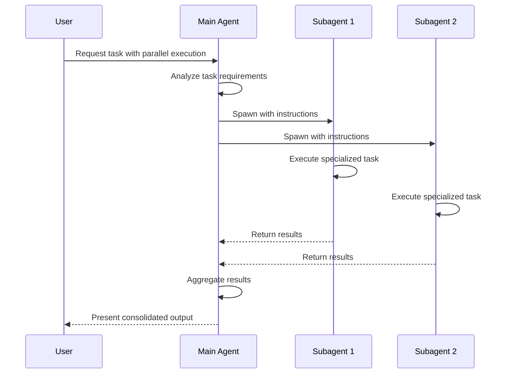

Certainly! I will provide a deep dive into Goose Agentic CLI's support for slash commands, skills, and agents/subagents. The main contents of the report are as follows:

- **Directory Structure Conventions**: Covers user and repo scope directories for skills, slash commands, and agents.
- **Metadata Specifications**: Details required/optional metadata fields for each document type.
- **Script Storage Recommendations**: Provides guidance on executable file organization.
- **Built-in Slash Commands**: Lists default commands and their purposes.
- **Comparison with Claude Code**: Analyzes differences in skills and slash commands.
- **Gotchas and Mitigations**: Addresses common issues and solutions.
- **Subagent Interaction Model**: Explains orchestration patterns and concurrency.
- **Best Practices**: Offers recommendations for optimal subagent usage.

-------

# Comprehensive Deep Dive into Goose Agentic CLI: Slash Commands, Skills, and Agents/Subagents

## 📋 1. Directory Structure Conventions

Goose Agentic CLI implements a **hierarchical discovery system** for skills, slash commands, and agents across both user-scope (global) and repository-scope (local) directories. This structure enables both personal workflows across projects and project-specific customizations.

### 1.1 Skills Directory Structure

Skills in Goose follow the **Agent Skills open standard** originally developed by Anthropic, which uses a simple directory-based approach with a mandatory `SKILL.md` file. The discovery process checks directories in a specific order, with later directories overriding earlier ones if skill names conflict【turn0search0】.



**Recommended Skill Structure**:

```
skill-name/
├── SKILL.md              # Required: Main instructions with YAML frontmatter
├── scripts/              # Optional: Executable code or utilities
├── references/           # Optional: Supporting documentation
├── assets/               # Optional: Templates, images, data files
└── tests/                # Optional: Skill validation tests
```

### 1.2 Slash Commands Directory Structure

Goose stores custom slash commands in a similar hierarchical system, though with **different base directories**. Commands are typically stored as executable files or configuration files in specific locations:

- **User Scope**:
    - `~/.config/goose/commands/` - Goose-specific commands
    - `~/.config/agents/commands/` - Cross-platform portable commands

- **Repository Scope**:
    - `./.goose/commands/` - Project-specific commands
    - `./.agents/commands/` - Cross-platform portable commands

### 1.3 Agents/Subagents Directory Structure

Subagents are typically defined through **recipe files** (YAML format) rather than traditional directory structures. Recipe files follow a specific naming convention and placement:

- **User Scope**:
    - `~/.config/goose/recipes/` - Personal recipe library
    - Environment variable: `GOOSE_RECIPE_PATH` can be set to custom directories

- **Repository Scope**:
    - `./recipes/` - Project-specific recipes
    - `./.goose/recipes/` - Alternative project location

*Table: Directory Priority Order for Discovery*

| **Scope** | **Directory** | **Priority** | **Purpose** |
|-----------|---------------|--------------|-------------|
| **User** | `~/.claude/skills/` | 1 (lowest) | Claude-compatible skills |
| **User** | `~/.config/agents/skills/` | 2 | Cross-platform skills |
| **User** | `~/.config/goose/skills/` | 3 | Goose-specific skills |
| **Repo** | `./.claude/skills/` | 4 | Claude-compatible project skills |
| **Repo** | `./.goose/skills/` | 5 | Goose-specific project skills |
| **Repo** | `./.agents/skills/` | 6 (highest) | Cross-platform project skills |

## 📝 2. Metadata Specifications

### 2.1 Skill Document Metadata

Every `SKILL.md` file must contain **YAML frontmatter** with specific required and optional fields. This metadata enables Goose's discovery system and determines when a skill is activated【turn0search6】.

**Required Frontmatter Fields**:

```yaml
---
name: skill-name                    # 1-64 chars, lowercase alphanumeric + hyphens
description: What this skill does and when to use it  # 1-1024 chars
---
```

**Optional Frontmatter Fields**:

```yaml
---
license: Apache-2.0                 # License name or reference
metadata:                           # Key-value pairs for custom properties
  author: your-name
  version: "1.0"
  tags: [deployment, code-review]
compatibility: Requires python>=3.8, pdfplumber  # Environment requirements
allowed-tools: Bash(python:*) Read  # Pre-approved tools (experimental)
---
```

**Field Specifications**:

| **Field** | **Required** | **Rules** | **Example** |
|-----------|--------------|-----------|-------------|
| `name` | Yes | 1-64 chars, lowercase alphanumeric + hyphens, no consecutive hyphens, must match directory name | `pdf-processing` |
| `description` | Yes | 1-1024 chars, must describe WHAT it does AND WHEN to use it | `Extract text and tables from PDF files. Use when working with PDF files or when the user mentions PDFs` |
| `license` | No | License name or reference to bundled file | `MIT` |
| `metadata` | No | Key-value pairs for custom properties | `version: "1.0"` |
| `compatibility` | No | 1-500 chars, environment requirements | `Requires python>=3.8, pdfplumber` |
| `allowed-tools` | No | Space-delimited list of pre-approved tools | `Bash(python:*) Read` |

**Name Field Rules**:

- **Valid names**: `pdf-processing`, `data-analysis`, `code-review`, `my-skill-v2`
- **Invalid names**: `PDF-Processing` (uppercase), `-pdf-processing` (starts with hyphen), `pdf--processing` (consecutive hyphens), `pdf_processing` (underscores)

### 2.2 Slash Command Document Metadata

Slash commands in Goose are typically implemented as **executable scripts** or **MCP tools** rather than markdown files. The metadata is derived from the command's implementation:

**For Executable Scripts**:

- **Shebang line**: Specifies the interpreter (e.g., `#!/usr/bin/env python3`)
- **Help documentation**: Embedded comments or separate documentation files
- **Command registration**: Through Goose's configuration system

**For MCP-based Commands**:

- **Tool definition**: Includes name, description, and input schema
- **Extension configuration**: Through `goose configure` or config files

```yaml
# Example MCP tool definition for slash command
tools:
  - name: deploy
    description: "Deploy application to staging environment"
    inputSchema:
      type: object
      properties:
        environment:
          type: string
          enum: [staging, production]
          description: "Target deployment environment"
      required: [environment]
```

### 2.3 Agent/Subagent Document Metadata

Subagents are defined through **recipe files** with comprehensive metadata:

**Required Recipe Fields**:

```yaml
id: subagent-id                    # Unique identifier
version: 1.0.0                     # Semantic version
title: "Human Readable Title"      # Display name
description: "What this subagent does"
```

**Optional Recipe Fields**:

```yaml
instructions: |                    # Detailed instructions for subagent
  You are a specialized assistant for...
activities:                        # High-level activity descriptions
  - Analyze code structure
  - Check for security issues
extensions:                        # Extension configurations
  - type: builtin
    name: developer
    timeout: 300
parameters:                        # Input parameter definitions
  - key: focus_area
    input_type: string
    requirement: optional
    description: "Specific area to focus on"
```

*Table: Metadata Comparison Across Document Types*

| **Metadata Field** | **Skills** | **Slash Commands** | **Subagents** |
|--------------------|------------|--------------------|---------------|
| **Name/ID** | Required (`name`) | Derived from executable/tool name | Required (`id`) |
| **Description** | Required | From help text/tool definition | Required |
| **Version** | Optional (`metadata.version`) | Not typically used | Required (`version`) |
| **Author/License** | Optional | Optional | Optional |
| **Compatibility** | Optional | From environment requirements | From extension requirements |
| **Parameters** | Not applicable | Command-line arguments | Defined in `parameters` |
| **Extensions** | Not applicable | MCP tool definitions | Defined in `extensions` |

## 📂 3. Script Storage Recommendations

Goose provides specific guidance on where to store **executable scripts** and supporting files for skills and commands:

### 3.1 Skill-Related Scripts

**Scripts Directory Within Skills**:

- **Location**: `skill-name/scripts/`
- **Purpose**: Store executable code, utilities, or helper scripts referenced by the skill
- **Example**: A deployment skill might include scripts for health checks, rollback procedures, etc.

```bash
# Example skill structure with scripts
deployment-skill/
├── SKILL.md
└── scripts/
    ├── health-check.sh
    ├── rollback.sh
    └── notify.py
```

### 3.2 Global Script Locations

For **reusable scripts** across multiple skills or commands:

- **User scripts**: `~/.config/goose/scripts/`
- **Project scripts**: `./.goose/scripts/` or `./scripts/`
- **Environment variables**: Can be referenced in skills using `{{SCRIPT_DIR}}`

### 3.3 Slash Command Executables

Custom slash commands should be stored in:

- **User commands**: `~/.config/goose/commands/`
- **Project commands**: `./.goose/commands/`
- **System PATH**: For globally available commands

**Best Practices**:

- **Make scripts executable**: `chmod +x script.sh`
- **Use shebang lines**: Specify interpreter (`#!/usr/bin/env python3`)
- **Include help documentation**: Add comments or separate `.md` files
- **Organize by purpose**: Group related scripts in subdirectories

## ⚙️ 4. Built-in Slash Commands

Goose includes several **built-in slash commands** that provide essential functionality during sessions. These are available without additional configuration【turn0search9】.

| **Command** | **Description** | **Usage Example** |
|-------------|-----------------|------------------|
| `/prompts` | List all available prompts in current session | `/prompts` |
| `/prompt` | Use a specific prompt by name | `/prompt code-review` |
| `/compact` | Compact conversation history to reduce token usage | `/compact` |
| `/clear` | Clear entire conversation history | `/clear` |
| `/session` | Start or resume interactive chat sessions | `goose session` |
| `/configure` | Configure goose settings | `goose configure` |
| `/info` | Show goose information including version and config | `goose info` |
| `/update` | Update goose to newer version | `goose update` |
| `/completion` | Generate shell completion scripts | `goose completion bash` |

**Extension-Related Commands**:

- `/extension` - Manage extensions (list, enable, disable)
- `/mcp` - Configure MCP servers and tools
- `/recipe` - Execute or manage recipes

**Session Management Commands**:

- `/fork` - Create a new duplicate session with copied history
- `/resume` - Resume a previous session by ID
- `/name` - Give a human-readable name to current session

## 🔍 5. Comparison with Anthropic/Claude Code's Skills and Slash Commands

### 5.1 Skills Comparison

**Similarities**:

- Both use the **Agent Skills open standard** with `SKILL.md` files and YAML frontmatter【turn0search7】
- Both implement **hierarchical discovery** across global and project directories
- Both support **progressive disclosure** (discovery → activation → full loading)【turn0search6】
- Both allow **cross-skill references** using `[See: skill-name]` notation【turn0search7】

**Key Differences**:

| **Aspect** | **Goose** | **Claude Code** |
|------------|-----------|-----------------|
| **Primary Use Case** | Workflow automation and task execution | Knowledge reference and guidance |
| **Activation Model** | Automatic activation based on description matching | Manual activation through explicit commands |
| **Integration** | Tightly integrated with recipes and subagents | Primarily standalone knowledge units |
| **Execution Model** | Can execute code and run commands | Focus on informational guidance |
| **Tool Access** | Direct access to extensions and MCP tools | Limited tool access through Claude Code's capabilities |

**Important Gotchas and Mitigations**:

- **Gotcha**: **Description sensitivity** - Goose's automatic activation relies heavily on the `description` field, making it more sensitive to vague descriptions than Claude Code.
    - **Mitigation**: Follow the `<what it does>. Use when <specific triggers>` format with concrete examples and trigger words【turn0search6】

- **Gotcha**: **Token budget differences** - Goose may load skills more aggressively, potentially exceeding token limits faster than Claude Code.
    - **Mitigation**: Keep `SKILL.md` under 500 lines and move detailed content to reference files【turn0search6】

- **Gotcha**: **Tool execution expectations** - Goose skills can execute code, while Claude Code skills are primarily informational.
    - **Mitigation**: Clearly document which skills include executable code and which are informational-only

- **Gotcha**: **Recipe interaction** - Goose skills can be integrated with recipes in ways not possible in Claude Code.
    - **Mitigation**: Design skills to work both standalone and within recipe contexts

### 5.2 Slash Commands Comparison

**Similarities**:

- Both use **command-line interfaces** for interaction
- Both support **parameter passing** and options
- Both implement **help systems** and documentation

**Key Differences**:

| **Aspect** | **Goose** | **Claude Code** |
|------------|-----------|-----------------|
| **Command Registration** | Through MCP servers and configuration | Through Claude Code's command system |
| **Extensibility** | Highly extensible through MCP | More limited extension model |
| **Integration with Skills** | Tight integration with skills and recipes | Less integrated with skills |
| **Custom Commands** | Full support for custom commands via MCP | Limited support for custom commands |
| **Permission Model** | Configurable permission modes | More restrictive permission model |

**Important Gotchas and Mitigations**:

- **Gotcha**: **Command discovery differences** - Goose's slash commands are discovered through MCP servers, while Claude Code's are built-in.
    - **Mitigation**: Use `goose configure` to properly register MCP-based commands and ensure they're discoverable

- **Gotcha**: **Parameter handling variations** - Goose commands may use different parameter naming conventions than Claude Code.
    - **Mitigation**: Follow Goose's flag naming conventions (`--session-id`, `-n, --name`, etc.)【turn0search1】

- **Gotcha**: **Permission requirements** - Goose's autonomous mode may execute commands without approval, unlike Claude Code.
    - **Mitigation**: Use permission modes (manual, smart approval) for sensitive operations【turn0search10】

- **Gotcha**: **Output format differences** - Goose commands may return structured output differently than Claude Code.
    - **Mitigation**: Use the `-f, --format` option to specify desired output format (JSON, Markdown, etc.)【turn0search1】

## 🤖 6. Agents/Subagents Support

Goose provides **robust support for subagents** with a flexible interaction model between orchestrators and subagents. This enables parallel task execution, specialized processing, and context isolation.

### 6.1 Subagent Interaction Model

The interaction model follows a **hierarchical delegation pattern** where the main orchestrator spawns and manages subagent instances:



**Autonomous Subagent Creation**:

- Goose can **autonomously decide** to use subagents when beneficial
- Requires **autonomous permission mode** (default)
- Disabled in manual approval, smart approval, and chat-only modes【turn0search19】

**Explicit Subagent Creation**:

- Users can **explicitly request** subagents through natural language
- Examples:
    - "Use a code reviewer to analyze this function for security issues"
    - "Create three HTML templates in parallel"
    - "Research quantum computing developments and summarize findings"

### 6.2 Internal vs. External Subagents

**Internal Subagents**:

- Spawn **Goose instances** using current session's context and extensions
- Configured through **direct prompts** or **recipe files**
- Faster startup and lower overhead

**External Subagents**:

- Independent processes with separate configurations
- Useful for **strict isolation** or **different permission models**
- Higher overhead but greater separation

### 6.3 Concurrency Models

Goose supports **two primary concurrency patterns** for subagent execution:

| **Pattern** | **Description** | **Trigger Keywords** | **Example** |
|-------------|-----------------|---------------------|-------------|
| **Sequential** | Tasks execute one after another | "first...then", "after", "then" | "First analyze the code, then generate documentation" |
| **Parallel** | Tasks execute simultaneously | "parallel", "simultaneously", "at the same time", "concurrently" | "Create three HTML templates in parallel" |

**Hybrid Approaches**:

- Can mix sequential and parallel execution in complex workflows
- Example: "First run these two subagents in parallel, then process their results with a third subagent"

**Failure Handling**:

- **Sequential execution**: Stops on first failure
- **Parallel execution**: Continues with successful tasks; failed tasks return no output
- **Timeout**: Default 5-minute timeout per subagent; configurable

## 🚀 7. Best Practices for Subagent Usage

### 7.1 Subagent Design Patterns

**1. Specialized Processing**:

- Create subagents for **specific domains** (security, performance, documentation)
- Use **recipes** to define specialized instructions and extension access
- Example: Code reviewer subagent with only developer extension【turn0search19】

**2. Parallel Task Execution**:

- Use for **embarrassingly parallel** tasks (generating multiple files, testing different scenarios)
- Implement **result aggregation** in orchestrator
- Consider **timeout handling** for long-running tasks

**3. Hierarchical Delegation**:

- Create **multi-level subagent hierarchies** for complex workflows
- Use **sub-recipes** to define reusable subagent configurations
- Example: Orchestrator → Research subagents → Analysis subagents

### 7.2 Concurrency Best Practices

**1. Task Granularity**:

- **Balance granularity** between too many small tasks (overhead) and too few large tasks (limited parallelism)
- Ideal task size: **10-30 seconds** of execution time
- Monitor execution times to optimize task sizing

**2. Resource Management**:

- Be aware of **rate limits** on external APIs and services
- Implement **backoff strategies** for failed tasks
- Consider **caching** results for expensive operations

**3. Error Handling**:

- Design **fault-tolerant workflows** that can handle partial failures
- Implement **retry logic** for transient failures
- Use **circuit breakers** for consistently failing tasks

**4. Result Aggregation**:

- Design **clear aggregation strategies** before spawning subagents
- Consider **intermediate results** for long-running workflows
- Implement **progress reporting** for user feedback

### 7.3 Permission and Security Considerations

**1. Permission Modes**:

- Use **autonomous mode** for trusted environments
- Use **manual approval** for sensitive operations
- Use **smart approval** for balanced approach (approve per extension/tool)

**2. Extension Access**:

- **Restrict extension access** for subagents when possible
- Use **recipe configurations** to limit tool access
- Example: Create subagent with only developer extension for code refactoring【turn0search19】

**3. Data Isolation**:

- Use **separate working directories** for file operations
- Implement **proper cleanup** for temporary files
- Consider **sand boxing** for untrusted code execution

### 4. Monitoring and Debugging

**1. Execution Tracking**:

- Use **structured logging** for subagent execution
- Monitor **execution times** and resource usage
- Track **success/failure rates** for optimization

**2. Debugging**:

- Use **verbose mode** (`-v, --verbose`) for detailed execution information【turn0search1】
- Implement **checkpointing** for long-running workflows
- Use **session names** for better organization and tracking

**3. Performance Optimization**:

- Profile subagent execution to identify bottlenecks
- Consider **caching strategies** for expensive operations
- Optimize **context passing** between orchestrator and subagents

## 📊 8. Comparison Summary and Quick Reference

*Table: Goose vs. Claude Code Feature Comparison*

| **Feature** | **Goose** | **Claude Code** |
|-------------|-----------|-----------------|
| **Skills Standard** | Agent Skills open standard | Agent Skills open standard |
| **Skill Activation** | Automatic based on description | Manual through commands |
| **Recipe Support** | Native support with parameter passing | Limited support |
| **Subagents** | Full support with parallel execution | Limited support |
| **Slash Commands** | Built-in + MCP-extensible | Built-in only |
| **Permission Models** | Autonomous, manual, smart approval, chat-only | More restrictive |
| **MCP Integration** | Native MCP server support | Through Claude Code |
| **CLI First** | Yes (primary interface) | No (GUI first) |
| **Cross-platform** | Yes (Linux, macOS, Windows) | Yes (through Electron) |

*Table: Metadata Quick Reference*

| **Document Type** | **Required Metadata** | **Optional Metadata** | **Key Fields** |
|------------------|------------------------|-----------------------|----------------|
| **Skills** | `name`, `description` | `license`, `metadata`, `compatibility`, `allowed-tools` | `name` (1-64 chars, lowercase, hyphens) |
| **Slash Commands** | None (from implementation) | Help text, parameter definitions | Command name, description |
| **Subagents** | `id`, `version`, `title`, `description` | `instructions`, `activities`, `extensions`, `parameters` | `id` (unique identifier), `version` (semantic versioning) |

## ✅ 9. Conclusion and Recommendations

Goose Agentic CLI provides a **comprehensive and flexible system** for managing skills, slash commands, and subagents that goes beyond simple code assistance to enable full workflow automation. Its key strengths include:

1. **Standards-based approach** - Using the Agent Skills open standard ensures compatibility and portability across different AI coding agents【turn0search7】

2. **Hierarchical discovery** - The well-designed directory structure enables both personal and project-specific customizations with clear priority rules

3. **Robust subagent system** - Support for parallel execution, specialized processing, and hierarchical delegation enables complex automation workflows

4. **Extensible architecture** - Integration with MCP servers and a rich extension ecosystem provides almost limitless capabilities

**Recommendations for Developers**:

- **Start with skills** - Begin by creating skills for repetitive workflows and specialized knowledge domains
- **Leverage recipes** - Use recipes to parameterize and reuse common subagent configurations
- **Design for automation** - Think beyond single-use prompts to create reusable, composable automation components
- **Plan for concurrency** - Design workflows that can take advantage of parallel subagent execution where appropriate
- **Monitor and iterate** - Use Goose's logging and session management to optimize your workflows over time

The primary differences from Claude Code—automatic skill activation, native subagent support, and deeper CLI integration—make Goose particularly well-suited for **automation-focused workflows** and **development environments** where reproducibility and scalability are important. By following the conventions and best practices outlined in this deep dive, developers can create powerful, reusable AI automation systems that significantly boost productivity.
