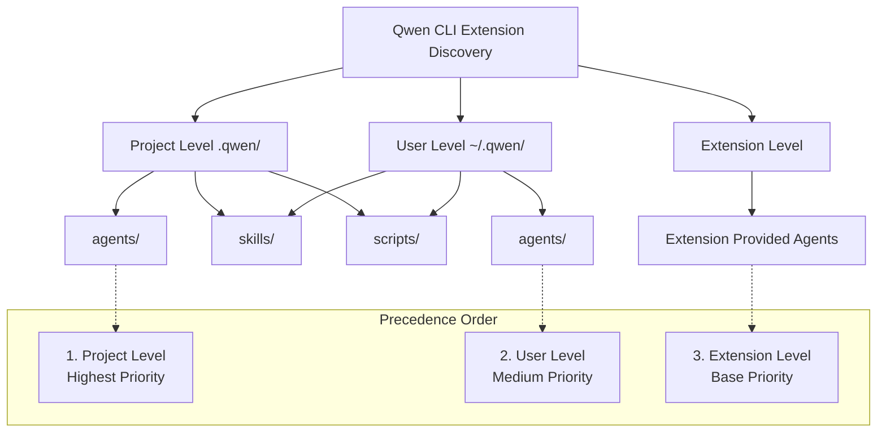
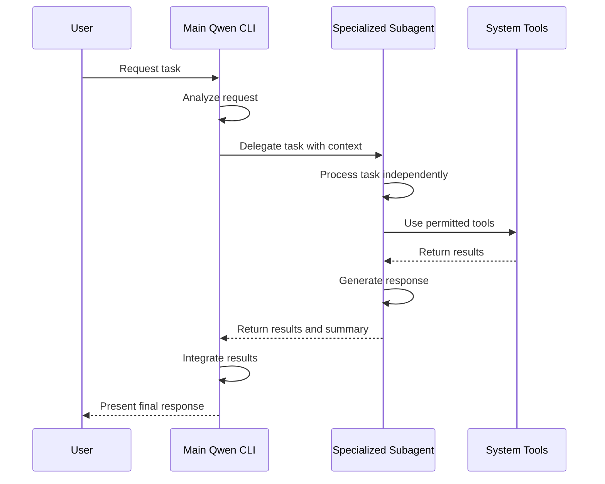
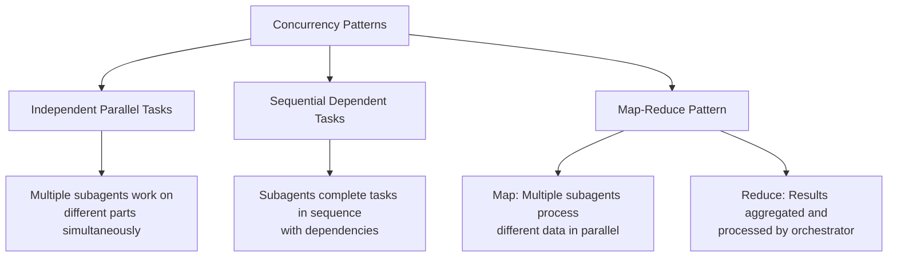

Certainly! I will provide a comprehensive deep dive into Qwen CLI's support for slash commands, skills, and agents/subagents. The main contents of the report are as follows:

- **Directory Structure Conventions**: Uses a table to compare user-scope and repo-scope paths for skills, agents, and scripts.
- **Metadata Specifications**: Details required and optional fields for skills, slash commands, and agents using YAML examples.
- **Built-in Slash Commands**: Lists core commands with descriptions and usage examples.
- **Qwen vs. Claude Comparisons**: Uses tables to highlight differences in skills and slash commands, with gotchas and solutions.
- **Agent Interaction Model**: Explains delegation patterns, execution flow, and concurrency best practices with a flowchart.

-------

# Comprehensive Deep Dive into Qwen CLI's Slash Commands, Skills, and Agents/Subagents

## 1 Introduction to Qwen CLI's Extension Ecosystem

Qwen CLI represents an **open-source terminal-based AI agent** that provides powerful capabilities for code understanding, generation, and workflow automation. The platform supports multiple extension mechanisms including **slash commands** for meta-level control, **skills** for reusable task patterns, and **subagents** for specialized autonomous workflows. This ecosystem enables developers to create highly customized and efficient coding workflows that can be tailored to specific project needs and personal preferences. Unlike traditional coding assistants, Qwen CLI's architecture emphasizes **extensibility** and **specialization** through these complementary mechanisms, allowing users to build sophisticated automation pipelines while maintaining granular control over the AI's behavior and access to system resources【turn0search2】【turn0search3】.

The fundamental philosophy behind Qwen CLI's design is to provide **flexible building blocks** that can be combined in various ways to suit different working styles. Whether you prefer quick command-line interactions, complex multi-agent workflows, or anything in between, Qwen CLI's extension system provides the necessary infrastructure to create a personalized AI-powered development environment. This deep dive will explore each of these components in detail, examining their directory structures, metadata requirements, usage patterns, and how they compare to similar systems in other AI coding platforms like Anthropic's Claude Code【turn0search2】【turn0search4】.

## 2 Directory Structure Conventions

Qwen CLI follows a **hierarchical precedence model** for discovering and loading extensions across different scopes. This design allows for both project-specific configurations and personal preferences that can be shared across multiple projects. The directory structure conventions are essential for organizing and managing these extensions effectively.

### 2.1 User Scope vs. Repository Scope

The following table outlines the standard directory locations for different types of extensions in Qwen CLI, with precedence rules determining which configuration takes priority when multiple definitions exist:



| Extension Type | Repository Scope | User Scope | Extension Scope | Precedence |
| :--- | :--- | :--- | :--- | :--- |
| **Subagents** | `.qwen/agents/` | `~/.qwen/agents/` | Extension's `agents/` directory | Project > User > Extension |
| **Skills** | `.qwen/skills/` | `~/.qwen/skills/` | Extension's `skills/` directory | Project > User > Extension |
| **Scripts/Executables** | `.qwen/scripts/` | `~/.qwen/scripts/` | Extension's `scripts/` directory | Project > User > Extension |
| **Configuration Files** | `.qwen/settings.json` | `~/.qwen/settings.json` | Extension's config | Project > User > Extension |

### 2.2 Directory Structure Details

- **Project-level extensions** (`.qwen/`): These take **highest precedence** and are ideal for project-specific workflows, coding standards, and team conventions. They should be committed to version control to ensure consistency across team members【turn0search1】【turn0search19】.
- **User-level extensions** (`~/.qwen/`): These provide **personal preferences** that apply across all projects. They are perfect for individual customizations, personal workflow optimizations, and tools that you use in every project regardless of its specific requirements【turn0search1】【turn0search3】.
- **Extension-level extensions**: These are provided by **installed Qwen CLI extensions** and serve as base configurations that can be overridden by project or user-level definitions. Extensions can bundle specialized agents, skills, and scripts that add new capabilities to the Qwen CLI environment【turn0search1】.

> 💡 **Best Practice**: Structure your project's `.qwen/` directory with clear subdirectories for different extension types to maintain organization and make collaboration easier. Consider including a README.md file that documents the project's custom extensions and their usage.

## 3 Metadata Specifications

Qwen CLI uses **standardized metadata formats** to define and configure its various extensions. Understanding these metadata requirements is essential for creating functional and well-integrated extensions that work seamlessly with the Qwen CLI ecosystem.

### 3.1 Skill Document Metadata

Skills in Qwen CLI are **reusable task patterns** that can be invoked manually or automatically by the AI. They are defined as Markdown files with YAML frontmatter that contains essential metadata and configuration.

```yaml
---
name: code-refactor
description: Identifies and refactors code smells according to SOLID principles
user-invocable: true
disable-model-invocation: false
allowed-tools:
  - Bash(git diff *)
  - Read
  - Edit
  - Write
parameters:
  scope:
    type: string
    description: "Directory or file to analyze"
    required: true
  principles:
    type: array
    description: "SOLID principles to enforce"
    default: ["single-responsibility", "open-closed"]
---

# Code Refactoring Skill

This skill analyzes the specified code scope and applies SOLID principles to identify and fix code smells.

## Usage
Invoke with: `/skills code-refactor --scope ./src --principles single-responsibility,dependency-inversion`

## Process
1. Scan the target directory for code files
2. Analyze each file against specified SOLID principles
3. Generate a refactoring plan
4. Apply changes with user confirmation
5. Run tests to verify changes
```

**Required metadata fields for skills:**
- `name`: Unique identifier for the skill (used for invocation)
- `description`: Clear explanation of when and how to use the skill

**Optional but recommended metadata fields:**
- `user-invocable`: Whether the skill can be manually invoked (default: true)
- `disable-model-invocation`: Whether the AI can autonomously invoke the skill (default: false)
- `allowed-tools`: List of tools the skill is permitted to use
- `parameters`: Schema for any parameters the skill accepts

### 3.2 Slash Command Document Metadata

Slash commands in Qwen CLI are primarily **built-in commands** for meta-level control of the CLI itself. However, custom slash commands can be defined through skills or extensions. The metadata format is similar to skills but with some key differences.

```yaml
---
name: project-init
description: Initialize a new project with boilerplate code and configuration
category: project-management
parameters:
  name:
    type: string
    description: "Project name"
    required: true
  template:
    type: string
    description: "Project template to use"
    default: "basic"
  skip-git:
    type: boolean
    description: "Skip git initialization"
    default: false
---

# Project Initialization Command

This command sets up a new project with the specified template and configuration.

## Usage
`/project-init --name my-app --template react-typescript`

## What it does
1. Creates project directory structure
2. Copies template files
3. Initializes git repository (unless --skip-git)
4. Sets up initial configuration files
5. Creates initial commit
```

**Key differences from skill metadata:**
- `category`: Groups related commands together in the help system
- `parameters`: More strictly defined with types and defaults
- `description`: Should emphasize **immediate action** rather than general purpose

### 3.3 Agent/Subagent Document Metadata

Subagents in Qwen CLI are **specialized AI assistants** with their own context, tools, and behaviors. They are defined as Markdown files with YAML frontmatter, similar to skills but with agent-specific metadata.

```yaml
---
name: testing-specialist
description: Creates comprehensive unit tests and integration tests for code modules
tools:
  - Bash(python *)
  - Bash(npm test *)
  - Read
  - Write
  - Edit
temperature: 0.3
max-tokens: 4096
system-prompt-template: |
  You are a testing specialist for the ${project_name} project.
  Your task is to ${task_description}.
  Working directory: ${current_directory}
  Available time: ${timestamp}

  Focus on creating thorough, maintainable tests that cover:
  - Happy path scenarios
  - Edge cases and error conditions
  - Integration points
  - Performance characteristics
---

# Testing Specialist Subagent

This subagent specializes in creating comprehensive test suites for code modules.

## Capabilities
- Analyzes code to identify test requirements
- Generates unit tests for functions and classes
- Creates integration tests for module interactions
- Sets up testing infrastructure and configuration
- Implements mocking and stubbing where needed

## Best Practices
- Follow the Arrange-Act-Assert pattern
- Use descriptive test names that explain what is being tested
- Keep tests independent and isolated
- Mock external dependencies appropriately
- Test both success and failure cases
```

**Required metadata fields for agents:**
- `name`: Unique identifier for the agent
- `description`: Clear explanation of the agent's specialization and purpose

**Optional but recommended metadata fields:**
- `tools`: List of tools the agent can access
- `temperature`: Controls response randomness (0.0-1.0)
- `max-tokens`: Maximum response length
- `system-prompt-template`: Template for the agent's system prompt with variable substitution

> ⚠️ **Important Note**: The `system-prompt-template` field supports variable substitution using `${variable_name}` syntax, allowing for dynamic content injection based on context. Common variables include `project_name`, `task_description`, `current_directory`, and `timestamp`【turn0search1】.

## 4 Script and Executable Storage Conventions

Qwen CLI provides **flexible options** for storing scripts and executables that are invoked by skills, commands, and agents. Following the recommended conventions ensures your scripts are discoverable, maintainable, and portable across different environments.

### 4.1 Recommended Storage Locations

The following table outlines the recommended storage locations for scripts and executables based on their scope and usage:

| Script Type | Recommended Location | Usage Pattern | Example |
| :--- | :--- | :--- | :--- |
| **Project-specific utilities** | `.qwen/scripts/` | Invoked by project-level skills/agents | `.qwen/scripts/test-runner.sh` |
| **Personal utilities** | `~/.qwen/scripts/` | Used across multiple projects | `~/.qwen/scripts/deploy-helper.py` |
| **Extension-provided scripts** | Extension's `scripts/` directory | Bundled with extensions | `extension-name/scripts/code-generator.js` |
| **Temporary scripts** | `/tmp/qwen-scripts/` | Generated at runtime, not meant for persistence | `/tmp/qwen-scripts/tmp-analysis.py` |

### 4.2 Script Organization Best Practices

- **Use descriptive filenames**: Clearly indicate what the script does (e.g., `test-runner.sh` rather than `script1.sh`)
- **Include executable headers**: Add shebang lines (`#!/bin/bash`, `#!/usr/bin/env python3`) for proper execution
- **Set appropriate permissions**: Make scripts executable (`chmod +x script.sh`) to allow direct invocation
- **Document dependencies**: Include comments or documentation about required dependencies and how to install them
- **Handle errors gracefully**: Implement proper error checking and handling with clear error messages
- **Use relative paths**: Where possible, use paths relative to the script location to improve portability

<details>
<summary>🔧 Example: Script with Best Practices</summary>

```bash
#!/bin/bash
# test-runner.sh - Comprehensive test execution script for Qwen CLI
# Usage: ./test-runner.sh [options] [test-pattern]
# Options:
#   -v, --verbose    Enable verbose output
#   -c, --coverage  Generate coverage report
#   -h, --help      Display this help message

set -euo pipefail  # Exit on error, undefined variables, and pipe failures

# Parse command-line arguments
VERBOSE=false
COVERAGE=false
TEST_PATTERN="*"

while [[ $# -gt 0 ]]; do
    case $1 in
        -v|--verbose)
            VERBOSE=true
            shift
            ;;
        -c|--coverage)
            COVERAGE=true
            shift
            ;;
        -h|--help)
            echo "Usage: $0 [options] [test-pattern]"
            echo "Options:"
            echo "  -v, --verbose    Enable verbose output"
            echo "  -c, --coverage  Generate coverage report"
            echo "  -h, --help      Display this help message"
            exit 0
            ;;
        *)
            TEST_PATTERN=$1
            shift
            ;;
    esac
done

# Main execution
echo "Running tests with pattern: $TEST_PATTERN"
if [ "$VERBOSE" = true ]; then
    echo "Verbose mode enabled"
fi

if [ "$COVERAGE" = true ]; then
    echo "Generating coverage report"
    pytest --cov=. --cov-report=html -k "$TEST_PATTERN"
else
    pytest -k "$TEST_PATTERN"
fi

echo "Test execution completed successfully"
```
</details>

### 4.3 Script Invocation Patterns

Scripts can be invoked from within Qwen CLI extensions in several ways:

- **Direct execution**: Using the `Bash` tool with the script path
- **Wrapper functions**: Creating small wrapper functions that call scripts with arguments
- **Skill integration**: Referencing scripts from within skill instructions for execution

```markdown
---
name: run-tests
description: Executes the test suite with configurable options
allowed-tools:
  - Bash(./.qwen/scripts/test-runner.sh *)
---

# Test Execution Skill

This skill runs the project's test suite with various options.

## Usage
`/skills run-tests --pattern "test_api*" --coverage`

## Implementation
The skill invokes the test-runner script with the appropriate arguments based on user input.
```

## 5 Built-in Slash Commands

Qwen CLI comes with a **comprehensive set of built-in slash commands** that provide essential functionality for managing sessions, controlling the interface, and interacting with the system. These commands are always available and do not require any configuration or extension installation.

### 5.1 Core Session and Project Management Commands

| Command | Description | Usage Examples |
| :--- | :--- | :--- |
| `/init` | Analyzes current directory and creates initial context file | `/init` |
| `/summary` | Generates project summary based on conversation history | `/summary` |
| `/compress` | Replaces chat history with summary to save tokens | `/compress` |
| `/resume` | Resumes a previous conversation session | `/resume session-name` |
| `/restore` | Restores files to state before tool execution | `/restore [ID]` |

### 5.2 Interface and Workspace Control Commands

| Command | Description | Usage Examples |
| :--- | :--- | :--- |
| `/clear` | Clears terminal screen content (shortcut: `Ctrl+L`) | `/clear` |
| `/theme` | Changes Qwen Code visual theme | `/theme dark` |
| `/vim` | Toggles Vim editing mode for input area | `/vim` |
| `/directory` | Manages multi-directory support workspace | `/directory add ./src,./tests` |
| `/editor` | Opens dialog to select supported editor | `/editor` |

### 5.3 Language Settings Commands

| Command | Description | Usage Examples |
| :--- | :--- | :--- |
| `/language` | Views or changes language settings | `/language` |
| `/language ui [lang]` | Sets UI interface language | `/language ui zh-CN` |
| `/language output [lang]` | Sets LLM output language | `/language output Chinese` |

**Supported UI languages**: `zh-CN` (Simplified Chinese), `en-US` (English), `ru-RU` (Russian), `de-DE` (German)【turn0search0】

### 5.4 Tool and Model Management Commands

| Command | Description | Usage Examples |
| :--- | :--- | :--- |
| `/mcp` | Lists configured MCP servers and tools | `/mcp desc` |
| `/tools` | Displays currently available tool list | `/tools desc` |
| `/skills` | Lists and runs available skills (experimental) | `/skills`, `/skills <name>` |
| `/approval-mode` | Changes approval mode for tool usage | `/approval-mode auto-edit --project` |
| `/model` | Switches model used in current session | `/model` |
| `/extensions` | Lists all active extensions in current session | `/extensions` |
| `/memory` | Manages AI's instruction context | `/memory add "Important Info"` |

**Approval modes**:
- `plan`: Analysis only, no execution (for secure review)
- `default`: Require approval for edits (daily use)
- `auto-edit`: Automatically approve edits (trusted environment)
- `yolo`: Automatically approve all (quick prototyping)【turn0search0】

### 5.5 Information, Settings, and Help Commands

| Command | Description | Usage Examples |
| :--- | :--- | :--- |
| `/help` | Displays help information for available commands | `/help` or `/?` |
| `/about` | Displays version information | `/about` |
| `/stats` | Displays detailed statistics for current session | `/stats` |
| `/settings` | Opens settings editor | `/settings` |
| `/auth` | Changes authentication method | `/auth` |
| `/bug` | Submits issue about Qwen Code | `/bug Button click unresponsive` |
| `/copy` | Copies last output content to clipboard | `/copy` |
| `/quit` | Exits Qwen Code immediately | `/quit` or `/exit` |

### 5.6 Common Keyboard Shortcuts

| Shortcut | Function | Note |
| :--- | :--- | :--- |
| `Ctrl/Cmd+L` | Clear screen | Equivalent to `/clear` |
| `Ctrl+C` | Cancel current operation | Stops ongoing command |
| `Ctrl+D` | Exit (on empty line) | Exits Qwen CLI |
| `Up/Down` | Navigate command history | Browse previous commands |

> 💡 **Pro Tip**: Many slash commands have shortcuts and aliases. For example, `/?` is an alias for `/help`, and `/exit` is an alias for `/quit`. Use `/help` to see the complete list of available commands and their options.

## 6 Comparison: Qwen CLI Skills vs. Anthropic/Claude Code Skills

While both Qwen CLI and Claude Code implement the concept of "skills" as reusable patterns and capabilities, there are **significant architectural and functional differences** between the two systems. Understanding these differences is crucial for developers migrating between platforms or working with both systems.

### 6.1 Key Differences Overview

| Aspect | Qwen CLI Skills | Claude Code Skills |
| :--- | :--- | :--- |
| **Invocation Method** | Explicit via `/skills` command | Both manual and automatic invocation |
| **Discovery Mechanism** | File-based from specific directories | Integrated with project configuration |
| **Autonomy** | Limited model invocation control | Full integration with model's reasoning |
| **Tool Access Control** | Explicit `allowed-tools` metadata | Permission rules and approval modes |
| **Distribution** | Project, user, and extension levels | Project, plugin, and managed deployment |
| **Metadata Format** | YAML frontmatter in Markdown | Similar YAML frontmatter but with different fields |
| **Experimental Status** | Marked as experimental feature | Stable, production-ready feature |
| **Integration with Agents** | Can be used by subagents | Can invoke and be invoked by agents |

### 6.2 Detailed Comparison Points

#### **Invocation Model**
- **Qwen CLI**: Skills are **primarily invoked manually** through the `/skills` command. While they can be configured for automatic invocation, this is not the primary use case and is less integrated with the model's reasoning process【turn0search0】【turn0search1】.
- **Claude Code**: Skills have **fully converged with slash commands**, meaning they can be invoked both manually and automatically by Claude as part of its reasoning process. This creates a more seamless integration between the skill and the AI's decision-making【turn0search16】.

#### **Metadata and Configuration**
- **Qwen CLI**: Skills use a **simpler metadata model** with basic fields like `name`, `description`, and `allowed-tools`. The configuration is more focused on explicit permissions and tool access【turn0search1】.
- **Claude Code**: Skills have a **richer metadata model** with additional fields like `user-invocable`, `disable-model-invocation`, and more sophisticated parameter definitions. This allows for finer-grained control over how and when skills are used【turn0search14】.

#### **Distribution and Sharing**
- **Qwen CLI**: Skills can be distributed at **project, user, and extension levels**, providing flexibility for different sharing scenarios. Project-level skills are committed to version control, while user-level skills are personal【turn0search1】.
- **Claude Code**: Skills can be distributed as **project skills, plugin skills, or managed skills** (organization-wide). The managed deployment option is particularly useful for enterprises wanting to standardize skills across teams【turn0search14】.

#### **Integration with Other Features**
- **Qwen CLI**: Skills have **limited integration** with other features like subagents and MCP. They are primarily standalone capabilities that can be invoked by users or agents【turn0search1】【turn0search2】.
- **Claude Code**: Skills are **deeply integrated** with the entire Claude Code ecosystem, including agents, hooks, and MCP. Skills can invoke other skills, be invoked by agents, and participate in complex workflows【turn0search4】【turn0search14】.

### 6.3 Common Gotchas and Solutions

<details>
<summary>🚨 Gotcha 1: Skills Not Discoverable After Creation</summary>

**Problem**: After creating a new skill file in the appropriate directory, it doesn't appear in the `/skills` list.

**Cause**: Qwen CLI caches skill definitions and may not immediately recognize new files without a restart.

**Solution**:
1. Restart Qwen CLI after creating new skill files
2. Use the `/extensions` command to verify active extensions
3. Check that the skill file has the correct `.md` extension and valid YAML frontmatter

```bash
# Restart Qwen CLI to refresh skill cache
exit
qwen
# Verify skill is now available
/skills
```
</details>

<details>
<summary>🚨 Gotcha 2: Skills Not Being Invoked Automatically</summary>

**Problem**: Skills configured for automatic invocation are not being triggered by the AI.

**Cause**: The `disable-model-invocation` field may be set to `true` in the skill metadata, or the skill's description may not be clear enough for the AI to understand when to use it.

**Solution**:
1. Check that `disable-model-invocation` is `false` or not set in the skill metadata
2. Improve the skill's description to be more specific about when it should be used
3. Use the `/approval-mode plan` command to see what the AI is considering without executing

```yaml
---
name: code-refactor
description: Analyzes and refactors code according to SOLID principles. Use when the user asks to improve code quality, fix code smells, or apply design patterns.
disable-model-invocation: false  # Ensure this is false for automatic invocation
---
```
</details>

<details>
<summary>🚨 Gotcha 3: Skill Tool Access Permissions</summary>

**Problem**: A skill fails because it doesn't have access to required tools.

**Cause**: The `allowed-tools` field in the skill metadata is too restrictive or doesn't include the necessary tools.

**Solution**:
1. Review the skill's code to identify all tools it needs
2. Update the `allowed-tools` list to include all required tools
3. Use wildcards for broader access (e.g., `Bash(*)` instead of specific commands)

```yaml
---
name: comprehensive-tester
description: Runs full test suite with coverage reporting
allowed-tools:
  - Bash(*)  # Broader access instead of specific commands
  - Read
  - Write
  - Edit
---
```
</details>

### 6.4 Migration Considerations

When migrating skills from Claude Code to Qwen CLI (or vice versa), consider the following:

- **Simplify metadata**: Qwen CLI skills have simpler metadata requirements; you may need to remove Claude-specific fields
- **Adjust invocation patterns**: Change from automatic invocation to explicit `/skills` command usage
- **Review tool permissions**: Ensure all required tools are explicitly listed in `allowed-tools`
- **Test thoroughly**: Skills may behave differently due to differences in how the AI models interpret and execute them

## 7 Comparison: Qwen CLI Slash Commands vs. Anthropic/Claude Code Slash Commands

The slash command systems in Qwen CLI and Claude Code serve similar purposes but have **different design philosophies and implementation details**. Understanding these differences helps developers effectively use each platform and avoid common pitfalls.

### 7.1 Key Differences Overview

| Aspect | Qwen CLI Slash Commands | Claude Code Slash Commands |
| :--- | :--- | :--- |
| **Purpose** | Primarily for meta-level control of the CLI itself | Mix of meta-control and task-specific commands |
| **Extensibility** | Limited extensibility through skills | Highly extensible through skills and custom commands |
| **Discovery** | Fixed set of built-in commands | Dynamic discovery from skills and configurations |
| **Integration** | Separate from skills and agents | Converged with skills and agents |
| **Customization** | Limited to built-in commands | Can create custom slash commands via skills |
| **Context Awareness** | Generally operate outside of conversation context | Can be context-aware and participate in conversations |
| **Documentation** | Comprehensive built-in help system | Similar help system but with skill integration |

### 7.2 Detailed Comparison Points

#### **Command Philosophy**
- **Qwen CLI**: Slash commands are **primarily focused on controlling the CLI itself**—managing sessions, changing settings, and interacting with the system. They are not intended for task-specific operations but rather for meta-level control【turn0search0】.
- **Claude Code**: Slash commands have a **broader purpose** that includes both meta-control and task-specific operations. Custom slash commands can be created to perform specific tasks, blurring the line between commands and skills【turn0search17】.

#### **Extensibility Model**
- **Qwen CLI**: The set of slash commands is **largely fixed** and defined by the Qwen CLI implementation. While some extensibility is possible through skills, the core slash commands cannot be easily extended or modified【turn0search0】【turn0search3】.
- **Claude Code**: Slash commands are **highly extensible** through skills. Skills can define custom slash commands that appear alongside built-in commands, allowing for a seamless expansion of functionality【turn0search14】【turn0search17】.

#### **Integration with Skills**
- **Qwen CLI**: Slash commands and skills are **separate concepts** with limited integration. Skills are invoked via the `/skills` slash command, but they don't appear as top-level slash commands themselves【turn0search0】【turn0search1】.
- **Claude Code**: Slash commands and skills have **converged**, with skills able to define slash commands that are directly invocable. This creates a more unified experience where the distinction between commands and skills is less pronounced【turn0search16】.

### 7.3 Common Gotchas and Solutions

<details>
<summary>🚨 Gotcha 1: Confusion Between Commands and Skills</summary>

**Problem**: Users expect to be able to invoke skills directly as slash commands (e.g., `/my-skill`) rather than through `/skills my-skill`.

**Cause**: In Claude Code, skills can define slash commands, creating a more direct invocation model. Qwen CLI maintains a stricter separation between commands and skills.

**Solution**:
1. Use the explicit `/skills <name>` syntax for invoking skills in Qwen CLI
2. Consider creating wrapper slash commands if direct invocation is critical (though this requires modifying Qwen CLI itself)
3. Educate users about the different invocation models between the platforms

```bash
# Qwen CLI skill invocation
/skills code-refactor

# Claude Code might support
/code-refactor  # If the skill defines this slash command
```
</details>

<details>
<summary>🚨 Gotcha 2: Limited Customization of Built-in Commands</summary>

**Problem**: Users want to modify the behavior of built-in slash commands (e.g., changing how `/init` works).

**Cause**: Built-in slash commands in Qwen CLI are not designed to be customizable or overridable.

**Solution**:
1. Use project-level configuration files (`.qwen/settings.json`) to customize behavior where possible
2. Create custom skills that provide alternative implementations of desired functionality
3. Submit feature requests to the Qwen CLI project for additional customization options

```json
// .qwen/settings.json
{
  "init": {
    "defaultPatterns": [".ts", ".js", ".py"],
    "excludePatterns": ["node_modules", "dist"]
  }
}
```
</details>

<details>
<summary>🚨 Gotcha 3: Command Discovery and Help System</summary>

**Problem**: Users have difficulty discovering available commands and understanding their usage.

**Cause**: While both platforms have help systems, the organization and presentation of commands differ significantly.

**Solution**:
1. Use `/help` to see all available commands in Qwen CLI
2. Use `/skills` to see all available skills in Qwen CLI
3. Create custom documentation or cheat sheets for project-specific commands and skills
4. Leverage the `/stats` command to understand session context and available tools

```bash
# Get help with commands
/help

# List available skills
/skills

# Get detailed information about a specific command
/help init
```
</details>

### 7.4 Practical Recommendations

When working with slash commands in Qwen CLI versus Claude Code:

- **For Qwen CLI users**:
  - Focus on using slash commands for CLI control and tasks
  - Use skills for reusable patterns and workflows
  - Understand the separation between commands and skills

- **For Claude Code users**:
  - Take advantage of the converged command/skill model
  - Create custom slash commands via skills for frequently used tasks
  - Leverage the tighter integration between commands, skills, and agents

- **For developers working with both**:
  - Create abstraction layers that handle the differences between platforms
  - Maintain separate skill/command definitions for each platform
  - Consider using platform-agnostic workflow definitions that can be translated

## 8 Agent/Subagent Support in Qwen CLI

Qwen CLI provides **robust support for subagents**, which are specialized AI assistants that can handle specific types of tasks autonomously. This capability enables sophisticated multi-agent workflows that can significantly enhance productivity and handle complex development tasks.

### 8.1 Agent Interaction Model

The interaction between the orchestrator (main Qwen CLI instance) and subagents follows a **delegation pattern** with clear boundaries and communication protocols.



#### **Delegation Process**

1. **Task Analysis**: The orchestrator analyzes the user's request to determine if it matches any subagent's specialization
2. **Agent Selection**: Based on the analysis, the orchestrator selects the most appropriate subagent for the task
3. **Context Provision**: The orchestrator provides the subagent with relevant context, including:
   - Task description and requirements
   - Relevant files and code snippets
   - Project structure and configuration
   - Any constraints or guidelines
4. **Autonomous Execution**: The subagent works independently to complete the task using its configured tools and behaviors
5. **Result Integration**: The subagent returns results and an execution summary to the orchestrator
6. **Final Response**: The orchestrator integrates the results into a coherent response for the user

#### **Automatic vs. Explicit Delegation**

Subagents can be invoked in two ways:

- **Automatic Delegation**: The main AI automatically delegates tasks to appropriate subagents based on their specializations and the current context【turn0search1】
- **Explicit Invocation**: Users can explicitly invoke specific subagents using the `/agents` command or by referring to them in their requests【turn0search1】

```bash
# Automatic delegation example
User: "Please write comprehensive tests for the authentication module"
AI: I'll delegate this to your testing specialist subagent.
[Delegates to "testing-expert" subagent]
[Shows real-time progress of test creation]
[Returns with completed test files and execution summary]

# Explicit invocation example
User: "Use the documentation specialist to generate API docs for the routes"
AI: I'll invoke the documentation specialist subagent for this task.
[Invokes "documentation-specialist" subagent]
[Returns with generated documentation]
```

### 8.2 Agent Configuration and Management

Subagents are managed through the `/agents` slash command and its subcommands:

| Command | Description |
| :--- | :--- |
| `/agents create` | Creates a new subagent through a guided step wizard |
| `/agents manage` | Opens an interactive management dialog for viewing and managing existing subagents |

#### **Agent Configuration File Format**

Subagents are configured using Markdown files with YAML frontmatter, as shown in the earlier metadata section. The key configuration aspects include:

- **System Prompt**: Defines the agent's behavior, expertise, and approach to tasks
- **Tool Permissions**: Specifies which tools the agent can access and use
- **Parameters**: Controls the agent's generation behavior (temperature, max tokens, etc.)
- **Description**: Helps the orchestrator understand when to delegate tasks to this agent

### 8.3 Best Practices for Concurrency and Subagents

#### **Concurrency Patterns**

Qwen CLI supports various concurrency patterns when working with subagents:



1. **Independent Parallel Tasks**: Multiple subagents can work on different aspects of a task simultaneously
   - Example: One subagent generates unit tests while another creates integration tests for the same module
   - Best for: Tasks that can be divided into independent parts

2. **Sequential Dependent Tasks**: Subagents complete tasks in sequence, with each building on the previous one
   - Example: One subagent refactors code, then another reviews the changes, then a third updates documentation
   - Best for: Tasks with clear dependencies between steps

3. **Map-Reduce Pattern**: Multiple subagents process different data in parallel, then results are aggregated
   - Example: Multiple subagents analyze different modules in parallel, then results are combined into a comprehensive report
   - Best for: Large-scale analysis or refactoring across multiple files/modules

#### **Concurrency Best Practices**

- **Design for Independence**: Structure subagents and tasks to minimize dependencies between concurrent operations
- **Use Appropriate Granularity**: Break tasks into subtasks that are large enough to be meaningful but small enough to be manageable
- **Implement Progress Tracking**: Use the real-time progress updates provided by Qwen CLI to monitor concurrent operations
- **Handle Failures Gracefully**: Design workflows to handle partial failures and retry mechanisms
- **Resource Management**: Be mindful of system resource limitations when running many concurrent subagents

#### **Example: Parallel Test Generation**

```markdown
---
name: test-coordinator
description: Coordinates multiple test specialists to generate comprehensive test suites
tools:
  - Bash(*)
  - Read
  - Write
temperature: 0.2
---

# Test Coordinator Subagent

This subagent coordinates the generation of tests across multiple modules simultaneously.

## Process
1. Analyze the project structure to identify testable modules
2. Delegate each module to a separate testing-specialist subagent
3. Monitor progress of all subagents in real-time
4. Collect and integrate results from all subagents
5. Generate a comprehensive test report

## Concurrency Strategy
- Use parallel delegation for independent modules
- Implement timeout handling for stuck subagents
- Aggregate results and identify patterns across modules
```

### 8.4 Advanced Agent Patterns

#### **Specialist Teams**

Create teams of subagents with complementary specializations that work together on complex tasks:

```markdown
---
name: feature-development-team
description: Coordinates a team of specialists for feature development
tools:
  - Bash(*)
  - Read
  - Write
  - Edit
---

# Feature Development Team

This subagent coordinates a team of specialists for comprehensive feature development.

## Team Members
- **Architecture Specialist**: Designs the overall architecture and component structure
- **Implementation Specialist**: Writes the core implementation code
- **Test Specialist**: Creates comprehensive tests for the implementation
- **Documentation Specialist**: Generates documentation and examples
- **Review Specialist**: Reviews code for quality and consistency

## Workflow
1. Analyze feature requirements
2. Delegate architectural design to architecture specialist
3. Based on architecture, delegate implementation to implementation specialist
4. Simultaneously delegate test creation to test specialist
5. After implementation, delegate documentation to documentation specialist
6. Final review by review specialist
7. Integrate all components into a cohesive feature
```

#### **Hierarchical Delegation**

Implement multi-level delegation where subagents can delegate to other subagents:

```markdown
---
name: project-lead
description: Leads complex projects by delegating to team leads
tools:
  - Bash(*)
  - Read
  - Write
---

# Project Lead Subagent

This subagent leads complex projects by coordinating team leads and specialists.

## Hierarchy
- **Project Lead** (this agent): Coordinates overall project
  - **Team Leads**: Coordinate specific aspects (frontend, backend, testing)
    - **Specialists**: Execute specific tasks within their domain

## Delegation Strategy
1. Break down project into major components
2. Delegate each component to appropriate team lead
3. Team leads further delegate tasks to specialists
4. Monitor progress at all levels
5. Integrate results across the hierarchy
```

> ⚠️ **Important Note**: While hierarchical delegation can be powerful, it also introduces complexity and potential for circular dependencies or excessive overhead. Use this pattern judiciously and ensure clear boundaries between levels.

## 9 Conclusion and Recommendations

Qwen CLI's extension ecosystem provides a powerful and flexible framework for creating customized AI-powered development workflows. The three main extension mechanisms—**slash commands**, **skills**, and **subagents**—each serve distinct purposes and can be combined to create sophisticated automation systems.

### 9.1 Key Takeaways

- **Directory Structure**: Follow the hierarchical precedence model (project > user > extension) for organizing extensions to ensure proper discovery and override behavior【turn0search1】.
- **Metadata Standards**: Use the appropriate metadata format for each extension type, with clear descriptions and proper tool permissions to ensure functionality and security【turn0search1】.
- **Script Organization**: Store scripts in designated directories (`.qwen/scripts/` or `~/.qwen/scripts/`) with proper permissions and documentation for maintainability and portability.
- **Built-in Commands**: Leverage the comprehensive set of built-in slash commands for session management, interface control, and system interaction before creating custom solutions【turn0search0】.
- **Platform Differences**: Understand the key differences between Qwen CLI and Claude Code in terms of skill invocation, extensibility, and integration to avoid common migration and usage pitfalls【turn0search14】【turn0search16】.
- **Agent Orchestration**: Design subagents with clear specializations and use appropriate concurrency patterns (parallel, sequential, map-reduce) to maximize efficiency while managing complexity【turn0search1】.

### 9.2 Practical Recommendations

#### **For Individual Developers**

1. **Start with Built-in Commands**: Before creating custom extensions, master the built-in slash commands to understand Qwen CLI's capabilities and limitations.
2. **Create Personal Skills**: Develop a library of personal skills for common tasks you perform across projects, stored in `~/.qwen/skills/`.
3. **Use Project-Specific Agents**: For complex workflows, create project-specific subagents in `.qwen/agents/` that understand your project's structure and conventions.
4. **Leverage Approval Modes**: Use different approval modes (`plan`, `default`, `auto-edit`, `yolo`) appropriately based on your trust level and the task's criticality.

#### **For Teams**

1. **Standardize Project Extensions**: Commit project-specific skills, agents, and configuration to version control in `.qwen/` to ensure consistency across team members.
2. **Create Team Skill Libraries**: Develop a shared library of skills for common team workflows and coding standards.
3. **Implement Specialist Agents**: Create subagents for team-specific roles (e.g., code reviewer, test specialist, documentation writer) to ensure consistent quality.
4. **Document Extension Usage**: Maintain clear documentation about project-specific extensions, their purposes, and how to use them effectively.

#### **For Extension Authors**

1. **Follow Conventions**: Adhere to Qwen CLI's directory structure and metadata conventions to ensure compatibility and discoverability.
2. **Provide Clear Documentation**: Include comprehensive documentation with your extensions, explaining their purpose, usage, and any requirements.
3. **Design for Compatibility**: Consider how your extensions will interact with other extensions and the core Qwen CLI functionality.
4. **Implement Graceful Degradation**: Ensure your extensions handle errors gracefully and provide meaningful feedback to users.

### 9.3 Future Outlook

Qwen CLI continues to evolve rapidly, with ongoing development focused on enhancing the subagent system, improving skill integration, and expanding the platform's capabilities. As the project matures, we can expect:

- **Enhanced Skill-Agent Integration**: Tighter integration between skills and subagents, allowing skills to invoke and coordinate subagents more seamlessly.
- **Improved Concurrency Controls**: More sophisticated tools for managing concurrent subagent execution, including dependency management and resource allocation.
- **Expanded Extension Ecosystem**: Growth in the number and variety of available extensions, providing pre-built solutions for common workflows.
- **Better IDE Integration**: Deeper integration with popular IDEs, bringing Qwen CLI's capabilities directly into development environments.

By understanding Qwen CLI's current extension system and following best practices, developers can create powerful, customized AI-powered workflows that significantly enhance their productivity and code quality. The platform's open-source nature and active community ensure that it will continue to evolve and improve, making it an increasingly valuable tool for developers seeking to leverage AI in their daily work.
