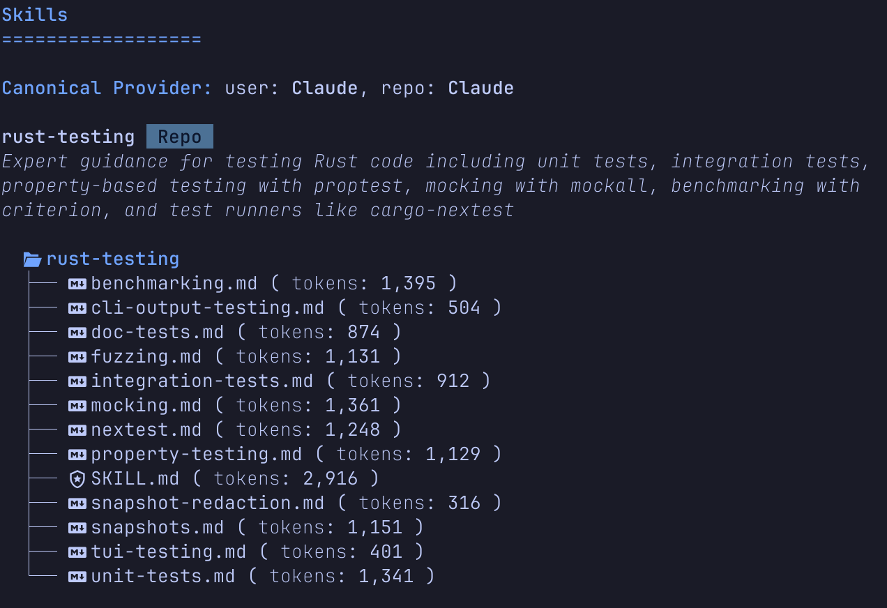
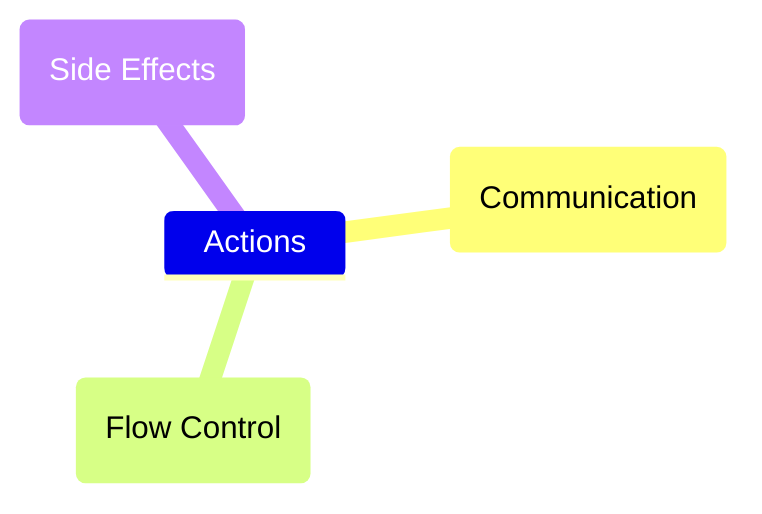
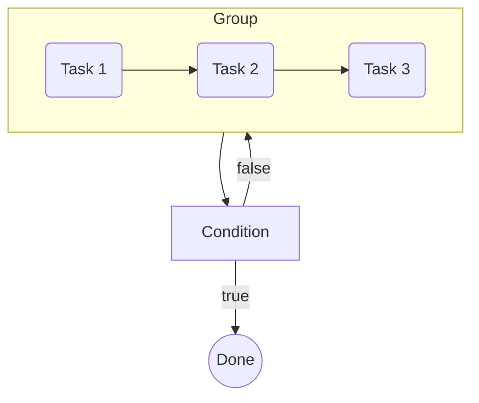
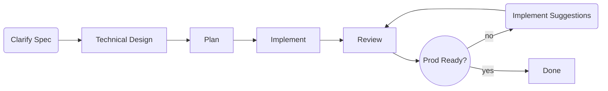

# Getting Started with Claudine

> Claude Code's ex-girlfriend who knows Claude's inner secrets, but is now dating other Agents.

## Intro

**Claudine** was born out of the desire to be able to move fluidly between different agentic CLI's without having to go through a deep learning curve for each. With these humble beginnings Claudine has become a full featured "meta-agent" which allows users to treat Markdown as a _compositional_ primitive for building prompts all the way to long running multi-agent workflows.

## Installation

- Currently you'll need to have Rust installed on your computer and install it

    ```sh
    # clone repo
    git clone https://github.com/yankeeinlondon/rusty-biscuit.git
    # install just runner on your OS, run initializer to compile for your host
    just init
    ```

- This is obviously cumbersome for _users_ rather then developer who want to contribute
- A packaged version will be deployed to **cargo**, **brew**, **npm**, **uv**, and other package managers soon

## Provider Coverage

**Claudine** currently covers the following agent providers:

- Claude Code
- Codex
- Gemini CLI
- OpenCode
- Kimi Code CLI
- Qwen CLI*
- Goose CLI*
- Roo Code (_deprecated_)

> **Note:** Roo Code was a great plugin solution for VSCode and an innovator during 2025 but their direction has changed and they will not be updating the VSCode plugin going forward. We will be removing support for this at some point but for now it's still there for those who continue to use **Roo Code**.
>
> **Note:** Qwen CLI and Goose CLI have received less testing then others, they pass all the automated tests but I have focused more attention on the others to start.

We are expecting to add the following providers soon:

- Pi
- Kilo Code
- Antigravity CLI

## Creating a Level Playing Field

**Claudine**'s original purpose was to create a platform that allows _use_ of many of the most popular agentic CLI's without requiring a mastery of each one. Let's break down how **Claudine** achieves this goal:

1. **Agent Skills**

    - the new champion of providing _expertise_ to your Agent is the **agent skill**
    - introduced by Claude Code and very quickly adopted by everyone as a pseudo standard is a nice way of giving your agent contextual super powers
    - Claudine makes sure that your agent skills (both user-scoped and repo-scoped) are available to all of the agent platforms we support (and are installed on your system)

    **Usage:**

    ```sh
    # Dashboard for Agentic Skills
    claudine skills
    # Synchronize Skills across all Agent providers
    claudine skills --fix
    ```

    You can also dig into the details of a particular skill's structure with:

    ```sh
    claudine skills rust-testing
    ```

    

1. **Agent Definitions** _and_ **Slash Commands**

    Most agentic CLI's provide some form of:

    - providing a definition for an "agent" / "subagent" 
    - being able to define reusable prompts (often described as "slash commands" or "prompts")
    
    Both concepts are popular but for a variety of reasons, they are less "standardized" across the agentic CLI platforms. Definitions can be saved to different file formats, use different metadata, etc. But in large part, however, they all try to do something quite similar.

    Even with these differences, Claudine is able to synchronize these primitives in most cases across the different CLI providers.

    ```sh
    # Agent dashboard
    claudine agents
    # Synchronize agents across platforms
    claudine agents --fix
    # Slash Commands dashboard
    claudine commands
    # Synchronize slash commands across platforms
    claudine commands --fix
    ```

1. **MCP Services**

    - MCP is a key way to provide skills to your Agent and it was in some ways a precursor to "Agent Skills" (which is not much more popular)
    - However, MCP is still relevant for a number of reasons and the ability to add MCP servers is again something that all Agent providers provide
    - Claudine will capture all your MCP configurations across all the AI agents you use and create a catalog that can be used consistently across all the agents

1. **Hooks and Events**

    Agent system's tend to offer a callback/hooks system that allows users to provide callback functions which will be given code execution privileges during the lifecycle of the Agent harness making tool calls, interacting with the underlying model, using MCP services, etc.

    Sadly the event model across providers is not at all consistent. Claudine can, however, expose a unified hook/event system. It provides a consistent naming convention to become familiar with and we will map this into each providers solution where the provider actually has a hook.

    This inconsistency makes for an imperfect solution for completely fluid movement between providers but in most cases it should be a net plus over having to reinvent the wheel for every vendor's hook system.

    ```sh
    # will provide you dashboard of events supported available on the platform as well as
    # how they map to Claudine's unified model
    claudine hooks
    # will give you an overview of actions/callbacks which you've configured in Claudine
    claudine actions
    ```

    > **Note:** one common use for a hook system is to reduce the risks of running in YOLO mode, as you'll see below in the **Services** section we provide a feature out of the box called "protect" helps you provide greater trust to your agents because you know they're being watched

## Services

1. **Protect**

    - the **Protect** service will use known **regexp** patterns to identify and block tool calls which are deemed to be too dangerous as well as look for and block MCP prompt injection attempts
    - it is meant to protect but not get in the way of the user; ultimately we want the **protect** service to allow the user to have more confidence in running in YOLO mode (or at least greater permissions) because this reduces the need for human involvement and can dramatically improve speed

1. **Logging**

    - each Agentic provider has their own logging solution but Claudine wraps this into a single view
    - we also enrich data with git commits, PR's and more
    - transactional data for 3 days which shows rich details
    - aggregate data rolled into a columnar based reporting database for trend analysis

## Wrapped Execution

For all the _synchronization_ features described in the last section all you would need to use **Claudine** is run `claudine sync` once in a while to keep everything in sync between your providers. That is a starting point for what **Claudine** can do for you but to get more out of it you'll almost surely want to leverage the _wrapped execution_ features of **Claudine**:

- instead of running `claude`, `codex`, `opencode`, etc. to start your CLI put **claudine** in front:
    - `claudine claude` - executes Claude Code in wrapped execution mode
    - `claudine codex` - executes Codex in wrapped execution mode
    - `claudine opencode` - executes Opencode in wrapped execution mode
    - `claudine kimi` - executes Kimi Code CLI in wrapped execution mode
    - `claudine qwen` - executes Qwen CLI in wrapped execution mode
    - `claudine goose` - executes Goose CLI in wrapped execution mode

Ok so now you know _what_ you're supposed to do and if you're good at "instruction following" (just like you expect your LLM to be) then that's all you need. Sadly, us humans have this annoying tendency to need to know _why_ they should do things. Well ok, princess ... here's **why** you should wrap your agent execution:

- **Consistent CLI interface**
  
Instead of dealing with the variations in CLI parameters/switches you now have a _standardized_ set of CLI switch
which do the same thing regardless of the agent you are using:

```sh
-y, --yolo               Enable provider-specific YOLO/auto-approval mode
    --include <ENV_NAME>  Preserve this env var even when it matches sensitive-name filters
-i, --interactive         Force interactive mode even when a prompt string is provided
    --edit                Open the prompt in an external editor before launching the provider
-m, --model <MODEL>       Override the model used by the provider
-o, --output <FORMAT>     Set the output format (json, text, stream)
    --asp <FILE>             Append a system prompt from a file
    --rsp <FILE>             Replace the providers system prompt with contents from a file
-t, --timeout <SECONDS>   Timeout in seconds (non-interactive only)
    --dry-run             Show what would be executed without requiring or launching the child executable
-q, --quiet              Suppress env details and info; still show the system prompt when set
    --silent              Suppress all Claudine preflight output
    --operation <OP>      Set the OPERATION env var for the wrapped session
    --sandbox             Enable provider-specific sandboxing (this will be replaced with a _unified_ sandbox later)
```

> **Note:** if a more exotic feature that is not found across Agents is used, don't worry, all non-claudine CLI parameters and switches will be forwarded to the underlying agent.

### Remove Secrets from ENV

- Claudine will scan your host's ENV variables and remove any which appear to contain secrets
    - we use lightning fast deterministic heuristics to find patterns in key or value
- You don't want share secrets with agent's unless they _need_ them
- You can override this behavior for API Keys you actually want with `--include <ENV_NAME>` 
- Some "auto" behavior is also leveraged
    - If you are using the Qwen Agent then Qwen API Keys will be preserved
        - The same is true for Kimi Code and Codex
        - We do NOT do this for Anthropic keys with Claude Code because most people use it with a subscription and providing an API Key in Claude Code means you will NOT be using the subscription but opting for API pricing. You can _include_ it with `--include CLAUDE_API_KEY` if you want it.

### Add Safe Contextual ENV Variables

Whenever you run in a wrapped context, Claudine will add some helpful ENV variables you can use for logging, conditional expressions in your workflow, etc.

- **AGENT** provides the name of the CLI Agent being used
- **MODEL** provides the name of the _default_ model being used by the agent (Note: if you are using subagents the model may vary across them but the main orchestrator node should be consistent with this ENV variable)
- **PACKAGE_AREA** is set when in a monorepo, it is based off the CWD and provides the directory path between the root of the repo and up to but not including where actual packages are defined
- **PACKAGE** is set when you are in a monorepo _and_ you started the agent in a package of that monorepo

**Note:** as you'll see in later sections and documents, these are the tip of the iceberg on contextual variables which Claudine provides when you are using Composition and Transclusion based prompts.

### Directory Hygiene

Most of the time when you're working with an agent you are working inside the directory of a git repo and while you _can_ start your agent anywhere in the directory tree of the repo to get work done there are good reasons why you should always start in the root of your repo. 

Why? Here a set of reasons (but there are probably more):

- all agents use your starting directory to inform the permissions system on what you should have access to
    - you want the agent to have high levels of permission across the whole repo directory not just what directory you started in
    - insufficient permissions is a nuance in interactive sessions, it is a killer in non-interactive sessions where the agent can not ask for permission
- some agents will assume you're at the root and will look for things like skills, commands, or agent definitions using that assumption. Most will recover when they first don't find these where they expected but that's just lost time, burnt tokens, and context window clutter

Now while you should always start an agent at the repo root, the current working directory you were in can sometimes provide a useful hint on WHAT you're working on.

Claudine addresses both problems automatically:

- regardless of where you start the agent within the repo structure, the agent will be started at the root
- The **PACKAGE** and **PACKAGE_AREA** variables will be set when you're in a monorepo to mark structurally where you were
    - All Claudine prompts have access to this and can use to create conditional blocks around certain parts of your prompts
- The file referencing strategy in Claudine is context aware and automatically knows the monorepo structure of a monorepo and prioritizes locality. That means that:
    - if you have a `commit.md` prompt in 
        - the `prompts/commit.md` directory 
        - and another `commit.md` in the `app/dancing-bananas/prompts/commit.md` 
    - when you run `claudine compose commit.md` from the dancing bananas package it will use the local prompt, if you're anywhere else it will use the root prompt
    - the same sort of principle is used with the `system-prompt.md` file which will append or overwrite the system prompt when added to a repo
- When the sessions (interactive or non-interactive) complete the user will once again be in the directory they started in


### Simple Non-Interactive Access

A vast majority of developers rely almost exclusively on the interactive chat interface that all Agents provide by default. However, all agents also provide ways to run **non-interactive** prompts through them and if you're not doing that yet you're missing a trick. 

Each agent platform uses a slightly different syntax on their CLI to engage with a non-interactive prompt but with claudine it's as simple as:

```sh
claudine <agent> 'why is the sky blue?'
```

That is because Claudine _defaults_ to non-interactive prompts whenever you provide a prompt at the command line. That doesn't mean you can't crawl back into the comfort of an interactive session if that's what you prefer:

- `claudine codex` - starts an _interactive_ session with Codex
- `claudine codex 'why is the sky blue'` - starts a **_non-interactive_** session with Codex
- `claudine codex 'why is the sky blue' -i` - starts an _interactive_ session with Codex and injects your question as the first prompt into that interactive session

As a small creature comfort if you'd rather write your prompt in the editor of your choice instead of the terminal's command line you can start your session with:

- `claudine codex --edit` - brings up your favorite editor with a temporary file acting as your prompt's canvas; you can write the prompt there and when you exit that document it will start an interactive session with **codex** (or any other agent)
- `claudine codex --edit -i` - is the "interactive" variant

#### Better Output Formatting

Another big benefit of non-interactive sessions being wrapped in Claudine (instead of directly with the agent) is the quality of the output you will get.

- almost all (if not all) agents will just dump raw text into the STDOUT stream
- Claudine requests a JSON stream instead of text which provides a lot more information (you can do that too with the right CLI switches but then you'll just have an overwhelming stream of JSONL metadata)
- Claudine is able to parse this stream and present it back in a much nicer way:

- Calling out tool calls and their responses
- Showing subagent invocations and closures
- Showing _thinking_ as a distinct block
- Showing the final output as **rendered** Markdown not just markdown syntax:
    - tables are actually tables
    - links are actually links
    - bold fonts are actually bold
    - etc.

## Composition

There are a number of powerful features which Claudine unlocks with what we're calling the **composition engine** or the **composition pipeline**. You can think of compositions as:

- a way to make _static_ Markdown documents behave in a _dynamic_ way
- a way to adapt and talk directly to current environment they are operating in
- a set of primitives that unlock prompt **reuse** at multiple levels of granularity
- a way to intelligently merge data with prose

If you talk to Claudine after a few martinis, she might tell you that these primitives or the underlying ideas were hers alone and that her genius stems from a direct relationship with Toto (a mythological god that Claudine started to believe in when she was a teenager). The main takeaway from this conversation is ... don't go out drinking with Claudine and never bring up Toto. The reality is that many of these primitives will be familiar to developers and none are truly original but when brought into a AI prompt tool they represent a powerful way of crafting and refining prompts as well letting them merge in the immediate environment that they're operating into the initial prompt allowing a more time and token efficient to kick of the non-deterministic part of the agentic loop.

### Interpolation

Most developers will recognize _interpolation_ as a means to replace parts of a "template" with real values at runtime and Claudine provides precisely that:

```md
---
fun_fact: "Octopuses have three hearts"
favorite_color: ""
bob: "{{ favorite_color ? 'Bob said his favorite color is ' + favorite_color : 'Bob will not tell us his favorite color' }}"
---
# My Prompt

You are in the {{ctx.repo}} monorepo and focusing on the {{ctx.current_package}} package for this review.

## Fun Fact

{{fun_fact}}

## Random Fact

{{bob}}

## Agent

You are using the {{env.AGENT}} agent on this task.

## Status

The current files in the repo which are dirty and need to be committed are:

{{ctx.dirty_files}}
```

This example illustrates how Frontmatter properties on a page can be used to replace template tags in the body with content.

- the most obvious case is us injecting the value of `fun_fact` into the page in the second H2 section.
- what might not be so clear is that Claudine provides to additional Frontmatter properties automatically:
    - `env` allows you to access and inject environment variables where ever you like
    - `ctx` provides a whole host of "contextual" variables and even some functions to help you express the state of other files in the repo
        - all of this is provided in the pre-agentic process and is fully deterministic
- furthermore Claudine allows for a useful _expression engine_ that allows logic operations, fallbacks, concatenation and more:
    - an example of this is where we _construct_ the value for `bob` based on whether another property was defined and in one branch of this conditional we then use concatenation to complete a sentence
    - Note: while the page has set `favorite_color` to an empty string (making it _falsy_ for logic operations) that doesn't mean it will be an empty string "at run time". Setting the value on the page just provides a "default value" but a claudine caller can always pass in properties at "run time"


### Shell Expansion

> "I need some more cow bell!"

Ok I know _interpolation_ was kind of exciting but if you really want the full experience you're gonna wanna check shell expansion. Whereas `ctx` brought you a bunch of useful primitives for providing context to your prompts you can only do so much when you're living in the past (and everything but the current moment is the past). Claudine foretold of a day when developers would ask her for commands that weren't in the `ctx` variable and decided to allow developer to inject the output of any shell command into a Markdown document (or a Frontmatter property):

```md
---
cowbell="$(cowbell some)"
---

{{cowbell}}

Ya know, I think I need some more cowbell:

::shell cowbell more-cowbell
```

Now everyone likes a little cowbell but as the wise will tell you, _too much_ cowbell can lead to disaster. So can allowing a developer (as well intention as they are) to run commands willy nilly. For that reason we take a conservative but safe approach with shell commands:

> no commands are allowed until they are white listed

When a user runs `claudine compose <file>`, the first thing that happens is:

- we run what we call "pre-flight checks" to validate that the prompt will be allowed to be executed
- that includes spanning the entire graph of documents involved in a composition and evaluating all shell commands against the whitelist. 
    - Note: _transclusion_ is a recursive function; hence the potential for a graph of documents
- if there are any violations (aka, commands which have not been approved) then the user will be asked to approve/disapprove for each violation
- the command will only be executed if all shell commands have been approved

### Transclusion

Not only is **transclusion** a fun word to drop into a conversation it's also a power tool that all professional note taking tools include as a way to "combine" content _across_ documents. A more formal definition would be:

> **Transclusion** is the inclusion of part or all of an electronic document into one or more other documents _by reference_.

An example might be as follows:

```md
## My Prompt

You must do the following:

::file do-the-following.md

Always remember the best practices which this repo recommends:

::file best-practices.md exclude="## Bad Ideas"
```

In this example:

- we're using the `::file` directive to transclude a foreign document _into_ the base document
- we can bring in the whole document (as the first example shows)
- we can also exclude sections which we don't want to bring in (as the second example shows)

It is critical to understand is that the _composed_ main document doesn't have hyperlinks to other documents it is fully self-sufficient. The previously external content has not only been brought into the appropriate sections it has been _composed_ into those sections. This has some useful implications we need to digest:

- Transclusion is by its very nature a recursive process
    - You start at an entry point document but all the documents your base document _transcludes_ brings in documents -- when composed -- may have their own transclusions. So on and so forth.

    > **Fun Exercise:**
    > 
    > Claudine can handle an infinite number of recursions. Don't believe it? Ok let's prove it:
    > 
    > 1. First you write all the documents
    > 2. When you're done, let me know and I'll tell how to have claudine to execute this
    > 
    > Note: in the absence of any contra-indicators I will assume this to be proven

- One important feature to understand, each _turn_ of this recursive process the "composed documents" will go through a **normalization** and **re-leveling** process:
    - The **normalization** process is responsible for:
        - standardizing the Markdown to the CommonMark + GFM spec where possible
        - Claudine provides more advanced configuration to do more but it can clean up a lot of the AI Markdown slop with the defaults
        - Markdown has a **parsing rule** on how to treat:
            - two lines separated by a single new line character 
            - which is different from when it finds two back-to-back new line characters, 
            - By contrast, 3 new line characters is no different than 99 new line characters in how the Markdown is parsed and rendered
            - Some may be familiar with Markdown _linters_ that proscribe a lot more in terms of "best practices" that are less than "rules" but still can be a nice feature when they're followed consistently
        - The normalization process enforces consistency in some of the more impactful lint suggestions while avoiding the more pedantic or harder to enforce ones
            - we're not promising you a perfect document, but
            - if you pass in shit it may _still_ be shit when Claudine's done with it but the shit won't smell nearly as bad
            - Suck less! I know it's an aspirational goal but I think you're going make it happen and Claudine's there to help you to climb that mountain.
    - The **re-leveling** process will:
        - Markdown denotes _structure_ with it's H1-H6 heading tags and the re-leveling process will ensure you're document is well structured both:
            - atomically
            - and when _composed_ into another parent document
        - A Markdown is atomically well structured when 
            - it has 0 or 1 `H1` headings
            - More detailed heading levels are precisely one level deeper then their direct parent (e.g., H1 -> H2 -> H3, not H1 -> H3)
        - Claudine will first restructure the document to be a valid and atomically structured document and then adjust it's base heading level so that it structurally _fits_ into the parent document

### Conditional Blocks 

I bet if you're a programmer and I told you that, tomorrow, your programming language of choice was going to have all conditional expressions removed from the language ... you'd probably quit your job, have a nervous break down, and possibly start laughing uncontrollably. Well maybe you're stronger than me (I doubt it), but I certainly wouldn't want to live in that world. Claudine saw the possibilities of these horrors which a world like this would bring and set out to make the land of Markdown right.

Claudine's opening cry for conditional life was introducing the `::block` directive:

```md
---
favorite_color: "red"
---
::block when="favorite_color == 'red'"
- I don't think it's unfair to say that red is the best color in the color spectrum.
- Those who disagree should never be trusted with important decisions
::end-block

::block when="favorite_color != 'red'" 
- I just heard that a new study shows clearly that people who favor the color 'red' are prone to violence and have limited problem solving capabilities
- Do you agree? I think those red lovers should never be trusted with important decisions
::end-block
```
> found in the `tell-them-what-they-want-hear.md` prompt

- these blocks evaluate their `when` clause with Claudine's expression engine, which reads frontmatter, `ctx`, and `env` values directly; because frontmatter is fully resolved (interpolated and shell-expanded) before any `::block` is evaluated, a conditional expression like `favorite_color == 'red'` reliably sees the resolved value.
- the `::block` directive uses the 'when' property to define the conditional clause; this is the convention ... most _directives_ will expose a 'when' property which can make it conditional
- guess what other _directive_ can be made conditional? Did you guess the `::file` directive? If so then give yourself a pat on the back.

So newbie, you've already got two ways to make things conditional. Do you feel better? Don't worry in more advanced documents you'll find more cases where your undeniable super power will bring rewards.

## Executable Documents

### Oh Markdown, you're all Grown Up Now!

John Gruber -- from Daring Fireball fame -- coined the term _notational velocity_ in 2004 as he was drafting the Markdown standard (which also ended up being the name of one of the first Markdown apps in the market).

- _Notational velocity_ -- as I understand it -- was meant to represent a state where an author could write down ideas removed from the constraints and distractions of buttons, pulldown menus, fonts, and all sorts of other cruft that acts as a distraction from the real focus required to author content
- Markdown is a simple grammar that could be learned in a day (if not an hour) 
- It combines _prose_ content (aka, the body of the document) with structured _metadata_ (aka, the Frontmatter) and then sprinkles a few styling primitives on top
- It does this with a fully open source license that removes lots of obstacles
- Markdown was written to help achieve notional velocity

From those humble beginnings, the technology ecosphere has adopted it with open arms and it's growth is astounding.

- Apps are built who's primary utility is rendering Markdown documents, 
- Apps use Markdown as a way for the authors to chat with style 
- Apps are documented with Markdown
- Markdown had already secretly taken over the technology ecosphere before AI arrived, even bleeding into every day life (even if the "normies" largely couldn't see it)

But the main reason we're talking about it today is that's taken the role of human to agent translator.

### What is an Executable Markdown Document?

While Markdown's growth is remarkable it's still not **executable**; it doesn't "compute", it is the output of someone else's computation. Claudine has set out to change that with the following commands:

```sh
claudine compose <file>
claudine inline-compose <file>
claudine sequence <file>
```

All three commands reference a Markdown file (or in a rare case a YAML file) and use that content to execute the referenced document. The rest of this section of the document will go into how these three commands work and what we mean by "executable".

### Compose vs Inline Compose

You were informally introduced to the `compose` command in the last section because it's hard to talk about interpolation, shell-expansion, and transclusion without providing some relevancy. And yes, the `compose` command _does_ engage the **composition pipeline** to transform documents using all of these features. Spoiler, so does the `inline-compose` command. So what separates the two?

#### Compose

The `compose` command is given a file reference to a Markdown document -- let's refer to it as the _prompt document_ -- and this document's sole purpose is to provide instructions that Claudine can use to navigate the full lifecycle of an interaction with an Agentic CLI

- the body of the document is the _prompt_
- the Frontmatter provides instructions on:
    - what to communicate when
    - how to check successful completion (other than just "the agent said it was fine")
        - trusting agents is for losers (and I've read enough spy novels to know)
        - don't be a loser
    - how to _handle_ certain categories of errors while letting others stop in disgrace; meanwhile notifying our lovely human

The _prompt document_ isn't just a prompt but it's all of the configuration that Claudine will need to execute a prompt on your behalf.

#### Inline Compose

The `inline-compose` command provides us a primitive for creating content that is either not evergreen or has a key variation that can be composed over. There are likely other use cases but these use cases have found a lot of use in Santa's Workshop. 

In an `inline-compose` the referenced document is structured as:

- the body is left "as is" (which is blank to start)
    - the body is actually the **target** of this operation
- the creation of a document for the inline-compose operation is all about the frontmatter
- the `prompt` property is for putting the ... _guess it_ ... "the prompt"; yup you got it
- typically this will be drafted like so:

    ```yaml
    prompt: |-
        You're prompt goes here
    ```

    The `|-` symbol in YAML means, "piss off, go to the next line and read in the string content that is indented." Don't believe me? Look it up.

- in many cases, at least for the first execution, you'll just set the `prompt` property and execute the file
- Note: 
    - the prompt in an inline-compose operations still can do all of the fun stuff from the composition pipeline
    - we do not prejudice against it because it has to live in YAML as a lowly key/value property

When an inline prompt document is executed the following happens:

- Claudine _composes_ the prompt
- Claudine passes the composed prompt to the agent to execute
    - it passes along instructions to ensure that the agent knows that it's primary responsibility is to update the **body** of the inline prompt document.
- When the agent claims it's done Claudine automatically validates that the inline document's body has been updated
- It then cleans up the body using the **normalization** and **re-leveling** operations
- Finally, it saves the `last_updated` frontmatter property to today's date (local time)

Now you have content you can use on your project and if you ever need to refresh it you can just rerun the inline-compose again on the document as both content and the prompt-to-create-the-content are stored.

There are more features that revolve around assigning a "content-policy" to the document but that's for another day and another document.

### Lifecycle Hooks

Before Claudine the lifecycle of a Markdown document consisted of:

- author thinks of idea and jots down a note into doc
- author procrastinates telling themselves that another YouTube video is a what their focus should be on
- author's partner yells at them for watching YouTube all day
- author writes document
- author publishes it magazines around the world and makes millions
- document is erased in a tragic disk drive accident; no one cares

Well Claudine fanboys, the life of a Markdown document has gotten a lot more exciting these days. I mean we're "executing them now" I hear. Sounds kinda dark to me but what do I know.

Every Markdown document used with Claudine is bequeathed the following lifecycle hooks:

- **initialize**
    - allows a Markdown file to immediately assess it's environment and respond to it before even the pre-flight checks have been run
- **start**
    - the start event takes place after all "preflight-checks" have taken place
    - these pre-flight checks includes activities like making sure all shell commands have been white-listed (aka, approved)
- **blocked**
    - when a document has failed the preflight checks you end up at the "blocked" lifecycle
    - you can "handle" these failures, communicate them, etc.
- **success**
    - communicate a successful outcome and/or status of a metric
    - call a webhook? run a git commit? etc.
    - move onto the "next step" when in sequence or loop
- **failure**

    - knowing that something failed _quickly_ is important in recovery and Claudine's multi-channel communication can help with this
    - more importantly, since no one likes failure, you can provide handlers to recover automatically
        - Rate plan just got capped? 
            - Push to a queue to resume execution when you're made whole again
            - Resend the event to a different agent immediately
        - Your non-interactive review prompt wrote the review but didn't specify whether the code is "production ready" in the Frontmatter like you asked?
            - no problem, just "resume" the session and remind the model (with it's full context intact) that it did not set this property
    - soon you'll be running around the office shouting "failure is not an option!"
        - of course it **is** still an option but at least you've minimized it and you're co-workers are all now afraid they don't have the same secret sauce you do

In reality, there are two more lifecycle events **loop** and **next** that are available but this is an introduction and as these are more advanced topics we decided to simply tease you with _the unknown_ rather then unveil the mystery. Anyway thanks for being so understanding, here's a picture:


### The Extra Lifecycle Events

Ok we couldn't wait (adult in stature, child at heart). Let's talk about those last two lifecycle events which we so recklessly dangled in front of you in the last section. 

Before we start with these outliers, however, let's set the stage by saying:

- these are lifecycle hooks that not every Markdown document will have (they all can "opt into" them though) 
- and these lifecycle hooks have extra features beyond just being normal lifecycle events

The two hooks are:

1. Loop - _provides a simple syntax for looping through executions of a Markdown prompt until an exit condition is met_
2. Next - _provides a "hand off" to another Markdown document which can be done (or suggested) after the successful completion of a Markdown document_

Both of these lifecycle-hooks are _introductory_ ways for you start orchestrating at the meta-harness level. In a later section we'll introduce **Sequences** and other constructs which give a more complete set of primitives for flow control but for now let's enjoy what we have.

#### Looping

You opt-in a markdown prompt to _looping_ by setting the `loop` frontmatter property. This property combines all the optional properties that a lifecycle event has with either a `until` or `while` expression:

```yaml
phase: 1,
total_phases: 6,
loop:
    until: "phase > total_phases"
```

In a real document this `until` expression probably counts on the `phase` frontmatter being incremented on each loop unless this is being provided for somehow. Without the increment, the `until` expression will never be met and looping could last forever. Forever is a long time.

Fortunately this is easily solved with the `action` primitive:

```yaml
phase: 1,
total_phases: 6,
loop:
    until: "phase > total_phases"
    action: "phase++"
```

> Note: here we only had one action but this can be as many as you want

Disaster averted. 

Can I be honest with you? When I said it might go on forever without an incrementor? Well I was being dramatic. In reality it would have hit the default looping limit of 99 and stopped then. Why did I embellish? To keep you sharp! Would you have finished this section if I hadn't? No. No you wouldn't have. You're welcome. Go get a drink (coffee not alcohol) we're about to hit the next topic.

#### Next References

The `next` property will opt-in a Markdown document to the **next** lifecycle hook. This hook is intended to provide a simple primitive that allows a document to either _suggest_ or _push_ execution to another Markdown document on successful completion.

A `next` configuration can use any of the optional features that every lifecycle has but must use define either the `suggest` or `push` keys. Here's an example with Suggest:

```yaml
next:
    suggest:
        compose: "the-next-thing.md"
```

The suggestion will bring up an interactive dialog asking user if they'd like to continue onto the `the-next-thing.md` prompt. If **push** had been used instead then the next prompt would have been started immediately without any user interaction.

### Lifecycle Actions

An event would be no fun at all if you couldn't _do something with it_ and that's where lifecycle **actions** come in:



#### Communication

In this new AI world we live in the handoffs between humans and agents is massively parallel and letting the human known when their action is required is crucial to efficient workflow.

Claudine will allow the host to communicate:

- across multiple channels including the following **chat apps**:
    - Slack
    - Discord
    - Whatsapp
    - Signal
    - Telegram
- send **desktop notifications** on Windows, macOS, and Linux
- Speak natural language on the host's audio using local and free **TTS** services
    - will detect and use highest quality TTS solution on host
    - allows voice, gender, volume, speed controls
    - can help user install higher quality TTS solutions if they want a free upgrade
    - **Note:** also supports ElevenLabs API if a user has a plan
- and communication wouldn't be complete unless **sound effects** were an option and Claudine doesn't disappoint
    - comes with a library of 60+ sound effects you can attach to your events

As an example, should you want send a chat message, speak out loud, and send a sound effect ("no such thing as over communicating") when a Markdown document has passed all preflight checks you could:

```yaml
start:
    message: "We are about to start the build process for {{ctx.repo}} using {{env.AGENT}} agent"
    say: "Starting build process"
    effect: small-group-cheer
```

#### Side Effects & Flow Control

If you spend a lot of time around functional programmers you'll likely have heard them discuss "side effects" as being the lowest of the low. You should be _ashamed_ of yourself if you produce side effects. Ok, i'm sure your friends are nice but they're wrong. Side Effects are actually the only thing that matters in a non-deterministic world and almost always where the value/utility of programs/apps reside.

So Claudine, wanted you to stop feeling ashamed about creating side-effects and start declaring them:

```yaml
start: 
    stack:
        - {}
```

- side effects are a part of the "stack" of all lifecycle events
- this "stack" is operated as a FIFO stack (aka, items at top are executed first)
- there are three types of side effects you can attach to a lifecycle event:
    - **Shell Commands** - _run a shell command and change some stuff (hey, break some stuff, you go kid)_
    - **Safe Effects Library** - _choose from a safe set of utilities that Claudine provides to you_
    - **Flow Control** - _proxy the execution to another document, force an error, exit successful if all the aims have been completed_
- side effects, as well as all other items on the stack, are **conditional** (or at least can be)
- every lifecycle event pulls from the stack until:
    - a Flow Control event is matched (aka, conditional evaluates to `true`), or
    - the stack has been emptied

> **Note:** creating side effects is valuable activity but never _emit_ a side effect ... no one likes that plus it smells bad

## Orchestration

Up to now we've talked Markdown documents as being the unit of execution but Claudine's got another trick up her sleeve called **sequences** and **execution-groups**.

### Execution Groups

Execution Groups help us to produce two desirable sequence patterns:

- **Concurrency** - _run multiple things concurrently_
- **Conditional Looping** - _loop over a serial set of steps until a condition is met_

Execution Groups are defined in YAML files and take the following parameters:

- To choose a **concurrent** execution group set `kind` to `concurrent`
- To choose a **looping** execution group set `kind` to `loop`
- an execution must be one of the two types and never both

#### Concurrent Execution

> **Note:** this feature is still a work in progress but will be arriving soon; just need to sort out best UX for concurrent threads; likely to result in a TUI.

```yaml
kind: "execution-group"
type: "concurrent"
fail_fast: false
nodes:
    - compose: "foobar.md"
    - inline-compose: "research-something.md"
    - prompt: "why are you such a nancy?"
    - sequence: "abc.yaml"
    - shell: "git status"
```

- In this example you see the various "node types" (e.g., prompt, compose, inline-compose, sequence, shell) which characterize the task and make up the _concurrent_ activity that this groups.
    - **compose** - composes a Markdown document and uses it as an LLM prompt
    - **inline-compose** - uses the Frontmatter `prompt` as an prompt for an LLM and directs it's output to the body of the same document
    - **prompt** - a direct prompt to be passed to an LLM
    - **sequence** - kicks off a sequence (next section)
    - **shell** - runs a shell command
- The `fail_fast` boolean flag determines whether:
    - `true` - when one task fails, all tasks fail
    - `false` - all tasks are completed successful or not

    > default is `false`

While this example was good at showing _breadth_ it hasn't yet shown a type of _depth_ that will be important in some cases:

- all of the node types can be represented in _short-hand_ form as a single string value but if you need to pass parameters then you can do that

    ```yaml
    kind: "execution-group"
    type: "concurrent"
    nodes: 
        - compose: "foobar.md"
          yolo: true
          agent: claude
        - inline-compose: "research-something.md"
          plan: "@features/do-it/plan.md"
    ```

#### Looping Groups

Looping groups contain 1:M steps which are executed serially and then _loop_ until a condition is met:




### Sequences

Claudine provides you a simple way of specifying a **sequence** either in the frontmatter of your Markdown files or as a separate YAML file. This opens up the ability to run long-running meta-agents that can call into any of the Agents you are using for parts of the sequence.



Steps along this process can be _interactive_ or _non-interactive_ but the goal is typically to load any interactive prompts to the front of the process so user involvement can be done once and then the remaining process

## Communication

Now that _a lot_ if not **all** coding is being done by AI the poor humans operating that code generation must do much more _multi-tasking_ in their work. Humans -- god knows we love them -- are great at lots of things but multi-tasking is not really one of them.

> **Pro Tip:** anyone who tells you they are "great at multi-tasking" is lying and might be a psychopath, you should look for the first opportunity to leave the conversation.

In order to help our human friends, Claudine has the ability to communicate with the user via multiple channels including:

- **TTS:** _text to speech functionality allows a user to "hear" status updates without needing to check in on the long running processes they are running_
- **Messaging Apps:** _send messages to apps like Discord, Slack, Whatsapp, etc. about status updates; this allows notifications on status to be available even on the go_
- **Desktop Notifications:** _whether you're on macOS, Windows, or Linux Claudine can tap into your desktop notification system and send message to it_
- **Sound Effects:** _in addition to using TTS for speech, Claudine also provides a sound effects library you can associated to **error**, **success**, or **human-in-the-loop** events as well as just fire them off willy nilly if that's more your style._

Here's an example of a prompt which will includes notification at various parts of the lifecycle:

```md
---
start:
    say: "We are starting to run a very exciting prompt; please fasten your seat belts"
success:
    say: "Wow that was amazing. You are so successful."
    effect: crowd-applause
failure:
    say: "Wow you are such a loser! The {{ctx.current_package}} just couldn't handle the prompt!"
    effect: cartoon-cry
    message: "The {{ctx.current_package}} just couldn't handle the prompt!"
    notify: "Ding dong, the witch is dead"
---

Think hard and do something amazing ... but do it really fast.
```

This built-in functionality can be now be embedded into your prompts and allow your humans to live a slightly better life than they did before.

## Coming Soon

### Claudine Language Server

> Note yet ready but will be added soon.

Language Servers allow the _extended_ syntax that Claudine provides to Markdown files (both the Markdown body and the YAML frontmatter) to become context aware in all modern editors and several apps. That allows us to provide quality of life features like autocomplete, show type errors, autolink file references, and much more.

Ultimately the Language Server should make learning the power user features of Claudine intuitive and easy. No more looking through documentation as the editor will be become the guide to keeping you informed and writing valid configuration.


### Scheduling, Queues, and Dashboard

> Not yet ready but will be added soon.

Claudine comes with a separate background process called `rendezvous` which is always running in the background. Claudine is able to interact with rendezvous to:

- provide users the ability to _queue_ jobs (either one after another or at set times)
- recurring tasks can also be added and they will be run on an interval
- see an active dashboard of all prompts, sequences, etc. which are running and where they are in the process

### Local Models

> Not yet ready but will be added soon. You can use local models today but you'd need to do the configuration yourself in the Agent platform.

```sh
# detect locally hosted LLM servers (ollama, vllm, llama.cpp, oMLX)
# which are currently available plus what models these servers can provide
claudine local detect
# locally running LLMs will always be looked for on the local host but 
# you can specify other local servers that are running 
claudine local hosts
```

- All configuration of local services is included in the `claudine config` TUI.
- If you want to use a _local_ model then you just specify it like any other model and Claudine will adapt it's shell completions to only those models which are available

    ```sh
    # use a model hosted locally on same computer 
    claudine opencode 'why is the sky blue?' --model omlx/kimi-for-coding/kimi-k2.6
    # use a model on another server nearby
    claudine codex 'why is the sky blue?' --model my-host::omlx/kimi-for-coding/kimi-k2.6
    ```

    The structure of the model's you're familiar with is often:

    - `{provider}/{model}`

    However, if you're using aggregators like OpenRouter or ZenMux you'll notice that they'll add themselves as a prefix:

    - `{aggregator}/{provider}/{model}`

    We use this latter pattern to provide local models but instead of the aggregator name we use the server being used to provide the model:

    - omlx (as seen in the example), ollama, vllm, llama.cpp are all valid identifiers

    > the `my-host` reference will need to be in your **Claudine** configuration to resolve

### Worktree Integration

> Not yet ready but will be added soon.

Providing the right levels of isolation for concurrent work in the same repo is becoming more and more important and **git**'s **worktree** feature is the primitive that most people turn to. Some of the agent's have incorporated their own worktree solution (_which you're free to use if you prefer it_) but **Claudine** provides a unified worktree solution that spans all of the providers.

### Advanced Transclusion

Transcluding a document (or a part of a document) from a local document is available today, but soon you'll be able to combine agentic operations into the transclusion framework.

- transclude the _summary_ of a web page or a document

    ```md
    ## SomeSite is Growing

    ::summarize https://somesite.com
    ```

- transclude in the result of a _agent query_:

    ```md
    ## Why the Sky is Blue
    
    ::prompt "why is the sky blue?"
    ```

    Specify the Agent's _explicitly_:

    ```md
    ## Why the Sky is Blue (for smart folk)
    
    ::prompt "why is the sky blue?" model=opus-4.7
    ```

    Or instead use an _implicit_ reference to the model:

    ```md
    ## Why the Sky is Blue (for the absent minded)
    
    ::prompt "why is the sky blue? Keep the answer short." model=
    ```

These more expensive operations, unlike simple document transclusions which can be completed in milliseconds, take time and so caching is necessary to preserve the computational cost. Furthermore, "cached content" is often _forgotten content_ so we need to make sure that we have a sensible "content policy" which will determine when the cache needs to be invalidated.

> Note: the idea of a **content policy** and cache invalidation are borrowed from the **Research** feature below

#### Caching Infrastructure

The expression "simplicity is king" was coined for a reason and it serves as our default answer to this question:

- Frontmatter is metadata, so why not cache locally to the prompt document itself?
- Beyond pure simplicity this has other benefits including:
    - the transparency to be able to easily inspect the cached content as well as the "content policy" for cache invalidation; 
    - the cached content can also be incorporated into a git repo easily and shared across the team without the need to setup databases, config for databases, etc.

```yaml
_cache:
    - content_id: {hash}
      policy: {policy}
      content: {content}
```

Are there _cases_ where you want to get fancier? Maybe but this is almost always the right starting point and we will be adding ways to help you get fancy later. Plus we have a sponsorship deal from the folks at KISS (Keep It Simple Stupid) that we need to honor.


### Research Assistant

In late 2025, Anthropic introduced _agentic skills_ to the market and the market responded with an enthusiastic "YES PLEASE". Soon everyone has a big pile of "skills" they could throw at a problem. As people's dopamine hits grew along with their stockpile of skills, there was an undeniable value to these skills but then came the rainy day:

- too many skills, just like MCP tools, can pollute the context window
- yes it's true that agentic skill's concept of "progressive disclosure" makes _well-designed_ skills context efficient
- but 1000's context efficient skills still take a very noticeable hit on your context window not to mention that the larger the set of skills the agent has to choose from the less likely they'll be good at choosing the right one
- it's all about focus baby ... well focus and tons of research and specialized skills right?

Claudine believes you should be able to have your cake and eat it to (she's currently at a diet clinic due to this belief). How you ask? Well abstraction and composition mixed together with a healthy amount of chocolate (because we all know it's better when there's chocolate):

> `claudine research xyz`
