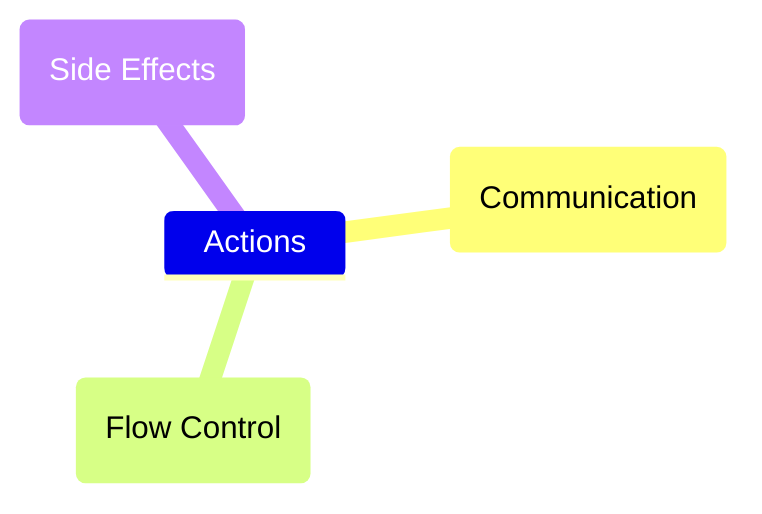
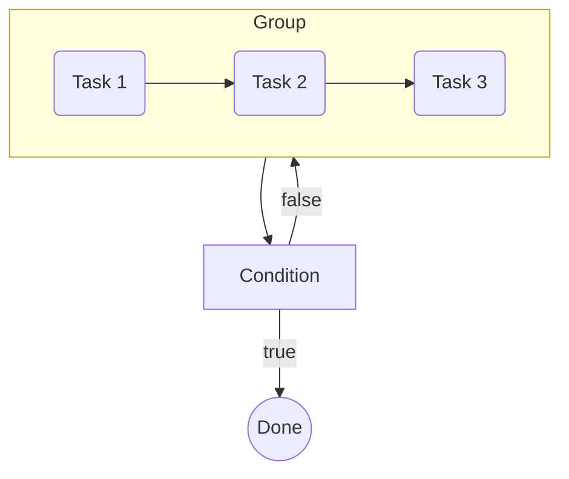
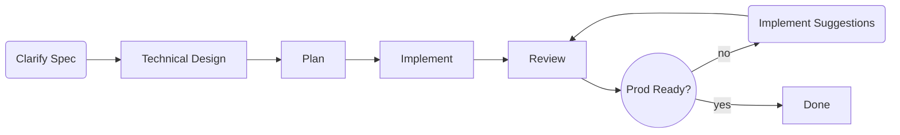

# Getting Started with Claudine

> Claude Code's ex-girlfriend who knows Claude's inner secretes but is now dating other Agents

## Intro

**Claudine** was born out of the desire to be able to move fluidly between different agentic CLI's without having to go through a deep learning curve for each. With these humble beginnings **Claudine** has become a full featured "meta-agent" which allows users to treat Markdown as a _compositional_ primitive for building prompts all the way to long running multi-agent workflows.

## Installation

- Currently you'll need to have Rust installed on your computer and install it

    ```sh
    # clone repo
    git clone https://github.com/yankeeinlondon/rusty-biscuit.git
    # install just runner on your OS, run initializer to compile for your host
    just init
    ```

- This is obviously cumbersome for _users_ rather then developer who want to contribute
- A packaged version will be deployed to **cargo** first and soon afterward to **npm**

## Provider Coverage

**Claudine** currently covers the following agent providers:

- Claude Code
- Codex
- Gemini CLI
- OpenCode
- Kimi Code CLI
- Qwen CLI*
- Goose CLI*
- Roo Code (_deprecated_)

> **Note:** Roo Code was a great plugin solution for VSCode and an innovator during 2025 but their direction has changed and they will not be updating the VSCode plugin going forward. We will be removing support for this at some point but for now it's still there for those who continue to use **Roo Code**.
>
> **Note:** Qwen CLI and Goose CLI have received less testing then others, they pass all the automated tests but I have focused more attention on the others to start.

We are expecting to add the following providers soon:

- Pi
- Kilo Code

## Creating a Level Playing Field

**Claudine**'s original purpose was to create a platform that allows _use_ of many of the most popular agentic CLI's without requiring a mastery of each one. Let's break down how **Claudine** achieves this goal:

1. **Agent Skills**

    - the new champion of providing _expertise_ to your Agent is the **agent skill**
    - introduced by Claude Code and very quickly adopted by everyone as a pseudo standard is a nice way of giving your agent contextual super powers
    - Claudine makes sure that your agent skills (both user-scoped and repo-scoped) are available to all of the agent platforms we support (and are installed on your system)
    - run `claudine skills` for an overview of your catalog
        - run `claudine skills --fix` to fix synchronization issues that may have built up (alternatively run `claudine sync` which syncs skills, agents, and slash commands)

1. **Agent Definitions** _and_ **Slash Commands**

    - The ideas of:
        - providing a definition for an "agent" or "subagent" 
        - being able to define reusable prompts as "slash commands"
        
    Are both concepts that all agents share but the way they are implemented _is_ more variant than with "skills".

    - Claudine makes sure that all providers who share the same basic structure for agent definitions and slash commands 

1. **MCP Services**

    - MCP is a key way to provide skills to your Agent and it was in some ways a precursor to "Agent Skills" (which is not much more popular)
    - However, MCP is still relevant for a number of reasons and the ability to add MCP servers is again something that all Agent providers provide
    - Claudine will capture all your MCP configurations across all the AI agents you use and create a catalog that can be used consistently across all the agents

1. **Hooks and Events**

    - A powerful way to interact and report on your 


## Services

1. **Protect**

    - the **Protect** service will use known **regexp** patterns to identify and block tool calls which are deemed to be too dangerous as well as look for and block MCP prompt injection attempts
    - it is meant to protect but not get in the way of the user; ultimately we want the **protect** service to allow the user to have more confidence in running in YOLO mode (or at least greater permissions) because this reduces the need for human involvement and can dramatically improve speed

1. **Logging**

    - each Agentic provider has their own logging solution but Claudine wraps this into a single view
    - we also enrich data with git commits, PR's and more
    - transactional data for 3 days which shows rich details
    - aggregate data rolled into a columnar based reporting database for trend analysis


## Wrapped Execution

For all the _synchronized_ features described in the last section all you would need to use **Claudine** is run `claudine sync` once in a while to keep everything in sync between your providers. That is a starting point for what **Claudine** can do for you but to get more out of it you'll want to leverage the _wrapped execution_ features of **Claudine**:

- instead of running `claude`, `codex`, `opencode`, etc. to start your CLI put **claudine** in front:
    - `claudine claude` - executes Claude Code in wrapped execution mode
    - `claudine codex` - executes Codex in wrapped execution mode
    - `claudine opencode` - executes Opencode in wrapped execution mode
    - `claudine kimi` - executes Kimi Code CLI in wrapped execution mode
    - `claudine qwen` - executes Qwen CLI in wrapped execution mode
    - `claudine goose` - executes Goose CLI in wrapped execution mode

Ok so now you _what_ you're supposed to do and if you're good at "instruction following" (just like you expect your LLM to be) then that's all you need. Sadly, us humans have this annoying tendency to need to know _why_ they should do things. Well ok, princess ... here's **why** you should wrap your agent execution:

- **Consistent CLI interface**
    
    Instead of dealing with the variations in CLI parameters/switches you now have a _standardized_ set of CLI switch
    which do the same thing regardless of the agent you are using:

    ```sh
    -y, --yolo               Enable provider-specific YOLO/auto-approval mode
        --include <ENV_NAME>  Preserve this env var even when it matches sensitive-name filters
    -i, --interactive         Force interactive mode even when a prompt string is provided
        --edit                Open the prompt in an external editor before launching the provider
    -m, --model <MODEL>       Override the model used by the provider
    -o, --output <FORMAT>     Set the output format (json, text, stream)
        --asp <FILE>             Append a system prompt from a file
        --rsp <FILE>             Replace the providers system prompt with contents from a file
    -t, --timeout <SECONDS>   Timeout in seconds (non-interactive only)
        --dry-run             Show what would be executed without launching the child
    -q, --quiet              Suppress env details and info; still show the system prompt when set
        --silent              Suppress all Claudine preflight output
        --operation <OP>      Set the OPERATION env var for the wrapped session
        --sandbox             Enable provider-specific sandboxing
    ```

    > **Note:** if a more exotic feature that is not found across Agents is used, it will passed through to the agent 
    > so that you'll loose access to any features.

- **Remove Secrets from ENV**

    - Claudine will scan your host's ENV variables and remove any which appear to contain secrets
    - You don't want share secrets with agent's unless they _need_ them
    - You can override this behavior for API Keys you actually want with `--include <ENV_NAME>` 
    - Some "auto" behavior is also leveraged
        - If you are using the Qwen Agent then Qwen API Keys will be preserved
            - The same is true for Kimi Code and Codex
            - We do NOT do this for Anthropic keys with Claude Code because most people use it with a subscription and might have an API Key for other use cases. Including an API Key when claude starts makes it **skip** your subscription so we play it safe and remove it by default. You can _include_ it with `--include` if you want to

- **Simple Non-Interactive Access**

    A vast majority of developers rely on the interactive chat interface that all Agents default to when run. However, all agents also provide ways to run **non-interactive** prompts through them. Each agent platform uses a slightly different syntax and the _output_ which is provided by these non-interactive sessions can be kind of messy and hard to follow.

    Claudine makes any call which includes quoted text into a non-interactive prompt:

    - `claudine codex` - starts an _interactive_ session with Codex
    - `claudine codex 'why is the sky blue'` - starts a **_non-interactive_** session with Codex
    - `claudine codex 'why is the sky blue' -i` - starts an _interactive_ session with Codex and injects your question as the first prompt into that interactive session

    In addition to making it easy to start these interactive sessions, Claudine also improves the output quality dramatically by:

    - Calling out tool calls and their responses
    - Showing subagent invocations and closures
    - Showing _thinking_ as a distinct block
    - Showing the final output as **rendered** Markdown not just markdown syntax:
        - tables are actually tables
        - links are actually links
        - bold fonts are actually bold
        - etc.

## Composition

There are a number of powerful features which Claudine unlocks with what we're calling **Composition**. You can think of compositions as:

- a way to make static Markdown documents behave in a dynamic way and adapt to the environment they are in
- allow **safe** ways to inject the output of shell commands at runtime into your prompts
    - this can allow you to build prompts which eliminate the 
    - all shell commands which are specified in a Markdown file _must_ be approved by the user and added to the **whitelist** prior to them being used
- you can also leverage a number of dynamic "context" variables as well as any ENV variable to **interpolate** or **transclude** your prompt content
- **Interpolation**
    - most developers will recognize _interpolation_ as a means to replace parts of a "template" with real values at runtime and Claudine provides precisely that:

        ```md
        ---
        fun_fact: "Octopuses have three hearts"
        git_status: "$(git status)"
        ---
        # My Prompt

        You are in the {{ctx.repo}} monorepo and focusing on the {{ctx.current_package}} package in this review.

        ## Fun Fact
        {{fun_fact}}

        ## Agent

        You are using the {{env.AGENT}} agent on this task.

        ## Status

        The current git status is:

        {{git_status}}
        ```

        Outside of being a terrible prompt -- _what do you want from an example?_ -- what you see here is that documents can _inject_ content in at runtime. That can be static Frontmatter properties, the output of shell commands (which require approval), or leveraging the `ctx` or `env` dictionaries which provide runtime information.

- **Shell Expansion**

- **Transclusion**
    - not only is **transclusion** a fun word to drop into a conversation it's also a power tool that all professional note taking tools include as a way to "combine" content.
    - An example might be as follows:

        ```md
        ## My Prompt

        You must do the following:

        ::file do-the-following.md

        Always remember the best practices which this repo recommends:

        ::file best-practices.md
        ```

        In this example we're using the `::file` directive to instruct Claudine that this parent markdown document will need to inject the `do-the-following.md` and `best-practices.md` content into the locations specified.

## Executable Documents

I know you're probably still excited about the idea of composition so we'll take a second to calm down. Calm? Great let's get started:

- John Gruber -- from Daring Fireball fame -- coined the term _notational velocity_ in 2004 (which ended up being the name of one of the first Markdown apps)
    - John's intent was to find a way to write down ideas removed from the constraints and distractions of buttons, pulldown menus, fonts, and all sorts of other cruft that acts as a distraction from the real focus
- Markdown was a simple grammar that could be learned in a day (if not an hour) that combined 
    - a place for _prose_ (aka, the body of the document) 
    - and a place for _metadata_ (aka, the Frontmatter)
- Of course today it has become the lingua franca of AI prompts, responses, and all thoughts in-between.
- In some ways it's current mantle in the AI world aligns with the original goals that Gruber had for writing:
    - A minimal syntax provides some structure but doesn't get in the way of the real content
        - By comparison XML is **highly** structure but terrible ergonomically to write and inefficient character/token wise
        - HTML may not be quite as insufferable as XML in terms of structure but it's not a language 

That's the history but throughout that history a _written_ document once written was static. It simply was a document which conveyed some knowledge. With Claudine we hope to make that document come to life by making Markdown **executable**.

### Lifecycle Events

- while the Markdown standard allows for both Frontmatter metadata and body content, they are inert and unconnected
    - with interpolation, transclusion, and shell expansion we've already seen how these two types of data can interact in dynamic ways
- now let's explore the **lifecycle** of a Markdown document:
    - Claudine defines the following lifecycle events to every Markdown document:
        - **initialize**
            - allows a Markdown file to immediately assess it's environment and respond to it before even the pre-flight checks have been run
        - **start**
            - the start event takes place after all "preflight-checks" have taken place
            - these pre-flight checks includes activities like making sure all shell commands have been white-listed (aka, approved)
        - **blocked**
            - when a document has failed the preflight checks you end up at the "blocked" lifecycle
            - you can "handle" these failures, communicate them, etc.
        - **success**

            - if a document completes successfully the this lifecycle event it triggered
            - it gives the document an author to communicate but also allows more precise validations to take place
                - LLMs have a tendency to be overly generous in what they deem as "success"
                - with this lifecycle you can impose a more complete set of tests and those tests can be context specific

        - **failure**

            - knowing that something failed quickly is important in recovery and this lifecycle event allows you to be notified as soon as any failure condition is reached
            - 

### Lifecycle Actions

An event would be no fun at all if you couldn't _do something with it_ and that's where lifecycle **actions** come in:



#### Communication

In this new AI world we live in the handoffs between humans and agents is massively parallel and letting the human known when their action is required is crucial to efficient workflow.

Claudine will allow the host to communicate:

- across multiple channels including the following **chat apps**:
    - Slack
    - Discord
    - Whatsapp
    - Signal
    - Telegram
- send **desktop notifications** on Windows, macOS, and Linux
- Speak natural language on the host's audio using local and free **TTS** services
    - will detect and use highest quality TTS solution on host
    - allows voice, gender, volume, speed controls
    - can help user install higher quality TTS solutions if they want a free upgrade
    - **Note:** also supports ElevenLabs API if a user has a plan
- and communication wouldn't be complete unless **sound effects** were an option and Claudine doesn't disappoint
    - comes with a library of 60+ sound effects you can attach to your events

As an example, should you want send a chat message, speak out loud, and send a sound effect ("no such thing as over communicating") when a Markdown document has passed all preflight checks you could:

```yaml
start:
    message: "We are about to start the build process for {{ctx.repo}} using {{env.AGENT}} agent"
    say: "Starting build process"
    effect: small-group-cheer
```

#### Side Effects & Flow Control

If you spend a lot of time around functional programmers you'll likely have heard them discuss "side effects" as being the lowest of the low. You should be _ashamed_ of yourself if you produce side effects. Ok, i'm sure your friends are nice but they're wrong. Side Effects are actually the only thing that matters in a non-deterministic world and almost always where the value/utility of programs/apps reside.

So Claudine, wanted you to stop feeling ashamed about creating side-effects and start declaring them:

```yaml
start: 
    stack:
        - {}
```

- side effects are a part of the "stack" of all lifecycle events
- this "stack" is operated as a FIFO stack (aka, items at top are executed first)
- there are three types of side effects you can attach to a lifecycle event:
    - **Shell Commands** - _run a shell command and change some stuff (hey, break some stuff, you go kid)_
    - **Safe Effects Library** - _choose from a safe set of utilities that Claudine provides to you_
    - **Flow Control** - _proxy the execution to another document, force an error, exit successful if all the aims have been completed_
- side effects, as well as all other items on the stack, are **conditional** (or at least can be)
- every lifecycle event pulls from the stack until:
    - a Flow Control event is matched (aka, conditional evaluates to `true`), or
    - the stack has been emptied

> **Note:** creating side effects is valuable activity but never _emit_ a side effect ... no one likes that plus it smells bad

## Orchestration

Up to now we've talked Markdown documents as being the unit of execution but Claudine's got another trick up her sleeve called **sequences** and **execution-groups**.

### Execution Groups

Execution Groups help us to produce two desirable sequence patterns:

- **Concurrency** - _run multiple things concurrently_
- **Conditional Looping** - _loop over a serial set of steps until a condition is met_

Execution Groups are defined in YAML files and take the following parameters:

- To choose a **concurrent** execution group set `kind` to `concurrent`
- To choose a **looping** execution group set `kind` to `loop`
- an execution must be one of the two types and never both

#### Concurrent Execution

> **Note:** this feature is still a work in progress but will be arriving soon; just need to sort out best UX for concurrent threads; likely to result in a TUI.

```yaml
kind: "execution-group"
type: "concurrent"
fail_fast: false
nodes:
    - compose: "foobar.md"
    - inline-compose: "research-something.md"
    - prompt: "why are you such a nancy?"
    - sequence: "abc.yaml"
    - shell: "git status"
```

- In this example you see the various "node types" (e.g., prompt, compose, inline-compose, sequence, shell) which characterize the task and make up the _concurrent_ activity that this groups.
    - **compose** - composes a Markdown document and uses it as an LLM prompt
    - **inline-compose** - uses the Frontmatter `prompt` as an prompt for an LLM and directs it's output to the body of the same document
    - **prompt** - a direct prompt to be passed to an LLM
    - **sequence** - kicks off a sequence (next section)
    - **shell** - runs a shell command
- The `fail_fast` boolean flag determines whether:
    - `true` - when one task fails, all tasks fail
    - `false` - all tasks are completed successful or not

    > default is `false`

While this example was good at showing _breadth_ it hasn't yet shown a type of _depth_ that will be important in some cases:

- all of the node types can be represented in _short-hand_ form as a single string value but if you need to pass parameters then you can do that

    ```yaml
    kind: "execution-group"
    type: "concurrent"
    nodes: 
        - compose: "foobar.md"
          yolo: true
          agent: claude
        - inline-compose: "research-something.md"
          plan: "@features/do-it/plan.md"
    ```

#### Looping Groups

Looping groups contain 1:M steps which are executed serially and then _loop_ until a condition is met:




### Sequences

Claudine provides you a simple way of specifying a **sequence** either in the frontmatter of your Markdown files or as a separate YAML file. This opens up the ability to run long-running meta-agents that can call into any of the Agents you are using for parts of the sequence.



Steps along this process can be _interactive_ or _non-interactive_ but the goal is typically to load any interactive prompts to the front of the process so user involvement can be done once and then the remaining process

## Communication

Now that _a lot_ if not **all** coding is being done by AI the poor humans operating that code generation must do much more _multi-tasking_ in their work. Humans -- god knows we love them -- are great at lots of things but multi-tasking is not really one of them.

> **Pro Tip:** anyone who tells you they are "great at multi-tasking" is lying and might be a psychopath, you should look for the first opportunity to leave the conversation.

In order to help our human friends, Claudine has the ability to communicate with the user via multiple channels including:

- **TTS:** _text to speech functionality allows a user to "hear" status updates without needing to check in on the long running processes they are running_
- **Messaging Apps:** _send messages to apps like Discord, Slack, Whatsapp, etc. about status updates; this allows notifications on status to be available even on the go_
- **Desktop Notifications:** _whether you're on macOS, Windows, or Linux Claudine can tap into your desktop notification system and send message to it_
- **Sound Effects:** _in addition to using TTS for speech, Claudine also provides a sound effects library you can associated to **error**, **success**, or **human-in-the-loop** events as well as just fire them off willy nilly if that's more your style._

Here's an example of a prompt which will includes notification at various parts of the lifecycle:

```md
---
start:
    say: "We are starting to run a very exciting prompt; please fasten your seat belts"
success:
    say: "Wow that was amazing. You are so successful."
    effect: crowd-applause
failure:
    say: "Wow you are such a loser! The {{ctx.current_package}} just couldn't handle the prompt!"
    effect: cartoon-cry
    message: "The {{ctx.current_package}} just couldn't handle the prompt!"
    notify: "Ding dong, the witch is dead"
---

Think hard and do something amazing ... but do it really fast.
```

This built-in functionality can be now be embedded into your prompts and allow your humans to live a slightly better life than they did before.

## Coming Soon

### Claudine Language Server

> Note yet ready but will be added soon.

Language Servers allow the _extended_ syntax that Claudine provides to Markdown files (both the Markdown body and the YAML frontmatter) to become context aware in all modern editors and several apps. That allows us to provide quality of life features like autocomplete, show type errors, autolink file references, and much more.

Ultimately the Language Server should make learning the power user features of Claudine intuitive and easy. No more looking through documentation as the editor will be become the guide to keeping you informed and writing valid configuration.


### Scheduling, Queues, and Dashboard

> Not yet ready but will be added soon.

Claudine comes with a separate background process called `rendezvous` which is always running in the background. Claudine is able to interact with rendezvous to:

- provide users the ability to _queue_ jobs (either one after another or at set times)
- recurring tasks can also be added and they will be run on an interval
- see an active dashboard of all prompts, sequences, etc. which are running and where they are in the process

### Local Models

> Not yet ready but will be added soon. You can use local models today but you'd need to do the configuration yourself in the Agent platform.

```sh
# detect locally hosted LLM servers (ollama, vllm, llama.cpp, oMLX)
# which are currently available plus what models these servers can provide
claudine local detect
# locally running LLMs will always be looked for on the local host but 
# you can specify other local servers that are running 
claudine local hosts
```

- All configuration of local services is included in the `claudine config` TUI.
- If you want to use a _local_ model then you just specify it like any other model and Claudine will adapt it's shell completions to only those models which are available

    ```sh
    # use a model hosted locally on same computer 
    claudine opencode 'why is the sky blue?' --model omlx/kimi-for-coding/kimi-k2.6
    # use a model on another server nearby
    claudine codex 'why is the sky blue?' --model my-host::omlx/kimi-for-coding/kimi-k2.6
    ```

    The structure of the model's you're familiar with is often:

    - `{provider}/{model}`

    However, if you're using aggregators like OpenRouter or ZenMux you'll notice that they'll add themselves as a prefix:

    - `{aggregator}/{provider}/{model}`

    We use this latter pattern to provide local models but instead of the aggregator name we use the server being used to provide the model:

    - omlx (as seen in the example), ollama, vllm, llama.cpp are all valid identifiers

    > the `my-host` reference will need to be in your **Claudine** configuration to resolve

### Worktree Integration

> Not yet ready but will be added soon.

Providing the right levels of isolation for concurrent work in the same repo is becoming more and more important and **git**'s **worktree** feature is the primitive that most people turn to. Some of the agent's have incorporated their own worktree solution (_which you're free to use if you prefer it_) but **Claudine** provides a unified worktree solution that spans all of the providers.

### Advanced Transclusion

Transcluding a document (or a part of a document) from a local document is available today, but soon you'll be able to:

- transclude the _summary_ of a web page or a document

    ```md
    ## SomeSite is Growing

    ::summarize https://somesite.com
    ```

- transclude in the result of a _agent query_:

    ```md
    ## Why the Sky is Blue

    ::prompt "why is the sky blue?"
    ```

    Specify the Agent's _explicitly_:

    ```md
    ## Why the Sky is Blue (for smart folk)

    ::prompt "why is the sky blue?" --model opus-4.7
    ```

    Or instead use an _implicit_ reference to the 

These more expensive operations, unlike simple document transclusions which can be brought in in less than a second, are expensive and so caching is necessary. Where are these cached results stored? 


Not in some far off database but rather instead they reside in the Frontmatter of the markdown document
