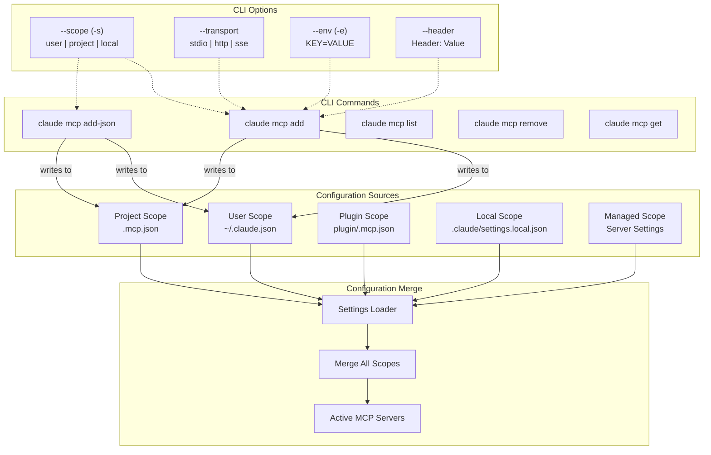

# MCP Server Configuration for Claude Code

## Overview

## Configuration Files

Claude Code uses a scope-based configuration system for MCP servers. The scope determines where the configuration is stored, who can access it, and whether it can be shared with others.

### Configuration Scopes and Files

| Scope       | Configuration File                                      | Description                                                  | Sharing                 |
| ----------- | ------------------------------------------------------- | ------------------------------------------------------------ | ----------------------- |
| **User**    | `~/.claude.json`                                        | Personal MCP servers available across all projects on your system | Not shared              |
| **Project** | `.mcp.json` (in project root)                           | Team MCP servers shared via version control                  | Can be committed to git |
| **Local**   | `.claude/settings.local.json`                           | Temporary, session-specific servers                          | Gitignored              |
| **Plugin**  | `.mcp.json` (in plugin root) or inline in `plugin.json` | Bundled with plugins                                         | Shared with plugin      |
| **Managed** | Server-managed settings                                 | Admin-configured via Claude.ai                               | Organization-wide       |

### Important Note on File Locations

There is a common misconception about where MCP server configurations should be placed. The file `~/.claude/settings.json` is used for general Claude Code settings but **NOT** for MCP server definitions. MCP servers must be configured in:

- **User scope**: `~/.claude.json` (the `mcpServers` key)
- **Project scope**: `.mcp.json` in the project root directory

This distinction was clarified in [GitHub Issue #4976](https://github.com/anthropics/claude-code/issues/4976), where users discovered that placing MCP configurations in `~/.claude/settings.json` does not work.

---

## Configuration File Structure

### User Scope (`~/.claude.json`)

The `~/.claude.json` file contains various settings including MCP server configurations:

```json
{
  "numStartups": 34,
  "autoUpdaterStatus": "enabled",
  "theme": "dark-daltonized",
  "hasCompletedOnboarding": true,
  "projects": {
    "/home/user/repos/my-project": {
      "allowedTools": [],
      "history": [],
      "mcpServers": {}
    }
  },
  "mcpServers": {
    "sequential-thinking": {
      "type": "stdio",
      "command": "npx",
      "args": ["-y", "@modelcontextprotocol/server-sequential-thinking"]
    },
    "mcp-omnisearch": {
      "type": "stdio",
      "command": "npx",
      "args": ["-y", "mcp-omnisearch"],
      "env": {
        "TAVILY_API_KEY": "your-tavily-key",
        "BRAVE_API_KEY": "your-brave-key"
      }
    }
  }
}
```

### Project Scope (`.mcp.json`)

For project-specific MCP servers that can be shared with your team:

```json
{
  "mcpServers": {
    "project-database": {
      "command": "node",
      "args": ["/path/to/project/db-server.js"],
      "env": {
        "DB_PATH": "./data"
      }
    }
  }
}
```

### MCP Server Configuration Schema

Each MCP server entry supports the following fields:

| Field     | Type   | Required | Description                                         |
| --------- | ------ | -------- | --------------------------------------------------- |
| `command` | string | Yes      | The executable command to run the server            |
| `args`    | array  | No       | Command-line arguments for the server               |
| `env`     | object | No       | Environment variables to set                        |
| `type`    | string | No       | Transport type: `stdio` (default), `http`, or `sse` |
| `cwd`     | string | No       | Working directory for the server process            |

---

## Plugin MCP Configuration

Plugins can bundle MCP servers, making them automatically available when the plugin is installed. This allows for seamless integration of external tools without requiring users to manually configure each server.

### Plugin MCP Server Location

Plugins can define MCP servers in two ways:

1. **Separate `.mcp.json` file** in the plugin root directory
2. **Inline** in the `plugin.json` manifest under the `mcpServers` key

### Example Plugin MCP Configuration

```json
{
  "mcpServers": {
    "plugin-database": {
      "command": "${CLAUDE_PLUGIN_ROOT}/servers/db-server",
      "args": ["--config", "${CLAUDE_PLUGIN_ROOT}/config.json"],
      "env": {
        "DB_PATH": "${CLAUDE_PLUGIN_ROOT}/data"
      }
    },
    "plugin-api-client": {
      "command": "npx",
      "args": ["@company/mcp-server", "--plugin-mode"],
      "cwd": "${CLAUDE_PLUGIN_ROOT}"
    }
  }
}
```

### Plugin Variable Substitution

Plugins support the `${CLAUDE_PLUGIN_ROOT}` variable, which resolves to the plugin's installation directory. This allows plugins to reference their own resources reliably across different installation environments.

### Plugin Integration Behavior

When a plugin is installed and enabled:

- Plugin MCP servers start automatically
- Servers appear as standard MCP tools in Claude's toolkit
- Server capabilities integrate seamlessly with Claude's existing tools
- Plugin servers can be configured independently of user MCP servers

---

## CLI Commands for MCP Management

Claude Code provides a comprehensive CLI for managing MCP servers.

### Basic Commands

| Command                      | Description                           |
| ---------------------------- | ------------------------------------- |
| `claude mcp add <name>`      | Interactive wizard to add a server    |
| `claude mcp add-json <name>` | Add a server using JSON configuration |
| `claude mcp list`            | List all configured MCP servers       |
| `claude mcp get <name>`      | View details of a specific server     |
| `claude mcp remove <name>`   | Delete an MCP server                  |

### Adding MCP Servers

The `claude mcp add` command provides an interactive wizard, while `claude mcp add-json` allows for scriptable configuration:

```bash
# Add a server using the interactive wizard
claude mcp add my-server

# Add a server with JSON configuration
claude mcp add-json server-time --scope user '{
  "command": "uvx",
  "args": ["mcp-server-time", "--local-timezone", "America/New_York"]
}'
```

### Adding Servers with Command Arguments

```bash
# The -- separator separates Claude's options from the server command
claude mcp add my-server -- node /path/to/server.js

# With additional server arguments
claude mcp add my-server -- npx -y @modelcontextprotocol/server-filesystem /path/to/allowed/dir
```

---

## CLI Switches and Options

### Scope Options

| Flag         | Scope   | Config File                   | Description                                           |
| ------------ | ------- | ----------------------------- | ----------------------------------------------------- |
| `-s user`    | User    | `~/.claude.json`              | Available in all projects (default for add commands)  |
| `-s project` | Project | `.mcp.json`                   | Available only in this project, can be shared via git |
| `-s local`   | Local   | `.claude/settings.local.json` | Temporary, session-specific                           |

**Examples:**

```bash
# Add a global server available everywhere
claude mcp add my-server -s user -- node server.js

# Add a project-only server (lives in .mcp.json, can be committed)
claude mcp add my-server -s project -- node server.js
```

### Transport Options

| Flag                | Description                                                  |
| ------------------- | ------------------------------------------------------------ |
| `--transport stdio` | Default; runs a local process communicating over stdin/stdout |
| `--transport http`  | Connects to a remote HTTP MCP endpoint                       |
| `--transport sse`   | Server-Sent Events transport (legacy)                        |

**Examples:**

```bash
# stdio transport (default) - runs a local process
claude mcp add my-server -- node /path/to/server.js

# HTTP transport - connects to a remote URL
claude mcp add my-server --transport http https://example.com/mcp

# SSE transport (legacy)
claude mcp add my-server --transport sse https://example.com/sse
```

### Environment Variables

Pass environment variables using the `-e` or `--env` flag:

```bash
claude mcp add my-server \
  -e API_KEY=sk-abc123 \
  -e DATABASE_URL=postgres://localhost/db \
  -- node server.js
```

### HTTP Headers

For remote servers requiring authentication:

```bash
claude mcp add my-server --transport http https://example.com/mcp \
  --header "Authorization:Bearer your-token"
```

### Option Ordering

**Important:** All options (`--transport`, `--env`, `--scope`, `--header`) must come **before** the server name. The `--` (double dash) then separates the server name from the server command.

```bash
# Correct ordering
claude mcp add --transport http --scope user my-server -- https://api.example.com/mcp

# Incorrect - options after server name won't work
claude mcp add my-server --scope user -- https://api.example.com/mcp
```

---

## Configuration Flow Diagram



---

## Verifying MCP Server Configuration

### List Configured Servers

```bash
claude mcp list
```

This displays all registered MCP servers across all scopes.

### Check Server Details

```bash
claude mcp get server-time
```

Output example:

```
server-time:
  Scope: User (available in all your projects)
  Type: stdio
  Command: uvx
  Args: mcp-server-time --local-timezone America/New_York
```

### Check Connection Status

Start Claude Code with MCP debugging enabled:

```bash
claude --mcp-debug
```

Then use the `/mcp` command inside Claude Code:

```
> /mcp

⎿ MCP Server Status ⎿
⎿ • server-fetch: connected
⎿ • server-filesystem: connected
⎿ • server-git: connected
⎿ • server-time: connected
```

---

## Common Configuration Patterns

### npm Package (npx)

For published MCP servers on npm:

```bash
# Claude Code CLI
claude mcp add my-server -- npx -y some-mcp-package

# Direct configuration
{
  "mcpServers": {
    "my-server": {
      "command": "npx",
      "args": ["-y", "some-mcp-package"]
    }
  }
}
```

The `-y` flag auto-confirms the npx install prompt.

### Python Server (uvx)

Using uvx, which is like npx for Python:

```bash
# Claude Code CLI
claude mcp add my-server -- uvx some-mcp-package

# Direct configuration
{
  "mcpServers": {
    "my-server": {
      "command": "uvx",
      "args": ["some-mcp-package"]
    }
  }
}
```

### Docker Container

```bash
# Claude Code CLI
claude mcp add my-server -- docker run -i --rm \
  -e API_KEY=value \
  some-image:latest

# Direct configuration
{
  "mcpServers": {
    "my-server": {
      "command": "docker",
      "args": ["run", "-i", "--rm", "-e", "API_KEY=value", "some-image:latest"]
    }
  }
}
```

> **Note:** The `-i` (interactive) flag is required for stdio transport so Docker keeps stdin open. The `--rm` flag cleans up the container after it exits.

### Remote HTTP/SSE Server

```bash
# Claude Code CLI
claude mcp add my-server --transport http https://example.com/mcp

# With authentication
claude mcp add my-server --transport http https://example.com/mcp \
  --header "Authorization:Bearer your-token"
```

---

## Documentation Resources

### Official Documentation

The primary documentation for MCP support in Claude Code is available at:

**[https://code.claude.com/docs/en/mcp](https://code.claude.com/docs/en/mcp)**

### Related Documentation Pages

| Resource               | URL                                                          |
| ---------------------- | ------------------------------------------------------------ |
| Claude Code Settings   | [https://code.claude.com/docs/en/settings](https://code.claude.com/docs/en/settings) |
| CLI Reference          | [https://code.claude.com/docs/en/cli-reference](https://code.claude.com/docs/en/cli-reference) |
| Plugins Reference      | [https://code.claude.com/docs/en/plugins-reference](https://code.claude.com/docs/en/plugins-reference) |
| MCP Protocol           | [https://modelcontextprotocol.io](https://modelcontextprotocol.io) |
| MCP Servers Repository | [https://github.com/modelcontextprotocol/servers](https://github.com/modelcontextprotocol/servers) |

### Community Resources

- **MCP Directories**: [mcp.so](https://mcp.so) and [smithery.ai](https://smithery.ai) - Discover available MCP servers
- **Claude Code GitHub**: [https://github.com/anthropics/claude-code](https://github.com/anthropics/claude-code) - Issues and discussions

---

## Summary

MCP server configuration in Claude Code follows a hierarchical scope system that balances personal customization with team collaboration. The key takeaways are:

1. **User scope** (`~/.claude.json`) is best for personal tools you use across all projects
2. **Project scope** (`.mcp.json`) enables team sharing via version control
3. **Plugin scope** bundles MCP servers with other Claude Code extensions
4. The CLI provides both interactive (`claude mcp add`) and scriptable (`claude mcp add-json`) approaches
5. Remember: MCP servers go in `~/.claude.json`, NOT `~/.claude/settings.json`

By understanding these configuration patterns, you can effectively extend Claude Code's capabilities through the rich ecosystem of MCP servers.
