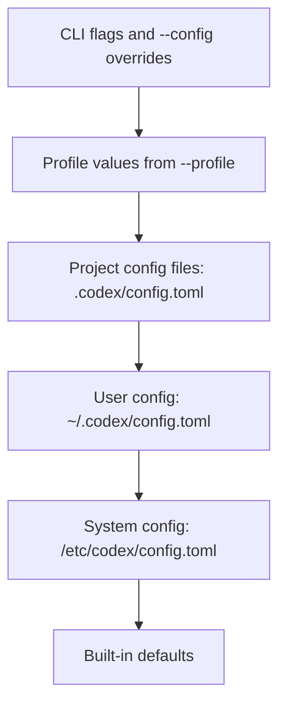

# MCP Server Configuration in Codex CLI

## Overview

Codex CLI supports the Model Context Protocol (MCP), an open standard that connects AI models to external tools and context. This document details how MCP servers are configured when working with Codex CLI, including configuration files, CLI switches, and official documentation references.

---

## Configuration Files

Codex stores MCP configuration in TOML format alongside other Codex settings. The configuration system supports multiple scopes with a clear precedence order.

### Configuration File Locations

| Scope | File Path | Description |
|-------|-----------|-------------|
| **User (Global)** | `~/.codex/config.toml` | Default location for user-level MCP server configuration |
| **Project (Repo)** | `.codex/config.toml` | Project-scoped configuration (requires trusted project) |
| **System** | `/etc/codex/config.toml` | System-wide configuration (Unix only) |

### Configuration Precedence

Codex resolves configuration values in the following order (highest precedence first):



### Important Notes on Project Scope

- Project-scoped `.codex/config.toml` files are **only loaded for trusted projects**
- If a project is marked as **untrusted**, Codex skips project-scoped layers and falls back to user/system defaults
- Project configs can be nested, with the closest config to the current working directory taking precedence

### MCP Servers from Plugins

MCP servers installed via plugins (such as the VS Code extension) share the **same configuration file** (`~/.codex/config.toml`). The CLI and IDE extension share this configuration, meaning:

- Configure an MCP server once, use it everywhere
- Both CLI and extension read from the same TOML file
- Changes require restarting both tools to take effect

> **Note:** There is no separate plugin-specific MCP configuration file. All MCP servers, regardless of how they were introduced, are configured in the same `config.toml` file.

---

## TOML Configuration Structure

### STDIO Servers

STDIO servers run as local processes started by a command:

```toml
[mcp_servers.<server-name>]
command = "npx"                              # Required: Command to start the server
args = ["-y", "@upstash/context7-mcp"]       # Optional: Arguments to pass
env = { "API_KEY" = "your-key" }             # Optional: Environment variables
env_vars = ["VAR1", "VAR2"]                  # Optional: Variables to allow and forward
cwd = "/path/to/working/directory"           # Optional: Working directory
```

### Streamable HTTP Servers

HTTP servers connect to remote URLs:

```toml
[mcp_servers.<server-name>]
url = "https://mcp.example.com/mcp"          # Required: Server address
bearer_token_env_var = "TOKEN_VAR"           # Optional: Env var for bearer token
http_headers = { "X-Header" = "value" }      # Optional: Static HTTP headers
env_http_headers = { "Authorization" = "AUTH_VAR" }  # Optional: Headers from env vars
```

### Common Configuration Options

| Option | Type | Default | Description |
|--------|------|---------|-------------|
| `enabled` | boolean | `true` | Set to `false` to disable without deleting |
| `required` | boolean | `false` | Fail startup if server can't initialize |
| `startup_timeout_sec` | number | `10` | Timeout for server to start |
| `tool_timeout_sec` | number | `60` | Timeout for tool execution |
| `enabled_tools` | array | - | Allow list of tool names |
| `disabled_tools` | array | - | Deny list (applied after `enabled_tools`) |

### Global MCP OAuth Settings

```toml
# Optional OAuth callback overrides
mcp_oauth_callback_port = 5555
mcp_oauth_callback_url = "https://devbox.example.internal/callback"
```

---

## CLI Commands and Switches

### MCP Management Commands

| Command | Description |
|---------|-------------|
| `codex mcp add <name> -- [command]` | Add a new STDIO MCP server |
| `codex mcp add <name> --url <url>` | Add a new HTTP MCP server |
| `codex mcp list` | List all configured MCP servers |
| `codex mcp get <name>` | Show details for a specific server |
| `codex mcp remove <name>` | Remove an MCP server |
| `codex mcp login <name>` | Authenticate with OAuth-based server |
| `codex mcp logout <name>` | Remove OAuth authentication |

### Adding STDIO Servers

```bash
# Basic STDIO server
codex mcp add context7 -- npx -y @upstash/context7-mcp

# With environment variables
codex mcp add myserver --env VAR1=VALUE1 --env VAR2=VALUE2 -- node server.js
```

### Global CLI Switches Affecting MCP

These global flags can be used with any `codex` command:

| Flag | Description |
|------|-------------|
| `-c, --config <key=value>` | Override configuration values (including MCP settings) |
| `-p, --profile <name>` | Use a specific configuration profile |
| `--enable <feature>` | Force-enable a feature flag |
| `--disable <feature>` | Force-disable a feature flag |

### Configuration Override Examples

```bash
# Override an MCP setting for a single invocation
codex -c mcp_servers.myserver.enabled=false

# Use a specific profile with different MCP config
codex --profile work

# Disable an MCP server via CLI
codex -c 'mcp_servers.playwright.enabled=false'
```

### TUI Commands

Within the Codex interactive terminal UI (TUI):

| Command | Description |
|---------|-------------|
| `/mcp` | Display active MCP servers |
| `/permissions` | Switch approval modes |

---

## Example Configurations

### Complete config.toml Example

```toml
# Global settings
model = "gpt-5.4"
approval_policy = "on-request"

# MCP OAuth callback settings (optional)
mcp_oauth_callback_port = 5555

# Context7 - Developer documentation
[mcp_servers.context7]
command = "npx"
args = ["-y", "@upstash/context7-mcp"]

# Playwright - Browser automation
[mcp_servers.playwright]
command = "npx"
args = ["-y", "@playwright/mcp@latest"]

# Filesystem - File operations
[mcp_servers.filesystem]
command = "npx"
args = ["-y", "@modelcontextprotocol/server-filesystem", "/home/user/projects"]

# Figma - Design tool (HTTP with OAuth)
[mcp_servers.figma]
url = "https://mcp.figma.com/mcp"
bearer_token_env_var = "FIGMA_OAUTH_TOKEN"

# Custom server with environment variables
[mcp_servers.custom]
command = "node"
args = ["./server.js"]
cwd = "/path/to/project"

[mcp_servers.custom.env]
API_KEY = "your-api-key"
DEBUG = "true"
```

---

## Official Documentation

The official documentation for MCP support in Codex CLI is available at:

**[https://developers.openai.com/codex/mcp/](https://developers.openai.com/codex/mcp/)**

Additional relevant documentation pages:

| Topic | URL |
|-------|-----|
| Codex CLI Overview | [https://developers.openai.com/codex/cli/](https://developers.openai.com/codex/cli/) |
| Command Line Reference | [https://developers.openai.com/codex/cli/reference/](https://developers.openai.com/codex/cli/reference/) |
| Configuration Basics | [https://developers.openai.com/codex/config-basic/](https://developers.openai.com/codex/config-basic/) |
| Configuration Reference | [https://developers.openai.com/codex/config-reference/](https://developers.openai.com/codex/config-reference/) |
| Sample Config | [https://developers.openai.com/codex/config-sample/](https://developers.openai.com/codex/config-sample/) |

---

## Key Considerations

1. **Shared Configuration**: The CLI and VS Code extension share `~/.codex/config.toml`. A syntax error affects both tools.

2. **Trust Required**: Project-scoped `.codex/config.toml` files are only loaded for trusted projects.

3. **Restart Required**: Changes to MCP configuration require restarting both the CLI and IDE extension to take effect.

4. **STDIO Only for Local**: Codex currently requires local MCP servers to use STDIO transport. Remote HTTP servers are supported via Streamable HTTP.

5. **TOML Format**: Configuration uses TOML syntax, not JSON. Use proper quoting and bracket syntax for arrays and inline tables.
