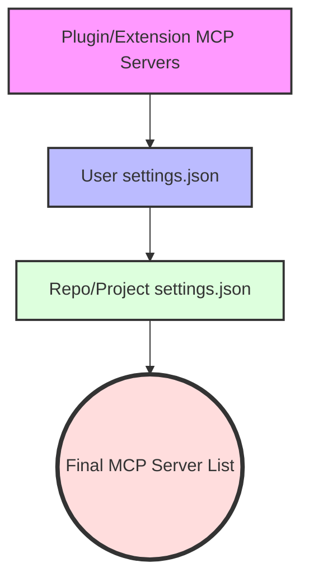

# Gemini CLI - Model Context Protocol (MCP) Configuration

This document outlines how Model Context Protocol (MCP) servers are configured when working with the Gemini CLI.

## Configuration Files and Scopes

MCP servers are configured via a `settings.json` file. The servers are defined within a top-level `mcpServers` object, which specifies connection details (such as the command, URL, or HTTP URL) and optional settings including arguments, environment variables, and tool filters.

The configuration files are separated by scope:

| Scope | File Path | Description |
| :--- | :--- | :--- |
| **User Scope** | `~/.gemini/settings.json` | Global configuration applied to all projects for the current user. |
| **Repo (Project) Scope** | `.gemini/settings.json` | Project-specific configuration located at the root of the repository. |
| **Enablement State** | `~/.gemini/mcp-server-enablement.json` | Tracks the enabled or disabled state of individual servers. |
| **OAuth Tokens** | `~/.gemini/mcp-oauth-tokens.json` | Securely stores OAuth tokens for remote MCP servers. |

### Configuration Precedence

When multiple configuration scopes are involved, the settings are merged. If there are naming conflicts, higher-level settings override lower-level ones:

## Plugins and Extensions

Plugins and extensions can bundle their own MCP servers. 

- **Definition:** These are defined in the `mcpServers` section of their respective `gemini-extension.json` manifest files.
- **Startup:** Bundled servers are loaded automatically when the CLI starts.
- **Precedence:** If a server name defined in an extension conflicts with one defined in a User or Repo `settings.json` file, the configuration in `settings.json` takes precedence.
- **Portability:** Extensions use the `${extensionPath}` variable to portably refer to internal files related to their bundled servers.

## Command Line Interface (CLI) Switches

The Gemini CLI provides the `gemini mcp` command group to manage MCP server configurations directly without manually editing the JSON files.

| Command | Description | Options / Switches |
| :--- | :--- | :--- |
| `gemini mcp add` | Adds a new MCP server configuration. | `-s, --scope` (user/project) `-t, --transport` (stdio/sse/http) `-e, --env` `-H, --header` `--timeout` `--trust` `--description` `--include-tools` `--exclude-tools` |
| `gemini mcp remove <name>` | Removes a server configuration by name. | `-s, --scope` |
| `gemini mcp list` | Displays all configured servers and their connection status. | |
| `gemini mcp enable <name>` | Enables a server. | `--session` (temporary change for the current session only) |
| `gemini mcp disable <name>` | Disables a server. | `--session` (temporary change for the current session only) |

### Session Restrictions

You can restrict which servers are allowed to connect during a single execution session using the main command switch:
`gemini --allowed-mcp-server-names <server_name>`

## Documentation URLs

For more details on MCP support in the Gemini CLI and the Model Context Protocol itself, refer to the following resources:

- **Model Context Protocol (Official Standard):** [https://modelcontextprotocol.io](https://modelcontextprotocol.io)
- **Official MCP Servers List:** [https://github.com/modelcontextprotocol/servers](https://github.com/modelcontextprotocol/servers)
