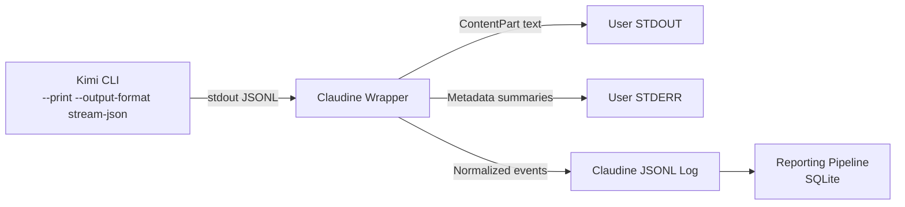

# Strategy for Parsing Kimi Code Stream-JSON Output

## Background

When Kimi Code CLI runs with `--print --output-format stream-json`, it emits
newline-delimited JSON objects to **stdout** using the same event vocabulary as
its Wire protocol (JSON-RPC 2.0). This structured output replaces plain text and
gives Claudine full visibility into session lifecycle, token usage, context
utilization, tool execution, and streaming response fragments — none of which are
available in the default `--output-format text` mode.

This document analyzes the stream-json format and proposes how Claudine should
parse it, what to surface to the user, and how to feed it into the reporting
pipeline.

Sources:

- [Kimi Code CLI reference](https://moonshotai.github.io/kimi-cli/en/reference/kimi-command) — print mode and output-format flags
- [Kimi Code CLI docs](https://moonshotai.github.io/kimi-cli/en/customization/print-mode.html) — print mode behavior
- Local Kimi Code adapter: [kimicode.rs](/Volumes/coding/personal/rusty-biscuit/claudine/lib/src/adapters/kimicode.rs)
- Local event design: [kimi-code.md](/Volumes/coding/personal/rusty-biscuit/claudine/docs/hook-designs/kimi-code.md)
- Local CLI reference: [kimi-code.md](/Volumes/coding/personal/rusty-biscuit/claudine/docs/agent-cli/kimi-code.md)

---

## Event Types

Kimi Code's stream-json output emits the same 15 Wire protocol event types.
In print mode (non-interactive), only **notifications** appear — the two blocking
request types (`ApprovalRequest`, `ToolCallRequest`) are not emitted because
`--print` implicitly enables `--yolo` (auto-approves all tool calls).

### Notification Events (expected in stream-json)

| Event | When | Key Payload Fields |
|-------|------|-------------------|
| `TurnBegin` | Start of agent turn | `user_input` |
| `TurnEnd` | Clean end of turn | `{}` (empty) |
| `StepBegin` | Step starts within turn | `n` (1-based step index) |
| `StepInterrupted` | Step was interrupted | `{}` (empty) |
| `CompactionBegin` | Context compaction starting | `{}` (empty) |
| `CompactionEnd` | Context compaction complete | `{}` (empty) |
| `StatusUpdate` | Token/context telemetry | `context_usage`, `token_usage` |
| `ContentPart` | Streaming response fragment | `type`, `text`/`encrypted`/url fields |
| `ToolCall` | Tool invocation signal | `type`, `id`, `function.name`, `function.arguments` |
| `ToolCallPart` | Streaming tool arguments | `id`, `function.arguments` (fragment) |
| `ToolResult` | Tool execution result | `tool_call_id`, `return_value.is_error`, `return_value.output` |
| `ApprovalResponse` | Approval resolved | `approval_id`, `decision` |
| `SubagentEvent` | Nested subagent event | `subagent_nested_event_type`, nested payload |

### Event Envelope

Each JSONL line uses one of two envelope shapes:

```json
{"event_name": "StatusUpdate", "context_usage": {...}, "token_usage": {...}}
```

or with a nested `payload`:

```json
{"event_name": "ContentPart", "payload": {"type": "text", "text": "Here is..."}}
```

The adapter already handles both shapes — fields may appear at the top level or
nested under `payload`.

---

## Key Payload Structures

### StatusUpdate (token and context telemetry)

```json
{
  "event_name": "StatusUpdate",
  "context_usage": { "used": 8000, "total": 128000 },
  "token_usage": {
    "input_other": 500,
    "output": 300,
    "input_cache_read": 7000,
    "input_cache_creation": 200
  }
}
```

- `context_usage` reports context window utilization (may also be a float 0–1)
- `token_usage` has four components that sum to full usage:
  - `input_other`: non-cached input tokens
  - `output`: output tokens
  - `input_cache_read`: cached prompt tokens consumed
  - `input_cache_creation`: new cache tokens written
- May appear multiple times per session (updated after each model call)

### ContentPart (streaming response)

```json
{
  "event_name": "ContentPart",
  "payload": {
    "type": "text",
    "text": "Here is the architecture overview..."
  }
}
```

Variants by `type`:

| `type` | Fields | Description |
|--------|--------|-------------|
| `text` | `text` | Plain assistant text |
| `think` | `text`, optional `encrypted` | Reasoning/thinking content |
| `image_url` | `url` | Generated or referenced image |
| `audio_url` | `url` | Audio content |
| `video_url` | `url` | Video content |

### ToolCall

```json
{
  "event_name": "ToolCall",
  "payload": {
    "type": "function",
    "id": "tc_abc123",
    "function": {
      "name": "Shell",
      "arguments": "{\"command\": \"cargo test\"}"
    }
  }
}
```

### ToolResult

```json
{
  "event_name": "ToolResult",
  "payload": {
    "tool_call_id": "tc_abc123",
    "return_value": {
      "is_error": false,
      "output": "All 42 tests passed.",
      "message": "Tests passed successfully",
      "display": [{"type": "shell", "language": "sh", "command": "cargo test"}]
    }
  }
}
```

---

## What to Display to the User

### STDOUT: The Response

STDOUT should contain **only the assistant's text response**. Extract text from
`ContentPart` events where `payload.type == "text"`, concatenating fragments in
arrival order.

```
Extraction rule:
event_name == "ContentPart" AND payload.type == "text"
→ concatenate all payload.text values
```

This keeps compose pipelines clean: the captured output is the document body,
nothing else.

### STDERR: Session Metadata & Diagnostics

STDERR is where Claudine should surface operational information. This is
displayed to the user (not captured by compose) and provides immediate diagnostic
value.

#### On Session Start (from `TurnBegin`)

```text
  Kimi Code | Turn started
```

Kimi does not emit a standalone `init` event like Claude or Gemini. The first
`TurnBegin` serves as the session start signal. Model and auth info are not
available from the stream itself — Claudine may augment this from wrapper config
(the `--model` flag or `KIMI_MODEL_NAME` env var).

#### On Tool Activity (from `ToolCall` / `ToolResult`)

Do not print every tool event by default. Instead:

- Collect tool events in memory
- Optionally print them in verbose mode
- Always feed them into logging metadata

#### On StatusUpdate (token telemetry)

In verbose mode only:

```text
  Context: 8,000 / 128,000 (6.3%) | Tokens: 7,700 in → 300 out
```

#### On Completion (from `TurnEnd` + last `StatusUpdate`)

```text
  Duration: 12.3s | Tokens: 7,700 in → 300 out (cache: 7,000 read, 200 created)
```

Key fields to surface:
- **Token usage** from the last `StatusUpdate`: input/output/cache breakdown
- **Context utilization**: how much of the context window was consumed
- **Duration**: Claudine must track wall-clock time since Kimi does not emit it

Display only when not `--silent`. When `--quiet`, show a single summary line.

---

## Enhancing the Logging Pipeline

### What Stream-JSON Adds

The `StatusUpdate` and `ContentPart` messages contain data that is currently
**unavailable** to the reporting pipeline for non-interactive Kimi sessions:

| Data | Current Source | Stream-JSON Source |
|------|---------------|-------------------|
| Token usage | Hook events (if provider emits them) | `StatusUpdate.token_usage` — always present |
| Context utilization | Not available for wrapped sessions | `StatusUpdate.context_usage` |
| Cache efficiency | Not available | `token_usage.input_cache_read` / `input_cache_creation` |
| Tool timeline | Hook events only | `ToolCall` / `ToolResult` events with IDs |
| Streaming content | Not available | `ContentPart` events |
| Error classification | Exit code only | `ToolResult.return_value.is_error` |
| Step count | Not available | `StepBegin.n` |
| Compaction events | Not available | `CompactionBegin` / `CompactionEnd` |

### Proposed Integration



#### 1. Parse Events into Existing Adapter

The `KimiCodeAdapter` already parses all 15 event types and normalizes token
usage. For stream-json parsing in the wrapper, reuse this adapter directly
rather than building a separate parser. The adapter handles both top-level and
`payload`-nested field layouts.

#### 2. Accumulate State Across the Stream

Unlike Claude and Gemini, Kimi does not emit a single `result` event with
aggregate stats. Instead, `StatusUpdate` events arrive throughout the session
with running totals. The wrapper should:

- Track the **last** `StatusUpdate` as the authoritative usage snapshot
- Accumulate `ContentPart` text fragments for the final response
- Correlate `ToolCall` → `ToolResult` by `id` / `tool_call_id` for tool timeline
- Record `StepBegin.n` to count steps

#### 3. Synthesize a Session-End Event for Reporting

After the wrapped Kimi session completes (child process exits), write one
synthetic Claudine JSONL event:

```json
{
  "provider": "kimi_code",
  "event": "session_end",
  "session_id": null,
  "extra": {
    "model": "kimi-k2",
    "token_usage": {
      "total": 8000,
      "input": 7700,
      "output": 300,
      "cache_read": 7000,
      "cache_write": 200
    },
    "raw_token_usage": {
      "input_other": 500,
      "output": 300,
      "input_cache_read": 7000,
      "input_cache_creation": 200
    },
    "context_usage": { "used": 8000, "total": 128000 },
    "steps": 3,
    "tool_calls": 2,
    "duration_ms": 12345,
    "stream_source": "stream-json"
  }
}
```

Normalized token mapping:

| Claudine key | Kimi source |
|-------------|-------------|
| `token_usage.input` | `input_other + input_cache_read + input_cache_creation` |
| `token_usage.output` | `output` |
| `token_usage.total` | `input + output` |
| `token_usage.cache_read` | `input_cache_read` |
| `token_usage.cache_write` | `input_cache_creation` |

This normalization already exists in `capture_kimi_usage()` in the adapter.

---

## Comparison with Other Providers

| Feature | Claude | Gemini/Qwen | Codex | **Kimi** |
|---------|--------|-------------|-------|----------|
| Session init event | `system.init` | `init` | `thread.started` | `TurnBegin` (no model/version) |
| Response streaming | `assistant.message.content[]` | `message` deltas | `item.completed` | `ContentPart` fragments |
| Token usage | `result.usage` | `result.stats` | `turn.completed.usage` | `StatusUpdate.token_usage` |
| Cost reporting | `result.total_cost_usd` | Not available | Not available | Not available |
| Context utilization | Not available | Not available | Not available | `StatusUpdate.context_usage` |
| Duration | `result.duration_ms` | `result.stats.duration_ms` | Not available | Not emitted (wrapper tracks) |
| Aggregate result | Single `result` event | Single `result` event | `turn.completed` | No aggregate — use last `StatusUpdate` |
| Tool timeline | Via hooks only | `tool_use` / `tool_result` | `item.completed` | `ToolCall` / `ToolResult` with IDs |
| Error event | `assistant.error` | `error` / `result.error` | `turn.failed` | `StepInterrupted` / `ToolResult.is_error` |

### Key Difference: No Aggregate Result Event

Kimi is the only provider that does **not** emit a final summary event. The
wrapper must synthesize this from accumulated state. This is a minor complexity
cost but gives Claudine the same end result.

### Unique Advantage: Context Utilization

Kimi is the **only** provider that reports context window utilization in its
stream output. This enables Claudine to:

- Warn when context usage exceeds a threshold (e.g., 80%)
- Surface context pressure in compose pipelines that chain multiple prompts
- Track context efficiency across sessions in reporting

---

## Implementation Notes

### Kimi Wrapper Profile Changes

The `KimiWrapper` in `profile.rs` needs these additions:

1. **`prepare_captured_output()`** — inject `--output-format stream-json` into
   args when wrapping non-interactive runs (unless the caller explicitly
   requested a different output format)

2. **`parse_captured_output()`** — extract concatenated `ContentPart` text from
   the JSONL stream as the response body

3. **`apply_output_format()`** — map Claudine's universal `--output` flag to
   Kimi's `--output-format` flag

### Print Mode Behavioral Notes

- `--print` implicitly enables `--yolo` — all tool calls are auto-approved
- No `ApprovalRequest` events will appear in stream-json output
- `--final-message-only` suppresses intermediate tool output but still emits
  JSONL events when combined with `--output-format stream-json`
- Prompt delivery uses **stdin** (not args), same as Claude

### What NOT to Parse

- `ToolCallPart` fragments: these are streaming argument chunks that the adapter
  already maps to `BeforeTool`. For logging, only the completed `ToolCall` and
  `ToolResult` matter.
- `SubagentEvent` nested payloads: these contain recursive event streams from
  Task-spawned subagents. Log the wrapper event but do not recurse into the
  nested payload for reporting.
- `ApprovalResponse`: informational only in print mode (approvals are
  auto-granted). Log but do not surface.

### Output-Mode Rules

| User intent | Wrapper behavior |
|------------|------------------|
| Default wrapped non-interactive Kimi run | Force internal `stream-json`, parse it, print assistant text to stdout |
| Explicit `--output text` | Respect request, skip forced stream parsing |
| Explicit `--output json` | Respect request, pass through JSONL unchanged |
| Explicit `--output stream` | Pass through raw JSONL unchanged |

---

## Recommended Implementation Order

1. Add `apply_output_format()` to `KimiWrapper` to map Claudine's `--output`
   flag to Kimi's `--output-format` flag.
2. Add `prepare_captured_output()` to inject `--output-format stream-json` for
   default non-interactive runs.
3. Add a Kimi-specific stream parser in the wrapper layer that:
   - Accumulates `ContentPart` text fragments
   - Tracks the latest `StatusUpdate` for token/context usage
   - Correlates `ToolCall` → `ToolResult` by ID
   - Records step count from `StepBegin`
4. Add `parse_captured_output()` to extract the accumulated response text.
5. Write one synthetic Claudine JSONL event at session end using the accumulated
   state.
6. Add stderr summaries for turn start, completion, and errors.

---

## Summary

Kimi Code's `--output-format stream-json` gives Claudine the same class of
metadata that Claude's and Gemini's structured outputs provide, but with a
different shape:

1. **Token visibility** — per-session token breakdown with four-component
   granularity (non-cached input, output, cache read, cache write)
2. **Context pressure** — unique among all providers, Kimi reports context
   window utilization, enabling proactive warnings
3. **Tool timeline** — full tool call/result correlation by ID for non-interactive
   runs
4. **No aggregate event** — unlike other providers, Kimi requires accumulating
   state across `StatusUpdate` events rather than reading a single result

The right approach matches the other providers: consume stream-json inside the
wrapper, keep stdout clean for the assistant response, surface compact
diagnostics on stderr, and persist one normalized synthetic event into Claudine's
existing logging/reporting pipeline. The existing `KimiCodeAdapter` already
handles event parsing and token normalization — the gap is wrapper-side stream
interception and state accumulation.
