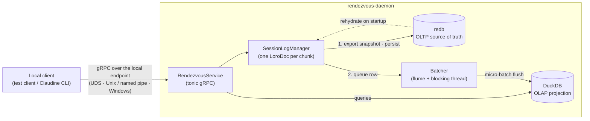
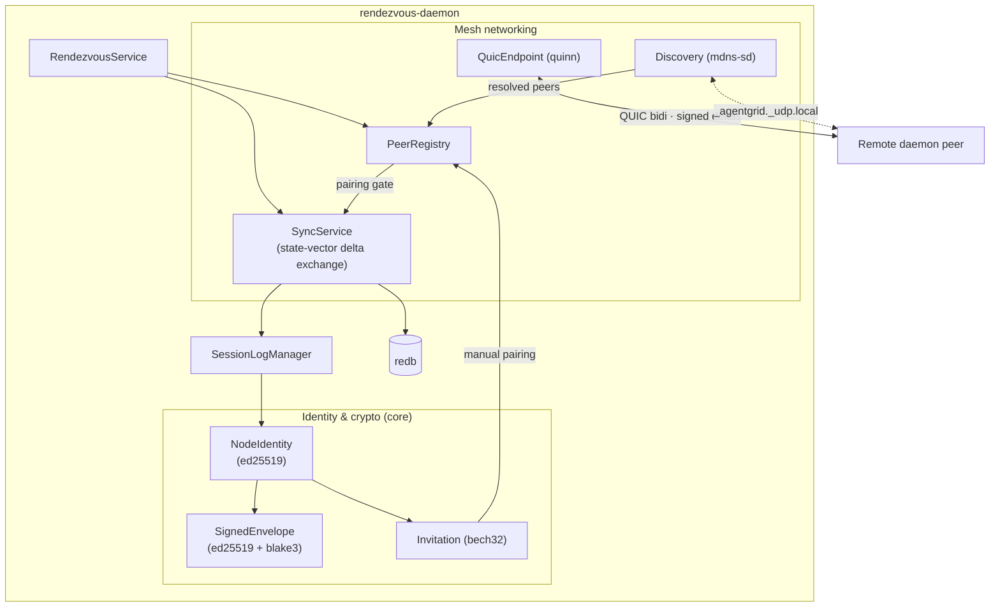

# Rendezvous — Current State

> **Naming note.** This package was originally specced as **`remote-signal`**
> (see `claudine/features/_completed/2026-05-24-remote-signal/spec.md`). It has
> since been renamed to **`rendezvous`**. The crates, binaries, endpoint env
> vars, and mDNS service labels all use the new name; some research docs under
> `claudine/docs/research/rendezvous/` still carry the old phrasing in prose.

> **Local IPC.** The local control plane described below is documented
> authoritatively in [`local-ipc.md`](./local-ipc.md) — transport selection,
> per-user ownership, overrides, permissions, and the threat boundary. This
> document summarizes; that one governs.

This document is an orientation for anyone picking the package back up after a
gap. It answers four questions: what Rendezvous is *for*, what is *actually
built today*, how the pieces *fit together*, and where it should *go next*.
It is deliberately grounded in the code as it stands in `claudine/rendezvous/`,
not in the aspirational spec.

## 1. The Big Picture

Rendezvous is a **long-running companion daemon for the Claudine CLI**. Claudine
itself is session-scoped — it wraps a single agentic-CLI invocation, fires hooks,
and exits. Anything that has to outlive a session, run in the background, or span
multiple machines does not fit that model. Rendezvous is the home for that work.

The README frames four eventual responsibilities for the daemon:

1. **Logging** — durable, queryable capture of agentic-CLI session activity
   (Claudine wrapped sessions, unwrapped CLI/app sessions found by process
   monitoring, and repo-commit context). See `rendezvous/docs/logging.md`.
2. **Scheduling & Queuing** — background and deferred work.
3. **Dreaming** — background synthesis over memory files.
4. **Remote Execution & Interaction** — sending work (non-interactive prompts,
   cross-OS test runs) to other nodes in a mesh and shipping results back.

Underneath all four sits one architectural bet: a **local-first, peer-to-peer
mesh** in which each node owns its own data, replicates it to *explicitly
paired* peers using **CRDTs** (so there is no central server and no merge
master), and authenticates every byte that crosses the network with
**per-node Ed25519 signatures**. Eventual consistency across paired nodes is
the consistency model; the network is treated as untrusted.

The first milestone — the one that is built — is the **Session-log POC**: prove
the foundational mesh primitives (durable CRDT storage, identity, signed
envelopes, discovery, explicit pairing, and delta sync between two paired nodes)
on one concrete document type, the session log. Compute jobs, scheduling,
dreaming, and production Claudine log ingestion were all explicitly **out of
scope** for this first pass and remain unbuilt.

## 2. What Is Implemented Today

The POC is **complete and end-to-end testable**. The work landed across six
phases (the phase numbers appear throughout the module doc-comments):

| Phase | Capability | Where |
|-------|-----------|-------|
| 1 | gRPC control plane over the platform's local endpoint (`Ping`, `Status`) | `core/proto`, `daemon/src/{server,service}.rs`, `daemon/src/local_transport/`, `client/` |
| 2 | Session-log persistence: Loro per-chunk docs → redb (source of truth) → DuckDB projection via a flume micro-batcher | `daemon/src/{session_log,storage,projection,batcher}.rs` |
| 3 | Persistent node identity (Ed25519 seed on disk, owner-only perms) | `core/src/identity.rs` |
| 4 | QUIC transport (quinn + rustls/rcgen self-signed cert) | `daemon/src/quic.rs` |
| 5 | Direct-sync engine: symmetric state-vector exchange + signed deltas | `daemon/src/sync.rs`, `core/src/sync.rs`, `core/src/envelope.rs` |
| 6 | mDNS discovery, explicit pairing, full two-node convergence + demo | `daemon/src/{discovery,peers}.rs`, `scripts/poc-demo.sh` |

### Technical features

- **Crate split** (three crates):
  - `rendezvous-core` — protobuf schema + generated tonic stubs, node identity,
    signed envelopes, invitations, the session-log document model, the sync wire
    format, and the typed `LocalEndpoint` contract. Persistence-agnostic, and
    performs no filesystem mutation.
  - `rendezvous-daemon` — the service: gRPC server, Loro/redb/DuckDB stack,
    QUIC endpoint, mDNS discovery, peer registry, and the sync engine. Owns
    endpoint and data-root authorization, listener setup, and cleanup.
  - `rendezvous-client` — a thin gRPC test client (binary
    `rendezvous-test-client`) plus one portable `connect(&LocalEndpoint)`
    helper. Explicitly *not* throwaway: it is the integration-test and CI
    smoke-check driver and the connection path used by the claudine lifecycle
    `requeue(...)` control action.

- **IPC control plane** (`Rendezvous` gRPC service over the platform's local
  IPC transport — a Unix-domain stream socket on macOS/Linux/WSL, a named pipe
  on native Windows; both implemented and runtime-tested). Implemented RPCs:
  `Ping`, `Status`, `AppendEntry`, `ListChunkEntries`, `ListSessionChunks`,
  `QueryProjection`, `CreateInvitation`, `ConnectToPeer`, `ListPeers`,
  `ApprovePeer`, `RevokePeer`, `ListPairings`, `SyncWithPeer`.

  The endpoint is **per stable OS user** — the effective UID on Unix, the
  process token's account SID on Windows, never a username. Resolution is
  `RENDEZVOUS_ENDPOINT` → the per-user default:
  `$XDG_RUNTIME_DIR/claudine/rendezvous/daemon.sock` where the runtime
  directory is usable, otherwise
  `<tempdir>/claudine-rendezvous-uid-<uid>/daemon.sock` on Unix, and
  `\\.\pipe\claudine-rendezvous-sid-<sid>` on Windows. There is no username,
  `default`, or random fallback: failure is typed. Full contract in
  [`local-ipc.md`](./local-ipc.md).

- **Session-log document model** (`core/src/session_log.rs`):
  - Deterministic chunk identity:
    `session/{owner_node_id}/{session_id}/part/{chunk_index}`.
  - Generic entry schema: `sequence`, `created_at`, `source`, `level`,
    `message`, optional JSON metadata.
  - Deterministic, testable chunk rotation on entry-count
    (`DEFAULT_MAX_ENTRIES_PER_CHUNK = 64`) or coarse byte estimate
    (`DEFAULT_MAX_BYTES_PER_CHUNK = 16 KiB`).

- **CQRS persistence stack:**
  - **redb (OLTP, authoritative):** one Loro snapshot per chunk, a session→chunk
    catalog, the pairings table, an accepted-envelopes table (durable replay
    protection keyed `sender:message_id`), and an outbound message-ID counter.
    Local writes are acknowledged **only after** the snapshot is durable in redb.
  - **Loro (CRDT):** one `LoroDoc` per active chunk; append stages into a clone,
    exports a snapshot, persists, then swaps into live state. State rehydrates
    from redb on startup (sequence counters and active-chunk pointers survive a
    crash).
  - **DuckDB (OLAP, derived/lossy/lagging):** columnar projection fed by a flume
    micro-batcher on a dedicated blocking thread (flush every 200ms or 500 rows).
    A `UNIQUE(chunk_id, sequence)` constraint makes projection idempotent across
    repeated syncs. An `--in-memory-projection` mode exists for tests.

- **Identity & cryptography:**
  - `NodeIdentity` — long-lived Ed25519 keypair; the hex-encoded public key is
    the stable `node_id`. Secret seed persisted to an owner-only file.
  - `SignedEnvelope` — binds payload + sender public key + BLAKE3 content hash +
    monotonic message ID + document ID + payload kind (snapshot vs delta) under
    one Ed25519 signature. `EnvelopeInbox` adds in-process replay protection.

- **Pairing & trust:** explicit pairing only. `ApprovePeer`/`RevokePeer` persist
  pairings in redb. The sync engine rejects any peer whose `node_id` is not in
  the pairings table *before* touching session-log data. Discovery alone never
  authorizes data exchange.

- **Invitations** (`core/src/invitation.rs`): bech32m strings (HRP `rs`)
  bundling a node's public key + advertised QUIC socket address, for manual
  out-of-band pairing. Versioned wire format.

- **Mesh networking:**
  - **QUIC** (`quinn`): one bidirectional endpoint per process (accepts inbound
    and dials outbound). TLS uses a self-signed cert; the client side is
    intentionally permissive because peer authenticity is enforced by the
    signed-envelope layer, not the transport.
  - **mDNS** (`mdns-sd`): advertises/browses `_agentgrid._udp.local` with the
    `node_id` in a TXT record.
  - **Peer registry:** indexes peers by `node_id`, tracks source
    (mDNS / manual / inbound) and connection state.

- **Direct-sync protocol** (`SYNC_PROTOCOL_VERSION = 1`): two paired daemons
  exchange Loro state vectors over a QUIC bidi stream and push only the deltas
  the other side is missing. Symmetric (both advertise before reading), so one
  round-trip converges. Frames are length-prefixed `SyncFrame` protobufs
  (`MAX_FRAME_LEN = 16 MiB`); deltas travel inside signed envelopes verified on
  receipt.

### Functional features (the POC acceptance criteria, all met)

The integration suite (`daemon/tests/`) and `scripts/poc-demo.sh` demonstrate:

- Two paired nodes append independently and **converge** on the same entry set
  after a direct sync (`paired_daemons_converge_after_direct_sync`,
  `two_nodes_converge_across_namespaces`).
- Deterministic chunk IDs and rotation propagating through sync
  (`chunk_rotation_creates_new_chunk_at_threshold`,
  `chunk_rotation_propagates_through_sync`).
- A discovered-but-unpaired mDNS peer **cannot** sync until approved
  (`real_mdns_discovered_peer_cannot_sync_before_approval`,
  `sync_is_rejected_when_pairing_is_missing`,
  `sync_fails_when_only_one_side_is_paired`).
- Crash recovery: a restarted daemon replays redb state and resumes sync
  (`restart_replays_state_and_resumes_sync`,
  `crash_recovery_replays_accepted_envelope`).
- redb authoritative / DuckDB rebuildable + idempotent
  (`append_persists_to_redb_and_eventually_to_duckdb`,
  `projection_is_idempotent_across_repeated_syncs`).
- Real two-daemon mDNS discovery and manual-invitation pairing
  (`real_two_daemons_discover_each_other_via_mdns`,
  `two_daemons_connect_via_manual_invitation`).
- Namespace ownership enforcement (`paired_peer_cannot_write_foreign_namespace`).

The daemon binary (`rendezvous-daemon`) accepts `--endpoint`
(`RENDEZVOUS_ENDPOINT`), `--data-dir` (`RENDEZVOUS_DATA_DIR`), `--repo-root`,
`--in-memory-projection`, `--quic-bind`, `--no-mdns`, and `--no-networking`.

### Per-user ownership (2026-07 local-IPC fix)

Endpoint, node identity, and durable data now resolve to the same stable OS
user. The default data root is the platform-local data directory
(`<local-data-dir>/claudine/rendezvous`), holding `node.key`, `session.redb`,
and `projection.duckdb`; the legacy `<tempdir>/rendezvous-data` root is neither
selected nor read, because a shared temp directory is not an ownership boundary
and a node identity found there could have been planted by any local user.

Both the Unix runtime directory and the data root go through one
private-directory contract: owner-only (`0700`, applied by `mkdir(2)` itself) on
Unix, a protected current-user DACL applied at `CreateDirectoryW` time on
Windows. An override changes the location, not the policy. See
[`local-ipc.md`](./local-ipc.md).

## 3. High-Level Architecture

### Local interaction (single host)

A local client (the test client, and the Claudine CLI's dashboard/requeue/hook
and session-reporting call sites) drives the daemon over the platform's local
endpoint using gRPC — a Unix-domain socket on macOS/Linux/WSL, a named pipe on
Windows. The daemon owns all heavy storage and network I/O so the client stays
lightweight and responsive.

### Distributed interaction (mesh)

Identity and crypto wrap everything that leaves the host. Discovery and
invitations feed the peer registry; pairing gates the sync engine; sync moves
signed Loro deltas over QUIC and writes them back through the same redb path.

### Key invariants worth remembering

- **redb is authoritative; DuckDB is disposable.** Sync and replay read redb.
  DuckDB may lag and can be rebuilt from redb.
- **Acknowledge-after-durable.** A local append is acked only once its snapshot
  is in redb.
- **Discovery ≠ authorization.** mDNS/invitations only populate the registry;
  pairing is the gate to data exchange.
- **The network is untrusted.** Every applied payload is a verified
  `SignedEnvelope`; bad signatures, unknown senders, duplicate message IDs, and
  hash mismatches are rejected before mutating local state.

## 4. Next Steps

The foundational mesh is proven. The work from here splits into *hardening the
foundation*, *integrating Claudine*, and *building out the four product
pillars*.

### A. Connect Claudine to the daemon (highest leverage)

The whole point of the daemon is to serve Claudine, and that link does not exist
yet. `rendezvous/docs/logging.md` already sketches the contract:

- Claudine CLI emits START/STOP events for each wrapped session and one event
  per provider hook, via gRPC to the daemon (Claudine's events arrive first and
  enrich the agent's own conception of start/stop).
- Capture the Claudine PID **and** the child agent PID, plus repo name, git
  cloud provider, and remote URL, on each process start/stop.
- Wire `claudine logs …` query commands through the daemon's `QueryProjection`
  path instead of (or alongside) today's local JSONL→SQLite index.

This requires turning the generic POC entry schema into a real
agentic-session log model and giving Claudine a daemon client (the client's
portable `connect(&LocalEndpoint)` is the seed, and already carries the
dashboard, requeue, hook-forwarding, and session-reporting call sites). Note the
related repo-wide `feature-fix-lifecycle` spec explicitly **defers** its
"closure event into the claudine daemon's database" until this logging
refactor lands — so this unblocks work beyond Rendezvous itself.

### B. Harden the mesh foundation

- **TLS / transport trust.** The QUIC client currently accepts any cert. Decide
  the long-term posture (pin to the advertised node key, mutual auth, etc.)
  now that the envelope layer proves the model works.
- **`web-transport` vs raw `quinn`.** The spec called for `web-transport`
  (browser/WASM path); the POC uses `quinn` directly and the `ts-client/`
  directory is empty. Revisit if/when a browser or TS client is wanted.
- **Sync abstraction → gossip.** Direct paired-peer sync is the only backend.
  The deferred decision between `foca` and `plumtree` becomes relevant once
  there are 3+ peers and broadcast efficiency matters.
- **WAN bootstrap.** mDNS is LAN-only. The spec's `axum` HTTPS/WebSocket
  signaling server for cross-network discovery is unbuilt.
- **Process monitoring.** `logging.md` wants the daemon to poll host processes
  on an interval to catch unwrapped agent CLIs/apps and answer "what sessions
  are active right now?" — none of this exists yet.

### C. Build out the product pillars (each its own feature)

All four README pillars beyond a bare session log are greenfield; the topic docs
(`compute.md`, `crdt.md`, `dreaming.md`, `remote-execution.md`,
`scheduling-and-queuing.md`) are currently empty placeholders:

- **Node capabilities & current state** — advertise OS/GPU/RAM/cores and live
  status (checked-out repos, CPU load) as a locally-written, globally-read Loro
  map. This is the prerequisite for any compute routing.
- **Compute jobs / agentic grid** — create and assign idempotent jobs across the
  mesh (non-interactive prompts, cross-OS test runs) under an AP consistency
  model.
- **Scheduling & queuing** and **Dreaming** — background/deferred work and memory-file
  synthesis.

### Suggested sequencing

1. **First:** flesh out the empty topic docs into real designs (capabilities,
   compute, logging contract) so the product direction is written down before
   more code lands.
2. **Then:** Claudine ↔ daemon logging integration (Section A) — it is the
   nearest-term user-visible win and unblocks other repo work.
3. **In parallel / as needed:** transport-trust hardening (Section B) before any
   real cross-machine deployment.
4. **Later:** capabilities → compute grid → gossip, in that dependency order.
