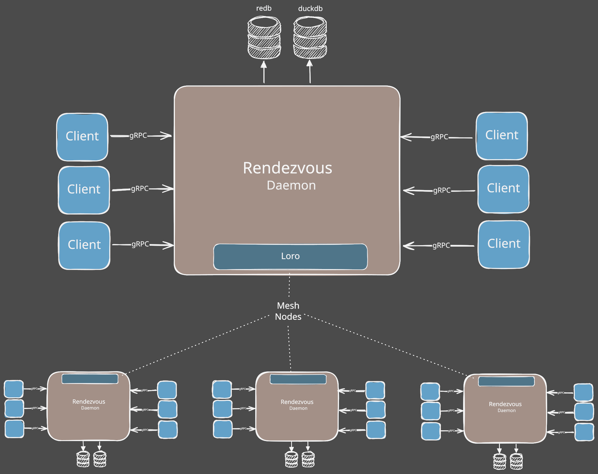

## High Level Architecture

The two modes of _interaction_ that take place with the **rendezvous** daemon are:

1. **gRPC** API
    - allows clients to communicate locally, on the same host system, with the **rendezvous** daemon
    - gRPC messaging is done over Unix domain **sockets** (macOS, Linux, WSL) and **named pipes** (Windows)
    - provides a strongly typed RPC protocol for clients and the daemon to communicate in near real-time
    - the endpoint is per **stable OS user** — the effective UID on Unix, the process token's account SID on Windows — so one account's daemon, identity, and data root all share one owner, and other non-privileged users cannot reach them
    - clients reach it through one portable `rendezvous_client::connect(&LocalEndpoint)`; the daemon binds it through one portable `spawn_local_server`
    - **see [`local-ipc.md`](./local-ipc.md) for the authoritative contract**: transport selection, endpoint resolution and overrides, Unix permissions and cleanup, the Windows DACL and accept behavior, WSL separation, the client error/retry vocabulary, and the threat boundary
    
2. **CRDT** syncing over Mesh Network
    - **rendezvous** daemons can communicate to other **rendezvous** daemons (on other hosts)
    - this is done over a mesh network:
        - `loro` crate provides the foundation of the CRDT implementation
    - The mechanism of ensuring "eventual consistency" across all daemons is achieved through CRDT Delta Syncing

### Storage

The **redenezvous** daemon uses two types of durable storage:

- `redb` - a high speed, rust native KV database
- `duckdb` - a columnar analytic database which is used for reporting trends

### Clients

The primary _client_ application is of course **Claudine** but other client types can also connect including:

- `debugger` is an app we created to interactively check into the state of a rendezvous node
  - this is only meant to be used internally to understand state and debug problems during development
- `agent-tail` is run on host to _tail_ the log files of all the CLI agents installed on the host system
  - this agent type is automatically spawned by **rendezvous** at startup
  - it will create a client for every file based agentic log source the host has
  - it will then tail the log file and *transform* the proprietary log entries to the canonical `ClaudineAgenticLog` format
  - the 

#### Other Mesh Services

- `git-listener` sets up a listener for git callback events (`pr`, `ci`, `commit`)
  - when a callback is received, it converts the propriety event format to a canonical form
  - using the canonical payload it passes it into the Mesh
  - these nodes are lightweight and do not have any local storage
    - their "state" will be recorded by `rendezvous` nodes
      - if no `rendezvous` nodes are 

- `project-listener` 

## gRPC API Surface

The API surfaces is broken into the following areas:

### Ingress

1. Session Wrapper and Hook Events
   - called by **Claudine** to provide session wrappers and hook events
     - the official "sessions" are handled by the Agent CLI 
     - and a lot of the data we need for sessions will come via the Log Ingest API endpoints
     - however, when **Claudine** wraps a CLI it provides useful metadata 
2. Log Ingest
   - called by **agent-tail** and **db-agent** clients to add and update new log events
3. Git Events (FUTURE)
   - 
   - passes events into **rendezvous** in canonical form
4. Project Events (FUTURE)

### Query Interface

1.
