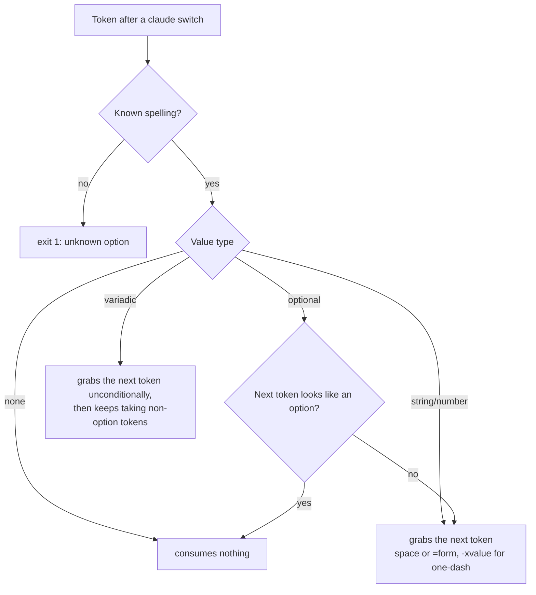

# Claude Code CLI Surface

## Overview

Claude Code is Anthropic's official agentic coding CLI. The public terminal command is `claude`: running `claude` starts an interactive session, `claude "query"` starts an interactive session with an initial prompt, and `claude -p "query"` runs print/SDK mode, answers, and exits. A wrapper that wants one-shot execution always names `-p`/`--print`; nothing else is safe to assume.

The verified version for this research is `2.1.287`. It was verified on 2026-10-01 three ways: local `claude --version` printed `2.1.287 (Claude Code)`; `claude doctor` reported `Running: native (2.1.287)` from `/Users/ken/.local/share/claude/versions/2.1.287`; and `npm view @anthropic-ai/claude-code version dist-tags --json` reported `latest: 2.1.287` and `stable: 2.1.285`. The CLI is closed source; there is no public source repository, so the argument parser was characterized from its error output and disposable runs rather than from declarations in source.

The binary embeds a **commander.js** argument parser. Its error format (`error: option '--output-format <format>' argument 'bogus' is invalid. Allowed choices are text, json, stream-json.`), its `argument missing` errors, and its help rendering (`-h, --help  Display help for command`, `(default: ...)`) are all commander's. The placeholder grammar in help is therefore the parser's own declaration: `<x>` takes one required value, `[x]` takes one optional value, and `<x...>` takes a variadic list.

Primary links:

| Resource | URL |
| --- | --- |
| Homepage | [https://claude.ai/code](https://claude.ai/code) |
| Repository | none; the CLI is closed source |
| General docs | [https://code.claude.com/docs/en/overview](https://code.claude.com/docs/en/overview) |
| CLI reference | [https://code.claude.com/docs/en/cli-reference](https://code.claude.com/docs/en/cli-reference) |

## Installation and Binaries

The installed macOS command is `/Users/ken/.local/bin/claude`, a native-installer symlink into `/Users/ken/.local/share/claude/versions/`; `claude doctor` identifies it as a native darwin-arm64 build on the `latest` auto-update channel. Native and npm installs both ship a per-platform native binary — the npm package pulls it through an optional dependency such as `@anthropic-ai/claude-code-darwin-arm64`, and the installed `claude` does not invoke Node at runtime.

| OS | Binary | Alternate shims | Install methods |
| --- | --- | --- | --- |
| macOS | `claude` | none observed | Native installer, Homebrew cask, npm |
| Linux | `claude` | none documented | Native installer, apt, dnf, apk, npm |
| Windows | `claude.exe` | `claude`, npm shims such as `claude.cmd` | Native PowerShell/CMD installer, WinGet, npm |

Official install commands:

```sh
curl -fsSL https://claude.ai/install.sh | bash            # macOS, Linux, WSL
irm https://claude.ai/install.ps1 | iex                    # Windows PowerShell
brew install --cask claude-code                            # stable channel
brew install --cask claude-code@latest                     # latest channel
winget install Anthropic.ClaudeCode
sudo apt install claude-code
sudo dnf install claude-code
apk add claude-code
npm install -g @anthropic-ai/claude-code
```

The apt, dnf, and apk commands require adding Anthropic's signed package repository first; each offers `stable` and `latest` channels. The native installer accepts a channel or version argument (`curl -fsSL https://claude.ai/install.sh | bash -s stable`). Native installs auto-update in the background; Homebrew, WinGet, apt, dnf, and apk installs do not, though Homebrew and WinGet can opt in with `CLAUDE_CODE_PACKAGE_MANAGER_AUTO_UPDATE=1`. The npm package requires Node.js 22+ for its install-time engine checks (as of v2.1.198) but runs the native binary regardless.

## Subcommands

The frontmatter `subcommands` list records every native command path below the executable with its non-interactive marking. Highlights for a wrapper:

| Command path | Non-interactive | Wrapper use |
| --- | --- | --- |
| `claude -p` (root flag, not a subcommand) | Yes | The one-shot execution path |
| `claude agents --json` | Yes (the `--json` form) | Live session discovery; the bare view needs a TTY |
| `claude auth status` | Yes | Readiness probe; exits 1 when logged out |
| `claude auto-mode defaults` / `config` | Yes | JSON rule catalogs |
| `claude daemon status` | Yes | Supervisor diagnostics; exits 1 when not running |
| `claude doctor` | Yes | Install and settings diagnostics; completes without a TTY in 2.1.287 |
| `claude install`, `update`, `respawn`, `rm`, `stop`, `logs` | Yes | Binary and background-session management |
| `claude mcp add` / `add-json` / `list` / `get` / `remove` / `serve` | Yes | MCP configuration (semantics in the MCP topic) |
| `claude plugin list --json`, `plugin validate --json` | Yes | Plugin inventory and validation |
| `claude ultrareview` | Yes | Cloud review; `--json` for the raw payload |
| `claude import`, `plugin install`, `plugin update`, `project purge`, `auto-mode reset` | No | Prompt or are disabled; see notes for the flags that make them promptless |
| `claude attach`, `auth login`, `mcp login`, `remote-control`, `setup-token` | No | Terminal, browser, or secrets flows |

Three commands are hidden from top-level help but answer `--help`: `daemon`, `remote-control`, and `self-hosted-runner`. Since v2.1.199, a leading `--dangerously-skip-permissions` or `--allow-dangerously-skip-permissions` routes `daemon <subcommand>` to the daemon command; any other leading flag leaves `daemon ...` to start an interactive session with those words as the prompt. The `remote-control` and `self-hosted-runner` flag surfaces are large operator interfaces documented in their own `--help` output and are not inventoried here.

## CLI Switch Inventory

Inventoried paths: the root entrypoint (including its resume forms `-c`/`--continue`, `-r`/`--resume`, `--from-pr`, `--fork-session`, `--session-id`) and every command path marked non-interactive in `subcommands`. The `agents` command's switches are also recorded because its `--json` form is a scriptable path even though the bare view is interactive. Switches of the interactive and operator paths (`auth login`, `plugin install`, `plugin update`, `plugin eval`, `remote-control`, `self-hosted-runner`) are summarized in their `subcommands` notes rather than recorded as switch records.

How the facts were established:

- **Spellings, aliases, placeholders, and defaults** come from local 2.1.287 help at every inventoried path, cross-checked against the [CLI reference](https://code.claude.com/docs/en/cli-reference). Where help and docs disagree, the parser wins: `--exec` is documented but rejected as unknown by the 2.1.287 binary.
- **Value types** come from commander's placeholder grammar (`<x>`, `[x]`, `<x...>`) confirmed by parse errors: a bare required-value switch errors with `option '--flag <placeholder>' argument missing`, and those errors exposed both the exact placeholder and the variadic `<servers...>` shape of `--channels` and `--dangerously-load-development-channels`.
- **Attachment forms** were proven by disposable tests: choice-validated switches reject invalid values naming the switch in both the space and equals forms (`--output-format bogus` / `--output-format=bogus`); short-attached values parse (`-nfoo`, `-rbar`, and `mcp add -tbogus`); an optional-value switch does not consume an option-looking next token (`--from-pr --setting-sources bogus` still parses `--setting-sources`); and equals binds variadic values (`--add-dir=/nonexistent` consumed the path).

Wrapper-critical groups at the root entrypoint:

| Scope | Switches |
| --- | --- |
| Non-interactive execution | `-p`/`--print`, `--input-format`, `--output-format`, `--json-schema`, `--max-turns`, `--max-budget-usd`, `--permission-prompts`, `--no-session-persistence` |
| Structured stream extensions | `--include-hook-events`, `--include-partial-messages`, `--prompt-suggestions`, `--replay-user-messages`, `--forward-subagent-text`, `--verbose` |
| Resume and session identity | `-c`/`--continue`, `-r`/`--resume`, `--from-pr`, `--fork-session`, `--session-id`, `-n`/`--name` |
| Config isolation | `--settings`, `--setting-sources`, `--bare`, `--safe-mode`, `--restricted`, `--mcp-config`, `--strict-mcp-config`, `CLAUDE_CONFIG_DIR` |
| Background sessions | `--bg`/`--background`, `-w`/`--worktree`, `--tmux`, `--agents` |
| Cloud and remote entry points | `--cloud` (alias `--remote`), `--environment`, `--ref`, `--teleport`, `--remote-control` (alias `--rc`), `--remote-control-session-name-prefix` |
| Permissions | `--permission-mode`, `--allowedTools`/`--allowed-tools`, `--disallowedTools`/`--disallowed-tools`, `--tools`, `--dangerously-skip-permissions`, `--allow-dangerously-skip-permissions` |
| System-prompt delivery | `--system-prompt`, `--system-prompt-file`, `--append-system-prompt`, `--append-system-prompt-file`, `--system-prompt-snapshot`, `--exclude-dynamic-system-prompt-sections`, `--append-subagent-system-prompt[-file]` |

The system-prompt flags exist in both interactive and non-interactive modes; this topic records their spellings and value shapes only, and their semantics belong to the `system-prompt` topic.

The parsing behavior a mixed-command-line reader must reproduce:



## Configuration Discovery

Claude Code reads hierarchical JSON settings and keeps mutable state beside them:

| Scope | macOS / Linux path | Windows path | Notes |
| --- | --- | --- | --- |
| User settings | `~/.claude/settings.json` | `%USERPROFILE%\.claude\settings.json` | Local file exists with hooks, permissions, model, statusLine, enabledPlugins, and related keys. |
| Mutable user state | `~/.claude.json` | `%USERPROFILE%\.claude.json` | Local file exists with installMethod, projects, oauthAccount, caches, and onboarding flags; rewritten frequently. |
| Project settings | `.claude/settings.json` | `.claude\settings.json` | Checked into source control when present. |
| Local project settings | `.claude/settings.local.json` | `.claude\settings.local.json` | Gitignored when Claude Code saves a setting to it. |
| Project MCP | `.mcp.json` | `.mcp.json` | Unapproved servers are shown as pending. |
| Managed settings | `/Library/Application Support/ClaudeCode/managed-settings.json` (macOS), `/etc/claude-code/managed-settings.json` (Linux/WSL) | `C:\Program Files\ClaudeCode\managed-settings.json` | A `managed-settings.d/` drop-in directory merges in alphabetical order; also deliverable as an MDM profile or a `HKLM\SOFTWARE\Policies\ClaudeCode` registry value. The legacy `C:\ProgramData\ClaudeCode` path is not read. |
| Config-dir override | `CLAUDE_CONFIG_DIR` | `CLAUDE_CONFIG_DIR` | Moves settings, session history, and plugins together. |

Settings precedence is managed policy, command-line session values (`--settings`), local project, project, then user. Permission rules merge rather than override. Claude Code also writes transcripts, prompt history, file snapshots, caches, plugin data, and logs under `~/.claude` (relocated by `CLAUDE_CONFIG_DIR`); the local tree contains `projects`, `sessions`, `plugins`, `skills`, `agents`, `debug`, and daemon state. First use in a project may create or update these files.

Trust and validation caveats: print mode skips the workspace trust dialog; settings files that fail validation are silently ignored in print mode; `--bare` skips most customization discovery and never reads OAuth or keychain credentials; `--restricted` ignores user, project, and local settings but still applies managed settings and `--settings`.

## Environment Variables

The frontmatter `env_vars` list records general CLI and runtime variables only. Model-endpoint variables (`ANTHROPIC_*`), permission policy variables, MCP variables, and logging/telemetry variables belong to their narrower topics. Variables can be set in the shell or under the `env` key of any settings file; a settings-file `env` entry replaces the inherited shell value in most sessions, and `CLAUDE_CONFIG_DIR` plus the OpenTelemetry exporters cannot be set from project or local settings.

On/off variables accept `1`, `true`, `yes`, or `on` in any casing to turn on and the false spellings to turn off — with a documented exception class (`CLAUDE_CODE_DISABLE_NONESSENTIAL_TRAFFIC`, `DISABLE_TELEMETRY`, `DISABLE_ERROR_REPORTING`, `CLAUDE_CODE_TMUX_TRUECOLOR`) where *any* non-empty value, including `0`, turns the behavior on and only unsetting turns it off. Numeric variables accept scientific notation and digit separators. `CLAUDECODE` and `CLAUDE_CODE_CHILD_SESSION` are set by Claude Code itself in the subprocesses it spawns, which a wrapper can use to detect nesting.

## Machine Introspection

| Command | Format | Machine-readable | Wrapper use |
| --- | --- | --- | --- |
| `claude --version` | one line of text | No | Exact version; `2.1.287 (Claude Code)`. |
| `claude auth status` | JSON | Yes | Readiness: `loggedIn`, `authMethod`, `configDirectory`, subscription tier; exits 1 when logged out. |
| `claude agents --json [--all]` | JSON array | Yes | Live interactive and background sessions with pid, cwd, kind, state, sessionId, name. |
| `claude auto-mode defaults [--label x]` | JSON | Yes | Built-in classifier rule catalogs. |
| `claude auto-mode config` | JSON | Yes | Effective classifier configuration. |
| `claude plugin list --json [--available] [--data-size]` | JSON array | Yes | Installed plugin inventory with versions, scopes, and paths. |
| `claude daemon status` | text | No | Supervisor state; exits 1 when not running. |
| `claude doctor` | text | No | Install and settings diagnostics; completes without a TTY in 2.1.287. |
| `claude mcp list` | text | No | Server list with live network health checks. |

`--help` output is not counted as machine introspection, but it remains research evidence: targeted `--help` probes revealed the hidden commands and the per-path option sets recorded in the inventory.

## Wrapper Notes

The frontmatter `wrapper_notes` list carries the full caveats. The ones that most affect a program that mixes its own inputs with Claude Code switches:

1. **Non-interactive is not just `-p`.** Piped stdout alone imposes the same input requirement, so a wrapper that captures output has already changed the CLI's mode.
2. **Unknown options hard-fail.** The parser rejects them with exit 1; a wrapper cannot rely on pass-through for switches it does not know, and the docs themselves drift (`--exec` documented but absent from the 2.1.287 parser; `import` documented but disabled in this build).
3. **Variadic switches swallow neighbors.** The token after `--add-dir` is consumed even when it looks like an option, so a variadic switch must never sit directly before a flag meant for Claude Code.
4. **Optional-value switches steal plain positionals.** `-r`, `--from-pr`, `-w`, `--teleport`, `--cloud`, and `--remote-control` do not take option-looking tokens but do take the next plain one, which would swallow a user's prompt.
5. **`--debug` filters bind only via `=`.** Emit `--debug=api,hooks`, never `--debug api`.
6. **Normal states exit non-zero.** `auth status` logged out and `daemon status` without a supervisor both exit 1 with useful output.
7. **Help is incomplete by policy**, and three commands plus at least one flag are hidden; probe the binary, do not infer availability from `--help` alone.
8. **The binary moves under you.** Native installs auto-update in the background; the resolved version can change between wrapper runs.

## Sources

- [Claude Code overview](https://code.claude.com/docs/en/overview)
- [CLI reference](https://code.claude.com/docs/en/cli-reference)
- [Advanced setup](https://code.claude.com/docs/en/setup)
- [Environment variables](https://code.claude.com/docs/en/env-vars)
- [Deploy managed settings](https://code.claude.com/docs/en/managed-settings)
- Local inspection on 2026-10-01: `command -v claude`, symlink target, `claude --version`, `claude doctor`, `npm view @anthropic-ai/claude-code version dist-tags --json`, and `claude <path> --help` for every command family in the inventory (agents, attach, auth, auto-mode, daemon, doctor, gateway, import, install, logs, mcp and its leaves, plugin and its leaves including marketplace, project, respawn, rm, setup-token, stop, ultrareview, update, remote-control, self-hosted-runner).
- Disposable parse tests on 2026-10-01 in a temp directory, each with piped stdout and closed stdin: invalid-value probes for `--output-format`, `--permission-mode`, `--input-format`, `--system-prompt-snapshot`, `--permission-prompts`, `--autocompact`, `--prompt-suggestions` (space and equals forms); `--effort bogus`; `--session-id not-a-uuid`; `--add-dir` with space, equals, and option-token forms before a `--setting-sources bogus` sentinel; `-nfoo`, `-rbar`, `-Z`, `--bogus-flag`, `--exec`; bare `--max-turns`, `--permission-prompt-tool`, `--advisor`, `--append-system-prompt-file`, `--append-subagent-system-prompt[-file]`, `--teammate-mode`, `--ref`, `--fallback-model`, `--json-schema`, `--file`, `--agents`, `--settings`, `--environment`, `--model`, `--system-prompt`, `--autocompact`, `--effort`, `--sdk-url`, `--channels`, `--dangerously-load-development-channels`, `--init`, `--init-only`, `--maintenance`, `--enable-auto-mode`, `--remote`, `--rc`; `--teleport`; `mcp add -t bogus`, `-tbogus`, `--transport=bogus`; `import codex --dry-run` and `--yes=<digest> --dry-run`.
- Behavior probes on 2026-10-01: `claude auth status`, `claude agents --json`, `claude auto-mode defaults`, `claude auto-mode config`, `claude plugin list --json`, `claude daemon status`, `claude doctor`, `claude mcp list`; key-only inspection of `~/.claude/settings.json`, `~/.claude.json`, and `ls ~/.claude`.

## Changelog

- 2026-10-01: Rewrote for research contract revision 2 — typed switch inventory with value types, attachment forms, invocation scopes, and evidence citations for every record.
- 2026-10-01: Verified version 2.1.287 (local binary, doctor, npm dist-tags; stable channel 2.1.285).
- 2026-10-01: Identified the parser as commander.js and established attachment behavior from disposable tests, including the variadic grab hazard and the `--debug` equals-only filter binding.
- 2026-10-01: Recorded docs-versus-binary drift: `--exec` rejected by the 2.1.287 parser despite being documented, and `claude import` disabled in this build.
- 2026-10-01: Added newly verified switches (`--cloud`/`--remote`, `--desktop`, `--environment`, `--ref`, `--restricted`, `--permission-prompts`, `--forward-subagent-text`, `--autocompact`, `--system-prompt-snapshot`, subagent system-prompt flags, hidden `--sdk-url`, variadic `--channels` and `--dangerously-load-development-channels`) and the full mcp/plugin command-scoped inventories.
- 2026-10-01: Expanded subcommands with import, plugin marketplace, and the hidden remote-control and self-hosted-runner; re-verified `doctor` as completing without a TTY.
- 2026-10-01: Refreshed configuration discovery (exact managed-settings paths per OS, drop-in directory, registry and MDM channels) and the environment variable list against the current docs pages.
- 2026-07-03: Previous revision — version 2.1.200, hidden background-session commands, first switch inventory under revision 1.