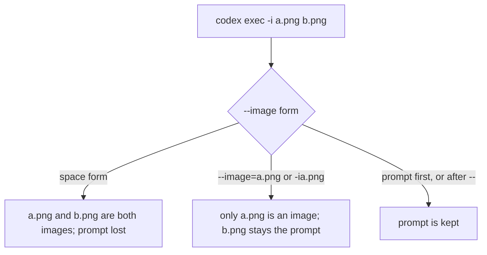

# Codex CLI: Command-Line Surface

## Overview

Codex CLI is OpenAI's terminal coding agent. It is written in Rust, shipped as one executable named `codex`, and developed in the open at [openai/codex](https://github.com/openai/codex). Running `codex` starts an interactive terminal UI; `codex exec` and `codex review` run one task to completion without a terminal.

This document was verified against **codex-cli 0.159.3**, the version `codex --version` reported on macOS arm64 (npm-installed). The newest stable release upstream is **0.160.0**, published 2026-10-01; newer `0.162.0-alpha.*` tags are prereleases. The switch records come from the clap declarations at tag `rust-v0.159.3` and from 234 disposable parser probes, not from help text alone.

| Link | URL |
| ---- | --- |
| Product page | <https://developers.openai.com/codex/cli> |
| Documentation | <https://developers.openai.com/codex/> |
| Command reference | <https://developers.openai.com/codex/cli/reference> |
| Source | <https://github.com/openai/codex> |

The `developers.openai.com/codex` pages answer with a 308 redirect to `learn.chatgpt.com/docs`; the links above are the stable names and the sections below cite the redirected locations.

## Installation and Binaries

The command is `codex` on every operating system. On Windows the npm install also exposes `codex.cmd` and the standalone installer a `codex.exe`.

| OS | Method | Command | Notes |
| -- | ------ | ------- | ----- |
| macos | standalone_binary | `curl -fsSL https://chatgpt.com/codex/install.sh | sh` | Installs to $CODEX_INSTALL_DIR, default $HOME/.local/bin; rerun to upgrade. CODEX_NON_INTERACTIVE=1 suppresses installer prompts. |
| linux | standalone_binary | `curl -fsSL https://chatgpt.com/codex/install.sh | sh` | Installs to $CODEX_INSTALL_DIR, default $HOME/.local/bin; rerun to upgrade. CODEX_NON_INTERACTIVE=1 suppresses installer prompts. |
| windows | standalone_binary | `powershell -ExecutionPolicy ByPass -c "irm https://chatgpt.com/codex/install.ps1 | iex"` | Installs to %LOCALAPPDATA%\Programs\OpenAI\Codex\bin unless CODEX_INSTALL_DIR is set; read from install.ps1, not run. |
| macos | npm | `npm install -g @openai/codex` | The npm package pulls a per-platform native package such as @openai/codex-darwin-arm64. This host uses it. |
| linux | npm | `npm install -g @openai/codex` | The npm package pulls a per-platform native package such as @openai/codex-darwin-arm64. |
| windows | npm | `npm install -g @openai/codex` | The npm package pulls a per-platform native package such as @openai/codex-darwin-arm64. |
| macos | brew | `brew install --cask codex` | Homebrew cask, named in the binary's update logic alongside npm, bun, and pnpm; not run. |

## Subcommands

`codex` takes an optional `PROMPT` and, instead of one, a command path. Only paths that were run to completion here, or whose behavior the source and official documentation state, are marked non-interactive. Every other path is listed with the reason it was not, and its switches are not inventoried. Hidden internal commands (`execpolicy`, `tcp-tunnel`, `responses-api-proxy`, `stdio-to-uds`, `debug trace-reduce`, `clear-memories`) are omitted.

| Command path | What it does | Non-interactive |
| ------------ | ------------ | --------------- |
| `codex agents` | Browse all agent sessions on the shared local app-server daemon. | no |
| `codex exec` | Run Codex non-interactively. | yes |
| `codex exec resume` | Resume a previous session by id or pick the most recent with --last. | yes |
| `codex exec fork` | Fork a previous session by id into a new session. | yes |
| `codex exec review` | Run a code review against the current repository. | yes |
| `codex review` | Run a code review non-interactively. | yes |
| `codex login` | Manage login. | no |
| `codex login status` | Show login status. | yes |
| `codex logout` | Remove stored authentication credentials. | no |
| `codex mcp` | Manage external MCP servers for Codex. | no |
| `codex mcp list` | List configured MCP servers. | yes |
| `codex mcp get` | Show one configured MCP server. | no |
| `codex mcp add` | Add an MCP server over a URL or a stdio command. | no |
| `codex mcp remove` | Remove a configured MCP server. | no |
| `codex mcp login` | Authenticate to an MCP server with OAuth. | no |
| `codex mcp logout` | Remove stored OAuth credentials for an MCP server. | no |
| `codex plugin` | Manage Codex plugins. | no |
| `codex plugin add` | Install a plugin from a configured or remote marketplace. | no |
| `codex plugin list` | List plugins available from configured and remote marketplaces. | no |
| `codex plugin marketplace` | Add, list, upgrade, or remove configured plugin marketplaces. | no |
| `codex plugin marketplace add` | Add a local or Git marketplace to the configured marketplace sources. | no |
| `codex plugin marketplace list` | List plugin marketplaces Codex is currently considering and their roots. | no |
| `codex plugin marketplace upgrade` | Refresh configured Git marketplace snapshots. | no |
| `codex plugin marketplace remove` | Remove a configured marketplace source by name. | no |
| `codex plugin remove` | Uninstall a plugin and remove its local cache. | no |
| `codex app-server` | [experimental] Run the app server or related tooling. | no |
| `codex app-server daemon` | Manage the local app-server daemon. | no |
| `codex app-server daemon bootstrap` | Install durable local app-server management for SSH-driven use. | no |
| `codex app-server daemon start` | Start the local app server daemon if it is not already running. | no |
| `codex app-server daemon restart` | Restart the local app server daemon. | no |
| `codex app-server daemon update` | Update the daemon package (may interrupt running work). | no |
| `codex app-server daemon enable-remote-control` | Enable remote control for future starts and a currently running managed daemon. | no |
| `codex app-server daemon disable-remote-control` | Disable remote control for future starts and a currently running managed daemon. | no |
| `codex app-server daemon stop` | Stop the local app server daemon. | no |
| `codex app-server daemon version` | Print local CLI and running app-server versions as JSON. | no |
| `codex app-server proxy` | Proxy stdio bytes to the running app-server control socket. | no |
| `codex app-server generate-ts` | [experimental] Generate TypeScript bindings for the app server protocol. | no |
| `codex app-server generate-json-schema` | [experimental] Generate JSON Schema for the app server protocol. | no |
| `codex remote-control` | [experimental] Manage the app-server daemon with remote control enabled. | no |
| `codex remote-control start` | Start the app-server daemon with remote control enabled. | no |
| `codex remote-control stop` | Stop the app-server daemon. | no |
| `codex remote-control pair` | Create and print a short-lived manual pairing code. | no |
| `codex app` | Launch the Desktop app (opens the app installer if missing). | no |
| `codex completion` | Generate shell completion scripts. | yes |
| `codex update` | Update Codex to the latest version. | no |
| `codex doctor` | Diagnose local Codex installation, config, auth, and runtime health. | yes |
| `codex sandbox` | Run commands within a Codex-provided sandbox. | no |
| `codex debug` | Debugging tools. | no |
| `codex debug models` | Render the raw model catalog as JSON. | yes |
| `codex debug app-server` | Tooling: helps debug the app server. | no |
| `codex debug app-server send-message-v2` | Send one message through the app-server test client. | no |
| `codex debug prompt-input` | Render the model-visible prompt input list as JSON. | yes |
| `codex apply` | Apply the latest diff produced by Codex agent as a `git apply` to your local working tree. | no |
| `codex resume` | Resume a previous interactive session (picker by default; use --last to continue the most recent). | no |
| `codex queue` | Queue a message for an existing session. | no |
| `codex archive` | Archive a saved session by id or session name. | no |
| `codex delete` | Permanently delete a saved session by id or session name. | no |
| `codex migrate-rollouts` | Inspect or migrate legacy local sessions to paginated thread history. | yes |
| `codex unarchive` | Unarchive a saved session by id or session name. | no |
| `codex fork` | Fork a previous interactive session (picker by default; use --last to fork the most recent). | no |
| `codex cloud` | [EXPERIMENTAL] Browse tasks from Codex Cloud and apply changes locally. | no |
| `codex cloud exec` | Submit a new Codex Cloud task without launching the TUI. | no |
| `codex cloud status` | Show the status of a Codex Cloud task. | no |
| `codex cloud list` | List Codex Cloud tasks. | no |
| `codex cloud apply` | Apply the diff for a Codex Cloud task locally. | no |
| `codex cloud diff` | Show the unified diff for a Codex Cloud task. | no |
| `codex exec-server` | [EXPERIMENTAL] Run the standalone exec-server service. | no |
| `codex exec-server forward` | Register an existing WebSocket exec-server as a remote environment. | no |
| `codex features` | Inspect feature flags. | no |
| `codex features list` | List known features with their stage and effective state. | yes |
| `codex features enable` | Enable a feature in config.toml. | no |
| `codex features disable` | Disable a feature in config.toml. | no |

## CLI Switch Inventory

Inventoried paths: the root entrypoint `codex` and the non-interactive paths `exec`, `exec resume`, `exec fork`, `exec review`, `review`, `login status`, `mcp list`, `completion`, `doctor`, `debug models`, `debug prompt-input`, `migrate-rollouts`, `features list`. A value type, an attachment form, or an alias appears here only after one of these established it:

- **clap declarations** at tag `rust-v0.159.3` in `exec/src/cli.rs`, `utils/cli/src/shared_options.rs`, `tui/src/cli.rs`, `cli/src/main.rs`, and `utils/cli/src/config_override.rs`. Codex uses the clap derive parser.
- **Parser probes** under a throwaway `CODEX_HOME`: every valued switch given no value must fail with "a value is required for '--flag'", every valueless switch given `--flag=x` must fail with "unexpected value", and every valued switch must read `--flag=val` and `-Xval` as its value. 148 probes over 14 paths and 86 attachment probes all behaved as recorded.
- **Greedy-consumption tests** through `debug prompt-input`, which stops before any model call.

`-c/--config`, `--enable`, `--disable`, and `--help/-h` appear in the help of the root and all 72 command paths and are recorded as global. `--version/-V` is accepted only at the root and `exec`.

| Switch | Value type | Attachment | Command paths | Evidence |
| ------ | ---------- | ---------- | ------------- | -------- |
| `--config`, `-c` | string | space, equals, short_attached | every path | src-config-override, test-attachment-forms, test-valued-probes |
| `--enable` | string | space, equals | every path | src-cli-main, test-attachment-forms, test-valued-probes |
| `--disable` | string | space, equals | every path | src-cli-main, test-attachment-forms, test-valued-probes |
| `--help`, `-h` | none | none | every path | local-help |
| `--version`, `-V` | none | none | `codex`, `codex exec` | local-help, test-safe-runs |
| `--strict-config` | none | none | `codex`, `codex exec`, `codex exec resume`, `codex exec fork`, `codex exec review`, `codex review` | src-exec-cli, src-tui-cli, src-cli-main, test-valued-probes |
| `--model`, `-m` | string | space, equals, short_attached | `codex`, `codex exec`, `codex exec resume`, `codex exec fork`, `codex exec review` | src-shared-options, src-exec-cli, test-valued-probes |
| `--oss` | none | none | `codex`, `codex exec` | src-shared-options, test-valued-probes |
| `--local-provider` | string | space, equals | `codex`, `codex exec` | src-shared-options, test-valued-probes |
| `--profile`, `-p` | string | space, equals, short_attached | `codex`, `codex exec` | src-shared-options, test-attachment-forms, test-valued-probes |
| `--sandbox`, `-s` | string | space, equals, short_attached | `codex`, `codex exec` | src-shared-options, test-attachment-forms, test-valued-probes |
| `--approve-for-me`, `--not-so-yolo` | none | none | `codex`, `codex exec` | src-shared-options, test-aliases, test-valued-probes |
| `--dangerously-bypass-approvals-and-sandbox`, `--yolo` | none | none | `codex`, `codex exec`, `codex exec resume`, `codex exec fork`, `codex exec review` | src-shared-options, test-aliases, docs-developer-commands, test-valued-probes |
| `--dangerously-bypass-hook-trust` | none | none | `codex`, `codex exec`, `codex exec resume`, `codex exec fork`, `codex exec review` | src-shared-options, test-valued-probes |
| `--cd`, `-C` | string | space, equals, short_attached | `codex`, `codex exec` | src-shared-options, test-valued-probes |
| `--worktree` | none | none | `codex`, `codex exec`, `codex exec resume`, `codex exec fork`, `codex exec review` | src-shared-options, src-exec-cli, test-valued-probes |
| `--add-dir` | string | space, equals | `codex`, `codex exec` | src-shared-options, test-valued-probes |
| `--image`, `-i` | variadic (min 1) | space, equals, short_attached | `codex`, `codex exec`, `codex debug prompt-input` | src-shared-options, test-image-greedy, docs-developer-commands, test-valued-probes |
| `--image`, `-i` | string | space, equals, short_attached | `codex exec resume`, `codex exec fork` | src-exec-cli, test-image-greedy, docs-developer-commands, test-valued-probes |
| `--ask-for-approval`, `-a` | string | space, equals, short_attached | `codex` | src-tui-cli, test-attachment-forms, test-valued-probes |
| `--search` | none | none | `codex` | src-tui-cli, test-valued-probes |
| `--no-alt-screen` | none | none | `codex` | src-tui-cli, test-valued-probes |
| `--no-daemon` | none | none | `codex` | src-tui-cli, test-valued-probes |
| `--remote` | string | space, equals | `codex` | src-cli-main, test-valued-probes |
| `--remote-auth-token-env` | string | space, equals | `codex` | src-cli-main, test-valued-probes |
| `--thread-source` | string | space, equals | `codex exec`, `codex exec resume`, `codex exec fork`, `codex exec review` | src-exec-cli, test-valued-probes |
| `--skip-git-repo-check` | none | none | `codex exec`, `codex exec resume`, `codex exec fork`, `codex exec review` | src-exec-cli, test-valued-probes |
| `--ephemeral` | none | none | `codex exec`, `codex exec resume`, `codex exec fork`, `codex exec review` | src-exec-cli, test-valued-probes |
| `--ignore-user-config` | none | none | `codex exec`, `codex exec resume`, `codex exec fork`, `codex exec review` | src-exec-cli, test-valued-probes |
| `--ignore-rules` | none | none | `codex exec`, `codex exec resume`, `codex exec fork`, `codex exec review` | src-exec-cli, test-valued-probes |
| `--output-schema` | string | space, equals | `codex exec`, `codex exec resume`, `codex exec fork`, `codex exec review` | src-exec-cli, test-valued-probes |
| `--color` | string | space, equals | `codex exec` | src-exec-cli, test-attachment-forms, test-valued-probes |
| `--json`, `--experimental-json` | none | none | `codex exec`, `codex exec resume`, `codex exec fork`, `codex exec review` | src-exec-cli, test-aliases, docs-non-interactive, test-valued-probes |
| `--json` | none | none | `codex doctor`, `codex mcp list`, `codex migrate-rollouts` | local-help, test-safe-runs, test-valued-probes |
| `--output-last-message`, `-o` | string | space, equals, short_attached | `codex exec`, `codex exec resume`, `codex exec fork`, `codex exec review` | src-exec-cli, test-valued-probes |
| `--last` | none | none | `codex exec resume` | src-exec-cli, test-valued-probes |
| `--all` | none | none | `codex exec resume` | src-exec-cli, test-valued-probes |
| `--all` | none | none | `codex doctor` | local-help, test-valued-probes |
| `--uncommitted` | none | none | `codex exec review`, `codex review` | src-exec-cli, test-valued-probes |
| `--base` | string | space, equals | `codex exec review`, `codex review` | src-exec-cli, test-valued-probes |
| `--commit` | string | space, equals | `codex exec review`, `codex review` | src-exec-cli, test-valued-probes |
| `--title` | string | space, equals | `codex exec review`, `codex review` | src-exec-cli, test-valued-probes |
| `--bundled` | none | none | `codex debug models` | src-cli-main, test-safe-runs, test-valued-probes |
| `--summary` | none | none | `codex doctor` | local-help, test-valued-probes |
| `--no-color` | none | none | `codex doctor` | local-help, test-valued-probes |
| `--ascii` | none | none | `codex doctor` | local-help, test-valued-probes |
| `--apply` | none | none | `codex migrate-rollouts` | local-help, test-valued-probes |
| `--thread` | string | space, equals | `codex migrate-rollouts` | local-help, test-number-and-uuid, test-valued-probes |
| `--max-mib-per-second` | number | space, equals | `codex migrate-rollouts` | local-help, test-number-and-uuid, test-valued-probes |
| `--verbose` | none | none | `codex migrate-rollouts` | local-help, test-valued-probes |

`value_optional` is false for every valued switch: each one rejected a missing value. No switch takes an optional value.

## Configuration Discovery

Configuration is TOML, merged in this order from highest to lowest: command-line flags and `-c` overrides, project `.codex/config.toml` (trusted projects only), profile files chosen with `--profile`, user `~/.codex/config.toml`, cloud-managed defaults, the Unix-only system file `/etc/codex/config.toml`, then built-in defaults. `CODEX_HOME` moves the whole user directory.

| OS | Scope | Path | Notes |
| -- | ----- | ---- | ----- |
| macos | user | `~/.codex/config.toml` | User configuration; the CLI also edits it for features enable/disable and mcp add/remove. CODEX_HOME replaces the directory. |
| macos | env | `$CODEX_HOME` | Directory override; holds auth.json, sessions, skills, rules, and SQLite state. A throwaway value starts with no login and creates skills/.system on first run. |
| macos | user | `~/.codex/<name>.config.toml` | Profile layered over the base config by --profile <name>; the name must be a plain name. |
| macos | repo | `.codex/config.toml` | Project layer, read from the project root down to the working directory with the closest winning; trusted projects only. |
| macos | system | `/etc/codex/config.toml` | System layer below user config; documented as Unix only. Absent on this host. |
| linux | user | `~/.codex/config.toml` | User configuration; the CLI also edits it for features enable/disable and mcp add/remove. CODEX_HOME replaces the directory. |
| linux | env | `$CODEX_HOME` | Directory override; holds auth.json, sessions, skills, rules, and SQLite state. A throwaway value starts with no login and creates skills/.system on first run. |
| linux | user | `~/.codex/<name>.config.toml` | Profile layered over the base config by --profile <name>; the name must be a plain name. |
| linux | repo | `.codex/config.toml` | Project layer, read from the project root down to the working directory with the closest winning; trusted projects only. |
| linux | system | `/etc/codex/config.toml` | System layer below user config; documented as Unix only. Absent on this host. |
| windows | user | `%USERPROFILE%\.codex\config.toml` | User configuration; the CLI also edits it for features enable/disable and mcp add/remove. CODEX_HOME replaces the directory. Windows location follows the documented ~ mapping and was not inspected. |
| windows | env | `%CODEX_HOME%` | Directory override; holds auth.json, sessions, skills, rules, and SQLite state. A throwaway value starts with no login and creates skills/.system on first run. |
| windows | user | `%USERPROFILE%\.codex\<name>.config.toml` | Profile layered over the base config by --profile <name>; the name must be a plain name. |
| windows | repo | `.codex/config.toml` | Project layer, read from the project root down to the working directory with the closest winning; trusted projects only. |
| macos | user | `~/.codex/auth.json` | Stored credentials. Present locally; its contents were not read. |
| linux | user | `~/.codex/auth.json` | Stored credentials; same layout as macOS, not inspected on Linux. |
| windows | user | `%USERPROFILE%\.codex\auth.json` | Stored credentials; same layout as macOS, not inspected on Windows. |

The CLI writes `config.toml` itself for `features enable`, `features disable`, and `mcp add/remove`, and writes sessions, SQLite databases, and caches under the same directory.

## Environment Variables

Only general runtime variables are listed here. Model endpoints belong to `model-config`, permissions to `agent-permissions`, MCP to `mcp`, and logging to `agent-logging`.

| Variable | Effect |
| -------- | ------ |
| `CODEX_HOME` | Replaces ~/.codex as the home for configuration, credentials, sessions, skills, rules, and state; also where profile files and the standalone install live. |
| `CODEX_SQLITE_HOME` | Moves the SQLite state databases; when unset they follow CODEX_HOME or the configured sqlite_home. |
| `CODEX_API_KEY` | Supplies an API key for one run of exec or review without a stored login (documented for exec, review, and exec-server --remote). |
| `CODEX_ACCESS_TOKEN` | Named in the binary and in the help for codex login --with-access-token as the source of an access token; whether exec reads it directly was not established. |
| `OPENAI_API_KEY` | Read as an API-key credential when no stored login or CODEX_API_KEY applies; precedence against CODEX_API_KEY was not established. |
| `CODEX_CA_CERTIFICATE` | Path to a CA bundle trusted for Codex HTTPS and websocket traffic; SSL_CERT_FILE is the fallback the binary also names. |
| `RUST_LOG` | Standard tracing filter for the Rust logging stack, documented in docs/install.md. |
| `NO_COLOR` | Named in the binary next to the --no-color handling; its exact effect was not established. |
| `CODEX_TUI_DISABLE_KEYBOARD_ENHANCEMENT` | Named in the binary; by its name it turns off the terminal keyboard-enhancement protocol in the terminal UI. Not run. |
| `CODEX_THREAD_ID` | Present in the binary beside the exec-command path, which suggests Codex passes the thread id to commands it runs; not confirmed by a run. |
| `CODEX_SANDBOX_NETWORK_DISABLED` | Present in the binary with the value 1, which suggests it marks commands whose sandbox disables network access; not confirmed by a run. |
| `CODEX_INSTALL_DIR` | Installer-only: directory the install scripts put the codex executable in. |
| `CODEX_NON_INTERACTIVE` | Installer and updater only: set to 1 to run the install script without prompting. |

## Machine Introspection

| Command | Output | Notes |
| ------- | ------ | ----- |
| `codex --version` | text | Prints "codex-cli 0.159.3". |
| `codex doctor --json` | json | Redacted report with schemaVersion, overallStatus, codexVersion, and checks keyed by id. Exits 1 when overallStatus is fail while still printing the full report. |
| `codex debug models` | json | Raw model catalog (about 650 KB bundled): slug, display_name, default_reasoning_level, supported_reasoning_levels. Without --bundled it attempts a refresh, so it may use the network. |
| `codex debug models --bundled` | json | Offline; the catalog compiled into this binary. |
| `codex debug prompt-input [PROMPT]` | json | JSON array of the prompt items a session would send, including developer instructions and the skills list. Contacts no model. |
| `codex features list` | table | Whitespace-aligned columns: feature name, stage (for example "under development", "experimental", "removed"), effective state. No JSON mode. |
| `codex mcp list --json` | json | JSON array of configured servers; [] when none. |
| `codex exec --json "<prompt>"` | jsonl | Streams thread.started, turn.*, item.*, and error events per official docs; runs a billed model session. |
| `codex migrate-rollouts --json` | json | Complete per-thread report; read-only without --apply. |
| `codex login status` | text | Prints "Not logged in" and exits 1 without credentials; exit status is the machine-readable part. |
| `codex completion zsh` | text | About 240 KB zsh completion script; also bash, elvish, fish, and powershell. |
| `codex app-server generate-json-schema --out <DIR>` | unknown | Writes the app-server protocol schema into the directory; not run here. |

## Wrapper Notes

- Codex CLI 0.159.3 was installed and run on macOS arm64; Linux and Windows behavior comes from install scripts and documentation only.
- --image/-i is greedy at the root, exec, and debug prompt-input: "codex exec -i a.png b.png" treats b.png as a second image and then waits on stdin for a prompt. Write --image=PATH or -iPATH, put the prompt before the switch, or end the switches with "--". At exec resume and exec fork the space form takes one value.
- Codex reads the prompt from stdin when the argument is omitted or is "-", and when both exist appends stdin as a <stdin> block. Give it a closed stdin or a real prompt; with nothing available it prints "No prompt provided via stdin." and exits 1.
- Non-global exec switches (--sandbox, --cd, --color, --oss, --profile, --add-dir) are not accepted after resume, fork, or review. Place them before the subcommand; the source merges the exec-level values into the subcommand. Only --model, --dangerously-bypass-approvals-and-sandbox, --dangerously-bypass-hook-trust, --worktree, and the exec globals (--json, --output-schema, --output-last-message, --ephemeral, --skip-git-repo-check, --ignore-user-config, --ignore-rules, --thread-source, --strict-config) apply after it. Source-derived, not run, because a run would be billed.
- exec has no --ask-for-approval; the interactive root has. A non-interactive run reports "approval: never" and takes its policy from configuration, so pass -c approval_policy=... when a different policy is needed.
- An unauthenticated exec still prints its banner (workdir, model, sandbox, session id) on stderr, retries a websocket, and exits 101 on 401. exec resume with an unknown session operand did not fail a lookup before the network step, while exec fork failed immediately with "Session not found"; check the id yourself before resuming.
- Parse errors exit 2 with a message naming the switch. Runtime errors for -c without "=" or an unknown --enable name exit 1. doctor --json and login status exit 1 on a failed check or missing login, so read the output rather than only the status.
- A first word that is not a subcommand is taken as the interactive PROMPT: "codex mcp-server --help" printed the root help rather than an error. The mcp-server command from earlier versions no longer exists. A typo therefore starts a terminal UI instead of failing.
- -c values are TOML first and a literal string second, so -c model=o3 and -c model="o3" both work but -c key=[a,b] needs quoting for the shell. Root-level -c values are lower precedence than the subcommand's.
- --ephemeral and --ignore-user-config change what is read or written but authentication still comes from CODEX_HOME. Pointing CODEX_HOME at a fresh directory removes the login and creates a skills/.system folder there.
- Hidden commands exist outside help output: execpolicy, tcp-tunnel, responses-api-proxy, stdio-to-uds, and debug trace-reduce and clear-memories. --yolo, --not-so-yolo, and --experimental-json are hidden aliases; none are documented as stable.
- The developers.openai.com/codex pages now answer 308 redirects to learn.chatgpt.com/docs; use the new locations.

## Sources

- [Codex CLI overview and install](https://learn.chatgpt.com/docs/codex/cli), reached from <https://developers.openai.com/codex/cli>
- [Command reference](https://learn.chatgpt.com/docs/developer-commands?surface=cli), reached from <https://developers.openai.com/codex/cli/reference>
- [Configuration basics](https://learn.chatgpt.com/docs/config-file/config-basic)
- [Non-interactive mode](https://learn.chatgpt.com/docs/non-interactive-mode)
- [`codex-rs/exec/src/cli.rs`](https://github.com/openai/codex/blob/rust-v0.159.3/codex-rs/exec/src/cli.rs)
- [`codex-rs/utils/cli/src/shared_options.rs`](https://github.com/openai/codex/blob/rust-v0.159.3/codex-rs/utils/cli/src/shared_options.rs)
- [`codex-rs/tui/src/cli.rs`](https://github.com/openai/codex/blob/rust-v0.159.3/codex-rs/tui/src/cli.rs)
- [`codex-rs/cli/src/main.rs`](https://github.com/openai/codex/blob/rust-v0.159.3/codex-rs/cli/src/main.rs)
- [`codex-rs/utils/cli/src/config_override.rs`](https://github.com/openai/codex/blob/rust-v0.159.3/codex-rs/utils/cli/src/config_override.rs)
- [`scripts/install`](https://github.com/openai/codex/tree/rust-v0.159.3/scripts/install) (install.sh, install.ps1)
- [`docs/install.md`](https://github.com/openai/codex/blob/rust-v0.159.3/docs/install.md)
- [GitHub releases](https://github.com/openai/codex/releases)
- Local inspection: `codex --version` and `codex <path> --help` for the root and 72 paths, the throwaway-home parser probes, and `strings` over the installed binary, all on 2026-10-01.

## Changelog

- Rewritten for contract revision 2: the switch inventory is typed per command path, with value types and attachment forms established by clap source and 234 parser probes instead of help text.
- Version moves from 0.142.5 to 0.159.3 installed; the newest stable upstream is 0.160.0, up from 0.142.5.
- --image is two different switches: greedy and variadic at the root, exec, and debug prompt-input; one value per occurrence at exec resume and exec fork. The previous document did not distinguish them.
- Commands added since the last version: agents, queue, migrate-rollouts, exec fork, and mcp list/get/add/remove/login/logout, plugin marketplace, and app-server daemon trees are enumerated. The mcp-server command and the visible execpolicy command are gone (execpolicy remains hidden).
- New switches: --worktree, --thread-source, --approve-for-me (alias --not-so-yolo), --no-daemon, --remote, and --profile now layers $CODEX_HOME/<name>.config.toml.
- Official documentation moved from developers.openai.com/codex to learn.chatgpt.com/docs through 308 redirects.
- The installer scripts now name releases.openai.com with a GitHub fallback, and CODEX_NON_INTERACTIVE and CODEX_INSTALL_DIR are installer-only variables.