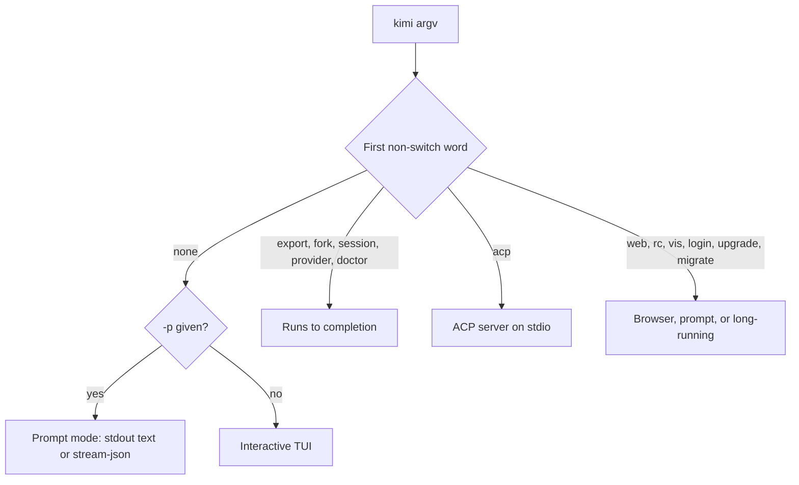

# Kimi Code CLI: Command-Line Surface

## Overview

Kimi Code CLI is Moonshot AI's terminal coding agent. It is a TypeScript program distributed as a single native binary (`kimi`) or as the npm package `@moonshot-ai/kimi-code`, licensed MIT, and it replaces the archived Python `kimi-cli`. Running `kimi` starts a full-screen terminal UI; `kimi -p <prompt>` runs one prompt and exits; `kimi acp` serves IDEs over the Agent Client Protocol; `kimi web` serves a local web UI.

- **Version verified:** `kimi --version` printed `2.1.1` on this host (binary at `/Users/ken/.kimi-code/bin/kimi`, a Mach-O arm64 executable). The npm registry lists `2.1.1` as `latest`, so the installed version is the newest release (published 2026-09-24). Source was read at the commit of tag `@moonshot-ai/kimi-code@2.1.1`; the eight source files cited under Sources are identical at repository head.
- **Repository note:** the assignment names `MoonshotAI/kimi-cli` and `moonshotai.github.io/kimi-cli/`. That repository is archived ("Legacy Python Kimi CLI, no longer maintained") and its documentation site carries an archive warning. The active project is `MoonshotAI/kimi-code`, and this document describes it.
- **Parser:** [commander](https://github.com/tj/commander.js) `^13.1.0` with `enablePositionalOptions`, so root switches are valid only before a subcommand.
- **Links:** [documentation](https://moonshotai.github.io/kimi-code/en/), [`kimi` command reference](https://moonshotai.github.io/kimi-code/en/reference/kimi-command), [repository](https://github.com/MoonshotAI/kimi-code), [changelog](https://moonshotai.github.io/kimi-code/en/release-notes/changelog).

## Installation and Binaries

| OS | Command | Install |
| --- | --- | --- |
| macOS | `kimi` | `curl -fsSL https://code.kimi.com/kimi-code/install.sh \| bash` (recommended), `npm install -g @moonshot-ai/kimi-code`, or `brew install kimi-code` |
| Linux | `kimi` | the same script, npm, or Homebrew on Linux |
| Windows | `kimi` (`kimi.exe`, or an npm `kimi.cmd` shim) | `irm https://code.kimi.com/kimi-code/install.ps1 \| iex` or npm; Git for Windows is required |

- The script verifies a checksum and installs one native executable to `~/.kimi-code/bin/kimi`; no Node.js is needed. The npm route needs Node.js 22.19.0 or later.
- `brew info kimi-code` on this host reports stable `2.1.0`, one release behind npm.
- A legacy Python `kimi-cli` (1.47.0 here, also reachable as `kimi-legacy`) can sit beside it and is a different program.
- Only the macOS binary was run. Linux and Windows details come from the documentation.

## Subcommands

Every path below was run with `--help`. Aliases: `rc` is also `remote`, `upgrade` is also `update`, and `install-desktop` keeps a hidden `install-app`. Hidden internals `__plugin_run_node` and `__update_download` are not public. A path counts as non-interactive only when it needs no terminal, browser, or answered prompt.

| Command path | Runs without a terminal | What it does |
| --- | --- | --- |
| `export` | yes | Exports a session as a ZIP archive. Prompts "Export previous session ...? [Y/n]" only when no session id is given and --yes is absent. Prints the archive path on stdout. |
| `fork` | yes | Forks a session into a new session. Prompts only when no session id is given and --yes is absent. |
| `provider` | yes | Group of non-interactive provider management commands. Run alone it prints help and exits 1. |
| `provider add` | yes | Imports every provider listed in a custom registry (api.json). Writes the providers and models into config.toml; fetches the URL. |
| `provider remove` | yes | Removes a provider and every model alias that referenced it. Edits config.toml. |
| `provider list` | yes | Shows configured providers and their model counts. --json prints the raw providers and models tables. |
| `provider catalog` | yes | Group for discovering providers in the public models.dev catalog. Run alone it prints help and exits 1. |
| `provider catalog list` | yes | Lists catalog providers, or the models of one provider when an id is given. Fetches the catalog over the network. |
| `provider catalog add` | yes | Imports a known provider from the catalog by id. Edits config.toml; fetches the catalog. |
| `session` | yes | Group of non-interactive session commands. Run alone it prints help and exits 1. |
| `session list` | yes | Lists sessions, most recently updated first. Scoped to the current directory unless --all or --cwd is given. |
| `acp` | yes | Runs Kimi Code as an Agent Client Protocol server over stdio. Long-running JSON-RPC server driven by an IDE; it needs no terminal. --login switches it to the device-code login flow, which needs a browser. |
| `web` | no | Runs the local Kimi server in the foreground and opens the web UI. Runs until interrupted and opens a browser unless --no-open is given. Prints a bearer token at startup. |
| `web rotate-token` | yes | Generates a new persistent server token and invalidates the previous one. Writes server.token under the data root and prints the new token on stdout. |
| `rc` | no | Runs the local server and exposes the web UI through Remote Control. Alias: remote. Same server options as web with remote control forced on. |
| `login` | no | Authenticates through the device-code flow. Prints a URL and code and polls until a person authorizes in a browser. Accepts --region. |
| `doctor` | yes | Validates config.toml and tui.toml at their default paths. Exits 0 when the files are valid or absent and 1 when an issue is found. Reads only. |
| `doctor config` | yes | Validates config.toml, or the file given as the optional path argument. Exits 1 and names the path when the file is missing or invalid. |
| `doctor tui` | yes | Validates tui.toml, or the file given as the optional path argument.  |
| `vis` | no | Launches the session visualizer web server in a browser. Runs until interrupted (SIGINT). Accepts --port, --host, --no-open, and an optional session id; an unparseable --port is silently ignored and a free port is chosen. |
| `install-desktop` | no | Prints the Kimi Code desktop app page and opens it in a browser. Hidden alias: install-app. |
| `migrate` | no | Migrates data from a legacy kimi-cli installation into Kimi Code. Interactive by default; --run migrates non-interactively and --config-only (which requires --run) skips chat sessions. |
| `upgrade` | no | Upgrades Kimi Code to the latest version. Alias: update. Asks for confirmation unless -y/--yes is given, and installs a new binary. |
| `server` | no | Deprecated; prints a notice that kimi web replaces it and exits 1. Kept only for the kill subcommand. |
| `server kill` | no | Deprecated: stops a server started by a version before 0.28.0. Not exercised in this research. |

## CLI Switch Inventory

Inventoried paths: the root entrypoint and every non-interactive path that declares a switch of its own (`export`, `fork`, `session list`, `provider add`, `provider list`, `provider catalog list`, `provider catalog add`, `acp`). `doctor`, `doctor config`, `doctor tui`, `provider remove`, `web rotate-token`, and the group paths declare only `--help`. Switches of `web`, `rc`, `vis`, `login`, `upgrade`, and `migrate` were left out; their help output was read but their values were not tested.

`--help`/`-h` (value: none) is accepted at every path. `--version`/`-V` (value: none) is accepted only at the root.

How values attach was established by the commander declarations in source and by disposable parse tests run with a throwaway `KIMI_CODE_HOME` and no model session. A test counts only when the error named the switch or a later validation error proved the value was read:

| Test | Result | Proves |
| --- | --- | --- |
| `--output-format bad`, `--output-format=bad` | both rejected naming `--output-format` with the choices | space and equals |
| `-m`, `--model`, `-p`, `export -o` (no value) | "argument missing" naming the switch | the value is required |
| `-mx --output-format=text` | later error "Output format is only supported in prompt mode" | `-mx` is a short attached value |
| `-Sabc -c`, `-rabc -c`, `--session abc -c`, `--resume=abc -c` | conflict error, not "unknown command" | the id was consumed by all three forms |
| `-S --continue` | conflict with an empty id | the id is optional |
| `-p --yolo` | runs prompt `--yolo` ("No model configured") | a required value swallows a dashed token |
| `-p=foo --plan` | prompt/plan conflict | the short form reads `=foo` as the value |
| `--auto=x`, `--version=x`, `web --no-open=x` | "unknown option" | booleans take no value |
| `session list --limit 0`, `--limit=0`, `--limit abc` | positive-integer error naming `--limit` | one numeric value, both forms |
| `export -ofoo`, `export -yofoo` | accepted | short attached and bundling |
| `export --auto`, `session list --model x`, `acp --prompt x` | "unknown option" | root switches do not reach subcommands |
| `login --region bad`, `acp --login --region=bad` | rejected naming `--region` | space and equals |

### Root entrypoint (`kimi`)

| Switch | Value | Attachment | Established by |
| --- | --- | --- | --- |
| `--version`, `-V` | none | — | `help-output`, `src-root-commands`, `test-root-parse` |
| `--session`, `-S`, `--resume`, `-r` | string (optional) | space, equals, short_attached | `help-output`, `src-root-commands`, `src-options`, `test-root-parse`, `docs-kimi-command` |
| `--continue`, `-c`, `-C` | none | — | `help-output`, `src-root-commands`, `src-options`, `test-root-parse`, `docs-kimi-command` |
| `--yolo`, `-y`, `--yes`, `--auto-approve` | none | — | `help-output`, `src-root-commands`, `src-options`, `test-root-parse`, `docs-kimi-command` |
| `--auto` | none | — | `help-output`, `src-root-commands`, `src-options`, `test-root-parse`, `docs-kimi-command` |
| `--model`, `-m` | string | space, equals, short_attached | `help-output`, `src-root-commands`, `src-options`, `test-root-parse`, `docs-kimi-command` |
| `--prompt`, `-p` | string | space, equals, short_attached | `help-output`, `src-root-commands`, `src-options`, `test-root-parse`, `docs-kimi-command` |
| `--output-format` | string | space, equals | `help-output`, `src-root-commands`, `src-options`, `test-root-parse`, `docs-kimi-command` |
| `--skills-dir` | string | space, equals | `help-output`, `src-root-commands`, `test-root-parse` |
| `--agent` | string | space, equals | `help-output`, `src-root-commands`, `src-options`, `test-root-parse`, `docs-kimi-command` |
| `--agent-file` | string | space, equals | `help-output`, `src-root-commands`, `src-options`, `test-root-parse`, `docs-kimi-command` |
| `--add-dir` | string | space, equals | `help-output`, `src-root-commands`, `test-root-parse`, `docs-kimi-command` |
| `--plan` | none | — | `help-output`, `src-root-commands`, `src-options`, `test-root-parse`, `docs-kimi-command` |

### `kimi export`

| Switch | Value | Attachment | Established by |
| --- | --- | --- | --- |
| `--output`, `-o` | string | space, equals, short_attached | `help-output`, `src-export-fork`, `test-subcommand-parse` |
| `--yes`, `-y` | none | — | `help-output`, `src-export-fork`, `test-subcommand-parse` |
| `--no-include-global-log` | none | — | `help-output`, `src-export-fork`, `test-subcommand-parse` |

### `kimi fork`

| Switch | Value | Attachment | Established by |
| --- | --- | --- | --- |
| `--yes`, `-y` | none | — | `help-output`, `src-export-fork`, `test-subcommand-parse` |
| `--cwd` | string | space, equals | `help-output`, `src-export-fork`, `src-session-list`, `test-subcommand-parse` |

### `kimi session list`

| Switch | Value | Attachment | Established by |
| --- | --- | --- | --- |
| `--cwd` | string | space, equals | `help-output`, `src-export-fork`, `src-session-list`, `test-subcommand-parse` |
| `--all` | none | — | `help-output`, `src-session-list` |
| `--archived` | none | — | `help-output`, `src-session-list` |
| `--limit` | number | space, equals | `help-output`, `src-session-list`, `test-subcommand-parse` |
| `--json` | none | — | `help-output`, `src-session-list`, `src-provider`, `test-subcommand-parse` |

### `kimi provider list`

| Switch | Value | Attachment | Established by |
| --- | --- | --- | --- |
| `--json` | none | — | `help-output`, `src-session-list`, `src-provider`, `test-subcommand-parse` |

### `kimi provider catalog list`

| Switch | Value | Attachment | Established by |
| --- | --- | --- | --- |
| `--json` | none | — | `help-output`, `src-session-list`, `src-provider`, `test-subcommand-parse` |
| `--url` | string | space, equals | `help-output`, `src-provider`, `test-subcommand-parse` |
| `--filter` | string | space, equals | `help-output`, `src-provider` |

### `kimi provider catalog add`

| Switch | Value | Attachment | Established by |
| --- | --- | --- | --- |
| `--api-key` | string | space, equals | `help-output`, `src-provider` |
| `--url` | string | space, equals | `help-output`, `src-provider`, `test-subcommand-parse` |
| `--default-model` | string | space, equals | `help-output`, `src-provider` |
| `--base-url` | string | space, equals | `help-output`, `src-provider` |

### `kimi provider add`

| Switch | Value | Attachment | Established by |
| --- | --- | --- | --- |
| `--api-key` | string | space, equals | `help-output`, `src-provider` |

### `kimi acp`

| Switch | Value | Attachment | Established by |
| --- | --- | --- | --- |
| `--login` | none | — | `help-output`, `src-acp` |
| `--region` | string | space, equals | `help-output`, `src-acp`, `test-subcommand-parse` |

Hidden aliases: `-r` and `--resume` (of `--session`), `-C` (of `--continue`), `--yes` and `--auto-approve` (of `--yolo`). `--session` is the only root switch with an optional value.

Switches that never take a value: `--version`, `--help`, `--continue`, `--yolo`, `--auto`, `--plan`, `--yes`, `--no-include-global-log`, `--all`, `--archived`, `--json`, `--login`. `--limit` is the only numeric switch. No inventoried switch is variadic: `--skills-dir` and `--add-dir` repeat with one value each, and `--agent` and `--agent-file` accept one occurrence. The variadic `--allowed-host <host...>` belongs to `web`, which is not inventoried.

Argument conflicts enforced after parsing: prompt mode refuses `--yolo`, `--auto`, and `--plan`; `--continue` and `--session` exclude each other; `--yolo` excludes `--auto`; `--agent` and `--agent-file` exclude each other and both exclude `--session` and `--continue`.

## Configuration Discovery

The data root is `~/.kimi-code` (`C:\Users\<name>\.kimi-code` on Windows) unless `KIMI_CODE_HOME` names another directory. It also holds `credentials/`, `sessions/`, `session_index.jsonl`, `logs/kimi-code.log`, `updates/`, `user-history/`, `bin/` (managed `rg` and `fd`), `plugins/`, `skills/`, and `workspaces.json`. Generic cross-tool resources stay under the real home at `~/.agents/`. Project files apply only after the workspace is trusted.

| OS | Scope | Path | Format | Notes |
| --- | --- | --- | --- | --- |
| macos | user | `/Users/<name>/.kimi-code/config.toml` | toml | Main runtime configuration: providers, models, loop control, hooks. Created on first run and written by provider commands and the TUI. Relocated by KIMI_CODE_HOME. |
| macos | user | `/Users/<name>/.kimi-code/tui.toml` | toml | Terminal UI preferences, including the auto-update toggle. Written by TUI commands; a malformed file falls back to defaults. |
| macos | user | `/Users/<name>/.kimi-code/mcp.json` | json | User-level MCP server declarations, merged with the project file; MCP details belong to the mcp topic. |
| macos | user | `/Users/<name>/.kimi-code/AGENTS.md` | text | Optional global Kimi-specific agent instructions. Generic cross-tool instructions can live under the real home at ~/.agents/AGENTS.md. |
| macos | repo | `<repo>/.kimi-code/local.toml` | toml | Project-local settings such as additional workspace directories. Read only after the workspace is trusted; the docs recommend gitignoring it. |
| macos | repo | `<repo>/.kimi-code/mcp.json` | json | Project-local MCP declarations. Ignored in an untrusted workspace unless KIMI_CODE_TRUST_WORKSPACE is truthy. |
| linux | user | `/home/<name>/.kimi-code/config.toml` | toml | Main runtime configuration: providers, models, loop control, hooks. Created on first run and written by provider commands and the TUI. Relocated by KIMI_CODE_HOME. |
| linux | user | `/home/<name>/.kimi-code/tui.toml` | toml | Terminal UI preferences, including the auto-update toggle. Written by TUI commands; a malformed file falls back to defaults. |
| linux | user | `/home/<name>/.kimi-code/mcp.json` | json | User-level MCP server declarations, merged with the project file; MCP details belong to the mcp topic. |
| linux | user | `/home/<name>/.kimi-code/AGENTS.md` | text | Optional global Kimi-specific agent instructions. Generic cross-tool instructions can live under the real home at ~/.agents/AGENTS.md. |
| linux | repo | `<repo>/.kimi-code/local.toml` | toml | Project-local settings such as additional workspace directories. Read only after the workspace is trusted; the docs recommend gitignoring it. |
| linux | repo | `<repo>/.kimi-code/mcp.json` | json | Project-local MCP declarations. Ignored in an untrusted workspace unless KIMI_CODE_TRUST_WORKSPACE is truthy. |
| windows | user | `C:\Users\<name>\.kimi-code\config.toml` | toml | Main runtime configuration: providers, models, loop control, hooks. Created on first run and written by provider commands and the TUI. Relocated by KIMI_CODE_HOME. |
| windows | user | `C:\Users\<name>\.kimi-code\tui.toml` | toml | Terminal UI preferences, including the auto-update toggle. Written by TUI commands; a malformed file falls back to defaults. |
| windows | user | `C:\Users\<name>\.kimi-code\mcp.json` | json | User-level MCP server declarations, merged with the project file; MCP details belong to the mcp topic. |
| windows | user | `C:\Users\<name>\.kimi-code\AGENTS.md` | text | Optional global Kimi-specific agent instructions. Generic cross-tool instructions can live under the real home at ~/.agents/AGENTS.md. |
| windows | repo | `<repo>\.kimi-code\local.toml` | toml | Project-local settings such as additional workspace directories. Read only after the workspace is trusted; the docs recommend gitignoring it. |
| windows | repo | `<repo>\.kimi-code\mcp.json` | json | Project-local MCP declarations. Ignored in an untrusted workspace unless KIMI_CODE_TRUST_WORKSPACE is truthy. |

## Environment Variables

General runtime variables only. Model endpoint and credential variables (`KIMI_MODEL_*`, `KIMI_CODE_BASE_URL`, `KIMI_CODE_OAUTH_HOST`) belong to the model-config topic, permission variables to agent-permissions, MCP timeouts to mcp, and `KIMI_LOG_*` to agent-logging. Provider API keys are not read from the shell unless a provider names one through `api_key_env`.

| Variable | Effect |
| --- | --- |
| `KIMI_CODE_HOME` | Relocates the whole data root (config, sessions, logs, OAuth credentials, updates, Kimi-specific skills, global AGENTS.md) from ~/.kimi-code to the given directory. Read-only commands still create cache, logs, sessions, and device_id files there. |
| `KIMI_DISABLE_TELEMETRY` | A truthy value (1, true, yes, y; case-insensitive) turns off anonymous telemetry even when config.toml enables it. |
| `KIMI_CODE_NO_AUTO_UPDATE` | A truthy value disables the update preflight entirely: no check, background install, or prompt. |
| `KIMI_CLI_NO_AUTO_UPDATE` | Legacy alias of KIMI_CODE_NO_AUTO_UPDATE. |
| `KIMI_MODEL_OUTPUT_FORMAT` | Default output format for prompt mode (text or stream-json) when --output-format is absent. Ignored outside prompt mode; an invalid value fails the invocation. |
| `KIMI_CODE_TRUST_WORKSPACE` | A truthy value trusts the current workspace, enabling project-level MCP servers and project-local configuration that an untrusted workspace skips. |
| `KIMI_SHELL_PATH` | On Windows, absolute path of bash.exe that overrides Git Bash auto-detection. |
| `KIMI_CODE_EXPERIMENTAL_FLAG` | A truthy value enables every registered experimental feature for the process. |
| `KIMI_CODE_WATCH` | Overrides [watch] enabled: whether filesystem watchers reload config and workspace files. On by default in 2.1.1. |
| `KIMI_DISABLE_CRON` | Set to 1 to disable the scheduled-task tool: new schedules are rejected and existing ones do not fire. |
| `KIMI_CODE_BACKGROUND_KEEP_ALIVE_ON_EXIT` | Overrides [background] keep_alive_on_exit; keeps background tasks when the session closes. |
| `KIMI_CODE_BACKGROUND_PRINT_BACKGROUND_MODE` | What prompt mode does while background tasks are pending after the main turn: exit, drain, or steer (default steer). |
| `KIMI_CODE_BACKGROUND_PRINT_WAIT_CEILING_S` | Wall-clock ceiling in seconds for the prompt-mode drain or steer wait. |
| `KIMI_CODE_BACKGROUND_PRINT_MAX_TURNS` | Maximum number of new turns that background-task completions may trigger in prompt mode. |
| `KIMI_CODE_PLUGIN_MARKETPLACE_URL` | Overrides the plugin marketplace JSON used by /plugins; accepts http(s) and file URLs and local paths. |
| `KIMI_CODE_AGENT_SWARM_MAX_CONCURRENCY` | Caps AgentSwarm subagents running concurrently; an invalid value fails fast. |
| `KIMI_CODE_PASSWORD` | Password accepted as a second credential by the web server, recommended when binding beyond loopback. |
| `KIMI_CODE_ALLOWED_HOSTS` | Comma-separated extra Host header values the web server accepts through its DNS-rebinding check; equivalent to --allowed-host. |
| `KIMI_CODE_TUI_FULL_SCREEN` | The value 1 selects the experimental fullscreen TUI mode. |
| `HOME` | Resolves the default ~/.kimi-code data root and the shared ~/.agents resources. |
| `VISUAL` | External editor command for the TUI; takes precedence over EDITOR. |
| `EDITOR` | External editor command used when VISUAL is unset. |
| `NO_COLOR` | Disables color output. |
| `FORCE_COLOR` | Forces color output where supported. |
| `CI` | When non-empty and not 0, disables terminal theme detection and falls back to the dark theme. |
| `HTTP_PROXY` | Proxy for http:// requests, applied to model calls, MCP servers, web tools, telemetry, sign-in, and update checks; the lowercase spelling is also read. |
| `HTTPS_PROXY` | Proxy for https:// requests; the lowercase spelling is also read. |
| `ALL_PROXY` | Fallback proxy when the scheme-specific variable is unset; the usual place for a SOCKS proxy. |
| `NO_PROXY` | Comma-separated hosts that bypass the proxy; loopback hosts always bypass. |

## Machine Introspection

| Command | Purpose | Format | Notes |
| --- | --- | --- | --- |
| `kimi session list --json --all` | other | json | Prints a JSON array of session summaries across workspaces; prints [] when there are none. Creates the data-root skeleton as a side effect. |
| `kimi provider list --json` | config_dump | json | Prints the raw providers and models tables from config.toml, which can hold plaintext API keys; redact before logging. Prints empty objects in a fresh home. |
| `kimi provider catalog list --json` | models | json | Downloads and prints the public models.dev catalog, a third-party provider and model list, not Kimi Code state. Needs network access. |
| `kimi provider catalog list <providerId> --json` | models | json | Narrows the models.dev catalog to one provider. |
| `kimi doctor` | doctor | text | Validates config.toml and tui.toml; prints SKIP for absent files and exits 1 when an issue is found. |
| `kimi doctor config <path>` | doctor | text | Validates one file as config.toml; exits 1 and names the path when it is missing or invalid. |
| `kimi doctor tui <path>` | doctor | text | Validates one file as tui.toml. |
| `kimi -p <prompt> --output-format stream-json` | other | jsonl | Starts a model session and prints one JSON object per line on stdout; thinking is omitted and tool progress still goes to stderr. Not run in this research because it spends tokens. |
| `kimi acp` | capabilities | json | JSON-RPC over stdin/stdout; the initialize response reports agent info, auth methods, and capabilities. Not run in this research. |
| `GET http://127.0.0.1:58627/openapi.json` | capabilities | json | Served by kimi web (default port 58627); the live OpenAPI document of the experimental REST API. Requires the bearer token that web prints. /asyncapi.json is the WebSocket counterpart. |

## Wrapper Notes

- Do not conflate Kimi Code CLI (`kimi`, npm `@moonshot-ai/kimi-code`, version 2.x, data root `~/.kimi-code`) with the archived Python kimi-cli (`kimi-cli`, version 1.x, data root `~/.kimi`). This host has both: `/Users/ken/.kimi-code/bin/kimi` reports 2.1.1 and `/Users/ken/.local/bin/kimi-cli` reports 1.47.0. The kimi-cli repository and its documentation site are archived and tell readers to migrate.
- Parsing is commander with enablePositionalOptions: root switches must come before any subcommand and are unknown after it. A required option value consumes the next argument even when it begins with a dash, so `kimi -p --yolo` runs the prompt "--yolo". A wrapper must place the prompt immediately after `-p` and must not forward a user token that starts with a dash as a value. Optional-value switches (`--session [id]`, and `--host [host]` on web) take the next argument only if it does not start with a dash.
- Short switches accept an attached value (`-mfoo`, `-pfoo`, `-Sid`, `-ofoo`) but not an equals form (`-p=foo` yields the value "=foo"). Boolean switches reject `=value` (`--auto=x` is an unknown option). Short boolean switches bundle (`-yofoo`).
- Non-interactive runs use `kimi -p <prompt> [--output-format stream-json]`. Assistant text goes to stdout; thinking, tool progress, and the "kimi version" banner go to stderr. Prompt mode applies the automatic permission policy and refuses --yolo, --auto, and --plan. Ambient KIMI_MODEL_OUTPUT_FORMAT changes the prompt-mode format, so pin it with --output-format or clear it.
- A prompt run with no configured model fails with "No model configured" and exit code 1; `/login` or a config.toml model is required first. Without a TTY, a plain `kimi` start still enters the TUI and stops at a "Trust this folder?" prompt in an untrusted workspace, so never launch it without -p from a wrapper expecting no terminal.
- An untrusted workspace skips project-level MCP servers and project-local configuration; set KIMI_CODE_TRUST_WORKSPACE=1 or trust the folder interactively.
- Every command, including read-only ones such as `session list`, creates a data-root skeleton (cache, logs, sessions, device_id, workspaces.json). Set KIMI_CODE_HOME to a disposable directory for isolation, together with KIMI_DISABLE_TELEMETRY=1 and KIMI_CODE_NO_AUTO_UPDATE=1.
- config.toml, `provider list --json`, and the --api-key switch can carry plaintext API keys; redact them from logs and command lines.
- `session list --limit` with a rejected value ends in an unhandled exception with a stack trace, not a one-line error; treat any nonzero exit as failure without parsing the message.
- Conflicts are enforced after parsing and exit 1 with a one-line "error: Cannot combine ..." message: prompt with yolo, auto, or plan; continue with session; yolo with auto; agent with agent-file; agent or agent-file with session or continue.
- `web`, `rc`, `vis`, `login`, `upgrade`, `install-desktop`, and `migrate` (without --run) open a browser, ask questions, or run until interrupted; `upgrade` replaces the installed binary. Avoid them in a wrapper unless the user asked.
- On Windows the shell tool needs Git Bash; install Git for Windows or set KIMI_SHELL_PATH to bash.exe. The Windows install path and shims were taken from documentation and were not tested on this macOS host.
- Hidden internals exist (`__plugin_run_node`, `__update_download`, `install-app`); they are not part of the public surface.

## Sources

- [Kimi Code CLI documentation](https://moonshotai.github.io/kimi-code/en/) and its [`kimi` command reference](https://moonshotai.github.io/kimi-code/en/reference/kimi-command.md)
- [Environment variables](https://moonshotai.github.io/kimi-code/en/configuration/env-vars.md), [Data locations](https://moonshotai.github.io/kimi-code/en/configuration/data-locations.md), [Configuration files](https://moonshotai.github.io/kimi-code/en/configuration/config-files.md), [Getting started](https://moonshotai.github.io/kimi-code/en/guides/getting-started.md), [Server API](https://moonshotai.github.io/kimi-code/en/reference/server-api.md)
- [Changelog](https://moonshotai.github.io/kimi-code/en/release-notes/changelog.md)
- Source at tag `@moonshot-ai/kimi-code@2.1.1` (commit `f67e6398fb3210ad8ace970e2dfd5bcc984ed61f`): [commands.ts](https://github.com/MoonshotAI/kimi-code/blob/f67e6398fb3210ad8ace970e2dfd5bcc984ed61f/apps/kimi-code/src/cli/commands.ts), [options.ts](https://github.com/MoonshotAI/kimi-code/blob/f67e6398fb3210ad8ace970e2dfd5bcc984ed61f/apps/kimi-code/src/cli/options.ts), [export.ts](https://github.com/MoonshotAI/kimi-code/blob/f67e6398fb3210ad8ace970e2dfd5bcc984ed61f/apps/kimi-code/src/cli/sub/export.ts), [fork.ts](https://github.com/MoonshotAI/kimi-code/blob/f67e6398fb3210ad8ace970e2dfd5bcc984ed61f/apps/kimi-code/src/cli/sub/fork.ts), [session.ts](https://github.com/MoonshotAI/kimi-code/blob/f67e6398fb3210ad8ace970e2dfd5bcc984ed61f/apps/kimi-code/src/cli/sub/session.ts), [provider.ts](https://github.com/MoonshotAI/kimi-code/blob/f67e6398fb3210ad8ace970e2dfd5bcc984ed61f/apps/kimi-code/src/cli/sub/provider.ts), [acp.ts](https://github.com/MoonshotAI/kimi-code/blob/f67e6398fb3210ad8ace970e2dfd5bcc984ed61f/apps/kimi-code/src/cli/sub/acp.ts), [doctor.ts](https://github.com/MoonshotAI/kimi-code/blob/f67e6398fb3210ad8ace970e2dfd5bcc984ed61f/apps/kimi-code/src/cli/sub/doctor.ts)
- [MoonshotAI/kimi-code](https://github.com/MoonshotAI/kimi-code) and the archived [MoonshotAI/kimi-cli](https://github.com/MoonshotAI/kimi-cli) with its [archive notice](https://moonshotai.github.io/kimi-cli/en/guides/getting-started.md)
- `npm view @moonshot-ai/kimi-code version` (2.1.1) and `gh release list -R MoonshotAI/kimi-code`
- Local runs of `kimi --version`, `kimi <path> --help`, `brew info kimi-code`, and the disposable parse tests above, all on 2026-10-01

## Changelog

- Version moves from the previously recorded 0.22.2 (installed 0.14.0) to 2.1.1, verified with `kimi --version` and the npm registry; the installed binary now matches the newest release.
- The document is reissued at contract revision 2: every switch carries a value type, aliases, attachment forms, and scope, established from the commander declarations at the 2.1.1 tag and from parse tests.
- `kimi server` is deprecated and replaced by `kimi web`; `server run`, `server install`, `server status`, and the OS-service flags no longer exist. `web` gained --host, --allowed-host, --dangerous-bypass-auth, --web-title, and --rc, and `rc`/`remote` and `web rotate-token` are new.
- New root switches --agent and --agent-file; --yolo now means Ask When Needed mode and --auto means Never Ask mode; --continue is documented as -c with a hidden -C; --resume/-r and --yes/--auto-approve are hidden aliases.
- New subcommands fork, session list, install-desktop (formerly install-app), and rc; `doctor config` and `doctor tui` now parse; `export` and `fork` take a session id and skip the prompt with it.
- New or changed variables: KIMI_MODEL_OUTPUT_FORMAT, KIMI_CODE_TRUST_WORKSPACE, KIMI_CODE_WATCH, KIMI_CODE_PASSWORD, KIMI_CODE_ALLOWED_HOSTS, KIMI_CODE_TUI_FULL_SCREEN, and prompt-mode background-task controls. `.kimi-code/local.toml` is a new project file.
- The Homebrew formula is no longer in the README but still resolves on this host (`brew info kimi-code` reports stable 2.1.0), so it stays listed as an install method.
- The assignment links the archived `MoonshotAI/kimi-cli` repository; research rests on the active `MoonshotAI/kimi-code` repository instead.