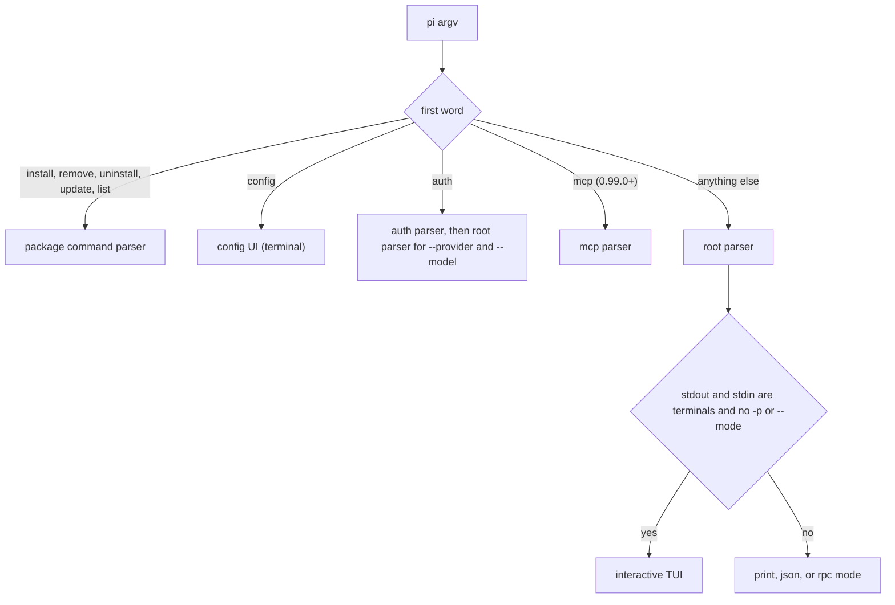

# Pi Agent CLI Surface

## Overview

Pi is a minimal, extensible terminal coding agent from Earendil Works. One `pi` command offers an interactive terminal UI, a print mode (`-p`), a JSON Lines event mode (`--mode json`), and a JSONL RPC mode (`--mode rpc`). From 0.99.0 it also bundles MCP support, codemode, and tool search as built-in extensions, with `pi mcp` commands to manage servers.

The version installed on this host is **0.87.1**, confirmed with `pi --version` on the Bun-global install at `/Users/ken/.bun/bin/pi` (package `@earendil-works/pi-coding-agent`). The newest release is **1.0.0**, published 2026-10-01 according to `npm view @earendil-works/pi-coding-agent version dist-tags time --json` and the GitHub release. The 1.0.0 package was unpacked into a scratch directory and run with `node dist/bundle/cli.js`, so both versions were exercised, and the parser source of both was read.

- Homepage: [pi.dev](https://pi.dev/)
- Repository: [earendil-works/pi](https://github.com/earendil-works/pi)
- Documentation: [pi.dev/docs/latest](https://pi.dev/docs/latest)
- CLI reference: [docs/cli.md](https://github.com/earendil-works/pi/blob/main/packages/coding-agent/docs/cli.md)

## Installation and Binaries

| OS | Command name | Install |
| --- | --- | --- |
| macOS | `pi` | `npm install -g --ignore-scripts @earendil-works/pi-coding-agent` (Node.js 22.19 or newer), `curl -fsSL https://pi.dev/install.sh \| sh`, `pnpm add -g …`, `bun add -g …`, or the `pi-darwin-arm64.tar.gz` / `pi-darwin-x64.tar.gz` release archive |
| Linux (and WSL) | `pi` | The same npm, pnpm, bun, and curl routes; `pi-linux-x64.tar.gz` or `pi-linux-arm64.tar.gz` release archive |
| Windows | `pi` (shims `pi.cmd`, `pi.ps1`); `pi.exe` in the release archive | npm, pnpm, or bun global install; `powershell -c "irm https://pi.dev/install.ps1 \| iex"`; `pi-windows-x64.zip` or `pi-windows-arm64.zip` release archive |

The npm package declares `bin.pi` as `dist/bundle/cli.js`, a Node script. The release archives contain a standalone `pi` (macOS) or `pi.exe` (Windows) next to the docs and a native prebuild; they were listed, not run. The curl installer is a managed, npm-based installation that may install Node.js itself. Uninstalling Pi leaves settings, credentials, sessions, and packages under `~/.pi/agent`.

## Subcommands

| Command path | Runs without a terminal | Purpose |
| --- | --- | --- |
| `install <source>` | yes | Install a package source and add it to settings |
| `remove <source>` | yes | Remove a package source |
| `uninstall <source>` | yes | Alias of `remove` |
| `update [source\|self\|pi]` | yes | Update Pi, packages, one source, or model catalogs |
| `list` | yes | List installed packages |
| `config` | no | Terminal UI to enable or disable package resources |
| `auth` | yes | Print usage |
| `auth check` | yes | Report credential readiness (exit 0, 1, or 2) |
| `auth print-api-key` | yes | Print a resolved API key |
| `auth print-bearer-token` | yes | Print a resolved OAuth bearer token |
| `mcp` (0.99.0+) | yes | Print usage |
| `mcp add` | yes | Add or replace an MCP server |
| `mcp remove` | yes | Remove an MCP server |
| `mcp list` | yes | Connect to servers and report their state |
| `mcp login` | no | Browser sign-in to an OAuth server |
| `mcp logout` | yes | Delete stored OAuth credentials |

`install`, `remove`, and `list` can show a project-trust prompt only when stdin and stdout are terminals and trust is undecided; with no terminal they never prompt, and `--approve` or `--no-approve` removes the prompt. `update` never prompts and uses only the saved trust decision. Slash commands such as `/login` and `/model` exist inside the terminal UI and are not process subcommands.

## CLI Switch Inventory

Inventoried paths: the root entrypoint, and every command path marked non-interactive above (`install`, `remove`, `uninstall`, `update`, `list`, `auth check`, `auth print-api-key`, `auth print-bearer-token`, `mcp add`, `mcp remove`, `mcp list`, `mcp logout`). `config` and `mcp login` are interactive and left out. The frontmatter holds the 66 records; this section summarizes them.

**How the parser reads values.** Pi uses no parsing library. The root parser is a hand-written loop in `dist/cli/args.js` that compares each argument to a switch spelling by exact equality, in both 0.87.1 and 1.0.0; the package commands, `auth`, and `mcp` have their own small loops in `package-manager-cli.js`, `cli/auth-command.js`, and `extensions/mcp/cli.js`. Consequences, all confirmed with disposable runs of both versions under an isolated environment with no credentials:

| Behavior | Evidence |
| --- | --- |
| Only the space-separated form is accepted. `--name=foo`, `--mode=json`, `--thinking=high`, `--tui-mode=regular`, `--list-models=x` are not read as the known switch; they become unknown (extension) flags and `--mode=json` exits 1 with `Unknown option: --mode`. | `--mode=json`, `--tui-mode=regular`, `--list-models=zzz`, and `pi install --local=1 foo`, `pi update --extension=foo`, `pi mcp list --json=1`, `pi mcp add s1 --url=…` runs |
| No spelling accepts an attached value: `-tread` exits 1 with `Unknown option: -tread`, so no `short_attached` form exists. | `-tread --version` run |
| A value switch consumes the next argument even when it starts with a dash. | Every value switch followed by `--version` printed no version; boolean switches followed by `--version` printed it |
| Short spellings are exact words, including multi-character ones: `-nt`, `-nbt`, `-ne`, `-ns`, `-np`, `-nc`, `-xt`, `-na`. | Help output and source |
| `--list-models` takes an optional search term; the term is the next argument unless it starts with `-` or `@`. | Source and run |
| `-p`/`--print` takes no value, but also moves the next argument into the prompt messages unless it starts with `@` or `-`. | Source; recorded as `none` because that argument is a message |

**Root switches.**

| Switch | Value | Notes |
| --- | --- | --- |
| `--provider` | string | 1.0.0: error without `--model` |
| `--model`, `--api-key`, `--session`, `--session-id`, `--fork`, `--session-dir` | string | |
| `--system-prompt`, `--append-system-prompt` | string | Spellings and type only; semantics belong to the `system-prompt` topic. `--append-system-prompt` repeats |
| `--mode` | string | `text`, `json`, or `rpc` |
| `--name`, `-n` | string | |
| `--models`, `--tools`/`-t`, `--exclude-tools`/`-xt` | string | One comma-separated value |
| `--thinking` | string | `off`, `minimal`, `low`, `medium`, `high`, `xhigh`, `max`; invalid value warns |
| `--extension`/`-e`, `--skill`, `--prompt-template`, `--theme` | string | Repeatable, one value each |
| `--use-theme`, `--tui-mode`, `--export` | string | `--export` takes an optional output path as the next positional message |
| `--list-models` | optional string | |
| `--print`/`-p`, `--continue`/`-c`, `--resume`/`-r`, `--no-session`, `--no-tools`/`-nt`, `--no-builtin-tools`/`-nbt`, `--no-extensions`/`-ne`, `--no-skills`/`-ns`, `--no-prompt-templates`/`-np`, `--no-themes`, `--no-context-files`/`-nc`, `--verbose`, `--approve`/`-a`, `--no-approve`/`-na`, `--offline`, `--version`/`-v` | none | |
| `--help`/`-h` | none | Accepted at every path |

Nothing in Pi's switch set is variadic. `--` ends option parsing; the remaining arguments become messages, except those starting with `@`, which are files.

**Package commands.** `-l`/`--local` (`install`, `remove`, `uninstall`); `--approve`/`-a` and `--no-approve`/`-na` (also `update`, `list`); `update` takes `--self`, `--extensions`, `--models`, `--all`, `--force` (no value) and `--extension <source>` (one value that must not start with a dash). `--models` takes a value at the root and none at `update`; `--extension` has an `-e` alias at the root and none at `update`.

**Auth commands.** `--provider <provider>` and `--model <model>` on all three, with at least one required; `--json`, `--credentials`, `--no-refresh` on `auth check`; `--min-expiry <duration>` (`30m`, `1h`, units `ms`, `s`, `m`, `h`) on `auth print-bearer-token`.

**MCP commands** (0.99.0+). `mcp list --json`; `mcp add` and `mcp remove` take `-l`/`--local`; `mcp add` takes `--url`, `--cwd`, `--bearer-token-env-var`, `--oauth-client-id`, `--oauth-client-secret`, `--oauth-client-name`, `--exposure`, `--description`, `--oauth-callback-port` (numeric), and repeatable `--env` and `--header` (`KEY=VALUE`). Option parsing in `mcp add` stops after the server name and the first command token, so a stdio command's own flags pass through.

Gaps: none of the switches is `unknown`. Extension-registered flags are outside this inventory.

## Configuration Discovery

The agent directory defaults to `~/.pi/agent` (`%USERPROFILE%\.pi\agent` on Windows) and moves with `PI_CODING_AGENT_DIR`. Project files live in `.pi/` under the working directory and load only after the project is trusted.

| File | Scope | Role |
| --- | --- | --- |
| `<agent-dir>/settings.json`, `.pi/settings.json` | user, project | Settings; project overrides user |
| `<agent-dir>/mcp.json`, `.pi/mcp.json` | user, project | MCP servers; written by `pi mcp add` and `remove` |
| `<agent-dir>/auth.json` | user | Credentials; written by `/login` |
| `<agent-dir>/models.json` | user | Custom endpoints and models |
| `<agent-dir>/trust.json` | user | Saved project trust decisions |
| `<agent-dir>/keybindings.json` | user | Keybindings |
| `<agent-dir>/SYSTEM.md`, `APPEND_SYSTEM.md`; `.pi/SYSTEM.md`, `APPEND_SYSTEM.md` | user, project | System prompt files; semantics in the `system-prompt` topic |
| `AGENTS.md` / `CLAUDE.md` (and `AGENTS.override.md`) in the agent directory, working directory, and parents | user, repo | Context files; need no trust; disabled by `--no-context-files` |
| `<agent-dir>/sessions/` | user | Session JSONL files |
| `<agent-dir>/mcp.log` | user | MCP connection log |

On this host the agent directory also holds extension, skill, npm, and backup files; credential contents were not read.

## Environment Variables

| Variable | Effect |
| --- | --- |
| `PI_CODING_AGENT_DIR` | Replaces the agent directory |
| `PI_CODING_AGENT_SESSION_DIR` | Replaces the session directory (`--session-dir` wins) |
| `PI_PACKAGE_DIR` | Overrides the package directory for immutable stores |
| `PI_OFFLINE` | Disables automatic network activity |
| `PI_SKIP_VERSION_CHECK` | Disables the latest-version request; set by `--offline` |
| `PI_TELEMETRY` | Overrides install and update telemetry and attribution headers |
| `PI_CACHE_RETENTION` | `long` requests extended prompt caching |
| `PI_SHARE_VIEWER_URL` | Base URL of `/share` |
| `PI_RADIUS_GATEWAY` | Radius gateway origin |
| `PI_OAUTH_CALLBACK_HOST` | Interface for the OAuth callback server |
| `PI_HARDWARE_CURSOR`, `PI_HYPERLINKS`, `PI_IMAGE_PROTOCOL`, `PI_TRUE_COLOR`, `PI_TUI_ESC_TIMEOUT` | Terminal rendering and input overrides |
| `PI_STARTUP_BENCHMARK`, `PI_TIMING`, `PI_EXPERIMENTAL` | Diagnostics; the benchmark exits 1 outside interactive mode |
| `VISUAL`, `EDITOR`, `HTTP_PROXY`, `HTTPS_PROXY` | External editor and proxies |
| `AI_AGENT=pi`, `PI_CODING_AGENT=true` | Set by Pi for child processes |
| `PI_SESSION_ID`, `PI_SESSION_FILE`, `PI_PROVIDER`, `PI_MODEL`, `PI_REASONING_LEVEL` | Set by Pi in its bash and powershell tool shells |

Provider API-key variables (`ANTHROPIC_API_KEY`, `OPENAI_API_KEY`, `AWS_*`, and many others) belong to the `model-config` topic.

## Machine Introspection

| Command | Output | Use |
| --- | --- | --- |
| `pi --version` | text | Bare version string |
| `pi --list-models [search]` | table | Models the local catalog and credentials offer; no JSON variant |
| `pi auth check --provider 
 --json` | JSON, exit 0/1/2 | Credential readiness; observed `{"status":"not_ready","provider":"nonexistent-zz","reason":"provider_not_found"}` |
| `pi mcp list --json` | JSON | MCP server state; connects to servers |
| `pi list` | text | Installed packages |
| `pi --mode rpc --no-session` | JSONL | `get_available_models`, `get_state`, `get_commands` per the RPC docs; not exercised |

No command was found that dumps configuration or its schema; checked `--help` of the root, package, auth, and mcp commands.

## Wrapper Notes

- Send each value as its own argument; equals forms silently turn into unknown extension flags and exit 1.
- A value switch swallows a following dash-prefixed token; an unknown `--flag` swallows the next token unless it starts with `-` or `@`.
- `-p` takes the next token as the prompt unless it starts with `@` or `-`; use `--` for prompts that may start with a dash. After `--`, a token starting with `@` is still a file argument.
- A non-terminal stdin or stdout forces print mode, and piped stdin is prepended to the first prompt, so only a terminal with `pi -- "<prompt>"` starts an interactive session with a first message.
- `--offline` is detected anywhere in argv, even after `--`.
- 1.0.0 defaults to a fullscreen TUI (pass `--tui-mode regular` for scrollback), makes `--provider` without `--model` an error, and `--no-extensions` also disables built-in extensions.
- Without a terminal Pi never prompts for project trust; pass `--approve` or `--no-approve`. Add `--no-extensions`, `--no-skills`, `--no-prompt-templates`, and `--no-context-files` for isolation.
- `pi config` and `pi mcp login` need a terminal or browser; `pi install` and `pi update` run package managers and change the installation or settings.
- `auth print-*` and `auth check --credentials` print secrets to stdout; `--api-key` puts a secret in the process list.
- On native Windows the bash tool needs Git Bash or another `bash.exe`; `shellPath` overrides discovery.
- Pi sets `AI_AGENT=pi` and `PI_CODING_AGENT=true` for children.

## Sources

- [Pi homepage](https://pi.dev/)
- [Pi repository](https://github.com/earendil-works/pi)
- [Pi documentation](https://pi.dev/docs/latest)
- [CLI reference](https://github.com/earendil-works/pi/blob/main/packages/coding-agent/docs/cli.md)
- [Environment variables](https://github.com/earendil-works/pi/blob/main/packages/coding-agent/docs/environment-variables.md)
- [Configuration](https://github.com/earendil-works/pi/blob/main/packages/coding-agent/docs/configuration.md)
- [Security and project trust](https://github.com/earendil-works/pi/blob/main/packages/coding-agent/docs/security.md)
- [Windows setup](https://github.com/earendil-works/pi/blob/main/packages/coding-agent/docs/windows.md)
- [Changelog](https://github.com/earendil-works/pi/blob/main/packages/coding-agent/CHANGELOG.md)
- [GitHub release v1.0.0](https://github.com/earendil-works/pi/releases/tag/v1.0.0)
- [npm package](https://www.npmjs.com/package/@earendil-works/pi-coding-agent)
- Local: `pi --version`, `pi --help` (0.87.1); `npm view` and `npm pack` of `@earendil-works/pi-coding-agent@1.0.0`; source files `dist/cli/args.js`, `dist/main.js`, `dist/package-manager-cli.js`, `dist/cli/auth-command.js`, `dist/extensions/mcp/cli.js`; disposable runs of both versions

## Changelog

- 2026-10-01: Rewritten for contract revision 2; verified 0.87.1 (installed) and 1.0.0 (latest).
- 2026-10-01: Added the `auth` commands, `--use-theme`, `--tui-mode`, and the 1.0.0 `mcp` commands; recorded that built-in MCP exists since 0.99.0.
- 2026-10-01: Corrected `--export`: the output path is the first positional message, so `--export <input> <output>` works.
- 2026-10-01: Recorded space-only attachment, no attached short values, and dash-prefixed value consumption.
- 2026-10-01: Recorded 1.0.0 changes: fullscreen default, `--provider` requires `--model`, `--no-extensions` also disables built-in extensions.
- 2026-10-01: Added standalone release archives (`pi`, `pi.exe`), the PowerShell installer, `mcp.json`, `mcp.log`, and session environment variables.
- 2026-09-28: Recorded the interactive startup-prompt form `pi -- "<prompt>"`, which needs 0.84.3 or later (earlier entry, kept; the `--` branch was re-read in the 0.87.1 and 1.0.0 parsers).
- 2026-07-03: Previous research against 0.80.3 and a stale 0.73.1 install.