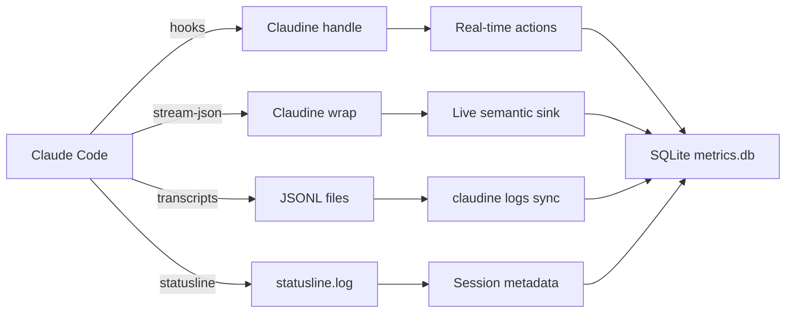

# Claude Code Logging

## Introduction to Claude Code Logging

Claude Code maintains two distinct logging surfaces: the **CLI transcript system** used by both interactive and non-interactive sessions, and the **Desktop application logs** emitted by the Electron-based GUI wrapper on macOS. Both are relevant to observability, but they serve different purposes and use different formats.

### Log Locations

#### CLI Transcripts (Primary Audit Trail)

| Platform | Path | Purpose |
|----------|------|---------|
| macOS / Linux | `~/.claude/projects/<sanitized-cwd>/<session-id>.jsonl` | Per-session conversation transcript |
| macOS / Linux | `~/.claude/projects/<sanitized-cwd>/<session-id>/subagents/agent-<id>.jsonl` | Nested subagent transcripts |
| macOS / Linux | `~/.claude/sessions/<pid>.json` | Live session metadata (PID, start time, model) |
| macOS / Linux | `~/.claude/history.jsonl` | User prompt history across all sessions |
| macOS / Linux | `~/.claude/statusline.log` | Status-line integration output (desktop + CLI) |

The `<sanitized-cwd>` segment replaces path separators with hyphens (e.g., `-Users-ken--claudine-worktrees-feat-sniff-tuning`). Session IDs are UUIDv4 strings. Transcripts are **append-only JSONL** files that grow for the lifetime of the session and are never rotated or archived by Claude Code itself.

Subagent transcripts live in a nested `subagents/` folder beneath the parent session file. This means a single user session can spawn many subagent transcripts, each with its own independent JSONL file.

#### Desktop Application Logs (macOS)

| Path | Content |
|------|---------|
| `~/Library/Logs/Claude/main.log` | Main Electron renderer process logs |
| `~/Library/Logs/Claude/mcp.log` | MCP server lifecycle and errors |
| `~/Library/Logs/Claude/sdk_daemon.log` | Claude SDK daemon process logs |
| `~/Library/Logs/Claude/claude.ai-web.log` | Webview and streaming logs |
| `~/Library/Logs/Claude/chrome-native-host.log` | Native messaging host logs |
| `~/Library/Logs/Claude/window.log` | Window manager events |

These logs use a plain-text format with ISO timestamps and log levels (`[info]`, `[error]`, `[warn]`). They are useful for debugging application crashes, MCP server failures, and network issues, but they do **not** contain conversation content or tool calls.

### Log Organization, Splitting, and Archival

Claude Code does not implement automatic log rotation or archival. Transcripts accumulate indefinitely in `~/.claude/projects/` unless the user manually deletes them. There is no size-based splitting or time-based archival strategy. The only boundary is the **session boundary** — each new session gets its own `<session-id>.jsonl` file.

The `~/.claude/sessions/` directory contains small JSON metadata files (one per active process) that track:

| Field | Example | Description |
|-------|---------|-------------|
| `pid` | `98234` | OS process ID |
| `sessionId` | `986843c0-a9a7-49d0-84bb-98062b892da4` | Session UUID |
| `cwd` | `/Users/ken/project` | Working directory at launch |
| `startedAt` | `1777508009085` | Unix epoch ms |
| `version` | `2.1.123` | Claude Code version |
| `kind` | `interactive` or `headless` | Session mode |
| `status` | `idle`, `active`, `error` | Current state |

These files are ephemeral — they are created when `claude` starts and removed when it exits cleanly.

### Format of the Log Files

#### Transcript JSONL Format

Each line in a transcript file is a self-contained JSON object. The top-level schema varies by `type` but shares common provenance fields:

| Common Field | Type | Description |
|-------------|------|-------------|
| `type` | `string` | Event discriminator (`user`, `assistant`, `system`, `tool_use`, `tool_result`, `result`, `rate_limit_event`, `attachment`, `file-history-snapshot`) |
| `uuid` | `string` | Unique event identifier |
| `timestamp` | `string` (ISO 8601) | Event time |
| `sessionId` | `string` | Session UUID |
| `parentUuid` | `string` or `null` | Parent event in the conversation tree |
| `version` | `string` | Claude Code version (e.g., `2.1.91`) |
| `cwd` | `string` | Working directory |
| `entrypoint` | `string` | `cli`, `ide`, or `web` |
| `userType` | `string` | `external` (human) or `internal` (system) |

#### System Event Subtypes

`system` events carry a `subtype` field that further discriminates them:

| Subtype | When Emitted |
|---------|-------------|
| `init` | Session initialization |
| `api_retry` | API call failed and will retry |
| `compact_boundary` | Context compaction occurred |
| `hook_started` | Hook script began executing |
| `hook_response` | Hook script completed |
| `hook_progress` | Hook script emitted progress |
| `task_notification` | Subagent notification |
| `task_started` | Subagent began |
| `task_progress` | Subagent progress update |
| `files_persisted` | Files written to disk |
| `local_command_output` | Output from a local shell command |
| `status` | Generic status update |
| `stop_hook_summary` | Stop hook execution summary |
| `turn_duration` | Turn timing telemetry |

### SQLite or Database Usage

Claude Code **does not use SQLite or any embedded database** for its own logs. All persistence is file-based:

- **Transcripts**: JSONL (newline-delimited JSON)
- **History**: JSONL
- **Session metadata**: Individual JSON files
- **Settings**: JSON files (`settings.json`, `managed-settings.json`)
- **State**: JSON files (`info.json`, `stats-cache.json`, `policy-limits.json`)

Claudine itself introduces a SQLite reporting layer (`~/.claudine/logs/metrics.db`) that ingests and indexes these JSONL files, but that is a downstream consumer — not part of Claude Code's native architecture.

### Major Types of Log Messages

Claude Code distinguishes several major categories of log messages in its transcripts:

| Category | `type` Value | Description |
|----------|-------------|-------------|
| **User Messages** | `user` | Human prompts, tool results fed back to the model, command invocations (`/clear`, `/compact`) |
| **Assistant Messages** | `assistant` | Model responses including `thinking`, `text`, and `tool_use` content blocks |
| **System Events** | `system` | Lifecycle, errors, hooks, compaction, and telemetry |
| **Tool Calls** | `tool_use` | Tool invocation with `id`, `name`, and `input` |
| **Tool Results** | `tool_result` | Tool completion with `tool_use_id` and `content` |
| **Session Results** | `result` | Terminal event with cost, tokens, duration, and stop reason |
| **Rate Limits** | `rate_limit_event` | Subscription plan cap warnings and blocks |
| **Attachments** | `attachment` | Deferred tool deltas and capability advertisements |
| **File Snapshots** | `file-history-snapshot` | File tracking metadata for undo operations |

In non-interactive (`-p`) mode with `--output-format stream-json`, Claude Code emits a **stream-json** variant that is a subset of the full transcript, optimized for programmatic consumption. This stream uses the same `type` discriminator but omits some internal bookkeeping events.

---

## Logging Schema

### Official Schema Status

Anthropic **does publish an official schema** for the `stream-json` output format, but it is distributed as **TypeScript type definitions** inside the `@anthropic-ai/claude-agent-sdk` npm package rather than as a standalone JSON Schema or OpenAPI specification.

| Property | Value |
|----------|-------|
| **Package** | `@anthropic-ai/claude-agent-sdk` |
| **Version** | `0.2.92+` |
| **File** | `sdk.d.ts` (bundled in npm) |
| **Docs** | [Agent SDK TypeScript](https://platform.claude.com/docs/en/agent-sdk/typescript) |
| **Python equivalent** | `claude-agent-sdk` on PyPI ([docs](https://platform.claude.com/docs/en/agent-sdk/python)) |

The TypeScript SDK defines a discriminated union of 21 message types:

```typescript
type SDKMessage =
  | SDKAssistantMessage        // type: "assistant"
  | SDKUserMessage             // type: "user"
  | SDKUserMessageReplay       // type: "user_message_replay"
  | SDKResultMessage           // type: "result"
  | SDKSystemMessage           // type: "system"
  | SDKPartialAssistantMessage // type: "stream_event"
  | SDKCompactBoundaryMessage  // type: "compact_boundary"
  | SDKStatusMessage           // type: "status"
  | SDKLocalCommandOutputMessage // type: "local_command_output"
  | SDKHookStartedMessage      // type: "hook_started"
  | SDKHookProgressMessage     // type: "hook_progress"
  | SDKHookResponseMessage     // type: "hook_response"
  | SDKToolProgressMessage     // type: "tool_progress"
  | SDKAuthStatusMessage       // type: "auth_status"
  | SDKTaskNotificationMessage // type: "task_notification"
  | SDKTaskStartedMessage      // type: "task_started"
  | SDKTaskProgressMessage     // type: "task_progress"
  | SDKFilesPersistedEvent     // type: "files_persisted"
  | SDKToolUseSummaryMessage   // type: "tool_use_summary"
  | SDKRateLimitEvent          // type: "rate_limit_event"
  | SDKPromptSuggestionMessage; // type: "prompt_suggestion"
```

No JSON Schema, OpenAPI, AsyncAPI, or RAML specification has been published. The TypeScript type definitions are the closest authoritative source.

### Rust Schema Representation

Based on the official TypeScript SDK, observed transcript files, and Claudine's existing `stream::protocol::claude` module, the following Rust structs and enums model Claude Code's log schema:

```rust
use serde::Deserialize;
use serde_json::Value;
use chrono::{DateTime, Utc};

/// Top-level discriminated union of all Claude Code stream events.
#[derive(Debug, Deserialize)]
#[serde(tag = "type")]
pub enum ClaudeEvent {
    #[serde(rename = "init")]
    Init(ClaudeInit),
    #[serde(rename = "system")]
    System(ClaudeSystem),
    #[serde(rename = "assistant")]
    Assistant(ClaudeAssistant),
    #[serde(rename = "user")]
    User(ClaudeUser),
    #[serde(rename = "content_block_start")]
    ContentBlockStart(ClaudeContentBlockStart),
    #[serde(rename = "content_block_delta")]
    ContentBlockDelta(ClaudeContentBlockDelta),
    #[serde(rename = "tool_use")]
    ToolUse(ClaudeToolUse),
    #[serde(rename = "tool_result")]
    ToolResult(ClaudeToolResult),
    #[serde(rename = "result")]
    Result(ClaudeResult),
    #[serde(rename = "rate_limit_event")]
    RateLimit(ClaudeRateLimit),
    #[serde(rename = "error")]
    Error(ClaudeErrorEvent),
    #[serde(rename = "assistant.error")]
    AssistantError(ClaudeErrorEvent),
    #[serde(rename = "stream_event")]
    StreamEvent(ClaudeStreamEvent),
    #[serde(rename = "compact_boundary")]
    CompactBoundary(ClaudeCompactBoundary),
    #[serde(rename = "status")]
    Status(ClaudeStatus),
    #[serde(rename = "hook_started")]
    HookStarted(ClaudeHookEvent),
    #[serde(rename = "hook_progress")]
    HookProgress(ClaudeHookEvent),
    #[serde(rename = "hook_response")]
    HookResponse(ClaudeHookEvent),
    #[serde(rename = "task_notification")]
    TaskNotification(ClaudeTaskEvent),
    #[serde(rename = "task_started")]
    TaskStarted(ClaudeTaskEvent),
    #[serde(rename = "task_progress")]
    TaskProgress(ClaudeTaskEvent),
    #[serde(rename = "files_persisted")]
    FilesPersisted(ClaudeFilesPersisted),
    #[serde(rename = "tool_use_summary")]
    ToolUseSummary(ClaudeToolUseSummary),
    #[serde(rename = "auth_status")]
    AuthStatus(ClaudeAuthStatus),
    #[serde(rename = "prompt_suggestion")]
    PromptSuggestion(ClaudePromptSuggestion),
    #[serde(rename = "local_command_output")]
    LocalCommandOutput(ClaudeLocalCommandOutput),
}

/// Session initialization metadata.
#[derive(Debug, Default, Deserialize)]
pub struct ClaudeInit {
    #[serde(default)]
    pub session_id: Option<String>,
    #[serde(default)]
    pub model: Option<String>,
    #[serde(default, rename = "apiKeySource")]
    pub api_key_source: Option<String>,
    #[serde(default, rename = "claude_code_version")]
    pub claude_code_version: Option<String>,
    #[serde(default, rename = "permissionMode")]
    pub permission_mode: Option<String>,
}

/// System event with subtype discriminator.
#[derive(Debug, Default, Deserialize)]
pub struct ClaudeSystem {
    #[serde(default)]
    pub subtype: Option<String>,
    #[serde(default)]
    pub session_id: Option<String>,
    /// Retryable API error classification.
    #[serde(default)]
    pub error: Option<String>,
    #[serde(default, rename = "error_status")]
    pub error_status: Option<u16>,
    #[serde(default)]
    pub attempt: Option<u32>,
    #[serde(default, rename = "max_retries")]
    pub max_retries: Option<u32>,
    #[serde(default, rename = "retry_delay_ms")]
    pub retry_delay_ms: Option<u64>,
    #[serde(default)]
    pub uuid: Option<String>,
}

/// Assistant response envelope.
#[derive(Debug, Default, Deserialize)]
pub struct ClaudeAssistant {
    #[serde(default)]
    pub message: Option<ClaudeAssistantMessage>,
    #[serde(default)]
    pub content: Option<Vec<ClaudeContentPart>>,
    /// Synthetic error discriminator (e.g., `"billing_error"`).
    #[serde(default)]
    pub error: Option<String>,
}

#[derive(Debug, Default, Deserialize)]
pub struct ClaudeAssistantMessage {
    #[serde(default)]
    pub content: Option<Vec<ClaudeContentPart>>,
    #[serde(default)]
    pub role: Option<String>,
    #[serde(default)]
    pub model: Option<String>,
    #[serde(default)]
    pub usage: Option<ClaudeUsage>,
}

/// User event (prompt or tool result replay).
#[derive(Debug, Default, Deserialize)]
pub struct ClaudeUser {
    #[serde(default)]
    pub message: Option<ClaudeUserMessage>,
    #[serde(default)]
    pub session_id: Option<String>,
    #[serde(default, rename = "parent_tool_use_id")]
    pub parent_tool_use_id: Option<String>,
}

#[derive(Debug, Default, Deserialize)]
pub struct ClaudeUserMessage {
    #[serde(default)]
    pub content: Option<Vec<Value>>,
}

/// Content block within assistant/user messages.
#[derive(Debug, Default, Deserialize)]
pub struct ClaudeContentPart {
    #[serde(rename = "type", default)]
    pub kind: Option<String>,
    #[serde(default)]
    pub text: Option<String>,
    #[serde(default)]
    pub thinking: Option<String>,
    #[serde(default)]
    pub id: Option<String>,
    #[serde(default, rename = "tool_use_id")]
    pub tool_use_id: Option<String>,
    #[serde(default)]
    pub name: Option<String>,
    #[serde(default, rename = "tool_name")]
    pub tool_name: Option<String>,
    #[serde(default)]
    pub input: Option<Value>,
}

/// `content_block_start` event.
#[derive(Debug, Default, Deserialize)]
pub struct ClaudeContentBlockStart {
    #[serde(default)]
    pub content_block: Option<ClaudeContentBlock>,
    #[serde(default)]
    pub index: Option<usize>,
}

#[derive(Debug, Default, Deserialize)]
pub struct ClaudeContentBlock {
    #[serde(rename = "type", default)]
    pub kind: Option<String>,
    #[serde(default)]
    pub id: Option<String>,
    #[serde(default)]
    pub name: Option<String>,
    #[serde(default, rename = "tool_name")]
    pub tool_name: Option<String>,
    #[serde(default)]
    pub input: Option<Value>,
}

/// `content_block_delta` event for streaming tokens.
#[derive(Debug, Default, Deserialize)]
pub struct ClaudeContentBlockDelta {
    #[serde(default)]
    pub delta: Option<ClaudeDelta>,
    #[serde(default)]
    pub index: Option<usize>,
}

#[derive(Debug, Default, Deserialize)]
pub struct ClaudeDelta {
    #[serde(rename = "type", default)]
    pub kind: Option<String>,
    #[serde(default)]
    pub text: Option<String>,
    #[serde(default)]
    pub thinking: Option<String>,
    #[serde(default, rename = "partial_json")]
    pub partial_json: Option<String>,
}

/// Tool invocation event.
#[derive(Debug, Default, Deserialize)]
pub struct ClaudeToolUse {
    #[serde(default)]
    pub id: Option<String>,
    #[serde(default, rename = "tool_use_id")]
    pub tool_use_id: Option<String>,
    #[serde(default)]
    pub name: Option<String>,
    #[serde(default, rename = "tool_name")]
    pub tool_name: Option<String>,
    #[serde(default)]
    pub input: Option<Value>,
}

/// Tool completion event.
#[derive(Debug, Default, Deserialize)]
pub struct ClaudeToolResult {
    #[serde(default, rename = "tool_use_id")]
    pub tool_use_id: Option<String>,
    #[serde(default)]
    pub id: Option<String>,
    #[serde(default)]
    pub content: Option<Value>,
    #[serde(default)]
    pub output: Option<Value>,
    #[serde(default)]
    pub result: Option<Value>,
    #[serde(default, rename = "is_error")]
    pub is_error: Option<bool>,
}

/// Terminal session result event.
#[derive(Debug, Default, Deserialize)]
pub struct ClaudeResult {
    #[serde(default)]
    pub subtype: Option<String>,
    #[serde(default, rename = "duration_ms")]
    pub duration_ms: Option<u64>,
    #[serde(default, rename = "duration_api_ms")]
    pub duration_api_ms: Option<u64>,
    #[serde(default, rename = "num_turns")]
    pub num_turns: Option<u64>,
    #[serde(default, rename = "stop_reason")]
    pub stop_reason: Option<String>,
    #[serde(default, rename = "total_cost_usd")]
    pub total_cost_usd: Option<f64>,
    #[serde(default, rename = "cost_usd")]
    pub cost_usd: Option<f64>,
    #[serde(default)]
    pub usage: Option<ClaudeUsage>,
    #[serde(default, rename = "is_error")]
    pub is_error: Option<bool>,
    #[serde(default)]
    pub result: Option<String>,
    #[serde(default, rename = "permission_denials")]
    pub permission_denials: Option<Vec<Value>>,
    #[serde(default, rename = "terminal_reason")]
    pub terminal_reason: Option<String>,
    #[serde(default, rename = "modelUsage")]
    pub model_usage: Option<Value>,
}

#[derive(Debug, Default, Deserialize)]
pub struct ClaudeUsage {
    #[serde(default, rename = "input_tokens")]
    pub input_tokens: Option<u64>,
    #[serde(default, rename = "output_tokens")]
    pub output_tokens: Option<u64>,
    #[serde(default, rename = "cache_read_input_tokens")]
    pub cache_read_input_tokens: Option<u64>,
    #[serde(default, rename = "cache_creation_input_tokens")]
    pub cache_creation_input_tokens: Option<u64>,
}

/// Rate limit notification.
#[derive(Debug, Default, Deserialize)]
pub struct ClaudeRateLimit {
    #[serde(default, rename = "is_throttled")]
    pub is_throttled: Option<bool>,
    #[serde(default, rename = "retry_after_ms")]
    pub retry_after_ms: Option<u64>,
    #[serde(default)]
    pub message: Option<String>,
    #[serde(default, rename = "rate_limit_info")]
    pub rate_limit_info: Option<ClaudeRateLimitInfo>,
    #[serde(default, rename = "resetsAt")]
    pub resets_at: Option<i64>,
    #[serde(default, rename = "reset_at")]
    pub reset_at_seconds: Option<i64>,
}

#[derive(Debug, Default, Deserialize)]
pub struct ClaudeRateLimitInfo {
    #[serde(default)]
    pub status: Option<String>,
    #[serde(default, rename = "resetsAt")]
    pub resets_at: Option<i64>,
    #[serde(default, rename = "rateLimitType")]
    pub rate_limit_type: Option<String>,
    #[serde(default, rename = "overageStatus")]
    pub overage_status: Option<String>,
    #[serde(default)]
    pub message: Option<String>,
}

/// Error event (top-level or assistant-wrapped).
#[derive(Debug, Default, Deserialize)]
pub struct ClaudeErrorEvent {
    #[serde(default)]
    pub error: Option<ClaudeErrorDetail>,
}

#[derive(Debug, Default, Deserialize)]
pub struct ClaudeErrorDetail {
    #[serde(rename = "type", default)]
    pub kind: Option<String>,
    #[serde(default)]
    pub message: Option<String>,
}

// Additional stream-json specific types

#[derive(Debug, Default, Deserialize)]
pub struct ClaudeStreamEvent {
    #[serde(default)]
    pub delta: Option<ClaudeDelta>,
}

#[derive(Debug, Default, Deserialize)]
pub struct ClaudeCompactBoundary {
    #[serde(default)]
    pub boundary_id: Option<String>,
}

#[derive(Debug, Default, Deserialize)]
pub struct ClaudeStatus {
    #[serde(default)]
    pub message: Option<String>,
}

#[derive(Debug, Default, Deserialize)]
pub struct ClaudeHookEvent {
    #[serde(default)]
    pub hook_name: Option<String>,
    #[serde(default)]
    pub duration_ms: Option<u64>,
    #[serde(default)]
    pub result: Option<Value>,
}

#[derive(Debug, Default, Deserialize)]
pub struct ClaudeTaskEvent {
    #[serde(default)]
    pub task_id: Option<String>,
    #[serde(default)]
    pub message: Option<String>,
}

#[derive(Debug, Default, Deserialize)]
pub struct ClaudeFilesPersisted {
    #[serde(default)]
    pub files: Option<Vec<String>>,
}

#[derive(Debug, Default, Deserialize)]
pub struct ClaudeToolUseSummary {
    #[serde(default)]
    pub tool_name: Option<String>,
    #[serde(default)]
    pub count: Option<u32>,
}

#[derive(Debug, Default, Deserialize)]
pub struct ClaudeAuthStatus {
    #[serde(default)]
    pub authenticated: Option<bool>,
    #[serde(default, rename = "apiKeySource")]
    pub api_key_source: Option<String>,
}

#[derive(Debug, Default, Deserialize)]
pub struct ClaudePromptSuggestion {
    #[serde(default)]
    pub suggestion: Option<String>,
}

#[derive(Debug, Default, Deserialize)]
pub struct ClaudeLocalCommandOutput {
    #[serde(default)]
    pub command: Option<String>,
    #[serde(default)]
    pub stdout: Option<String>,
    #[serde(default)]
    pub stderr: Option<String>,
}

/// Full transcript event (superset of stream-json, includes internal events).
#[derive(Debug, Deserialize)]
#[serde(tag = "type")]
pub enum ClaudeTranscriptEvent {
    #[serde(rename = "user")]
    User(ClaudeTranscriptUser),
    #[serde(rename = "assistant")]
    Assistant(ClaudeTranscriptAssistant),
    #[serde(rename = "system")]
    System(ClaudeTranscriptSystem),
    #[serde(rename = "tool_use")]
    ToolUse(ClaudeToolUse),
    #[serde(rename = "tool_result")]
    ToolResult(ClaudeToolResult),
    #[serde(rename = "result")]
    Result(ClaudeResult),
    #[serde(rename = "rate_limit_event")]
    RateLimit(ClaudeRateLimit),
    #[serde(rename = "attachment")]
    Attachment(ClaudeAttachment),
    #[serde(rename = "file-history-snapshot")]
    FileHistorySnapshot(ClaudeFileHistorySnapshot),
}

#[derive(Debug, Default, Deserialize)]
pub struct ClaudeTranscriptUser {
    #[serde(default)]
    pub uuid: Option<String>,
    #[serde(default)]
    pub timestamp: Option<DateTime<Utc>>,
    #[serde(default)]
    pub session_id: Option<String>,
    #[serde(default, rename = "parentUuid")]
    pub parent_uuid: Option<String>,
    #[serde(default)]
    pub message: Option<Value>,
    #[serde(default)]
    pub prompt_id: Option<String>,
    #[serde(default, rename = "permissionMode")]
    pub permission_mode: Option<String>,
    #[serde(default, rename = "toolUseResult")]
    pub tool_use_result: Option<Value>,
}

#[derive(Debug, Default, Deserialize)]
pub struct ClaudeTranscriptAssistant {
    #[serde(default)]
    pub uuid: Option<String>,
    #[serde(default)]
    pub timestamp: Option<DateTime<Utc>>,
    #[serde(default)]
    pub session_id: Option<String>,
    #[serde(default, rename = "parentUuid")]
    pub parent_uuid: Option<String>,
    #[serde(default)]
    pub message: Option<Value>,
    #[serde(default, rename = "requestId")]
    pub request_id: Option<String>,
    #[serde(default)]
    pub usage: Option<ClaudeUsage>,
    #[serde(default, rename = "userType")]
    pub user_type: Option<String>,
    #[serde(default)]
    pub slug: Option<String>,
}

#[derive(Debug, Default, Deserialize)]
pub struct ClaudeTranscriptSystem {
    #[serde(default)]
    pub uuid: Option<String>,
    #[serde(default)]
    pub timestamp: Option<DateTime<Utc>>,
    #[serde(default)]
    pub session_id: Option<String>,
    #[serde(default, rename = "parentUuid")]
    pub parent_uuid: Option<String>,
    #[serde(default)]
    pub subtype: Option<String>,
    #[serde(default)]
    pub content: Option<String>,
    #[serde(default)]
    pub level: Option<String>,
    #[serde(default, rename = "isMeta")]
    pub is_meta: Option<bool>,
    #[serde(default)]
    pub message_count: Option<u32>,
    #[serde(default, rename = "durationMs")]
    pub duration_ms: Option<u64>,
    #[serde(default)]
    pub hook_count: Option<u32>,
    #[serde(default)]
    pub hook_errors: Option<Vec<Value>>,
    #[serde(default, rename = "preventedContinuation")]
    pub prevented_continuation: Option<bool>,
    #[serde(default)]
    pub stop_reason: Option<String>,
    #[serde(default)]
    pub has_output: Option<bool>,
}

#[derive(Debug, Default, Deserialize)]
pub struct ClaudeAttachment {
    #[serde(default)]
    pub uuid: Option<String>,
    #[serde(default)]
    pub timestamp: Option<DateTime<Utc>>,
    #[serde(default)]
    pub prompt_id: Option<String>,
    #[serde(default, rename = "parentUuid")]
    pub parent_uuid: Option<String>,
    #[serde(default)]
    pub attachment: Option<Value>,
}

#[derive(Debug, Default, Deserialize)]
pub struct ClaudeFileHistorySnapshot {
    #[serde(default, rename = "messageId")]
    pub message_id: Option<String>,
    #[serde(default)]
    pub snapshot: Option<Value>,
    #[serde(default, rename = "isSnapshotUpdate")]
    pub is_snapshot_update: Option<bool>,
}
```

### Community Schema Attempts

A community reverse-engineered schema exists in the `anth0nylawrence/blaze` project, but it is outdated and not authoritative. The Claude Code GitHub repository (`anthropics/claude-code`) contains issue threads that document stream-json behavior and edge cases, but no formal schema contributions.

---

## Informational Content versus Hook Events

Claudine's current architecture captures agentic activity primarily through **hook events** — the 14 lifecycle hooks that Claude Code exposes (`SessionStart`, `PreToolUse`, `PostToolUse`, `Stop`, etc.). This section evaluates when file-system logs are a better source, when hooks are superior, and what other sources can enrich the data.

### When Log Files Are the Better Source

| Scenario | Why Transcripts Win |
|----------|---------------------|
| **Token and cost analysis** | Only `result` and `assistant` events expose `usage.input_tokens`, `usage.output_tokens`, and `total_cost_usd`. Hooks carry no token or billing data. |
| **Rate-limit monitoring** | `rate_limit_event` appears only in the stream/transcript. There is no hook equivalent. |
| **Model identification** | The `init.model`, `assistant.message.model`, and `result.modelUsage` fields show actual model usage. Hooks only expose `model` on `SessionStart`. |
| **Error classification** | `system/api_retry` events carry a typed `error` enum (`billing_error`, `rate_limit`, `server_error`, etc.). Hooks only see `PostToolUseFailure` with a plain string `error`. |
| **Post-hoc session replay** | Transcripts contain the full conversation tree with `parentUuid` linkage, enabling reconstruction of every turn. Hooks only fire at specific lifecycle points. |
| **Subagent internals** | Subagent permission prompts and questions are invisible in hooks. Capturing the subagent's own transcript file provides complete visibility. |
| **Historical analysis** | Transcripts persist indefinitely. Hooks only fire if Claudine is installed and configured at the time of the session. |
| **Duration and timing** | `result.duration_ms` and `system/turn_duration` provide precise wall-clock and API timing. Hooks have no timing data. |

### When Hook Events Are the Better Source

| Scenario | Why Hooks Win |
|----------|---------------|
| **Real-time interception** | Hooks fire synchronously and can block, modify, or inject context before an action proceeds. Logs are read-only. |
| **Rich tool context** | `PreToolUse` and `PostToolUse` hooks receive full `tool_input` and `tool_response` objects with strongly typed fields. Stream `tool_use`/`tool_result` events are sometimes truncated. |
| **Permission decisions** | `PermissionRequest` hooks fire before a permission dialog appears, allowing automated policy enforcement. The stream only sees the eventual `tool_result` (often with `is_error: true`). |
| **Environment metadata** | Every hook receives `session_id`, `cwd`, `permission_mode`, and `transcript_path` in a consistent envelope. Extracting this from transcripts requires parsing multiple event types. |
| **Subagent injection** | `SubagentStart` hooks can inject `additionalContext` into a newly spawned subagent. No log-based mechanism can modify an in-flight subagent. |
| **User prompt blocking** | `UserPromptSubmit` hooks can block and erase prompts from context. Transcripts only record what was already accepted. |
| **Guaranteed delivery** | Hooks are pushed to Claudine by Claude Code. Reading transcripts requires polling the filesystem and detecting new files. |

### Other Sources for Data Enrichment

Beyond hooks and transcripts, several additional sources can enrich observability:

| Source | What It Provides | Integration Strategy |
|--------|-----------------|----------------------|
| **`--output-format stream-json`** | Real-time NDJSON stream of 21 event types in non-interactive mode | Wrap `claude -p` and parse stdout; this is how Claudine's wrapper already operates |
| **`~/.claude/statusline.log`** | Session metadata including model, cost, rate limits, and git context | Parse the JSON payloads written by Claude Code's status-line integration |
| **`~/.claude/sessions/<pid>.json`** | Live process metadata (PID, start time, version, status) | Poll for active sessions; useful for "who is running now" dashboards |
| **`~/Library/Logs/Claude/mcp.log`** | MCP server startup, crashes, and errors | Monitor for infrastructure failures that affect tool availability |
| **Desktop app `main.log`** | Application-level errors (webview crashes, update failures) | Useful for correlating "Claude stopped working" reports with actual crashes |
| **Hook `async: true` handlers** | Fire-and-forget background logging that does not block the agent | Ideal for sending events to external observability platforms without latency penalty |
| **`/compact` command events** | `PreCompact` hook and `system/compact_boundary` stream event | Track context window pressure and how often conversation history is truncated |

### Recommended Hybrid Strategy

For comprehensive observability, Claudine should continue using **hooks for real-time action and policy enforcement** while also **ingesting transcripts for historical analysis, cost tracking, and session replay**. The wrapper's `stream-json` parser already captures the richest real-time signal; augmenting it with periodic transcript ingestion would close the gap on:

- Token and cost aggregation
- Rate-limit trend analysis  
- Multi-session historical queries
- Subagent internal behavior



---

## Sources

- [Claude Code Hooks Guide](https://code.claude.com/docs/en/hooks-guide)
- [Claude Code Hooks Reference](https://code.claude.com/docs/en/hooks)
- [Claude Code Settings Reference](https://code.claude.com/docs/en/settings)
- [Claude Code Headless / Agent SDK CLI](https://code.claude.com/docs/en/headless)
- [Agent SDK Overview](https://platform.claude.com/docs/en/agent-sdk/overview)
- [Agent SDK TypeScript](https://platform.claude.com/docs/en/agent-sdk/typescript)
- [Agent SDK Python](https://platform.claude.com/docs/en/agent-sdk/python)
- [Agent SDK Streaming Output](https://platform.claude.com/docs/en/agent-sdk/streaming-output)
- [Claude Code CLI Reference](https://code.claude.com/docs/en/cli-reference)
- [Claude Code Costs & Billing](https://code.claude.com/docs/en/costs)
- [Claude Code Permissions](https://code.claude.com/docs/en/permissions)
- [`@anthropic-ai/claude-agent-sdk` npm package](https://www.npmjs.com/package/@anthropic-ai/claude-agent-sdk)
- [`claude-agent-sdk` PyPI package](https://pypi.org/project/claude-agent-sdk/)
- [Anthropic Community Forum](https://community.anthropic.com)
- [Claude Code GitHub Issues](https://github.com/anthropics/claude-code/issues)
