# Claude Code Logging

## Introduction to Claude Code Logging

Claude Code (Anthropic's agentic CLI, current observed version `2.1.198`) is a **pure file-based** system — it writes **no SQLite or embedded database** of its own. Observability data is spread across JSONL transcripts, JSON metadata, plain-text desktop logs, and shell-snapshot files under `~/.claude` (overridable via `CLAUDE_CONFIG_DIR`). A full `find ~/.claude -name "*.sqlite"` on this host returned **zero** database files.

There are two distinct event formats that must not be conflated:

1. **On-disk transcript JSONL** — the interactive audit trail written to `~/.claude/projects/`. This is what a forensic log reader consumes.
2. **Stream-JSON SDK output** — the programmatic newline-delimited JSON emitted by `claude -p --output-format stream-json` and the Agent SDK. This is what a wrapper (like Claudine) consumes live.

They share many `type` discriminators but **differ materially**: the transcript carries interactive bookkeeping events (`mode`, `permission-mode`, `ai-title`, `last-prompt`, `queue-operation`) that the stream never emits, while the stream carries terminal/cost events (`result`, `rate_limit_event`, `stream_event`, `tool_progress`, `auth_status`) that are **never written to the transcript file** — cost/usage instead lives inline in `assistant.message.usage`.

### Log Locations and Organization

| Path | Format | Purpose |
|------|--------|---------|
| `~/.claude/projects/{sanitized_cwd}/{session_id}.jsonl` | JSONL | Per-session interactive transcript (primary audit trail) |
| `~/.claude/projects/{sanitized_cwd}/{session_id}/subagents/agent-{agent_id}.jsonl` | JSONL | Subagent (sidechain) transcripts |
| `~/.claude/history.jsonl` | JSONL | Global user-prompt history |
| `~/.claude/sessions/{pid}.json` | JSON | Live process metadata (ephemeral) |
| `~/.claude/file-history/{session_id}/{file_hash}@v{n}` | JSON | File snapshots for undo |
| `~/.claude/session-env/{session_id}/` | dir | Per-session scratch dirs (transient, usually empty) |
| `~/.claude/tasks/{task_id}/` | dir | Background Task state (`.lock` + `.highwatermark`) |
| `~/.claude/shell-snapshots/snapshot-zsh-{nanos}-{rand}.sh` | text | Shell-env snapshots for session restore |
| `~/.claude/statusline.log` | text | **User-script** output (cc-statusline); not Claude-native |
| `~/.claude/{info.json,stats-cache.json,.last-update-result.json}` | JSON | Hardware cache, usage stats, auto-update outcome |
| `~/Library/Logs/Claude/*.log` | text | **Desktop (Electron) app** logs only |

The `{sanitized_cwd}` segment replaces path separators with hyphens (e.g. `-Users-ken--claudine-worktrees-rusty-biscuit-claudine`). Session IDs are UUIDv4. **There is no date sharding** — transcripts are sharded by sanitized cwd only (contrast with Codex's `sessions/YYYY/MM/DD/` tree).

### Organization, Splitting, and Archival

Claude Code implements **no rotation and no archival**. Transcripts accumulate indefinitely under `~/.claude/projects/` until manually deleted. The only boundaries are:

- **Session boundary** — each session gets its own `{session_id}.jsonl`.
- **Subagent boundary** — each spawned subagent gets `agent-{agent_id}.jsonl` under a `{session_id}/` directory that sits **alongside** the parent `{session_id}.jsonl` file (the session id is simultaneously a file and a directory).
- **Process boundary** — `sessions/{pid}.json` files are created on start and removed on clean exit.

There is a `~/.claude/backups/` directory and a `~/.claude/.last-cleanup` marker (24 bytes), suggesting occasional housekeeping, but no documented automatic archival of transcripts.

### SQLite / Database Usage

**None.** Claude Code uses no SQLite, no LevelDB, no embedded database for its own logs or state. All persistence is JSONL + JSON files + shell scripts. (Claudine separately introduces a SQLite reporting layer at `~/.claudine/logs/metrics.db` that *ingests* these JSONL files — but that is a downstream consumer, not part of Claude Code's native architecture.)

### Major Log Message Types

On-disk transcript events (observed by parsing every line of ~150 transcript files on this host):

| Category | `type` | Notes |
|----------|--------|-------|
| **User turns** | `user` | Human prompts + tool-result content fed back to the model |
| **Assistant turns** | `assistant` | Model responses; `message.content[]` holds `text`/`thinking`/`tool_use` blocks; `message.usage` holds tokens; **no top-level cost event** |
| **System events** | `system` | `subtype` discriminator: `turn_duration`, `away_summary`, `local_command`, `api_error`, `informational`, `init`, `api_retry`, `compact_boundary`, `plugin_install`, `status` |
| **Attachments** | `attachment` | Deferred context injected into the model; `attachment.type` discriminator with **16 observed subtypes** (see Schema section) |
| **Permission mode** | `mode` / `permission-mode` | `mode` = UI mode (`normal`); `permission-mode` = `bypassPermissions` etc. |
| **Session title** | `ai-title` | AI-generated session title |
| **Resume pointer** | `last-prompt` | `lastPrompt` + `leafUuid` for `--continue`/`--resume` |
| **Queue** | `queue-operation` | `enqueue`/`dequeue` of background task notifications |
| **Undo** | `file-history-snapshot` | Links to `~/.claude/file-history/` snapshots |

The stream-JSON output (documented, not on disk) adds: `result`, `rate_limit_event`, `stream_event`, `compact_boundary`, `status`, `local_command_output`, `hook_started`/`hook_progress`/`hook_response`, `tool_progress`, `auth_status`, `task_notification`/`task_started`/`task_progress`, `files_persisted`, `tool_use_summary`, `prompt_suggestion`, `user_message_replay`.

---

## Logging Schema

### No Formal Schema — Informal (Documented + TypeScript) Schema

Anthropic publishes **no formal schema artifact** (no JSON Schema, OpenAPI, protobuf, or capnp file) for either the transcript or stream-json output. What exists is **informal**:

- **Stream-JSON / SDK events**: documented in the [Agent SDK streaming-output](https://code.claude.com/docs/en/agent-sdk/streaming-output) page and typed as the `SDKMessage` discriminated union inside the `@anthropic-ai/claude-agent-sdk` npm package (`sdk.d.ts`).
- **On-disk transcript**: undocumented; implicitly defined by the TypeScript types that serialize it. Reverse-engineered below from real files.

The prior research (`claude-code.md`) flagged `has_official_schema: true`, but against this topic's vocabulary (`formal` / `informal` / `none`) the TypeScript types are **informal** — they are not a standalone machine-readable schema contract.

### Transcript Envelope (Observed from Real Files)

Every transcript line is a JSON object. Unlike the stream, the transcript has **no universal envelope** — the discriminator key `type` is present on every event *except* `assistant`/`user` turn lines, which are identified by `message.role`.

```rust
use serde::Deserialize;
use serde_json::Value;
use chrono::{DateTime, Utc};

/// One line in `~/.claude/projects/{cwd}/{session_id}.jsonl`.
/// `type` is absent on assistant/user turn lines (identified by `message.role`).
#[derive(Debug, Deserialize)]
pub struct ClaudeTranscriptLine {
    #[serde(default, rename = "type")]
    pub kind: Option<ClaudeTranscriptType>,
    #[serde(default, rename = "parentUuid")]
    pub parent_uuid: Option<String>,
    #[serde(default, rename = "isSidechain")]
    pub is_sidechain: Option<bool>,
    #[serde(default, rename = "agentId")]
    pub agent_id: Option<String>,
    #[serde(default, rename = "promptId")]
    pub prompt_id: Option<String>,
    #[serde(default, rename = "sessionId")]
    pub session_id: Option<String>,
    #[serde(default)]
    pub timestamp: Option<DateTime<Utc>>,
    #[serde(default)]
    pub message: Option<Value>,
    #[serde(default)]
    pub attachment: Option<Value>,
    #[serde(default)]
    pub subtype: Option<String>,
    #[serde(default)]
    pub uuid: Option<String>,
}

/// Top-level discriminator observed in on-disk transcripts.
/// (Assistant/user turns have NO top-level type — see note above.)
#[derive(Debug, Deserialize)]
#[serde(rename_all = "kebab-case")]
pub enum ClaudeTranscriptType {
    System,
    Attachment,
    Mode,
    #[serde(rename = "permission-mode")]
    PermissionMode,
    #[serde(rename = "ai-title")]
    AiTitle,
    #[serde(rename = "last-prompt")]
    LastPrompt,
    #[serde(rename = "queue-operation")]
    QueueOperation,
    #[serde(rename = "file-history-snapshot")]
    FileHistorySnapshot,
}
```

### Attachment Subtypes (Observed)

The `attachment` event carries deferred context. Its `attachment.type` discriminator has **16 observed values**:

```rust
#[derive(Debug, Deserialize)]
#[serde(rename_all = "snake_case")]
pub enum ClaudeAttachmentType {
    TaskReminder,
    DeferredToolsDelta,
    SkillListing,
    CommandPermissions,
    Diagnostics,
    HookSuccess,
    HookAdditionalContext,
    QueuedCommand,
    File,
    EditedTextFile,
    AgentListingDelta,
    DateChange,
    UltrathinkEffort,
    Directory,
    AlreadyReadFile,
    McpInstructionsDelta,
}
```

### Assistant Turn (cost/usage lives here, not in a `result` event)

```rust
#[derive(Debug, Default, Deserialize)]
pub struct ClaudeAssistantTurn {
    pub message: ClaudeAssistantMessage,
    #[serde(default, rename = "requestId")]
    pub request_id: Option<String>,
    #[serde(default, rename = "userType")]
    pub user_type: Option<String>,
}

#[derive(Debug, Default, Deserialize)]
pub struct ClaudeAssistantMessage {
    pub model: Option<String>,            // e.g. "claude-opus-4-8"
    pub id: Option<String>,               // "msg_..."
    #[serde(rename = "type", default)]
    pub kind: Option<String>,             // always "message"
    pub role: Option<String>,             // "assistant"
    pub content: Option<Vec<Value>>,      // text/thinking/tool_use blocks
    #[serde(default)]
    pub usage: Option<ClaudeUsage>,
    #[serde(default, rename = "stop_reason")]
    pub stop_reason: Option<String>,
}

#[derive(Debug, Default, Deserialize)]
pub struct ClaudeUsage {
    #[serde(default, rename = "input_tokens")]
    pub input_tokens: Option<u64>,
    #[serde(default, rename = "output_tokens")]
    pub output_tokens: Option<u64>,
    #[serde(default, rename = "cache_read_input_tokens")]
    pub cache_read_input_tokens: Option<u64>,
    #[serde(default, rename = "cache_creation_input_tokens")]
    pub cache_creation_input_tokens: Option<u64>,
}
```

### Prompt History (`history.jsonl`)

```rust
/// One line in ~/.claude/history.jsonl. NOTE: no session_id field.
#[derive(Debug, Default, Deserialize)]
pub struct ClaudeHistoryEntry {
    pub display: String,                  // the prompt text, slash commands included
    #[serde(default, rename = "pastedContents")]
    pub pasted_contents: Value,           // map of paste-id -> {content, ...}
    pub timestamp: i64,                   // unix epoch MILLIS
    pub project: String,                  // literal cwd path
}
```

### Live Session Metadata (`sessions/{pid}.json`)

```rust
#[derive(Debug, Default, Deserialize)]
pub struct ClaudeLiveSession {
    pub pid: u32,
    #[serde(rename = "sessionId")]
    pub session_id: String,
    pub cwd: String,
    #[serde(rename = "startedAt")]
    pub started_at: i64,                  // unix epoch ms
    #[serde(rename = "procStart", default)]
    pub proc_start: Option<String>,       // local date string, e.g. "Wed Jul  1 22:47:28 2026"
    pub version: String,                  // "2.1.198"
    #[serde(rename = "peerProtocol", default)]
    pub peer_protocol: Option<u32>,
    pub kind: String,                     // "interactive" | "headless"
    pub entrypoint: String,               // "cli" | "ide" | "web"
    #[serde(default)]
    pub name: Option<String>,             // derived window name
    #[serde(default, rename = "nameSource")]
    pub name_source: Option<String>,
    #[serde(default)]
    pub status: Option<String>,           // "idle" | "active" | "busy" | "error"
    #[serde(default, rename = "updatedAt")]
    pub updated_at: Option<i64>,          // unix epoch ms
    #[serde(default, rename = "statusUpdatedAt")]
    pub status_updated_at: Option<i64>,
}
```

### Stream-JSON `SDKMessage` Union (Documented, Informal)

The `--output-format stream-json` / Agent SDK event stream uses the `SDKMessage` discriminated union from [`@anthropic-ai/claude-agent-sdk`](https://www.npmjs.com/package/@anthropic-ai/claude-agent-sdk). Representative `type` values: `system`, `assistant`, `user`, `result`, `stream_event`, `compact_boundary`, `status`, `local_command_output`, `hook_started`, `hook_progress`, `hook_response`, `tool_progress`, `auth_status`, `task_notification`, `task_started`, `task_progress`, `files_persisted`, `tool_use_summary`, `rate_limit_event`, `prompt_suggestion`, `user_message_replay`. The `result` event is the sole carrier of `total_cost_usd`, `duration_ms`, `num_turns`, `stop_reason`, and per-model `modelUsage` in the stream. Claudine's existing `stream::protocol::claude` module already models the subset the wrapper consumes.

### Community Schema Attempts

No authoritative community schema exists. Claudine's own `claudine/lib/src/stream/protocol/claude.rs` is the most complete typed model in this monorepo. The `anthropics/claude-code` GitHub issue tracker documents stream-json edge cases but ships no schema.

---

## Informational Content versus Hook Events

Claudine's current Claude logging leverages **hook events** (the lifecycle hooks Claude Code exposes: `SessionStart`, `PreToolUse`, `PostToolUse`, `UserPromptSubmit`, `Stop`, etc.) plus the wrapper's `stream-json` parser. This section analyzes when file-system logs beat hooks, and vice-versa.

### When File-System Logs Are the Better Source

| Scenario | Why Transcripts / Files Win |
|----------|------------------------------|
| **Token & cost analysis** | Only `assistant.message.usage` (transcript) and `result.total_cost_usd` (stream) expose tokens/cost. Hooks carry **no** token or billing data. |
| **Post-hoc session replay** | Transcripts form a full conversation tree via `parentUuid`, reconstructing every turn. Hooks only fire at configured lifecycle points. |
| **Historical / cross-session analysis** | Transcripts persist indefinitely. Hooks only fire if Claudine is installed *at session time* — past sessions are invisible to hooks. |
| **Subagent internals** | A subagent's own `agent-{id}.jsonl` shows its full reasoning + tool calls. Hooks see only the aggregate `PostToolUse`/`Stop` at the parent level. |
| **Attachment / deferred-context audit** | The 16 attachment subtypes (`deferred_tools_delta`, `skill_listing`, `command_permissions`, `diagnostics`, `task_reminder`, ...) are written to the transcript but have **no hook equivalent**. |
| **Mode / permission transitions** | `mode`, `permission-mode`, and `queue-operation` events record UI/permission state changes; hooks never fire for these. |
| **Error classification** | `system/api_error` and `api_retry` carry typed error categories (`billing_error`, `rate_limit`, `overloaded`, ...). Hooks only see `PostToolUseFailure` with a plain string. |
| **Undo / file history** | `file-history-snapshot` events + the `file-history/` snapshot store enable change reconstruction; invisible to hooks. |

### When Hook / Stream Events Are the Better Source

| Scenario | Why Hook / Stream Events Win |
|----------|------------------------------|
| **Real-time interception** | Hooks fire synchronously and can **block, modify, or inject** context (`PreToolUse` can deny; `UserPromptSubmit` can erase). Files are read-only. |
| **Cost & stop-reason per invocation** | The stream `result` event is the authoritative source for `total_cost_usd`, `duration_ms`, `num_turns`, `stop_reason` — the transcript has **no** top-level `result` event. |
| **Rate-limit awareness** | `rate_limit_event` (stream) carries `rate_limit_info.{status, resetsAt, rateLimitType, overageStatus}`. No transcript or hook equivalent. |
| **Live token streaming** | `stream_event` (`content_block_delta` / `text_delta`) gives sub-second token deltas. Files require polling. |
| **Rich tool context** | `PreToolUse`/`PostToolUse` hooks receive fully typed `tool_input`/`tool_response`; transcript `tool_use` blocks can be truncated. |
| **Permission decisions** | Hooks fire *before* a permission dialog, enabling automated policy enforcement. The transcript only records the eventual outcome. |
| **Subagent context injection** | `SubagentStart` hooks can inject `additionalContext` into a subagent. No file mechanism can modify an in-flight subagent. |
| **Guaranteed delivery** | Hooks are pushed to Claudine. Reading transcripts requires filesystem polling / file-watching and detecting new lines. |

### Other Sources for Data Enrichment

| Source | What It Provides | Strategy |
|--------|------------------|----------|
| **`sessions/{pid}.json`** | Live process registry — `status`, `name`, `version`, `kind`, `updatedAt`. | Poll for "who is running now" dashboards; correlate live sessions with transcripts. |
| **`history.jsonl`** | Every user prompt (with `project` cwd + unix-ms timestamp) across all sessions. | Join with transcripts by `sessionId`/cwd to build per-project prompt timelines. |
| **Statusline stdin JSON** | Live `model`, `cost`, `context %`, `tokens`, `tpm`, git branch. | Tap the `statusLine.command` stdin (or a wrapper) for a low-latency live metrics feed. |
| **Desktop `~/Library/Logs/Claude/mcp.log`** | MCP server startup/crash/errors, per-MCP-server logs. | Monitor for infrastructure failures that explain tool unavailability. |
| **`.last-update-result.json`** | Auto-update outcomes (`version_from` → `version_to`). | Correlate behavior changes with version bumps. |
| **`file-history/` snapshots** | Full file-content snapshots per edit. | Reconstruct exact diffs for any edit a session made. |
| **Hook `async: true` handlers** | Fire-and-forget background logging that does not block the agent. | Forward events to external observability backends without latency penalty. |

### Recommended Hybrid Strategy

Claudine should keep **hooks + stream-json for real-time action, policy, and per-invocation cost**, and **ingest transcripts for historical analysis, token/cost aggregation, attachment auditing, and session replay**. The stream `result` event is the authoritative cost source for live runs; the transcript `assistant.message.usage` is the authoritative source for historical cost reconstruction. The biggest current gap is that Claudine's transcript ingestion does not yet model the interactive-only event types (`mode`, `permission-mode`, `ai-title`, `last-prompt`, `queue-operation`) nor the 16 attachment subtypes — all untapped observability.

```mermaid
flowchart LR
    A[Claude Code CLI] -->|hooks| B[Claudine handle]
    A -->|stream-json| C[Claudine wrap]
    A -->|transcript JSONL| D[projects/&#42;/&#42;.jsonl]
    A -->|live metadata| E[sessions/pid.json]
    A -->|prompts| F[history.jsonl]
    A -->|statusline stdin JSON| G[statusLine.command]
    A2[Claude Desktop] -->|text logs| H[Library/Logs/Claude]
    B --> I[Claudine JSONL -> SQLite]
    C --> I
    D --> J[claudine logs sync]
    E --> J
    F --> J
    G -.tap.-> J
    J --> I
    H -.infra errors.-> J
```



---

## Sources

- [Claude Code Overview](https://code.claude.com/docs/en/overview)
- [Run Claude Code Programmatically (headless / `-p` / `--output-format`)](https://code.claude.com/docs/en/headless)
- [Agent SDK Streaming Output (stream-json event flow)](https://code.claude.com/docs/en/agent-sdk/streaming-output)
- [Agent SDK Overview](https://code.claude.com/docs/en/agent-sdk/overview)
- [Agent SDK TypeScript (sdk.d.ts SDKMessage union)](https://code.claude.com/docs/en/agent-sdk/typescript)
- [Agent SDK Python](https://code.claude.com/docs/en/agent-sdk/python)
- [Claude Code Hooks Guide](https://code.claude.com/docs/en/hooks-guide)
- [Claude Code Hooks Reference](https://code.claude.com/docs/en/hooks)
- [Claude Code Settings (statusLine)](https://code.claude.com/docs/en/settings)
- [Claude Code CLI Reference](https://code.claude.com/docs/en/cli-reference)
- [Claude Code Sessions & Resume](https://code.claude.com/docs/en/sessions)
- [Claude Code Costs & Billing](https://code.claude.com/docs/en/costs)
- [Claude Code Sub-agents](https://code.claude.com/docs/en/sub-agents)
- [`@anthropic-ai/claude-agent-sdk` npm package](https://www.npmjs.com/package/@anthropic-ai/claude-agent-sdk)
- [`claude-agent-sdk` PyPI package](https://pypi.org/project/claude-agent-sdk/)
- [Claude Code GitHub Issues](https://github.com/anthropics/claude-code/issues)
- Host evidence: `~/.claude/projects/**/*.jsonl`, `~/.claude/history.jsonl`, `~/.claude/sessions/*.json`, `~/Library/Logs/Claude/*.log` (observed 2026-07-01)

## Changelog

- **2026-07-01** — Initial research for `claude.md` (this file), observed against Claude Code `v2.1.198`. Established the on-disk-transcript-vs-stream-json distinction and enumerated the **observed** transcript top-level types (`user`, `assistant`, `system`, `attachment`, `mode`, `permission-mode`, `ai-title`, `last-prompt`, `queue-operation`, `file-history-snapshot`), the 16 attachment subtypes, and the observed `system` subtypes (`turn_duration`, `away_summary`, `local_command`, `api_error`, `informational`). Corrected prior `claude-code.md` inaccuracies: `history.jsonl` has NO `session_id` (it uses `project` + unix-millis `timestamp`); `sessions/{pid}.json` gained `procStart`, `peerProtocol`, `name`, `nameSource`, `status`, `updatedAt`, `statusUpdatedAt`; no SQLite is used anywhere. Documented new surfaces: `session-env/`, `tasks/`, `file-history/`, `shell-snapshots/`, `.last-update-result.json`. Classified schema as `informal` (TypeScript types in `@anthropic-ai/claude-agent-sdk`). Set `requires_claudine_update: true`.
