# Codex CLI Logging

## Introduction to Codex CLI Logging

Codex CLI (OpenAI's open-source agentic CLI, written in Rust) maintains a multi-layered logging and state architecture under `CODEX_HOME` (defaults to `~/.codex`, overridable via the `CODEX_HOME` env var). There is no single canonical "log format" — instead, Codex splits its observability data across several distinct subsystems, each with its own schema, purpose, and retention policy. All SQLite-backed state can be relocated independently via the `CODEX_SQLITE_HOME` env var (or `sqlite_home` config key), which defaults to `CODEX_HOME`.

**Versioning note (observed on host).** The npm wrapper binary reports `0.1.2505172129` (a date-based scheme), while the Rust binary's update-checker (`~/.codex/version.json`) records `latest_version: 0.142.5`, and rollout files stamp `cli_version: "0.142.5"`. The two version schemes describe different artifacts (Node launcher vs Rust core); this document's schema observations reflect the on-disk state produced by the installed Rust core.

### Log Locations and Organization

All persistent state lives under `~/.codex/` unless `CODEX_HOME` is overridden. The directory layout observed on a live macOS installation is:

| Path | Type | Purpose |
|------|------|---------|
| `logs_2.sqlite` (+ `-shm`/`-wal`) | SQLite DB (WAL) | Rust `tracing` subscriber sink — all structured log events from the runtime |
| `log/codex-login.log` | Plain text | Auth/login flow log (always present) |
| `{log_dir}/codex-tui.log` | Plain text | TUI tracing log — **opt-in** (set `log_dir`); absent by default |
| `state_5.sqlite` (+ `-shm`/`-wal`) | SQLite DB (WAL) | Thread/session metadata, subagent spawn edges, dynamic tools, agent batch jobs, remote enrollments |
| `goals_1.sqlite` (+ `-shm`/`-wal`) | SQLite DB (WAL) | Per-thread goals with status and token/time budgets |
| `memories_1.sqlite` (+ `-shm`/`-wal`) | SQLite DB (WAL) | Memory phase-1 outputs + lease-based background job queue |
| `sqlite/codex-dev.db` | SQLite DB | App-server / desktop DB: inbox, automations (scheduled runs), automation_runs |
| `history.jsonl` | JSONL | User prompt history (session_id, unix-second timestamp, text of each user message) |
| `session_index.jsonl` | JSONL | Lightweight session manifest (id, thread_name, updated_at) |
| `sessions/{year}/{month}/{day}/rollout-*.jsonl` | JSONL | Full session rollout trace — every request, response, tool call, reasoning, and context payload |
| `archived_sessions/rollout-*.jsonl` | JSONL | Older sessions moved out of the active date tree (flat, not date-sharded) |
| `version.json` / `update-check.json` | JSON | Update-checker state (two distinct files) |
| `models_cache.json` | JSON | Model availability cache (`codex_models_manager`) |
| `shell_snapshots/{thread-uuid}.{nanos}.sh` | Shell scripts | Per-session shell-environment snapshots (state restoration, not logs) |
| `~/Library/Logs/com.openai.codex/{Y}/{M}/{D}/codex-desktop-*.log` | Plain text | **Desktop (Electron) app** logs only — separate dir + format from CLI |

> **WAL hazard.** Every `*.sqlite` database that carries `-shm`/`-wal` sidecars (`logs_2`, `state_5`, `goals_1`, `memories_1`) runs in WAL mode and the sidecars are live while Codex runs. They must **never** be copied, moved, or symlinked while a Codex process is active — a checkpoint could be mid-flight and the sidecars carry uncommitted state. (`codex-dev.db` had no WAL siblings observed on this host.)

### Organization, Splitting, and Archival

- **Session boundary** — each session gets its own `rollout-{ISO-ts}-{uuid}.jsonl` under a `sessions/{YYYY}/{MM}/{DD}/` date-sharded tree (observed ~1801 rollout files). Subagent sessions are written into the **same** tree and correlated via `state_5.thread_spawn_edges` and the `session_meta.parent_thread_id` / `source.subagent.thread_spawn` fields.
- **SQLite boundary** — Codex deliberately splits state across four numbered databases (`logs_2`, `state_5`, `goals_1`, `memories_1`) plus a fifth app-server DB (`codex-dev.db`). The memory and goal data were migrated **out** of `state_5` into their own databases.
- **Archive boundary** — older sessions move from `sessions/…/` into a flat `archived_sessions/` directory (not date-sharded).
- **Rotation** — there is no size/time-based rotation anywhere. SQLite stores append/upsert in place; JSONL files are append-only.

### Rollout Files (Session Traces)

Rollout files are the richest log source. Each file is named `rollout-{ISO-timestamp}-{thread-uuid}.jsonl` (colons in the local timestamp are rendered as dashes, e.g. `rollout-2026-07-01T17-10-39-019f2029-….jsonl`) and stored under a `sessions/{year}/{month}/{day}/` hierarchy. **Every line is a `{ "timestamp", "type", "payload" }` envelope** — the discriminator lives at `$.type`, and event-specific fields nest under `$.payload` (with a secondary discriminator at `$.payload.type` for `response_item` and `event_msg`).

| Top-level `$.type` | Description |
|--------------------|-------------|
| `session_meta` | Session metadata in `payload`: session_id, id, parent_thread_id, timestamp, cwd, originator, cli_version, source, thread_source, model_provider, base_instructions (full system prompt), multi_agent_version, git {commit_hash, branch, repository_url} |
| `turn_context` | Per-turn context in `payload`: turn_id, cwd, workspace_roots, current_date, timezone, approval/sandbox policy, permission_profile, model, effort, comp_hash, personality, collaboration_mode, multi_agent_version, realtime_active, summary |
| `response_item` | API response items in `payload` (see discriminator below): messages, reasoning, function calls/outputs, custom/MCP tool calls, tool-search calls, web-search calls, ghost snapshots |
| `event_msg` | Lifecycle events in `payload` (see discriminator below): task lifecycle, token counts, agent/user messages, command/patch/web-search ends, compaction, multi-agent collaboration, errors, rollback, review-mode transitions |
| `compacted` | Context-compaction envelope: `payload` carries `message` + `replacement_history[]` (the post-compaction message stack). Co-emitted with an `event_msg`/`context_compacted` marker on each compaction. |

The `session_meta.payload` includes the full system prompt (`base_instructions`) and a structured git context snapshot, making each rollout file a self-contained record of an entire session. Subagent sessions additionally carry `source.subagent.thread_spawn` `{parent_thread_id, depth, agent_path, agent_nickname, agent_role}`.

### SQLite Log Database (`logs_2.sqlite`)

This is Codex's primary structured log sink. It captures every `tracing` event emitted by the Rust runtime — OpenTelemetry spans, HTTP/WebSocket connection lifecycle, API request/response metadata, and internal diagnostics. The observed schema is:

```sql
CREATE TABLE logs (
    id INTEGER PRIMARY KEY AUTOINCREMENT,
    ts INTEGER NOT NULL,
    ts_nanos INTEGER NOT NULL,
    level TEXT NOT NULL,
    target TEXT NOT NULL,
    feedback_log_body TEXT,
    module_path TEXT,
    file TEXT,
    line INTEGER,
    thread_id TEXT,
    process_uuid TEXT,
    estimated_bytes INTEGER NOT NULL DEFAULT 0
);
-- Indexes: ts DESC (+ts_nanos,id); thread_id; thread_id+ts; process_uuid (WHERE thread_id IS NULL)
```

The `target` field identifies the Rust module that emitted the event. Observed target families include `codex_core::session::*`, `codex_core::stream_events_utils`, `codex_core::shell_snapshot`, `codex_core::exec_policy`, `codex_core::tasks`, `codex_core_skills::*`, `codex_core_plugins::*`, `codex_client::*`, `codex_config::loader::*`, `codex_mcp::connection_manager`, `codex_models_manager::*`, `codex_otel::metrics::client`, `codex_rollout::*`, `codex_tui::*`, `codex_app_server::*`, plus `hyper_util::*`, `opentelemetry_sdk`, `opentelemetry-http`, `feedback_tags`, and `log`. The `process_uuid`/`thread_id` fields correlate events across concurrent Codex processes. On the observed installation this database had grown to ~147 MB / 10917 rows, with levels **TRACE / DEBUG / INFO / WARN** observed (no `ERROR` rows present in this particular DB).

### SQLite State Databases (`state_5.sqlite`, `goals_1.sqlite`, `memories_1.sqlite`, `codex-dev.db`)

These are session/state stores that are invaluable for observability. The first three run in WAL mode; `codex-dev.db` did not.

**`state_5.sqlite` — `threads`** (the primary observability surface):

| Column | Type | Description |
|--------|------|-------------|
| `id` | TEXT (UUID) | Thread/session identifier |
| `rollout_path` | TEXT | Path to the rollout JSONL |
| `title` / `first_user_message` / `preview` | TEXT | Title, first prompt, visible-session preview |
| `source` / `thread_source` | TEXT | Origin (`exec`, `tui`, …); thread origin (`user`, `subagent`, …) |
| `model_provider` / `model` | TEXT | Provider + model name |
| `cwd` | TEXT | Working directory |
| `sandbox_policy` | TEXT (JSON) | Sandbox config, e.g. `{"type":"danger-full-access"}` |
| `approval_mode` | TEXT | Approval policy (`never`, `on-request`, …) |
| `tokens_used` | INTEGER | Cumulative token usage |
| `cli_version` | TEXT | CLI version string |
| `reasoning_effort` | TEXT | Reasoning level (`medium`, `high`) |
| `memory_mode` | TEXT | Memory feature state |
| `git_sha` / `git_branch` / `git_origin_url` | TEXT | Git context at session start |
| `agent_nickname` / `agent_role` / `agent_path` | TEXT | Subagent identity |
| `created_at` / `updated_at` / `recency_at` | INTEGER | Unix-second timestamps |
| `created_at_ms` / `updated_at_ms` / `recency_at_ms` | INTEGER | Auto-populated millisecond mirrors (triggers) |
| `archived` / `archived_at` | INTEGER | Archive flag + timestamp |

Additional tables: `thread_spawn_edges` (parent/child subagent relationships), `thread_dynamic_tools`, `agent_jobs` / `agent_job_items` (batch agent jobs, with `max_runtime_seconds`), `remote_control_enrollments` (websocket_url/account_id/server_id + `remote_control_enabled`), `backfill_state`, `external_agent_config_imports`. Auto-populating triggers keep the `*_ms` and `recency_*` columns in sync, and partial indexes (`WHERE preview <> ''`) accelerate the "visible sessions" list.

**`goals_1.sqlite` — `thread_goals`:** per-thread goal tracking with `status` CHECK-constrained to `active | paused | blocked | usage_limited | budget_limited | complete`, plus optional `token_budget` / `tokens_used` and `time_used_seconds`, and `created_at_ms` / `updated_at_ms`.

**`memories_1.sqlite`:** `stage1_outputs` (memory phase-1 raw output + `rollout_summary`/`rollout_slug` + `usage_count`/`last_usage`/`selected_for_phase2` + `source_updated_at`/`generated_at`) and `jobs` (a lease-based background job queue with `kind`, `job_key`, `status`, `worker_id`, `ownership_token`, `lease_until`, `retry_at`, `retry_remaining`, `last_error`, watermarks).

**`sqlite/codex-dev.db`** (app-server / desktop): `inbox_items` (id/title/description/thread_id/read_at/created_at), `automations` (scheduled agent runs with `status`, RRULE `rrule`, `cwds`, `model`, `reasoning_effort`, `next_run_at`/`last_run_at`), and `automation_runs` (thread_id↔automation_id with `status`, `source_cwd`, inbox title/summary, and `archived_*` fields). This is the persistence layer for the documented App Server / Automations / Inbox features.

### TUI Log (`codex-tui.log`) — opt-in

A single append-only text file in Rust `tracing` format. **Since roughly the 0.13x line this file is opt-in** — it is only created when the user sets `log_dir` (e.g. `codex -c log_dir=./.codex-log` produces `./.codex-log/codex-tui.log`). By default the interactive CLI records diagnostics in the bounded SQLite store (`logs_2.sqlite`) instead, and `codex exec` (non-interactive mode) prints diagnostics inline. Each line follows the pattern:

```
2026-04-29T22:36:01.849065Z INFO session_loop{thread_id=…}:submission_dispatch{…}:turn{…}: codex_core::client: new
```

### Desktop (Electron) App Logs

The Codex desktop app writes its **own** logs to `~/Library/Logs/com.openai.codex/{YYYY}/{MM}/{DD}/codex-desktop-{agentRunId}-{pid}-t{threadIdx}-i{instanceIdx}-{HHMMSS}-{rotationIdx}.log` (date-sharded, one file per process). The format is a JS/Electron logger — **not** Rust tracing:

```
2026-03-27T02:20:37.380Z info Launching app agentRunId=null allowDebugMenu=false buildFlavor=prod platform=darwin
2026-03-27T02:20:38.614Z info [remote-connections/discovery] discovery_started entrypointPath=/Users/…/.ssh/config excludedAliasCount=0
```

The desktop app shares `CODEX_HOME` for session/thread state but uses a separate directory and a separate log format from the CLI. (Windows/Linux paths are inferred from Electron conventions: `%APPDATA%\Codex\logs\` and `~/.config/codex/` respectively.)

### Log Format Summary

| Subsystem | Format | Rotation | Content Level |
|-----------|--------|----------|---------------|
| `logs_2.sqlite` | SQLite rows (WAL) | None (append; indexed by ts) | All `tracing` events (TRACE–WARN observed) |
| `state_5.sqlite` | SQLite rows (WAL) | None (upsert by thread id) | Session metadata + spawn edges + jobs |
| `goals_1.sqlite` | SQLite rows (WAL) | None | Per-thread goals + budgets |
| `memories_1.sqlite` | SQLite rows (WAL) | None | Memory phase-1 outputs + job queue |
| `codex-dev.db` | SQLite rows | None | App-server inbox + automations + runs |
| `codex-tui.log` | Tracing text | None (single append file) | INFO+ from TUI process — **opt-in** |
| `codex-login.log` | Text | None | Auth/login flow only |
| Desktop logs | JS-logger text | None (per-process) | Electron app + remote-connection lifecycle |
| `history.jsonl` | JSONL | None (append-only) | User prompts only |
| `session_index.jsonl` | JSONL | None (append-only) | Session id + title + updated_at |
| `sessions/*/rollout-*.jsonl` | JSONL (envelope) | None (one file per session) | Full session trace |
| `archived_sessions/` | JSONL (envelope) | Manual (moved from `sessions/`) | Old session traces |

### SQLite Usage

Yes — Codex uses **five SQLite databases**: `logs_2.sqlite` (structured logs), `state_5.sqlite` (session/thread state), `goals_1.sqlite` (goal tracking), `memories_1.sqlite` (memory pipeline + job queue), and `sqlite/codex-dev.db` (app-server inbox/automations). The first four are managed via `sqlx` with migration tracking (`_sqlx_migrations` table in each); all four of those run in WAL mode (`.sqlite-shm` and `.sqlite-wal` sidecars present and live). Schema versioning for the four is signaled by the **numeric filename suffix** (`logs_2`, `state_5`, `goals_1`, `memories_1`), which bumps when a breaking migration lands; `codex-dev.db` carries no version suffix. All state SQLite files can be relocated together via `CODEX_SQLITE_HOME` (or the `sqlite_home` config key).

### Major Log Message Types

Codex distinguishes the following categories of log messages (by `tracing` target prefix in `logs_2.sqlite`):

1. **API Transport** — HTTP/WebSocket connection lifecycle, request/response metadata (targets: `codex_client::*`, `codex_api::endpoint::responses_websocket`, `codex_api::sse::responses`, `hyper_util::*`)
2. **OpenTelemetry** — OTel exporter cycles, metric collection (targets: `opentelemetry_sdk`, `opentelemetry-http`, `codex_otel.*`)
3. **Session Lifecycle** — Thread start/end, turn dispatch, submission handling (targets: `codex_core::session::*`, `codex_core::exec_policy`, `codex_core::tasks`)
4. **Tool Execution** — Shell commands, patches, MCP calls, tool search (targets: `codex_core::stream_events_utils`, `codex_core::shell_snapshot`)
5. **Configuration** — Config loading, CA cert resolution, model cache (targets: `codex_config::loader::*`, `codex_client::custom_ca`, `codex_models_manager::*`)
6. **Plugins & Skills** — Plugin manifest parsing, skill injection (targets: `codex_core_plugins::*`, `codex_core_skills::*`)
7. **MCP** — MCP connection management (target: `codex_mcp::connection_manager`)
8. **Memory** — Chronicle/memory phase 1/2 (surface: `memories_1.sqlite`; targets: `codex_core::memories::*`)
9. **Goals** — Per-thread goal state machine (surface: `goals_1.sqlite`)
10. **Rollout** — Rollout recording + state DB (targets: `codex_rollout::*`)
11. **App Server** — App-server message processing, thread state, remote control (targets: `codex_app_server::*`)
12. **TUI** — Terminal UI event dispatch (targets: `codex_tui::*`)
13. **Realtime** — Realtime/WebSocket mode (turn_context `realtime_active` flag, websocket OTel metrics)

## Logging Schema

### No Formal Schema — Informal (Documented) Schema Exists

Codex CLI does **not** publish a formal, versioned schema artifact (no JSON Schema, `.proto`, or capnp file) for its log output. However, the OpenAI docs document an **informal** schema for the OpenTelemetry event and metric catalog under [Advanced Configuration → Observability and telemetry](https://developers.openai.com/codex/config-advanced/#observability-and-telemetry). The rollout-file and SQLite shapes are implicitly defined by the Rust `tracing` macros and struct layouts in the source code; there is **no version field** inside the rollout envelope (schema drift is signaled only by the SQLite filename suffix and by the cli_version stamp).

Two open-source efforts already build typed schemas for this:

1. **Claudine** (this monorepo) — [`claudine/lib/src/stream/protocol/codex.rs`](../../../lib/src/stream/protocol/codex.rs) models the `exec --json` JSONL event stream.
2. **Codex's own source** — The `codex-rs/rollout-trace/` and `codex-rs/core/` crates define the Rust types that serialize into the rollout files.

### Rollout Envelope Schema (Derived from Actual Log Files)

Every line in a modern rollout file shares one envelope. Based on analysis of ~1801 live rollout files from `~/.codex/sessions/`:

```rust
use serde::Deserialize;
use serde_json::Value;

/// The universal envelope that wraps every line in a rollout JSONL file.
#[derive(Debug, Deserialize)]
pub struct CodexRolloutLine {
    /// ISO-8601 UTC, e.g. "2026-07-02T00:10:39.177Z"
    pub timestamp: String,
    #[serde(rename = "type")]
    pub kind: CodexRolloutKind,
    pub payload: Value,
}

#[derive(Debug, Deserialize)]
#[serde(rename_all = "snake_case")]
pub enum CodexRolloutKind {
    SessionMeta,
    TurnContext,
    ResponseItem,
    EventMsg,
    /// Context-compaction envelope; payload = { message, replacement_history[] }.
    Compacted,
}
```

The payload discriminator and **observed** vocabulary (counts from a full scan of all rollout files on host):

| `$.type` | `$.payload.type` | Observed | Notable payload fields |
|----------|------------------|---------:|------------------------|
| `session_meta` | *(none)* | 1867 | session_id, id, parent_thread_id, cwd, git{commit_hash,branch,repository_url}, originator, cli_version, source, thread_source, model_provider, base_instructions, multi_agent_version |
| `turn_context` | *(none)* | 8998 | turn_id, cwd, workspace_roots, current_date, timezone, approval/sandbox policy, permission_profile, model, comp_hash, effort, personality, collaboration_mode, multi_agent_version, realtime_active, summary |
| `compacted` | *(none — payload is {message, replacement_history[]}) | 73 | message, replacement_history[] (post-compaction message stack) |
| `response_item` | `function_call` | 74691 | id, call_id, name, arguments |
| `response_item` | `function_call_output` | 74635 | call_id, output |
| `response_item` | `message` | 28620 | role, content[] |
| `response_item` | `reasoning` | 40693 | id, summary, encrypted_content |
| `response_item` | `custom_tool_call` | 6247 | id, call_id, name, input, status |
| `response_item` | `custom_tool_call_output` | 6247 | call_id, status |
| `response_item` | `web_search_call` | 1236 | call_id, action |
| `response_item` | `tool_search_call` | 40 | id, call_id, arguments, execution, status |
| `response_item` | `tool_search_output` | 40 | call_id, execution, status, tools[] |
| `response_item` | `ghost_snapshot` | 35 | ghost_commit{id, parent, preexisting_untracked_files[], preexisting_untracked_dirs[]} |
| `event_msg` | `token_count` | 54802 | info{total_token_usage, last_token_usage, model_context_window}, rate_limits{primary, secondary, credits{has_credits,unlimited,balance}, resets_at, plan_type} |
| `event_msg` | `agent_message` | 21645 | message, phase, memory_citation |
| `event_msg` | `agent_reasoning` | 21645 | text (commentary-channel thinking-out-loud) |
| `event_msg` | `exec_command_end` | 4585 | call_id, process_id, turn_id, command[], cwd, parsed_cmd[], source |
| `event_msg` | `user_message` | 2732 | message, text_elements, images, local_images |
| `event_msg` | `task_started` | 2524 | turn_id, started_at, model_context_window, collaboration_mode_kind |
| `event_msg` | `patch_apply_end` | 2359 | turn_id, call_id, success, changes, stdout, stderr |
| `event_msg` | `task_complete` | 2228 | turn_id, completed_at, duration_ms, time_to_first_token_ms, last_agent_message |
| `event_msg` | `web_search_end` | 252 | call_id, query, action |
| `event_msg` | `turn_aborted` | 226 | turn_id, completed_at, duration_ms, reason (e.g. "interrupted") |
| `event_msg` | `context_compacted` | 73 | *(empty — marker co-emitted with top-level `compacted`)* |
| `event_msg` | `thread_rolled_back` | 11 | num_turns |
| `event_msg` | `entered_review_mode` | 7 | target{type, instructions}, user_facing_hint |
| `event_msg` | `exited_review_mode` | 6 | — |
| `event_msg` | `collab_agent_spawn_end` | 6 | call_id, sender_thread_id, new_thread_id, new_agent_nickname, new_agent_role, prompt |
| `event_msg` | `collab_waiting_end` | 6 | call_id, sender_thread_id, … |
| `event_msg` | `collab_close_end` | 5 | call_id, sender_thread_id, receiver_thread_id, … |
| `event_msg` | `error` | 4 | message, codex_error_info (e.g. "usage_limit_exceeded") |
| `event_msg` | `thread_name_updated` | 2 | thread_id, thread_name |
| `event_msg` | `item_completed` | 2 | thread_id, turn_id, item{type:"Plan", …} |
| `event_msg` | `collab_agent_interaction_end` | 1 | — |

### `exec --json` Event Stream Schema (from Claudine's Protocol Model)

The `codex exec --json` output follows a tagged JSONL format with a `type` field. Claudine's existing protocol model in [`claudine/lib/src/stream/protocol/codex.rs`](../../../lib/src/stream/protocol/codex.rs) defines the typed schema. *(Re-verify against current CLI output before relying on field names — the rollout envelope has gained `compacted` and many new event_msg types since this model was last touched, and the exec stream may have drifted in parallel.)*

### SQLite Log Schema (from `logs_2.sqlite`)

```rust
use serde::Deserialize;

#[derive(Debug, Default, Deserialize)]
pub struct CodexLogEntry {
    pub id: i64,
    pub ts: i64,
    pub ts_nanos: i64,
    pub level: String,
    pub target: String,
    pub feedback_log_body: Option<String>,
    pub module_path: Option<String>,
    pub file: Option<String>,
    pub line: Option<i32>,
    pub thread_id: Option<String>,
    pub process_uuid: Option<String>,
    pub estimated_bytes: i64,
}

/// Observed levels in this DB: TRACE, DEBUG, INFO, WARN.
/// (ERROR is a valid tracing level but produced no rows on this host.)
#[derive(Debug, Clone, PartialEq, Eq, Deserialize)]
pub enum CodexLogLevel {
    TRACE,
    DEBUG,
    INFO,
    WARN,
    ERROR,
}
```

### SQLite State Schemas

**`state_5.sqlite` — `threads`:**

```rust
use serde::Deserialize;

#[derive(Debug, Default, Deserialize)]
pub struct CodexThread {
    pub id: String,
    pub rollout_path: String,
    pub created_at: i64,
    pub updated_at: i64,
    pub source: String,
    pub model_provider: String,
    pub cwd: String,
    pub title: String,
    pub sandbox_policy: String,
    pub approval_mode: String,
    pub tokens_used: i64,
    pub has_user_event: i64,
    pub archived: i64,
    pub archived_at: Option<i64>,
    pub git_sha: Option<String>,
    pub git_branch: Option<String>,
    pub git_origin_url: Option<String>,
    pub cli_version: String,
    pub first_user_message: String,
    pub agent_nickname: Option<String>,
    pub agent_role: Option<String>,
    pub agent_path: Option<String>,
    pub memory_mode: String,
    pub model: Option<String>,
    pub reasoning_effort: Option<String>,
    pub thread_source: Option<String>,
    pub preview: String,
    pub created_at_ms: Option<i64>,
    pub updated_at_ms: Option<i64>,
    pub recency_at: i64,
    pub recency_at_ms: i64,
}

#[derive(Debug, Default, Deserialize)]
pub struct CodexThreadSpawnEdge {
    pub parent_thread_id: String,
    pub child_thread_id: String,
    pub status: String,
}
```

**`goals_1.sqlite` — `thread_goals`:**

```rust
#[derive(Debug, Clone, PartialEq, Eq, Deserialize)]
pub enum GoalStatus {
    Active,
    Paused,
    Blocked,
    UsageLimited,
    BudgetLimited,
    Complete,
}

#[derive(Debug, Default, Deserialize)]
pub struct CodexThreadGoal {
    pub thread_id: String,
    pub goal_id: String,
    pub objective: String,
    pub status: GoalStatus,
    pub token_budget: Option<i64>,
    pub tokens_used: i64,
    pub time_used_seconds: i64,
    pub created_at_ms: i64,
    pub updated_at_ms: i64,
}
```

**`sqlite/codex-dev.db` (app-server):**

```rust
#[derive(Debug, Default, Deserialize)]
pub struct CodexInboxItem {
    pub id: String,
    pub title: String,
    pub description: Option<String>,
    pub thread_id: Option<String>,
    pub read_at: Option<i64>,
    pub created_at: Option<i64>,
}

#[derive(Debug, Default, Deserialize)]
pub struct CodexAutomation {
    pub id: String,
    pub name: String,
    pub prompt: String,
    pub status: String,            // e.g. "ACTIVE"
    pub next_run_at: Option<i64>,
    pub last_run_at: Option<i64>,
    pub cwds: String,             // JSON array string
    pub rrule: String,            // e.g. "FREQ=HOURLY;INTERVAL=24;BYMINUTE=0"
    pub created_at: i64,
    pub updated_at: i64,
    pub model: Option<String>,
    pub reasoning_effort: Option<String>,
}
```

### OpenTelemetry Catalog (Informal Documented Schema)

When `[otel]` is enabled with an `otlp-http` / `otlp-grpc` exporter, Codex emits a documented catalog of structured log events and metrics. Representative **log events**: `codex.conversation_starts`, `codex.api_request`, `codex.sse_event`, `codex.websocket_request`, `codex.websocket_event`, `codex.user_prompt` (length only; content redacted unless `log_user_prompt = true`), `codex.tool_decision`, `codex.tool_result`. Representative **metrics**: `codex.api_request[.duration_ms]`, `codex.sse_event[.duration_ms]`, `codex.websocket.request/event[.duration_ms]`, `codex.tool.call[.duration_ms]`, `codex.turn.ttft/ttfm/e2e_duration_ms`, `codex.turn.token_usage`, `codex.turn.memory`, `codex.mcp.call[.duration_ms]`, `codex.hooks.run[.duration_ms]`, `codex.transport.fallback_to_http`, `codex.startup_prewarm.*`, `codex.cloud_requirements.*`. Each event/metric carries default context tags (`auth_mode`, `model`, `app.version`, plus `originator`/`session_source`).

## Informational Content versus Hook Events

Codex now exposes a **full lifecycle hook system** (documented at [Codex Hooks](https://developers.openai.com/codex/hooks/)) with parity to Claude Code: `SessionStart`, `SubagentStart`, `PreToolUse`, `PermissionRequest`, `PostToolUse`, `PreCompact`, `PostCompact`, `UserPromptSubmit`, `SubagentStop`, and `Stop`. Each command hook receives one JSON object on stdin (`session_id`, `transcript_path`, `cwd`, `hook_event_name`, `model`, `permission_mode`, plus event-specific fields like `turn_id`, `tool_name`, `tool_input`, `tool_response`, `prompt`, `agent_id`, `agent_type`) and returns JSON on stdout to block/allow/rewrite/inject context. Claudine's current Codex implementation is framed around a single coarse "notify" (AfterAgent) hook — that model is now outdated.

### When File-System Logs Are Better

| Scenario | Why File-System Logs Win |
|----------|--------------------------|
| **Post-hoc session analysis** | Rollout files contain the complete conversation (all turns, tool calls, results, reasoning) while hooks only fire at the events configured at session start |
| **Token usage, credits & cost tracking** | `event_msg.token_count` carries full `total_token_usage`/`last_token_usage` (input/output/cached/reasoning) plus `rate_limits` windows, `resets_at`, `plan_type`, and the new `credits{has_credits,unlimited,balance}` — none of this is in any hook payload |
| **Rate-limit & budget awareness** | `token_count.rate_limits` (primary/secondary `used_percent`, `window_minutes`, `resets_at`, `credits`) and `goals_1.thread_goals` budgets enable backoff/severity decisions available nowhere else |
| **Error diagnostics & classification** | `event_msg.error` carries `message` + `codex_error_info` (e.g. `usage_limit_exceeded`); `turn_aborted` carries `reason`; hooks only see the success/stop path |
| **Subagent orchestration** | `collab_agent_spawn_end` (new_thread_id/new_agent_nickname/new_agent_role/prompt), `collab_close_end`, `state_5.thread_spawn_edges`, and the `agent_nickname`/`agent_role`/`agent_path` columns capture parent/child relationships and role assignments; `tool_search_call/output` show dynamic tool discovery |
| **Command-level granularity** | `exec_command_end` (call_id/process_id/command[]/cwd/parsed_cmd[]) records every shell command; the `Stop`/`SubagentStop` hooks are far coarser |
| **Compaction audit** | `compacted` (with `replacement_history[]`) + `context_compacted` mark exactly where/when the conversation was compacted and what survived — `PreCompact`/`PostCompact` hooks fire around it but carry no replacement detail |
| **Rollback & review-mode transitions** | `thread_rolled_back` (num_turns) and `entered_review_mode`/`exited_review_mode` are rollout-only signals |
| **Goal tracking** | `goals_1.thread_goals` exposes per-thread objective status and token/time budget consumption — completely invisible to hooks |
| **Configuration audit** | `turn_context` includes the full sandbox policy, approval policy, permission_profile, model, effort, comp_hash, collaboration mode at the time of each turn |
| **Historical analysis across sessions** | SQLite state + `session_index.jsonl` enable cross-session queries; hooks are real-time only and only fire if Claudine is installed at session time |

### When Hook/Event Logs Are Better

| Scenario | Why Hook Events Win |
|----------|---------------------|
| **Real-time interception** | Hooks fire synchronously and can **block, allow, rewrite, or inject** context (`PreToolUse` can `deny`/`allow`+`updatedInput`; `PermissionRequest` can `allow`/`deny`; `UserPromptSubmit` can `block` + inject `additionalContext`). File logs are read-only after the fact. |
| **No filesystem access needed** | Hook payloads arrive on stdin; no need to touch live-locked SQLite or parse JSONL |
| **Low-latency TTS/sound effects** | Claudine's TTS/sound actions need sub-second response; reading SQLite introduces I/O latency and the WAL hazard |
| **Per-tool typed payloads** | `PreToolUse`/`PostToolUse`/`PermissionRequest` deliver fully typed `tool_input`/`tool_response` with a canonical `tool_name`; rollout records can be larger and require envelope drilling |
| **Subagent context injection** | `SubagentStart` can inject `additionalContext` into a subagent; no file mechanism can modify an in-flight subagent |
| **Permission decisions** | `PermissionRequest` fires *before* the approval prompt, enabling automated policy enforcement; rollout only records the outcome |

### Additional Enrichment Sources

1. **OpenTelemetry export** — Codex supports `[otel]` with OTLP HTTP/gRPC exporters. The documented events/metrics catalog (`codex.api_request`, `codex.tool_decision`, `codex.turn.token_usage`, `codex.turn.memory`, `codex.hooks.run`, etc.) is the most "official" schema available and feeds Jaeger/Grafana/any OTel backend.
2. **`codex-dev.db` (app-server)** — `automations` (RRULE-scheduled agent runs) + `automation_runs` + `inbox_items` expose the scheduled-agent and inbox surface that the CLI rollout files do not capture.
3. **`goals_1.sqlite` / `memories_1.sqlite` direct queries** — per-thread objective status/budgets and memory phase-1 outputs/job queue are untapped sources for progress, budget, and memory reporting.
4. **`history.jsonl`** — every user prompt with session correlation; joinable with thread metadata to build per-session prompt timelines.
5. **`token_count` rollout events** — the `rate_limits` + `credits` payload enables accurate backoff/severity and credit-balance decisions during high-volume runs.
6. **`collab_agent_spawn_end` events** — real-time subagent-spawn telemetry (new thread id, nickname, role, prompt) that mirrors and enriches the `SubagentStart` hook.

```mermaid
graph TD
    A[Codex CLI Runtime] -->|tracing events| B[logs_2.sqlite WAL]
    A -->|thread state| C[state_5.sqlite WAL]
    A -->|goals/budgets| CG[goals_1.sqlite WAL]
    A -->|memory pipeline| CM[memories_1.sqlite WAL]
    A -->|app-server: inbox/automations| DEV[sqlite/codex-dev.db]
    A -->|user prompts| D[history.jsonl]
    A -->|session manifest| E[session_index.jsonl]
    A -->|full trace, envelope-wrapped| F[sessions/&#42;/rollout-&#42;.jsonl]
    A -->|OTel export, opt-in| G[OTLP Backend]
    A -->|10 lifecycle hooks stdin/stdout| H[Claudine Handler]
    A -->|exec --json| I[Claudine Stream Parser]
    APP[Codex Desktop Electron] -->|JS-logger text| DL[Library/Logs/com.openai.codex]
    APP -->|shares| C

    H --> J[Claudine JSONL Logs]
    I --> J

    C -->|thread metadata| K[Claudine Logs Reporting]
    CG -->|goal/budget state| K
    DEV -->|automations/inbox| K
    E -->|session index| K
    J -->|event logs| K

    style G fill:#f9f,stroke:#333
    style H fill:#bbf,stroke:#333
    style I fill:#bbf,stroke:#333
    style K fill:#bfb,stroke:#333
```



## Sources

- [Codex CLI Repository](https://github.com/openai/codex)
- [Codex CLI Overview](https://developers.openai.com/codex/cli/)
- [Codex CLI Features](https://developers.openai.com/codex/cli/features/)
- [Codex CLI Reference](https://developers.openai.com/codex/cli/reference/)
- [Codex Advanced Configuration (OTel catalog, log_dir)](https://developers.openai.com/codex/config-advanced/)
- [Codex Environment Variables (CODEX_HOME, CODEX_SQLITE_HOME, RUST_LOG)](https://developers.openai.com/codex/environment-variables/)
- [Codex Non-interactive Mode](https://developers.openai.com/codex/noninteractive/)
- [Codex Hooks (full 10-event lifecycle system)](https://developers.openai.com/codex/hooks/)
- [Codex App Server](https://developers.openai.com/codex/app-server/)
- [Codex App (Desktop) Automations](https://developers.openai.com/codex/app/automations/)
- [Codex App (Desktop)](https://developers.openai.com/codex/app/)
- [Codex Changelog](https://developers.openai.com/codex/changelog/)
- [Codex Source: codex-rs Directory](https://github.com/openai/codex/tree/main/codex-rs)
- [Codex Source: Rollout Trace Crate](https://github.com/openai/codex/tree/main/codex-rs/rollout-trace)
- [Codex Source: OTel Crate](https://github.com/openai/codex/tree/main/codex-rs/otel)
- [Claudine Codex Protocol Model](../../../lib/src/stream/protocol/codex.rs)
- Host evidence: `~/.codex/{logs_2.sqlite, state_5.sqlite, goals_1.sqlite, memories_1.sqlite, sqlite/codex-dev.db, history.jsonl, session_index.jsonl, version.json, update-check.json}`, `~/.codex/sessions/**/*.jsonl` (~1801 files), `~/Library/Logs/com.openai.codex/**` (observed 2026-07-01)

## Changelog

- **2026-07-01** — Re-research against the live host installation (Rust core reporting `cli_version: 0.142.5` in rollouts; npm wrapper `0.1.2505172129`). Verified all four SQLite schemas against the live DBs (state_5/goals_1/memories_1 confirmed and richer than before; logs_2 confirmed at ~147 MB / 10917 rows, levels TRACE/DEBUG/INFO/WARN). Discovered: a 5th top-level envelope type `compacted` (co-emitted with `event_msg.context_compacted`); a large set of previously-undocumented event_msg types (`exec_command_end`, `agent_reasoning`, `thread_rolled_back`, `entered/exited_review_mode`, `collab_agent_spawn_end`/`collab_waiting_end`/`collab_close_end`/`collab_agent_interaction_end`, `error` with `codex_error_info`, `thread_name_updated`, `item_completed`); a new `ghost_snapshot` response_item; `token_count.rate_limits.credits`; the `~/.codex/sqlite/codex-dev.db` app-server DB (inbox/automations/automation_runs); the separate `update-check.json` surface; and the desktop Electron log layout/format at `~/Library/Logs/com.openai.codex/{Y}/{M}/{D}/codex-desktop-*.log`. **Major correction:** Codex hooks are now a full 10-event lifecycle system (SessionStart/SubagentStart/PreToolUse/PermissionRequest/PostToolUse/PreCompact/PostCompact/UserPromptSubmit/SubagentStop/Stop) with stdin/stdout JSON — not the single coarse `notify`/AfterAgent hook the prior research described. Set `requires_claudine_update: true` on that basis.
- **2026-07-01** *(earlier same-day)* — Full re-research against Codex CLI v0.142.5 (prior research targeted v0.125.0). Key changes captured: rollout JSONL rewired to a `{timestamp,type,payload}` envelope; `codex-tui.log` is now opt-in (`log_dir`); new `token_count`, `turn_aborted`, `task_complete` (renamed from `task_completed`) event types and `function_call`, `custom_tool_call`, `tool_search_call`, `web_search_call` response-item types; `turn_context` expanded; new `goals_1.sqlite` and `memories_1.sqlite` databases; `state_5.sqlite.threads` gained `*_ms`, `thread_source`, `preview`, `recency_*` columns; new `CODEX_SQLITE_HOME` env var; OTel metrics catalog documented; desktop App log location confirmed separate. Set `has_official_schema: informal`, `requires_claudine_update: true`.
- **2026-04-29** — Initial research against Codex CLI v0.125.0. Documented four-subsystem layout (logs_2/state_5/TUI log/rollouts), derived rollout and SQLite Rust schemas, established the file-system-logs-vs-hooks framework.
