# Codex CLI Logging

## Introduction to Codex CLI Logging

Codex CLI (OpenAI's open-source agentic CLI, written in Rust) maintains a multi-layered logging and state architecture under `CODEX_HOME` (defaults to `~/.codex`). There is no single canonical "log format" — instead, Codex splits its observability data across four distinct subsystems, each with its own schema, purpose, and retention policy.

### Log Locations and Organization

All persistent state lives under `~/.codex/` (overridable via `CODEX_HOME`). The directory layout observed on a live macOS installation (Codex CLI v0.125.0) is:

| Path | Type | Purpose |
|------|------|---------|
| `logs_2.sqlite` | SQLite DB | Rust `tracing` subscriber sink — all structured log events from the runtime |
| `log/codex-tui.log` | Plain text | TUI-specific application log (tracing format, human-readable) |
| `state_5.sqlite` | SQLite DB | Thread/session metadata, agent jobs, thread spawn edges, goals, remote enrollments |
| `history.jsonl` | JSONL | User prompt history (session_id, timestamp, text of each user message) |
| `session_index.jsonl` | JSONL | Lightweight session manifest (id, thread_name, updated_at) |
| `sessions/{year}/{month}/{day}/rollout-*.jsonl` | JSONL | Full session rollout trace — every request, response, tool call, and context payload |
| `archived_sessions/` | JSONL | Older sessions moved out of the active tree |

#### Rollout Files (Session Traces)

Rollout files are the richest log source. Each file is named `rollout-{ISO-timestamp}-{thread-uuid}.jsonl` and stored under a `sessions/{year}/{month}/{day}/` hierarchy. Each line is a JSON object with a `type` discriminator:

| Rollout `type` | Description |
|-----------------|-------------|
| `session_meta` | Session metadata: thread id, cwd, CLI version, model provider, base instructions, sandbox/approval policies |
| `turn_context` | Per-turn context: turn_id, cwd, date, timezone, approval/sandbox policy, model, reasoning effort, collaboration mode |
| `response_item` | API response items: messages (user/developer/assistant), tool calls, tool results |
| `event_msg` | Lifecycle events: `task_started`, `task_completed`, etc. |

The `session_meta` payload includes the full system prompt and configuration snapshot, making rollout files self-contained records of an entire session.

#### SQLite Log Database (`logs_2.sqlite`)

This is Codex's primary structured log sink. It captures every `tracing` event emitted by the Rust runtime — including OpenTelemetry spans, HTTP connection pool lifecycle, API request/response metadata, and internal diagnostics. The schema is:

```sql
CREATE TABLE logs (
    id INTEGER PRIMARY KEY AUTOINCREMENT,
    ts INTEGER NOT NULL,
    ts_nanos INTEGER NOT NULL,
    level TEXT NOT NULL,
    target TEXT NOT NULL,
    feedback_log_body TEXT,
    module_path TEXT,
    file TEXT,
    line INTEGER,
    thread_id TEXT,
    process_uuid TEXT,
    estimated_bytes INTEGER NOT NULL DEFAULT 0
);
```

Observed level distribution from a live installation:

| Level | Approximate Count |
|-------|-------------------|
| DEBUG | 42,620 |
| TRACE | 18,341 |
| INFO | 7,861 |
| WARN | 104 |
| ERROR | 1 |

The `target` field identifies the Rust module that emitted the event (e.g., `codex_core::stream_events_utils`, `codex_otel.trace_safe`, `opentelemetry_sdk`). The `feedback_log_body` field carries the human-readable log message. The `process_uuid` and `thread_id` fields correlate events across concurrent Codex processes.

#### SQLite State Database (`state_5.sqlite`)

This is not a log per se, but a session metadata store. The `threads` table is the primary table:

| Column | Type | Description |
|--------|------|-------------|
| `id` | TEXT (UUID) | Thread/session identifier |
| `title` | TEXT | First user message (serves as title) |
| `source` | TEXT | Origin: `exec`, `tui`, etc. |
| `model_provider` | TEXT | Provider: `openai`, `ollama`, etc. |
| `cwd` | TEXT | Working directory |
| `sandbox_policy` | TEXT (JSON) | Sandbox config: `{"type":"danger-full-access"}` |
| `approval_mode` | TEXT | Approval policy: `never`, `on-request`, etc. |
| `tokens_used` | INTEGER | Cumulative token usage |
| `cli_version` | TEXT | CLI version string |
| `model` | TEXT | Model name (e.g., `gpt-5.5`) |
| `reasoning_effort` | TEXT | Reasoning level: `medium`, `high` |
| `memory_mode` | TEXT | Memory feature state |
| `git_sha` / `git_branch` / `git_origin_url` | TEXT | Git context at session start |
| `created_at` / `updated_at` | INTEGER | Unix timestamps |
| `archived` | INTEGER | Archive flag |

Additional tables include `thread_spawn_edges` (parent/child subagent relationships), `thread_dynamic_tools`, `stage1_outputs` (memory system), `agent_jobs` / `agent_job_items` (batch agent jobs), and `thread_goals`.

#### TUI Log (`log/codex-tui.log`)

A single append-only text file in Rust `tracing` format. Each line follows the pattern:

```
2026-04-29T22:36:01.849065Z INFO session_loop{thread_id=...}:submission_dispatch{...}:turn{...}: codex_core::client: new
```

This is primarily useful for debugging TUI behavior and session lifecycle events. The file is **not rotated** — it grows indefinitely (observed at ~40 MB).

### Log Format Summary

| Subsystem | Format | Rotation | Content Level |
|-----------|--------|----------|---------------|
| `logs_2.sqlite` | SQLite rows | No (append-only; indexed by timestamp) | All `tracing` events (TRACE–ERROR) |
| `state_5.sqlite` | SQLite rows | No (upsert by thread id) | Session metadata only |
| `log/codex-tui.log` | Tracing text | No (single file, append-only) | INFO+ from TUI process |
| `history.jsonl` | JSONL | No (append-only) | User prompts only |
| `session_index.jsonl` | JSONL | No (append-only) | Session id + title |
| `sessions/*/rollout-*.jsonl` | JSONL | No (one file per session) | Full session trace |
| `archived_sessions/` | JSONL | Manual (moved from `sessions/`) | Old session traces |

### SQLite Usage

Yes — Codex uses **two SQLite databases** (`logs_2.sqlite` for structured logs and `state_5.sqlite` for session state). Both are managed via `sqlx` with migration tracking (`_sqlx_migrations` table). WAL mode is used (`.sqlite-shm` and `.sqlite-wal` files are present).

### Major Log Message Types

Codex distinguishes the following categories of log messages:

1. **API Transport** — HTTP/WebSocket connection lifecycle, request/response metadata (targets: `codex_client::*`, `hyper_util::*`)
2. **OpenTelemetry** — OTel exporter cycles, metric collection (targets: `opentelemetry_sdk`, `codex_otel.*`)
3. **Session Lifecycle** — Thread start/end, turn dispatch, submission handling (targets: `codex_core::session::*`)
4. **Tool Execution** — Shell commands, patches, MCP calls (targets: `codex_core::stream_events_utils`)
5. **Configuration** — Config loading, CA cert resolution, model cache (targets: `codex_core::config_loader::*`, `codex_client::custom_ca`)
6. **Plugins** — Plugin manifest parsing, skill injection (targets: `codex_core_plugins::*`)
7. **Memory** — Chronicle/memory phase 1/2 (targets: `codex_core::memories::*`)

## Logging Schema

### No Official Schema Exists

Codex CLI does **not** publish an official, versioned schema for its log output. The log shapes are implicitly defined by the Rust `tracing` macros and struct layouts in the source code. The `--json` / `--experimental-json` flag's event stream schema is also not formally documented beyond inline examples in the CLI reference.

However, the source code and rollout files reveal a well-structured, consistent set of event types that can be modeled. Two open-source efforts have already built typed schemas for this:

1. **Claudine** (this monorepo) — [`claudine/lib/src/stream/protocol/codex.rs`](../../../lib/src/stream/protocol/codex.rs) contains a comprehensive Rust `serde` model of the `exec --json` JSONL event stream
2. **Codex's own source** — The `codex-rs/rollout-trace/` and `codex-rs/core/` crates define the Rust types that serialize into the rollout files

### Rollout File Schema (Derived from Actual Log Files)

Based on analysis of live rollout files from `~/.codex/sessions/`, the following Rust types model the rollout JSONL format:

```rust
use serde::Deserialize;
use serde_json::Value;

#[derive(Debug, Deserialize)]
#[serde(tag = "type")]
pub enum CodexRolloutEvent {
    #[serde(rename = "session_meta")]
    SessionMeta(CodexSessionMeta),
    #[serde(rename = "event_msg")]
    EventMsg(CodexEventMsg),
    #[serde(rename = "response_item")]
    ResponseItem(CodexResponseItem),
    #[serde(rename = "turn_context")]
    TurnContext(CodexTurnContextPayload),
}

#[derive(Debug, Default, Deserialize)]
pub struct CodexSessionMeta {
    #[serde(default)]
    pub id: Option<String>,
    #[serde(default)]
    pub timestamp: Option<String>,
    #[serde(default)]
    pub cwd: Option<String>,
    #[serde(default)]
    pub originator: Option<String>,
    #[serde(default)]
    pub cli_version: Option<String>,
    #[serde(default)]
    pub source: Option<String>,
    #[serde(default)]
    pub model_provider: Option<String>,
    #[serde(default)]
    pub base_instructions: Option<Value>,
}

#[derive(Debug, Default, Deserialize)]
pub struct CodexEventMsg {
    #[serde(rename = "type", default)]
    pub kind: Option<String>,
    #[serde(default)]
    pub turn_id: Option<String>,
    #[serde(default)]
    pub started_at: Option<u64>,
    #[serde(default)]
    pub model_context_window: Option<u64>,
    #[serde(default)]
    pub collaboration_mode_kind: Option<String>,
}

#[derive(Debug, Default, Deserialize)]
pub struct CodexResponseItem {
    #[serde(rename = "type", default)]
    pub kind: Option<String>,
    #[serde(default)]
    pub role: Option<String>,
    #[serde(default)]
    pub content: Option<Value>,
}

#[derive(Debug, Default, Deserialize)]
pub struct CodexTurnContextPayload {
    #[serde(default)]
    pub turn_id: Option<String>,
    #[serde(default)]
    pub cwd: Option<String>,
    #[serde(default)]
    pub current_date: Option<String>,
    #[serde(default)]
    pub timezone: Option<String>,
    #[serde(default)]
    pub approval_policy: Option<String>,
    #[serde(default)]
    pub sandbox_policy: Option<Value>,
    #[serde(default)]
    pub model: Option<String>,
    #[serde(default)]
    pub reasoning_effort: Option<String>,
    #[serde(default)]
    pub personality: Option<String>,
    #[serde(default)]
    pub collaboration_mode: Option<Value>,
}
```

### `exec --json` Event Stream Schema (from Claudine's Protocol Model)

The `codex exec --json` output follows a tagged JSONL format with a `type` field. Claudine's existing protocol model in [`claudine/lib/src/stream/protocol/codex.rs`](../../../lib/src/stream/protocol/codex.rs) already defines the complete typed schema:

| Event Type | Payload Struct | Description |
|------------|---------------|-------------|
| `thread.created` / `thread.started` | `CodexThreadMeta` | Session start, thread id |
| `turn.started` | `CodexTurnStarted` | Agent turn begins |
| `turn.completed` | `CodexTurnCompleted` | Turn end with usage, duration, cost |
| `error` / `turn.error` / `turn.failed` / `stream.error` | `CodexErrorEnvelope` | Error events |
| `item.started` / `item.completed` / `item.updated` | `CodexItemEnvelope` → `CodexItem` | Item lifecycle |
| `item.tool_use` / `tool_use` | `CodexToolItemFields` | Tool invocation |
| `item.tool_result` / `tool_result` | `CodexToolItemFields` | Tool result |

The `CodexItem` tagged enum discriminates on the `type` field inside the nested `item` object:

| Item Type | Fields | Category |
|-----------|--------|----------|
| `agent_message` | `CodexAgentMessage` (text, content[]) | Response |
| `tool_use` / `tool_call` / `mcp_tool_call` / `web_search` / `command_execution` / `patch_apply` / `image_generation` / `view_image` | `CodexToolItemFields` | Tool |
| `permission_request` / `approval_request` / `user_input_request` | `CodexPermissionItem` | Permission |
| `reasoning` | `CodexReasoning` | Thinking |
| `file_change` | `CodexFileChange` | File mutation |
| `plan_update` / `todo_list` | `CodexPlanUpdate` | Planning |

### SQLite Log Schema (from `logs_2.sqlite`)

```rust
use serde::Deserialize;

#[derive(Debug, Default, Deserialize)]
pub struct CodexLogEntry {
    pub id: i64,
    pub ts: i64,
    pub ts_nanos: i64,
    pub level: String,
    pub target: String,
    pub feedback_log_body: Option<String>,
    pub module_path: Option<String>,
    pub file: Option<String>,
    pub line: Option<i32>,
    pub thread_id: Option<String>,
    pub process_uuid: Option<String>,
    pub estimated_bytes: i64,
}

#[derive(Debug, Clone, PartialEq, Eq, Deserialize)]
pub enum CodexLogLevel {
    TRACE,
    DEBUG,
    INFO,
    WARN,
    ERROR,
}
```

### SQLite State Schema (from `state_5.sqlite`)

The `threads` table is the most useful for observability:

```rust
use serde::Deserialize;
use serde_json::Value;

#[derive(Debug, Default, Deserialize)]
pub struct CodexThread {
    pub id: String,
    pub rollout_path: String,
    pub created_at: i64,
    pub updated_at: i64,
    pub source: String,
    pub model_provider: String,
    pub cwd: String,
    pub title: String,
    pub sandbox_policy: String,
    pub approval_mode: String,
    pub tokens_used: i64,
    pub archived: i64,
    pub cli_version: String,
    pub first_user_message: String,
    pub agent_nickname: Option<String>,
    pub agent_role: Option<String>,
    pub memory_mode: String,
    pub model: Option<String>,
    pub reasoning_effort: Option<String>,
    pub agent_path: Option<String>,
    pub git_sha: Option<String>,
    pub git_branch: Option<String>,
    pub git_origin_url: Option<String>,
}

#[derive(Debug, Default, Deserialize)]
pub struct CodexThreadSpawnEdge {
    pub parent_thread_id: String,
    pub child_thread_id: String,
    pub status: String,
}
```

## Informational Content versus Hook Events

Claudine's current implementation leverages the `notify` hook (AfterAgent event) and the `exec --json` stream. This section analyzes when file-system logs are a better source than hook events, and vice versa.

### When File-System Logs Are Better

| Scenario | Why File-System Logs Win |
|----------|--------------------------|
| **Post-hoc session analysis** | Rollout files contain the complete conversation (all turns, tool calls, results) while hooks only fire on the events configured at session start |
| **Token usage and cost tracking** | `turn.completed` in rollout/JSONL carries `usage` (input/output/cached tokens) and `cost_usd` — the `notify` hook's `agent-turn-complete` payload does not include this |
| **Tool-level granularity** | The `notify` hook only fires on `agent-turn-complete` (a coarse event). Rollout files and `exec --json` capture every `item.started` / `item.completed` for individual tool calls |
| **Error diagnostics** | Errors (`turn.failed`, `stream.error`) are present in rollout and JSONL but have no hook equivalent — the `notify` hook only fires on success |
| **Subagent orchestration** | `state_5.sqlite`'s `thread_spawn_edges` table and `agent_nickname`/`agent_role` columns capture parent/child relationships and role assignments — hooks do not |
| **Configuration audit** | `turn_context` in rollout files includes the full sandbox policy, approval policy, model, reasoning effort, and collaboration mode at the time of each turn |
| **Historical analysis across sessions** | SQLite state + session_index.jsonl enable cross-session queries (e.g., "which repos had the most activity this week?"); hooks are real-time only |
| **Reasoning traces** | `reasoning` items appear in rollout and JSONL; no hook fires for them |

### When Hook/Event Logs Are Better

| Scenario | Why Hook Events Win |
|----------|---------------------|
| **Real-time notification** | Hooks fire immediately when an event occurs; file-system logs require polling or file watching |
| **No filesystem access needed** | Hook payloads arrive via CLI argument (notify) or stdout stream (exec --json), no need to read SQLite or JSONL |
| **Low-latency TTS/sound effects** | Claudine's TTS and sound-effect actions need sub-second response; reading from SQLite introduces I/O latency |
| **Live stream rendering** | The `exec --json` JSONL stream is consumed line-by-line as it's emitted, enabling live semantic event rendering in non-interactive mode |
| **Cross-platform consistency** | Hook events have a stable, documented shape; file-system paths and SQLite schemas can change between CLI versions |

### Additional Enrichment Sources

Beyond hooks and file-system logs, these sources can enrich Claudine's observability:

1. **OpenTelemetry export** — Codex supports `[otel]` configuration with OTLP HTTP/gRPC exporters. The emitted events (`codex.api_request`, `codex.sse_event`, `codex.tool_decision`, `codex.tool_result`, etc.) provide structured, timestamped observability data that can be consumed by Jaeger, Grafana, or any OTel-compatible backend.

2. **`state_5.sqlite` direct queries** — The threads table is queryable in real-time and carries rich metadata (model, tokens_used, git context, subagent edges). This is an untapped source for Claudine's `claudine logs` reporting.

3. **`history.jsonl`** — Contains every user prompt with session correlation. This could be joined with the thread metadata to build per-session prompt timelines.

4. **Session rollout files** — For deep-dive analysis, reading the rollout JSONL for a specific thread provides the complete conversation history including system prompts, tool inputs/outputs, and file changes.

5. **`session_index.jsonl`** — A lightweight manifest that maps thread IDs to titles and timestamps. Useful as a quick index before reading full rollouts.

```mermaid
graph TD
    A[Codex CLI Runtime] -->|tracing events| B[logs_2.sqlite]
    A -->|session state| C[state_5.sqlite]
    A -->|user prompts| D[history.jsonl]
    A -->|session manifest| E[session_index.jsonl]
    A -->|full trace| F[sessions/&#42;/rollout-&#42;.jsonl]
    A -->|OTel export| G[OTLP Backend]
    A -->|notify hook| H[Claudine Handler]
    A -->|exec --json| I[Claudine Stream Parser]

    H --> J[Claudine JSONL Logs]
    I --> J

    C -->|thread metadata| K[Claudine Logs Reporting]
    E -->|session index| K
    J -->|event logs| K

    style G fill:#f9f,stroke:#333
    style H fill:#bbf,stroke:#333
    style I fill:#bbf,stroke:#333
    style K fill:#bfb,stroke:#333
```



## Sources

- [Codex CLI Repository](https://github.com/openai/codex)
- [Codex CLI Documentation](https://developers.openai.com/codex/cli/)
- [Codex CLI Features](https://developers.openai.com/codex/cli/features/)
- [Codex CLI Reference](https://developers.openai.com/codex/cli/reference/)
- [Codex Advanced Configuration](https://developers.openai.com/codex/config-advanced/)
- [Codex Non-interactive Mode](https://developers.openai.com/codex/noninteractive/)
- [Codex Changelog](https://developers.openai.com/codex/changelog/)
- [Codex Hooks Documentation](https://developers.openai.com/codex/hooks/)
- [Codex Source: codex-rs Directory](https://github.com/openai/codex/tree/main/codex-rs)
- [Codex Source: Rollout Trace Crate](https://github.com/openai/codex/tree/main/codex-rs/rollout-trace)
- [Codex Source: Hooks Crate](https://github.com/openai/codex/tree/main/codex-rs/hooks)
- [Codex Source: OTel Crate](https://github.com/openai/codex/tree/main/codex-rs/otel)
- [AfterToolUse Hook PR](https://github.com/openai/codex/pull/11335)
- [Claudine Codex Protocol Model](../../../lib/src/stream/protocol/codex.rs)
- [Claudine Codex Hooks Research](../../../../.claude/skills/claudine/research/hooks/codex.md)
