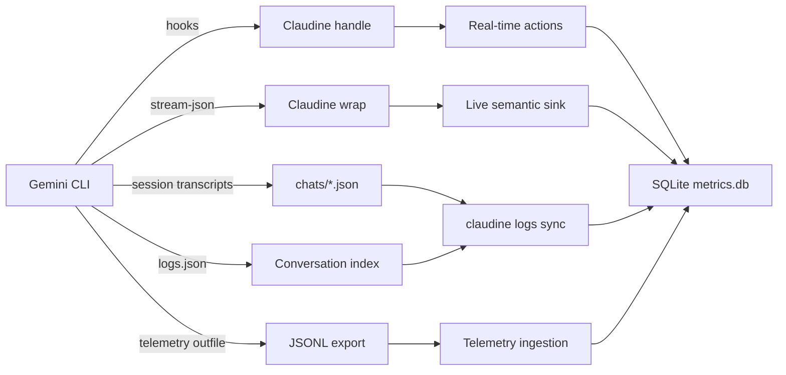

# Gemini CLI Logging

## Introduction to Gemini CLI Logging

Gemini CLI (Google's open-source agentic CLI) stores its data exclusively as **flat files** — no SQLite or embedded database is used. The logging surface is split across several file types, each serving a distinct purpose: conversation recall, session persistence, streaming output, and OpenTelemetry-based telemetry.

### Log Locations

All Gemini CLI data is rooted under `~/.gemini/` (or the directory pointed to by `$GEMINI_CLI_HOME`). The `Storage` class in `packages/core/src/config/storage.ts` resolves all paths.

| Path | Contents | Format |
|------|----------|--------|
| `~/.gemini/projects.json` | Project registry — maps absolute project paths to short slug identifiers | JSON |
| `~/.gemini/settings.json` | User-scoped settings (model, telemetry, hooks, security) | JSON |
| `~/.gemini/tmp/<project-id>/logs.json` | Conversation log — user messages across sessions within a project | JSON array |
| `~/.gemini/tmp/<project-id>/chats/session-<date>-<id>.json` | Full session transcripts including tool calls, thoughts, and model responses | JSON |
| `~/.gemini/tmp/<project-id>/checkpoint-<tag>.json` | Conversation checkpoints for session rewind | JSON |
| `~/.gemini/tmp/<project-id>/shell_history` | Shell command history within sessions | Plain text |
| `~/.gemini/history/<project-slug>/.project_root` | Pointer to the original project directory (migration-era) | Plain text |
| `~/.gemini/installation_id` | Anonymous installation UUID | Plain text |
| `~/.gemini/oauth_creds.json` | OAuth credentials (Gemini/Vertex AI) | JSON |
| `$GEMINI_DEBUG_LOG_FILE` | Optional debug log (env var-gated) | Plain text with timestamps |

The `<project-id>` in `tmp/` directories is either a SHA-256 hash of the project path (legacy) or a human-readable slug managed by the `ProjectRegistry` in `projects.json`. A migration (`Storage.performMigration()`) moves old hash-based directories to slug-based ones.

### Log Organization, Splitting, and Archival

**Session-based splitting.** Each session gets its own transcript file: `session-<ISO-date>-<short-id>.json`. Sessions are never merged or split after creation.

**Retention policy.** Controlled by `general.sessionRetention` in `settings.json`:

| Setting | Type | Default | Description |
|---------|------|---------|-------------|
| `enabled` | `boolean` | `true` | Whether automatic cleanup runs |
| `maxAge` | `string` | `"30d"` | Delete chat files older than this duration |
| `maxCount` | `number` | — | Keep only the N most recent sessions per project |
| `minRetention` | `string` | `"1d"` | Safety floor — never delete sessions newer than this |

**Corrupted file handling.** If `logs.json` cannot be parsed, the `Logger` class renames it to `<file>.<reason>.<timestamp>.bak` and starts fresh. This ensures data loss is limited to a single file rather than cascading failures.

**No rotation.** There is no size-based log rotation. Session files grow to their natural size and are eventually cleaned by the retention policy.

### Format of the Log Files

#### `logs.json` — Conversation Log

Pretty-printed JSON array of `LogEntry` objects:

```json
[
  {
    "sessionId": "f98abb80-2d16-4732-8cd8-2e6e6521a385",
    "messageId": 0,
    "timestamp": "2025-12-01T02:15:49.538Z",
    "type": "user",
    "message": "Help me fix this bug"
  }
]
```

Only user messages are recorded. Assistant responses, tool calls, and thinking are **not** persisted here.

#### Session Transcript — `session-<date>-<id>.json`

Full JSON object containing the complete conversation:

```json
{
  "sessionId": "f98abb80-2d16-4732-8cd8-2e6e6521a385",
  "projectHash": "06f3579466e1272df4aedb17fc184b1b2404f2dee2b169ceee079e20bccffffa",
  "startTime": "2025-12-01T02:15:49.588Z",
  "lastUpdated": "2025-12-01T02:19:36.090Z",
  "messages": [
    {
      "id": "7be76790-dca1-4376-8cdb-e346d055133e",
      "timestamp": "2025-12-01T02:15:49.588Z",
      "type": "user",
      "content": "..."
    },
    {
      "id": "a74c64a9-1a3e-4297-a266-2043c21d3fb0",
      "timestamp": "2025-12-01T02:15:58.065Z",
      "type": "gemini",
      "content": "",
      "toolCalls": [ /* tool call objects */ ],
      "thoughts": [ /* thinking objects */ ],
      "model": "gemini-3-pro-preview",
      "tokens": {
        "input": 17847,
        "output": 44,
        "cached": 8158,
        "thoughts": 608,
        "tool": 0,
        "total": 18499
      }
    }
  ]
}
```

This is the richest data source — it includes full tool call arguments and results, thinking/chain-of-thought traces, token usage, and model identification.

#### Streaming JSON (`--output-format stream-json`)

Newline-delimited JSON (JSONL) emitted to stdout during non-interactive execution. Each line is a typed event:

```jsonl
{"type":"init","timestamp":"...","session_id":"...","model":"gemini-2.5-pro"}
{"type":"message","timestamp":"...","role":"assistant","content":"Hello","delta":true}
{"type":"tool_use","timestamp":"...","tool_name":"read_file","tool_id":"...","parameters":{...}}
{"type":"tool_result","timestamp":"...","tool_id":"...","status":"success","output":"..."}
{"type":"error","timestamp":"...","severity":"error","message":"..."}
{"type":"result","timestamp":"...","status":"success","stats":{...}}
```

#### Debug Log File

Plain text, gated behind `GEMINI_DEBUG_LOG_FILE` environment variable:

```
[2025-01-15T10:30:00.000Z] [DEBUG] Starting session...
[2025-01-15T10:30:01.234Z] [INFO] Model loaded: gemini-2.5-pro
```

### Database Usage

Gemini CLI does **not** use SQLite or any embedded database. All persistence is file-based: JSON for structured data, plain text for shell history, and JSONL for streaming output and telemetry export. The `ProjectRegistry` (`projects.json`) acts as a lightweight index mapping project paths to identifiers.

### Major Log Message Types

Gemini CLI distinguishes log messages across three distinct surfaces:

#### 1. Conversation Logger (`LogEntry`)

| Field | Values |
|-------|--------|
| `type` | `"user"` (currently the only recorded sender type) |

Only user messages are persisted to `logs.json`. The `MessageSenderType` enum exists but only has a `USER` variant.

#### 2. Agentic Loop Events (`GeminiEventType`)

The `Turn` class in `packages/core/src/core/turn.ts` emits typed events during the agentic loop:

| Event | Description |
|-------|-------------|
| `Content` | Model-generated text content |
| `ToolCallRequest` | Model requests a tool execution |
| `ToolCallResponse` | Tool execution result returned |
| `ToolCallConfirmation` | User confirmation required before tool execution |
| `UserCancelled` | User cancelled the operation |
| `Error` | Error during processing |
| `ChatCompressed` | Conversation history compressed to fit context window |
| `Thought` | Model chain-of-thought reasoning |
| `MaxSessionTurns` | Session turn limit reached |
| `Finished` | Turn completed normally |
| `LoopDetected` | Repetitive behavior detected |
| `Citation` | Source citation returned |
| `Retry` | Retrying a failed operation |
| `ContextWindowWillOverflow` | Context window approaching limit |
| `InvalidStream` | Malformed streaming response |
| `ModelInfo` | Model metadata |
| `AgentExecutionStopped` | Agent paused |
| `AgentExecutionBlocked` | Agent blocked by policy |

#### 3. Telemetry Events (30+ event classes)

Defined in `packages/core/src/telemetry/types.ts`, emitted through an OpenTelemetry-compatible pipeline:

| Event Name | Class | Category |
|------------|-------|----------|
| `gemini_cli.config` | `StartSessionEvent` | Session |
| `end_session` | `EndSessionEvent` | Session |
| `gemini_cli.user_prompt` | `UserPromptEvent` | Prompt |
| `gemini_cli.tool_call` | `ToolCallEvent` | Tool |
| `gemini_cli.api_request` | `ApiRequestEvent` | API |
| `gemini_cli.api_response` | `ApiResponseEvent` | API |
| `gemini_cli.api_error` | `ApiErrorEvent` | API |
| `gemini_cli.flash_fallback` | `FlashFallbackEvent` | Fallback |
| `gemini_cli.loop_detected` | `LoopDetectedEvent` | Loop Detection |
| `gemini_cli.rewind` | `RewindEvent` | Session |
| `gemini_cli.slash_command` | `SlashCommandEvent` | UI |
| `gemini_cli.chat_compression` | `ChatCompressionEvent` | Context |
| `gemini_cli.conversation_finished` | `ConversationFinishedEvent` | Session |
| `gemini_cli.file_operation` | `FileOperationEvent` | File |
| `gemini_cli.model_routing` | `ModelRoutingEvent` | Routing |
| `gemini_cli.tool_output_truncated` | `ToolOutputTruncatedEvent` | Tool |
| `gemini_cli.tool_output_masking` | `ToolOutputMaskingEvent` | Tool |
| `gemini_cli.ide_connection` | `IdeConnectionEvent` | IDE |
| `gemini_cli.malformed_json_response` | `MalformedJsonResponseEvent` | API |
| `gemini_cli.chat.invalid_chunk` | `InvalidChunkEvent` | Stream |
| `gemini_cli.chat.content_retry` | `ContentRetryEvent` | Retry |
| `gemini_cli.chat.content_retry_failure` | `ContentRetryFailureEvent` | Retry |
| `gemini_cli.network_retry_attempt` | `NetworkRetryAttemptEvent` | Retry |
| `gemini_cli.ripgrep_fallback` | `RipgrepFallbackEvent` | Fallback |
| `gemini_cli.extension_install` | `ExtensionInstallEvent` | Extension |
| `gemini_cli.conseca.policy_generation` | `ConsecaPolicyGenerationEvent` | Policy |
| `gemini_cli.conseca.verdict` | `ConsecaVerdictEvent` | Policy |
| `gemini_cli.hook_call` | `HookCallEvent` | Hooks |

#### 4. Stream Output Events (`JsonStreamEventType`)

Emitted via `--output-format stream-json`:

| Event | Description |
|-------|-------------|
| `init` | Session initialization (model, session ID) |
| `message` | User or assistant message content |
| `tool_use` | Tool invocation with parameters |
| `tool_result` | Tool execution outcome |
| `error` | Warning or error |
| `result` | Final session result with stats |

---

## Logging Schema

### Official Schema Status

Gemini CLI does **not** publish a standalone, versioned schema for its log output. The schema is implicit in the TypeScript interfaces scattered across several source files. There is no JSON Schema, Protocol Buffers, or OpenAPI definition for log structures.

The closest thing to an official schema is the **settings schema** at [`schemas/settings.schema.json`](https://github.com/google-gemini/gemini-cli/blob/main/schemas/settings.schema.json) (JSON Schema draft 2020-12), but this governs configuration — not log output.

### Representative Rust Schema

The following Rust types model the three primary log surfaces, derived from the TypeScript source and verified against actual log files on the host system.

#### Conversation Log Entry (`logs.json`)

```rust
use chrono::{DateTime, Utc};
use serde::Deserialize;

#[derive(Debug, Deserialize)]
#[serde(rename_all = "camelCase")]
pub struct GeminiLogEntry {
    pub session_id: String,
    pub message_id: u32,
    pub timestamp: DateTime<Utc>,
    #[serde(rename = "type")]
    pub sender_type: GeminiSenderType,
    pub message: String,
}

#[derive(Debug, Deserialize)]
pub enum GeminiSenderType {
    user,
}
```

#### Session Transcript

```rust
#[derive(Debug, Deserialize)]
#[serde(rename_all = "camelCase")]
pub struct GeminiSession {
    pub session_id: String,
    pub project_hash: String,
    pub start_time: DateTime<Utc>,
    pub last_updated: DateTime<Utc>,
    pub messages: Vec<GeminiMessage>,
}

#[derive(Debug, Deserialize)]
#[serde(rename_all = "camelCase")]
pub struct GeminiMessage {
    pub id: String,
    pub timestamp: DateTime<Utc>,
    #[serde(rename = "type")]
    pub message_type: GeminiMessageType,
    pub content: String,
    #[serde(default)]
    pub tool_calls: Vec<GeminiToolCall>,
    #[serde(default)]
    pub thoughts: Vec<GeminiThought>,
    #[serde(default)]
    pub model: Option<String>,
    #[serde(default)]
    pub tokens: Option<GeminiTokenUsage>,
}

#[derive(Debug, Deserialize)]
#[serde(rename_all = "lowercase")]
pub enum GeminiMessageType {
    user,
    gemini,
}

#[derive(Debug, Deserialize)]
#[serde(rename_all = "camelCase")]
pub struct GeminiToolCall {
    pub id: String,
    pub name: String,
    pub args: serde_json::Value,
    pub result: Vec<serde_json::Value>,
    pub status: String,
    pub timestamp: DateTime<Utc>,
    #[serde(default)]
    pub result_display: Option<String>,
    #[serde(default)]
    pub display_name: Option<String>,
    #[serde(default)]
    pub description: Option<String>,
    #[serde(default)]
    pub render_output_as_markdown: Option<bool>,
}

#[derive(Debug, Deserialize)]
#[serde(rename_all = "camelCase")]
pub struct GeminiThought {
    pub subject: String,
    pub description: String,
    pub timestamp: DateTime<Utc>,
}

#[derive(Debug, Deserialize)]
#[serde(rename_all = "camelCase")]
pub struct GeminiTokenUsage {
    pub input: u64,
    pub output: u64,
    #[serde(default)]
    pub cached: u64,
    #[serde(default)]
    pub thoughts: u64,
    #[serde(default)]
    pub tool: u64,
    #[serde(default)]
    pub total: u64,
}
```

#### Stream JSON Events (`--output-format stream-json`)

```rust
#[derive(Debug, Deserialize)]
#[serde(tag = "type")]
pub enum GeminiStreamEvent {
    #[serde(rename = "init")]
    Init {
        timestamp: String,
        session_id: String,
        model: String,
    },
    #[serde(rename = "message")]
    Message {
        timestamp: String,
        role: GeminiMessageRole,
        content: String,
        #[serde(default)]
        delta: Option<bool>,
    },
    #[serde(rename = "tool_use")]
    ToolUse {
        timestamp: String,
        tool_name: String,
        tool_id: String,
        parameters: serde_json::Value,
    },
    #[serde(rename = "tool_result")]
    ToolResult {
        timestamp: String,
        tool_id: String,
        status: GeminiToolResultStatus,
        #[serde(default)]
        output: Option<String>,
        #[serde(default)]
        error: Option<GeminiStreamError>,
    },
    #[serde(rename = "error")]
    Error {
        timestamp: String,
        severity: GeminiErrorSeverity,
        message: String,
    },
    #[serde(rename = "result")]
    Result {
        timestamp: String,
        status: GeminiToolResultStatus,
        #[serde(default)]
        error: Option<GeminiStreamError>,
        #[serde(default)]
        stats: Option<GeminiStreamStats>,
    },
}

#[derive(Debug, Deserialize)]
#[serde(rename_all = "lowercase")]
pub enum GeminiMessageRole {
    user,
    assistant,
}

#[derive(Debug, Deserialize)]
#[serde(rename_all = "lowercase")]
pub enum GeminiToolResultStatus {
    success,
    error,
}

#[derive(Debug, Deserialize)]
#[serde(rename_all = "lowercase")]
pub enum GeminiErrorSeverity {
    warning,
    error,
}

#[derive(Debug, Deserialize)]
pub struct GeminiStreamError {
    #[serde(rename = "type")]
    pub error_type: String,
    pub message: String,
}

#[derive(Debug, Deserialize)]
#[serde(rename_all = "snake_case")]
pub struct GeminiStreamStats {
    pub total_tokens: u64,
    pub input_tokens: u64,
    pub output_tokens: u64,
    pub cached: u64,
    pub input: u64,
    pub duration_ms: u64,
    pub tool_calls: u64,
    #[serde(default)]
    pub models: std::collections::HashMap<String, GeminiModelStreamStats>,
}

#[derive(Debug, Deserialize)]
#[serde(rename_all = "snake_case")]
pub struct GeminiModelStreamStats {
    pub total_tokens: u64,
    pub input_tokens: u64,
    pub output_tokens: u64,
    pub cached: u64,
    pub input: u64,
}
```

#### Agentic Loop Events (internal, from `GeminiEventType`)

```rust
#[derive(Debug, Deserialize)]
#[serde(rename_all = "snake_case")]
pub enum GeminiEventType {
    Content,
    ToolCallRequest,
    ToolCallResponse,
    ToolCallConfirmation,
    UserCancelled,
    Error,
    ChatCompressed,
    Thought,
    MaxSessionTurns,
    Finished,
    LoopDetected,
    Citation,
    Retry,
    ContextWindowWillOverflow,
    InvalidStream,
    ModelInfo,
    AgentExecutionStopped,
    AgentExecutionBlocked,
}
```

---

## Informational Content versus Hook Events

Claudine's current architecture captures agentic activity through **hook events** — the 11 lifecycle hooks that Gemini CLI exposes (`BeforeToolCall`, `AfterToolCall`, `SessionStart`, `SessionEnd`, etc.). This section evaluates when file-system logs are a better source, when hooks are superior, and what other sources can enrich the data.

### When Log Files Are the Better Source

| Scenario | Why Session Transcripts Win |
|----------|----------------------------|
| **Token and cost analysis** | Session files include per-message `tokens` with `input`, `output`, `cached`, `thoughts`, `tool`, and `total` counts. Hooks carry no token data. |
| **Model identification** | Each `gemini`-type message in the transcript records the `model` field (e.g., `gemini-3-pro-preview`). Hooks only receive the session ID and CWD. |
| **Thinking/reasoning traces** | Transcripts include `thoughts[]` with subject, description, and timestamp. These are invisible to hooks. |
| **Full tool call arguments and results** | Session files capture complete `toolCalls[]` with `args`, `result`, `status`, and `displayName`. Hook payloads are more limited. |
| **Post-hoc session replay** | Transcripts contain the full chronological message sequence with all interleaved tool calls, enabling complete reconstruction. Hooks only fire at lifecycle points. |
| **Historical analysis** | Session files persist under `~/.gemini/tmp/` until the retention policy cleans them. Hooks only fire if Claudine is installed and configured at session time. |
| **Duration and timing** | Each message has a precise ISO 8601 `timestamp`. Hooks provide a single timestamp per invocation. |
| **Multi-session queries** | The `logs.json` index and `chats/` directory enable cross-session analysis. Hooks provide no aggregated view. |

### When Hook Events Are the Better Source

| Scenario | Why Hooks Win |
|----------|---------------|
| **Real-time interception** | `BeforeToolCall` hooks can block or modify a tool invocation before it executes. Log files are read-only. |
| **Permission decisions** | Hooks can return `decision: "deny"` to prevent tool execution with a `reason`. No log-based mechanism can prevent actions. |
| **Environment metadata** | Every hook receives `session_id`, `transcript_path`, and `cwd` in a consistent envelope. Extracting this from transcripts requires parsing multiple files. |
| **Guaranteed delivery** | Hooks are pushed to Claudine by Gemini CLI. Reading transcripts requires polling the filesystem and detecting new files. |
| **Session lifecycle control** | `SessionEnd` and `PreCompress` hooks fire at deterministic points. There is no transcript-level equivalent for "session about to compress". |
| **Matcher-based filtering** | Tool hooks support regex matchers so only relevant tools trigger the handler. Log-based analysis requires post-hoc filtering. |

### Other Sources for Data Enrichment

| Source | What It Provides | Integration Strategy |
|--------|-----------------|----------------------|
| **`--output-format stream-json`** | Real-time JSONL stream of 6 event types in non-interactive mode | Wrap `gemini` invocation and parse stdout; this is how Claudine's wrapper already operates |
| **Telemetry file export** (`telemetry.outfile`) | JSONL OpenTelemetry events with 30+ event types including API timing, token usage, and error classification | Configure `telemetry.target: "local"` and `telemetry.outfile` in settings, then ingest the JSONL file |
| **`~/.gemini/projects.json`** | Maps project paths to identifiers — essential for resolving which `tmp/<id>/` directory corresponds to which project | Read at startup to build a project index |
| **`~/.gemini/settings.json`** | Current configuration including model, auth type, telemetry settings, and hook definitions | Parse for environment context in reports |
| **Debug log file** (`$GEMINI_DEBUG_LOG_FILE`) | Verbose internal diagnostics when enabled | Opt-in; useful for debugging but not for production observability |

### Recommended Hybrid Strategy

For comprehensive observability, Claudine should use **hooks for real-time action and policy enforcement** while also **ingesting session transcripts for historical analysis, cost tracking, and session replay**. The wrapper's `stream-json` parser already captures the richest real-time signal; augmenting it with periodic transcript ingestion and telemetry file export would close the gap on:

- Token and cost aggregation across sessions
- Model routing trend analysis
- Tool usage patterns and error rates
- Multi-session historical queries



---

## Sources

- [Gemini CLI Repository](https://github.com/google-gemini/gemini-cli)
- [Gemini CLI Documentation](https://geminicli.com/docs/)
- [Gemini CLI Hooks Documentation](https://geminicli.com/docs/hooks/)
- [Output Types Source](https://github.com/google-gemini/gemini-cli/blob/main/packages/core/src/output/types.ts)
- [Telemetry Types Source](https://github.com/google-gemini/gemini-cli/blob/main/packages/core/src/telemetry/types.ts)
- [Logger Source](https://github.com/google-gemini/gemini-cli/blob/main/packages/core/src/core/logger.ts)
- [Storage / Path Resolution Source](https://github.com/google-gemini/gemini-cli/blob/main/packages/core/src/config/storage.ts)
- [Turn / GeminiEventType Source](https://github.com/google-gemini/gemini-cli/blob/main/packages/core/src/core/turn.ts)
- [Agent Chat History Source](https://github.com/google-gemini/gemini-cli/blob/main/packages/core/src/core/agentChatHistory.ts)
- [Debug Logger Source](https://github.com/google-gemini/gemini-cli/blob/main/packages/core/src/utils/debugLogger.ts)
- [File Telemetry Exporters](https://github.com/google-gemini/gemini-cli/blob/main/packages/core/src/telemetry/file-exporters.ts)
- [Settings JSON Schema](https://github.com/google-gemini/gemini-cli/blob/main/schemas/settings.schema.json)
- [Non-Interactive CLI Source](https://github.com/google-gemini/gemini-cli/blob/main/packages/cli/src/nonInteractiveCli.ts)
