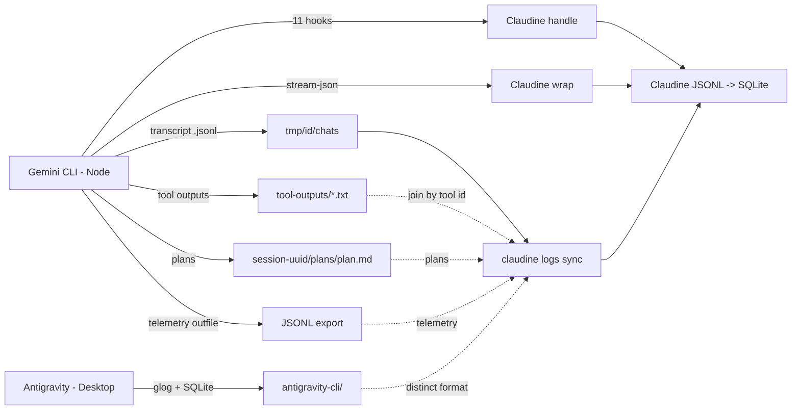

# Gemini CLI Logging

## Introduction to Gemini CLI Logging

Gemini CLI (Google's open-source agentic CLI, [repo](https://github.com/google-gemini/gemini-cli)) stores all of its CLI data as **flat files** — JSON and JSONL for structured data, plain text for tool output, plans, and shell snapshots. **No SQLite or embedded database is used by the CLI itself.** The logging surface is split across several file types, each serving a distinct purpose: conversation recall, session transcripts, captured tool output, agent plans, streaming output, and OpenTelemetry-based telemetry.

> **Product transition (announced).** Google has announced that for unpaid-tier and Google One users the Node-based **Gemini CLI will be replaced by Antigravity CLI** (the Go-based language server that powers the Antigravity desktop IDE). Both already coexist under `~/.gemini/` on this host: the CLI writes to `tmp/` (flat files) while Antigravity writes to `antigravity/` and `antigravity-cli/` (SQLite + protobuf + Go glog). See [Desktop counterpart (Antigravity)](#desktop-counterpart-antigravity) below. The research below treats the current **Node Gemini CLI** as the primary subject and documents Antigravity as the desktop surface.

### Log Locations (CLI)

All Gemini CLI data is rooted under `~/.gemini/` (or `$GEMINI_CLI_HOME`). The `Storage` class in `packages/core/src/config/storage.ts` resolves all paths; `ProjectRegistry` (`projects.json`) maps absolute project paths to the short slug identifiers that name `tmp/` subdirectories.

| Path | Contents | Format |
|------|----------|--------|
| `~/.gemini/projects.json` | Project registry — maps absolute project paths to short slug identifiers | JSON |
| `~/.gemini/settings.json` | User-scoped settings (model, telemetry, hooks, security, `sessionRetention`) | JSON |
| `~/.gemini/tmp/{project-id}/chats/session-<date>-<id>.jsonl` | **Append-only session transcript** (current format) — full messages, tool calls, thoughts, tokens | JSONL |
| `~/.gemini/tmp/{project-id}/chats/session-<date>-<id>.json` | **Legacy single-object transcript** (pre-migration only) — same fields, `messages[]` inline | JSON |
| `~/.gemini/tmp/{project-id}/logs.json` | Per-project conversation log — user messages across sessions within a project | JSON array |
| `~/.gemini/tmp/{project-id}/tool-outputs/session-<sid>/{tool}_{callid}.txt` | Captured plain-text output of individual tool calls (shell, grep, glob) | Plain text |
| `~/.gemini/tmp/{project-id}/{session-uuid}/plans/plan.md` | Agent-generated execution plans (GFM todo markdown) | Markdown |
| `~/.gemini/tmp/{project-id}/logs/` | Empty mode-0700 directory (debug/telemetry target; purpose unconfirmed) | dir |
| `~/.gemini/tmp/{project-id}/.project_root` | Pointer back to the original project directory (migration-era) | Plain text |
| `~/.gemini/history/{slug}/.project_root` | Mirror of the above under a parallel `history/` tree | Plain text |
| `~/.gemini/tmp/bin/rg` | Bundled ripgrep binary (used by the built-in `grep_search`/glob tools) | binary |
| `~/.gemini/installation_id` | Anonymous installation UUID | Plain text |
| `~/.gemini/oauth_creds.json` | OAuth credentials (Gemini/Vertex AI), mode 0600 | JSON |
| `~/.gemini/mcp-oauth-tokens-v2.json` | MCP server OAuth tokens, mode 0600 | JSON |
| `~/.gemini/trustedFolders.json` | `TRUST_PARENT`/`TRUST_FOLDER` map for project trust | JSON |
| `~/.gemini/google_accounts.json` | Active/old Google account emails | JSON |
| `$GEMINI_DEBUG_LOG_FILE` | Optional debug log (env-var gated) | Plain text with timestamps |

The `{project-id}` in `tmp/` is either a human-readable **slug** (current; managed by `ProjectRegistry`) or a legacy **SHA-256 hash** of the project path. `Storage.performMigration()` moves old hash-based directories to slug-based ones; both coexist on this host (~103 slug `.jsonl` transcripts plus a handful of legacy hash `.json` transcripts).

### Log Organization, Splitting, and Archival

**Session-based splitting.** Each session gets its own transcript file: `session-<ISO-date>-<short-id>.jsonl`. The filename timestamp is **UTC** (it matches the header `startTime`, e.g. `session-2026-05-25T18-07-f7729e09.jsonl` ↔ `startTime: 2026-05-25T18:07:01.558Z`) with colons replaced by dashes. Sessions are never merged or split after creation.

**Append-only writes (current format).** The `.jsonl` transcript is written incrementally: a header line on creation, then one line per appended message, interleaved with `{"$set":{"lastUpdated":"..."}}` patches that bump the session mtime. This is a deliberate move away from the legacy single-object `.json` file, which had to be rewritten in full on every change.

**Retention policy.** Controlled by `general.sessionRetention` in `settings.json`:

| Setting | Type | Default | Description |
|---------|------|---------|-------------|
| `enabled` | `boolean` | `true` | Whether automatic cleanup runs |
| `maxAge` | `string` | `"30d"` | Delete chat files older than this duration |
| `maxCount` | `number` | — | Keep only the N most recent sessions per project |
| `minRetention` | `string` | `"1d"` | Safety floor — never delete sessions newer than this |

**Corrupted file handling.** If `logs.json` cannot be parsed, the `Logger` class renames it to `<file>.<reason>.<timestamp>.bak` and starts fresh. No `.bak` files were observed on this host.

**No rotation.** There is no size-based log rotation. Session files grow to their natural size and are eventually cleaned by the retention policy.

### Format of the Log Files (CLI)

#### `logs.json` — Per-project Conversation Log

Pretty-printed JSON array of user messages only (unchanged from before):

```json
[
  {
    "sessionId": "e2957e2d-b09d-4b26-bfdf-937f03672beb",
    "messageId": 0,
    "type": "user",
    "message": "Help me fix this bug",
    "timestamp": "2026-04-17T22:30:59.112Z"
  }
]
```

Assistant responses, tool calls, and thinking are **not** persisted here — only user turns, keyed by `sessionId`.

#### Session Transcript — `session-<date>-<id>.jsonl` (current)

An append-only JSONL file. The **first line is a header**; subsequent lines are either standalone messages or `$set` patches:

```jsonl
{"sessionId":"99967bca-0948-4adf-b8db-da605e09b133","projectHash":"d85ea11f…","startTime":"2026-06-10T16:20:50.938Z","lastUpdated":"2026-06-10T16:20:50.938Z","kind":"main"}
{"$set":{"messages":[{"id":"d04923d3…","timestamp":"2026-06-10T16:20:50.939Z","type":"user","content":[{"text":"<session_context>…"}]}],"lastUpdated":"2026-06-10T16:20:50.939Z"}}
{"id":"57bae31d-…","timestamp":"2026-06-10T16:21:06.769Z","type":"user","content":[{"text":"You are a planning agent. …"}]}
{"$set":{"lastUpdated":"2026-06-10T16:21:06.769Z"}}
{"id":"d56580a8-…","timestamp":"2026-06-10T16:21:10.324Z","type":"gemini","content":"","thoughts":[{"subject":"Initiating Response Planning","description":"…","timestamp":"2026-06-10T16:21:08.734Z"}],"tokens":{"input":10074,"output":18,"cached":0,"thoughts":498,"tool":0,"total":10590},"model":"gemini-3.5-flash","toolCalls":[{"id":"activate_skill__l0eskflk","name":"activate_skill","args":{…},"result":[…],"status":"success","timestamp":"2026-06-10T16:21:10.329Z","resultDisplay":"…","description":"…","displayName":"Activate Skill","renderOutputAsMarkdown":true}]}
{"$set":{"lastUpdated":"2026-06-10T16:21:10.329Z"}}
```

Key shape rules observed across every sampled file:

| Field | User message | Gemini message |
|-------|--------------|----------------|
| `content` | **Array** of parts, e.g. `[{"text":"…"}]` | **String** (frequently empty `""`) |
| `thoughts` | absent | array of `{subject, description, timestamp}` |
| `tokens` | absent | `{input, output, cached, thoughts, tool, total}` |
| `model` | absent | e.g. `gemini-3.5-flash` |
| `toolCalls` | absent | array (camelCase fields: `resultDisplay`, `displayName`, `renderOutputAsMarkdown`) |

The `$set` patches observed only ever update `lastUpdated` (and, once, bootstrap the initial `messages` array). Real turns are appended as standalone message lines. A naive line-by-line parser must therefore skip the header line and ignore `$set` lines, not treat every line as a message.

#### Tool Output — `tool-outputs/session-<sid>/{tool}_{call_id}.txt`

Plain-text capture of a single tool call's stdout, spilled when the inline result would be large (e.g. a multi-thousand-line `cargo test` run). Naming: `{tool_name}__{call_id}.txt` for `run_shell_command` (double underscore) and `{tool_name}_{call_id}.txt` otherwise. 584 such files observed. These are the backing store referenced by transcript `toolCalls[].result`.

#### Streaming JSON (`--output-format stream-json`)

Newline-delimited JSON emitted to stdout during non-interactive execution. Each line is one of six typed events (`JsonStreamEventType`):

```jsonl
{"type":"init","timestamp":"…","session_id":"…","model":"gemini-2.5-pro"}
{"type":"message","timestamp":"…","role":"assistant","content":"Hello","delta":true}
{"type":"tool_use","timestamp":"…","tool_name":"read_file","tool_id":"…","parameters":{…}}
{"type":"tool_result","timestamp":"…","tool_id":"…","status":"success","output":"…"}
{"type":"error","timestamp":"…","severity":"error","message":"…"}
{"type":"result","timestamp":"…","status":"success","stats":{…}}
```

#### Debug Log File

Plain text, gated behind `GEMINI_DEBUG_LOG_FILE`:

```
[2026-01-15T10:30:00.000Z] [DEBUG] Starting session...
[2026-01-15T10:30:01.234Z] [INFO] Model loaded: gemini-2.5-pro
```

### Database Usage

**The Node Gemini CLI does not use SQLite or any embedded database.** All CLI persistence is file-based: JSONL/JSON for structured data, plain text for tool output and plans. The `ProjectRegistry` (`projects.json`) acts as a lightweight index mapping project paths to identifiers.

**The Antigravity desktop product is different** — see [Desktop counterpart (Antigravity)](#desktop-counterpart-antigravity): it uses a SQLite trajectory store plus protobuf state. Claudine must not look for a native SQLite log under the CLI's `tmp/` tree; the only SQLite under `~/.gemini/` belongs to Antigravity.

### Desktop counterpart (Antigravity)

Google's desktop IDE **Antigravity** (and its incoming CLI successor, **Antigravity CLI**) coexists with the Node Gemini CLI under `~/.gemini/`. It is a Go-based language server with a **completely different storage model**:

| Path | Contents | Format |
|------|----------|--------|
| `~/.gemini/antigravity-cli/log/cli-{YYYYMMDD}_{HHMMSS}.log` | Language-server log (symlinked from `cli.log`) | Go glog text (`I/W/E` severity, **local** time) |
| `~/.gemini/antigravity-cli/conversations/{uuid}.db` | Conversation trajectory store (one SQLite DB per conversation) | SQLite (magic `SQLite format 3`) |
| `~/.gemini/antigravity/agyhub_summaries_proto.pb` | Hub summaries | Protobuf binary |
| `~/.gemini/antigravity/antigravity_state.pbtxt` | IDE state | Protobuf text |
| `~/.gemini/antigravity/user_settings.pb` | User settings | Protobuf (binary) |
| `~/.gemini/antigravity/{annotations,brain,code_tracker,context_state,conversations,implicit,knowledge}/` | Per-feature state dirs | mixed |
| `~/.gemini/antigravity/mcp_config.json` | MCP catalog (symlink → `~/.gemini/config/mcp_config.json`) | JSON (shared with CLI) |

The `cli.log` confirms the architecture directly: *"Creating trajectory store manager with proto store and SQLite store"*. So the desktop writes **SQLite + protobuf + glog text**, whereas the CLI writes **JSON/JSONL flat files** — different formats, but both rooted at `~/.gemini/`.

### Major Log Message Types

Gemini CLI distinguishes log messages across four surfaces:

#### 1. Conversation Logger (`logs.json`)

| Field | Values |
|-------|--------|
| `type` | `"user"` (the only recorded sender type) |

Only user messages are persisted to `logs.json`.

#### 2. Agentic Loop Events (`GeminiEventType`)

Emitted by the `Turn` class during the interactive agentic loop (defined outside `output/types.ts`):

| Event | Description |
|-------|-------------|
| `Content` | Model-generated text content |
| `ToolCallRequest` | Model requests a tool execution |
| `ToolCallResponse` | Tool execution result returned |
| `ToolCallConfirmation` | User confirmation required before tool execution |
| `UserCancelled` | User cancelled the operation |
| `Error` | Error during processing |
| `ChatCompressed` | Conversation history compressed to fit context window |
| `Thought` | Model chain-of-thought reasoning |
| `MaxSessionTurns` | Session turn limit reached |
| `Finished` | Turn completed normally |
| `LoopDetected` | Repetitive behavior detected |
| `Citation` | Source citation returned |
| `Retry` | Retrying a failed operation |
| `ContextWindowWillOverflow` | Context window approaching limit |
| `InvalidStream` | Malformed streaming response |
| `ModelInfo` | Model metadata |
| `AgentExecutionStopped` | Agent paused |
| `AgentExecutionBlocked` | Agent blocked by policy |

#### 3. Stream Output Events (`JsonStreamEventType`)

Emitted via `--output-format stream-json` (`packages/core/src/output/types.ts`). Six members:

| Event | Description |
|-------|-------------|
| `init` | Session initialization (model, session ID) |
| `message` | User or assistant message content |
| `tool_use` | Tool invocation with parameters |
| `tool_result` | Tool execution outcome |
| `error` | Warning or error |
| `result` | Final session/turn result with stats |

#### 4. Telemetry Events (~50 classes)

Defined in `packages/core/src/telemetry/types.ts` (now ~2500 lines / 73 KB), emitted through an OpenTelemetry-compatible pipeline. The vocabulary has roughly **doubled** since the prior research. Each class maps to an `event.name` string (mostly `gemini_cli.*`, plus one `gen_ai.*` semantic convention):

| Event name | Class | Category |
|------------|-------|----------|
| `gemini_cli.config` | `StartSessionEvent` | Session |
| `end_session` | `EndSessionEvent` | Session |
| `gemini_cli.startup_stats` | `StartupStatsEvent` | Session |
| `gemini_cli.conversation_finished` | `ConversationFinishedEvent` | Session |
| `gemini_cli.user_prompt` | `UserPromptEvent` | Prompt |
| `gemini_cli.slash_command` | `SlashCommandEvent` | UI |
| `gemini_cli.slash_command.model` | `ModelSlashCommandEvent` | UI |
| `gemini_cli.rewind` | `RewindEvent` | Session |
| `gemini_cli.tool_call` | `ToolCallEvent` | Tool |
| `gemini_cli.file_operation` | `FileOperationEvent` | File |
| `gemini_cli.tool_output_truncated` | `ToolOutputTruncatedEvent` | Tool |
| `gemini_cli.tool_output_masking` | `ToolOutputMaskingEvent` | Tool |
| `gemini_cli.api_request` | `ApiRequestEvent` | API |
| `gemini_cli.api_response` | `ApiResponseEvent` | API |
| `gemini_cli.api_error` | `ApiErrorEvent` | API |
| `gemini_cli.malformed_json_response` | `MalformedJsonResponseEvent` | API |
| `gemini_cli.chat.invalid_chunk` | `InvalidChunkEvent` | Stream |
| `gemini_cli.chat.content_retry` | `ContentRetryEvent` | Retry |
| `gemini_cli.chat.content_retry_failure` | `ContentRetryFailureEvent` | Retry |
| `gemini_cli.network_retry_attempt` | `NetworkRetryAttemptEvent` | Retry |
| `gemini_cli.model_routing` | `ModelRoutingEvent` | Routing |
| `gemini_cli.flash_fallback` | `FlashFallbackEvent` | Fallback |
| `gemini_cli.ripgrep_fallback` | `RipgrepFallbackEvent` | Fallback |
| `gemini_cli.web_fetch_fallback_attempt` | `WebFetchFallbackAttemptEvent` | Fallback |
| `loop_detected` | `LoopDetectedEvent` | Loop Detection |
| `loop_detection_disabled` | `LoopDetectionDisabledEvent` | Loop Detection |
| `gemini_cli.llm_loop_check` | `LlmLoopCheckEvent` | Loop Detection |
| `gemini_cli.next_speaker_check` | `NextSpeakerCheckEvent` | Loop Detection |
| `gemini_cli.agent.start` | `AgentStartEvent` | Agent |
| `gemini_cli.agent.finish` | `AgentFinishEvent` | Agent |
| `gemini_cli.agent.recovery_attempt` | `RecoveryAttemptEvent` | Agent |
| `gemini_cli.plan.execution` | `PlanExecutionEvent` | Plan |
| `gemini_cli.plan.approval_mode_switch` | `ApprovalModeSwitchEvent` | Plan |
| `gemini_cli.plan.approval_mode_duration` | `ApprovalModeDurationEvent` | Plan |
| `gemini_cli.hook_call` | `HookCallEvent` | Hooks |
| `gemini_cli.extension_install` | `ExtensionInstallEvent` | Extension |
| `gemini_cli.extension_uninstall` | `ExtensionUninstallEvent` | Extension |
| `gemini_cli.extension_update` | `ExtensionUpdateEvent` | Extension |
| `gemini_cli.extension_enable` | `ExtensionEnableEvent` | Extension |
| `gemini_cli.extension_disable` | `ExtensionDisableEvent` | Extension |
| `gemini_cli.conseca.policy_generation` | `ConsecaPolicyGenerationEvent` | Policy |
| `gemini_cli.conseca.verdict` | `ConsecaVerdictEvent` | Policy |
| `gemini_cli.chat_compression` | `ChatCompressionEvent` | Context |
| `gemini_cli.edit_strategy` | `EditStrategyEvent` | Editing |
| `gemini_cli.edit_correction` | `EditCorrectionEvent` | Editing |
| `gemini_cli.ide_connection` | `IdeConnectionEvent` | IDE |
| `gemini_cli.keychain.availability` | `KeychainAvailabilityEvent` | Auth |
| `gemini_cli.token_storage.initialization` | `TokenStorageInitializationEvent` | Auth |
| `gemini_cli.onboarding.start` | `OnboardingStartEvent` | Onboarding |
| `gemini_cli.onboarding.success` | `OnboardingSuccessEvent` | Onboarding |
| `gen_ai.client.inference.operation.details` | (semantic convention) | API |

---

## Logging Schema

### No Formal Schema — Informal (TypeScript) Schema

Gemini CLI publishes **no standalone, versioned schema** for its log output — no JSON Schema, Protocol Buffers, or OpenAPI definition for transcript or `logs.json` structures. What exists is **informal**: TypeScript interfaces scattered across the source. Against this topic's `formal`/`informal`/`none` vocabulary, that is **informal**.

The closest machine-readable artifacts:

- **Stream-json contract** — [`packages/core/src/output/types.ts`](https://github.com/google-gemini/gemini-cli/blob/main/packages/core/src/output/types.ts) defines the `JsonStreamEventType` enum and the `InitEvent`/`MessageEvent`/`ToolUseEvent`/`ToolResultEvent`/`ErrorEvent`/`ResultEvent` interfaces plus `StreamStats`/`ModelStreamStats`.
- **Telemetry contract** — [`packages/core/src/telemetry/types.ts`](https://github.com/google-gemini/gemini-cli/blob/main/packages/core/src/telemetry/types.ts) (~50 event classes, `event.name` strings).
- **Settings schema** — [`schemas/settings.schema.json`](https://github.com/google-gemini/gemini-cli/blob/main/schemas/settings.schema.json) (JSON Schema draft 2020-12) — but this governs **configuration**, not log output.

The on-disk transcript schema (the `.jsonl` line shapes) is **undocumented**; the Rust types below are reverse-engineered from real files on this host.

### Representative Rust Schema (observed)

#### Session Transcript JSONL — line-level model

Each line of `session-<date>-<id>.jsonl` is one of three shapes: a header (line 1), a `$set` patch, or a standalone message. `#[serde(untagged)]` discriminates by the presence of `sessionId`, `$set`, or `type`.

```rust
use chrono::{DateTime, Utc};
use serde::Deserialize;
use serde_json::Value;

/// One line of `~/.gemini/tmp/{id}/chats/session-*.jsonl`.
#[derive(Debug, Deserialize)]
#[serde(untagged)]
pub enum GeminiTranscriptLine {
    /// Line 1 — session header.
    Header(GeminiSessionHeader),
    /// A `{"$set":{...}}` patch (observed: only `lastUpdated`, plus a
    /// one-time `messages` bootstrap on the first user turn).
    Patch {
        #[serde(rename = "$set")]
        set: GeminiPatch,
    },
    /// An appended user or gemini message.
    Message(GeminiMessage),
}

#[derive(Debug, Deserialize)]
#[serde(rename_all = "camelCase")]
pub struct GeminiSessionHeader {
    pub session_id: String,
    pub project_hash: String,
    pub start_time: DateTime<Utc>,
    pub last_updated: DateTime<Utc>,
    /// Observed: `"main"`. Discriminates session types (e.g. future subagent kinds).
    pub kind: String,
}

#[derive(Debug, Default, Deserialize)]
#[serde(rename_all = "camelCase")]
pub struct GeminiPatch {
    #[serde(default)]
    pub messages: Option<Vec<GeminiMessage>>,
    #[serde(default)]
    pub last_updated: Option<DateTime<Utc>>,
}

#[derive(Debug, Deserialize)]
#[serde(rename_all = "camelCase")]
pub struct GeminiMessage {
    pub id: String,
    pub timestamp: DateTime<Utc>,
    #[serde(rename = "type")]
    pub message_type: GeminiMessageType,
    /// User messages: array of parts. Gemini messages: a plain string (often "").
    #[serde(default)]
    pub content: GeminiContent,
    #[serde(default)]
    pub thoughts: Vec<GeminiThought>,
    #[serde(default)]
    pub tokens: Option<GeminiTokenUsage>,
    #[serde(default)]
    pub model: Option<String>,
    #[serde(default)]
    pub tool_calls: Vec<GeminiToolCall>,
}

#[derive(Debug, Deserialize)]
#[serde(rename_all = "lowercase")]
pub enum GeminiMessageType {
    user,
    gemini,
}

/// User content is `[{text}]`; gemini content is a bare string.
#[derive(Debug, Deserialize)]
#[serde(untagged)]
pub enum GeminiContent {
    Parts(Vec<GeminiContentPart>),
    Text(String),
}

#[derive(Debug, Deserialize)]
pub struct GeminiContentPart {
    #[serde(default)]
    pub text: String,
}

#[derive(Debug, Deserialize)]
#[serde(rename_all = "camelCase")]
pub struct GeminiThought {
    pub subject: String,
    pub description: String,
    pub timestamp: DateTime<Utc>,
}

#[derive(Debug, Default, Deserialize)]
#[serde(rename_all = "camelCase")]
pub struct GeminiTokenUsage {
    #[serde(default)]
    pub input: u64,
    #[serde(default)]
    pub output: u64,
    #[serde(default)]
    pub cached: u64,
    #[serde(default)]
    pub thoughts: u64,
    #[serde(default)]
    pub tool: u64,
    #[serde(default)]
    pub total: u64,
}

#[derive(Debug, Deserialize)]
#[serde(rename_all = "camelCase")]
pub struct GeminiToolCall {
    pub id: String,
    pub name: String,
    pub args: Value,
    pub result: Vec<Value>,
    pub status: String,
    pub timestamp: DateTime<Utc>,
    #[serde(default)]
    pub result_display: Option<String>,
    #[serde(default)]
    pub display_name: Option<String>,
    #[serde(default)]
    pub description: Option<String>,
    #[serde(default)]
    pub render_output_as_markdown: Option<bool>,
}
```

#### Conversation Log Entry (`logs.json`)

```rust
#[derive(Debug, Deserialize)]
#[serde(rename_all = "camelCase")]
pub struct GeminiLogEntry {
    pub session_id: String,
    pub message_id: u32,
    #[serde(rename = "type")]
    pub sender_type: GeminiSenderType,
    pub message: String,
    pub timestamp: DateTime<Utc>,
}

#[derive(Debug, Deserialize)]
pub enum GeminiSenderType {
    user,
}
```

#### Stream JSON Events (`--output-format stream-json`)

```rust
#[derive(Debug, Deserialize)]
#[serde(tag = "type")]
pub enum GeminiStreamEvent {
    #[serde(rename = "init")]
    Init {
        timestamp: String,
        session_id: String,
        model: String,
    },
    #[serde(rename = "message")]
    Message {
        timestamp: String,
        role: GeminiMessageRole,
        content: String,
        #[serde(default)]
        delta: Option<bool>,
    },
    #[serde(rename = "tool_use")]
    ToolUse {
        timestamp: String,
        tool_name: String,
        tool_id: String,
        parameters: serde_json::Value,
    },
    #[serde(rename = "tool_result")]
    ToolResult {
        timestamp: String,
        tool_id: String,
        status: GeminiToolResultStatus,
        #[serde(default)]
        output: Option<String>,
        #[serde(default)]
        error: Option<GeminiStreamError>,
    },
    #[serde(rename = "error")]
    Error {
        timestamp: String,
        severity: GeminiErrorSeverity,
        message: String,
    },
    #[serde(rename = "result")]
    Result {
        timestamp: String,
        status: GeminiToolResultStatus,
        #[serde(default)]
        error: Option<GeminiStreamError>,
        #[serde(default)]
        stats: Option<GeminiStreamStats>,
    },
}

#[derive(Debug, Deserialize)]
#[serde(rename_all = "lowercase")]
pub enum GeminiMessageRole {
    user,
    assistant,
}

#[derive(Debug, Deserialize)]
#[serde(rename_all = "lowercase")]
pub enum GeminiToolResultStatus {
    success,
    error,
}

#[derive(Debug, Deserialize)]
#[serde(rename_all = "lowercase")]
pub enum GeminiErrorSeverity {
    warning,
    error,
}

#[derive(Debug, Deserialize)]
pub struct GeminiStreamError {
    #[serde(rename = "type")]
    pub error_type: String,
    pub message: String,
}

#[derive(Debug, Deserialize)]
#[serde(rename_all = "snake_case")]
pub struct GeminiStreamStats {
    pub total_tokens: u64,
    pub input_tokens: u64,
    pub output_tokens: u64,
    pub cached: u64,
    pub input: u64,
    pub duration_ms: u64,
    pub tool_calls: u64,
    #[serde(default)]
    pub models: std::collections::HashMap<String, GeminiModelStreamStats>,
}

#[derive(Debug, Deserialize)]
#[serde(rename_all = "snake_case")]
pub struct GeminiModelStreamStats {
    pub total_tokens: u64,
    pub input_tokens: u64,
    pub output_tokens: u64,
    pub cached: u64,
    pub input: u64,
}
```

### Community Schema Attempts

No authoritative community schema exists for the on-disk transcript. Claudine's own `claudine/lib/src/stream/protocol` module is the most complete typed model for the **stream-json** surface in this monorepo (and the six stream events are unchanged). The on-disk `.jsonl` line model above is new — no prior typed model existed for the `$set` patch format.

---

## Informational Content versus Hook Events

Claudine's current architecture captures Gemini activity through **hook events** — the 11 lifecycle hooks Gemini CLI exposes — plus the wrapper's `stream-json` parser. This section evaluates when file-system logs are a better source, when hooks are superior, and what other sources can enrich the data.

### The 11 Hook Events (current)

Per the [Hooks documentation](https://geminicli.com/docs/hooks/), Gemini CLI fires 11 events. Several names were added/renamed since the prior research:

| Event | When it fires | Impact |
|-------|---------------|--------|
| `SessionStart` | Session begins (startup, resume, clear) | Inject Context |
| `SessionEnd` | Session ends (exit, clear) | Advisory |
| `BeforeAgent` | After user submits prompt, before planning | Block Turn / Context |
| `AfterAgent` | Agent loop ends | Retry / Halt |
| `BeforeModel` | Before sending request to LLM | Block Turn / Mock |
| `AfterModel` | After receiving LLM response | Block Turn / Redact |
| `BeforeToolSelection` | Before LLM selects tools | Filter Tools |
| `BeforeTool` | Before a tool executes | Block Tool / Rewrite |
| `AfterTool` | After a tool executes | Block Result / Context |
| `PreCompress` | Before context compression | Advisory |
| `Notification` | System notification occurs | Advisory |

Hooks run **synchronously**; the agent loop waits for all matching hooks. Exit code `0` = success (stdout parsed as JSON), `2` = critical block (target action aborted; stderr used as rejection reason), other = non-fatal warning. Tool-event matchers are regex; lifecycle-event matchers are exact strings. Environment variables provided to hooks: `GEMINI_PROJECT_DIR`, `GEMINI_PLANS_DIR`, `GEMINI_SESSION_ID`, `GEMINI_CWD` (plus `CLAUDE_PROJECT_DIR` alias).

### When File-System Logs Are the Better Source

| Scenario | Why Session Transcripts / Files Win |
|----------|-------------------------------------|
| **Token and cost analysis** | Transcript `gemini` messages carry `tokens` (`input`/`output`/`cached`/`thoughts`/`tool`/`total`). Hooks carry no token data. |
| **Model identification** | Each `gemini` message records its `model` (e.g. `gemini-3.5-flash`). Hooks only receive session/CWD context. |
| **Thinking/reasoning traces** | Transcripts include `thoughts[]` with subject, description, timestamp — invisible to hooks. |
| **Full tool-call arguments and results** | Transcripts capture complete `toolCalls[]` (args, result, status, displayName); large results spill to `tool-outputs/` txt files. Hook payloads are more limited. |
| **Post-hoc session replay** | The JSONL message sequence reconstructs the full conversation with interleaved tool calls and thoughts. Hooks fire only at lifecycle points. |
| **Historical / cross-session analysis** | Files persist under `tmp/` until retention cleans them. Hooks only fire if Claudine is installed at session time — past sessions are invisible to hooks. |
| **Duration and timing** | Every message, thought, and tool call has a precise ISO-8601 `timestamp`. Hooks provide a single timestamp per invocation. |
| **Agent plans** | `{session_uuid}/plans/plan.md` holds the generated GFM-todo plan; no hook exposes it. |

### When Hook Events Are the Better Source

| Scenario | Why Hooks Win |
|----------|---------------|
| **Real-time interception** | `BeforeTool`/`BeforeModel`/`BeforeAgent` can block, rewrite, or mock before execution. Files are read-only. |
| **Permission decisions** | A hook returning `{"decision":"deny","reason":"…"}` (exit 0) or a critical block (exit 2) prevents the action. No file mechanism can do this. |
| **Tool filtering** | `BeforeToolSelection` can dynamically narrow the available tool set per turn. |
| **Redaction** | `AfterModel`/`AfterTool` can redact responses before they reach the user. |
| **Environment metadata** | Every hook receives a consistent envelope (`session_id`, `cwd`, `plans_dir`) plus env vars. Extracting this from transcripts requires parsing multiple files and `projects.json`. |
| **Guaranteed delivery** | Hooks are pushed to Claudine. Reading transcripts requires polling/file-watching and detecting new lines. |
| **Compression awareness** | `PreCompress` fires before context compression — there is no transcript-level equivalent signal. |

### Other Sources for Data Enrichment

| Source | What It Provides | Integration Strategy |
|--------|------------------|----------------------|
| **`--output-format stream-json`** | Real-time JSONL of 6 event types in non-interactive mode (the richest live signal: includes the `result` turn stats with per-model token breakdown) | Wrap the `gemini` invocation and parse stdout — this is how Claudine's wrapper already operates |
| **`tool-outputs/` txt files** | Full plain-text output of large tool calls (spilled from transcript `toolCalls[].result`) | Join by tool id/call id when reconstructing a session; useful for audit of shell commands |
| **`{session_uuid}/plans/plan.md`** | The agent's GFM-todo execution plan for the session | Read for plan/progress tracking |
| **Telemetry file export** (`telemetry.outfile`) | JSONL OpenTelemetry events (~50 types) including API timing, token usage, loop detection, agent lifecycle | Configure `telemetry.target: "local"` + `telemetry.outfile` in settings, then ingest the JSONL |
| **`projects.json`** | Maps project paths → slug identifiers — essential to resolve which `tmp/<id>/` belongs to which project | Read at startup to build a project index |
| **`settings.json`** | Current config (model, auth, telemetry, hooks, `sessionRetention`) | Parse for environment context in reports |
| **Debug log file** (`$GEMINI_DEBUG_LOG_FILE`) | Verbose internal diagnostics when enabled | Opt-in; debugging only, not production observability |

### Recommended Hybrid Strategy

For comprehensive observability, Claudine should keep **hooks + stream-json for real-time action, policy enforcement, and per-turn cost/stop-reason**, and **ingest session transcripts (`.jsonl`) for historical analysis, token/cost aggregation, thinking traces, and session replay**. The stream `result` event is the authoritative live cost source; the transcript `gemini.tokens` is the authoritative historical cost source. The biggest current ingestion gap is that the new append-only `.jsonl` line model (header + `$set` patches + array-shaped user content) must be handled explicitly — a naive per-line message parser will choke on the header and `$set` lines.



---

## Sources

- [Gemini CLI Repository](https://github.com/google-gemini/gemini-cli)
- [Gemini CLI Hooks Overview](https://geminicli.com/docs/hooks/)
- [Gemini CLI Hooks Reference](https://geminicli.com/docs/hooks/reference/)
- [Gemini CLI Telemetry](https://geminicli.com/docs/cli/telemetry/)
- [Gemini CLI Headless Mode (stream-json)](https://geminicli.com/docs/cli/headless/)
- [Gemini CLI Subagents](https://geminicli.com/docs/core/subagents/)
- [Gemini CLI Checkpointing](https://geminicli.com/docs/cli/checkpointing/)
- [Gemini CLI Rewind](https://geminicli.com/docs/cli/rewind/)
- [Output Types Source (JsonStreamEventType)](https://github.com/google-gemini/gemini-cli/blob/main/packages/core/src/output/types.ts)
- [Telemetry Types Source (~50 event classes)](https://github.com/google-gemini/gemini-cli/blob/main/packages/core/src/telemetry/types.ts)
- [Logger Source (logs.json)](https://github.com/google-gemini/gemini-cli/blob/main/packages/core/src/core/logger.ts)
- [Storage / Path Resolution Source](https://github.com/google-gemini/gemini-cli/blob/main/packages/core/src/config/storage.ts)
- [Turn / GeminiEventType Source](https://github.com/google-gemini/gemini-cli/blob/main/packages/core/src/core/turn.ts)
- [Debug Logger Source](https://github.com/google-gemini/gemini-cli/blob/main/packages/core/src/utils/debugLogger.ts)
- [File Telemetry Exporters](https://github.com/google-gemini/gemini-cli/blob/main/packages/core/src/telemetry/file-exporters.ts)
- [Settings JSON Schema (config only)](https://github.com/google-gemini/gemini-cli/blob/main/schemas/settings.schema.json)
- [Antigravity transition announcement](https://developers.googleblog.com/an-important-update-transitioning-gemini-cli-to-antigravity-cli)
- Host evidence: `~/.gemini/tmp/*/chats/*.jsonl`, `~/.gemini/tmp/*/logs.json`, `~/.gemini/tmp/*/tool-outputs/`, `~/.gemini/antigravity-cli/{log,conversations}/` (observed 2026-07-01)

## Changelog

- **2026-07-01** — Full re-research against the live host and current `main` branch. Major changes: (1) session transcripts moved from single pretty-printed `.json` to **append-only `.jsonl`** using a header line + `{"$set":{...}}` patches; user `content` is now an array of parts while gemini `content` stays a string; header gained a `kind` field. (2) New per-project surfaces: `tool-outputs/session-{uuid}/{tool}_{callid}.txt` (584 files), `{session_uuid}/plans/plan.md`, and an empty mode-0700 `logs/` dir; new top-level `history/{slug}/` tree of `.project_root` pointers. (3) `checkpoint-*.json` and `shell_history` are gone. (4) Telemetry vocabulary roughly doubled to ~50 classes (added agent start/finish/recovery, plan execution/approval-mode, extension lifecycle, edit strategy/correction, onboarding, keychain/token-storage, loop-check/next-speaker, web-fetch fallback, startup-stats). (5) Hooks list clarified to 11 events with new names (`BeforeAgent`/`AfterAgent`/`BeforeModel`/`AfterModel`/`BeforeToolSelection`/`Notification`). (6) Documented **Antigravity** as the desktop counterpart: distinct SQLite + protobuf + Go-glog format, sharing the `~/.gemini/` root but not the CLI's flat-file format; noted the announced Gemini CLI → Antigravity CLI transition. Set `has_official_schema: informal`, `has_desktop_app: true`, `requires_claudine_update: true`. Corrected prior inaccuracies (transcript is JSONL not JSON; user content is an array; filename timestamp is UTC).
