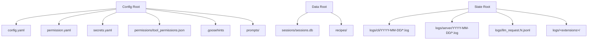

# Goose CLI Logging: Research Report

## Introduction to Goose CLI Logging

Goose uses a unified local storage system for conversations, interactions, and operational logs. All data is stored on the user's machine and is never sent to external servers by the logging system itself (though LLM providers and tools have their own privacy considerations).

### Log Locations

Goose stores data across three XDG-aligned directory trees. The actual base paths are resolved by the `etcetera` crate's platform strategy, using the author/app pair `Block/goose`:

| Type | macOS | Linux | Windows |
|------|-------|-------|---------|
| **Config** | `~/Library/Application Support/Block/goose/config/` | `~/.config/goose/` | `%APPDATA%\Block\goose\config\` |
| **Data** | `~/Library/Application Support/Block/goose/data/` | `~/.local/share/goose/` | `%APPDATA%\Block\goose\data\` |
| **State** | `~/Library/Application Support/Block/goose/state/` | `~/.local/state/goose/` | `%APPDATA%\Block\goose\data\` |

All three roots can be overridden with `GOOSE_PATH_ROOT`, which causes Goose to create `config/`, `data/`, and `state/` subdirectories under the given path.

#### Storage Hierarchy



### Command History

Stored as a plain text file:

| Platform | Path |
|----------|------|
| Unix-like | `~/.config/goose/history.txt` |
| Windows | `%APPDATA%\Block\goose\data\history.txt` |

This is a simple line-delimited history of commands entered during interactive sessions, persisted across sessions.

### Session Records (SQLite)

Goose stores session data in an SQLite database:

| Platform | Path |
|----------|------|
| Unix-like | `~/.local/share/goose/sessions/sessions.db` |
| Windows | `%APPDATA%\Block\goose\data\sessions\sessions.db` |

Prior to v1.10.0, sessions were stored as individual `.jsonl` files under the sessions directory. On upgrade to v1.10.0+, legacy `.jsonl` files are automatically imported into the database. The legacy files remain on disk but are no longer actively managed.

Session IDs follow the format `YYYYMMDD_COUNT` (e.g., `20250310_2`). The count is auto-incremented per-day within the database using a SQL `COALESCE(MAX(...), 0) + 1` pattern.

The current schema version is **11**. The database uses WAL journal mode with a 30-second busy timeout.

### System Logs

System logs are organized by component and date:

| Log Type | Path (Unix-like) | Rotation |
|----------|-----------------|----------|
| **CLI logs** | `~/.local/state/goose/logs/cli/YYYY-MM-DD/<timestamp>[-<name>].log` | Date-based directories deleted after 2 weeks |
| **Server logs** | `~/.local/state/goose/logs/server/YYYY-MM-DD/<timestamp>.log` | Date-based directories deleted after 2 weeks |
| **LLM request logs** | `~/.local/state/goose/logs/llm_request.N.jsonl` | Numbered rotation (0-9), 10 most recent files |
| **Desktop logs** | `~/Library/Application Support/Goose/logs/main.log` (macOS) | Single file |

CLI log filenames use the pattern `YYYYMMDD_HHMMSS.log` or `YYYYMMDD_HHMMSS-<name>.log` when a session name is provided. The 2-week cleanup runs on every `prepare_log_directory` call and removes date-subdirectory folders whose modification time exceeds 14 days.

Extensions may optionally log to subdirectories under `~/.local/state/goose/logs/`, with the structure determined by each extension's implementation.

### Log File Format

#### CLI and Server Logs

CLI and server logs use **JSON-formatted output** via `tracing_subscriber`. Each line is a JSON object produced by the `fmt().json()` layer. Fields include:

- `level` - log level (e.g., `"INFO"`, `"WARN"`, `"DEBUG"`)
- `target` - Rust module path (e.g., `"goose::agents::agent"`)
- `timestamp` - ISO timestamp
- `message` (or other fields) - the log payload
- `span` context (when available)

The default filter for CLI logs sets `goose=info`, `goose_cli=info`, and `mcp_client=info`, with all other crates at `WARN`. The `RUST_LOG` environment variable can override this.

#### LLM Request Logs

LLM request logs are stored as numbered JSONL files (`llm_request.0.jsonl` through `llm_request.9.jsonl`). Each line is a JSON object containing:

- Model configuration
- Input payload
- Response data
- Token usage information

The numbered rotation system keeps the 10 most recent completed requests.

#### Session Database

The SQLite database contains the following tables:

- **`sessions`** - Session metadata (ID, name, working directory, timestamps, token counts, provider info, extension data)
- **`messages`** - Conversation messages (role, content JSON, timestamps, metadata)
- **`threads`** - Thread grouping (for multi-session conversations)
- **`thread_messages`** - Messages associated with threads
- **`schema_version`** - Migration tracking

### Database Usage

Yes, Goose uses **SQLite** (via `sqlx` with `SqlitePool`) as the primary storage for session data. Key characteristics:

- **WAL journal mode** for concurrent read/write support
- **30-second busy timeout** for lock contention
- **Schema versioning** with 11 migration steps (current version: 11)
- **Lazy initialization** via `tokio::sync::OnceCell` - the pool is created on first access
- **Single database file** at `<data_dir>/sessions/sessions.db`

### Log Message Types

Goose distinguishes several major categories of log output:

| Category | Location | Content |
|----------|----------|---------|
| **Agent loop** | CLI/Server JSON logs | Tool invocations, responses, session IDs, timestamps |
| **Extension activity** | CLI/Server JSON logs | Tool initialization, capabilities, schemas, extension operations |
| **Server lifecycle** | Server JSON logs | Initialization, JSON-RPC communication, protocol version, capabilities |
| **LLM requests** | `llm_request.*.jsonl` | Raw request/response payloads, model config, token usage |
| **Security** | CLI/Server JSON logs | Prompt injection findings (SEC-UUID format), user decisions |
| **Session metadata** | SQLite `sessions` table | Session name, type, working dir, token counts, provider/model info |
| **Conversation messages** | SQLite `messages` table | User/assistant messages with structured content |

## Logging Schema

### Official Schema Status

Goose does **not** publish a standalone "official schema" document for its log output. There is no JSON Schema, Protobuf definition, or TypeScript type file that serves as the authoritative schema reference.

The schema is defined implicitly through Rust source code:

- **Session/Message types**: `crates/goose/src/session/session_manager.rs` (the `Session` struct and `SessionStorage` SQL schema)
- **Message content types**: `crates/goose/src/conversation/message.rs` (the `Message`, `MessageContent`, and related structs)
- **CLI logging setup**: `crates/goose-cli/src/logging.rs` (the `tracing_subscriber` JSON layer)
- **Log directory management**: `crates/goose/src/logging.rs` (path construction and cleanup)

### Representative Schema (from Source Code)

Based on analysis of the Goose source code, here is a representative Rust schema for the major data structures:

```rust
use chrono::{DateTime, Utc};
use serde::{Deserialize, Serialize};
use std::collections::HashMap;
use std::path::PathBuf;

#[derive(Debug, Clone, Serialize, Deserialize)]
#[serde(rename_all = "snake_case")]
pub enum SessionType {
    #[default]
    User,
    Scheduled,
    SubAgent,
    Hidden,
    Terminal,
    Gateway,
    Acp,
}

#[derive(Debug, Clone, Serialize, Deserialize, Default)]
#[serde(rename_all = "camelCase")]
pub struct ExtensionData {
    #[serde(flatten)]
    pub extension_states: HashMap<String, serde_json::Value>,
}

#[derive(Debug, Clone, Serialize, Deserialize)]
#[serde(rename_all = "camelCase")]
pub struct Session {
    pub id: String,
    pub working_dir: PathBuf,
    pub name: String,
    #[serde(default)]
    pub user_set_name: bool,
    #[serde(default)]
    pub session_type: SessionType,
    pub created_at: DateTime<Utc>,
    pub updated_at: DateTime<Utc>,
    pub extension_data: ExtensionData,
    pub total_tokens: Option<i32>,
    pub input_tokens: Option<i32>,
    pub output_tokens: Option<i32>,
    pub accumulated_total_tokens: Option<i32>,
    pub accumulated_input_tokens: Option<i32>,
    pub accumulated_output_tokens: Option<i32>,
    pub schedule_id: Option<String>,
    pub recipe: Option<serde_json::Value>,
    pub user_recipe_values: Option<HashMap<String, String>>,
    pub conversation: Option<Conversation>,
    pub message_count: usize,
    pub provider_name: Option<String>,
    pub model_config: Option<serde_json::Value>,
    #[serde(default)]
    pub goose_mode: String,
    #[serde(default)]
    pub thread_id: Option<String>,
}

#[derive(Debug, Clone, Serialize, Deserialize)]
#[serde(rename_all = "camelCase")]
pub struct Message {
    pub id: Option<String>,
    pub role: String,
    pub created: i64,
    pub content: Vec<MessageContent>,
    pub metadata: MessageMetadata,
}

#[derive(Debug, Clone, Serialize, Deserialize)]
#[serde(rename_all = "camelCase")]
pub struct MessageMetadata {
    pub user_visible: bool,
    pub agent_visible: bool,
}

#[derive(Debug, Clone, Serialize, Deserialize)]
#[serde(tag = "type", rename_all = "camelCase")]
pub enum MessageContent {
    Text(TextContent),
    Image(ImageContent),
    ToolRequest(ToolRequest),
    ToolResponse(ToolResponse),
    ToolConfirmationRequest(ToolConfirmationRequest),
    ActionRequired(ActionRequired),
    FrontendToolRequest(FrontendToolRequest),
    Thinking(ThinkingContent),
    RedactedThinking(RedactedThinkingContent),
    SystemNotification(SystemNotificationContent),
}

#[derive(Debug, Clone, Serialize, Deserialize)]
#[serde(rename_all = "camelCase")]
pub struct ToolRequest {
    pub id: String,
    pub tool_call: ToolResult<CallToolRequestParams>,
    #[serde(skip_serializing_if = "Option::is_none")]
    pub metadata: Option<serde_json::Map<String, serde_json::Value>>,
}

#[derive(Debug, Clone, Serialize, Deserialize)]
#[serde(rename_all = "camelCase")]
pub struct ToolResponse {
    pub id: String,
    pub tool_result: ToolResult<CallToolResult>,
    #[serde(skip_serializing_if = "Option::is_none")]
    pub metadata: Option<serde_json::Map<String, serde_json::Value>>,
}

#[derive(Debug, Clone, Serialize, Deserialize)]
#[serde(rename_all = "camelCase")]
pub struct ThinkingContent {
    pub thinking: String,
    pub signature: String,
}

#[derive(Debug, Clone, Serialize, Deserialize)]
#[serde(rename_all = "camelCase")]
pub struct SystemNotificationContent {
    pub notification_type: SystemNotificationType,
    pub msg: String,
    #[serde(skip_serializing_if = "Option::is_none")]
    pub data: Option<serde_json::Value>,
}

#[derive(Debug, Clone, Serialize, Deserialize)]
#[serde(rename_all = "camelCase")]
pub enum SystemNotificationType {
    ThinkingMessage,
    InlineMessage,
    CreditsExhausted,
}

pub enum ToolResult<T> {
    Success { value: T },
    Error { error: String },
}
```

### SQLite Schema

The SQL schema (extracted from `session_manager.rs`):

```sql
CREATE TABLE schema_version (
    version INTEGER PRIMARY KEY,
    applied_at TIMESTAMP DEFAULT CURRENT_TIMESTAMP
);

CREATE TABLE sessions (
    id TEXT PRIMARY KEY,
    name TEXT NOT NULL DEFAULT '',
    description TEXT NOT NULL DEFAULT '',
    user_set_name BOOLEAN DEFAULT FALSE,
    session_type TEXT NOT NULL DEFAULT 'user',
    working_dir TEXT NOT NULL,
    created_at TIMESTAMP DEFAULT CURRENT_TIMESTAMP,
    updated_at TIMESTAMP DEFAULT CURRENT_TIMESTAMP,
    extension_data TEXT DEFAULT '{}',
    total_tokens INTEGER,
    input_tokens INTEGER,
    output_tokens INTEGER,
    accumulated_total_tokens INTEGER,
    accumulated_input_tokens INTEGER,
    accumulated_output_tokens INTEGER,
    schedule_id TEXT,
    recipe_json TEXT,
    user_recipe_values_json TEXT,
    provider_name TEXT,
    model_config_json TEXT,
    goose_mode TEXT NOT NULL DEFAULT 'auto',
    thread_id TEXT
);

CREATE TABLE messages (
    id INTEGER PRIMARY KEY AUTOINCREMENT,
    message_id TEXT,
    session_id TEXT NOT NULL REFERENCES sessions(id),
    role TEXT NOT NULL,
    content_json TEXT NOT NULL,
    created_timestamp INTEGER NOT NULL,
    timestamp TIMESTAMP DEFAULT CURRENT_TIMESTAMP,
    tokens INTEGER,
    metadata_json TEXT
);

CREATE TABLE threads (
    id TEXT PRIMARY KEY,
    name TEXT NOT NULL DEFAULT 'New Chat',
    user_set_name BOOLEAN DEFAULT FALSE,
    working_dir TEXT,
    created_at TIMESTAMP DEFAULT CURRENT_TIMESTAMP,
    updated_at TIMESTAMP DEFAULT CURRENT_TIMESTAMP,
    archived_at TIMESTAMP,
    metadata_json TEXT DEFAULT '{}'
);

CREATE TABLE thread_messages (
    id INTEGER PRIMARY KEY AUTOINCREMENT,
    thread_id TEXT NOT NULL REFERENCES threads(id),
    session_id TEXT,
    message_id TEXT,
    role TEXT NOT NULL,
    content_json TEXT NOT NULL,
    created_timestamp INTEGER NOT NULL,
    metadata_json TEXT DEFAULT '{}'
);
```

## Informational Content versus Hook Events

### File-System Logs: When They Are Better

Goose's file-system logs and SQLite database are the superior data source when you need:

| Need | Why file-system is better |
|------|--------------------------|
| **Full conversation history** | The SQLite `messages` table contains every user/assistant turn with complete content, including tool arguments and responses that may be truncated in stream events |
| **Token usage metrics** | Session-level and accumulated token counts are stored per-session in the `sessions` table, enabling historical analysis across sessions |
| **Session metadata** | Working directory, session type, provider/model config, and timestamps are queryable via SQL |
| **Post-hoc analysis** | After a session completes, the database is the only persistent record; stream events are ephemeral |
| **Cross-session insights** | SQL queries across the `sessions` table enable aggregation (total tokens, session counts, usage trends) |
| **LLM request/response audit** | The `llm_request.N.jsonl` files capture raw request and response payloads that are not exposed via any event stream |
| **Diagnostics** | The `goose session diagnostics` command packages logs + session data + config into a ZIP for troubleshooting |

### Hook/Stream Events: When They Are Better

Goose's event surfaces (`GOOSE_STATUS_HOOK` and `--output-format stream-json`) are superior when you need:

| Need | Why events are better |
|------|----------------------|
| **Real-time observability** | Stream-json events fire as the agent loop executes, enabling live monitoring without polling the database |
| **Integration with external tools** | The `GOOSE_STATUS_HOOK` can trigger shell commands (TTS, notifications, status indicators) on state transitions |
| **CI/CD pipeline consumption** | The `--output-format json` mode produces a single post-run JSON payload ideal for automated workflows |
| **Non-invasive monitoring** | Events require no filesystem access or database queries; they are emitted to stdout |
| **Agent state transitions** | The `waiting`/`thinking` status hook provides real-time agent state that is not captured in logs |

### Additional Data Sources for Enrichment

Beyond logs and events, these sources can enrich the data Claudine collects:

| Source | What it provides | Access method |
|--------|-----------------|---------------|
| **SQLite `sessions.db`** | Full conversation history, token metrics, session metadata | Direct SQLite read (WAL-compatible) |
| **`llm_request.N.jsonl`** | Raw LLM request/response payloads, model config | File read |
| **`config.yaml`** | Provider, model, extensions configuration | File read |
| **`permission.yaml`** | Tool permission levels | File read |
| **OpenTelemetry export** | Structured traces/metrics/logs to OTLP-compatible backends | Configure `OTEL_EXPORTER_OTLP_ENDPOINT` |
| **Langfuse integration** | LLM observability traces with cost/latency tracking | Configure `LANGFUSE_PUBLIC_KEY` + `LANGFUSE_SECRET_KEY` |
| **`goose session list` CLI** | Structured session listing | Shell command |
| **`goose session diagnostics` CLI** | Packaged diagnostics bundle (logs + session + config + system info) | Shell command |
| **`GOOSE_STATUS_HOOK`** | Real-time `waiting`/`thinking` state transitions | Configured shell command |
| **`--output-format stream-json`** | Structured JSON events during `goose run` | stdout parsing |

### Recommended Strategy for Claudine

For the Goose provider specifically, Claudine should:

1. **Prefer the SQLite database** for historical session data and token metrics - it is the most complete and structured source
2. **Use `--output-format stream-json`** for real-time event capture during wrapped execution (Claudine's stream parser already supports this)
3. **Use `GOOSE_STATUS_HOOK`** as a lightweight real-time state indicator (thinking/waiting) for TTS and notification triggers
4. **Consider OTLP export** as a future enrichment source if structured traces are needed for observability

## Sources

- [Goose Logging System (official docs)](https://goose-docs.ai/docs/guides/logs)
- [Configuration Files (official docs)](https://goose-docs.ai/docs/guides/config-files)
- [Environment Variables (official docs)](https://goose-docs.ai/docs/guides/environment-variables)
- [Diagnostics and Reporting (official docs)](https://goose-docs.ai/docs/troubleshooting/diagnostics-and-reporting)
- [CLI Commands (official docs)](https://goose-docs.ai/docs/guides/goose-cli-commands)
- [Session Management (official docs)](https://goose-docs.ai/docs/guides/sessions/session-management)
- [GitHub Repository (aaif-goose/goose)](https://github.com/aaif-goose/goose)
- [Source: session_manager.rs](https://github.com/aaif-goose/goose/blob/main/crates/goose/src/session/session_manager.rs) - Session struct, SQLite schema, migrations
- [Source: logging.rs (goose crate)](https://github.com/aaif-goose/goose/blob/main/crates/goose/src/logging.rs) - Log directory management and cleanup
- [Source: logging.rs (goose-cli crate)](https://github.com/aaif-goose/goose/blob/main/crates/goose-cli/src/logging.rs) - CLI logging setup with tracing_subscriber JSON layer
- [Source: message.rs](https://github.com/aaif-goose/goose/blob/main/crates/goose/src/conversation/message.rs) - Message and MessageContent types
- [Source: legacy.rs](https://github.com/aaif-goose/goose/blob/main/crates/goose/src/session/legacy.rs) - Legacy JSONL session import
- [Source: extension_data.rs](https://github.com/aaif-goose/goose/blob/main/crates/goose/src/session/extension_data.rs) - Extension state storage
- [Source: paths.rs](https://github.com/aaif-goose/goose/blob/main/crates/goose/src/config/paths.rs) - Platform directory resolution
