# Goose CLI Logging

## Introduction to Goose CLI Logging

Goose (now hosted by the [Agentic AI Foundation](https://aaif.io/) at [`aaif-goose/goose`](https://github.com/aaif-goose/goose), latest observed release **v1.39.0**) is a local-first AI agent with a native desktop app, a CLI, and an embedded server (`goosed`). Its observability surface is **dual-natured**: a single **SQLite database** is the authoritative store for all conversations and session metadata (shared by CLI *and* Desktop), while a set of **`tracing`-based JSON log files** capture operational/agent-loop activity and raw LLM payloads.

All data is stored locally and is never transmitted by the logging system itself (LLM providers and extensions have their own privacy considerations).

> **Evidence basis.** Goose is not installed on this research host, so no log files could be inspected directly. Every claim below is grounded in current `main`-branch source (`confidence: source_code`), the official docs at `goose-docs.ai` (`documented`), or reasoned from the tracing defaults (`inferred`). No `observed` evidence is available for this provider on this host.

### Log Locations

Paths are resolved by the `etcetera` crate using the author/app pair `Block/goose`. The `"Block"` top-level domain is deliberately retained so existing installations are not orphaned. All three roots can be collectively overridden by setting `GOOSE_PATH_ROOT` (under which `config/`, `data/`, and `state/` subdirectories are created).

| Type | macOS | Linux | Windows |
|------|-------|-------|---------|
| **Config** | `~/Library/Application Support/Block/goose/config/` | `~/.config/goose/` | `%APPDATA%\Block\goose\config\` |
| **Data** | `~/Library/Application Support/Block/goose/data/` | `~/.local/share/goose/` | `%APPDATA%\Block\goose\data\` |
| **State** | `~/Library/Application Support/Block/goose/state/` | `~/.local/state/goose/` | `%APPDATA%\Block\goose\data\` (state falls back to data) |

Note the Windows **state** root collapses into the **data** root (`state_dir().unwrap_or(strategy.data_dir())`), so on Windows the logs tree lives under `...\Block\goose\data\logs\` rather than a separate state dir.

#### Storage Hierarchy

```mermaid
graph TD
    A[Config Root] --> A1[config.yaml]
    A --> A2[permission.yaml]
    A --> A3[secrets.yaml]
    A --> A4[permissions/tool_permissions.json]
    A --> A5[.goosehints]
    A --> A6[prompts/]

    B[Data Root] --> B1[sessions/sessions.db + .db-wal + .db-shm]
    B --> B2[recipes/]
    B --> B3[history.txt Windows-only]

    C[State Root] --> C1[logs/cli/YYYY-MM-DD/*.log JSON]
    C --> C2[logs/server/YYYY-MM-DD/*.log JSON]
    C --> C3[logs/llm_request.0..9.jsonl]
    C --> C4[logs/&lt;extension&gt;/ optional]

    D[Unix Config Root] --> D1[history.txt Unix-only]
```



### Command History

A plain, line-delimited recall buffer (no timestamps, no session IDs):

| Platform | Path |
|----------|------|
| Unix-like | `~/.config/goose/history.txt` |
| Windows | `%APPDATA%\Block\goose\data\history.txt` |

### Session Records (SQLite) — the authoritative store

| Platform | Path |
|----------|------|
| Unix-like | `~/.local/share/goose/sessions/sessions.db` |
| Windows | `%APPDATA%\Block\goose\data\sessions\sessions.db` |

Session IDs follow `YYYYMMDD_COUNT` (e.g. `20250310_2`); the per-day count is derived in SQL via `COALESCE(MAX(...), 0) + 1`. Prior to v1.10.0, sessions were individual `.jsonl` files under the sessions directory; on first launch of v1.10.0+ they are bulk-imported into the database and then left on disk, unmanaged.

The current schema version is **14** (`CURRENT_SCHEMA_VERSION`). The pool is opened with `journal_mode = Wal`, `busy_timeout = 30s`, `foreign_keys = on`, lazy `OnceCell` initialization, and concurrent-first-run safety via `BEGIN IMMEDIATE` plus `IF NOT EXISTS` / `INSERT OR IGNORE` on every bootstrap DDL statement.

### System Logs

System logs are organized by component and date. Both the CLI and server layers share one `tracing_subscriber` builder (`goose::logging`); each call to `prepare_log_directory` runs `cleanup_old_logs`, which removes date-subdirectory folders whose modification time exceeds **14 days**.

| Log type | Path (Unix-like) | Rotation |
|----------|------------------|----------|
| **CLI logs** | `~/.local/state/goose/logs/cli/YYYY-MM-DD/<YYYYMMDD_HHMMSS>[-<name>].log` | Date subdirs > 2 weeks deleted |
| **Server logs** | `~/.local/state/goose/logs/server/YYYY-MM-DD/<YYYYMMDD_HHMMSS>.log` | Date subdirs > 2 weeks deleted |
| **LLM request logs** | `~/.local/state/goose/logs/llm_request.{0..9}.jsonl` | Numbered fixed-count, 10 retained |
| **Desktop logs** | `~/Library/Application Support/Goose/logs/main.log` (macOS) | Single file |

The CLI filename timestamp (`YYYYMMDD_HHMMSS`) and the date-subdir (`YYYY-MM-DD`) are both produced with `chrono::Local::now()`, i.e. **local time**. The optional `<name>` segment is the session/run name passed to `setup_logging`. Extensions may optionally write to their own subdirectories under `logs/`.

When [prompt injection detection](https://goose-docs.ai/docs/guides/security/prompt-injection-detection) is enabled, the CLI/server logs additionally carry security findings (IDs of the form `SEC-{uuid}`) and the user's allow/deny decisions.

### Log File Formats

#### CLI and Server logs — JSON via `tracing`

Both use `tracing_subscriber::fmt::layer().json()` (the CLI sets `json: true`, `console: false`). Each line is one JSON object with `timestamp`, `level`, `target`, `fields` (the message payload), and `span` context when inside a span. The default `EnvFilter` is `mcp_client=info`, `goose=info`, plus the caller's extra directives (`goose_cli=info` for the CLI); all other crates default to `WARN`. `RUST_LOG` overrides the whole filter. Optional `#[cfg(otel)]` OTLP layers and a Langfuse layer are appended to the same registry when their configuration is present.

#### LLM request logs — numbered JSONL rotation

Implemented in `goose-providers::request_log` and installed by `goose::providers::utils::init_goose_request_log` (`LOGS_TO_KEEP = 10`). Each completed LLM request is written to a temp file `llm_request.{uuid}.jsonl`; on `Drop::finish()` the existing files are shifted `0 -> 1 -> ... -> 9` and the temp file is atomically renamed to `llm_request.0.jsonl`. Each line carries the model configuration, the input payload, the response data, and token-usage information. There is **no timestamp in the filename** — recency is encoded purely by the numeric suffix (`.0` newest).

#### Session database — full SQL schema (v14)

See the [Logging Schema](#sqlite-schema-v14) section for the complete DDL. The database holds `sessions`, `messages`, `threads`, `thread_messages`, `schema_version`, and the provider-inventory tables added by migration 11.

### Database Usage

**Yes — SQLite** (via `sqlx::SqlitePool`) is the primary, authoritative store for session data, shared by the CLI and the Desktop app. Characteristics:

- **WAL journal mode** (`sessions.db-wal` / `sessions.db-shm` are live while goose runs — **never copy the DB live**; open a read-only connection or snapshot first).
- **30-second busy timeout** for lock contention.
- **Schema versioning** via an explicit `schema_version` table; 14 migration steps, current version **14**.
- **Lazy initialization** via `tokio::sync::OnceCell`; the pool is created on first access.
- **Single database file** at `<data_dir>/sessions/sessions.db`.

### Log Message Types

| Category | Location | Content |
|----------|----------|---------|
| **Agent loop** | CLI/Server JSON logs | Tool invocations/responses, session IDs, step timing |
| **Extension activity** | CLI/Server JSON logs | Tool init, capabilities, schemas, extension operations |
| **Server lifecycle** | Server JSON logs | `goosed` init, JSON-RPC traffic, protocol version, capabilities |
| **LLM requests** | `llm_request.{0..9}.jsonl` | Raw request/response payloads, model config, token usage |
| **Security** | CLI/Server JSON logs | Prompt-injection findings (`SEC-{uuid}`), user allow/deny decisions |
| **Session metadata** | SQLite `sessions` table | Name, type, working dir, token/cost totals, provider/model, mode, archive state |
| **Conversation messages** | SQLite `messages` table | User/assistant turns with structured `MessageContent` (text, tools, thinking, …) |

## Logging Schema

### No Formal Schema — Informal (Source-Defined + utoipa/OpenAPI)

Goose publishes **no standalone schema artifact** (no JSON Schema, OpenAPI file, protobuf, or `.d.ts`) for its log or session output. What exists is **informal but authoritative**:

- **Session & SQL schema**: the `Session` struct, the `SessionStorage` DDL, and all 14 migrations live in [`session_manager.rs`](https://github.com/aaif-goose/goose/blob/main/crates/goose/src/session/session_manager.rs).
- **Message types**: `Message`, `MessageContent`, `MessageMetadata`, `TokenState` live in the `goose-providers` crate at [`conversation/message.rs`](https://github.com/aaif-goose/goose/blob/main/crates/goose-providers/src/conversation/message.rs) and are annotated with `#[derive(utoipa::ToSchema)]`, so `goose-server`'s OpenAPI surface exposes them.
- **CLI/server log lines**: the `tracing_subscriber` JSON layer has **no schema**; the field set is whatever `tracing` emits (`timestamp`, `level`, `target`, `fields`, `span`).

Because the prior research (2026-04-29) predated several migrations and the `goose-providers` extraction, the Rust model below is **fully refreshed** against current `main`.

### Representative Schema (from Source Code)

```rust
use chrono::{DateTime, Utc};
use serde::{Deserialize, Serialize};
use std::collections::HashMap;
use std::path::PathBuf;

/// SQLite schema version tracked in the `schema_version` table.
pub const CURRENT_SCHEMA_VERSION: i32 = 14;

#[derive(Debug, Clone, Copy, Serialize, Deserialize, PartialEq, Eq, Default, strum::Display)]
#[serde(rename_all = "snake_case")]
#[strum(serialize_all = "snake_case")]
pub enum SessionType {
    #[default]
    User,
    Scheduled,
    SubAgent,
    Hidden,
    Terminal,
    Gateway,
    Acp,
}

/// Per-period token usage (goose_providers::conversation::token_usage).
/// All fields are Optional at the DB boundary; rows often store NULLs.
#[derive(Debug, Clone, Default, Serialize, Deserialize)]
#[serde(rename_all = "camelCase")]
pub struct Usage {
    pub input_tokens: Option<i32>,
    pub output_tokens: Option<i32>,
    pub total_tokens: Option<i32>,
    pub cache_read_input_tokens: Option<i32>,
    pub cache_write_input_tokens: Option<i32>,
}

/// One row in the `sessions` table (metadata only; messages live in `messages`).
#[derive(Debug, Clone, Serialize, Deserialize)]
pub struct Session {
    pub id: String,                                   // {YYYYMMDD}_{count}
    pub working_dir: PathBuf,
    #[serde(alias = "description")]
    pub name: String,
    #[serde(default)]
    pub user_set_name: bool,
    #[serde(default)]
    pub session_type: SessionType,
    pub created_at: DateTime<Utc>,
    pub updated_at: DateTime<Utc>,
    pub extension_data: ExtensionData,
    #[serde(default)]
    pub usage: Usage,                                 // per-period tokens (v14: +cache read/write)
    #[serde(default)]
    pub accumulated_usage: Usage,                      // cumulative across compactions
    pub accumulated_cost: Option<f64>,                 // migration 13
    pub schedule_id: Option<String>,
    pub recipe: Option<serde_json::Value>,
    pub user_recipe_values: Option<HashMap<String, String>>,
    pub conversation: Option<Conversation>,            // only populated when include_messages=true
    pub message_count: usize,
    #[serde(default)]
    pub last_message_at: Option<DateTime<Utc>>,        // derived from last message timestamp
    pub provider_name: Option<String>,
    pub model_config: Option<ModelConfig>,             // typed (was serde_json::Value)
    #[serde(default)]
    pub goose_mode: GooseMode,                         // auto | approve | chat | smart_approve
    #[serde(default)]
    pub archived_at: Option<DateTime<Utc>>,            // migration 12
    #[serde(default)]
    pub project_id: Option<String>,                    // migration 12
    #[serde(default)]
    pub last_message_snippet: Option<String>,          // list-view preview; not persisted as a column
}

#[derive(Debug, Clone, Default, Serialize, Deserialize)]
#[serde(rename_all = "camelCase")]
pub struct ExtensionData {
    #[serde(flatten)]
    pub extension_states: HashMap<String, serde_json::Value>,
}

/// One row in the `messages` table. `created` is unix SECONDS (the reader
/// tolerates millis via MILLISECOND_TIMESTAMP_THRESHOLD = 10_000_000_000).
#[derive(Debug, Clone, Serialize, Deserialize)]
#[serde(rename_all = "camelCase")]
pub struct Message {
    pub id: Option<String>,
    pub role: Role,                // rmcp::model::Role -> "user" | "assistant"
    pub created: i64,              // unix seconds
    #[serde(deserialize_with = "deserialize_sanitized_content")]
    pub content: Vec<MessageContent>,
    pub metadata: MessageMetadata,
}

#[derive(Debug, Clone, Default, Serialize, Deserialize)]
#[serde(rename_all = "camelCase")]
pub struct MessageMetadata {
    pub user_visible: bool,
    pub agent_visible: bool,
    #[serde(skip_serializing_if = "Option::is_none")]
    pub inference: Option<InferenceMetadata>,   // NEW: provider / requested_model / resolved_model
    #[serde(default, skip_serializing_if = "std::ops::Not::not")]
    pub steer: bool,                            // NEW: UI-only steer marker (never sent to providers)
}

#[derive(Debug, Clone, Serialize, Deserialize)]
#[serde(rename_all = "camelCase")]
pub struct InferenceMetadata {
    pub provider: String,
    pub requested_model: String,
    #[serde(skip_serializing_if = "Option::is_none")]
    pub resolved_model: Option<String>,
}

/// Content blocks within a message. Tag = `"type"`, camelCase.
/// Legacy `"reasoning"` is migrated to `Thinking` on deserialize;
/// pre-14.0 `"conversationCompacted"` blocks are dropped.
#[derive(Debug, Clone, Serialize, Deserialize)]
#[serde(tag = "type", rename_all = "camelCase")]
pub enum MessageContent {
    Text(TextContent),
    Image(ImageContent),
    ToolRequest(ToolRequest),
    ToolResponse(ToolResponse),
    ToolConfirmationRequest(ToolConfirmationRequest),
    ActionRequired(ActionRequired),
    FrontendToolRequest(FrontendToolRequest),
    Thinking(ThinkingContent),
    RedactedThinking(RedactedThinkingContent),
    SystemNotification(SystemNotificationContent),
}

#[derive(Debug, Clone, Serialize, Deserialize)]
#[serde(rename_all = "camelCase")]
pub struct ToolRequest {
    pub id: String,
    pub tool_call: ToolResult<CallToolRequestParams>, // {Success{value}} | {Error{error}}
    #[serde(skip_serializing_if = "Option::is_none")]
    pub metadata: Option<ProviderMetadata>,
    #[serde(rename = "_meta", skip_serializing_if = "Option::is_none")]
    pub tool_meta: Option<serde_json::Value>, // goose.external_dispatch / goose.toolSummary.title / goose.toolChain.summary
}

#[derive(Debug, Clone, Serialize, Deserialize)]
#[serde(rename_all = "camelCase")]
pub struct ToolResponse {
    pub id: String,
    pub tool_result: ToolResult<CallToolResult>,
    #[serde(skip_serializing_if = "Option::is_none")]
    pub metadata: Option<ProviderMetadata>,
}

#[derive(Debug, Clone, Serialize, Deserialize)]
#[serde(tag = "actionType", rename_all = "camelCase")]
pub enum ActionRequiredData {
    ToolConfirmation { id: String, tool_name: String, arguments: JsonObject, prompt: Option<String> },
    Elicitation { id: String, message: String, requested_schema: serde_json::Value },
    ElicitationResponse { id: String, user_data: serde_json::Value, action: ElicitationAction },
}

#[derive(Debug, Clone, Serialize, Deserialize)]
#[serde(rename_all = "camelCase")]
pub struct ActionRequired { pub data: ActionRequiredData }

#[derive(Debug, Clone, Serialize, Deserialize)]
pub struct ThinkingContent { pub thinking: String, pub signature: String }

#[derive(Debug, Clone, Serialize, Deserialize)]
pub struct RedactedThinkingContent { pub data: String }

#[derive(Debug, Clone, Serialize, Deserialize)]
#[serde(rename_all = "camelCase")]
pub enum SystemNotificationType { ThinkingMessage, InlineMessage, CreditsExhausted }

#[derive(Debug, Clone, Serialize, Deserialize)]
#[serde(rename_all = "camelCase")]
pub struct SystemNotificationContent {
    pub notification_type: SystemNotificationType,
    pub msg: String,
    #[serde(skip_serializing_if = "Option::is_none")]
    pub data: Option<serde_json::Value>,
}
```

### SQLite Schema (v14)

```sql
CREATE TABLE schema_version (
    version   INTEGER PRIMARY KEY,
    applied_at TIMESTAMP DEFAULT CURRENT_TIMESTAMP
);

CREATE TABLE sessions (
    id                          TEXT PRIMARY KEY,
    name                        TEXT NOT NULL DEFAULT '',
    description                 TEXT NOT NULL DEFAULT '',
    user_set_name               BOOLEAN DEFAULT FALSE,
    session_type                TEXT NOT NULL DEFAULT 'user',
    working_dir                 TEXT NOT NULL,
    created_at                  TIMESTAMP DEFAULT CURRENT_TIMESTAMP,
    updated_at                  TIMESTAMP DEFAULT CURRENT_TIMESTAMP,
    extension_data              TEXT DEFAULT '{}',
    total_tokens                INTEGER,
    input_tokens                INTEGER,
    output_tokens               INTEGER,
    cache_read_tokens           INTEGER,            -- migration 14
    cache_write_tokens          INTEGER,            -- migration 14
    accumulated_total_tokens     INTEGER,
    accumulated_input_tokens     INTEGER,
    accumulated_output_tokens    INTEGER,
    accumulated_cache_read_tokens INTEGER,           -- migration 14
    accumulated_cache_write_tokens INTEGER,          -- migration 14
    accumulated_cost            REAL,                -- migration 13
    schedule_id                 TEXT,
    recipe_json                 TEXT,
    user_recipe_values_json     TEXT,
    provider_name               TEXT,
    model_config_json           TEXT,
    goose_mode                  TEXT NOT NULL DEFAULT 'auto',
    archived_at                 TIMESTAMP,           -- migration 12
    project_id                  TEXT,                -- migration 12
    thread_id                   TEXT                 -- migration 10 (column retained; not on the Session struct)
);

CREATE TABLE messages (
    id               INTEGER PRIMARY KEY AUTOINCREMENT,
    message_id       TEXT,                            -- migration 7: 'msg_' || session_id || '_' || id
    session_id       TEXT NOT NULL REFERENCES sessions(id),
    role             TEXT NOT NULL,
    content_json     TEXT NOT NULL,
    created_timestamp INTEGER NOT NULL,               -- unix seconds (millis tolerated)
    timestamp        TIMESTAMP DEFAULT CURRENT_TIMESTAMP,
    tokens           INTEGER,
    metadata_json    TEXT                              -- migration 3
);

CREATE TABLE threads (                               -- migration 10
    id            TEXT PRIMARY KEY,
    name          TEXT NOT NULL DEFAULT 'New Chat',
    user_set_name BOOLEAN DEFAULT FALSE,
    working_dir   TEXT,
    created_at    TIMESTAMP DEFAULT CURRENT_TIMESTAMP,
    updated_at    TIMESTAMP DEFAULT CURRENT_TIMESTAMP,
    archived_at   TIMESTAMP,
    metadata_json TEXT DEFAULT '{}'
);

CREATE TABLE thread_messages (                       -- migration 10
    id               INTEGER PRIMARY KEY AUTOINCREMENT,
    thread_id        TEXT NOT NULL REFERENCES threads(id),
    session_id       TEXT,
    message_id       TEXT,
    role             TEXT NOT NULL,
    content_json     TEXT NOT NULL,
    created_timestamp INTEGER NOT NULL,
    metadata_json    TEXT DEFAULT '{}'
);

-- Indexes: idx_messages_{session,timestamp,message_id},
--          idx_sessions_{updated,type,thread}, idx_thread_messages_{thread,message_id}
-- Migration 11 also creates provider-inventory tables (providers::inventory).
```

### Migration Summary (1 → 14)

| v | Change |
|---|--------|
| 1 | `schema_version` table |
| 2 | `sessions.user_recipe_values_json` |
| 3 | `messages.metadata_json` |
| 4 | `sessions.name`, `sessions.user_set_name` |
| 5 | `sessions.session_type` + `idx_sessions_type` |
| 6 | `sessions.provider_name`, `sessions.model_config_json` |
| 7 | `messages.message_id` (+ backfill `'msg_' || session_id || '_' || id`) + index |
| 8 | `sessions.goose_mode` |
| 9 | Reclassify ACP sessions (`session_type='acp'`) |
| 10 | `sessions.thread_id` + `threads` + `thread_messages` tables + indexes |
| 11 | Provider-inventory tables (`providers::inventory`) |
| 12 | `sessions.archived_at`, `sessions.project_id` |
| 13 | `sessions.accumulated_cost` (REAL) |
| 14 | `sessions.cache_read_tokens`, `cache_write_tokens`, `accumulated_cache_read_tokens`, `accumulated_cache_write_tokens` |

## Informational Content versus Hook Events

Claudine's Goose logging currently relies on **hook events** — the `GOOSE_STATUS_HOOK` (lightweight `waiting`/`thinking` state transitions) and the wrapper's `--output-format stream-json` parser — rather than Goose's on-disk SQLite store. This section analyzes when each source wins.

### When File-System Logs Are the Better Source

| Need | Why the DB / files win |
|------|------------------------|
| **Full conversation history** | The `messages` table holds every user/assistant turn with complete `MessageContent` (tool args + results, thinking blocks) that stream events may elide. |
| **Token & cost metrics** | Per-period (`usage`) and cumulative (`accumulated_usage`, `accumulated_cost`) totals live on the `sessions` row — migration 13/14 added cost and cache-token granularity the events never carry. |
| **Post-hoc / cross-session analysis** | The DB is the only persistent record; SQL enables aggregation (totals, trends, per-working-dir rollups). Stream events are ephemeral. |
| **Session metadata** | `session_type`, `working_dir`, `goose_mode`, `provider_name`/`model_config`, `archived_at`, `project_id`, schedule/recipe data are all queryable. |
| **Sub-agent sessions** | Sub-agent runs are stored with `session_type = 'sub_agent'` in the *same* DB — no separate file hierarchy. |
| **LLM request/response audit** | `llm_request.{0..9}.jsonl` captures raw payloads unavailable through any event surface. |
| **Thread reconstruction** | `threads` / `thread_messages` model multi-session conversations. |
| **Diagnostics bundle** | `goose session diagnostics --session-id <id>` packages system info + session + config + logs + prompts + schedule + errors into one JSON file. |

### When Hook / Stream Events Are the Better Source

| Need | Why events win |
|------|----------------|
| **Real-time observability** | `stream-json` fires as the agent loop runs; the DB only updates after each turn commits. |
| **Live state indication** | `GOOSE_STATUS_HOOK` emits `waiting`/`thinking` transitions for TTS/notification triggers — not represented in logs at all. |
| **Non-invasive monitoring** | Events are emitted to stdout / a configured shell command; no filesystem or DB access required. |
| **CI/CD consumption** | `--output-format json` yields a single post-run JSON payload ideal for automation. |
| **WAL safety** | Reading `sessions.db` while goose runs risks seeing a half-checkpointed state; events have no such hazard. |

### Other Sources for Data Enrichment

| Source | What it provides | Access method |
|--------|------------------|---------------|
| **`sessions.db` (read-only connection)** | Full history + token/cost metrics + thread graph | `sqlx`/`rusqlite` read-only, or `sqlite3 file:sessions.db?mode=ro`; **never** copy the live WAL DB |
| **`llm_request.{0..9}.jsonl`** | Raw provider payloads + token usage | File read |
| **`config.yaml` / `permission.yaml`** | Provider/model, extensions, tool-permission levels, OTel/Langfuse config | File read |
| **OpenTelemetry export** | Structured traces/metrics/logs to OTLP backends | `otel_exporter_otlp_endpoint` config or `OTEL_EXPORTER_OTLP_*` env |
| **Langfuse integration** | LLM observability traces with cost/latency | `LANGFUSE_PUBLIC_KEY` + `LANGFUSE_SECRET_KEY` (+ optional `LANGFUSE_URL`) |
| **`goose session list`** | Structured session listing | Shell command |
| **`goose session diagnostics`** | Packaged diagnostics JSON (system/session/config/logs/prompts/schedule/errors) | Shell command |
| **`GOOSE_STATUS_HOOK`** | Real-time `waiting`/`thinking` state | Configured shell command |
| **`--output-format stream-json`** | Structured JSON events during `goose run` | stdout parsing |

### Recommended Hybrid Strategy

For Goose, Claudine should keep **events (stream-json + status hook) for real-time action, policy, and live state**, and treat **`sessions.db` as the historical/cost-analysis source of truth** — opened read-only, never copied while goose runs. The biggest practical gap is that Claudine does not yet ingest `sessions.db`, so historical token/cost aggregation (now richer after migrations 13–14) and full conversation replay are unavailable without that reader. The `llm_request.*.jsonl` rotation is a complementary audit trail for raw provider payloads.

```mermaid
flowchart LR
    A[goose CLI] -->|stream-json| C[Claudine wrap]
    A -->|GOOSE_STATUS_HOOK| B[Claudine handle]
    A -->|sessions.db WAL| D[(state_db)]
    A -->|tracing JSON| E[logs/cli|server]
    A -->|raw payloads| F[logs/llm_request.*.jsonl]
    G[goose Desktop] -->|shared| D
    G -->|plain text| H[Goose/logs/main.log]
    C --> I[Claudine JSONL -> SQLite]
    B --> I
    D -. read-only .-> J[claudine logs sync (future)]
    E -. file read .-> J
    F -. file read .-> J
    J --> I
```

## Sources

- [Goose Logging System (official docs)](https://goose-docs.ai/docs/guides/logs)
- [Configuration Files (official docs)](https://goose-docs.ai/docs/guides/config-files)
- [Environment Variables (official docs)](https://goose-docs.ai/docs/guides/environment-variables)
- [Diagnostics and Reporting (official docs)](https://goose-docs.ai/docs/troubleshooting/diagnostics-and-reporting)
- [CLI Commands (official docs)](https://goose-docs.ai/docs/guides/goose-cli-commands)
- [Session Management (official docs)](https://goose-docs.ai/docs/guides/sessions/session-management)
- [Goose moves to AAIF (blog, 2026-04-07)](https://goose-docs.ai/blog/2026/04/07/goose-moves-to-aaif)
- [GitHub Repository (aaif-goose/goose)](https://github.com/aaif-goose/goose) — moved from `block/goose` to the Linux Foundation's Agentic AI Foundation
- [Source: session_manager.rs](https://github.com/aaif-goose/goose/blob/main/crates/goose/src/session/session_manager.rs) — `Session` struct, `SessionStorage`, full SQL DDL, migrations 1–14, `CURRENT_SCHEMA_VERSION = 14`
- [Source: logging.rs (goose crate)](https://github.com/aaif-goose/goose/blob/main/crates/goose/src/logging.rs) — `LoggingConfig`, `build_logging_subscriber`, `prepare_log_directory`, 14-day `cleanup_old_logs`, optional OTel + Langfuse layers
- [Source: logging.rs (goose-cli crate)](https://github.com/aaif-goose/goose/blob/main/crates/goose-cli/src/logging.rs) — `setup_logging` (json=true, console=false, `goose_cli=info`), `init_goose_request_log`
- [Source: providers/utils.rs](https://github.com/aaif-goose/goose/blob/main/crates/goose/src/providers/utils.rs) — `init_goose_request_log`, `RequestLog`, `FileLogHandle` rotation (`LOGS_TO_KEEP = 10`)
- [Source: conversation/message.rs (goose-providers crate)](https://github.com/aaif-goose/goose/blob/main/crates/goose-providers/src/conversation/message.rs) — `Message`, `MessageContent`, `MessageMetadata`, `InferenceMetadata`, `TokenState`, `reasoning`→`thinking` migration
- [Source: config/paths.rs](https://github.com/aaif-goose/goose/blob/main/crates/goose/src/config/paths.rs) — `Paths`, `GOOSE_PATH_ROOT` override, retained `"Block"` author prefix

## Changelog

- **2026-07-01** — Full refresh against `aaif-goose/goose` `main` (observed release v1.39.0). Goose is not installed on this research host, so all evidence is `source_code` / `documented` / `inferred` (no `observed`). Key changes since the 2026-04-29 report: (1) project moved `block/goose` → `aaif-goose/goose` under the Linux Foundation AAIF; docs moved to `goose-docs.ai`; (2) `sessions.db` schema version advanced **11 → 14** — migration 11 added provider-inventory tables, 12 added `archived_at` + `project_id`, 13 added `accumulated_cost`, 14 added cache read/write token columns; (3) `Session` struct refactored to `usage: Usage` + `accumulated_usage: Usage` with new `accumulated_cost`, `last_message_at`, `archived_at`, `project_id`, `last_message_snippet` fields and `thread_id` dropped from the struct; (4) message types relocated to the new **goose-providers** crate — `MessageMetadata` gained `inference` (`InferenceMetadata`) and `steer`, `ToolRequest` gained `_meta` (`tool_meta`) carrying `goose.external_dispatch` / `goose.toolSummary.title` / `goose.toolChain.summary`, `ActionRequiredData` gained `Elicitation`/`ElicitationResponse`, and legacy `reasoning`→`thinking` + `conversationCompacted` deserialization migrations were added; (5) confirmed LLM-request log rotation (`LOGS_TO_KEEP=10`, temp `.{uuid}.jsonl` → `.0`); (6) tracing subscriber now optionally layers OpenTelemetry (OTLP) and Langfuse. Classified schema as `informal` (utoipa `ToSchema` derives + SQL DDL in source; no standalone schema artifact). Set `requires_claudine_update: false`.
