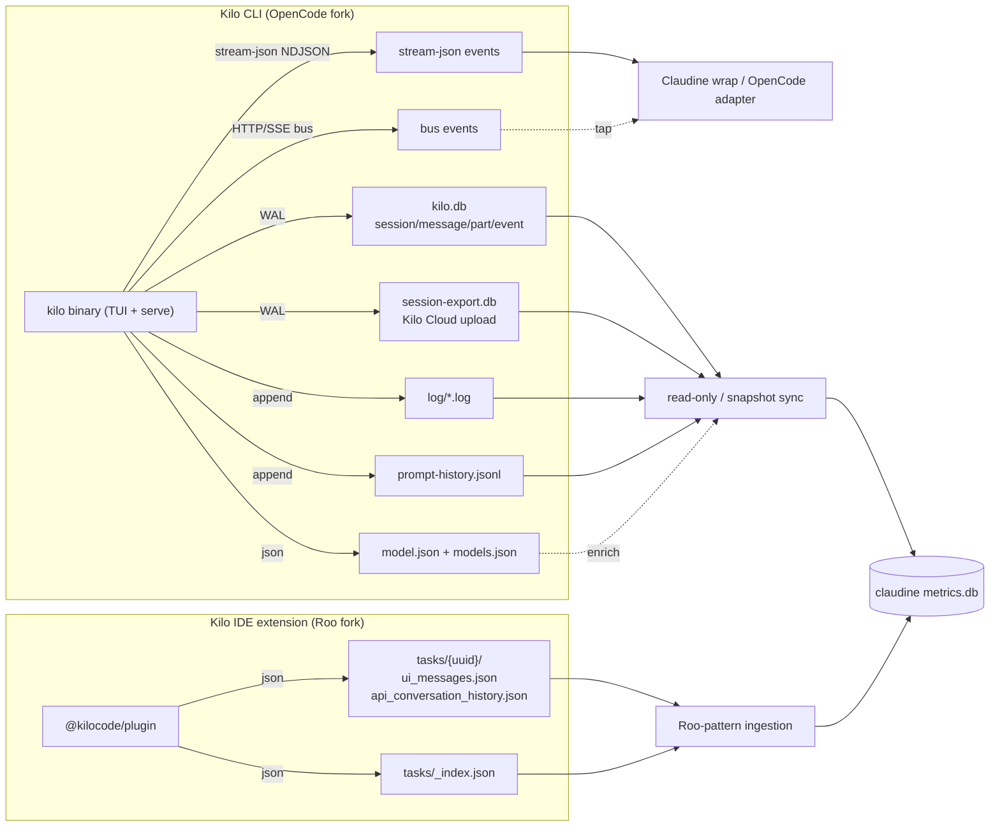

# Kilo Code Logging

## Introduction to Kilo Code Logging

Kilo Code (site <https://kilo.ai>, repo <https://github.com/Kilo-Org/kilocode>, vendor *Kilo Code, Inc.*) is unusual among Claudine's peers because **it ships as two independent products on two different open-source code lineages**, and each writes logs in a totally different place and format. Conflating them is the single biggest mistake a log reader can make, so the split is stated up front:

| Product | Code lineage | Runtime | Observed on this host |
|---|---|---|---|
| **Kilo CLI** (`kilo` binary, marketed at `kilo.ai/cli`) | **Fork of OpenCode** (`sst/opencode`) — Node/TypeScript, Drizzle ORM | Standalone TUI + HTTP server | **Yes** — rich data at `~/.local/share/kilo` |
| **Kilo IDE extensions** (VS Code `kilocode.kilo-code`, JetBrains; npm `@kilocode/plugin` v7.x) | **Fork of Roo Code** (itself a Cline fork) — TypeScript/Zod | Runs inside the IDE | Installed (`kilocode.kilo-code-7.3.40`) but **never activated** — no `globalStorage` dir. Legacy Roo-lineage CLI data present at `~/.kilocode/cli` |

The fork lineage is not marketing spin — it is verifiable in the artifacts on this host:

- The `kilo` binary's config schema at <https://app.kilo.ai/config.json> is literally OpenCode's config schema (`opencode serve`, `opencode.ai/docs/...` references, `mdnsDomain: opencode.local`, agents `build`/`plan`/`explore`/`compaction`) **plus** Kilo extensions (`remote_control`, `agent.{ask,debug,orchestrator}`, `experimental.{codebase_search,agent_requirements,native_notebook_tools}`).
- The CLI's `~/.local/share/kilo/auth.json` carries a top-level **`opencode`** key; the logs read `~/.opencode/opencode.json`; the DB schema (`session`/`message`/`part`/`event`/`session_message` tables, Drizzle `__drizzle_migrations`) is byte-for-byte OpenCode's.
- The VS Code extension's `~/.kilocode/cli/global/global-state.json` carries Roo fields (`currentApiConfigName`, `taskHistory`, `kilo-code.allowedCommands`, auto-approval flags) and its tasks use Roo's `api_conversation_history.json` + `ui_messages.json` layout.

> **Evidence note.** The task brief said the host had read access to `~/.kilo`. That directory **does not exist**. The real evidence lives at the XDG paths (`~/.local/share/kilo`, `~/.local/state/kilo`, `~/.cache/kilo`, `~/.config/kilo`) and at `~/.kilocode/cli` (legacy CLI). Everything below marked *observed* was read directly from those files on 2026-07-01.

### Log Locations and Organization

**Kilo CLI (OpenCode fork)** uses an XDG base-directory layout — notably it hardcodes Unix-style XDG paths **even on macOS** (no `XDG_*` env vars are set; the binary ignores the macOS `~/Library/Application Support` convention):

| Path (macOS, observed) | Format | Purpose |
|---|---|---|
| `~/.local/share/kilo/kilo.db` (+ `-wal`, `-shm`) | SQLite (WAL) | Primary store — sessions, messages, parts, projects, workspaces, todos, permissions, events, accounts |
| `~/.local/share/kilo/session-export.db` (+ `-wal`, `-shm`) | SQLite (WAL) | Session-share / Kilo-Cloud upload queue |
| `~/.local/share/kilo/log/{YYYY-MM-DDTHHMMSS}.log` | text | Per-process diagnostic log |
| `~/.local/state/kilo/prompt-history.jsonl` | JSONL | User prompt history |
| `~/.local/state/kilo/model.json` | JSON | Current / recent / favorite models |
| `~/.local/state/kilo/locks/` | text | Per-process advisory locks |
| `~/.cache/kilo/models.json` | JSON | Cached provider/model catalog (~2.3 MB) |
| `~/.config/kilo/kilo.jsonc` (+ `kilo.json`/`opencode.json`/`config.json`) | JSON/JSONC | User config |
| `~/.local/share/kilo/auth.json` | JSON | Per-provider credentials (keys: `opencode`, `openrouter`) |
| `~/.local/share/kilo/storage/session_diff/ses_{id}.json` | JSON | Per-session diff summaries |
| `~/.local/share/kilo/snapshot/{global,...}/` | git/text | Content-addressed filesystem snapshots for undo/revert |

**Kilo IDE extension (Roo Code fork)** uses the host IDE's globalStorage (the VS Code extension's `globalStorage` dir did not exist on this host; documented from the Roo-fork pattern + the observed legacy CLI):

| Path (macOS) | Format | Purpose |
|---|---|---|
| `~/Library/Application Support/Code/User/globalStorage/kilocode.kilo-code/tasks/{uuid}/api_conversation_history.json` | JSON | Raw LLM API turns |
| `…/tasks/{uuid}/ui_messages.json` | JSON | `ClineMessage[]` (ask/say UI events) |
| `…/tasks/{uuid}/task_metadata.json` | JSON | Files-in-context tracking |
| `…/tasks/{uuid}/checkpoints/` | git | Roo checkpoint repo |
| `…/tasks/_index.json` | JSON | `{version, updatedAt, entries:[HistoryItem]}` |
| `~/.kilocode/cli/logs/cli.txt` *(legacy `@kilocode/cli` only)* | text | Diagnostic log of the retired Roo-lineage CLI |
| `~/.kilocode/cli/history.json` *(legacy)* | JSON | `{version, entries:[{prompt, timestamp}], maxSize:500}` |

### Organization, Splitting, and Archival

- **CLI transcripts are SQL rows, not files.** A single global `kilo.db` holds every project's sessions (sharded by `project_id`, not by date and not per-session files). Each session is a row in `session`; each turn is a row in `message`; each content block is a row in `part` referencing its `message_id`/`session_id`. Subagents are simply child sessions (`session.parent_id` set) in the same DB — there is **no separate subagent-transcript file**.
- **Archival is a flag, not a move.** `session.time_archived` (unix ms) marks a session archived in place; nothing is relocated or rotated. `time_compacting` records context-compaction events. There is no automatic log rotation or compaction of the `log/*.log` files either — they accumulate per process invocation indefinitely.
- **Schema evolution is migration-based.** `kilo.db` carries a Drizzle `__drizzle_migrations` table plus a Kilo `data_migration` table; `~/.local/share/kilo/storage/migration` holds an integer storage-schema version (observed `2`). The export DB additionally stamps each queued event with an explicit `schema_version` INTEGER column.
- **No JSONL transcripts.** Unlike Claude/Codex/OpenCode's per-session JSONL files, the only JSONL the Kilo CLI writes is the lightweight `prompt-history.jsonl` (and even that lacks a timestamp).

### Storage Formats

The Kilo CLI is a **SQLite-first** system. `kilo.db` (observed 176 KB) is the system of record; the structured conversation content lives as JSON serialized into TEXT columns (`message.data`, `part.data`). Plain text is used only for the human-facing `log/*.log`. The export DB (`session-export.db`, observed 4 KB) is a separate queue for uploading sessions to Kilo Cloud. By contrast, the IDE extension (Roo fork) is **file-first**: flat JSON files per task, no database.

### Database Usage

**Yes — SQLite, extensively, but only for the CLI.** Two WAL-mode databases:

- `kilo.db` — 13 tables (`session`, `message`, `part`, `session_message`, `event`, `event_sequence`, `todo`, `project`, `workspace`, `permission`, `account`, `control_account`, `account_state`) plus `__drizzle_migrations` and `data_migration`. Both `-wal` and `-shm` sidecars are present → the DB is **live-locked** while the CLI runs and must never be copied or symlinked from under a running process (shadow-home hazard).
- `session-export.db` — 3 tables (`event`, `chunk`, `session_export_sequence`), also WAL. This is the outbound share/upload pipeline, gated by the `share` config.

The IDE extension uses **no database** — it inherits Roo Code's flat-JSON storage.

### Major Log Message Types

The Kilo CLI distinguishes messages along three axes, all observed in the real DB and logs:

1. **Conversation roles** (`message.data.role`) — `user`, `assistant` (OpenCode also defines `system`/`tool` roles, not observed in this tiny dataset).
2. **Content-block / part types** (`part.data.type`) — observed: `text`, `reasoning`, `step-start`. (OpenCode source additionally defines `tool`, `file`, `image`, `error` part types; the host's only successful turn was a "hi" greeting, so they did not appear here.)
3. **Diagnostic log facets** — each app-log line carries a `<LEVEL>` (`INFO`/`ERROR` observed; `DEBUG`/`WARN` defined), a `service=` tag (20 distinct services observed, e.g. `server`, `bus`, `db`, `provider`, `plugin`, `config`, `file.watcher`, `model-cache`, `tui.plugin`, `server-proxy`, `vcs`, `lsp`, `review`), and — for the internal event bus — a `type=` event name (17 distinct observed, e.g. `session.created`, `session.turn.open`/`close`, `message.part.updated`, `permission.asked`/`replied`, `question.asked`/`replied`/`rejected`, `command.executed`).

The IDE extension instead uses Roo's two-category model — `ask` messages (require interaction: `command`, `tool`, `completion_result`, `resume_task`, …) and `say` messages (informational: `text`, `reasoning`, `api_req_started`, `checkpoint_saved`, `error`, …). See the Rust schema below and the sibling `roo-code.md` for the full vocabulary.

---

## Logging Schema

### No Formal Log Schema — Informal (Source-Code + Config) Schema

Kilo publishes **no formal schema artifact** (no JSON Schema / OpenAPI / protobuf) for its *log or transcript* output. What exists is **informal**:

- **Data model (CLI):** defined by OpenCode's Go/TypeScript source and its Drizzle ORM schema (`sst/opencode`). The `kilo.db` DDL is OpenCode's verbatim. Reverse-engineered below from the real database on this host.
- **Config model (CLI):** there *is* a formal JSON Schema — <https://app.kilo.ai/config.json> (JSON Schema draft 2020-12). It governs config (and thus `LogLevel`, `server`, agents, providers, MCP, permissions), **not** the transcript rows. It is the closest thing Kilo has to a published machine-readable schema, hence `schema_url`.
- **IDE extension:** inherits Roo Code's Zod schemas in `@roo-code/types` / `@kilocode/types` (`ClineMessage`, `ClineAsk`, `ClineSay`, `HistoryItem`). See `roo-code.md`.

No authoritative community schema for Kilo logs exists beyond the OpenCode/Roo upstreams and Claudine's own stream parsers.

### Rust Schema — Kilo CLI (OpenCode fork, `kilo.db`)

```rust
use serde::{Deserialize, Serialize};
use serde_json::Value;
use chrono::{DateTime, Utc};

/// One row of the `session` table (the session index).
/// IDs are ULIDs with a `ses_` prefix (e.g. `ses_273e3588dffefCDh7Mb6fA972k`).
#[derive(Debug, Clone, Serialize, Deserialize)]
pub struct KiloSession {
    pub id: String,
    pub project_id: String,
    pub parent_id: Option<String>,        // Some => this is a subagent (child) session
    pub slug: String,                     // e.g. "witty-garden"
    pub directory: String,
    pub title: String,                    // e.g. "New session - 2026-04-14T13:09:41.363Z"
    pub version: String,                  // CLI version that created it, e.g. "7.2.0"
    pub share_url: Option<String>,
    pub summary_additions: Option<i64>,
    pub summary_deletions: Option<i64>,
    pub summary_files: Option<i64>,
    pub summary_diffs: Option<String>,    // serialized diff summary
    pub revert: Option<Value>,
    pub permission: Option<Value>,
    pub time_created: i64,                // unix epoch MILLIS, UTC
    pub time_updated: i64,
    pub time_compacting: Option<i64>,
    pub time_archived: Option<i64>,       // Some => archived
    pub workspace_id: Option<String>,
    pub path: Option<String>,
    pub agent: Option<String>,            // e.g. "code"
    pub model: Option<String>,
    pub cost: f64,
    pub tokens_input: i64,
    pub tokens_output: i64,
    pub tokens_reasoning: i64,
    pub tokens_cache_read: i64,
    pub tokens_cache_write: i64,
}

/// `message` table envelope. `data` holds the JSON below.
#[derive(Debug, Clone, Serialize, Deserialize)]
pub struct KiloMessageRow {
    pub id: String,                       // msg_<ULID>
    pub session_id: String,
    pub time_created: i64,
    pub time_updated: i64,
    pub data: KiloMessageData,
}

/// JSON payload of `message.data`.
#[derive(Debug, Clone, Serialize, Deserialize)]
pub struct KiloMessageData {
    pub role: KiloRole,
    pub time: KiloMessageTime,
    #[serde(default)]
    pub agent: Option<String>,
    #[serde(default)]
    pub model: Option<KiloModelRef>,
    #[serde(default)]
    pub summary: Option<Value>,
    /// Assistant-only fields:
    #[serde(default)]
    pub parent_id: Option<String>,
    #[serde(default, rename = "parentID")]
    pub parent_id_alt: Option<String>,
    #[serde(default)]
    pub model_id: Option<String>,
    #[serde(default)]
    pub provider_id: Option<String>,
    #[serde(default)]
    pub mode: Option<String>,
    #[serde(default)]
    pub path: Option<KiloPath>,
    #[serde(default)]
    pub cost: Option<f64>,
    #[serde(default)]
    pub tokens: Option<KiloTokens>,
    #[serde(default)]
    pub error: Option<KiloError>,
}

#[derive(Debug, Clone, Serialize, Deserialize)]
#[serde(rename_all = "lowercase")]
pub enum KiloRole {
    User,
    Assistant,
    // OpenCode source also defines: System, Tool
}

#[derive(Debug, Clone, Serialize, Deserialize)]
pub struct KiloMessageTime {
    pub created: i64,                     // unix ms, UTC
    #[serde(default)]
    pub completed: Option<i64>,
}

#[derive(Debug, Clone, Serialize, Deserialize)]
pub struct KiloModelRef {
    #[serde(rename = "providerID")]
    pub provider_id: String,
    #[serde(rename = "modelID")]
    pub model_id: String,
}

#[derive(Debug, Clone, Serialize, Deserialize)]
pub struct KiloPath {
    pub cwd: String,
    pub root: String,
}

#[derive(Debug, Clone, Serialize, Deserialize)]
pub struct KiloTokens {
    pub input: i64,
    pub output: i64,
    pub reasoning: i64,
    pub cache: KiloTokenCache,
}

#[derive(Debug, Clone, Serialize, Deserialize)]
pub struct KiloTokenCache {
    pub read: i64,
    pub write: i64,
}

#[derive(Debug, Clone, Serialize, Deserialize)]
pub struct KiloError {
    pub name: String,                     // e.g. "APIError"
    pub data: Value,                      // statusCode, message, responseHeaders, responseBody, ...
}

/// `part` table envelope. `data` holds the JSON below.
#[derive(Debug, Clone, Serialize, Deserialize)]
pub struct KiloPartRow {
    pub id: String,
    pub message_id: String,
    pub session_id: String,
    pub time_created: i64,
    pub time_updated: i64,
    pub data: KiloPartData,
}

/// Tagged union on `type`. Observed variants below; OpenCode source also
/// defines Tool / File / Image / Error part types (not present in this dataset).
#[derive(Debug, Clone, Serialize, Deserialize)]
#[serde(tag = "type", rename_all = "kebab-case")]
pub enum KiloPartData {
    Text {
        text: String,
        #[serde(default)]
        time: Option<KiloPartTime>,
    },
    Reasoning {
        text: String,
        #[serde(default)]
        metadata: Option<Value>,          // e.g. {"anthropic":{"signature":"..."}}
        #[serde(default)]
        time: Option<KiloPartTime>,
    },
    #[serde(rename = "step-start")]
    StepStart {
        snapshot: String,                 // git tree-ish hash
    },
    // Tool { .. }, File { .. }, Image { .. }, Error { .. } — defined upstream, not observed
}

#[derive(Debug, Clone, Serialize, Deserialize)]
pub struct KiloPartTime {
    pub start: i64,                       // unix ms, UTC
    pub end: i64,
}

/// `~/.local/state/kilo/prompt-history.jsonl` — one object per line.
/// NOTE: no timestamp, no session_id.
#[derive(Debug, Clone, Serialize, Deserialize)]
pub struct KiloPromptHistoryEntry {
    pub input: String,
    #[serde(default)]
    pub parts: Vec<Value>,
    pub mode: String,                     // observed: "normal"
}

/// One line of `~/.local/share/kilo/log/{ts}.log`.
/// Example: `INFO  2026-06-13T15:16:01 +47ms service=file init`
#[derive(Debug, Clone)]
pub struct KiloLogLine<'a> {
    pub level: KiloLogLevel,
    pub ts: DateTime<Utc>,
    pub elapsed_ms: i64,
    pub service: &'a str,
    pub fields: Vec<(&'a str, &'a str)>,  // key=value tokens
    pub message: &'a str,
}

#[derive(Debug, Clone, Copy)]
pub enum KiloLogLevel {
    Debug,
    Info,
    Warn,
    Error,
}

/// `session-export.db` `event` table — queued for upload to Kilo Cloud.
#[derive(Debug, Clone, Serialize, Deserialize)]
pub struct KiloExportEvent {
    pub id: String,
    pub schema_version: i64,              // explicit per-row version
    pub session_id: String,
    pub root_session_id: String,
    pub parent_session_id: Option<String>,
    pub seq: i64,
    pub request_id: Option<String>,
    #[serde(rename = "type")]
    pub kind: String,
    pub ts: i64,                          // unix ms, UTC (inferred)
    pub agent_version: String,
    pub data_json: String,
    pub client_scrubbed: bool,
    pub uploaded_at: Option<i64>,
    pub upload_attempts: i64,
    pub next_attempt_at: Option<i64>,
}
```

### Rust Schema — Kilo IDE extension (Roo fork)

The VS Code/JetBrains extension reuses Roo Code's `ClineMessage` schema verbatim (the `ui_messages.json` array). Rather than duplicate it, see the `HistoryItem`, `ClineMessage`, `ClineAsk`, `ClineSay`, and `RooCliStreamEvent` structs in the sibling document [`roo-code.md`](./roo-code.md). Observed `say` sub-types on this host: `api_req_started`, `reasoning`, `checkpoint_saved`, `user_feedback`, `api_req_retry_delayed`, `error`, `text`, `completion_result`, `command_output`. Observed `ask` sub-types: `resume_task`, `completion_result`, `tool`, `command`, `command_output`.

---

## Informational Content versus Hook Events

Claudine's current logging for its eight providers leans on **hook events** (provider lifecycle hooks) plus the wrapper's **stream parser**, rather than the provider's on-disk log files. This section analyzes when Kilo's files beat events, and vice-versa.

### A Clarification: Kilo CLI Has No "Hook" Surface Like Claude's

The Kilo CLI (OpenCode fork) does **not** expose Claude-style lifecycle hooks (`PreToolUse`, `PostToolUse`, `UserPromptSubmit`, `Stop`, …). Its extensibility points are different:

- An **internal event bus** (`service=bus`) publishing typed events (`session.created`, `message.part.updated`, `permission.asked`, `command.executed`, …) consumed in-process by the TUI and the HTTP server.
- An **HTTP server** (`opencode serve` / `kilo serve`) exposing REST/SSE endpoints (`/session`, `/config/providers`, `/agent`, `/experimental/console`, …) that stream those same events to external clients.
- A **plugin** system (`service=plugin`, `internal plugin`) and an MCP catalog.
- The **OpenCode-style `--output-format stream-json`** NDJSON protocol for non-interactive/CI consumption (the closest equivalent to Claude's stream-json, and the surface Claudine's OpenCode adapter already consumes).

So for the Kilo CLI, "hook events" really means **the stream-json event stream and/or the HTTP/SSE bus**, not file-system hooks.

### When File-System Logs Are the Better Source

| Scenario | Why Kilo's Files Win |
|---|---|
| **Historical / forensic replay** | `kilo.db` is the durable system of record; the bus/stream only exists while a session runs. Past sessions are invisible to live events. |
| **Token & cost aggregation** | `session.cost` / `session.tokens_*` (and `message.data.cost`/`tokens`) are persisted per row; the stream emits cost incrementally and the bus does not persist it. |
| **Subagent tree reconstruction** | `session.parent_id` + `root_session_id` give the full parent/child tree in one query; the stream sees subagents as nested events without durable linkage. |
| **Diff / change audit** | `storage/session_diff/ses_*.json` + `session.summary_*` + the `snapshot/` store give before/after file state; no event carries this. |
| **Kilo Cloud share audit** | `session-export.db` shows exactly what was queued, scrubbed (`client_scrubbed`), and uploaded (`uploaded_at`/`upload_attempts`) — the stream never reveals the upload pipeline. |
| **Auth / account state** | `auth.json` and the `account`/`control_account` tables hold provider + Kilo Cloud credentials and active-org state; useful for correlating whose key a session used. |
| **IDE extension forensics** | The VS Code extension writes the full `ClineMessage` stream (incl. `checkpoint_saved`, `api_req_retry_delayed`, `condense_context`) to `ui_messages.json` — richer than any CLI stream. |

### When Event Logs (Stream / Bus) Are the Better Source

| Scenario | Why Stream / Bus Events Win |
|---|---|
| **Real-time interception & policy** | `permission.asked` is a decision point — a stream/HTTP consumer can reply (`permission.replied`) to allow/deny **before** the action. The DB only records the outcome. |
| **Live progress / deltas** | `message.part.updated` and `session.turn.open/close` give sub-second turn progress; reconstructing this from the DB requires polling. |
| **Structured streaming for CI** | `kilo run --output-format stream-json` (OpenCode protocol) is purpose-built for machine consumption in pipelines — exactly what Claudine wraps. |
| **Low-latency live metrics** | The HTTP/SSE bus and the statusline feed give live model/cost/context with no DB read. |
| **Non-blocking delivery** | Events are pushed; file ingestion requires file-watching and new-line detection. |

### Other Sources for Data Enrichment

| Source | What It Provides | Strategy |
|---|---|---|
| `~/.local/state/kilo/model.json` | Current + recent + favorite models per agent | Correlate which model a historical session used vs. the user's current default. |
| `~/.local/state/kilo/prompt-history.jsonl` | Every user prompt (mode-tagged) across sessions | Build a cross-session prompt timeline (note: no session_id / timestamp — join loosely). |
| `~/.cache/kilo/models.json` | Full provider/model catalog with cost/limits | Resolve `providerID`/`modelID` to human names and pricing for cost analytics. |
| `~/.config/kilo/kilo.jsonc` | Agents, permissions, providers, MCP, `share` policy | Explain auto-approval behavior and whether sessions were uploaded. |
| `session-export.db` `chunk` table | Content-addressed dedup of uploaded blobs | Detect what session content left the machine. |
| HTTP bus (`kilo serve`) + statusline | Live session/model/cost/context feed | Low-latency dashboards; tap without touching the live-locked SQLite. |
| IDE extension `api_conversation_history.json` | Full environment context injected into the model (open tabs, workspace listing, mode) | Richer than `ui_messages.json` for understanding what the model actually saw. |

### Recommended Hybrid Strategy

For the **Kilo CLI**, Claudine should treat it like OpenCode (it *is* an OpenCode fork): wrap the **stream-json protocol for real-time action, policy, and per-turn cost**, and ingest **`kilo.db` for historical replay, token/cost aggregation, subagent trees, and diff/share auditing**. The single biggest caveat is operational: `kilo.db` and `session-export.db` run in **WAL mode** and are live-locked while the CLI runs — a Claudine sync must open them read-only or snapshot them, never copy the `-wal`/`-shm` out from under a running process. For the **IDE extension**, treat it like Roo Code (it *is* a Roo fork): flat-JSON files under VS Code globalStorage, `ClineMessage` schema, no DB.



---

## Sources

- [Kilo Code — homepage](https://kilo.ai)
- [Kilo Code CLI](https://kilo.ai/cli)
- [Kilo Code GitHub repository (`Kilo-Org/kilocode`)](https://github.com/Kilo-Org/kilocode)
- [Kilo config JSON Schema (`app.kilo.ai/config.json`)](https://app.kilo.ai/config.json) — formal JSON Schema (draft 2020-12); OpenCode config schema + Kilo extensions; defines `LogLevel` enum.
- [OpenCode — upstream of the Kilo CLI (`sst/opencode`)](https://github.com/sst/opencode) — authoritative source for the `kilo.db` Drizzle schema, message/part JSON shapes, and the stream-json protocol.
- [OpenCode documentation](https://opencode.ai/docs) — agents (`build`/`plan`/`explore`/`compaction`), permissions, commands, server/streaming.
- [Kilo Code docs](https://kilo.ai/docs)
- [Kilo Code changelog (releases)](https://github.com/Kilo-Org/kilocode/releases)
- [Kilo Code blog](https://blog.kilo.ai)
- [Roo Code — upstream of the Kilo IDE extension](https://github.com/RooCodeInc/Roo-Code) — authoritative source for the VS Code/JetBrains extension's `ClineMessage` / `HistoryItem` schemas.
- [`roo-code.md` (sibling research, this directory)](./roo-code.md) — full `ClineMessage` / `ClineAsk` / `ClineSay` / `RooCliStreamEvent` Rust schema reused by the Kilo IDE extension.
- Host evidence (observed 2026-07-01): `~/.local/share/kilo/kilo.db` (+ `-wal`/`-shm`), `~/.local/share/kilo/session-export.db`, `~/.local/share/kilo/log/*.log`, `~/.local/state/kilo/{prompt-history.jsonl,model.json}`, `~/.cache/kilo/models.json`, `~/.config/kilo/kilo.jsonc`, `~/.local/share/kilo/auth.json`, `~/.kilocode/cli/{logs/cli.txt,history.json,global/global-state.json,global/tasks/*/ui_messages.json}`, and the installed extension `~/.vscode/extensions/kilocode.kilo-code-7.3.40-darwin-arm64`. `~/.kilo` (the path named in the task brief) does **not** exist on this host.

## Changelog

- **2026-07-01** — Initial research for `kilo.md`. Established the **two-lineage split**: the Kilo CLI (`kilo.ai/cli`) is an **OpenCode fork** (Node binary, XDG layout, `kilo.db` SQLite with Drizzle + WAL, `app.kilo.ai/config.json` schema is OpenCode's config + Kilo extensions), while the Kilo VS Code/JetBrains extension is a **Roo Code fork** (flat-JSON task files, `ClineMessage` schema). Corrected the task brief's claim of `~/.kilo` read access — that path does not exist; real evidence lives at `~/.local/share/kilo`, `~/.local/state/kilo`, `~/.cache/kilo`, `~/.config/kilo`, and `~/.kilocode/cli`. Observed surfaces: `kilo.db` (13 tables; transcript = `message`/`part` rows with JSON `data`), `session-export.db` (Kilo Cloud upload queue, explicit `schema_version`), per-process `log/{YYYY-MM-DDTHHMMSS}.log` (UTC), `prompt-history.jsonl` (no timestamp/session_id), `model.json`, `auth.json` (keys `opencode`/`openrouter`). Enumerated 20 `service=` tags and 17 bus `type=` event names from the logs. All SQL time columns are unix-millis UTC; log filename/line timestamps are UTC (verified against local mtime). Classified schema as `informal` (OpenCode source + `app.kilo.ai/config.json`). Set `requires_claudine_update: true` (Kilo is a new provider; CLI reuses the OpenCode adapter template, extension reuses the Roo pattern).
