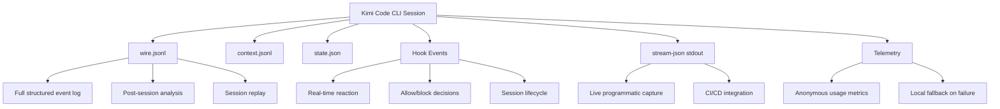

# Kimi Code CLI Logging Research

## Introduction to Kimi Code CLI Logging

Kimi Code CLI maintains a multi-layered data persistence model with four distinct logging surfaces. None of these surfaces are "logging" in the traditional structured sense; rather, they are different representations of session state, runtime diagnostics, and telemetry.

### Log Locations

All data lives under the **share directory** (`~/.kimi/` by default, overridden by `KIMI_SHARE_DIR`).

| Path | Format | Purpose |
|------|--------|---------|
| `~/.kimi/logs/kimi.log` | Loguru text | Application debug log (created when `--debug` is passed) |
| `~/.kimi/logs/kimi.<timestamp>_<pid>.log` | Loguru text | Rotated debug logs from previous runs |
| `~/.kimi/sessions/<md5-hash>/<session-id>/wire.jsonl` | JSONL (Wire protocol) | Complete structured event log per session |
| `~/.kimi/sessions/<md5-hash>/<session-id>/context.jsonl` | JSONL (kosong messages) | Conversation context history |
| `~/.kimi/sessions/<md5-hash>/<session-id>/state.json` | JSON | Session state (approval mode, plan mode, todos, archive) |
| `~/.kimi/sessions/<md5-hash>/<session-id>/subagents/` | Directory tree | Subagent instance data |
| `~/.kimi/telemetry/failed_<hash>.jsonl` | JSONL | Telemetry events that failed to send to the remote endpoint |
| `~/.kimi/kimi.json` | JSON | Work directory metadata (path-to-session mappings) |
| `~/.kimi/user-history/<hash>.jsonl` | JSONL | Input history per working directory |

#### Session Directory Organization

Sessions are organized by work directory. Each work directory's path is MD5-hashed to produce a directory name under `~/.kimi/sessions/`. Within each hash directory, sessions are stored as subdirectories named by UUID.

```
~/.kimi/sessions/
├── 37683e4898bdcf8ab1831a461b79c99f/     # MD5 of work dir path
│   ├── 0220108c-73d4-4802-ad21-fa27568f3e4b/
│   │   ├── context.jsonl
│   │   ├── state.json
│   │   └── wire.jsonl
│   └── cd75aff9-e452-4892-9266-ed066646f91b/
│       ├── context.jsonl
│       ├── state.json
│       └── wire.jsonl
└── 7fe82e8153faed46af2bf86655b41484/
    └── ...
```

#### Log Rotation and Archival

Debug logs (`~/.kimi/logs/`) follow a naming pattern `kimi.<YYYY-MM-DD_HH-MM-SS>_<pid>.log` for archived logs, with the current run writing to `kimi.log`. There is no automatic rotation or cleanup — old log files accumulate until manually deleted. Sessions can be archived via the Web UI or the `state.json` `archived`/`archived_at` fields, but the session files remain on disk.

### Log File Formats

#### Debug Logs (`kimi.log`)

The debug log uses **Loguru** format — plain text with structured fields:

```
2026-04-29 12:01:37.749 | INFO | kimi_cli.cli:_run:571 | - Created new session: a9382954-0d63-4ee2-9b5b-b410a0211b24
2026-04-29 12:01:39.422 | ERROR | kimi_cli.auth.platforms:refresh_managed_models:159 | - Failed to refresh models for kimi-code: 401
```

Fields: `<timestamp> | <LEVEL> | <module>:<function>:<line> | - <message>`

This log is only written when `--debug` is passed on the command line. It is primarily a developer diagnostic tool, not an operational log.

#### Wire Event Log (`wire.jsonl`)

The primary structured log. Each line is a JSON object following the **Wire protocol v1.9** envelope format:

```json
{"type": "metadata", "protocol_version": "1.9"}
{"timestamp": 1777494014.781, "message": {"type": "TurnBegin", "payload": {"user_input": "Fix the bug"}}}
{"timestamp": 1777494014.782, "message": {"type": "StepBegin", "payload": {"n": 1}}}
{"timestamp": 1777494019.836, "message": {"type": "ContentPart", "payload": {"type": "text", "text": "Here is the fix..."}}}
```

The first line is always a metadata header with the protocol version. Subsequent lines are `WireMessageRecord` objects containing a Unix timestamp and a `WireMessageEnvelope` with `type` and `payload`.

#### Context Log (`context.jsonl`)

The conversation history in kosong message format:

```json
{"role":"user","content":"Fix the bug in main.rs"}
{"role":"assistant","content":[{"type":"text","text":"I'll analyze the issue..."}]}
{"role":"_usage","token_count":22414}
{"role":"_checkpoint","id":0}
```

Special roles (`_usage`, `_checkpoint`) track internal state. This is the context window content sent to the LLM provider.

#### Telemetry Events (`telemetry/failed_*.jsonl`)

When the remote telemetry endpoint is unreachable, events are persisted locally:

```json
{
  "event_id": "c97bab68bde4...",
  "device_id": "9acb1fdcfc...",
  "session_id": "cd75aff9-e452...",
  "event": "tool_call",
  "timestamp": 1777511573.964,
  "properties": {"tool_name": "ReadFile", "success": true, "duration_ms": 12},
  "context": {"version": "1.40.0", "platform": "darwin", "ui_mode": "wire", "model": "kimi-for-coding"}
}
```

### SQLite Database Usage

Kimi Code CLI does **not** use SQLite or any other database. All persistence is file-based: JSONL files for sequential data, JSON files for structured state, and plain text for debug logs. The `kimi.json` metadata file acts as a lightweight index mapping work directories to their session storage locations.

### Major Log Message Types

Kimi Code CLI distinguishes between these categories of logged data:

#### Debug Log Levels (via Loguru)

| Level | Usage |
|-------|-------|
| `DEBUG` | Internal tracing (session creation, config loading, tool dispatch) |
| `INFO` | Lifecycle events (session created, config loaded, model selected, tools loaded) |
| `WARNING` | Non-fatal issues (hook timeouts, migration warnings, context file issues) |
| `ERROR` | Failures (API auth errors, model refresh failures) |

#### Wire Event Types

The wire.jsonl records 20+ distinct event types organized into several categories:

**Turn lifecycle**: `TurnBegin`, `SteerInput`, `TurnEnd`, `StepBegin`, `StepInterrupted`

**Content**: `ContentPart` (subtypes: `text`, `think`, `image_url`, `audio_url`, `video_url`)

**Tool execution**: `ToolCall`, `ToolCallPart`, `ToolResult`

**Approvals**: `ApprovalRequest`, `ApprovalResponse`

**Hooks**: `HookTriggered`, `HookResolved`

**Compaction**: `CompactionBegin`, `CompactionEnd`

**Status**: `StatusUpdate` (token usage, context utilization)

**MCP**: `MCPLoadingBegin`, `MCPLoadingEnd`, `MCPStatusSnapshot`

**Subagents**: `SubagentEvent` (recursive — can nest further Wire events)

**Misc**: `Notification`, `PlanDisplay`, `BtwBegin`, `BtwEnd`

#### Hook Event Types (Config-based Shell Hooks)

Kimi Code CLI also supports a **config-based hook system** defined in `config.toml` with 13 event types:

`PreToolUse`, `PostToolUse`, `PostToolUseFailure`, `UserPromptSubmit`, `Stop`, `StopFailure`, `SessionStart`, `SessionEnd`, `SubagentStart`, `SubagentStop`, `PreCompact`, `PostCompact`, `Notification`

These hooks execute shell commands that receive JSON payloads on stdin and can return exit code 2 to block the action (or output JSON with `hookSpecificOutput.permissionDecision: "deny"`).

#### Telemetry Event Names

Observed telemetry event types include: `session_started`, `tool_call`, `tool_approved`, `hook_triggered`.

## Logging Schema

### No Official Schema

Kimi Code CLI does **not** publish an official, versioned schema document for its log output. There is no JSON Schema, TypeScript definition, or protocol specification file in the repository that formally defines the structure of log entries.

The closest equivalents are:

1. **Wire protocol types** — defined as Pydantic models in [`src/kimi_cli/wire/types.py`](https://github.com/MoonshotAI/kimi-cli/blob/main/src/kimi_cli/wire/types.py). These are the authoritative source for wire.jsonl record shapes.
2. **Wire file metadata** — defined in [`src/kimi_cli/wire/file.py`](https://github.com/MoonshotAI/kimi-cli/blob/main/src/kimi_cli/wire/file.py) as `WireFileMetadata` and `WireMessageRecord`.
3. **Hook event payloads** — defined as builder functions in [`src/kimi_cli/hooks/events.py`](https://github.com/MoonshotAI/kimi-cli/blob/main/src/kimi_cli/hooks/events.py).
4. **Wire protocol documentation** — the [Wire mode docs](https://moonshotai.github.io/kimi-cli/en/customization/wire-mode.html) describe the JSON-RPC protocol in narrative form but do not provide a machine-readable schema.

No community projects were found that provide an independent schema for Kimi Code CLI logs. The [kimi-agent-sdk](https://github.com/MoonshotAI/kimi-agent-sdk) wraps the Wire protocol for Go, Node.js, and Python but does not export a standalone schema.

### Representative Rust Schema

Based on analysis of the Pydantic source types in `wire/types.py` and `wire/file.py`, along with observed log data on the host machine, here is a representative Rust schema for the wire.jsonl format:

```rust
use serde::{Deserialize, Serialize};
use std::collections::HashMap;

#[derive(Debug, Clone, Serialize, Deserialize)]
#[serde(tag = "type")]
pub enum WireFileLine {
    #[serde(rename = "metadata")]
    Metadata(WireFileMetadata),
}

#[derive(Debug, Clone, Serialize, Deserialize)]
pub struct WireFileMetadata {
    #[serde(rename = "type")]
    pub type_field: String,
    pub protocol_version: String,
}

#[derive(Debug, Clone, Serialize, Deserialize)]
pub struct WireMessageRecord {
    pub timestamp: f64,
    pub message: WireMessageEnvelope,
}

#[derive(Debug, Clone, Serialize, Deserialize)]
pub struct WireMessageEnvelope {
    #[serde(rename = "type")]
    pub type_field: String,
    pub payload: serde_json::Value,
}

#[derive(Debug, Clone, Serialize, Deserialize)]
#[serde(tag = "type")]
pub enum WireEvent {
    #[serde(rename = "TurnBegin")]
    TurnBegin { user_input: serde_json::Value },
    #[serde(rename = "SteerInput")]
    SteerInput { user_input: serde_json::Value },
    #[serde(rename = "TurnEnd")]
    TurnEnd {},
    #[serde(rename = "StepBegin")]
    StepBegin { n: u32 },
    #[serde(rename = "StepInterrupted")]
    StepInterrupted {},
    #[serde(rename = "HookTriggered")]
    HookTriggered {
        event: String,
        #[serde(default)]
        target: String,
        #[serde(default)]
        hook_count: u32,
    },
    #[serde(rename = "HookResolved")]
    HookResolved {
        event: String,
        #[serde(default)]
        target: String,
        #[serde(default = "default_action")]
        action: String,
        #[serde(default)]
        reason: String,
        #[serde(default)]
        duration_ms: u64,
    },
    #[serde(rename = "CompactionBegin")]
    CompactionBegin {},
    #[serde(rename = "CompactionEnd")]
    CompactionEnd {},
    #[serde(rename = "MCPLoadingBegin")]
    McpLoadingBegin {},
    #[serde(rename = "MCPLoadingEnd")]
    McpLoadingEnd {},
    #[serde(rename = "StatusUpdate")]
    StatusUpdate {
        #[serde(default)]
        context_usage: Option<f64>,
        #[serde(default)]
        context_tokens: Option<u64>,
        #[serde(default)]
        max_context_tokens: Option<u64>,
        #[serde(default)]
        token_usage: Option<TokenUsage>,
        #[serde(default)]
        message_id: Option<String>,
        #[serde(default)]
        plan_mode: Option<bool>,
    },
    #[serde(rename = "Notification")]
    Notification(NotificationPayload),
    #[serde(rename = "ContentPart")]
    ContentPart(serde_json::Value),
    #[serde(rename = "ToolCall")]
    ToolCall(serde_json::Value),
    #[serde(rename = "ToolCallPart")]
    ToolCallPart { arguments_part: Option<String> },
    #[serde(rename = "ToolResult")]
    ToolResult(serde_json::Value),
    #[serde(rename = "ApprovalResponse")]
    ApprovalResponse {
        request_id: String,
        #[serde(default = "default_approve")]
        response: String,
        #[serde(default)]
        feedback: String,
    },
    #[serde(rename = "SubagentEvent")]
    SubagentEvent {
        #[serde(default)]
        parent_tool_call_id: Option<String>,
        #[serde(default)]
        agent_id: Option<String>,
        #[serde(default)]
        subagent_type: Option<String>,
        event: Box<WireEvent>,
    },
    #[serde(rename = "PlanDisplay")]
    PlanDisplay {
        content: String,
        file_path: String,
    },
    #[serde(rename = "BtwBegin")]
    BtwBegin {
        id: String,
        question: String,
    },
    #[serde(rename = "BtwEnd")]
    BtwEnd {
        id: String,
        #[serde(default)]
        response: Option<String>,
        #[serde(default)]
        error: Option<String>,
    },
}

fn default_action() -> String {
    "allow".to_string()
}
fn default_approve() -> String {
    "approve".to_string()
}

#[derive(Debug, Clone, Serialize, Deserialize)]
pub struct TokenUsage {
    #[serde(default)]
    pub input_other: u64,
    #[serde(default)]
    pub output: u64,
    #[serde(default)]
    pub input_cache_read: u64,
    #[serde(default)]
    pub input_cache_creation: u64,
}

#[derive(Debug, Clone, Serialize, Deserialize)]
pub struct NotificationPayload {
    pub id: String,
    pub category: String,
    #[serde(rename = "type")]
    pub notification_type: String,
    pub source_kind: String,
    pub source_id: String,
    pub title: String,
    pub body: String,
    pub severity: String,
    pub created_at: f64,
    #[serde(default)]
    pub payload: HashMap<String, serde_json::Value>,
}
```

For the **hook event payloads** (received by shell hooks on stdin), the schema is:

```rust
#[derive(Debug, Clone, Serialize, Deserialize)]
#[serde(tag = "hook_event_name")]
pub enum HookEventPayload {
    #[serde(rename = "PreToolUse")]
    PreToolUse {
        session_id: String,
        cwd: String,
        tool_name: String,
        tool_input: serde_json::Value,
        #[serde(default)]
        tool_call_id: String,
    },
    #[serde(rename = "PostToolUse")]
    PostToolUse {
        session_id: String,
        cwd: String,
        tool_name: String,
        tool_input: serde_json::Value,
        #[serde(default)]
        tool_output: String,
        #[serde(default)]
        tool_call_id: String,
    },
    #[serde(rename = "PostToolUseFailure")]
    PostToolUseFailure {
        session_id: String,
        cwd: String,
        tool_name: String,
        tool_input: serde_json::Value,
        error: String,
        #[serde(default)]
        tool_call_id: String,
    },
    #[serde(rename = "UserPromptSubmit")]
    UserPromptSubmit {
        session_id: String,
        cwd: String,
        prompt: String,
    },
    #[serde(rename = "Stop")]
    Stop {
        session_id: String,
        cwd: String,
        #[serde(default)]
        stop_hook_active: bool,
    },
    #[serde(rename = "StopFailure")]
    StopFailure {
        session_id: String,
        cwd: String,
        error_type: String,
        error_message: String,
    },
    #[serde(rename = "SessionStart")]
    SessionStart {
        session_id: String,
        cwd: String,
        source: String,
    },
    #[serde(rename = "SessionEnd")]
    SessionEnd {
        session_id: String,
        cwd: String,
        reason: String,
    },
    #[serde(rename = "SubagentStart")]
    SubagentStart {
        session_id: String,
        cwd: String,
        agent_name: String,
        prompt: String,
    },
    #[serde(rename = "SubagentStop")]
    SubagentStop {
        session_id: String,
        cwd: String,
        agent_name: String,
        #[serde(default)]
        response: String,
    },
    #[serde(rename = "PreCompact")]
    PreCompact {
        session_id: String,
        cwd: String,
        trigger: String,
        token_count: u64,
    },
    #[serde(rename = "PostCompact")]
    PostCompact {
        session_id: String,
        cwd: String,
        trigger: String,
        estimated_token_count: u64,
    },
    #[serde(rename = "Notification")]
    Notification {
        session_id: String,
        cwd: String,
        sink: String,
        notification_type: String,
        #[serde(default)]
        title: String,
        #[serde(default)]
        body: String,
        #[serde(default = "default_severity")]
        severity: String,
    },
}

fn default_severity() -> String {
    "info".to_string()
}
```

For the **session state** (`state.json`):

```rust
#[derive(Debug, Clone, Serialize, Deserialize)]
pub struct SessionState {
    pub version: u32,
    pub approval: ApprovalState,
    #[serde(default)]
    pub additional_dirs: Vec<String>,
    #[serde(default)]
    pub custom_title: String,
    #[serde(default)]
    pub title_generated: bool,
    #[serde(default)]
    pub title_generate_attempts: u32,
    #[serde(default)]
    pub plan_mode: bool,
    pub plan_session_id: Option<String>,
    pub plan_slug: Option<String>,
    pub wire_mtime: Option<f64>,
    #[serde(default)]
    pub archived: bool,
    pub archived_at: Option<f64>,
    #[serde(default)]
    pub auto_archive_exempt: bool,
    #[serde(default)]
    pub todos: Vec<serde_json::Value>,
}

#[derive(Debug, Clone, Serialize, Deserialize)]
pub struct ApprovalState {
    #[serde(default)]
    pub yolo: bool,
    #[serde(default)]
    pub afk: bool,
    #[serde(default)]
    pub auto_approve_actions: Vec<String>,
}
```

## Informational Content versus Hook Events

### Current Claudine Approach

Claudine currently leverages **config-based shell hooks** (the `hooks` array in `config.toml`) to intercept Kimi Code CLI lifecycle events. These hooks receive structured JSON payloads on stdin and can return allow/block decisions.

### When File-System Logs Are Better

The `wire.jsonl` files in session directories are the superior data source when you need:

- **Complete conversation replay** — wire.jsonl captures every event (content, tool calls, approvals, compaction) in order, enabling full session reconstruction
- **Historical analysis** — all past sessions are retained on disk; hooks only fire during live sessions
- **Post-session reporting** — token usage, tool call counts, and duration metrics can be computed from wire.jsonl after a session ends
- **Cross-session analytics** — comparing patterns across sessions requires access to the file system
- **Subagent tracing** — nested `SubagentEvent` records in wire.jsonl provide the full tree of subagent activity

The wire.jsonl format is particularly valuable because it is the **canonical, lossless representation** of everything that happened during a session. Hook events are filtered (only 13 event types vs 20+ wire types) and fire-and-forget (no guaranteed delivery if the hook handler crashes).

### When Hook Events Are Better

Config-based shell hooks are superior when you need:

- **Real-time reaction** — hooks fire synchronously during the agent loop, enabling immediate action (blocking a tool call, sending a notification)
- **Allow/block decisions** — `PreToolUse` hooks can prevent tool execution; file logs cannot
- **Zero-overhead integration** — no need to parse JSONL or manage file watchers
- **Session lifecycle awareness** — `SessionStart`/`SessionEnd` hooks fire at clean boundaries, while wire.jsonl has no explicit session lifecycle events
- **Structured payloads** — hook events include `session_id` and `cwd` in every payload, making correlation trivial

### Additional Enrichment Sources

Several other data surfaces can enrich the logging picture:

1. **Print mode `stream-json`** (`kimi --print --output-format stream-json`) — emits Wire events on stdout in real-time, equivalent to a live wire.jsonl feed. This is useful for programmatic capture without file-system polling.

2. **Wire mode** (`kimi --wire`) — the full JSON-RPC 2.0 bidirectional protocol. Provides the richest real-time event surface, including blocking requests (approvals, external tool calls). This is how the Toad TUI, Web UI, and ACP server communicate with the agent.

3. **`context.jsonl`** — the raw conversation history sent to the LLM. Useful for understanding what the model actually saw (post-compaction), versus what the user originally typed.

4. **`state.json`** — session-level state including approval mode, plan mode, and todos. Useful for understanding session configuration.

5. **`kimi.json` metadata** — the work directory index. Maps work directories to their session storage locations via MD5 hashes.

6. **Telemetry events** — the `telemetry/failed_*.jsonl` files capture anonymous usage metrics (tool names, durations, success/failure) with device and session context. When the remote endpoint is available, these are sent to Moonshot's servers rather than persisted locally.



## Sources

- [Kimi Code CLI GitHub Repository](https://github.com/MoonshotAI/kimi-cli)
- [Kimi Code CLI Documentation](https://moonshotai.github.io/kimi-cli/en/)
- [Wire Protocol Types (source)](https://github.com/MoonshotAI/kimi-cli/blob/main/src/kimi_cli/wire/types.py)
- [Wire File I/O (source)](https://github.com/MoonshotAI/kimi-cli/blob/main/src/kimi_cli/wire/file.py)
- [Hook Event Payloads (source)](https://github.com/MoonshotAI/kimi-cli/blob/main/src/kimi_cli/hooks/events.py)
- [Hook Engine (source)](https://github.com/MoonshotAI/kimi-cli/blob/main/src/kimi_cli/hooks/engine.py)
- [Hook Runner (source)](https://github.com/MoonshotAI/kimi-cli/blob/main/src/kimi_cli/hooks/runner.py)
- [Session Model (source)](https://github.com/MoonshotAI/kimi-cli/blob/main/src/kimi_cli/session.py)
- [Session State (source)](https://github.com/MoonshotAI/kimi-cli/blob/main/src/kimi_cli/session_state.py)
- [Metadata Model (source)](https://github.com/MoonshotAI/kimi-cli/blob/main/src/kimi_cli/metadata.py)
- [Configuration (source)](https://github.com/MoonshotAI/kimi-cli/blob/main/src/kimi_cli/config.py)
- [Telemetry Module (source)](https://github.com/MoonshotAI/kimi-cli/blob/main/src/kimi_cli/telemetry/__init__.py)
- [Telemetry Sink (source)](https://github.com/MoonshotAI/kimi-cli/blob/main/src/kimi_cli/telemetry/sink.py)
- [Share Directory (source)](https://github.com/MoonshotAI/kimi-cli/blob/main/src/kimi_cli/share.py)
- [Wire Protocol Version (source)](https://github.com/MoonshotAI/kimi-cli/blob/main/src/kimi_cli/wire/protocol.py)
- [Wire Mode Documentation](https://moonshotai.github.io/kimi-cli/en/customization/wire-mode.html)
- [Data Locations Documentation](https://moonshotai.github.io/kimi-cli/en/configuration/data-locations.html)
- [Configuration Files Documentation](https://moonshotai.github.io/kimi-cli/en/configuration/config-files.html)
- [Print Mode Documentation](https://moonshotai.github.io/kimi-cli/en/customization/print-mode.html)
- [Kimi Agent SDK](https://github.com/MoonshotAI/kimi-agent-sdk)
- [AGENTS.md](https://github.com/MoonshotAI/kimi-cli/blob/main/AGENTS.md)
