# Kimi Code CLI Logging

## Introduction to Kimi Code CLI Logging

Kimi Code CLI (MoonshotAI; observed install `kimi 1.47.0`, binary at `~/.kimi-code/bin/kimi`) is a Python agentic CLI. It maintains a **pure file-based** persistence model — **no SQLite or embedded database of any kind**. Observability data is spread across Wire-protocol JSONL transcripts, kosong context JSONL, JSON session state, plain-text Loguru logs, background-task runtime files, and a telemetry fallback. All data lives under the **share directory** (`~/.kimi/` by default, overridable via `KIMI_SHARE_DIR`).

There are two distinct event representations that must not be conflated:

1. **On-disk `wire.jsonl`** — the persisted, lossless audit trail written to each session directory. This is what a forensic log reader consumes.
2. **Live Wire mode (`kimi --wire`) / print mode (`--print --output-format stream-json`)** — the bidirectional JSON-RPC 2.0 channel. This carries **Request** types (`ApprovalRequest`, `ToolCallRequest`, `QuestionRequest`, `HookRequest`) that the server sends to the client and that are **never persisted as top-level wire.jsonl records** (only `Event` types are). This is how the Toad TUI, Web UI, and Claudine's wire wrapper communicate with the agent.

### Log Locations

| Path | Format | Purpose |
|------|--------|---------|
| `~/.kimi/sessions/{md5_cwd}/{session_id}/wire.jsonl` | JSONL (Wire protocol) | Complete structured event log per session (primary audit trail) |
| `~/.kimi/sessions/{md5_cwd}/{session_id}/context.jsonl` | JSONL (kosong messages) | LLM context window (system prompt + turns + tool/usage/checkpoint records) |
| `~/.kimi/sessions/{md5_cwd}/{session_id}/context_{N}.jsonl` | JSONL | Frozen compaction snapshots (N = compaction generation) |
| `~/.kimi/sessions/{md5_cwd}/{session_id}/state.json` | JSON | Session state (approval, plan, todos, archive) — atomic writes |
| `~/.kimi/sessions/{md5_cwd}/{session_id}/subagents/{agent_id}/` | dir | Per-subagent `wire.jsonl`, `context.jsonl`, `prompt.txt`, `output`, `meta.json` |
| `~/.kimi/sessions/{md5_cwd}/{session_id}/tasks/{tool}-{id}/` | dir | Background-task runtime: `spec.json`, `runtime.json`, `control.json`, `consumer.json`, `output.log` |
| `~/.kimi/sessions/{md5_cwd}/{session_id}/plans/{slug}.md` | Markdown | Plan-mode plan files (also mirrored under `~/.kimi/plans/`) |
| `~/.kimi/logs/kimi.log` | Loguru text | Application log (INFO default; `--debug` → TRACE) |
| `~/.kimi/logs/kimi.{YYYY-MM-DD_HH-MM-SS}_{pid}.log` | Loguru text | Rotated logs from previous runs |
| `~/.kimi/user-history/{md5_cwd}.jsonl` | JSONL | Input history per work directory (up-arrow / Ctrl-R) |
| `~/.kimi/kimi.json` | JSON | Work-directory index (`work_dirs` → last session id) |
| `~/.kimi/telemetry/failed_{hash}.jsonl` | JSONL | Telemetry events that failed to upload (fallback only) |
| `~/.kimi/imported_sessions/{session_id}/` | dir | Sessions imported via `kimi vis` (same layout as `sessions/`) |
| `~/.kimi/credentials/{provider}.json` (+ `.lock`) | JSON (600) | OAuth credentials |
| `~/.kimi/mcp-oauth/` | dir | MCP-server OAuth tokens (separate from `credentials/`) |
| `~/.kimi/config.toml`, `mcp.json` | TOML / JSON | Configuration |
| `~/.kimi/device_id`, `latest_version.txt` | text | Stable device id; newest version seen |

> **Docs vs. reality:** the official [data-locations](https://moonshotai.github.io/kimi-cli/en/configuration/data-locations.html) page lists config, sessions, plans, user-history, and logs — but is **silent** on `tasks/` (background tasks), `telemetry/`, `context_{N}.jsonl` (compaction snapshots), `device_id`, `latest_version.txt`, and the `prompt-cache/` directory. All of those are real and present on disk.

### Session Directory Organization, Splitting, and Archival

Sessions are organized by **work directory**. Each work directory's absolute path is MD5-hashed to produce the `<work-dir-hash>` segment; within it, each session is a subdirectory named by UUIDv4.

```
~/.kimi/sessions/
├── 37683e4898bdcf8ab1831a461b79c99f/          # MD5 of work-dir path
│   └── 158f0a2f-ae55-4622-bc40-8689efc29f66/
│       ├── context.jsonl
│       └── wire.jsonl
├── 55b1265330addf72f80052116edbe922/
│   └── f70b721a-965c-4c45-a19c-0e43e1be6d82/
│       ├── context.jsonl
│       ├── context_1.jsonl                    # compaction snapshot
│       ├── state.json
│       └── wire.jsonl
└── bb626c7f1155fd7cdb510cab996caad0/
    └── 959683f0-0f39-41d4-9f77-3941c955a8ba/
        ├── context.jsonl
        ├── state.json
        ├── wire.jsonl
        ├── subagents/aa53bf06e/{wire.jsonl,context.jsonl,prompt.txt,output,meta.json}
        └── tasks/bash-854ljq4f/{spec.json,runtime.json,control.json,consumer.json,output.log}
```

There is **no date sharding** (contrast Codex's `sessions/YYYY/MM/DD/` tree) and **no automatic rotation or cleanup**. The only boundaries are:

- **Session boundary** — each session gets its own `<session_id>/` directory.
- **Subagent boundary** — each `Agent`-tool subagent gets `subagents/{short_agent_id}/`.
- **Background-task boundary** — each background shell/agent task gets `tasks/{tool}-{id}/`.
- **Compaction boundary** — each compaction freezes a `context_{N}.jsonl` snapshot.
- **Run boundary (logs)** — each `kimi` run rotates the previous `kimi.log` into `kimi.<timestamp>_<pid>.log`.

Sessions can be *soft-archived* via the Web UI / `state.json` (`archived: true`, `archived_at: <unix-s>`), but the files remain on disk.

### Storage Formats

- **JSONL** — `wire.jsonl`, `context.jsonl` (+ `context_{N}.jsonl`), `user-history/*.jsonl`, `telemetry/failed_*.jsonl`.
- **JSON** — `state.json`, `kimi.json`, subagent `meta.json`, task `spec/runtime/control/consumer.json`, `mcp.json`, `credentials/*.json`.
- **Plain text** — `kimi.log` (+ archives), task `output.log`, subagent `output` / `prompt.txt`, `device_id`, `latest_version.txt`.
- **Markdown** — plan files under `plans/`.

### SQLite / Database Usage

**None.** Kimi Code CLI uses no SQLite, no LevelDB, no embedded database. All persistence is JSONL + JSON + text. (Claudine separately introduces its own SQLite reporting layer at `~/.claudine/logs/metrics.db` that *ingests* provider JSONL — that is a downstream consumer, not part of Kimi's native architecture.)

### Major Log Message Types

#### Wire Event Types (on-disk `wire.jsonl`)

The Wire `Event` union (source: [`wire/types.py`](https://github.com/MoonshotAI/kimi-cli/blob/main/src/kimi_cli/wire/types.py)) defines **22 Event types**. The observed on-disk vocabulary on this host (≈185 wire files, 50k+ records) and the source-only extras:

| Category | Type | Observed on disk? |
|----------|------|-------------------|
| **Turn lifecycle** | `TurnBegin`, `SteerInput`, `TurnEnd`, `StepBegin`, `StepInterrupted`, `StepRetry` | yes (StepRetry is the new API-retry signal) |
| **Content** | `ContentPart` (subtypes `text`, `think`, `image_url`, `audio_url`, `video_url`) | yes |
| **Tooling** | `ToolCall`, `ToolCallPart`, `ToolResult` | yes (most frequent) |
| **Status** | `StatusUpdate` (context %, tokens, `token_usage`, `message_id`, `plan_mode`, `mcp_status`) | yes |
| **Compaction** | `CompactionBegin`, `CompactionEnd` | yes |
| **Notifications** | `Notification` (rich: category/type/source_kind/source_id/title/body/severity/created_at/payload) | yes |
| **Subagents** | `SubagentEvent` (recursively wraps any Event) | yes |
| **Plans / side-Q** | `PlanDisplay`, `BtwBegin`, `BtwEnd` | PlanDisplay yes; Btw* source-only |
| **Hooks** | `HookTriggered`, `HookResolved` | source-only (no hooks configured here) |
| **MCP** | `MCPLoadingBegin`, `MCPLoadingEnd` (+ `MCPStatusSnapshot` payload) | source-only (no MCP servers) |
| **Approvals** | `ApprovalResponse` | source-only (auto-approve/yolo) |

The first line of every `wire.jsonl` is a metadata header: `{"type": "metadata", "protocol_version": "1.9"}`.

#### Wire Request Types (live channel only — NOT persisted)

`Request = ApprovalRequest | ToolCallRequest | QuestionRequest | HookRequest`. These flow over the live `--wire` JSON-RPC channel; the persisted `wire.jsonl` only contains `Event` types (an `ApprovalResponse` Event is persisted, but the matching `ApprovalRequest` that triggered it is not).

#### Config-based Hook Events (shell hooks)

Defined in `config.toml` `[[hooks]]`, **13 event types** with JSON payloads on stdin (source: [`hooks/events.py`](https://github.com/MoonshotAI/kimi-cli/blob/main/src/kimi_cli/hooks/events.py)):

`PreToolUse`, `PostToolUse`, `PostToolUseFailure`, `UserPromptSubmit`, `Stop`, `StopFailure`, `SessionStart`, `SessionEnd`, `SubagentStart`, `SubagentStop`, `PreCompact`, `PostCompact`, `Notification`.

Hook handlers return exit code 2 to block, or JSON with `hookSpecificOutput.permissionDecision: "deny"`. (Claudine instead consumes these via the live `HookRequest` wire type.)

#### `context.jsonl` Roles

The kosong message stream roles observed: `_system_prompt` (frozen first line), `user`, `assistant`, `tool` (tool-result messages), `_usage` (`token_count`), `_checkpoint` (`id`).

#### Telemetry Event Names

Observed in `telemetry/failed_*.jsonl`: `tool_call` (properties: `tool_name`, `outcome`, `duration_ms`, `dup_type`), `tool_approved` (`tool_name`, `approval_mode`), `session_started`. Each record carries a rich `context` block (`app_name`, `build_sha`, `version`, `runtime`, `platform`, `arch`, `python_version`, `os_version`, `ci`, `locale`, `terminal`, `ui_mode`, `model`). Gated by `telemetry = true` in `config.toml`.

#### Debug Log Levels (Loguru)

`INFO` (default), `TRACE` (`--debug`), `DEBUG`, `WARNING`, `ERROR`, `SUCCESS`. Lifecycle lines (session created, config dump, provider/model selected, skills discovered, tools loaded, wire server started) and per-tool/per-step timing lines (prefixed with the session id) are logged at INFO.

## Logging Schema

### Informal Schema (Pydantic source models)

Kimi Code CLI publishes **no formal schema artifact** — no JSON Schema, OpenAPI, protobuf, or capnp file. What exists is **informal**: the wire types are [Pydantic `BaseModel`s](https://github.com/MoonshotAI/kimi-cli/blob/main/src/kimi_cli/wire/types.py) and the file containers are defined in [`wire/file.py`](https://github.com/MoonshotAI/kimi-cli/blob/main/src/kimi_cli/wire/file.py). The [Wire mode docs](https://moonshotai.github.io/kimi-cli/en/customization/wire-mode.html) describe the protocol in narrative form only. The [kimi-agent-sdk](https://github.com/MoonshotAI/kimi-agent-sdk) wraps the Wire protocol for Go/Node/Python but ships no standalone schema.

### Representative Rust Schema

Derived from the authoritative Pydantic models and confirmed against real files on this host.

```rust
use serde::{Deserialize, Serialize};
use std::collections::HashMap;

/// First line of every wire.jsonl.
#[derive(Debug, Clone, Serialize, Deserialize)]
pub struct WireFileMetadata {
    #[serde(rename = "type")]
    pub kind: MetadataMarker,
    pub protocol_version: String, // "1.9" on disk here; source defines "1.10", legacy "1.1"
}

#[derive(Debug, Clone, Serialize, Deserialize)]
pub enum MetadataMarker { #[serde(rename = "metadata")] Metadata }

/// Every subsequent line in wire.jsonl.
#[derive(Debug, Clone, Serialize, Deserialize)]
pub struct WireMessageRecord {
    pub timestamp: f64, // unix seconds (time.time()) -> UTC
    pub message: WireMessageEnvelope,
}

#[derive(Debug, Clone, Serialize, Deserialize)]
pub struct WireMessageEnvelope {
    #[serde(rename = "type")]
    pub kind: String,
    pub payload: serde_json::Value,
}

/// Wire `Event` union (22 variants). Only Events are persisted to wire.jsonl.
/// `Request` types (ApprovalRequest/ToolCallRequest/QuestionRequest/HookRequest)
/// are live-channel-only and never appear as top-level wire.jsonl records.
#[derive(Debug, Clone, Serialize, Deserialize)]
#[serde(tag = "type")]
pub enum WireEvent {
    #[serde(rename = "TurnBegin")]
    TurnBegin { user_input: serde_json::Value },
    #[serde(rename = "SteerInput")]
    SteerInput { user_input: serde_json::Value },
    #[serde(rename = "TurnEnd")]
    TurnEnd,
    #[serde(rename = "StepBegin")]
    StepBegin { n: u32 },
    #[serde(rename = "StepInterrupted")]
    StepInterrupted,
    /// API-retry observability. Carries the exception class and HTTP status.
    #[serde(rename = "StepRetry")]
    StepRetry {
        n: u32,
        next_attempt: u32,
        max_attempts: u32,
        wait_s: f64,
        error_type: String,
        status_code: Option<i32>,
    },
    #[serde(rename = "HookTriggered")]
    HookTriggered { event: String, target: String, hook_count: u32 },
    #[serde(rename = "HookResolved")]
    HookResolved {
        event: String,
        target: String,
        action: HookAction,
        reason: String,
        duration_ms: u64,
    },
    #[serde(rename = "CompactionBegin")]
    CompactionBegin,
    #[serde(rename = "CompactionEnd")]
    CompactionEnd,
    #[serde(rename = "MCPLoadingBegin")]
    McpLoadingBegin,
    #[serde(rename = "MCPLoadingEnd")]
    McpLoadingEnd,
    #[serde(rename = "StatusUpdate")]
    StatusUpdate {
        context_usage: Option<f64>,
        context_tokens: Option<u64>,
        max_context_tokens: Option<u64>,
        token_usage: Option<TokenUsage>,
        message_id: Option<String>,
        plan_mode: Option<bool>,
        mcp_status: Option<McpStatusSnapshot>,
    },
    #[serde(rename = "Notification")]
    Notification(NotificationPayload),
    #[serde(rename = "ContentPart")]
    ContentPart(serde_json::Value),
    #[serde(rename = "ToolCall")]
    ToolCall(serde_json::Value),
    #[serde(rename = "ToolCallPart")]
    ToolCallPart { arguments_part: Option<String> },
    #[serde(rename = "ToolResult")]
    ToolResult(serde_json::Value),
    #[serde(rename = "ApprovalResponse")]
    ApprovalResponse {
        request_id: String,
        response: ApprovalKind,
        feedback: String,
    },
    #[serde(rename = "SubagentEvent")]
    SubagentEvent {
        parent_tool_call_id: Option<String>,
        agent_id: Option<String>,
        subagent_type: Option<String>,
        event: Box<WireEvent>, // recursive
    },
    #[serde(rename = "PlanDisplay")]
    PlanDisplay { content: String, file_path: String },
    #[serde(rename = "BtwBegin")]
    BtwBegin { id: String, question: String },
    #[serde(rename = "BtwEnd")]
    BtwEnd { id: String, response: Option<String>, error: Option<String> },
}

#[derive(Debug, Clone, Serialize, Deserialize)]
#[serde(rename_all = "lowercase")]
pub enum HookAction { Allow, Block }

#[derive(Debug, Clone, Serialize, Deserialize)]
#[serde(rename_all = "snake_case")]
pub enum ApprovalKind { Approve, ApproveForSession, Reject }

#[derive(Debug, Clone, Default, Serialize, Deserialize)]
pub struct TokenUsage {
    #[serde(default)] pub input_other: u64,
    #[serde(default)] pub output: u64,
    #[serde(default)] pub input_cache_read: u64,
    #[serde(default)] pub input_cache_creation: u64,
}

#[derive(Debug, Clone, Default, Serialize, Deserialize)]
pub struct McpStatusSnapshot {
    pub loading: bool,
    pub connected: u32,
    pub total: u32,
    pub tools: u32,
    #[serde(default)] pub servers: Vec<McpServerSnapshot>,
}

#[derive(Debug, Clone, Serialize, Deserialize)]
pub struct McpServerSnapshot {
    pub name: String,
    pub status: String, // pending|connecting|connected|failed|unauthorized
    #[serde(default)] pub tools: Vec<String>,
}

/// Rich UI/client notification. category='task', type='task.completed',
/// source_kind='background_task' observed for background-task completion.
#[derive(Debug, Clone, Serialize, Deserialize)]
pub struct NotificationPayload {
    pub id: String,
    pub category: String,
    #[serde(rename = "type")] pub notification_type: String,
    pub source_kind: String,
    pub source_id: String,
    pub title: String,
    pub body: String,
    pub severity: String,
    pub created_at: f64,
    #[serde(default)] pub payload: HashMap<String, serde_json::Value>,
}
```

`context.jsonl` (kosong message stream):

```rust
/// One line in context.jsonl / context_{N}.jsonl. Discriminated by `role`.
#[derive(Debug, Clone, Serialize, Deserialize)]
pub struct ContextRecord {
    pub role: ContextRole,
    #[serde(default)] pub content: serde_json::Value,
    #[serde(default, skip_serializing_if = "Option::is_none")]
    pub token_count: Option<u64>, // _usage
    #[serde(default, skip_serializing_if = "Option::is_none")]
    pub id: Option<u32>,          // _checkpoint
}

#[derive(Debug, Clone, Serialize, Deserialize)]
pub enum ContextRole {
    #[serde(rename = "_system_prompt")] SystemPrompt,
    #[serde(rename = "user")] User,
    #[serde(rename = "assistant")] Assistant,
    #[serde(rename = "tool")] Tool,
    #[serde(rename = "_usage")] Usage,
    #[serde(rename = "_checkpoint")] Checkpoint,
}
```

`state.json` (authoritative `SessionState`; source: [`session_state.py`](https://github.com/MoonshotAI/kimi-cli/blob/main/src/kimi_cli/session_state.py)):

```rust
#[derive(Debug, Clone, Serialize, Deserialize)]
pub struct SessionState {
    pub version: u32, // 1
    #[serde(default)] pub approval: ApprovalState,
    #[serde(default)] pub additional_dirs: Vec<String>,
    #[serde(default)] pub custom_title: Option<String>,
    #[serde(default)] pub title_generated: bool,
    #[serde(default)] pub title_generate_attempts: u32,
    #[serde(default)] pub plan_mode: bool,
    pub plan_session_id: Option<String>,
    pub plan_slug: Option<String>,
    pub wire_mtime: Option<f64>,
    #[serde(default)] pub archived: bool,
    pub archived_at: Option<f64>,
    #[serde(default)] pub auto_archive_exempt: bool,
    #[serde(default)] pub todos: Vec<TodoItem>,
}

#[derive(Debug, Clone, Default, Serialize, Deserialize)]
pub struct ApprovalState {
    #[serde(default)] pub yolo: bool,
    #[serde(default)] pub afk: bool,
    #[serde(default)] pub auto_approve_actions: Vec<String>,
}

#[derive(Debug, Clone, Serialize, Deserialize)]
pub struct TodoItem {
    pub title: String,
    pub status: TodoStatus, // pending | in_progress | done
}

#[derive(Debug, Clone, Serialize, Deserialize)]
pub enum TodoStatus { #[serde(rename = "pending")] Pending,
                      #[serde(rename = "in_progress")] InProgress,
                      #[serde(rename = "done")] Done }
```

Background-task runtime (`tasks/{tool}-{id}/`):

```rust
/// tasks/{tool}-{id}/spec.json
#[derive(Debug, Clone, Serialize, Deserialize)]
pub struct TaskSpec {
    pub version: u32,
    pub id: String,               // "bash-854ljq4f"
    pub kind: String,             // "bash"
    pub session_id: String,
    pub description: String,
    pub tool_call_id: String,
    pub owner_role: String,       // "root"
    pub created_at: f64,
    pub command: String,
    pub shell_name: String,
    pub shell_path: String,
    pub cwd: String,
    pub timeout_s: u64,
    pub kind_payload: Option<serde_json::Value>,
}

/// tasks/{tool}-{id}/runtime.json (heartbeat-updated while the worker runs)
#[derive(Debug, Clone, Serialize, Deserialize)]
pub struct TaskRuntime {
    pub status: String,           // running|completed|failed|killed|timed_out|interrupted
    pub worker_pid: u32,
    pub child_pid: Option<u32>,
    pub child_pgid: Option<u32>,
    pub started_at: f64,
    pub heartbeat_at: f64,
    pub updated_at: f64,
    pub finished_at: Option<f64>,
    pub exit_code: Option<i32>,
    pub interrupted: bool,
    pub timed_out: bool,
    pub failure_reason: Option<String>,
}

/// tasks/{tool}-{id}/control.json
#[derive(Debug, Clone, Serialize, Deserialize)]
pub struct TaskControl {
    pub kill_requested_at: Option<f64>,
    pub kill_reason: Option<String>,
    pub force: bool,
}

/// tasks/{tool}-{id}/consumer.json
#[derive(Debug, Clone, Serialize, Deserialize)]
pub struct TaskConsumer {
    pub last_seen_output_size: u64,
    pub last_viewed_at: f64,
}
```

Work-directory index (`kimi.json`):

```rust
#[derive(Debug, Clone, Serialize, Deserialize)]
pub struct KimiIndex {
    pub work_dirs: Vec<WorkDir>,
    #[serde(default)] pub thinking: Option<bool>,
}

#[derive(Debug, Clone, Serialize, Deserialize)]
pub struct WorkDir {
    pub path: String,
    pub kaos: String,            // deployment mode, e.g. "local"
    pub last_session_id: Option<String>,
}
```

Telemetry fallback record (`telemetry/failed_*.jsonl`):

```rust
#[derive(Debug, Clone, Serialize, Deserialize)]
pub struct TelemetryRecord {
    pub event_id: String,
    pub device_id: String,
    pub session_id: String,
    pub event: String,           // tool_call | tool_approved | session_started | ...
    pub timestamp: f64,          // unix seconds
    pub properties: serde_json::Value,
    pub context: TelemetryContext,
}

#[derive(Debug, Clone, Serialize, Deserialize)]
pub struct TelemetryContext {
    pub app_name: String,
    pub build_sha: String,
    pub version: String,
    pub runtime: String,         // "python"
    pub platform: String,
    pub arch: String,
    pub python_version: String,
    pub os_version: String,
    pub ci: bool,
    pub locale: String,
    pub terminal: String,
    pub ui_mode: String,         // "wire" | "shell"
    #[serde(default)] pub model: Option<String>,
}
```

Subagent metadata (`subagents/{agent_id}/meta.json`):

```rust
#[derive(Debug, Clone, Serialize, Deserialize)]
pub struct SubagentMeta {
    pub agent_id: String,
    pub subagent_type: String,   // "explore"
    pub status: String,          // killed | completed
    pub description: String,
    pub created_at: f64,
    pub updated_at: f64,
    pub last_task_id: Option<String>,
    pub launch_spec: LaunchSpec,
}

#[derive(Debug, Clone, Serialize, Deserialize)]
pub struct LaunchSpec {
    pub agent_id: String,
    pub subagent_type: String,
    pub model_override: Option<String>,
    pub effective_model: Option<String>,
    pub created_at: f64,
}
```

## Informational Content versus Hook Events

Claudine's current Kimi integration consumes **live Wire-channel events** (via the `--wire` JSON-RPC parser, including `HookRequest` routing through Claudine's dispatch pipeline) rather than the on-disk `wire.jsonl` files. This section analyzes when each source wins.

### When File-System Logs Are the Better Source

| Scenario | Why on-disk files win |
|----------|-----------------------|
| **Full session replay** | `wire.jsonl` is the lossless, ordered record of every Event; hooks only fire at configured lifecycle points. |
| **Historical / cross-session analysis** | Sessions persist indefinitely under `~/.kimi/sessions/`. Live hooks are invisible for any session that ran before Claudine was installed. |
| **Post-session token & cost reporting** | `StatusUpdate.token_usage` (per step) accumulates across the whole session; hooks carry no token data. |
| **API-retry / error diagnostics** | `StepRetry` records `error_type` + `status_code` + attempt counts — the richest failure signal, written only to `wire.jsonl`. |
| **Background-task provenance** | The entire `tasks/{tool}-{id}/` surface (spec/runtime/control/consumer + output.log) is on-disk only; live hooks see only the aggregate `Notification`. |
| **Subagent tree** | Each subagent's own `wire.jsonl` + `meta.json` reconstructs the full delegation tree; live hooks see only `SubagentStart`/`SubagentStop` at the parent level. |
| **Compaction history** | `context_{N}.jsonl` snapshots + `CompactionBegin`/`End` show exactly what the model saw at each compaction — invisible to hooks. |
| **Plan-mode artefacts** | `PlanDisplay` events and `plans/<slug>.md` files record plan evolution. |

### When Live Hook / Wire Events Are the Better Source

| Scenario | Why live events win |
|----------|---------------------|
| **Real-time interception** | `HookRequest` (wire) and config shell hooks fire synchronously and can **block** an action (`PreToolUse` → deny). Files are read-only. |
| **Approval automation** | `ApprovalRequest` is a live **Request** type that is never persisted; only the resulting `ApprovalResponse` Event reaches `wire.jsonl`. To auto-approve/deny you must be on the live channel. |
| **External tool execution** | `ToolCallRequest` lets a wire client execute tools on Kimi's behalf — purely a live-channel capability. |
| **Interactive questions** | `QuestionRequest` (structured multi-choice) is live-only. |
| **Zero-overhead integration** | No JSONL parsing or file-watching; events are pushed to Claudine. |
| **Clean session lifecycle** | `SessionStart`/`SessionEnd` config hooks fire at crisp boundaries; `wire.jsonl` has no explicit session-lifecycle Events. |

### Other Sources for Data Enrichment

| Source | What it provides | Strategy |
|--------|------------------|----------|
| **`context.jsonl`** | The exact bytes sent to the LLM (post-compaction), incl. the frozen `_system_prompt`. | Audit what the model actually saw vs. what the user typed. |
| **`context_{N}.jsonl`** | Frozen pre-compaction snapshots. | Diff consecutive generations to see what compaction discarded. |
| **`state.json`** | Approval mode (yolo/afk), plan mode, todos, archive state. | Correlate session config with behavior. |
| **`kimi.json`** | `work_dirs` index → resolve an MD5 session hash back to a real work-dir path. | Essential for any cross-work-dir analytics. |
| **`tasks/`** | Background-task spec/runtime/control/consumer + output.log. | Reconstruct long-running shell/agent tasks and their exit codes. |
| **`telemetry/failed_*.jsonl`** | Anonymous tool-call durations, outcomes, approval modes — with rich environment context. | Only present on upload failure, but uniquely carries `dup_type` and `duration_ms`. |
| **`user-history/*.jsonl`** | Every user input per work dir. | Build per-project prompt timelines (note: no session_id). |
| **`plans/<slug>.md`** | Plan-mode artefacts. | Track plan evolution alongside `PlanDisplay` events. |
| **`kimi.log`** | INFO-level lifecycle + per-tool/per-step timing (`Tool X completed in Y.Ys`, `LLM step completed in Z.Zs (input=…, output=…)`). | Cheap duration/token cross-check; session-id-prefixed lines correlate with `wire.jsonl`. |

### Recommended Hybrid Strategy

Keep **live Wire + `HookRequest` for real-time action, policy, approval automation, and external-tool routing**, and **ingest `wire.jsonl` (+ `context.jsonl`, `tasks/`, `state.json`) for historical replay, token/cost aggregation, retry diagnostics, and background-task provenance**. The biggest gaps in Claudine today are (a) the protocol-version pin (1.9 vs. current 1.10), (b) unhandled on-disk types (`StepRetry`, `StatusUpdate.mcp_status`, richer `Notification`), and (c) the entirely unmodelled `tasks/` and compaction-snapshot surfaces.

```mermaid
flowchart TD
    A[Kimi Code CLI] -->|wire.jsonl| B[sessions/&#42;/&#42;/wire.jsonl]
    A -->|context| C[context.jsonl + context_N.jsonl]
    A -->|state| D[state.json]
    A -->|tasks| E[tasks/&#42;/]
    A -->|--wire JSON-RPC| F[Claudine wire parser]
    A -->|config hooks| G[Claudine handle]
    A -->|telemetry| H[telemetry/failed_&#42;.jsonl]
    A -->|app log| I[logs/kimi.log]
    A -->|index| J[kimi.json]

    F -->|live events + HookRequest| K[Claudine JSONL -> SQLite]
    G --> K
    B --> L[claudine logs sync]
    C --> L
    D --> L
    E --> L
    J --> L
    L --> K
    H -.enrichment.-> L
    I -.timing cross-check.-> L
```



## Sources

- [Kimi Code CLI GitHub Repository](https://github.com/MoonshotAI/kimi-cli)
- [Kimi Code CLI Documentation](https://moonshotai.github.io/kimi-cli/en/)
- [Wire Protocol Types — `src/kimi_cli/wire/types.py` (authoritative schema)](https://github.com/MoonshotAI/kimi-cli/blob/main/src/kimi_cli/wire/types.py)
- [Wire File I/O — `src/kimi_cli/wire/file.py`](https://github.com/MoonshotAI/kimi-cli/blob/main/src/kimi_cli/wire/file.py)
- [Wire Protocol Version — `src/kimi_cli/wire/protocol.py`](https://github.com/MoonshotAI/kimi-cli/blob/main/src/kimi_cli/wire/protocol.py)
- [Hook Event Payloads — `src/kimi_cli/hooks/events.py`](https://github.com/MoonshotAI/kimi-cli/blob/main/src/kimi_cli/hooks/events.py)
- [Session State — `src/kimi_cli/session_state.py`](https://github.com/MoonshotAI/kimi-cli/blob/main/src/kimi_cli/session_state.py)
- [Telemetry Sink — `src/kimi_cli/telemetry/sink.py`](https://github.com/MoonshotAI/kimi-cli/blob/main/src/kimi_cli/telemetry/sink.py)
- [Data Locations Documentation](https://moonshotai.github.io/kimi-cli/en/configuration/data-locations.html)
- [Wire Mode Documentation](https://moonshotai.github.io/kimi-cli/en/customization/wire-mode.html)
- [Configuration Files Documentation](https://moonshotai.github.io/kimi-cli/en/configuration/config-files.html)
- [Kimi Agent SDK](https://github.com/MoonshotAI/kimi-agent-sdk)
- Host evidence: `~/.kimi/sessions/**/*.jsonl`, `~/.kimi/sessions/**/tasks/`, `~/.kimi/sessions/**/subagents/`, `~/.kimi/kimi.json`, `~/.kimi/telemetry/failed_*.jsonl`, `~/.kimi/logs/kimi*.log` (observed 2026-07-01 against `kimi 1.47.0`)

## Changelog

- **2026-07-01** — Full re-research against `kimi 1.47.0` on this host, cross-checked with current `main` source. Rewrote the surfaces table from real disk enumeration: added the background-task surface (`tasks/{tool}-{id}/`), compaction snapshots (`context_{N}.jsonl`), subagent `meta.json`/`prompt.txt`/`output` layout, `imported_sessions/`, `mcp-oauth/`, `device_id`, `latest_version.txt`. Corrected `kimi.json` to `{work_dirs:[{path,kaos,last_session_id}], thinking}` (was wrongly described as a path→session map). Corrected `kimi.log` to INFO-by-default (`--debug`→TRACE; old "only with --debug" was wrong). Added the two missing `context.jsonl` roles (`_system_prompt`, `tool`). Updated the Wire schema to the current 22-Event union: added `StepRetry`, `QuestionRequest`/`ToolCallRequest`/`HookRequest` (live Request types), `StatusUpdate.mcp_status` (`MCPStatusSnapshot`), and the full `Notification` payload. Bumped observed protocol version (1.9 on disk; source now 1.10, legacy 1.1). Enriched telemetry context/properties from real `failed_*.jsonl` records. Set `has_official_schema: informal` (Pydantic models) with `schema_url` pointing at `wire/types.py`. Set `has_desktop_app: false` (CLI + Toad TUI + browser Web UI only; no native desktop app). Set `requires_claudine_update: true` (protocol-version pin 1.9 vs 1.10, plus unhandled on-disk wire types and the unmodelled `tasks/` + compaction surfaces).
- **2026-04-29** — Initial research. Documented the four-layer model (debug log, wire.jsonl, context.jsonl, telemetry), the 20+ wire event types, the 13 config hook events, MD5 work-dir sharding, and a first representative Rust schema from the Pydantic source.
