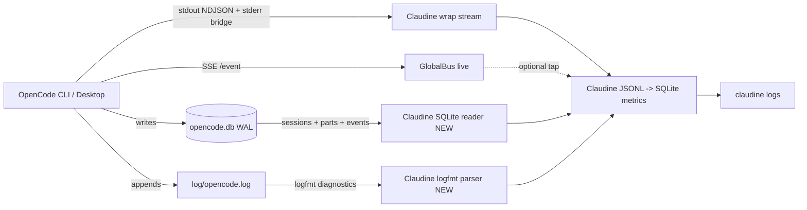

# OpenCode CLI Logging Research

## Introduction to OpenCode CLI Logging

[OpenCode](https://opencode.ai) (by [Anomaly](https://anoma.ly), [repo](https://github.com/anomalyco/opencode)) is an open-source AI coding agent built in TypeScript with a client/server architecture. It ships as a **terminal TUI, a desktop app (Electron), and an IDE extension** — all three drive the same `opencode-cli` server, so they share one observability footprint.

Its logging and persistence strategy is **DB-centric**: a single SQLite database (WAL mode) is the authoritative store for sessions, messages, parts, events, accounts, permissions, and todos. Plain-text **diagnostic log files** are a secondary, best-effort trace for startup/runtime forensics — they do **not** carry conversation content.

> All evidence below is from the host at `~/.local/share/opencode/` (installed `opencode 1.17.13`, 11,612 sessions / 146,228 messages / 628,620 parts, 21 GB `opencode.db`) observed 2026-07-01, cross-checked against the `dev` branch source. Where docs and reality diverge, reality wins.

### Log Locations

All persistent data lives under a platform-specific XDG-compatible data directory:

| Platform | Path |
|----------|------|
| macOS | `~/.local/share/opencode/` |
| Linux | `~/.local/share/opencode/` |
| Windows | `%USERPROFILE%\.local\share\opencode\` |

> Note: OpenCode uses the XDG layout even on macOS (it does **not** use `~/Library/Application Support/` for CLI data — that dir is used only by the desktop app's Electron UI-state files).

The data directory contents (observed):

| Path | Format | Description |
|------|--------|-------------|
| `opencode.db` | SQLite (WAL) | **Primary store** — sessions, messages, parts, events, projects, workspaces, todos, permissions, accounts, credentials, shares, context epochs |
| `opencode.db-wal` / `opencode.db-shm` | SQLite WAL | Live WAL journal files — never copy while opencode runs |
| `log/opencode.log` | text (logfmt) | **Current** rolling diagnostic log (single append-only file) |
| `log/{YYYY-MM-DDTHHMMSS}.log` | text (Effect-style) | **Legacy** per-invocation diagnostic logs (pre-~1.16) |
| `auth.json` | JSON | Provider authentication tokens |
| `account.json` | JSON | Account/session linkage (6.8 KB observed) |
| `storage/` | JSON | Legacy JSON file storage (pre-migration; session diffs/snapshots) |
| `snapshot/<sha>/<sha>` | git tree | Git tree objects referenced by `snapshot`/`step-start` parts |
| `tool-output/<id>/` | text | Cached full tool-execution output (DB may truncate) |
| `project/` | JSON | Legacy project metadata (pre-migration) |
| `repos/` | git | Git mirrors |
| `bin/` | binaries | Downloaded provider packages / sidecars |

Separately, the **desktop app** writes Electron UI-state (not logs) under the OS app-data dir: `~/Library/Application Support/opencode/opencode.{settings,global,workspace.*}.dat` (macOS), `%APPDATA%\opencode\` (Windows), `~/.local/share/opencode/*.dat` (Linux).

### Log File Organization, Splitting, and Archival

**Diagnostic logs** have undergone a format/organization change. Two generations coexist on disk:

**Current generation — `log/opencode.log` (logfmt, single rolling file):**

```
timestamp=2026-07-02T00:52:28.313Z level=INFO run=7d5af416 message=stream providerID=zai-coding-plan modelID=glm-5.2 session.id=ses_0dfb01adcffeC4bFJxQm2dh3NM small=false agent=build mode=primary
timestamp=2026-07-02T00:52:28.314Z level=INFO run=7d5af416 message="llm runtime selected" llm.runtime=ai-sdk llm.provider=zai-coding-plan llm.model=glm-5.2
```

Every line carries four fixed keys — `timestamp=<ISO8601 UTC>`, `level=<INFO|WARN|ERROR|DEBUG>`, `run=<run_id>`, `message="..."` — followed by free-form `key=value` context. The legacy `service=` field is **gone**; subsystem identity now lives in contextual keys (`permission`, `providerID`, `session.id`, `llm.runtime`, etc.). Observed on this host: 103 MB spanning ~3 weeks of unbounded append — **no rotation observed in practice**.

**Legacy generation — `log/{YYYY-MM-DDTHHMMSS}.log` (Effect-style, per-invocation):**

```
INFO  2026-06-10T16:04:13 +51ms service=default directory=/Users/.../reaper bootstrapping
WARN  2026-06-10T16:04:13 +2ms service=config path=/Users/.../config.json tui keys in opencode config are deprecated
```

Each invocation got its own timestamped file. The `+NNms` field is elapsed-since-prior-line within the invocation. These files stopped appearing around 2026-06-10 (version ~1.16), when the switch to `opencode.log` happened.

| Aspect | Current (`opencode.log`) | Legacy (`{ts}.log`) |
|--------|--------------------------|---------------------|
| Format | logfmt (`k=v`) | Effect-style (`LEVEL ts +NNms service=X`) |
| Sharding | single shared file | one file per invocation |
| Timestamp zone | UTC (`...Z`) | local (no offset) |
| Rotation | none observed (docs claim none for this form) | docs claim "keep most recent 10" |
| Subsystem field | none (contextual `k=v`) | `service=<name>` |

**The official [troubleshooting docs](https://opencode.ai/docs/troubleshooting/) still describe the legacy scheme** ("Log files are named with timestamps ... and the most recent 10 log files are kept") — this is documentation lag. Observed reality: a single growing `opencode.log` plus historical timestamped files.

Verbosity is controlled by `--log-level <LEVEL>` / `OPENCODE_LOG_LEVEL` (e.g. `opencode --log-level DEBUG`), and `--print-logs` / `OPENCODE_PRINT_LOGS` mirrors logs to stderr.

### SQLite Database — the Primary Store

OpenCode uses **SQLite in WAL mode** as its authoritative structured store, managed via [Drizzle ORM](https://orm.drizzle.team/) with migrations. PRAGMAs (from source + confirmed by live WAL files):

```sql
PRAGMA journal_mode = WAL;
PRAGMA synchronous = NORMAL;
PRAGMA busy_timeout = 5000;
PRAGMA cache_size = -64000;
PRAGMA foreign_keys = ON;
```

The DB path defaults to `$XDG_DATA_HOME/opencode/opencode.db` (channel variants like `opencode-beta.db` for non-stable channels), overridable via `OPENCODE_DB`. Live `opencode.db-wal` + `opencode.db-shm` files mean the DB is **live-locked** — never copy or symlink it while opencode runs (shadow-home hazard).

Tables (observed, 22 total): `session`, `message`, `part`, `session_message`, `session_input`, `session_context_epoch`, `todo`, `event`, `event_sequence`, `session_share`, `project`, `project_directory`, `workspace`, `permission`, `account`, `account_state`, `control_account`, `credential`, `migration`, `data_migration`, `__drizzle_migrations`, `sqlite_sequence`.

> **`session_entry` is gone.** Prior research documented a `session_entry` table (the "v2 schema"). It no longer exists — superseded by `session_message`.

### Major Log/Data Types

OpenCode distinguishes these categories of structured data:

| Category | Tables | Description |
|----------|--------|-------------|
| **Sessions** | `session` | Conversation sessions. **Now denormalized**: `cost`, `tokens_{input,output,reasoning,cache_read,cache_write}`, `metadata`, `agent`, `model` (JSON), `workspace_id`, `path` are first-class SQL columns. |
| **Messages** | `message` | User/assistant messages. `data` JSON column → role, agent, model, cost, tokens, time, path, error. |
| **Parts** | `part` | Granular message parts (discriminator `$.type`): `tool`, `step-start`, `step-finish`, `reasoning`, `text`, `patch`, `file`, `snapshot`, `compaction`, `subtask`, `agent`. |
| **Session messages** | `session_message` | Event-sourced model/agent-switch events (`type` ∈ `model-switched`, `agent-switched`) with monotonic `seq`. |
| **Session inputs** | `session_input` | Queued user prompts with delivery state (`delivery`, `admitted_seq`, `promoted_seq`). |
| **Events** | `event`, `event_sequence` | Event-sourced sync stream. Types carry a **`.1` schema-version suffix**: `message.part.updated.1`, `message.updated.1`, `session.updated.1`, `session.created.1`, `session.next.model.switched.1`, `session.next.agent.switched.1`. |
| **Context epochs** | `session_context_epoch` | Context-compaction baseline/snapshot per session. |
| **Projects / dirs** | `project`, `project_directory` | Git-based project metadata + directory classification. |
| **Workspaces** | `workspace` | Workspace entries within a project. |
| **Todos** | `todo` | Per-session todo items. |
| **Permissions** | `permission` | Per-project permission rulesets. |
| **Accounts** | `account`, `account_state`, `control_account` | Account/auth state (Zen / control plane). |
| **Credentials** | `credential` | Integration credentials. |
| **Shares** | `session_share` | Shared-session metadata (url, secret). |
| **Migrations** | `migration`, `data_migration`, `__drizzle_migrations` | Schema/data migration tracking. |

Observed `part` type distribution (this host, 628,620 parts):

| Part Type | Count |
|-----------|-------|
| `tool` | 166,021 |
| `step-start` | 133,957 |
| `step-finish` | 133,056 |
| `reasoning` | 111,397 |
| `text` | 62,818 |
| `patch` | 20,572 |
| `file` | 571 |
| `snapshot` | 127 |
| `compaction` | 104 |
| `subtask` | 2 |
| `agent` | 1 |

> Prior research also listed a `retry` part type — **not observed** in this install (may be rare or gated).

Observed `event` type distribution (this host, 267,911 events):

| Event Type | Count |
|------------|-------|
| `message.part.updated.1` | 210,253 |
| `message.updated.1` | 43,990 |
| `session.updated.1` | 12,255 |
| `session.created.1` | 642 |
| `session.next.model.switched.1` | 575 |
| `session.next.agent.switched.1` | 182 |

Diagnostic-log `message=` values (current `opencode.log`, top observed):

| Message | Count | Meaning |
|---------|-------|---------|
| `duplicate skill name` | 113,219 | Skill-collision warning (noisy on this host's multi-source skill setup) |
| `llm runtime selected` | 43,684 | LLM backend chosen (`native` vs `ai-sdk`) |
| `touching file` | 18,100 | File touched/tracked |
| `resolved path` | 2,377 | Path resolution |
| `exiting loop` | 1,739 | Agent loop exit |
| `evaluated` | 71,741 | Permission evaluation (`permission=bash pattern="..." action.action=allow`) |
| `tracking` | 84,344 | Git snapshot tracking (`hash=`, `cwd=`, `git=`) |

## Logging Schema

### Schema Status — Informal (Drizzle + Effect Schema in source)

OpenCode publishes **no standalone schema artifact** (no JSON Schema, OpenAPI, protobuf, or SQL DDL file) for its log or DB contents. What exists is **informal**: TypeScript types that double as the contract.

1. **Drizzle ORM table definitions** — [`packages/core/src/session/sql.ts`](https://github.com/anomalyco/opencode/blob/dev/packages/core/src/session/sql.ts) (session/message/part/todo/session_message/session_input/session_context_epoch). Other tables live in sibling `sql.ts` files (`project/sql.ts`, `workspace/sql.ts`, `v1/permission.ts`, account/credential modules). **This path moved** from the prior-research location `packages/opencode/src/session/session.sql.ts` into a new `core` package.
2. **Effect Schema structs** — `packages/core/src/session/{message,input,prompt,event}.ts` and `@opencode-ai/schema/session-message`.
3. **Event manifest** — `packages/opencode/src/event-manifest.ts` + `event-v2-bridge.ts` (event sourcing + the `.1` version suffix scheme).
4. **Bus event definitions** — `packages/opencode/src/bus/`.
5. **Live migrations** — `migration` / `data_migration` / `__drizzle_migrations` tables track applied schema/data migrations.

The DB tables themselves are the closest thing to an official schema; Drizzle migrations in `packages/*/migration/` evolve them.

### Representative Rust Schema

Based on the authoritative `sql.ts` + observed JSON in `message.data` / `part.data` / `event.data` (all camelCase on the wire):

```rust
use serde::{Deserialize, Serialize};
use serde_json::Value;

/// Diagnostic log line in the CURRENT `log/opencode.log` (logfmt).
/// Parsed from `timestamp=... level=... run=... message=... <kv>`.
#[derive(Debug, Clone, Deserialize)]
pub struct OpencodeLogLine {
    pub timestamp: String,          // ISO 8601 UTC, e.g. "2026-07-02T00:52:28.313Z"
    pub level: OpencodeLogLevel,
    pub run: String,                // run_id (was "run_id" in legacy format)
    pub message: String,
    #[serde(flatten)]
    pub context: OpencodeLogContext,
}

#[derive(Debug, Clone, Deserialize)]
#[serde(rename_all = "UPPERCASE")]
pub enum OpencodeLogLevel {
    Info,
    Warn,
    Error,
    Debug,
}

/// Free-form key/value context. Common keys observed: session.id, providerID,
/// modelID, agent, mode, small, permission, pattern, action.{permission,action,pattern},
/// llm.{runtime,provider,model}, file, path, directory, hash, cwd, git, step,
/// messageID, projectID, workspaceID, version, tokens.*, time.*, title.
#[derive(Debug, Clone, Default, Deserialize)]
pub struct OpencodeLogContext(pub std::collections::BTreeMap<String, String>);

/// Row in the `session` table. Cost/tokens are now FIRST-CLASS SQL columns
/// (denormalized from message/part aggregates) — major change from prior research.
#[derive(Debug, Clone, Deserialize)]
pub struct SessionRow {
    pub id: String,
    pub project_id: String,
    #[serde(default)]
    pub workspace_id: Option<String>,
    #[serde(default)]
    pub parent_id: Option<String>,
    pub slug: String,
    pub directory: String,
    #[serde(default)]
    pub path: Option<String>,
    pub title: String,
    pub version: String,
    #[serde(default)]
    pub share_url: Option<String>,
    #[serde(default)]
    pub summary_additions: Option<i64>,
    #[serde(default)]
    pub summary_deletions: Option<i64>,
    #[serde(default)]
    pub summary_files: Option<i64>,
    #[serde(default)]
    pub summary_diffs: Option<Value>,
    #[serde(default)]
    pub metadata: Option<Value>,
    pub cost: f64,                          // denormalized
    pub tokens_input: i64,                  // denormalized
    pub tokens_output: i64,                 // denormalized
    pub tokens_reasoning: i64,              // denormalized
    pub tokens_cache_read: i64,             // denormalized
    pub tokens_cache_write: i64,            // denormalized
    #[serde(default)]
    pub revert: Option<Value>,
    #[serde(default)]
    pub permission: Option<Value>,
    #[serde(default)]
    pub agent: Option<String>,
    #[serde(default)]
    pub model: Option<SessionModelRef>,     // JSON column
    pub time_created: i64,                  // unix millis
    pub time_updated: i64,                  // unix millis
    #[serde(default)]
    pub time_compacting: Option<i64>,
    #[serde(default)]
    pub time_archived: Option<i64>,
}

#[derive(Debug, Clone, Deserialize)]
pub struct SessionModelRef {
    pub id: String,
    #[serde(rename = "providerID")]
    pub provider_id: String,
    #[serde(default)]
    pub variant: Option<String>,
}

/// `message.data` JSON blob (camelCase keys).
#[derive(Debug, Clone, Deserialize)]
#[serde(tag = "role")]
pub enum MessageData {
    #[serde(rename = "user")]
    User(UserMessageData),
    #[serde(rename = "assistant")]
    Assistant(AssistantMessageData),
}

#[derive(Debug, Clone, Deserialize)]
pub struct UserMessageData {
    #[serde(rename = "time")]
    pub time: MessageTime,
    #[serde(default)]
    pub agent: Option<String>,
    #[serde(default)]
    pub model: Option<ModelRef>,
    #[serde(default)]
    pub summary: Option<Value>,
}

#[derive(Debug, Clone, Deserialize)]
pub struct AssistantMessageData {
    #[serde(rename = "parentID")]
    pub parent_id: String,
    pub mode: String,
    pub agent: String,
    #[serde(default)]
    pub path: Option<WorkPath>,
    pub cost: f64,
    pub tokens: TokenUsage,
    #[serde(rename = "modelID")]
    pub model_id: String,
    #[serde(rename = "providerID")]
    pub provider_id: String,
    #[serde(default)]
    pub error: Option<AssistantError>,
    #[serde(rename = "time")]
    pub time: AssistantTime,
}

#[derive(Debug, Clone, Deserialize)]
pub struct ModelRef {
    #[serde(rename = "providerID")]
    pub provider_id: String,
    #[serde(rename = "modelID")]
    pub model_id: String,
    #[serde(default)]
    pub variant: Option<String>,
}

#[derive(Debug, Clone, Deserialize)]
pub struct WorkPath {
    pub cwd: String,
    pub root: String,
}

#[derive(Debug, Clone, Deserialize)]
pub struct MessageTime {
    pub created: u64,                       // unix millis
}

#[derive(Debug, Clone, Deserialize)]
pub struct AssistantTime {
    pub created: u64,                       // unix millis
    #[serde(default)]
    pub completed: Option<u64>,             // unix millis
}

#[derive(Debug, Clone, Deserialize)]
pub struct TokenUsage {
    #[serde(default)]
    pub input: u64,
    #[serde(default)]
    pub output: u64,
    #[serde(default)]
    pub reasoning: u64,
    #[serde(default)]
    pub cache: CacheUsage,
}

#[derive(Debug, Clone, Default, Deserialize)]
pub struct CacheUsage {
    #[serde(default)]
    pub read: u64,
    #[serde(default)]
    pub write: u64,
}

/// `part.data` JSON blob (camelCase keys), tagged by `type`.
#[derive(Debug, Clone, Deserialize)]
#[serde(tag = "type")]
pub enum PartData {
    #[serde(rename = "text")]
    Text { text: String, #[serde(default)] synthetic: Option<bool> },
    #[serde(rename = "tool")]
    Tool {
        #[serde(rename = "callID")]
        call_id: String,
        tool: String,
        state: ToolState,
    },
    #[serde(rename = "reasoning")]
    Reasoning { text: String },
    #[serde(rename = "step-start")]
    StepStart { #[serde(default)] snapshot: Option<String> },
    #[serde(rename = "step-finish")]
    StepFinish {
        reason: String,
        cost: f64,
        tokens: TokenUsage,
        #[serde(default)]
        snapshot: Option<String>,
    },
    #[serde(rename = "file")]
    File(Value),
    #[serde(rename = "snapshot")]
    Snapshot(Value),
    #[serde(rename = "patch")]
    Patch(Value),
    #[serde(rename = "compaction")]
    Compaction(Value),
    #[serde(rename = "subtask")]
    Subtask(Value),
    #[serde(rename = "agent")]
    Agent(Value),
}

#[derive(Debug, Clone, Deserialize)]
#[serde(tag = "status")]
pub enum ToolState {
    #[serde(rename = "pending")]
    Pending { input: Value, raw: String },
    #[serde(rename = "running")]
    Running { input: Value, #[serde(default)] title: Option<String> },
    #[serde(rename = "completed")]
    Completed {
        input: Value,
        output: String,
        title: String,
        metadata: Value,
        time: ToolTime,
    },
    #[serde(rename = "error")]
    Error { input: Value, error: String },
}

#[derive(Debug, Clone, Deserialize)]
pub struct ToolTime {
    pub start: u64,                         // unix millis
    pub end: u64,                           // unix millis
}

/// `event.data` JSON blob. `type` carries a `.1` schema-version suffix
/// (message.part.updated.1, session.created.1, ...).
#[derive(Debug, Clone, Deserialize)]
pub struct EventData {
    #[serde(rename = "sessionID")]
    pub session_id: String,
    pub info: Value,                        // full snapshot of the changed entity
}

/// `session_message.data` JSON blob (`type` ∈ model-switched, agent-switched).
#[derive(Debug, Clone, Deserialize)]
pub struct SessionMessageData {
    #[serde(rename = "time")]
    pub time: MessageTime,
    #[serde(default)]
    pub agent: Option<String>,
    #[serde(default)]
    pub model: Option<ModelRef>,
}
```

### Community Schemas

No authoritative community schema exists. Claudine's `claudine/lib/src/stream/protocol/opencode.rs` models the **live stdout NDJSON stream** (a separate concern from the on-disk DB/logs) and is the most complete typed model in this monorepo for OpenCode's runtime events.

## Informational Content versus Hook Events

Claudine's OpenCode integration today consumes the **live stream** (stdout NDJSON + the stderr bridge) via the wrapper, plus Claudine's own hook-style lifecycle. This section analyzes when the on-disk DB/logs beat live events, and vice-versa.

### When File-System / DB Logs Are the Better Source

| Scenario | Why the DB / Logs Win |
|----------|-----------------------|
| **Complete conversation history** | `message` + `part` tables hold every turn with full fidelity; the stream only flows while Claudine is attached. |
| **Cost & token analysis** | `step-finish` parts carry per-step cost/tokens; the `session` table now has **denormalized** cost/token columns for instant SQL aggregation across all 11,612 sessions — no JSON parsing. |
| **Tool-call audit trails** | `tool` parts record name, input, output, status, and timing (start/end ms). 166k observed. |
| **Post-hoc / cross-session analytics** | The DB persists indefinitely; the stream is gone once the process exits. |
| **Event replay / sync** | The `event` table is an event-sourced log (`message.part.updated.1`, `session.created.1`, ...) — replayable to reconstruct any state. |
| **Code-change tracking** | `snapshot` + `patch` parts + the `snapshot/` git-tree store reconstruct file state at any point. |
| **Startup / crash forensics** | `log/opencode.log` records provider discovery, config load, plugin init, migrations, permission evaluations — process-level context (`run=`, `version`) absent from the stream. |
| **Permission audit** | 71k+ `evaluated` log lines record every permission decision (`pattern`, `action.permission`, `action.action`). |
| **Model/agent switches** | `session_message` + `session.next.{model,agent}.switched.1` events record mid-session switches. |

### When Live Stream / Hook Events Are the Better Source

| Scenario | Why Live Events Win |
|----------|---------------------|
| **Real-time interception** | The live stream lets Claudine observe/block/enrich as things happen; the DB is read-only after the fact. |
| **Sub-second token deltas** | Streamed deltas arrive faster than DB polls. |
| **Stalled-generation detection** | Claudine's OpenCode-scoped stalled-generation backstop relies on the live `LlmCall` retry churn heartbeat — invisible in the DB until a part is written. |
| **Guaranteed delivery to Claudine** | Stream events are pushed; DB ingestion requires polling / file-watching and detecting new rows. |
| **Permission decisions in-flight** | Live hooks fire *before* the action; the DB/logs only record the outcome. |

### Other Sources for Data Enrichment

| Source | What It Provides | Strategy |
|--------|------------------|----------|
| **HTTP/SSE server (`/event`)** | Live bus events bridged globally (`{directory, project, workspace, payload}`) via `GlobalBus`. | Tap the SSE stream for cross-project live dashboards; the desktop app uses this same channel. |
| **`OPENCODE_CONFIG_CONTENT` / `OPENCODE_PORT`** | Inline config override + server port. | Detect custom server endpoints; config shapes logging/permission behavior. |
| **`session_share` table / `share_url`** | Serialized shareable session view. | Reconstruct or export a session for collaboration. |
| **`tool-output/` cache** | Full outputs for large tool calls (DB may truncate). | Recover complete tool output when `part.data` is truncated after compaction. |
| **`snapshot/` git trees** | File-system state at any `step-start`/`snapshot`. | Reconstruct exact diffs at any point in a session. |
| **`account.json` + `auth.json`** | Provider/account linkage + tokens. | Correlate sessions with accounts/providers (credentials — handle with care). |
| **Denormalized `session` columns** | Per-session `cost`, `tokens_*`, `agent`, `model` without JSON parsing. | Build fast aggregations/reports directly in SQL. |

### Recommended Hybrid Strategy

Claudine should keep **the live stream for real-time action, policy, and stalled-generation detection**, and add a **SQLite reader for `opencode.db`** to unlock historical `claudine logs` reporting for OpenCode (today Claudine's reporting layer only ingests its own JSONL). The denormalized `session` cost/token columns make per-session and cross-session metrics cheap; the `event` table enables full replay. Any future `opencode.log` ingestion needs a **logfmt parser** (the legacy Effect-format parser model is no longer valid).



## Sources

- [OpenCode GitHub Repository](https://github.com/anomalyco/opencode)
- [OpenCode Documentation](https://opencode.ai/docs)
- [OpenCode Troubleshooting (logs + storage)](https://opencode.ai/docs/troubleshooting/)
- [OpenCode CLI Reference](https://opencode.ai/docs/cli/)
- [OpenCode Server / SDK](https://opencode.ai/docs/server/)
- [OpenCode Plugins](https://opencode.ai/docs/plugins/)
- [Session SQL Schema — `packages/core/src/session/sql.ts` (authoritative)](https://github.com/anomalyco/opencode/blob/dev/packages/core/src/session/sql.ts)
- [Session message/input/event modules — `packages/core/src/session/`](https://github.com/anomalyco/opencode/tree/dev/packages/core/src/session)
- [Event manifest + v2 bridge — `packages/opencode/src/event-manifest.ts`](https://github.com/anomalyco/opencode/blob/dev/packages/opencode/src/event-manifest.ts)
- [Bus module — `packages/opencode/src/bus/`](https://github.com/anomalyco/opencode/tree/dev/packages/opencode/src/bus)
- [Desktop app — `packages/desktop/`](https://github.com/anomalyco/opencode/tree/dev/packages/desktop)
- [Drizzle ORM](https://orm.drizzle.team/)
- [OpenCode npm Package](https://www.npmjs.com/package/opencode-ai)
- [OpenCode Plugin Package](https://www.npmjs.com/package/@opencode-ai/plugin)
- Host evidence: `~/.local/share/opencode/opencode.db` (21 GB, 11,612 sessions), `~/.local/share/opencode/log/opencode.log` (103 MB logfmt) + legacy `log/{ts}.log`, observed 2026-07-01 against `opencode 1.17.13`

## Changelog

- **2026-07-01** — Full re-research against `opencode 1.17.13` (prior was `1.14.29`). Major changes: (1) diagnostic log format switched from Effect-style to **logfmt** in a single rolling `log/opencode.log` (legacy `{ts}.log` files retained); `service=` field dropped, `run=` id added, timestamps now explicit UTC `Z`. Official docs still describe the old scheme (flagged as documentation lag). (2) `session` table gained **denormalized** `cost`/`tokens_*`/`metadata`/`agent`/`model`/`workspace_id`/`path` columns — cost/tokens now SQL-queryable without JSON parsing. (3) New tables: `session_message`, `session_input`, `session_context_epoch`, `session_share`, `credential`, `account`, `account_state`, `control_account`, `migration`, `data_migration`, `project_directory`. (4) `session_entry` table is **gone** (superseded by `session_message`). (5) `event.type` values now carry a `.1` schema-version suffix. (6) Authoritative Drizzle schema moved to `packages/core/src/session/sql.ts`. (7) **Desktop app confirmed** (Electron, `packages/desktop`) — spawns the same `opencode-cli` sidecar, sharing `opencode.db` + `opencode.log` (same format, same directory); desktop-only UI-state `.dat` files live under OS app-data dirs. (8) `auth.json` joined by `account.json`. Set `has_official_schema: informal`, `has_desktop_app: true`, `requires_claudine_update: true` (DB is the transcript store; reporting needs a new SQLite reader; logfmt parser needed for any log ingestion).
