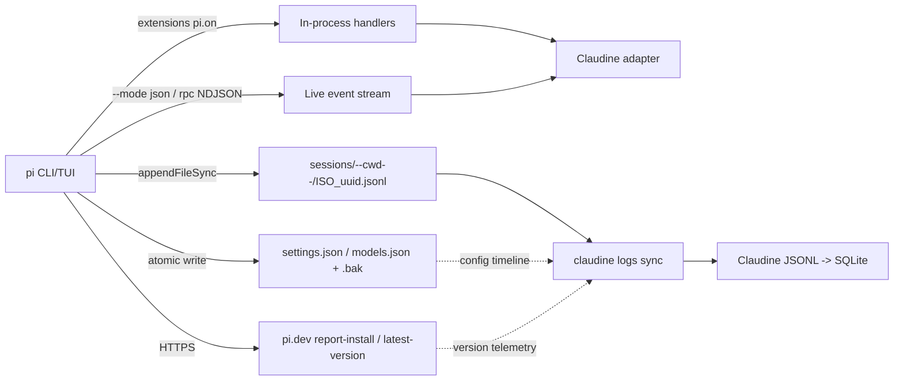

# Pi Logging

## Introduction to Pi Logging

[Pi](https://pi.dev/) is an open-source agentic coding CLI ([repo: `badlogic/pi-mono`](https://github.com/badlogic/pi-mono), npm [`@mariozechner/pi-coding-agent`](https://www.npmjs.com/package/@mariozechner/pi-coding-agent), author Mario Zechner). The version observed on this host is **`0.73.0`**, installed via `bun` at `~/.bun/bin/pi`. Pi is a **CLI / TUI-only** product — it ships an interactive terminal mode, a one-shot `--mode print`, a streaming `--mode json`, a subprocess `--mode rpc`, and a TypeScript SDK. There is **no Electron/Tauri desktop application** (the `build:binary` script merely `bun build --compile`s a standalone `pi` executable).

Pi's observability story is deliberately minimal and **entirely file-based**. A full `grep` of the installed `dist/` for `sqlite`, `better-sqlite`, `sql.js`, `drizzle`, `prisma`, or `knex` returned **zero** matches, and `find ~/.pi -name "*.sqlite"` is empty. There is no embedded database of any kind.

There are two distinct event representations that must not be conflated — the same split Claude Code makes:

1. **On-disk session transcript** — the append-only JSONL tree written to `~/.pi/agent/sessions/`. This is what a forensic log reader consumes.
2. **Live event stream** — the `AgentSessionEvent` union emitted to stdout by `pi --mode json` / `pi --mode rpc` and to in-process subscribers via `session.subscribe()`. This is what a wrapper (like Claudine) consumes live. **It is never persisted to disk by Pi** — a wrapper must capture it.

They share the `session` header shape and the message payload shape, but the **transcript persists only durable tree entries** (`message`, `model_change`, `compaction`, `label`, …), while the **stream emits transient lifecycle events** (`agent_start`, `text_delta`, `tool_execution_update`, `queue_update`, `auto_retry_*`) that are never written to the file.

### Log Locations and Organization

| Path | Format | Purpose |
|------|--------|---------|
| `~/.pi/agent/sessions/--{sanitized_cwd}--/{ISO8601Z}_{uuid}.jsonl` | JSONL | Per-session tree-structured transcript (primary audit trail) |
| `~/.pi/agent/settings.json` / `models.json` / `auth.json` | JSON | Global config + credentials (`auth.json` is `0600`) |
| `~/.pi/agent/{settings,models}.{unix_seconds}.bak` | JSON | Timestamped backups written on config mutation |
| `<cwd>/.pi/settings.json` | JSON | Project settings (merged over global) |
| stdout NDJSON (`pi --mode json` / `--mode rpc`) | JSON | **Live event stream** — opt-in, not a file |
| `~/.pi/agent/extensions/` , `~/.pi/agent/skills/` , `~/.pi/agent/prompts/` | TS/MD | Shared resources (not logs) |

The `{sanitized_cwd}` segment replaces every `/` in the working directory with `-` and wraps the result in leading/trailing `-` (e.g. `/Users/ken` → `--Users-ken--`). Session IDs are UUIDv4 (e.g. `019de86e-fd4c-720b-a89a-73893f5786b4`). The filename timestamp is **ISO-8601 UTC with colons replaced by dashes** for filesystem safety and millisecond precision: `2026-05-02T11-24-41-165Z`. **There is no date-sharding directory tree** — transcripts are sharded by sanitized cwd only (contrast with Codex's `sessions/YYYY/MM/DD/`).

### Organization, Splitting, and Archival

Pi implements **no rotation and no archival**. Transcripts accumulate indefinitely under `~/.pi/agent/sessions/` until manually deleted (the `/resume` picker can trash them via the `trash` CLI; otherwise plain `rm`). The boundaries are:

- **Session boundary** — each session is one `{ISO8601Z}_{uuid}.jsonl` file.
- **In-place branching** — `/tree` navigation, `/fork`, and `/clone` create new *branches/sessions*. In-place branches reuse the **same file** by appending entries whose `parentId` points at an earlier node, forming a tree. `/fork` and `/clone` write a **new file** whose header carries a `parentSession` pointer to the origin. There are **no per-subagent transcript files** — Pi has no separate subagent process concept; all branching is in-session.
- **Compaction boundary** — a `compaction` entry replaces older context in-place (same file) rather than rotating to a new one.

Config mutations (`settings.json`, `models.json`) are written atomically and leave a `{file}.{unix_seconds}.bak` snapshot beside the live file — observed four `settings.*.bak` and three `models.*.bak` on this host. This is the only "historical" surface Pi creates on its own.

### SQLite / Database Usage

**None.** Pi uses no SQLite, no LevelDB, no embedded database for its logs, sessions, or state. All persistence is JSONL (transcripts) + JSON (config/credentials/backups). Session listing (`SessionManager.list` / `listAll`) is performed by scanning the filesystem, not by querying an index. Any structured indexing must be added by a downstream consumer (Claudine's own JSONL→SQLite metrics layer would be that consumer if Pi support were added).

### Major Log Message Types

Pi's logging vocabulary is split across the two surfaces. On-disk transcript top-level types (observed + documented):

| Category | `type` | Notes |
|----------|--------|-------|
| **Header** | `session` | First line only; carries `version`, `id` (uuid), `timestamp`, `cwd`, optional `parentSession`. Not part of the tree. |
| **Conversation** | `message` | Holds an `AgentMessage` in `$.message` (role-discriminated — see Schema). |
| **Model switch** | `model_change` | User changed provider/model mid-session (`provider`, `modelId`). |
| **Thinking level** | `thinking_level_change` | `off`/`minimal`/`low`/`medium`/`high`/`xhigh`. |
| **Compaction** | `compaction` | Context summary; `summary`, `firstKeptEntryId`, `tokensBefore`, optional `details`/`fromHook`. |
| **Branch summary** | `branch_summary` | LLM summary of an abandoned branch on `/tree` switch; `fromId`, `summary`. |
| **Extension state** | `custom` | Extension-private persistence; does NOT enter LLM context. `customType`, `data`. |
| **Extension message** | `custom_message` | Extension-injected context that DOES enter LLM context; `content`, `display`. |
| **Bookmark** | `label` | User label on a target entry (`targetId`, `label`). |
| **Session name** | `session_info` | Display name set via `/name` (`name`). |

The live event stream adds (not persisted): `agent_start`, `agent_end`, `turn_start`, `turn_end`, `message_start`, `message_update` (with `assistantMessageEvent` deltas `text_delta`/`thinking_delta`), `message_end`, `tool_execution_start`, `tool_execution_update`, `tool_execution_end`, `queue_update` (steering/follow-up queues), `compaction_start`/`compaction_end` (`reason`: `manual`/`threshold`/`overflow`), `auto_retry_start`/`auto_retry_end`.

---

## Logging Schema

### No Formal Schema — Informal (Documented + TypeScript) Schema

Pi publishes **no machine-readable schema artifact** (no JSON Schema, OpenAPI, protobuf, or capnp). What exists is **informal but unusually thorough**:

- **On-disk transcript format**: documented in [`docs/session-format.md`](https://github.com/badlogic/pi-mono/blob/main/packages/coding-agent/docs/session-format.md) (entry types, content blocks, the `AgentMessage` union, the `SessionManager` API) and typed in the TypeScript source:
  - [`packages/coding-agent/src/core/session-manager.ts`](https://github.com/badlogic/pi-mono/blob/main/packages/coding-agent/src/core/session-manager.ts) — session entry types
  - [`packages/coding-agent/src/core/messages.ts`](https://github.com/badlogic/pi-mono/blob/main/packages/coding-agent/src/core/messages.ts) — extended message types
  - [`packages/ai/src/types.ts`](https://github.com/badlogic/pi-mono/blob/main/packages/ai/src/types.ts) — base message types
- **Live event stream**: documented in [`docs/json.md`](https://github.com/badlogic/pi-mono/blob/main/packages/coding-agent/docs/json.md) and typed as the `AgentSessionEvent` union in [`packages/coding-agent/src/core/agent-session.ts`](https://github.com/badlogic/pi-mono/blob/main/packages/coding-agent/src/core/agent-session.ts).

Against this topic's vocabulary (`formal` / `informal` / `none`), this is **informal**: it is human-readable documentation plus source-of-truth TypeScript types, not a standalone schema contract. Versioning is signaled explicitly via the `version` field in the session header (currently `3`; older sessions are auto-migrated on load).

### Transcript Envelope (from `session-format.md`, verified against real files)

Every transcript line is a JSON object. The first line is a `SessionHeader` (no `id`/`parentId`); every subsequent line is a `SessionEntry` extending `SessionEntryBase` and linked into a tree via `id`/`parentId` (8-char hex IDs). Note the **dual timestamp convention**: the entry-level `timestamp` is an ISO-8601 string, while the `message.timestamp` nested inside a `message` entry is a **unix epoch millisecond** number.

```rust
use chrono::{DateTime, Utc};
use serde::{Deserialize, Serialize};
use serde_json::Value;
use std::collections::BTreeMap;

/// First line of a `{ISO8601Z}_{uuid}.jsonl` transcript file.
/// Not part of the tree (no id/parentId).
#[derive(Debug, Default, Deserialize, Serialize)]
pub struct PiSessionHeader {
    #[serde(rename = "type")]
    pub kind: String,                  // always "session"
    pub version: u32,                  // observed 3; explicit schema-version field
    pub id: String,                    // session UUIDv4
    pub timestamp: DateTime<Utc>,      // ISO-8601 UTC string
    pub cwd: String,
    #[serde(default, skip_serializing_if = "Option::is_none")]
    pub parent_session: Option<String>, // present for /fork, /clone, newSession({parentSession})
}

/// Base shape every non-header line extends.
#[derive(Debug, Default, Deserialize, Serialize)]
pub struct PiSessionEntryBase {
    #[serde(rename = "type")]
    pub kind: PiEntryType,
    pub id: String,                    // 8-char hex
    pub parent_id: Option<String>,     // None/null for the first entry
    pub timestamp: DateTime<Utc>,      // ISO-8601 UTC string (NOTE: string, not ms)
}

/// Top-level discriminator observed in on-disk transcripts.
#[derive(Debug, Default, Deserialize, Serialize)]
#[serde(rename_all = "snake_case")]
pub enum PiEntryType {
    #[default]
    Session,
    Message,
    ModelChange,
    ThinkingLevelChange,
    Compaction,
    BranchSummary,
    Custom,
    CustomMessage,
    Label,
    SessionInfo,
}

/// A conversation entry. `message` holds an `AgentMessage` (role-discriminated).
/// The nested `message.timestamp` is unix MILLIS (different unit from the entry!).
#[derive(Debug, Default, Deserialize, Serialize)]
pub struct PiMessageEntry {
    #[serde(flatten)]
    pub base: PiSessionEntryBase,
    pub message: PiAgentMessage,
}

/// The `AgentMessage` union — discriminated by `role`.
#[derive(Debug, Deserialize, Serialize)]
#[serde(tag = "role", rename_all = "camelCase")]
pub enum PiAgentMessage {
    User(PiUserMessage),
    Assistant(PiAssistantMessage),
    ToolResult(PiToolResultMessage),
    BashExecution(PiBashExecutionMessage),
    Custom(PiCustomMessage),
    BranchSummary(PiBranchSummaryMessage),
    CompactionSummary(PiCompactionSummaryMessage),
}

/// `role: "user"`. `content` is a string or an array of TextContent | ImageContent.
#[derive(Debug, Default, Deserialize, Serialize)]
pub struct PiUserMessage {
    #[serde(default, skip_serializing_if = "Option::is_none")]
    pub content: Option<Value>,
    pub timestamp: i64,                // unix MILLIS
}

/// `role: "assistant"`. Carries per-message cost/usage (no separate result event).
#[derive(Debug, Default, Deserialize, Serialize)]
pub struct PiAssistantMessage {
    pub content: Vec<PiContentBlock>,
    #[serde(default)]
    pub api: Option<String>,
    pub provider: String,
    pub model: String,
    pub usage: PiUsage,
    pub stop_reason: PiStopReason,
    #[serde(default, skip_serializing_if = "Option::is_none")]
    pub error_message: Option<String>,
    pub timestamp: i64,                // unix MILLIS
}

/// `role: "toolResult"`.
#[derive(Debug, Default, Deserialize, Serialize)]
pub struct PiToolResultMessage {
    #[serde(rename = "toolCallId")]
    pub tool_call_id: String,
    #[serde(rename = "toolName")]
    pub tool_name: String,
    pub content: Vec<PiContentBlock>,
    #[serde(default, skip_serializing_if = "Option::is_none")]
    pub details: Option<Value>,
    #[serde(rename = "isError")]
    pub is_error: bool,
    pub timestamp: i64,                // unix MILLIS
}

/// `role: "bashExecution"` — `!`/`!!` prefixed shell commands.
#[derive(Debug, Default, Deserialize, Serialize)]
pub struct PiBashExecutionMessage {
    pub command: String,
    pub output: String,
    #[serde(default)]
    pub exit_code: Option<i32>,
    pub cancelled: bool,
    pub truncated: bool,
    #[serde(default, rename = "fullOutputPath", skip_serializing_if = "Option::is_none")]
    pub full_output_path: Option<String>,
    #[serde(default, rename = "excludeFromContext", skip_serializing_if = "Option::is_none")]
    pub exclude_from_context: Option<bool>,
    pub timestamp: i64,
}

/// `role: "custom"` — extension-injected via sendMessage().
#[derive(Debug, Default, Deserialize, Serialize)]
pub struct PiCustomMessage {
    #[serde(rename = "customType")]
    pub custom_type: String,
    pub content: Value,
    pub display: bool,
    #[serde(default, skip_serializing_if = "Option::is_none")]
    pub details: Option<Value>,
    pub timestamp: i64,
}

#[derive(Debug, Default, Deserialize, Serialize)]
pub struct PiBranchSummaryMessage {
    pub summary: String,
    #[serde(rename = "fromId")]
    pub from_id: String,
    pub timestamp: i64,
}

#[derive(Debug, Default, Deserialize, Serialize)]
pub struct PiCompactionSummaryMessage {
    pub summary: String,
    #[serde(rename = "tokensBefore")]
    pub tokens_before: i64,
    pub timestamp: i64,
}

/// Typed content block inside message `content[]`.
#[derive(Debug, Deserialize, Serialize)]
#[serde(tag = "type", rename_all = "camelCase")]
pub enum PiContentBlock {
    Text { text: String },
    Image { data: String, #[serde(rename = "mimeType")] mime_type: String },
    Thinking { thinking: String },
    #[serde(rename = "toolCall")]
    ToolCall {
        id: String,
        name: String,
        arguments: BTreeMap<String, Value>,
    },
}

#[derive(Debug, Default, Deserialize, Serialize)]
pub struct PiUsage {
    pub input: i64,
    pub output: i64,
    #[serde(rename = "cacheRead", default)]
    pub cache_read: i64,
    #[serde(rename = "cacheWrite", default)]
    pub cache_write: i64,
    #[serde(rename = "totalTokens", default)]
    pub total_tokens: i64,
    pub cost: PiCost,
}

#[derive(Debug, Default, Deserialize, Serialize)]
pub struct PiCost {
    pub input: f64,
    pub output: f64,
    #[serde(rename = "cacheRead", default)]
    pub cache_read: f64,
    #[serde(rename = "cacheWrite", default)]
    pub cache_write: f64,
    pub total: f64,
}

#[derive(Debug, Deserialize, Serialize)]
#[serde(rename_all = "camelCase")]
pub enum PiStopReason {
    Stop,
    Length,
    ToolUse,
    Error,
    Aborted,
}
```

### Live Event Stream (`AgentSessionEvent`, `--mode json` / rpc / SDK)

```rust
/// One stdout NDJSON line from `pi --mode json` / `pi --mode rpc`, or one
/// `session.subscribe()` event. NOTE: events carry NO per-event timestamp;
/// only the leading `session` header line does.
#[derive(Debug, Deserialize, Serialize)]
#[serde(tag = "type", rename_all = "snake_case")]
pub enum PiAgentSessionEvent {
    Session(PiSessionHeader),
    // Agent lifecycle
    AgentStart,
    AgentEnd { messages: Vec<PiAgentMessage> },
    // Turn lifecycle
    TurnStart,
    TurnEnd { message: PiAgentMessage, tool_results: Vec<PiToolResultMessage> },
    // Message lifecycle
    MessageStart { message: PiAgentMessage },
    MessageUpdate { message: PiAgentMessage, assistant_message_event: PiAssistantMessageEvent },
    MessageEnd { message: PiAgentMessage },
    // Tool execution
    ToolExecutionStart { tool_call_id: String, tool_name: String, args: Value },
    ToolExecutionUpdate { tool_call_id: String, tool_name: String, args: Value, partial_result: Value },
    ToolExecutionEnd { tool_call_id: String, tool_name: String, result: Value, is_error: bool },
    // Queue / compaction / retry (AgentSession-only, not in base AgentEvent)
    QueueUpdate { steering: Vec<String>, follow_up: Vec<String> },
    CompactionStart { reason: PiCompactionReason },
    CompactionEnd { reason: PiCompactionReason, result: Option<Value>, aborted: bool, will_retry: bool, error_message: Option<String> },
    AutoRetryStart { attempt: u32, max_attempts: u32, delay_ms: u64, error_message: String },
    AutoRetryEnd { success: bool, attempt: u32, final_error: Option<String> },
}

#[derive(Debug, Deserialize, Serialize)]
#[serde(tag = "type", rename_all = "snake_case")]
pub enum PiAssistantMessageEvent {
    TextDelta { delta: String },
    ThinkingDelta { delta: String },
}

#[derive(Debug, Deserialize, Serialize)]
#[serde(rename_all = "lowercase")]
pub enum PiCompactionReason { Manual, Threshold, Overflow }
```

### Community Schema Attempts

No third-party schema project exists. The `@mariozechner/pi-coding-agent` package's own emitted `.d.ts` type declarations (under `dist/`) are the most complete typed model available and were used as the source of truth for the Rust above. The transcript is simple enough (10 entry types, 7 message roles) that hand-derivation from `session-format.md` + the observed files is straightforward and authoritative.

---

## Informational Content versus Hook Events

Pi does **not** expose Claude-Code-style detached hook executables. Instead it has a first-class **extension system** ([`docs/extensions.md`](https://github.com/badlogic/pi-mono/blob/main/packages/coding-agent/docs/extensions.md)): TypeScript modules under `~/.pi/agent/extensions/` or `.pi/extensions/` that call `pi.on(eventName, handler)`. These handlers run **in-process**, receive typed `(event, ctx)`, and can **return control directives** (`{ block: true, reason }`, `{ cancel: true }`, `{ skipConversationRestore: true }`, modified payloads, custom summaries). This is strictly more powerful than file-based hooks and is the natural interception surface for a Claudine-style wrapper — but it is also a different integration model (shared-process, not a separate binary Claudine spawns).

### The Extension (Hook) Event Taxonomy

| Phase | Events | Control capability |
|-------|--------|--------------------|
| **Resource** | `resources_discover` | Contribute skill/prompt/theme paths |
| **Session** | `session_start`, `session_before_switch`, `session_before_fork`, `session_before_compact`, `session_compact`, `session_before_tree`, `session_tree`, `session_shutdown` | `*_before_*` can `{ cancel: true }` |
| **Input** | `input` | Intercept / transform / fully handle a prompt |
| **Agent** | `before_agent_start` (inject message, modify system prompt), `agent_start`, `message_start/update/end`, `agent_end` | `before_agent_start` mutates context |
| **Turn** | `turn_start`, `context` (modify messages), `before_provider_request` (inspect/replace payload), `after_provider_response` (status+headers), `turn_end` | `before_provider_request` can replace the outbound payload |
| **Tool** | `tool_execution_start`, `tool_call` (**can block**), `tool_execution_update`, `tool_result` (**can modify**), `tool_execution_end` | `tool_call` returns `{ block, reason }`; `tool_result` returns modified result |
| **Model** | `model_select`, `thinking_level_select` | Observe (clamping on model change) |

### When File-System Logs Are the Better Source

| Scenario | Why Transcripts Win |
|----------|---------------------|
| **Token & cost analysis** | Per-message `usage`/`cost` live only in persisted `assistant` messages. Extension events do not carry usage. |
| **Post-hoc session replay** | The `id`/`parentId` tree reconstructs every turn and every branch; hooks only fire if the extension is loaded *at session time*. |
| **Historical / cross-session analysis** | Transcripts persist indefinitely; past sessions are invisible to hooks. |
| **Branch & compaction audit** | `compaction`, `branch_summary`, `label`, `session_info` are durable entries with no live-event equivalent (the stream has `compaction_start/end` but not the persisted `summary` text or `firstKeptEntryId`). |
| **Model/thinking change history** | `model_change` / `thinking_level_change` entries record the full timeline; `model_select`/`thinking_level_select` fire live but are not individually persisted as such. |
| **Extension private state** | `custom` entries persist extension state across reloads; no hook replays them. |

### When Hook / Stream Events Are the Better Source

| Scenario | Why Events Win |
|----------|----------------|
| **Real-time interception & policy** | `tool_call` can **block** a tool, `input` can **rewrite/handle** a prompt, `before_provider_request` can **replace the payload**. Files are read-only. |
| **Live streaming output** | `message_update` with `text_delta`/`thinking_delta` gives sub-second token deltas; files require polling. |
| **Streaming tool output** | `tool_execution_update` carries partial results mid-execution; the transcript only records the final `toolResult`. |
| **Queue state** | `queue_update` exposes the live steering/follow-up queues; no transcript equivalent. |
| **Retry & rate-limit awareness** | `auto_retry_start/end` carries attempt count, delay, and final error; the transcript records only the eventual assistant message. |
| **Provider HTTP visibility** | `before_provider_request`/`after_provider_response` expose the raw payload and response status/headers; completely absent from files. |
| **Guaranteed delivery** | Events are pushed in-process; reading transcripts needs filesystem watching. |

### Other Sources for Data Enrichment

| Source | What It Provides | Strategy |
|--------|------------------|----------|
| **`{settings,models}.json` + `.bak` backups** | Config history with unix-second timestamps; default model/provider; thinking budgets; compaction/retry policy. | Correlate behavior changes with config edits; the `.bak` suffix gives a cheap mutation timeline. |
| **`pi --mode rpc`** | Full bidirectional JSON-RPC (prompt, steer, followUp, abort, model/thinking control) plus the event stream. | Preferred subprocess-integration surface for a non-TypeScript wrapper (language-agnostic, process-isolated). |
| **SDK `createAgentSession()`** | Direct in-process access to `AgentSession`, `Agent.state`, `SessionManager` tree API. | Preferred when the wrapper is itself TypeScript/Node — type-safe, no subprocess overhead. |
| **`pi --mode json`** | One-shot streaming NDJSON to stdout. | Simplest capture path for a logging-only consumer (no RPC handshake). |
| **`SessionManager.listAll()`** | Cross-project session enumeration by filesystem scan. | Build a global session index without a database. |
| **`pi update` + changelog ping** | `enableInstallTelemetry` posts an anonymous version ping to `https://pi.dev/api/report-install`; `PI_SKIP_VERSION_CHECK`/`--offline` control version fetches. | Correlate behavior with version bumps (note: this is outbound telemetry, not a local log). |
| **`pi.dev/api/latest-version`** | Latest-version probe at startup. | Detect upgrade availability for environment monitoring. |

### Recommended Hybrid Strategy

Pi is unusually well-suited to a Claudine-style wrapper because it offers **all three** surfaces Claudine already uses elsewhere: a persistent JSONL transcript (like Claude Code), a live NDJSON event stream (like OpenCode's SSE / Claude Code's stream-json), and a rich in-process extension hook system (like Claude Code's hooks but finer-grained). The pragmatic split: **extensions + `--mode json`/rpc for real-time action, policy, streaming, and retry/rate-limit awareness**, and **transcript ingestion for historical analysis, cost aggregation, branch/compaction audit, and session replay**. Unlike Claude Code, Pi persists per-message `usage`/`cost` directly in the transcript's `assistant` entries, so historical cost reconstruction needs no separate stream `result` event. Note Claudine does not currently support Pi as a provider; the surfaces above describe what an adapter would consume, not anything that requires changing existing Claudine code.



---

## Sources

- [Pi website](https://pi.dev/)
- [Pi repository (`badlogic/pi-mono`)](https://github.com/badlogic/pi-mono)
- [Pi session format (authoritative informal schema)](https://github.com/badlogic/pi-mono/blob/main/packages/coding-agent/docs/session-format.md)
- [Pi sessions guide](https://github.com/badlogic/pi-mono/blob/main/packages/coding-agent/docs/sessions.md)
- [Pi JSON event stream mode](https://github.com/badlogic/pi-mono/blob/main/packages/coding-agent/docs/json.md)
- [Pi RPC mode](https://github.com/badlogic/pi-mono/blob/main/packages/coding-agent/docs/rpc.md)
- [Pi SDK guide](https://github.com/badlogic/pi-mono/blob/main/packages/coding-agent/docs/sdk.md)
- [Pi extensions (hook events)](https://github.com/badlogic/pi-mono/blob/main/packages/coding-agent/docs/extensions.md)
- [Pi settings](https://github.com/badlogic/pi-mono/blob/main/packages/coding-agent/docs/settings.md)
- [Pi compaction](https://github.com/badlogic/pi-mono/blob/main/packages/coding-agent/docs/compaction.md)
- [`session-manager.ts` source](https://github.com/badlogic/pi-mono/blob/main/packages/coding-agent/src/core/session-manager.ts)
- [`messages.ts` source](https://github.com/badlogic/pi-mono/blob/main/packages/coding-agent/src/core/messages.ts)
- [`agent-session.ts` source (AgentSessionEvent)](https://github.com/badlogic/pi-mono/blob/main/packages/coding-agent/src/core/agent-session.ts)
- [base message types (`packages/ai/src/types.ts`)](https://github.com/badlogic/pi-mono/blob/main/packages/ai/src/types.ts)
- [`@mariozechner/pi-coding-agent` on npm](https://www.npmjs.com/package/@mariozechner/pi-coding-agent)
- Host evidence: `~/.pi/agent/sessions/**/*.jsonl` (5 sessions / 87 lines), `~/.pi/agent/{settings,models}.json` + `.bak` files, installed `dist/` v0.73.0 (observed 2026-07-01)

## Changelog

- **2026-07-01** — Initial research for `pi.md` (this file), observed against `@mariozechner/pi-coding-agent` v0.73.0. Established that Pi is **pure JSONL/JSON with no SQLite/DB and no desktop app** (CLI/TUI only), sharded by sanitized cwd with no date tree, append-only with no rotation/archival. Documented the on-disk-transcript vs live-`--mode json`/rpc/SDK-event-stream split. Enumerated the 10 transcript entry types, 7 `AgentMessage` roles, 4 content blocks, 5 `stopReason`s, and the 16 live `AgentSessionEvent` types. Flagged the **dual timestamp unit** trap: entry-level `timestamp` is ISO-8601 UTC string while nested `message.timestamp` is unix millis; `.bak` filename suffix is unix seconds; live events carry no per-event timestamp. Noted the in-process extension (`pi.on`) hook system as a richer interception surface than file-based hooks (`tool_call` blocks, `tool_result` modifies, `before_provider_request` replaces payload, `input` intercepts). Classified schema as `informal` (session-format.md + TypeScript source). Set `requires_claudine_update: false` — Claudine does not currently support Pi; nothing in existing code needs changing (an adapter would be net-new work).
